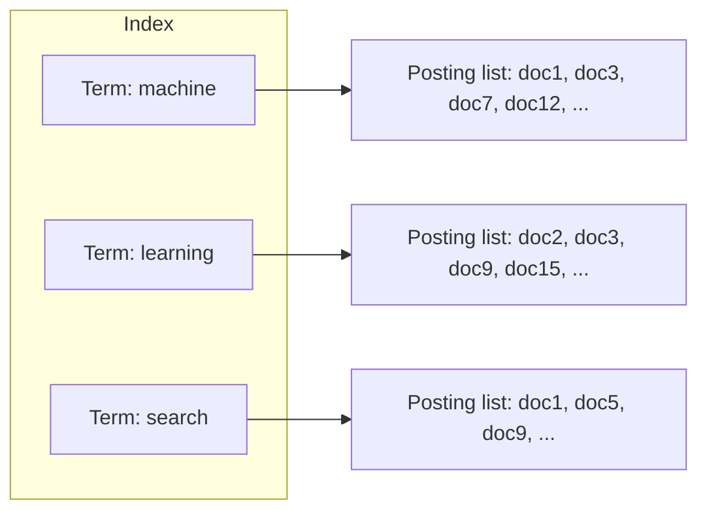
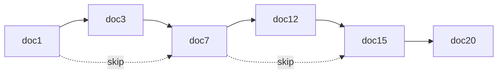
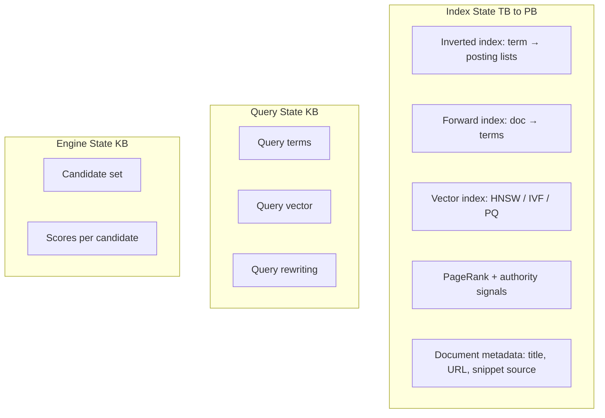
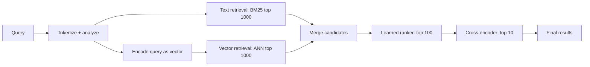
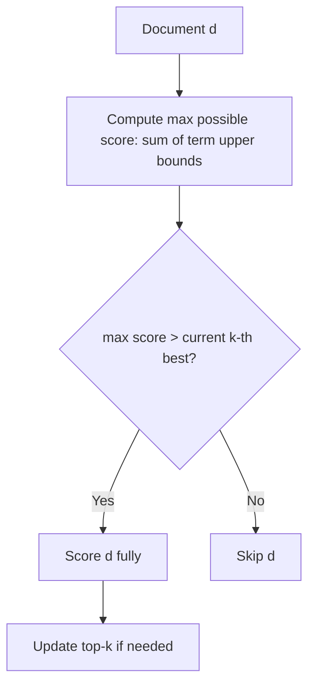
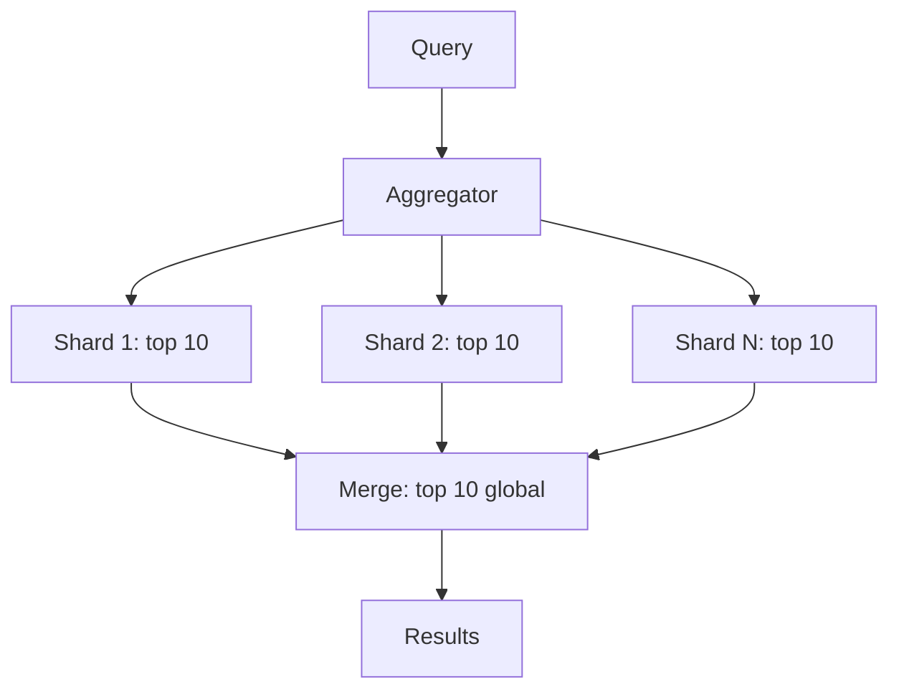
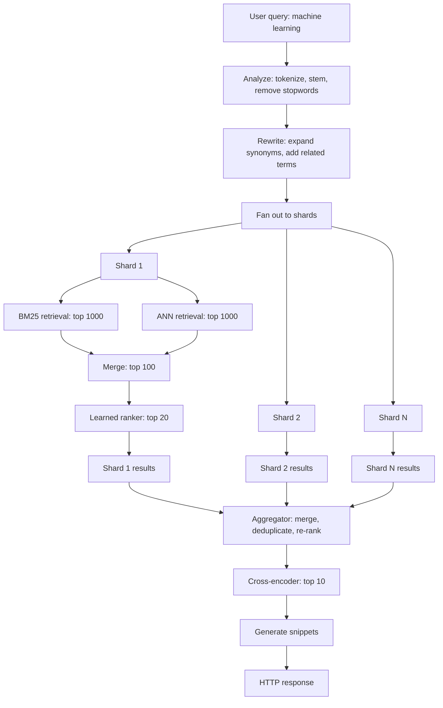

# 2. High-Scale Text and Vector Search Engines

> "Search engines are the largest engines ever built by humans. Google's index is over 100 billion documents; the search latency budget is 200 milliseconds. To serve this, the engine combines inverted indexes for term matching, vector indexes for semantic similarity, PageRank for authority, learned rankers for relevance, and dozens of caching layers — all running in parallel across thousands of machines."

Search engines are the second most studied engine domain (after chess) and the most commercially important. They differ from chess engines in that the search space is not a tree but a *collection of documents*, and the "intelligence" is not in tree search but in *relevance ranking*.

This note covers the architecture of modern search engines, including both the traditional text-retrieval path (inverted indexes, BM25) and the modern vector-retrieval path (embeddings, ANN).

---

## 2.1 State Representation

The search engine's state has two components: the *index* (large, persistent, slowly updated) and the *query* (small, transient, parsed per request).

### 2.1.1 Inverted Indexes — The Foundation

An **inverted index** maps each term to the list of documents that contain it. It is the data structure that makes text search fast — instead of scanning every document for a query term, we look up the term in the index and get the candidate documents directly.

**Posting list contents.** Each entry in a posting list typically contains:

- **Document ID** (4 bytes, delta-encoded).
- **Term frequency** in the document (1–2 bytes).
- **Positions** of the term in the document (variable, for phrase queries).

**Compression.** Posting lists are compressed to save space and improve cache behavior. The dominant encodings:

- **Elias-Fano encoding.** Encodes monotone sequences in $O(N \log (U/N))$ bits, where $N$ is the list length and $U$ is the universe size. Supports O(1) lookup of the k-th element and efficient next-element queries.
- **Roaring Bitmaps.** For sets of integers (typically document IDs). Hybrid encoding: bitmap for dense blocks, array for sparse blocks, run-length encoding for very dense blocks. Used in Lucene, Druid, Pilosa.
- **PFor-Delta (Patched Frame of Reference).** Packs integers into a small number of bits, with exception cases for outliers. Provides fast SIMD decoding.

**Index size.** For a typical web corpus, the compressed inverted index is 10–30% of the raw document size. For 100 billion documents averaging 10 KB each (1 PB raw), the index is ~100–300 TB.

### 2.1.2 Skip Lists and Other Index-on-Index Structures

To accelerate posting-list intersection (the core operation for Boolean queries), posting lists include **skip pointers** — pointers that allow the intersection algorithm to skip ahead in the list.

When intersecting two posting lists, if list A's current position is `doc3` and list B's current position is `doc7`, list A can use its skip pointer to jump directly to `doc7` (or the next skip target past `doc7`), avoiding the linear scan of `doc3 → doc7`.

Skip pointers reduce intersection from O(N + M) to roughly O(N/skip + M/skip + matches), where N and M are the list lengths.

### 2.1.3 Document Term Matrices

For some queries (e.g., "documents similar to this one"), we need to know all terms in a document, not just all documents containing a term. This is the *forward index* (as opposed to the inverted index, which is the *reverse index*).

The forward index is typically stored as a compressed list of (term ID, term frequency, positions) per document. It is much smaller than the inverted index (since we only need it for similarity computation, not search).

### 2.1.4 High-Dimensional Vector Databases

For semantic search, documents are encoded as **vector embeddings** — typically 128–1536-dimensional float vectors. These vectors are stored in a **vector index** that supports fast approximate nearest neighbor (ANN) search.

**Vector index structures:**

- **HNSW (Hierarchical Navigable Small World).** A multi-layer graph where each node is a vector, and edges connect similar vectors. Search descends from a sparse top layer to a dense bottom layer, achieving O(log N) lookup with high recall. Used in Faiss, Milvus, Pinecone.
- **IVF (Inverted File Index).** K-means clustering of vectors; each cluster has a centroid. Search finds the nearest centroids, then scans those clusters. O(N/k) lookup for k clusters.
- **PQ (Product Quantization).** Compresses vectors by splitting them into sub-vectors and quantizing each sub-vector independently. Reduces memory 10–100× with small accuracy loss.
- **ScaNN (Google).** Anisotropic quantization that preserves the directions of vectors (relevant for cosine similarity). State-of-the-art for many benchmarks.

**Index size.** A 768-dimensional float vector is 3 KB. For 1 billion documents, that is 3 TB — too large for a single machine. Vector indexes are typically sharded: each shard holds a subset of vectors, and queries are fanned out to all shards.

### 2.1.5 PageRank and Authority Signals

PageRank is a precomputed authority score for each document, based on the link graph. It is computed offline by iterating:

$$PR(p) = \frac{1-d}{N} + d \sum_{q \in \text{inlinks}(p)} \frac{PR(q)}{\text{outlinks}(q)}$$

where $d$ is the damping factor (typically 0.85) and $N$ is the number of documents. PageRank values are normalized to a 0–1 range and stored alongside document metadata.

Modern search engines use many authority signals beyond PageRank: domain age, link quality (not just quantity), user engagement (click-through rate, dwell time), and content freshness. These signals are combined into a single authority score per document.

### 2.1.6 State Compression Summary

The index is huge (terabytes) but read-only during query serving. The query state is tiny (kilobytes) and transient. The engine state (candidate set, scores) is moderate (kilobytes to megabytes).

---

## 2.2 Transition Function $F$

The search engine's $F$ is a **multi-stage cascade**: each stage filters the candidate set, applying progressively more expensive scorers.

### 2.2.1 Term Matching and Boolean Operations

The first stage takes the query terms and looks them up in the inverted index. The result is a set of candidate documents containing the query terms.

**Boolean operations:**

- `machine AND learning` → intersect posting lists for "machine" and "learning".
- `machine OR learning` → union posting lists.
- `machine NOT learning` → set difference.
- `"machine learning"` (phrase) → intersect posting lists, then check that the positions are consecutive in each document.

Posting list intersection is the most common operation. With skip pointers, it is O(N/skip + M/skip + matches).

### 2.2.2 TF-IDF and BM25 Relevance Scoring

**TF-IDF** (Term Frequency × Inverse Document Frequency) is the classic relevance score:

$$\text{TF-IDF}(t, d) = \text{TF}(t, d) \cdot \log \frac{N}{\text{DF}(t)}$$

where:
- $\text{TF}(t, d)$ is the term frequency in document $d$ (often log-normalized: $1 + \log \text{TF}$).
- $N$ is the total number of documents.
- $\text{DF}(t)$ is the number of documents containing $t$.

**BM25** is the modern refinement of TF-IDF, with saturation and length normalization:

$$\text{BM25}(t, d) = \text{IDF}(t) \cdot \frac{\text{TF}(t, d) \cdot (k_1 + 1)}{\text{TF}(t, d) + k_1 \cdot (1 - b + b \cdot \frac{|d|}{\text{avgdl}})}$$

where:
- $k_1$ is the term frequency saturation parameter (typically 1.2).
- $b$ is the length normalization parameter (typically 0.75).
- $|d|$ is the document length.
- $\text{avgdl}$ is the average document length.

BM25 is the standard text relevance score. Almost every search engine uses it (or a learned variant) as the first-pass scorer.

### 2.2.3 Cosine Similarity for Vector Search

For semantic search, the query is encoded as a vector $q$ (using the same encoder as the documents). The score for a document $d$ is the cosine similarity:

$$\text{sim}(q, d) = \frac{q \cdot d}{|q| \cdot |d|}$$

This is computed by the ANN index, which returns the top-k most similar documents to $q$.

### 2.2.4 Multi-Stage Cascade

A modern search engine combines text and vector retrieval in a cascade:

**Stage 1: Text retrieval (BM25).** Fast (~5 ms per shard). Returns ~1000 candidates.

**Stage 2: Vector retrieval (ANN).** Fast (~10 ms per shard). Returns ~1000 candidates.

**Stage 3: Merge.** Union the two candidate sets, deduplicate, re-score with BM25 + cosine similarity.

**Stage 4: Learned ranker.** A gradient-boosted tree model (e.g., XGBoost) or a small neural network that combines hundreds of features (BM25, cosine similarity, PageRank, freshness, personalization) into a single score. Returns top ~100.

**Stage 5: Cross-encoder.** A large transformer model (e.g., BERT) that scores each (query, document) pair jointly. Expensive (~1 ms per pair), so only run on the top ~100 candidates. Returns top 10.

This cascade pattern is the dominant architecture in modern search engines (Google, Bing, Elasticsearch with learned ranker plugins).

---

## 2.3 Dominant Optimizations

### 2.3.1 Pre-Computed Index Structures

The entire inverted index is precomputed. At query time, no scanning of documents happens — only lookups in the index and posting-list operations. This is what makes search engines fast.

### 2.3.2 PageRank Caching

PageRank values are static (updated monthly). They are stored in a flat array indexed by document ID, accessed in O(1). No computation per query.

### 2.3.3 Posting List Compression

Posting lists are compressed with Elias-Fano or Roaring Bitmaps. Compression:

- Reduces index size 5–10×.
- Improves cache behavior (more posting list entries per cache line).
- Enables SIMD-accelerated decoding.

### 2.3.4 Early Query Termination — WAND and MaxScore

When evaluating a multi-term query, not all documents need to be scored. **WAND** (Weak AND) skips documents that cannot possibly make the top-k:

WAND reduces scoring work by 10–100× for typical queries. **MaxScore** is a related algorithm with similar performance.

### 2.3.5 Query Result Caching

Frequent queries are cached. The cache is keyed by query string; the value is the full result set. Hit rates are typically 30–50% for web search.

Cache layers:
- **Browser cache.** Per-user, last result.
- **CDN cache.** Per-region, popular queries.
- **Application cache.** Per-datacenter, all queries.
- **Index server cache.** Per-shard, posting lists for frequent terms.

Multi-layer caching gives 100× effective throughput at the cost of cache coherence complexity.

### 2.3.6 Sharding and Distribution

The index is sharded across thousands of machines. Each shard holds a subset of documents and serves queries independently. A query is fanned out to all shards; results are merged by an aggregator.

Sharding is essential for scale: a single machine cannot serve 100 billion documents, but 10,000 machines each serving 10 million documents can.

### 2.3.7 ANN Index Optimization

For vector search, ANN indexes are tuned for the recall-latency trade-off:

- **HNSW.** Parameters: `M` (graph degree, typically 16), `efConstruction` (build-time search depth, typically 200), `efSearch` (query-time search depth, typically 50–200). Higher `efSearch` → higher recall, higher latency.
- **IVF.** Parameter: `nprobe` (number of clusters to scan, typically 8–64). Higher `nprobe` → higher recall, higher latency.

Typical benchmark: 1 billion vectors, 768 dimensions, recall@10 = 95%, latency = 5 ms.

### 2.3.8 Hardware Acceleration

- **GPUs** for vector search. Libraries like RAPIDS cuVS provide GPU-accelerated ANN, achieving 10–100× higher throughput than CPU.
- **TPUs** for cross-encoder inference. Google uses TPUs for BERT-based ranking.
- **FPGAs** for posting-list intersection. Some search infrastructures use FPGAs for the inner loop of posting-list operations.

---

## 2.4 The Query Lifecycle

A complete query lifecycle in a modern search engine:

Total latency budget: 200 ms (web search). Breakdown:
- Query analysis + rewrite: 5 ms.
- Shard fan-out + BM25 + ANN: 30 ms.
- Learned ranker: 50 ms.
- Aggregation + cross-encoder: 100 ms.
- Snippet generation + HTTP: 15 ms.

Every stage is engineered to fit within its budget. The cross-encoder is the most expensive, but only sees ~100 candidates per shard.

---

## 2.5 Common Pitfalls

### Pitfall 1: Mismatched Normalization

If queries are normalized differently from documents (e.g., queries are lowercased but documents are not, or queries are stemmed but documents are not), search will fail. The normalization code must be identical between indexing and querying.

### Pitfall 2: Posting List Compression Bugs

A bug in compression/decompression corrupts the index. Symptoms: wrong results, crashes on certain queries. Mitigation: fuzz-test the codec; verify round-trip correctness.

### Pitfall 3: Stale Caches

If results are cached but the underlying index is updated (e.g., a document is removed), the cache may serve stale results. Mitigation: cache invalidation on index updates; versioned cache keys.

### Pitfall 4: Sharding Imbalance

If documents are not evenly distributed across shards (e.g., one shard has all the popular documents), some shards become hot spots. Mitigation: hash-based sharding (uniform distribution); load-aware re-sharding.

### Pitfall 5: Vector Index Drift

If documents are added but the vector index is not updated, semantic search returns stale results. Mitigation: incremental index updates; periodic full rebuilds.

### Pitfall 6: Cold-Start for New Documents

A new document has no PageRank, no click-through history, no engagement signals. It will rank low even if it is highly relevant. Mitigation: freshness boost for new documents; exploration of new content.

### Pitfall 7: Query Understanding Failures

Some queries are ambiguous ("jaguar" — the car or the animal?). Without query understanding (disambiguation), the engine may return mixed results. Mitigation: query classification; user-context-aware ranking.

### Pitfall 8: Latency Spikes

If one shard is slow (e.g., garbage collection, disk I/O), the entire query waits for it. Mitigation: hedged requests (send to two shards, take the first response); per-shard latency monitoring with automatic re-sharding of slow shards.

---

## 2.6 Important Reminders

- **Inverted index is the foundation of text search.** All fast text search uses it.
- **BM25 is the standard relevance score.** Use it (or a learned variant) as your first-pass scorer.
- **Vector search complements text search, not replaces it.** Hybrid retrieval (text + vector) outperforms either alone.
- **Multi-stage cascade is the dominant architecture.** Cheap scorers on many candidates, expensive scorers on few.
- **Caching is essential.** 30–50% hit rate is typical; without caching, the engine cannot serve the load.
- **Sharding is mandatory at scale.** No single machine can serve a large index.
- **WAND/MaxScore for early termination.** 10–100× speedup for multi-term queries.
- **Snippet generation is expensive.** Cache snippets.
- **Latency budget must be engineered per stage.** No stage can exceed its budget.

---

## 2.7 Summary

Search engines combine inverted indexes for text retrieval, vector indexes for semantic retrieval, PageRank for authority, learned rankers for relevance, and cross-encoders for final ranking. The architecture is a multi-stage cascade: each stage filters the candidate set, applying progressively more expensive scorers.

The state is dominated by the index (terabytes), which is read-only at query time. The query state is small and transient. The transition function $F$ is the cascade of stages, each optimized for its specific role.

Optimizations include precomputed index structures, posting-list compression, early query termination (WAND), multi-layer caching, sharding, and hardware acceleration (GPUs, TPUs).

The search engine architecture maps cleanly onto the six-layer model, with the multi-stage cascade being the distinctive feature of the transition function layer.

---

**Previous note:** [[1. Chess and Adversarial Gaming Engines]]
**Next note:** [[3. High-Frequency and Algorithmic Trading Engines]]
