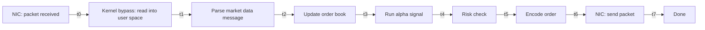
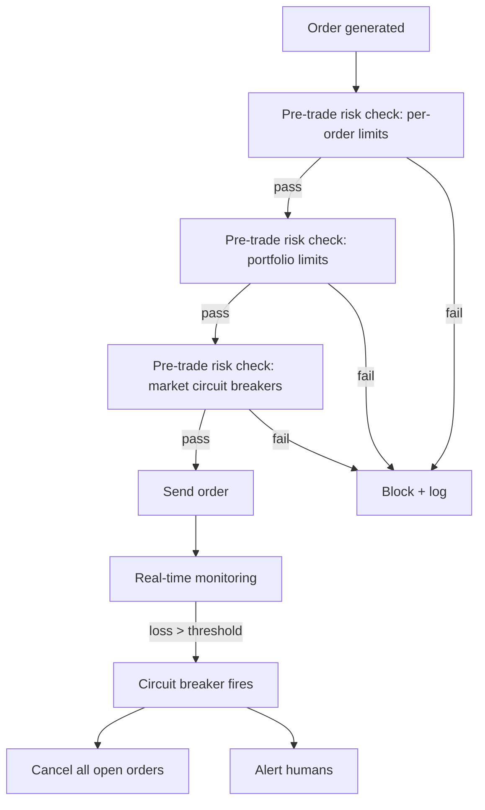

# 3. High-Frequency and Algorithmic Trading Engines

> "Trading engines operate at the extreme edge of engine engineering. Where a chess engine is happy with millisecond latency, a trading engine measures itself in microseconds — and a 1 μs improvement can be worth millions of dollars per year. Every layer of the architecture is pushed to hardware limits: kernel bypass for networking, lock-free ring buffers for concurrency, cache-line-aligned data structures, and hand-tuned assembly for the hot path."

Trading engines are the most latency-sensitive engines in production. They differ from other engines in two ways: (1) the input is a continuous stream of market events, not discrete queries; (2) the output is real-world money movement, where errors are catastrophically expensive.

This note covers the architecture of modern trading engines, with emphasis on the techniques that achieve microsecond-level end-to-end latency.

---

## 3.1 State Representation

The trading engine's state is dominated by the **order book** — the current state of all outstanding buy and sell orders for each traded instrument.

### 3.1.1 L1, L2, L3 Order Book Arrays

The order book has three levels of granularity:

- **L1 (Level 1):** Top of book only — best bid price + size, best ask price + size. Updated on every trade.
- **L2 (Level 2):** All price levels, with aggregated size per level. Updated on every order add/modify/cancel.
- **L3 (Level 3):** All individual orders at every price level. Updated on every order event.

L1 is what retail traders see. L2 is what most professional traders use. L3 is available only on certain exchanges (e.g., NASDAQ TotalView) and is the gold standard for HFT.

**L2 representation:**

```c
struct PriceLevel {
    int32_t price;        // in ticks (e.g., $0.01 = 1 tick)
    int32_t size;          // in shares
    int32_t order_count;   // number of orders at this level
};

struct OrderBook {
    PriceLevel bids[MAX_LEVELS];  // sorted descending by price
    PriceLevel asks[MAX_LEVELS];  // sorted ascending by price
    int32_t bid_count;
    int32_t ask_count;
    int32_t best_bid;              // index into bids
    int32_t best_ask;              // index into asks
};
```

With MAX_LEVELS = 100 and 16 bytes per level, the order book is 3.2 KB — fits in L1 cache (32 KB). This is essential: every market data update touches the book, and a cache miss would blow the latency budget.

### 3.1.2 Outstanding Inventory Metrics

The engine tracks its own outstanding orders and positions:

```c
struct Position {
    int32_t instrument_id;
    int64_t quantity;       // signed: positive = long, negative = short
    int64_t realized_pnl;   // cumulative realized P&L
    int64_t unrealized_pnl; // current unrealized P&L
    int64_t avg_price;      // average entry price
};

struct OutstandingOrder {
    uint64_t client_order_id;
    int32_t instrument_id;
    int32_t side;            // BUY or SELL
    int32_t quantity;
    int32_t filled_quantity;
    int32_t price;
    int32_t venue_id;
    OrderState state;        // PENDING, ACKNOWLEDGED, PARTIALLY_FILLED, FILLED, CANCELED, REJECTED
};
```

Positions are stored in a flat array indexed by instrument ID (~32 bytes per instrument). Outstanding orders are stored in a hash map by client order ID, with secondary indices by instrument and by venue.

### 3.1.3 Account Risk Limits

Risk limits are pre-loaded at startup and checked on every order:

```c
struct RiskLimits {
    int64_t max_position_per_instrument;
    int64_t max_gross_exposure;
    int64_t max_net_exposure;
    int64_t max_order_size;
    int64_t max_orders_per_second;
    int64_t max_daily_loss;
    // ... many more
};
```

These are immutable during trading (changes require a restart). Stored in a single struct, ~256 bytes, always in cache.

### 3.1.4 Latency Measurements

The engine tracks its own latency at every stage:



Each transition is timestamped with a high-resolution clock (`RDTSC` on x86, ~10 ns resolution). The engine exposes these latencies for monitoring and alerting.

---

## 3.2 Transition Function $F$

The trading engine's $F$ is an **event-driven reactive loop** — not a tree search like chess. Each market event triggers a single decision: send an order, modify an order, cancel an order, or do nothing.

### 3.2.1 Alpha Signal Calculation

The alpha signal is the engine's prediction of future price movement. It is typically a weighted sum of features:

```python
def alpha_signal(state, context):
    signal = 0
    # Microstructure features
    signal += 0.3 * order_book_imbalance(state.order_book)
    signal += 0.2 * trade_flow_imbalance(state.recent_trades)
    signal += 0.1 * spread_signal(state.order_book)
    
    # Statistical features
    signal += 0.15 * mean_reversion_signal(state, context.lookback)
    signal += 0.1 * momentum_signal(state, context.lookback)
    
    # Learned features
    signal += 0.15 * ml_model.predict(state.feature_vector)
    
    return signal  # positive = buy signal, negative = sell signal
```

Features are computed incrementally — only the features affected by the latest market data update are recomputed, not the entire feature vector. This is essential for sub-microsecond signal generation.

### 3.2.2 Real-Time Risk Validation

Before any order is sent, risk checks are performed:

```python
def risk_check(order, state, context):
    # Position limit check
    new_position = state.positions[order.instrument_id].quantity + order.quantity * order.side
    if abs(new_position) > context.risk_limits.max_position_per_instrument:
        return False
    
    # Exposure limit check
    new_exposure = compute_gross_exposure(state, order)
    if new_exposure > context.risk_limits.max_gross_exposure:
        return False
    
    # Order size check
    if order.quantity > context.risk_limits.max_order_size:
        return False
    
    # Order rate check
    if context.orders_sent_this_second >= context.risk_limits.max_orders_per_second:
        return False
    
    # Daily loss check
    if state.realized_pnl_today < -context.risk_limits.max_daily_loss:
        return False
    
    return True
```

Risk checks must be **fast** (~50 ns) and **never fail to fire**. They are the last line of defense against runaway algorithms. Every check is implemented as a simple comparison; no memory allocation, no I/O, no exceptions.

### 3.2.3 Smart Order Routing (SOR)

When multiple trading venues are available, SOR decides where to send each order:

```python
def smart_order_route(order, state, context):
    venues = context.venues_for_instrument[order.instrument_id]
    best_venue = None
    best_score = -INF
    for venue in venues:
        venue_state = state.venue_states[venue.id]
        score = 0
        score += venue_state.liquidity_score(order)
        score -= venue_state.fee_cost(order)
        score -= venue_state.latency_penalty()
        if score > best_score:
            best_score = score
            best_venue = venue
    return best_venue
```

SOR considers liquidity (will the order fill?), fees (how much does the venue charge?), and latency (how quickly will the venue acknowledge?).

### 3.2.4 Execution Logic

The execution logic decides the order type (market, limit, pegged, iceberg) and parameters:

```python
def execute(signal, state, context):
    if abs(signal) < context.min_signal_threshold:
        return None  # signal too weak, do nothing
    
    instrument = state.focus_instrument
    quantity = compute_order_size(signal, state, context)
    
    if signal > 0:  # buy
        price = state.order_books[instrument].best_ask - context.tick_offset
        order = Order(BUY, instrument, quantity, price, LIMIT)
    else:  # sell
        price = state.order_books[instrument].best_bid + context.tick_offset
        order = Order(SELL, instrument, quantity, price, LIMIT)
    
    if not risk_check(order, state, context):
        return None
    
    venue = smart_order_route(order, state, context)
    send_order(order, venue, context)
    return order
```

The execution logic typically uses **limit orders** at the top of book (for maker rebates) or **marketable limit orders** (for immediate fills). The choice depends on the strategy: market-making strategies prefer passive limit orders; momentum strategies prefer aggressive marketable orders.

### 3.2.5 The Full Event Loop

```python
def event_loop(state, context):
    while True:
        event = context.event_queue.pop()  # blocking, but uses busy-polling
        
        if event.type == MARKET_DATA:
            update_order_book(state, event)
            update_features(state, event)
            signal = alpha_signal(state, context)
            execute(signal, state, context)
        
        elif event.type == ORDER_ACK:
            update_outstanding_orders(state, event)
        
        elif event.type == ORDER_FILL:
            update_positions(state, event)
            update_pnl(state, event)
            check_circuit_breakers(state, context)
        
        elif event.type == ORDER_REJECT:
            handle_rejection(state, event)
        
        elif event.type == TIMER:
            check_timeouts(state, context)
            rebalance_portfolio(state, context)
```

The loop is **single-threaded** for the hot path (market data → decision → order). Multi-threading introduces contention and unpredictable latency. Parallelism is achieved by running multiple instances of the engine on different instruments, each pinned to a dedicated core.

---

## 3.3 Dominant Optimizations

### 3.3.1 Kernel Bypass Networking

The standard Linux network stack adds microseconds of latency: syscall to `recv()`, copy from kernel to user space, protocol processing. For HFT, this is unacceptable.

**Kernel bypass solutions:**

- **Solarflare OpenOnload.** A user-space TCP/IP stack that bypasses the kernel for supported NICs. ~1 μs latency improvement.
- **DPDK (Data Plane Development Kit).** A framework for user-space packet processing. The application receives packets directly from the NIC's receive ring, bypassing the kernel entirely. ~5 μs latency improvement.
- **Linux AF_XDP.** A newer Linux native technology for kernel bypass. Similar performance to DPDK but with kernel integration.
- **RDMA (Remote Direct Memory Access).** For machine-to-machine communication, RDMA allows one machine to read/write another machine's memory without involving either CPU. Used for inter-shard communication in distributed trading systems.

The end result: a packet can travel from the NIC to the application's user-space buffer in ~500 ns, vs. ~5 μs with the standard kernel stack.

### 3.3.2 Single-Digit Microsecond Event Loops

The event loop is **busy-polling** — it spins on the NIC's receive ring, never blocking. This eliminates the ~1 μs wakeup latency of `epoll_wait` or `select`.

```c
while (true) {
    while (nic_rx_ring_empty(nic)) {
        // spin, no sleep
        // optionally: pause instruction to reduce power consumption
        __builtin_ia32_pause();
    }
    process_packet(nic_rx_ring_pop(nic));
}
```

The trade-off: the CPU is 100% utilized even when idle. This is acceptable in HFT, where latency matters more than power consumption.

### 3.3.3 Flat Lock-Free Ring Buffers (Disruptor Pattern)

The Disruptor pattern (Martin Thompson, LMAX) is a single-producer-single-consumer ring buffer with no locks:

```c
struct RingBuffer {
    Cell cells[SIZE];  // power-of-2 size
    alignas(64) std::atomic<uint64_t> cursor;
    alignas(64) std::atomic<uint64_t> consumer_cursor;
};

void publish(RingBuffer* rb, const Cell* cell) {
    uint64_t pos = rb->cursor.load(std::memory_order_relaxed);
    rb->cells[pos & (SIZE - 1)] = *cell;
    rb->cursor.store(pos + 1, std::memory_order_release);
}

bool consume(RingBuffer* rb, Cell* out) {
    uint64_t pos = rb->consumer_cursor.load(std::memory_order_relaxed);
    if (pos >= rb->cursor.load(std::memory_order_acquire)) {
        return false;  // empty
    }
    *out = rb->cells[pos & (SIZE - 1)];
    rb->consumer_cursor.store(pos + 1, std::memory_order_relaxed);
    return true;
}
```

The `alignas(64)` ensures the cursor and consumer_cursor are on separate cache lines, avoiding false sharing between the producer and consumer threads.

The Disruptor achieves ~10 ns per event handoff, vs. ~1 μs for a `std::mutex`-protected queue.

### 3.3.4 Hardware-Level Instruction Alignment

The hot path is hand-tuned at the assembly level:

- **Function inlining.** Every function on the hot path is inlined to avoid call overhead.
- **Branchless code.** Branches that depend on market data are unpredictable; branchless alternatives (conditional moves, arithmetic) avoid misprediction penalties.
- **Cache-line alignment.** Hot data structures are aligned to 64-byte boundaries.
- **Prefetching.** Data that will be needed soon is prefetched with `__builtin_prefetch`.
- **No heap allocation in hot path.** All memory is pre-allocated at startup.
- **No exceptions in hot path.** Exceptions are 1000× slower than return codes; disabled or avoided entirely.

### 3.3.5 Co-Location and Network Optimization

- **Co-location.** Trading servers are placed in the same datacenter as the exchange's matching engine. This reduces network latency from milliseconds (cross-country) to microseconds (same building).
- **Direct cross-connects.** Fiber optic cables run directly from the trading server to the exchange's switch, bypassing any intermediate routers.
- **Microwave links.** For inter-exchange communication (e.g., Chicago to New York), microwave links are faster than fiber (light travels faster in air than in glass). Saves ~1 ms on a 12 ms route.
- **Custom NIC firmware.** Some firms use FPGAs on the NIC to do market data parsing and order generation in hardware, achieving nanosecond-level latency.

### 3.3.6 Time Synchronization

Every event is timestamped with nanosecond precision. To be meaningful, all servers' clocks must be synchronized:

- **PTP (Precision Time Protocol).** IEEE 1588 standard for sub-microsecond clock synchronization over LAN.
- **GPS receivers.** Each server has a GPS receiver for absolute time reference.
- **Hardware timestamping.** The NIC timestamps packets as they arrive, before the CPU sees them. Eliminates the variability of CPU-side timestamping.

Without precise time synchronization, latency measurements are meaningless and event ordering is ambiguous.

---

## 3.4 Risk Management and Circuit Breakers

Trading engines have multiple layers of risk management:



**Risk check layers:**

1. **Per-order limits.** Maximum order size, maximum order rate.
2. **Per-instrument limits.** Maximum position, maximum exposure.
3. **Portfolio limits.** Maximum gross exposure, maximum net exposure, maximum daily loss.
4. **Market circuit breakers.** If the market moves > X% in Y seconds, stop trading (this is a market-wide rule, not just for the engine).
5. **Self-trading prevention.** Detect if the engine is about to trade with itself; block such orders.

**Circuit breakers** are the engine's emergency stop. If the engine detects that something is very wrong (e.g., losing money faster than a threshold), the circuit breaker fires: cancel all open orders, alert humans, freeze the engine.

Circuit breakers must be:
- **Independent of the main engine.** If the engine is buggy, the circuit breaker must still work.
- **Conservative.** Better to trip falsely than to fail to trip.
- **Tested.** Simulate the conditions that should trip the breaker; verify it trips.

---

## 3.5 Common Pitfalls

### Pitfall 1: Allocating in the Hot Path

Every `malloc` in the hot path is a 50–200 ns tax. Pre-allocate everything at startup; use arenas and pools; never allocate in the hot loop.

### Pitfall 2: Locks on the Hot Path

Every lock acquisition is a 20–50 ns tax (best case); contention can push it to microseconds. Use lock-free data structures on the hot path; reserve locks for cold paths (configuration, monitoring).

### Pitfall 3: Unpredictable Latency

Garbage collection (in managed languages), page faults (for unmapped memory), and TLB misses all cause unpredictable latency spikes. Use unmanaged languages (C, C++, Rust); pre-fault all memory at startup; use huge pages to reduce TLB pressure.

### Pitfall 4: Clock Drift

If different servers' clocks drift, event ordering becomes ambiguous, and latency measurements become meaningless. Use PTP for synchronization; monitor drift continuously; alert if drift exceeds a threshold.

### Pitfall 5: Stale Order Books

If the order book update is delayed (e.g., due to a network hiccup), the engine trades on stale data and loses money. Mitigation: detect stale data (compare timestamps; if the latest update is > N μs old, pause trading); redundancy (receive the same feed from multiple sources).

### Pitfall 6: Self-Trading

If the engine's buy and sell orders match each other, the engine loses money (fees) without changing its position. Mitigation: explicit self-trade prevention checks in the execution logic.

### Pitfall 7: Network Congestion on the Send Side

If the engine sends orders faster than the network can transmit them, the send buffer fills and latency spikes. Mitigation: rate-limiting at the application level; monitor send buffer depth.

### Pitfall 8: Over-Optimizing the Wrong Thing

Engineers often optimize the parts that are easy to measure (e.g., the alpha signal computation) while ignoring the parts that dominate (e.g., the NIC-to-application path). Profile end-to-end, then optimize the longest segment.

### Pitfall 9: Insufficient Testing in Production-Like Conditions

An engine that works perfectly in development may fail in production due to different network conditions, market data rates, or hardware. Test in production-like conditions (real NIC, real market data replay, real co-location) before going live.

### Pitfall 10: Not Having a Kill Switch

If the engine goes rogue, humans must be able to stop it instantly. Have a physical kill switch (a big red button) that immediately cancels all orders and freezes the engine.

---

## 3.6 Important Reminders

- **Latency is everything.** Every microsecond has a dollar value.
- **Single-threaded hot path.** Multi-threading introduces contention and unpredictable latency.
- **Lock-free data structures on the hot path.** Locks are too slow.
- **Kernel bypass for networking.** The kernel network stack is too slow.
- **Busy-polling event loops.** Blocking is too slow.
- **Pre-allocate all memory.** Allocation is too slow.
- **Risk checks on every order.** No exceptions.
- **Circuit breakers and kill switches.** Always have an emergency stop.
- **Time synchronization to nanoseconds.** PTP + GPS.
- **Co-locate with the exchange.** Network distance is latency.
- **Test in production-like conditions.** Development tests miss production failures.
- **End-to-end profiling.** Optimize the longest segment, not the easiest one.

---

## 3.7 Summary

Trading engines are the most latency-sensitive engines in production. They use kernel bypass networking (DPDK, OpenOnload), single-threaded busy-polling event loops, lock-free ring buffers (Disruptor pattern), cache-line-aligned data structures, and hand-tuned assembly for the hot path.

The state is dominated by the order book (L2/L3), which must fit in L1 cache for sub-microsecond access. The transition function $F$ is an event-driven reactive loop: each market event triggers alpha signal generation, risk checks, smart order routing, and order execution.

Risk management is multi-layered (per-order, per-instrument, portfolio, market, self-trading) with circuit breakers and kill switches as the last line of defense.

Trading engines exemplify the hardware-centric mindset from Chapter 1: every decision is made with the hardware in mind, and the engine is engineered around CPU cycles, cache lines, and network packets rather than algorithms and abstractions.

---

**Previous note:** [[2. High-Scale Text and Vector Search Engines]]
**Next note:** [[4. Parser Compiler and Verification Engines]]
