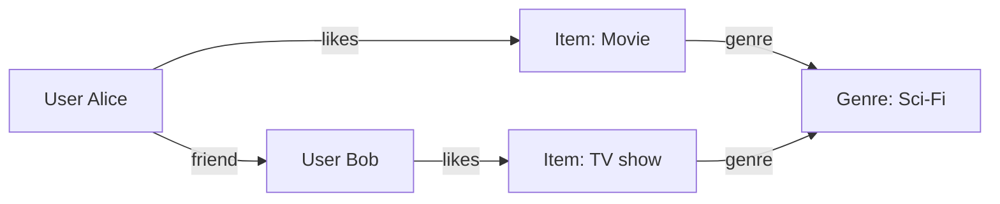
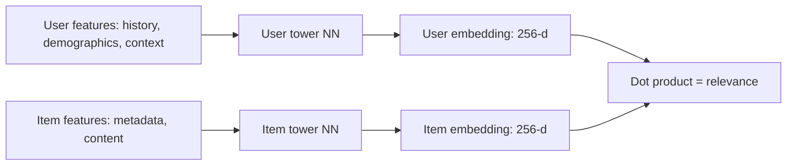
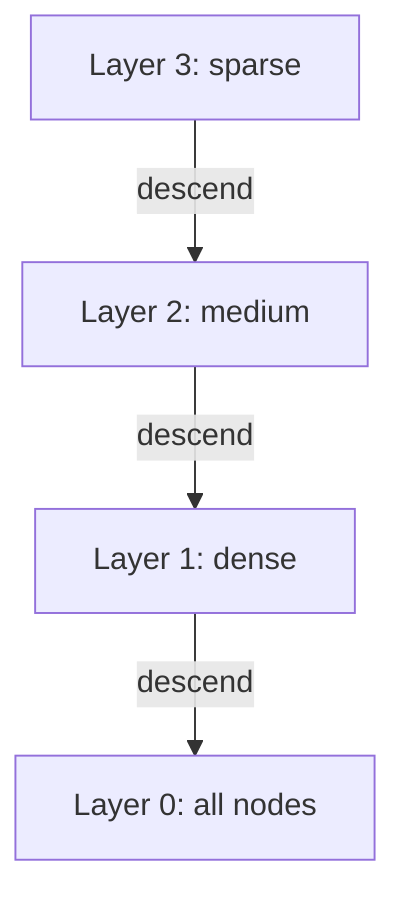

# 5. Recommendation and Matching Engines

> "Recommendation engines are the youngest of the five engine domains and the most data-driven. Where a chess engine's intelligence lives in alpha-beta search and a search engine's intelligence lives in the inverted index, a recommendation engine's intelligence lives in *learned embeddings* — vectors that capture the latent preferences of users and the latent properties of items. The engine's job is to find, in a space of millions of items, the few that a particular user will engage with."

Recommendation engines power the "for you" feeds of TikTok, YouTube, Netflix, Amazon, Spotify, and dozens of other consumer products. They differ from search engines in that the user does not express an explicit query — the engine must *infer* what the user wants from their past behavior.

This note covers the architecture of modern recommendation engines, with emphasis on the embedding-based retrieval that dominates the field.

---

## 5.1 State Representation

The recommendation engine's state has three components: **user profiles**, **item profiles**, and the **interaction matrix** that records which users have interacted with which items.

### 5.1.1 User Profile Vectors

Each user is represented by a **vector embedding** — a fixed-length vector of floats (typically 64–256 dimensions) that captures the user's latent preferences.

```c
struct UserEmbedding {
    float values[256];  // 1 KB per user
};
```

The embedding is learned from the user's past interactions: items they have clicked, liked, purchased, dwelled on, skipped. The learning algorithm (typically matrix factorization, two-tower neural networks, or graph neural networks) adjusts the embedding to predict the user's interactions.

For 100 million users with 256-dimensional embeddings, total storage is 100 GB — too large for a single machine, so embeddings are sharded across machines.

### 5.1.2 Item Profile Vectors

Each item is similarly represented by an embedding, learned to predict which users will interact with it.

```c
struct ItemEmbedding {
    float values[256];  // 1 KB per item
};
```

For 100 million items, total storage is 100 GB, also sharded.

### 5.1.3 Interaction Matrices

The interaction matrix records which users have interacted with which items. It is **extremely sparse** — even a power user interacts with at most ~10,000 items, out of millions. The matrix is stored in sparse format: a list of (user_id, item_id, interaction_type, timestamp) tuples, partitioned by user.

```c
struct Interaction {
    uint32_t user_id;
    uint32_t item_id;
    InteractionType type;  // VIEW, LIKE, PURCHASE, SKIP, etc.
    uint64_t timestamp;
};
```

For 100 million users with 1,000 interactions each, total storage is ~1 TB. Stored in a columnar format (e.g., Parquet) for efficient analytics; the most recent interactions are cached in memory for fast retrieval.

### 5.1.4 Graph Databases for Relational Data

Some recommendation engines use a **graph database** to model relationships: users, items, friends, categories, tags, etc. Graph queries (e.g., "find items liked by friends of this user") are natural in this representation.



Graph databases (Neo4j, JanusGraph) provide efficient graph traversal, but are slower than embedding-based retrieval for the main recommendation flow. They are typically used for *side information* that augments the embedding-based score.

---

## 5.2 Transition Function $F$

The recommendation engine's $F$ is a **multi-stage funnel**: each stage reduces the candidate set by orders of magnitude.

```mermaid
flowchart LR
    U[User request] --> R[Retrieval: 10M → 1000 candidates]
    R --> F[Filtering: 1000 → 500]
    F --> CF[Coarse scoring: 500 → 100]
    CF --> FS[Fine scoring: 100 → 30]
    FS → RR[Re-ranking: 30 → 10]
    RR → O[Output: top 10 recommendations]
```

### 5.2.1 Candidate Generation (Filtering / Retrieval)

The first stage retrieves a large set of candidate items, typically using **approximate nearest neighbor (ANN)** search over the item embedding space.

```python
def retrieve_candidates(user_embedding, item_index, k=1000):
    # ANN search: find k items whose embedding is closest to user_embedding
    candidate_ids, similarities = item_index.search(user_embedding, k)
    return candidate_ids
```

The item index is an **HNSW graph** (Hierarchical Navigable Small World) or an **IVF index** (Inverted File Index with k-means clustering). Both provide O(log N) lookup with high recall.

**Two-tower retrieval.** A common architecture: one neural network ("tower") encodes the user into an embedding; another encodes the item into an embedding. The dot product of the two embeddings is the relevance score. Item embeddings are pre-computed and indexed; user embeddings are computed at request time.



### 5.2.2 Collaborative Filtering

**Collaborative filtering** is the classical recommendation algorithm: "users who liked this also liked..." It predates the embedding-based approach but is still used, often as a complementary signal.

**User-based CF.** Find users similar to the target user; recommend items they liked that the target user has not seen.

**Item-based CF.** Find items similar to those the target user liked; recommend them.

The similarity metric is typically cosine similarity or Pearson correlation, computed over the interaction matrix. Pre-computed for the most popular users/items; computed on-the-fly for the rest.

### 5.2.3 Deep Retrieval

Modern recommendation engines use **deep retrieval** — a learned model that retrieves candidates directly, without an explicit ANN index. The model is trained to map user features to a list of item IDs, using a softmax output layer over the entire item vocabulary.

```python
class DeepRetrieval(nn.Module):
    def __init__(self, num_items, embedding_dim):
        self.user_encoder = UserEncoder(...)
        self.item_embeddings = nn.Embedding(num_items, embedding_dim)
    
    def forward(self, user_features):
        user_emb = self.user_encoder(user_features)
        # Compute scores against all items
        scores = user_emb @ self.item_embeddings.weight.T
        return scores  # shape: (batch_size, num_items)
```

At training time, the model is trained with softmax cross-entropy over all items. At inference time, the scores are computed via ANN search over the item embeddings (avoiding the O(num_items) full softmax).

**Variants:**

- **DSSM (Deep Structured Semantic Model).** Microsoft's architecture, predates two-tower.
- **MIND (Multi-Interest Network with Dynamic Routing).** Captures multiple interests per user (a user may like both sci-fi movies and cooking shows).
- **MoIRa (Mixture of Interest Retrieval).** Allocates candidates across multiple interest clusters.

### 5.2.4 Multi-Stage Scoring

After retrieval produces ~1000 candidates, a cascade of scorers reduces them to ~10:

```mermaid
flowchart LR
    C[Candidates: 1000] --> S1[Coarse scorer: 1000 → 500]
    S1 --> S2[Medium scorer: 500 → 100]
    S2 --> S3[Fine scorer: 100 → 30]
    S3 → S4[Re-ranker: 30 → 10]
    S4 → R[Final recommendations]
```

**Coarse scorer.** A simple model (logistic regression or shallow neural network) with hundreds of features. Runs in ~1 ms per candidate. Filters out clearly-irrelevant items.

**Medium scorer.** A deeper model with thousands of features. Runs in ~5 ms per candidate. Reranks the survivors.

**Fine scorer.** A large transformer model that processes the user's full interaction history. Runs in ~50 ms per candidate. Only run on the top ~100.

**Re-ranker.** Applies business logic (diversity, freshness, fairness, exploration). May also use reinforcement learning to optimize long-term engagement rather than immediate click-through.

### 5.2.5 The Full Pipeline

```python
def recommend(user, context):
    # Stage 1: Compute user embedding
    user_emb = user_tower(user.features, context)
    
    # Stage 2: Retrieve candidates via ANN
    candidates = item_ann_index.search(user_emb, k=1000)
    
    # Stage 3: Filter out already-interacted items
    candidates = [c for c in candidates if c not in user.history]
    
    # Stage 4: Multi-stage scoring
    candidates = coarse_scorer(candidates, user)
    candidates = medium_scorer(candidates, user)
    candidates = fine_scorer(candidates, user)
    
    # Stage 5: Re-ranking
    final = re_ranker(candidates, user, context)
    
    return final[:10]
```

The total latency budget is typically 100–200 ms. Retrieval (ANN) is ~10 ms; multi-stage scoring is ~80 ms; re-ranking is ~10 ms.

---

## 5.3 Dominant Optimizations

### 5.3.1 Approximate Nearest Neighbor (ANN) Search

The dominant optimization for retrieval. Exact nearest neighbor is O(N) per query — infeasible for N = 100 million. ANN reduces this to O(log N) with a small recall loss.

**HNSW (Hierarchical Navigable Small World).** A multi-layer graph where each node is an item, and edges connect similar items. The top layer is sparse; the bottom layer is dense. Search starts at the top layer and descends, achieving O(log N) lookup with ~95% recall@10.



**IVF (Inverted File Index).** K-means clustering of items; each cluster has a centroid. At query time, find the nearest centroids, then scan those clusters. With k clusters and nprobe clusters scanned per query, the cost is O(nprobe × N/k).

**PQ (Product Quantization).** Compresses embeddings by splitting them into sub-vectors and quantizing each sub-vector independently. Reduces memory 10–100× with small accuracy loss. Used when the full embedding set does not fit in memory.

**ScaNN (Google).** Anisotropic quantization that preserves the directions of vectors (relevant for cosine similarity). State-of-the-art for many benchmarks.

### 5.3.2 Sharded Similarity Scoring

For very large item sets (billions), the ANN index is sharded across multiple machines. The query is fanned out to all shards; each shard returns its top-k candidates; the results are merged globally.

```mermaid
flowchart TB
    Q[User query] --> SH1[Shard 1: top 100]
    Q --> SH2[Shard 2: top 100]
    Q --> SHN[Shard N: top 100]
    SH1 --> M[Merge: global top 100]
    SH2 --> M
    SHN --> M
    M → SC[Scoring]
```

Sharding is essential for scale. A single machine cannot serve 100 million items at low latency; 100 machines each serving 1 million items can.

### 5.3.3 Inference-Optimized Model Deployments

The fine scorer is a large neural network, typically a transformer. Inference must be fast (~50 ms per candidate × 100 candidates = 5 seconds per query — too slow without optimization).

**Optimizations:**

- **Batching.** Process multiple candidates in parallel through the model. Reduces per-candidate cost by 10–100×.
- **Quantization.** Use 8-bit integers instead of 32-bit floats. Reduces memory 4× and speeds up inference 2–4×.
- **Distillation.** Train a smaller "student" model to mimic a larger "teacher" model. The student is faster at inference.
- **Hardware acceleration.** Use GPUs or TPUs for inference. Provides 10–100× speedup over CPU.
- **Caching.** Cache the output of the user tower (the user embedding) for the duration of a session. Avoids recomputing the same embedding for every recommendation request.

### 5.3.4 Real-Time Feature Computation

Many features depend on the user's recent behavior (last 10 clicks, last 5 minutes of activity). These features must be computed in real time, not pre-computed.

**Streaming architecture:**

```mermaid
flowchart LR
    E[User event: click, view] --> S[Stream processor: Flink / Spark Streaming]
    S → AGG[Aggregate: last 10 clicks, session count, etc.]
    AGG → FS[Feature store: Redis / Aerospike]
    FS → REC[Recommendation engine reads features]
```

The stream processor (Apache Flink, Spark Streaming) consumes user events in real time, computes features, and writes them to a low-latency feature store (Redis, Aerospike). The recommendation engine reads from the feature store at query time.

**Latency:** ~50 ms from event to feature update. The recommendation engine sees the user's recent behavior within ~100 ms of the event happening.

### 5.3.5 A/B Testing and Online Learning

Recommendation engines are constantly A/B tested: a fraction of users see the experimental model; the rest see the production model. Metrics (click-through rate, watch time, retention) are compared.

**Online learning.** Some engines update their models in real time, using the user's most recent interactions to adjust the user's embedding. This allows the engine to respond to changes in user interest within a session.

**Multi-armed bandits.** For exploration (showing the user items they might like but have not tried), multi-armed bandit algorithms balance exploration (try new items) and exploitation (recommend known-good items).

---

## 5.4 Common Pitfalls

### Pitfall 1: Filter Bubbles

If the engine only recommends items similar to those the user has liked before, the user gets stuck in a "filter bubble" — they see only content that confirms their existing preferences. Mitigation: inject exploration items; diversify the recommendation list; allow the user to express new interests.

### Pitfall 2: Cold-Start Problem

New users have no interaction history, so the engine cannot compute a personalized embedding. Mitigation: use demographic features (age, location) for a coarse embedding; ask the user to select interests at signup; recommend popular items until enough history is collected.

Similarly, new items have no interaction history, so they are not retrieved by ANN. Mitigation: use content-based features (title, description, category) to compute an initial embedding; boost new items in the recommendation list to gather interactions.

### Pitfall 3: Popularity Bias

Popular items are recommended more often, making them even more popular. Mitigation: debiasing techniques (inverse propensity scoring, causal inference); cap the number of popular items in the recommendation list.

### Pitfall 4: Feedback Loops

The engine recommends items → users interact with them → the engine learns from these interactions → it recommends more similar items → ... This feedback loop can amplify initial biases. Mitigation: counterfactual evaluation (estimate the score the model would have given to items not recommended); exploration; periodic model retraining from scratch.

### Pitfall 5: Latency Spikes

If the user embedding computation takes too long (e.g., due to a complex transformer model), the entire recommendation is delayed. Mitigation: cache the user embedding for the session; precompute embeddings for active users; have a fast fallback (e.g., "popular items") if the full pipeline times out.

### Pitfall 6: Stale Embeddings

Item embeddings trained on last month's data may not reflect current trends. Mitigation: retrain embeddings frequently (daily or hourly); use real-time features to capture recent trends.

### Pitfall 7: Misaligned Metrics

Optimizing for click-through rate may produce clickbait; optimizing for watch time may produce low-quality long content. The metric you optimize becomes the engine's goal. Mitigation: carefully design the optimization metric (e.g., retention, satisfaction surveys, long-term engagement); use multi-objective optimization.

### Pitfall 8: Privacy Concerns

Recommendation engines collect detailed data on user behavior. Mishandling this data (e.g., sharing it with third parties, using it for sensitive inferences) can violate user privacy and regulations (GDPR, CCPA). Mitigation: data minimization (collect only what you need); differential privacy; on-device recommendation (federated learning).

### Pitfall 9: Diversity vs. Relevance Trade-off

A list of 10 nearly-identical items is less useful than a list of 10 varied items, even if the latter has slightly lower total relevance. Mitigation: explicit diversity objectives in the re-ranker (e.g., MMR — Maximal Marginal Relevance).

---

## 5.5 Important Reminders

- **Embeddings are the foundation.** Learn them; index them; retrieve with ANN.
- **Multi-stage funnel.** Cheap retrieval, expensive reranking.
- **ANN is essential at scale.** HNSW for moderate scale; sharded ANN for billions.
- **Real-time features matter.** Last 10 clicks > all-time average.
- **A/B testing is mandatory.** Every change is measured against the baseline.
- **Cold-start is a real problem.** Have explicit strategies for new users and new items.
- **Filter bubbles and feedback loops.** Active research area; diversity and exploration are essential.
- **Metric design is critical.** The metric you optimize becomes the engine's goal.
- **Privacy is non-negotiable.** Collect minimally; use on-device techniques where possible.

---

## 5.6 Summary

Recommendation engines use **learned embeddings** to represent users and items, **ANN indexes** to retrieve candidates from millions of items, and **multi-stage scoring cascades** to rank candidates. The state is dominated by the user/item embeddings (hundreds of gigabytes) and the interaction matrix (terabytes). The transition function $F$ is the funnel: retrieval (1000s) → filtering → coarse scoring → fine scoring → re-ranking (10s).

Optimizations include HNSW/IVF/PQ for ANN, sharded similarity scoring, inference-optimized model deployments (quantization, distillation, GPU/TPU), real-time feature computation (streaming), and continuous A/B testing with online learning.

The recommendation engine architecture maps cleanly onto the six-layer model, with the embedding-based retrieval being the distinctive feature of the state representation layer, and the multi-stage funnel being the distinctive feature of the transition function layer.

This completes Chapter 3 — the domain-specific mapping of the engine architecture. Chapter 4 dives deeper into hardware-aware design, the foundation of every optimization we have discussed.

---

**Previous note:** [[4. Parser Compiler and Verification Engines]]
**Next chapter:** [[1. The Primacy of Memory and Data Layout]]
