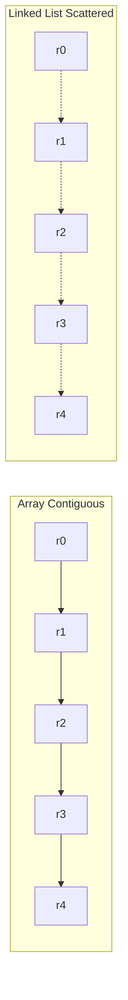
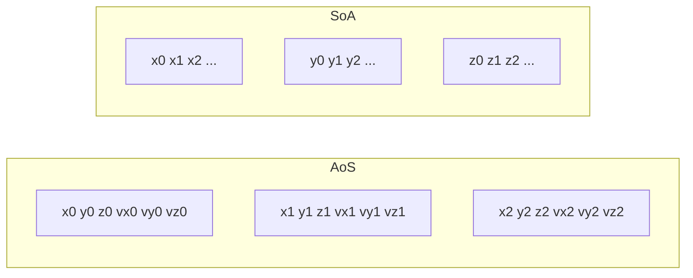

# 1. The Primacy of Memory and Data Layout

> "On a modern CPU, you can execute about 4–8 instructions per nanosecond. You can read one cache line from L1 in 1 nanosecond, from L2 in 4 nanoseconds, from L3 in 12 nanoseconds, and from DRAM in 100 nanoseconds. **The bottleneck is never the computation; it is always the memory.** Engineers who internalize this write fast engines. Engineers who do not write slow ones, and cannot explain why."

This is the foundational chapter of the hardware-aware design section. Every subsequent note assumes you have internalized the principles here. Read this note carefully; refer back to it often.

---

## 4.1.1 Structure Layout Comparison

The first and most important decision in engine design is the **layout of data in memory**. The same logical data can be laid out in many ways, and the choice between them can produce 10–100× performance differences.

### Contiguous Memory Arrays vs Pointer-Based Linked Lists

Consider two ways to store a list of 1 million 16-byte records:

**Array:**
```c
struct Record { int32_t id; int32_t a; int32_t b; int32_t c; };
Record records[1000000];  // 16 MB contiguous
```

**Linked list:**
```c
struct Node { Record record; Node* next; };
Node* head;  // each node allocated separately, ~24 bytes each
```

Scanning the array: sequential access, perfect prefetching, 16 MB / 10 GB/s memory bandwidth = ~1.6 ms.

Scanning the linked list: random access (each node is at an arbitrary address), no prefetching, 1M cache misses × 100 ns = ~100 ms.

**The linked list is 60× slower.** And this is for a sequential scan — the simplest possible operation. For more complex operations (sorting, searching, filtering), the gap is even wider.



**The rule:** for any data that will be scanned or bulk-processed, use contiguous arrays. Reserve linked structures for cases where elements are inserted and removed frequently from the middle (and even then, prefer an array of pointers over a linked list of nodes).

### Designing Around the Cache Line (64 bytes)

The **cache line** is the unit of memory transfer between cache and DRAM. On x86 and ARM, it is 64 bytes. When the CPU reads a single byte from DRAM, it actually reads the entire 64-byte cache line containing that byte. Adjacent bytes are then "free" to read from cache.

**Implications for data layout:**

1. **Pack hot data into cache lines.** If a struct is accessed every iteration of the hot loop, make it fit in a single cache line. 64 bytes is enough for 16 32-bit integers, or 8 64-bit pointers, or 16 4-byte floats.

2. **Avoid straddling cache lines.** A struct that starts at byte 60 of one cache line and ends at byte 4 of the next straddles two cache lines. Every access fetches both lines, doubling the memory bandwidth used. Align structs to 64-byte boundaries with `alignas(64)`.

3. **Separate hot and cold fields.** If a struct has some fields accessed every iteration (hot) and some accessed rarely (cold), split them into two structs. The hot struct fits in cache; the cold struct does not pollute the cache.

```c
// Bad: hot and cold fields mixed
struct Order {
    int32_t id;             // hot
    int32_t instrument_id;  // hot
    int32_t quantity;       // hot
    int32_t price;          // hot
    char client_name[64];   // cold
    char timestamp[32];     // cold
    char notes[128];        // cold
};  // 232 bytes — 4 cache lines, but only 16 bytes are hot

// Good: hot and cold fields separated
struct OrderHot {
    int32_t id;
    int32_t instrument_id;
    int32_t quantity;
    int32_t price;
};  // 16 bytes — fits in one cache line with room to spare

struct OrderCold {
    int32_t id;  // foreign key to OrderHot
    char client_name[64];
    char timestamp[32];
    char notes[128];
};  // 228 bytes — accessed rarely
```

4. **False sharing.** If two threads each modify a different field of the same cache line, the cache coherence protocol forces the line to bounce between cores, killing performance. Pad shared data to ensure each thread's data is on its own cache line.

```c
// Bad: false sharing
struct Counter {
    int a;  // thread 1 increments
    int b;  // thread 2 increments
};  // a and b are on the same cache line

// Good: no false sharing
struct alignas(64) Counter {
    int a;
    char pad1[60];
    int b;
    char pad2[60];
};  // a and b are on different cache lines
```

### Structure of Arrays (SoA) vs Array of Structures (AoS)

For data-parallel processing, the choice between SoA and AoS is critical. We covered this briefly in Chapter 2; we now go deeper.

**AoS (Array of Structures):**
```c
struct Particle { float x, y, z; float vx, vy, vz; };
Particle particles[N];
// Memory: [x0,y0,z0,vx0,vy0,vz0, x1,y1,z1,vx1,vy1,vz1, ...]
```

To compute the sum of all x coordinates:
```c
float sum = 0;
for (int i = 0; i < N; i++) sum += particles[i].x;
```
Each `particles[i].x` access fetches a 64-byte cache line containing all 6 fields of one particle, but we only use 4 bytes. The other 60 bytes are wasted bandwidth. For N = 1 million, we touch 24 MB of memory to compute a single sum.

**SoA (Structure of Arrays):**
```c
struct Particles {
    float xs[N], ys[N], zs[N];
    float vxs[N], vys[N], vzs[N];
};
Particles particles;
// Memory: [x0,x1,...,xN, y0,y1,...,yN, ...]
```

To compute the sum of all x coordinates:
```c
float sum = 0;
for (int i = 0; i < N; i++) sum += particles.xs[i];
```
Each access fetches a 64-byte cache line containing 16 consecutive x values. We use all 64 bytes. For N = 1 million, we touch 4 MB of memory — 6× less than AoS.

SoA also enables **SIMD vectorization**: the loop can be rewritten to process 8 or 16 floats per iteration using AVX2 or AVX-512 instructions.



**When AoS is better:**
- You access all (or most) fields of each element.
- The struct is small (≤ 64 bytes, fits in one cache line).
- You iterate over elements but use most fields per element.

**When SoA is better:**
- You access one (or a few) fields across many elements.
- The struct is large (spills multiple cache lines).
- You want to vectorize the computation.

**Hybrid: AoSOA (Array of Structures of Arrays).** For maximum flexibility, store data in blocks of 8 or 16 elements, with SoA layout within each block. This gives SIMD-friendly access within each block and cache-friendly access to all fields of one element (within the same block). Used heavily in game physics engines.

```c
struct ParticleBlock {
    float xs[8], ys[8], zs[8], vxs[8], vys[8], vzs[8];
};
ParticleBlock blocks[N / 8];
```

---

## 4.1.2 Memory Allocator Selection

Even with perfect data layout, the choice of memory allocator can dominate performance. The default `malloc` is general-purpose and slow; specialized allocators can be 10–100× faster for specific patterns.

### Custom Allocators

**Arena allocator.** Allocates a large block upfront; bump-allocates from it. O(1) allocation; no per-allocation free (free the whole arena at once). Perfect for short-lived data (per-query data, per-frame data in games).

```c
struct Arena {
    char* block;
    size_t capacity;
    size_t used;
};

void* arena_alloc(Arena* a, size_t size) {
    size = (size + 7) & ~7;  // align to 8 bytes
    void* ptr = a->block + a->used;
    a->used += size;
    return ptr;
}
```

**Pool allocator.** Allocates fixed-size objects from a pre-allocated pool. O(1) allocation and deallocation. Perfect for many objects of the same type (e.g., AST nodes, list nodes).

```c
template<typename T>
struct Pool {
    T* pool;
    T** free_list;
    size_t capacity;
    size_t free_count;
    
    T* alloc() {
        if (free_count == 0) return nullptr;
        return free_list[--free_count];
    }
    
    void free(T* obj) {
        free_list[free_count++] = obj;
    }
};
```

**Stack allocator.** Like arena, but supports scoped deallocation. Push a marker; allocate; pop back to the marker to free everything since. Perfect for temporary allocations within a function.

```c
size_t marker = arena_save(arena);
char* temp = arena_alloc(arena, 1024);
// ... use temp ...
arena_restore(arena, marker);  // frees temp
```

### Low-Fragmentation Multi-Threaded Allocators

For general-purpose allocation (when custom allocators are not practical), use a high-performance multi-threaded allocator:

- **jemalloc (Facebook).** Default in FreeBSD; widely used in production. Thread-local caches reduce lock contention. Size-class-based allocation reduces fragmentation.
- **tcmalloc (Google).** Similar design to jemalloc. Default in Go runtime.
- **mimalloc (Microsoft).** Newer; competitive performance; biased for short-lived allocations.

These allocators are 5–10× faster than the default glibc `malloc` for multi-threaded workloads, primarily due to thread-local caches that avoid lock contention.

**Drop-in replacement:** link with `-ljemalloc` and most C/C++ programs automatically use jemalloc instead of the default malloc, with no code changes.

### Avoiding the Heap: Pre-Allocate All Working Memory

The fastest allocation is the one that does not happen. For engine hot loops, pre-allocate all working memory at startup:

```c
struct Engine {
    // Pre-allocated buffers
    OrderBook order_books[MAX_INSTRUMENTS];  // 1 MB
    Order orders[MAX_OUTSTANDING_ORDERS];    // 10 MB
    Trade trades[MAX_TRADES_PER_SECOND];     // 1 MB
    // ... etc
};

void engine_init(Engine* e) {
    // All memory allocated once, at startup
}

void engine_run(Engine* e) {
    // Hot loop: no allocations, just use pre-allocated buffers
}
```

This eliminates allocation from the hot loop entirely. Memory is allocated once, used forever, freed at shutdown. The pattern is universal in HFT, game engines, and other latency-sensitive engines.

---

## 4.1.3 The Cost of Memory Operations — A Reference

Memorize these numbers. They are the foundation of all hardware-aware design.

| Operation | Cycles | Nanoseconds (3 GHz) | Notes |
|---|---|---|---|
| L1 cache hit | 3–4 | ~1 | 64-byte cache line |
| L2 cache hit | 12–14 | ~4 | Per core, ~256 KB |
| L3 cache hit | 30–40 | ~12 | Shared across cores, ~30 MB |
| DRAM access | 200–400 | ~100 | Memory bandwidth limited |
| NUMA remote DRAM | 400–800 | ~200 | Cross-socket |
| SIMD add (8 floats) | 4–8 | ~2 | AVX2 |
| SIMD add (16 floats) | 4–8 | ~2 | AVX-512 |
| Integer add | 1 | ~0.3 | |
| Integer multiply | 3 | ~1 | |
| Integer divide | 20–40 | ~10 | |
| Branch (predicted) | 1 | ~0.3 | |
| Branch (mispredicted) | 15–20 | ~5 | Pipeline flush |
| Function call | 2–3 | ~1 | |
| Virtual function call | 5–10 | ~2 | Indirect branch |
| `malloc` | 50–200 | ~30 | Lock contention possible |
| Mutex lock/unlock | 20–50 | ~10 | Uncontended |
| Mutex lock (contended) | 1000+ | ~300 | Wait for other thread |
| Syscall | 1000+ | ~300 | Kernel/user transition |
| Disk seek (HDD) | 10M | ~3 ms | |
| SSD read (NVMe) | 100K | ~30 μs | |

**The orders of magnitude:**

- L1 → L2: 4× slower
- L2 → L3: 3× slower
- L3 → DRAM: 8× slower
- DRAM → SSD: 300× slower
- DRAM → HDD: 30,000× slower

An engine that fits in L1 is 100× faster than an engine that fits in DRAM. This is why state representation matters so much.

---

## 4.1.4 Cache-Line-Aware Data Structure Design

Putting it all together: every data structure in an engine should be designed with the 64-byte cache line as the primary unit.

**Checklist for every data structure:**

1. **What is the size?** If ≤ 64 bytes, it fits in one cache line — good. If > 64 bytes, can it be split?
2. **Are hot and cold fields separated?** Hot fields (touched every iteration) should be in a separate struct from cold fields.
3. **Is the structure aligned?** `alignas(64)` for any struct accessed in the hot loop.
4. **Is it laid out for the access pattern?** Sequential access → flat array. Random access → hash table or B-tree.
5. **Are there false-sharing risks?** If multiple threads access the struct, ensure each thread's fields are on separate cache lines.
6. **Can it be vectorized?** If the same operation is applied to many instances, use SoA layout.

**Example: a cache-optimized order book.**

```c
struct alignas(64) PriceLevel {
    int32_t price;          // 4 bytes
    int32_t size;            // 4 bytes
    int32_t order_count;     // 4 bytes
    int32_t padding[13];     // 52 bytes — pad to 64
};

struct alignas(64) OrderBook {
    PriceLevel bids[8];      // 512 bytes — 8 cache lines, top 8 bid levels
    PriceLevel asks[8];      // 512 bytes — 8 cache lines, top 8 ask levels
    int32_t best_bid_idx;    // 4 bytes
    int32_t best_ask_idx;    // 4 bytes
    int32_t instrument_id;   // 4 bytes
    int32_t padding[13];     // 52 bytes — pad to 64
};
```

The top 8 levels (which account for 99%+ of trading activity) fit in 16 cache lines — easily in L1. Deeper levels (rarely accessed) are stored separately, in DRAM.

---

## 4.1.5 Common Pitfalls

### Pitfall 1: Linked Structures in the Hot Path

Linked lists, trees with pointer-based children, and graph structures with pointer-based edges are all cache-unfriendly. Replace with array-based representations: a tree stored as a heap (array with index arithmetic for children), a graph stored as an adjacency array.

### Pitfall 2: Ignoring Alignment

A struct that is 65 bytes wastes an entire cache line of bandwidth on every access. Pad to 64, 128, or 192 bytes — whichever is closest above the natural size.

### Pitfall 3: Mixing Hot and Cold Data

A struct with 8 hot bytes and 200 cold bytes wastes 92% of memory bandwidth when scanning the hot bytes. Split into two structs.

### Pitfall 4: False Sharing

Two threads incrementing adjacent counters can be 10× slower than two threads incrementing counters on separate cache lines. Always pad shared counters to cache line boundaries.

### Pitfall 5: Allocating in the Hot Loop

Every `malloc` in the hot loop is a 30+ ns tax. Pre-allocate at startup; use arena or pool allocators if dynamic allocation is unavoidable.

### Pitfall 6: Using the Default Allocator

glibc's `malloc` is general-purpose and slow. Use jemalloc, tcmalloc, or mimalloc for any production engine.

### Pitfall 7: AoS When SoA Is Appropriate

If you process one field across many elements, AoS wastes 80%+ of memory bandwidth. Use SoA.

### Pitfall 8: Not Profiling Cache Behavior

Without profiling, you cannot know whether your engine is cache-friendly. Use `perf stat` (Linux) or Instruments (macOS) to measure cache hit rates. Aim for > 90% L1/L2 hit rate on the hot loop.

---

## 4.1.6 Important Reminders

- **Memory is the bottleneck, not compute.** Design for cache, not for instructions.
- **64 bytes is the unit of memory.** Size structs to fit cache lines.
- **Contiguous arrays beat linked structures.** Always.
- **Separate hot and cold fields.** Don't let cold data pollute the cache.
- **Avoid false sharing.** Pad shared data to cache line boundaries.
- **Pre-allocate at startup.** No allocation in the hot loop.
- **Use a fast allocator.** jemalloc / tcmalloc / mimalloc.
- **Choose AoS vs SoA based on access pattern.** SoA for bulk processing, AoS for per-element access.
- **Profile cache behavior.** `perf stat`, Intel VTune, macOS Instruments.

---

## 4.1.7 Summary

Memory layout is the single most impactful design decision in engine engineering. The 64-byte cache line is the unit of memory transfer; data that fits in cache is 100× faster than data in DRAM. Contiguous arrays beat linked structures by 10–100×. Hot and cold fields should be separated. False sharing must be avoided. Allocation should be eliminated from the hot loop, with all working memory pre-allocated at startup.

Memorize the memory hierarchy latency numbers (L1: 1 ns, L2: 4 ns, L3: 12 ns, DRAM: 100 ns). Every design decision should be made with these numbers in mind.

---

**Previous chapter:** [[5. Recommendation and Matching Engines]]
**Next note:** [[2. Work Elimination Strategies]]
