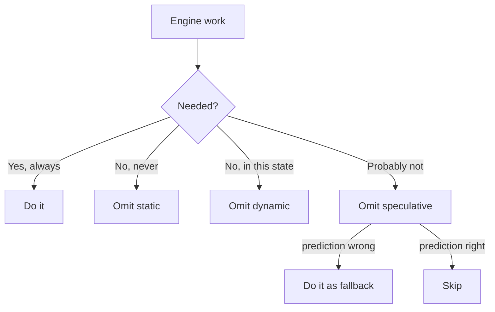
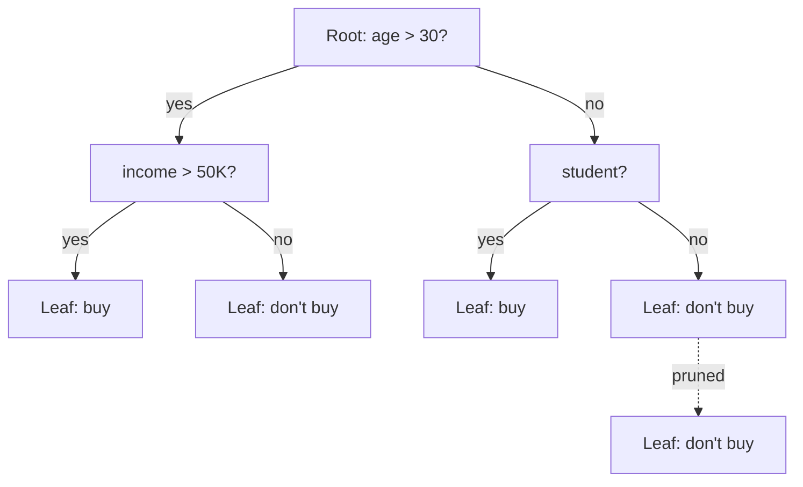
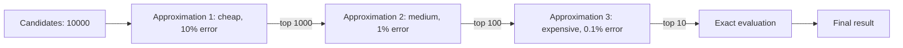

# 2. Work Elimination Strategies

> "The fastest code is the code that does not run. The second-fastest is the code that runs less. Before you optimize *how* the code runs, eliminate *what* the code does. This is the highest-leverage optimization in engine engineering."

Most engineers optimize by making existing computations faster. This is the wrong first move. The right first move is to *eliminate computations entirely*. An engine that does not compute something is infinitely faster than one that computes it in 1 nanosecond.

This note covers the four canonical work elimination strategies: pruning, indexing, memoization, and approximation. Every engine optimization is some combination of these four.

---

## 4.2.1 The Principle of Omission

The principle of omission is simple: **if a computation is not needed, do not do it.** This sounds obvious, but most engines do enormous amounts of unnecessary work:

- They recompute values that have not changed.
- They evaluate candidates that cannot possibly win.
- They search branches that cannot improve the answer.
- They generate output that no one will read.

Eliminating this work is the cheapest optimization — it requires no algorithmic sophistication, no hardware knowledge, no clever data structures. It just requires looking at what the engine does and asking: *does this need to be done?*

### The Three Forms of Omission

1. **Static omission.** Work that can be eliminated at compile time or engine startup. Example: dead code elimination in compilers; precomputation of constant expressions.

2. **Dynamic omission.** Work that can be eliminated at runtime, based on the current state. Example: alpha-beta pruning in chess (skip branches that cannot improve the answer); WAND in search (skip documents that cannot make the top-k).

3. **Speculative omission.** Work that can be eliminated based on a prediction, with a fallback if the prediction is wrong. Example: branch prediction in CPUs (speculatively execute the predicted path, roll back if wrong); predictive pre-fetching (load data we expect to need, ignore if we do not).



The art is identifying which work falls into which category. Most engine work is *dynamically* omittable — it could be done, but does not need to be done *in this state*. The techniques below help identify and exploit this.

---

## 4.2.2 Pruning Mechanics

**Pruning** is the elimination of branches in a search that cannot affect the answer. We have already seen the canonical example — alpha-beta pruning in chess — in Chapter 2. Here we generalize.

### The General Form of Pruning

Every pruning technique can be expressed in the same form:

> Given a search node with current best answer $\alpha$, and an upper bound $\beta$ on the value of the current branch, if $\beta \leq \alpha$, prune the branch.

The difference between pruning techniques is *how the upper bound $\beta$ is computed*:

- **Alpha-beta:** $\beta$ is the negation of the opponent's best-so-far. Tight bound; correct.
- **Branch-and-bound:** $\beta$ is the value of the linear programming relaxation. Loose but valid bound.
- **Futility pruning:** $\beta$ is the static evaluation plus a margin. Heuristic bound; may incorrectly prune.
- **Null-move pruning:** $\beta$ is the value after a "null move" (skipping a turn). Heuristic bound; fails in zugzwang.

### Branch-and-Bound

Branch-and-bound is the general pruning technique for optimization problems. Given a problem with:

- A set of candidate solutions (the search space).
- An objective function $f$ to maximize.
- A way to *branch* (split the search space into subspaces).
- A way to *bound* (compute an upper bound on $f$ over a subspace).

Algorithm:

1. Start with the full search space.
2. Compute the upper bound for the current space. If it is less than the best-so-far value, prune.
3. Otherwise, branch into subspaces and recurse.
4. When a subspace contains a single solution, evaluate it and update the best-so-far.

```python
def branch_and_bound(space, best_so_far):
    bound = upper_bound(space)
    if bound <= best_so_far.value:
        return best_so_far  # prune
    if is_single_solution(space):
        value = evaluate(space)
        if value > best_so_far.value:
            return Solution(space, value)
        return best_so_far
    for subspace in branch(space):
        best_so_far = branch_and_bound(subspace, best_so_far)
    return best_so_far
```

Branch-and-bound is used in:

- **Integer programming** (CPLEX, Gurobi).
- **Traveling salesman** (exact algorithms).
- **Scheduling** (job-shop, flow-shop).
- **Knapsack** (exact algorithms).

The effectiveness depends on the quality of the bounds. Good bounds → exponential speedup. Bad bounds → no pruning, equivalent to brute force.

### Decision Trees

A decision tree is a structure where each internal node tests a feature, and each leaf is a prediction. Pruning a decision tree means removing subtrees that do not improve accuracy on a validation set.



Decision tree pruning is the foundation of ML model compression (reducing model size without losing accuracy). It is also used in compilers (dead branch elimination) and parsers (LL/LR table minimization).

### Other Pruning Techniques

- **Forward checking** (constraint satisfaction). When assigning a variable, immediately check whether any other variable's domain becomes empty. Prunes branches that lead to dead-ends early.

- **Constraint propagation** (CSP). Propagate the consequences of a choice to prune future choices. If `x = 5` and `x + y < 10`, then `y < 5` — prune all `y >= 5`.

- **Quiescence search** (chess). Stop searching at a depth limit only if the position is "quiet". Continue searching until the position becomes quiet. Prevents the horizon effect.

- **Singular extensions** (chess). If a move is "clearly best" (much better than alternatives at shallow depth), extend the search along that move. Finds deep tactics without searching deep everywhere.

---

## 4.2.3 Indexing Mechanics

**Indexing** is the elimination of scanning by creating a data structure that allows direct lookup. Instead of scanning all data to find what you want, you look it up in the index.

### The General Principle

Without an index, finding all records matching a condition is $O(N)$ — you must check every record. With an index, it is $O(\log N)$ or $O(1)$ — you look up the matching records directly.

```mermaid
flowchart LR
    subgraph Without Index
        R1[Record 1] -->|not match| R2[Record 2]
        R2 -->|not match| R3[Record 3]
        R3 -->|match| Result
        R3 --> R4[Record 4]
        R4 -->|not match| RN[...]
    end
    subgraph With Index
        Q[Query] --> I[Index lookup: O(log N)]
        I --> P[Posting list: matching records]
    end
```

### Types of Indexes

- **Hash index.** O(1) lookup for exact match. No range queries. Used for: symbol tables, key-value stores.

- **B-tree index.** O(log N) lookup, supports range queries. Used for: databases (PostgreSQL, MySQL/InnoDB), file systems.

- **Inverted index.** Maps terms to documents containing them. Used for: text search (Lucene, Elasticsearch).

- **Bitmap index.** One bit per record per value. Efficient for low-cardinality columns. Used for: data warehouses.

- **Vector index.** ANN structures (HNSW, IVF, PQ). Used for: semantic search, recommendation.

- **Trie.** Prefix tree for strings. Used for: autocomplete, IP routing.

### When to Index

Indexing is not free — the index takes memory, must be updated when the data changes, and adds complexity. The decision to index is driven by:

1. **Read-to-write ratio.** Indexes speed up reads but slow down writes. If reads >> writes, index. If writes >> reads, do not.

2. **Query selectivity.** If a query matches 1% of records, an index gives ~100× speedup. If a query matches 50% of records, an index gives ~2× speedup — often not worth the memory.

3. **Memory budget.** Indexes take memory. If the index does not fit in RAM, it is useless (every lookup is a disk access).

4. **Update frequency.** Updating a B-tree index is O(log N) per update. For high-update workloads, this can dominate.

### Composite Indexes

For queries that filter on multiple columns, a **composite index** on (col1, col2, col3) supports queries on col1, (col1, col2), or (col1, col2, col3). The order matters: the leading column must be specified.

```sql
-- Index on (last_name, first_name, age)
CREATE INDEX name_age_idx ON users(last_name, first_name, age);

-- Uses index:
SELECT * FROM users WHERE last_name = 'Smith';
SELECT * FROM users WHERE last_name = 'Smith' AND first_name = 'John';
SELECT * FROM users WHERE last_name = 'Smith' AND first_name = 'John' AND age > 30;

-- Does NOT use index:
SELECT * FROM users WHERE first_name = 'John';
SELECT * FROM users WHERE age > 30;
```

This is the "leftmost prefix" rule. Design composite indexes based on the queries you expect to run.

---

## 4.2.4 Memoization Mechanics

**Memoization** is the elimination of repeated computation by caching results. If the same input occurs multiple times, the cached result is returned instead of recomputing.

```python
_cache = {}
def fib(n):
    if n in _cache:
        return _cache[n]
    if n < 2:
        return n
    result = fib(n-1) + fib(n-2)
    _cache[n] = result
    return result
```

Without memoization, `fib(40)` makes ~1 billion calls. With memoization, it makes 40 calls. A 25-million-fold speedup.

### Trade-offs: CPU vs Memory

Memoization trades memory for CPU. The trade-off is favorable when:

- The same computation is repeated many times.
- The computation is more expensive than a cache lookup (~100 ns for a DRAM-based cache).
- The cache fits in available memory.

The trade-off is unfavorable when:

- The computation is rarely repeated (cache hit rate is low).
- The computation is cheap (comparable to a cache lookup).
- The cache does not fit in memory (cache misses are expensive).

### Cache Sizing and Replacement Policies

A memoization cache cannot grow unboundedly. When the cache is full, an entry must be evicted to make room for a new one. The replacement policy determines which entry is evicted:

- **LRU (Least Recently Used).** Evict the entry that has not been accessed for the longest time. Simple, good in practice. Used in most CPU caches.

- **LFU (Least Frequently Used).** Evict the entry with the lowest access count. Better than LRU for skewed access patterns. Used in some database caches.

- **FIFO (First In First Out).** Evict the oldest entry. Simple but suboptimal.

- **ARC (Adaptive Replacement Cache).** Dynamically balances LRU and LFU based on workload. Used in ZFS.

- **TinyLFU.** Frequency-based with a small footprint. Used in Caffeine (Java cache library).

### Transposition Tables — Domain-Specific Memoization

In game-tree search, a **transposition table** caches the evaluation of positions. The same position can be reached via different move orders (a "transposition"), and caching avoids re-searching.

```python
def search(position, depth, alpha, beta):
    # Check transposition table
    tt_entry = tt.lookup(position.hash)
    if tt_entry and tt_entry.depth >= depth:
        return tt_entry.score  # cache hit
    
    # ... search ...
    
    # Store in transposition table
    tt.store(position.hash, depth, score, flag)
    return score
```

Transposition tables are the largest single optimization in chess engines — they provide 5–10× speedup. The table is typically 1–16 GB; the hash is 64 bits (Zobrist); the replacement policy is depth-preferred (deeper entries are kept over shallower ones).

### Memoization in Compilers

Compilers memoize extensively:

- **Macro expansion.** Expanded macros are cached by source location.
- **Template instantiation** (C++). Each template instantiation is cached by template arguments.
- **Type inference** (Hindley-Milner). Type inference results are cached by AST node.
- **Code generation.** Generated code for a function is cached; if the function does not change, the code is reused.

Without memoization, C++ template instantiation can be exponential. With memoization, it is linear.

### When Memoization Fails

- **Side effects.** If the function has side effects, memoization gives wrong results. (Or: memoize only the side-effect-free part.)
- **Mutable inputs.** If the input is mutable and may change, the cache key must include a hash of the input's current state.
- **High cache miss rate.** If the cache miss rate is high, memoization adds overhead without benefit.
- **Concurrent access.** If multiple threads access the cache, locking may dominate. Use lock-free caches or per-thread caches.

---

## 4.2.5 Approximation Mechanics

**Approximation** is the elimination of precision: replace an expensive exact computation with a cheap approximate one. The approximation must be "good enough" for the engine's purpose.

### The Trade-off: Accuracy vs Speed

Every approximation trades accuracy for speed. The trade-off is favorable when:

- The exact computation is much more expensive than the approximation.
- The engine's output is not sensitive to the approximation error.
- The approximation has bounded error (so you can reason about correctness).

### Types of Approximation

1. **Heuristic evaluation.** Replace exact evaluation with a hand-tuned heuristic. Example: chess evaluation functions (heuristic) vs. exact game-theoretic value (exponential to compute).

2. **Probabilistic estimation.** Replace exact counting with probabilistic estimation. Example: HyperLogLog for cardinality estimation (sublinear memory).

3. **Sampling.** Replace exhaustive computation with computation on a random sample. Example: Monte Carlo Tree Search (sampled playouts vs. exhaustive search).

4. **Lossy compression.** Replace exact data with lossily compressed data. Example: product quantization for vector embeddings (10–100× memory reduction with small accuracy loss).

5. **Learned models.** Replace hand-coded logic with a learned model. Example: NNUE in chess (learned evaluation vs. hand-tuned); learned rankers in search (learned relevance vs. BM25 alone).

### Bounding Approximation Error

For an approximation to be useful, you must be able to bound its error:

- **Deterministic bound.** The approximation is within ε of the true value, for all inputs. Example: floating-point arithmetic (each operation has a relative error of ~$2^{-23}$ for float32).

- **Probabilistic bound.** The approximation is within ε of the true value with probability $1 - \delta$. Example: Monte Carlo estimation (error decreases as $O(1/\sqrt{N})$ for N samples).

- **Empirical bound.** The approximation has been observed to be within ε on a test set, but no theoretical guarantee. Example: most learned models.

For engine correctness, deterministic bounds are preferred. Probabilistic bounds are acceptable when the failure probability can be made arbitrarily small. Empirical bounds are risky — the model may fail on out-of-distribution inputs.

### Multi-Stage Approximation

The most powerful pattern: **multi-stage approximation** with increasing precision.



Each stage filters out most candidates with a cheap approximation. The expensive exact evaluation runs only on the few survivors. This is the dominant pattern in:

- **Search engines.** BM25 (cheap) → learned ranker (medium) → cross-encoder (expensive).
- **Recommendation engines.** ANN (cheap) → coarse scorer (medium) → fine scorer (expensive).
- **Compilers.** Type inference (cheap) → optimization (medium) → code generation (expensive).

---

## 4.2.6 Combining the Four Strategies

Real engines combine all four strategies. A chess engine uses:

- **Pruning:** alpha-beta, null-move, late-move reductions.
- **Indexing:** transposition table (index from position hash to evaluation).
- **Memoization:** transposition table (also serves as memoization).
- **Approximation:** quiescence search (approximate the value of a non-quiet position by searching only captures).

A search engine uses:

- **Pruning:** WAND (skip documents that cannot make top-k).
- **Indexing:** inverted index (index from term to documents).
- **Memoization:** query result cache (cache results for frequent queries).
- **Approximation:** ANN (approximate nearest neighbor, sacrificing exactness for speed).

A trading engine uses:

- **Pruning:** risk checks (prune orders that violate risk limits).
- **Indexing:** order book (index from price level to orders at that level).
- **Memoization:** feature cache (cache computed features for the current state).
- **Approximation:** alpha signal (approximate the "true" value of a trade with a heuristic).

The four strategies are not interchangeable — each eliminates a different kind of work. The art is identifying which kind of work is being done unnecessarily, and applying the right strategy to eliminate it.

---

## 4.2.7 Common Pitfalls

### Pitfall 1: Optimizing Before Eliminating

Engineers often reach for SIMD, GPU, or other "make it faster" techniques before eliminating unnecessary work. Eliminating work is 10–100× cheaper than making work faster. Always eliminate first.

### Pitfall 2: Pruning Too Aggressively

Aggressive pruning can miss important branches. Null-move pruning fails in zugzwang; futility pruning can miss tactical resources. Always verify pruned search against unpruned search.

### Pitfall 3: Indexing Everything

Indexes are not free — they take memory and slow down writes. Index only the columns and query patterns that benefit. Use composite indexes for multi-column queries.

### Pitfall 4: Memoizing Without Bounds

An unbounded memoization cache will eventually run out of memory. Always set a size limit and a replacement policy.

### Pitfall 5: Approximating Without Bounding Error

An approximation without an error bound is just a guess. Either prove a theoretical bound or measure the empirical error on a representative test set.

### Pitfall 6: Cache Stamping

When the cache is empty (e.g., at startup or after a flush), all requests miss and go to the underlying computation. This can overwhelm the system. Mitigation: warm the cache before going live; use a "stale-while-revalidate" policy to serve stale data while computing fresh.

---

## 4.2.8 Important Reminders

- **The fastest code is the code that does not run.** Eliminate before optimizing.
- **Four strategies: pruning, indexing, memoization, approximation.** Each eliminates a different kind of work.
- **Pruning requires bounds.** The tighter the bound, the more pruning.
- **Indexing requires read-heavy workloads.** Writes pay the index update cost.
- **Memoization requires repeatability.** No side effects; deterministic inputs.
- **Approximation requires error bounds.** Otherwise it is just a guess.
- **Multi-stage approximation is the dominant pattern.** Cheap approximations filter; expensive exact computations finalize.
- **Combine all four strategies.** No single strategy suffices.

---

## 4.2.9 Summary

Work elimination is the highest-leverage optimization in engine engineering. The four canonical strategies — pruning, indexing, memoization, approximation — each eliminate a different kind of unnecessary work:

- **Pruning** eliminates search branches that cannot affect the answer.
- **Indexing** eliminates scanning by creating direct-lookup structures.
- **Memoization** eliminates repeated computation by caching results.
- **Approximation** eliminates precision by replacing expensive exact computations with cheap approximate ones.

Real engines combine all four. The art is identifying which kind of work is being done unnecessarily, and applying the right strategy to eliminate it. Always eliminate before optimizing — making unnecessary work faster is a waste of effort.

---

**Previous note:** [[1. The Primacy of Memory and Data Layout]]
**Next note:** [[3. Hardware Limits Memory and Compute Bottlenecks]]
