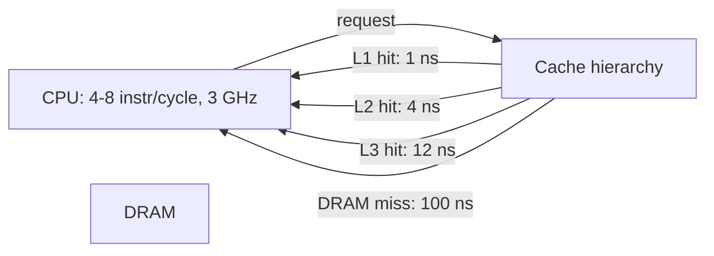
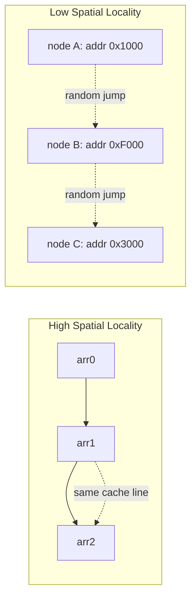
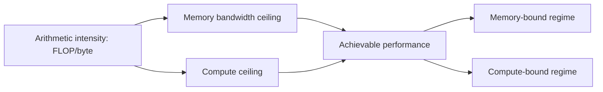
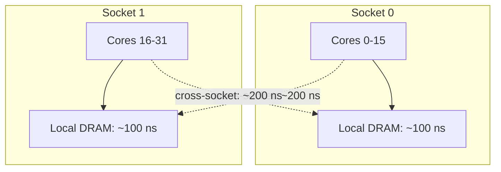

# 3. Hardware Limits — Memory and Compute Bottlenecks

> "Modern CPUs are 1000× faster than DRAM. The job of an engine engineer is not to make the CPU do more — it is to keep the CPU fed with data, so the CPU's theoretical throughput becomes the bottleneck instead of memory. This is the central challenge of engine engineering, and it has been for the last 25 years."

In the 1980s, CPU speed and DRAM speed were similar. Both improved at roughly the same rate. In the 1990s, CPU speed started improving faster than DRAM speed. By 2020, CPUs were ~1000× faster than DRAM. This gap is called the **memory wall**, and it is the dominant constraint on engine performance.

This note covers the memory wall, cache locality, and hardware prefetching — the three concepts every engine engineer must internalize.

---

## 4.3.1 The Memory Wall

The **memory wall** is the situation where the CPU spends most of its time waiting for memory, rather than executing instructions. On a modern CPU:

- The CPU can execute 4–8 instructions per cycle (superscalar, out-of-order).
- The CPU runs at 3–4 GHz, so each cycle is ~0.3 ns.
- A DRAM access takes ~100 ns — 300 CPU cycles.

If every memory access goes to DRAM, the CPU spends 99.7% of its time waiting. Even with a 99% L1 cache hit rate (one miss per 100 accesses), the CPU spends ~50% of its time waiting for the misses.



### The Latency Gap

| Year | CPU speed | DRAM speed | Ratio |
|---|---|---|---|
| 1980 | 1 MHz | 1 MHz | 1:1 |
| 1990 | 30 MHz | 30 MHz | 1:1 |
| 2000 | 1 GHz | 100 MHz | 10:1 |
| 2010 | 3 GHz | 200 MHz | 15:1 |
| 2020 | 4 GHz | 300 MHz | 13:1 |

Wait — the ratio has not grown as much as the "1000×" claim suggests. The reason: while individual DRAM accesses have improved (200 MHz → 300 MHz), the *bandwidth* of DRAM has improved more (1 GB/s → 50 GB/s). Modern DRAM can deliver data at 50 GB/s, but each individual access still takes ~100 ns due to the latency of the DRAM protocol.

The upshot: **if your access pattern is sequential (high bandwidth utilization), DRAM is fast. If your access pattern is random (one cache line at a time, with no spatial locality), DRAM is slow.** This is why contiguous arrays are fast and linked lists are slow.

### Navigating the Memory Wall

The engine engineer's response to the memory wall is:

1. **Make hot data fit in cache.** If the data is in L1, the CPU runs at full speed.
2. **Use sequential access patterns.** Sequential access utilizes DRAM bandwidth; random access does not.
3. **Prefetch data before it is needed.** Hide memory latency by overlapping computation and memory access.
4. **Use SIMD to do more work per memory access.** If you must wait for memory, process 8–16 elements per cache line instead of 1.

These techniques are covered in the rest of this note and the next two notes (Section 4.4 — Vectorized Processing; Section 4.5 — Execution Predictability).

---

## 4.3.2 Cache Locality Principles

**Cache locality** is the property of an access pattern that allows the cache to be effective. There are two kinds:

### Temporal Locality

If a memory location is accessed, it is likely to be accessed again soon. The cache exploits this by keeping recently-accessed data in cache, so the second access is a hit.

**Examples of high temporal locality:**

- A loop variable (`for (int i = 0; i < N; i++)`). The variable `i` is accessed every iteration; it lives in a register or L1.
- A small lookup table that is consulted on every iteration.
- A frequently-called function's code.

**Examples of low temporal locality:**

- Streaming through a large array (`for (int i = 0; i < 1e9; i++) sum += arr[i]`). Each element is accessed once; by the time the loop returns to it, it has been evicted.
- A large hash table where each lookup goes to a random bucket.

**Designing for temporal locality:** identify the data accessed most frequently, and ensure it fits in the smallest cache that can hold it.

### Spatial Locality

If a memory location is accessed, nearby locations are likely to be accessed soon. The cache exploits this by fetching an entire 64-byte cache line on any access, so nearby accesses are hits.

**Examples of high spatial locality:**

- Sequential array access (`arr[0], arr[1], arr[2], ...`). Each cache line fetch gives 8–16 elements.
- Sequential file reading.
- Walking a contiguous AST.

**Examples of low spatial locality:**

- Linked list traversal. Each node is at a random address; each access is a cache miss.
- Random hash table access.
- Pointer chasing in general.

**Designing for spatial locality:** use contiguous arrays; pack related data into the same cache line; access data in sequential order.



### The Two Kinds Together

The best data structures have **both** temporal and spatial locality:

- A small array accessed sequentially has both. (The array fits in L1; access is sequential.)
- A small lookup table accessed repeatedly has temporal but limited spatial locality. (The table fits in L1; access is random within the table.)
- A large array accessed sequentially has spatial but limited temporal locality. (The array does not fit in cache; access is sequential, so each cache line is fully utilized.)
- A linked list has neither. (Each access is a cache miss; no locality of any kind.)

### Working Set Size and Cache Levels

The **working set** is the set of memory locations accessed over a short period. If the working set fits in L1, the engine runs at L1 speed. If it fits in L2, at L2 speed. If it spills to DRAM, at DRAM speed.

| Cache | Size | Latency | Working set target |
|---|---|---|---|
| L1 | 32 KB | 1 ns | Hottest loop data |
| L2 | 256 KB | 4 ns | Hot data + small indexes |
| L3 | 30 MB | 12 ns | Larger indexes, code |
| DRAM | 16+ GB | 100 ns | Everything else |

**Design target:** the hottest loop's working set should fit in L1 (32 KB). The next-tier data (small indexes, frequently-accessed structs) should fit in L2 (256 KB). Only cold data (large indexes, models) should spill to DRAM.

### Measuring Cache Behavior

You cannot optimize what you cannot measure. The tools:

- **`perf stat` (Linux).** Reports cache hit/miss rates, instructions per cycle (IPC), branch prediction rates.
- **Intel VTune (Linux, Windows).** Detailed cache analysis, memory access patterns, hot spots.
- **AMD μProf (Linux, Windows).** Similar to VTune for AMD CPUs.
- **macOS Instruments.** The "Counters" instrument provides cache stats.
- **Valgrind Cachegrind.** Simulates cache behavior; slow but accurate.

**Example `perf stat` output:**

```
$ perf stat ./engine
   1000000000 instructions
    200000000 cache misses
    50000000 branch misses
       2.5 GHz CPU
       3.5 IPC
       5.2 seconds wall time
```

An IPC of 3.5 is good (the CPU is mostly executing, not waiting). An IPC of 0.5 is bad (the CPU is mostly waiting for memory). Aim for IPC > 2 in the hot loop.

---

## 4.3.3 Hardware Prefetching

Modern CPUs have **hardware prefetchers** that detect access patterns and fetch data into cache before it is explicitly requested. A well-designed engine exploits the prefetcher; a poorly-designed engine defeats it.

### How the Prefetcher Works

The prefetcher monitors cache misses and tries to detect patterns:

- **Sequential prefetcher.** Detects sequential access (e.g., `arr[0], arr[1], arr[2], ...`) and prefetches the next few cache lines.
- **Stride prefetcher.** Detects strided access (e.g., `arr[0], arr[8], arr[16], ...`) and prefetches the next stride.
- **Region prefetcher.** Detects that a region of memory is being actively accessed and prefetches the whole region.

When the prefetcher succeeds, the next cache line is already in L1 by the time the CPU requests it. The access appears to be an L1 hit, even though the data was originally in DRAM.

```mermaid
flowchart LR
    Access1[Access arr0: cache miss] --> Fetch1[Fetch line 1 + prefetch line 2]
    Fetch1 --> Access2[Access arr1: cache hit (prefetched)]
    Access2 --> Access3[Access arr2: cache hit (prefetched)]
```

### Patterns the Prefetcher Loves

- **Sequential array access.** `for (int i = 0; i < N; i++) arr[i]`. The prefetcher detects the stride-1 pattern and prefetches ahead.
- **Strided access with constant stride.** `for (int i = 0; i < N; i += 8) arr[i]`. The prefetcher detects the stride-8 pattern.
- **Multiple streams.** Modern prefetchers track 10–20 independent streams simultaneously. Accessing two arrays in parallel (`a[i] + b[i]`) is fine.

### Patterns the Prefetcher Hates

- **Random access.** Hash table lookups, pointer chasing. No pattern to detect.
- **Variable stride.** `for (int i = 0; i < N; i += random()) arr[i]`. The prefetcher cannot predict the next access.
- **Backward access.** `for (int i = N-1; i >= 0; i--) arr[i]`. Some prefetchers handle this; many do not.

### Software Prefetching

For patterns the hardware prefetcher cannot detect, the engine can explicitly request prefetching using the `PREFETCH` instruction (`__builtin_prefetch` in GCC, `_mm_prefetch` in MSVC).

```c
for (int i = 0; i < N; i++) {
    __builtin_prefetch(&arr[i + 32], 0, 0);  // prefetch 32 elements ahead
    sum += arr[i];
}
```

The `PREFETCH` instruction tells the CPU to start loading a cache line into L1. The load takes ~100 ns, so the prefetch must be issued ~100 ns before the data is needed. At 1 ns per iteration, that is ~100 iterations ahead.

**When to use software prefetching:**

- The access pattern is predictable by the engineer but not by the hardware (e.g., traversing a graph where the next node is known 100 iterations in advance).
- The data is being accessed for the first time (no spatial locality for the hardware to exploit).

**When NOT to use software prefetching:**

- The hardware prefetcher is already doing its job (sequential access).
- The access pattern is truly random (no useful prefetch target).
- The prefetch would evict useful data from cache.

### Prefetching in Data Structures

For data structures with predictable access patterns, prefetching can hide most of the memory latency:

**Skip list lookup with prefetching:**

```c
Node* skip_list_lookup(SkipList* sl, int key) {
    Node* node = sl->head;
    for (int level = sl->max_level; level >= 0; level--) {
        while (node->next[level] && node->next[level]->key < key) {
            node = node->next[level];
            // Prefetch the next-next node at this level
            if (node->next[level]) {
                __builtin_prefetch(node->next[level], 0, 0);
            }
        }
    }
    return node->next[0];
}
```

This hides the latency of each node access by overlapping it with the previous node's comparison. The skip list lookup becomes ~5× faster than without prefetching.

**B-tree lookup with prefetching.** Prefetch the child node while comparing keys in the current node. By the time the comparison is done, the child is in cache.

---

## 4.3.4 The Roofline Model

The **Roofline model** is a visual model for understanding the performance of compute-bound vs. memory-bound kernels. It plots achievable performance (FLOP/s) against arithmetic intensity (FLOP/byte).

$$\text{Achievable performance} = \min(\text{peak compute}, \text{peak bandwidth} \times \text{arithmetic intensity})$$



- **Low arithmetic intensity** (few FLOP per byte loaded): memory-bound. Performance is limited by memory bandwidth.
- **High arithmetic intensity** (many FLOP per byte loaded): compute-bound. Performance is limited by CPU throughput.

**Examples:**

- **Vector addition** (`a[i] + b[i]`): 1 FLOP per 8 bytes loaded (2 floats loaded, 1 stored). Arithmetic intensity = 1/24 ≈ 0.04. Memory-bound.
- **Matrix multiply** (optimized): 2 FLOP per ~1 byte loaded (with tiling). Arithmetic intensity ≈ 2. Compute-bound.
- **Matrix multiply** (naive, no tiling): 2 FLOP per ~8 bytes loaded. Memory-bound.

**Implication:** engines that do simple operations on lots of data (search engines, simple parsers) are memory-bound. Engines that do complex operations on small data (chess engines with NNUE) are compute-bound. The optimization strategies differ:

- **Memory-bound:** optimize data layout, prefetching, caching. Compute improvements don't help.
- **Compute-bound:** optimize algorithm, SIMD, GPU. Memory improvements don't help much.

Always know which regime your hot loop is in. The wrong optimization is wasted effort.

---

## 4.3.5 NUMA — Non-Uniform Memory Access

On multi-socket systems (typically 2–8 sockets), each CPU has its own local DRAM. Accessing local DRAM is fast (~100 ns); accessing remote DRAM (on another socket) is slow (~200 ns) due to the inter-socket link.



For engines running on multi-socket systems, NUMA effects can dominate performance. Mitigations:

1. **NUMA-aware allocation.** Allocate memory on the same socket as the accessing thread. Linux: `numa_alloc_onnode`.
2. **Thread affinity.** Pin threads to specific cores, so they do not migrate between sockets. Linux: `pthread_setaffinity_np`.
3. **Per-socket partitions.** Partition the workload by socket, so each socket processes only its local data.

A naïve engine that allocates all memory on socket 0 and runs threads on all sockets will see 2× worse latency on socket 1's threads. NUMA awareness is essential for multi-socket engines.

---

## 4.3.6 Common Pitfalls

### Pitfall 1: Assuming the CPU Is the Bottleneck

The CPU is almost never the bottleneck on modern hardware. Memory is. If your engine is slow, the first hypothesis should be "memory-bound", not "CPU-bound".

### Pitfall 2: Linked Structures in the Hot Path

Linked lists, trees with pointer-based children, and graph structures with pointer-based edges all defeat the prefetcher and cause cache misses. Replace with array-based representations.

### Pitfall 3: False Sharing

Two threads modifying different fields of the same cache line cause the cache line to bounce between cores. Pad shared data to cache line boundaries.

### Pitfall 4: Ignoring NUMA

On multi-socket systems, allocating memory on the wrong socket doubles latency. Use NUMA-aware allocation.

### Pitfall 5: Not Profiling

You cannot optimize cache behavior without measuring it. Use `perf stat` or VTune to measure cache hit rates.

### Pitfall 6: Optimizing Compute on a Memory-Bound Kernel

If the kernel is memory-bound, SIMD does not help — you are not waiting for compute. Optimize memory first.

### Pitfall 7: Optimizing Memory on a Compute-Bound Kernel

If the kernel is compute-bound, better cache behavior does not help — you are not waiting for memory. Optimize compute (SIMD, algorithm).

### Pitfall 8: Ignoring the Prefetcher

The hardware prefetcher is a powerful optimization. Sequential access patterns get it for free; random access patterns leave performance on the table.

---

## 4.3.7 Important Reminders

- **Memory is 100× slower than compute.** This is the central fact of hardware-aware design.
- **Cache locality is the lever.** Temporal locality (re-use) and spatial locality (nearby access).
- **L1: 32 KB, 1 ns. L2: 256 KB, 4 ns. L3: 30 MB, 12 ns. DRAM: 16+ GB, 100 ns.** Memorize these.
- **Sequential access is fast; random access is slow.** Design for sequential.
- **The hardware prefetcher is your friend.** Use sequential patterns; use software prefetching for predictable but non-sequential patterns.
- **The Roofline model tells you whether you are memory-bound or compute-bound.** Know your regime.
- **NUMA matters on multi-socket systems.** Allocate locally; pin threads.
- **Profile before optimizing.** `perf stat`, VTune.

---

## 4.3.8 Summary

The memory wall is the dominant constraint on engine performance. Modern CPUs are 1000× faster than DRAM; the engine engineer's job is to keep the CPU fed with data from cache.

Cache locality — temporal (re-use) and spatial (nearby access) — is the lever. The working set should fit in L1; the next-tier data should fit in L2; only cold data should spill to DRAM. Sequential access patterns utilize DRAM bandwidth and exploit the hardware prefetcher; random access patterns defeat both.

The Roofline model tells you whether your kernel is memory-bound (optimize data layout, prefetching, caching) or compute-bound (optimize algorithm, SIMD, GPU). NUMA effects dominate on multi-socket systems.

Always profile before optimizing. The bottleneck is rarely where you think it is.

---

**Previous note:** [[2. Work Elimination Strategies]]
**Next note:** [[4. Vectorized Processing The Batch Strategy]]
