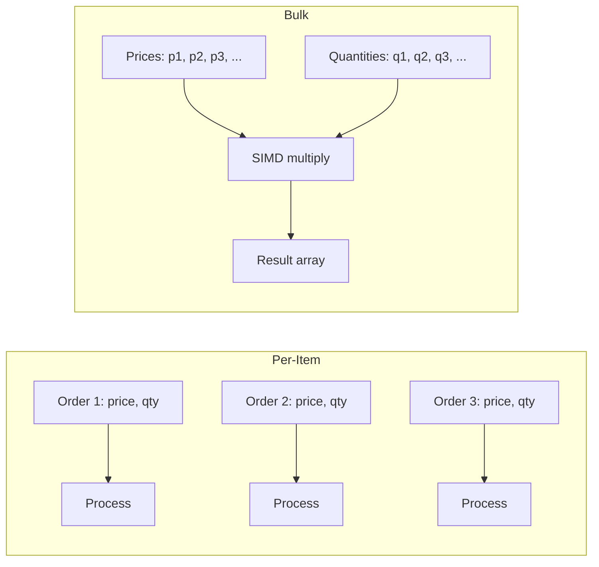
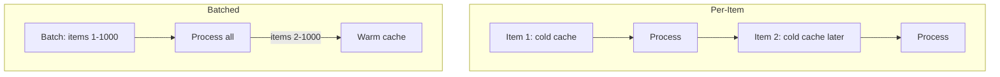

# 4. Vectorized Processing — The Batch Strategy

> "If you process one element at a time, you use 1/8 of the CPU's capability. If you process 8 elements at a time, you use all of it. The transition from per-item to bulk processing is the single highest-leverage optimization after cache-friendly data layout — and the two are prerequisites for each other."

**Vectorization** is the technique of applying the same operation to multiple data elements in a single CPU instruction. Modern CPUs have SIMD (Single Instruction, Multiple Data) units that can process 4–16 elements per instruction. This note covers the batch strategy: how to restructure your computation to enable vectorization, and how to write SIMD code that achieves the theoretical speedup.

---

## 4.4.1 Transitioning from Per-Item to Bulk Operations

The default mental model of most engineers is per-item: "process this order, then this order, then this order." This model is intuitive but leaves enormous performance on the table.

**Per-item processing:**
```python
def total_value(orders):
    return sum(order.price * order.quantity for order in orders)
```

Each iteration:
- Load 1 price (4 bytes).
- Load 1 quantity (4 bytes).
- Multiply (1 instruction).
- Add to accumulator (1 instruction).
- 8 bytes loaded, 2 instructions executed.

The CPU's L1 cache fetches a 64-byte cache line per load. With 8 bytes used out of 64, only 12.5% of the loaded data is used. The other 87.5% is wasted bandwidth.

**Bulk processing:**
```python
def total_value_bulk(prices, quantities):
    return sum(p * q for p, q in zip(prices, quantities))
```

When `prices` and `quantities` are separate arrays (SoA layout), each load fetches 16 consecutive floats (64 bytes). All 64 bytes are used. 8× better bandwidth utilization.

And the bulk version can be vectorized: process 8 (prices, quantities) pairs in a single SIMD instruction.

### Why Per-Item Is the Default

Per-item processing is the default for several reasons:

1. **Object-oriented programming encourages it.** Classes bundle data and behavior; iterating over a collection of objects means accessing one object at a time.
2. **Database abstractions encourage it.** ORMs return lists of objects; iterating over the list is per-item.
3. **Functional programming encourages it.** Higher-order functions like `map`, `filter`, `reduce` are conceptually per-item.

To escape per-item processing, you must consciously restructure your data and your code. This restructuring is the foundation of vectorization.

### The Three Steps to Bulk Processing

1. **Restructure data from AoS to SoA.** Separate the fields you want to process together into their own arrays.
2. **Restructure code from per-item to per-batch.** Instead of `for each item: process(item)`, write `for each batch: process_batch(batch)`.
3. **Vectorize the batch processing.** Use SIMD instructions to process all elements of the batch in parallel.



---

## 4.4.2 Vectorization via SIMD Instructions

### SIMD Instruction Sets

| Instruction Set | Width | Elements per Instruction | Available On |
|---|---|---|---|
| SSE (x86) | 128-bit | 4 floats / 2 doubles / 16 int8 | All x86-64 |
| AVX / AVX2 (x86) | 256-bit | 8 floats / 4 doubles / 32 int8 | Most x86-64 since 2013 |
| AVX-512 (x86) | 512-bit | 16 floats / 8 doubles / 64 int8 | Server x86 since 2017 |
| NEON (ARM) | 128-bit | 4 floats / 2 doubles / 16 int8 | All ARMv7+ |
| SVE (ARM) | Variable | Up to 16 floats | ARM v9, HPC |
| RVV (RISC-V) | Variable | Variable | RISC-V with V extension |

For most engine workloads, AVX2 (256-bit, 8 floats per instruction) is the sweet spot. AVX-512 provides 2× more throughput but has quirks (frequency throttling on some CPUs) and is less widely available.

### A Worked Example: Vector Addition

**Scalar version:**
```c
void add_scalar(const float* a, const float* b, float* c, int n) {
    for (int i = 0; i < n; i++) {
        c[i] = a[i] + b[i];
    }
}
```

Per iteration: 2 loads, 1 add, 1 store. 4 instructions, ~4 cycles. For N = 1000, ~4000 cycles.

**AVX2 intrinsics version:**
```c
#include <immintrin.h>
void add_avx2(const float* a, const float* b, float* c, int n) {
    int i = 0;
    for (; i + 8 <= n; i += 8) {
        __m256 va = _mm256_loadu_ps(a + i);  // load 8 floats
        __m256 vb = _mm256_loadu_ps(b + i);
        __m256 vc = _mm256_add_ps(va, vb);   // add 8 floats in 1 instruction
        _mm256_storeu_ps(c + i, vc);          // store 8 floats
    }
    // Handle remainder
    for (; i < n; i++) {
        c[i] = a[i] + b[i];
    }
}
```

Per iteration (8 elements): 2 loads, 1 add, 1 store. 4 instructions, ~4 cycles. For N = 1000, ~500 cycles — **8× faster than scalar**.

### The Three Ways to Use SIMD

1. **Hand-written intrinsics.** Direct calls to CPU-specific functions (`_mm256_add_ps` etc.). Most control, most portability pain.

2. **Auto-vectorization.** Write plain loops; the compiler vectorizes them. Requires careful loop structure.

3. **Libraries.** Use Eigen, Blaze, xtensor for linear algebra; SIMDJSON for JSON; highway or SIMDe for portable SIMD.

### Auto-Vectorization: The Compiler's Job

Modern compilers (GCC, Clang) can auto-vectorize plain C/C++ loops. The loop must satisfy several conditions:

- **No data dependencies between iterations.** Each iteration's output must not be the input of another iteration.
- **Fixed trip count (or known at runtime).** The compiler must know how many iterations to vectorize.
- **Contiguous access.** Arrays accessed with stride 1.
- **No branches in the loop body.** Or if there are branches, they must be predictable.

```c
// Auto-vectorizable
void add(float* a, float* b, float* c, int n) {
    for (int i = 0; i < n; i++) {
        c[i] = a[i] + b[i];
    }
}

// NOT auto-vectorizable (data dependency)
void cumsum(float* a, int n) {
    for (int i = 1; i < n; i++) {
        a[i] += a[i-1];  // depends on previous iteration
    }
}

// NOT auto-vectorizable (branch)
void clamp(float* a, int n, float lo, float hi) {
    for (int i = 0; i < n; i++) {
        if (a[i] < lo) a[i] = lo;        // branch
        else if (a[i] > hi) a[i] = hi;   // branch
    }
}

// Auto-vectorizable (branchless)
void clamp_branchless(float* a, int n, float lo, float hi) {
    for (int i = 0; i < n; i++) {
        a[i] = fmax(fmin(a[i], hi), lo);  // branchless
    }
}
```

To verify that a loop is auto-vectorized, compile with `-fopt-info-vec` (GCC) or `-Rpass=loop-vectorize` (Clang). The compiler will print which loops were vectorized and which were not.

### Compiler Hints

To help the compiler vectorize:

- **`__restrict__` keyword.** Tells the compiler that two pointers do not alias (do not point to overlapping memory). Without this, the compiler must assume they might alias and cannot vectorize.

```c
// Compiler cannot vectorize: might a == c?
void add(float* a, float* b, float* c, int n) { ... }

// Compiler can vectorize: a, b, c are guaranteed disjoint
void add(float* __restrict__ a, float* __restrict__ b, float* __restrict__ c, int n) { ... }
```

- **`#pragma omp simd`.** OpenMP directive that forces vectorization, even when the compiler is uncertain.

```c
#pragma omp simd
for (int i = 0; i < n; i++) {
    c[i] = a[i] + b[i];
}
```

- **Alignment hints.** `_mm_prefetch` and `__builtin_assume_aligned` tell the compiler that data is aligned, enabling aligned loads (which are faster than unaligned).

---

## 4.4.3 When SIMD Helps (and When It Doesn't)

### SIMD Helps When:

- **The same operation is applied to many data elements.** Matrix multiplication, image processing, audio processing, vector similarity.
- **Data is laid out contiguously (SoA).** SIMD requires consecutive memory locations.
- **No data dependencies between elements.** Each element's output does not depend on another element.
- **Operations are arithmetic (add, multiply, compare).** SIMD supports these natively.

### SIMD Does NOT Help When:

- **The operation is inherently scalar.** Parsing variable-length records, branching logic per element.
- **Data has dependencies between elements.** Cumulative sum, prefix scan (these can be parallelized but with much less speedup).
- **Data is not contiguous.** Linked lists, scattered hash table entries.
- **Operations are complex (string comparison, function calls).** SIMD does not have these.
- **The dataset is small.** SIMD has setup overhead; for small datasets, scalar is faster.

### Common SIMD-Friendly Operations in Engines

- **Vector similarity (recommendation, search).** Dot product, cosine similarity.
- **Posting list intersection (search).** SIMD comparison of document IDs.
- **Image convolution (game engines).** 2D filter applied to every pixel.
- **JSON parsing (any engine that parses JSON).** SIMDJSON achieves 1+ GB/s.
- **Regex matching (search, log analysis).** Hyperscan achieves 10+ GB/s.
- **Encryption, hashing.** AES-NI, SHA-NI hardware acceleration.

---

## 4.4.4 The Cost of SIMD

SIMD is not free. Its costs:

1. **Code complexity.** Hand-written intrinsics are hard to read, hard to debug, and architecture-specific.
2. **Portability.** AVX2 code does not run on ARM; NEON code does not run on x86. Use SIMDe or highway for portability.
3. **Setup overhead.** For small datasets, the cost of loading data into SIMD registers can exceed the savings from parallel execution.
4. **Remainder handling.** If N is not a multiple of the SIMD width, the remainder must be handled scalar — extra code, potential branch mispredictions.
5. **Frequency throttling (AVX-512).** Some CPUs reduce clock speed when executing AVX-512 instructions, partially offsetting the throughput gain.

**Practical guidance:**

- Use libraries where possible (Eigen, SIMDJSON, etc.). They handle portability and edge cases.
- Auto-vectorization is the first line of defense. Use `__restrict__` and `#pragma omp simd`.
- Hand-written intrinsics only for the hottest loops where the library cannot help.

---

## 4.4.5 Batching Beyond SIMD

The batch strategy applies even without SIMD. Batching reduces per-item overhead in several ways:

### Loop Overhead Reduction

A scalar loop has per-iteration overhead: loop counter increment, condition check, branch. For a tight loop (1–2 instructions in the body), the overhead can be 50% of the total. Batching to 8 elements per iteration reduces the overhead by 8×.

### Function Call Overhead

A function call costs ~2 ns (call, return, register save/restore). If you call a function per element, the call overhead dominates for simple functions. Batching to 1000 elements per call reduces the overhead by 1000×.

This is why `printf` is slow per call but fast per byte: the per-call overhead is amortized over the formatted string.

### I/O Batching

For network or disk I/O, per-call overhead is ~1 μs (syscall, context switch). Sending 1000 small messages costs 1 ms; sending 1 batched message of 1000 items costs 1 μs — 1000× faster.

This is why database drivers batch inserts, why message queues batch messages, why loggers batch log entries.

### Cache Warming

When you process a batch, the first iteration warms the cache for the rest. When you process single items spread across time, each item hits a cold cache. Batching turns cold-cache accesses into warm-cache accesses.



---

## 4.4.6 Common Pitfalls

### Pitfall 1: Vectorizing Without SoA Layout

SIMD requires consecutive memory. If your data is AoS, you cannot vectorize. Always restructure to SoA first.

### Pitfall 2: Forgetting Remainder Handling

If N is not a multiple of the SIMD width, the remainder must be handled scalar. Forgetting this causes buffer overruns.

### Pitfall 3: Mixing Vectorized and Scalar Code

Calling a scalar function from inside a vectorized loop "spills" the SIMD registers to memory, eliminating the speedup. Keep the vectorized loop self-contained.

### Pitfall 4: Using SIMD for Small Datasets

For N < 16, scalar is often faster than SIMD due to setup overhead. Use a threshold: if N < 16, scalar; else, SIMD.

### Pitfall 5: Not Verifying Auto-Vectorization

Compilers do not always auto-vectorize, even when you think they should. Compile with `-fopt-info-vec` and verify.

### Pitfall 6: Aliasing Preventing Vectorization

Without `__restrict__`, the compiler must assume pointers alias and cannot vectorize. Always use `__restrict__` for distinct array parameters.

### Pitfall 7: Branches in Vectorized Loops

A branch inside a vectorized loop prevents vectorization (or forces the compiler to vectorize both branches and select, which is slower than scalar). Use branchless patterns (conditional moves, arithmetic).

### Pitfall 8: AVX-512 Frequency Throttling

On some CPUs (notably Intel Skylake-X), AVX-512 instructions cause the CPU to reduce clock speed for several milliseconds after execution. For workloads that mix AVX-512 and scalar, the throttling can make AVX-512 slower overall. Benchmark on your target hardware.

---

## 4.4.7 Important Reminders

- **Bulk processing is 8–16× faster than per-item processing.** Always look for batching opportunities.
- **SoA layout is the prerequisite for SIMD.** Restructure data first.
- **Auto-vectorization is the first line of defense.** Use `__restrict__` and `#pragma omp simd`.
- **Hand-written intrinsics only for the hottest loops.** Libraries handle the rest.
- **AVX2 (256-bit, 8 floats) is the sweet spot.** AVX-512 has quirks.
- **Batching helps beyond SIMD.** Loop overhead, function call overhead, I/O overhead, cache warming.
- **Verify auto-vectorization with compiler flags.** Don't assume.
- **Threshold for small datasets.** Below ~16 elements, scalar is faster.

---

## 4.4.8 Summary

Vectorization is the technique of applying the same operation to multiple data elements in a single CPU instruction. Modern CPUs have SIMD units that can process 4–16 elements per instruction, providing 4–16× speedup over scalar code.

The batch strategy is broader than SIMD: it is the transition from per-item processing to bulk processing. Batching reduces loop overhead, function call overhead, I/O overhead, and improves cache behavior. The first step is always restructuring data from AoS to SoA; the second is restructuring code from per-item to per-batch; the third is vectorizing the batch processing.

SIMD is not free — it adds code complexity, portability challenges, and setup overhead. Use libraries where possible; auto-vectorization for the rest; hand-written intrinsics only for the hottest loops. Always verify that auto-vectorization actually happened.

With vectorization mastered, the engine can extract the full throughput of modern CPUs. The remaining bottleneck is execution predictability — the topic of the next note.

---

**Previous note:** [[3. Hardware Limits Memory and Compute Bottlenecks]]
**Next note:** [[5. Improving Execution Predictability]]
