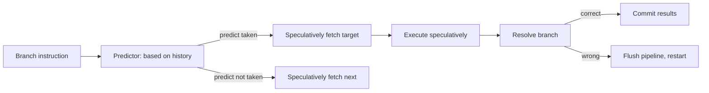

# 5. Improving Execution Predictability

> "A modern CPU is a speculation machine. It guesses what is coming next — the next instruction, the next branch outcome, the next memory address — and starts working on it before confirming the guess. When the guesses are right, the CPU runs at full speed. When the guesses are wrong, the CPU throws away 15–20 cycles of work and starts over. An engine engineer's job is to make the CPU's guesses right."

**Execution predictability** is the degree to which the CPU's speculation is correct. Predictable code runs at full hardware speed; unpredictable code runs at a fraction of it. This note covers the two pillars of predictability: branch prediction and loop stability.

---

## 4.5.1 Branch Prediction Optimization

Modern CPUs use **branch prediction** to guess the outcome of conditional branches before they are resolved. A correct prediction costs nothing (the branch is essentially free); a misprediction costs 15–20 cycles (the CPU must flush its pipeline and restart).

### How Branch Prediction Works

The CPU's branch predictor maintains history tables:

- **Local history.** The last N outcomes of each branch. Used to predict the next outcome.
- **Global history.** The last N branch outcomes across all branches. Some branches are correlated with previous branches.
- **Pattern detection.** Some branches follow patterns (e.g., "always taken on even iterations"). The predictor detects these patterns.

A typical predictor achieves 95–99% accuracy on well-structured code. The 1–5% mispredictions can still cost 10–50% of performance if the branches are in the hot loop.



### Patterns the Predictor Loves

- **Loops with a fixed trip count.** `for (int i = 0; i < N; i++)`. The branch "exit loop?" is taken N-1 times, then not taken once. The predictor learns this pattern and achieves near-100% accuracy.
- **If-else with a consistent bias.** `if (rare_condition) { ... }`. If the condition is true 1% of the time, the predictor learns to always predict "false" and achieves 99% accuracy.
- **Alternating patterns.** The predictor can detect "true, false, true, false, ..." patterns.

### Patterns the Predictor Hates

- **Random branches.** `if (random_bit) { ... }`. No pattern; 50% accuracy; 50% misprediction rate.
- **Input-dependent branches with no bias.** `if (input[i] > threshold) { ... }` where the input is uniformly distributed.
- **Correlated branches without enough history.** Some branches depend on the outcomes of several previous branches; if the history table is too small, the predictor cannot capture the correlation.

### Branchless Code

The most reliable way to eliminate branch mispredictions is to eliminate the branch. **Branchless code** uses arithmetic and conditional moves instead of branches.

**Example: clamping a value to [lo, hi].**

Branched:
```c
if (x < lo) x = lo;
else if (x > hi) x = hi;
```
Two branches. If `x` is uniformly distributed, each branch is 50% taken — 50% misprediction rate.

Branchless:
```c
x = (x < lo) ? lo : (x > hi) ? hi : x;
```
This still has branches (the ternary operator compiles to a branch). True branchless:
```c
x = std::max(std::min(x, hi), lo);
```
`std::max` and `std::min` compile to conditional moves (`CMOV` on x86), which are not predicted branches — they are unconditional instructions that select between two values based on a condition flag.

Or, using bitwise operations:
```c
// Branchless clamp using bit manipulation
int mask_lo = -(x < lo);    // all 1s if x < lo, all 0s otherwise
int mask_hi = -(x > hi);
x = (x & ~mask_lo & ~mask_hi) | (lo & mask_lo) | (hi & mask_hi);
```

This compiles to a few arithmetic instructions, no branches.

### When to Use Branchless Code

Use branchless code when:

- The branch is unpredictable (no clear bias, no pattern).
- The branch is in a hot loop.
- The branchless version is not significantly more complex.

Use branches when:

- The branch is highly predictable (>95% one way).
- The branch is not in a hot loop.
- The branchless version is significantly more complex.

**Rule of thumb:** measure both versions. The right choice depends on the specific case.

### Conditional Moves vs Branches

On x86, conditional moves (`CMOVcc`) are the hardware implementation of branchless code. They are unconditional instructions that select between two registers based on a condition flag set by a previous comparison.

```c
// Branched
if (a > b) result = a; else result = b;

// Conditional move (what the compiler generates for std::max)
result = a;
if (b > a) result = b;  // compiles to CMOV
```

Conditional moves have a fixed cost (~1 cycle) regardless of which value is selected. Branches have a variable cost (~1 cycle if predicted, ~15 cycles if mispredicted). For unpredictable branches, conditional moves are 10× faster.

### Lookup Table Pattern

For complex branches with many outcomes, a lookup table is often faster than a switch statement:

```c
// Switch (branchy)
switch (op) {
    case ADD: result = a + b; break;
    case SUB: result = a - b; break;
    case MUL: result = a * b; break;
    case DIV: result = a / b; break;
    // ...
}

// Lookup table (branchless)
typedef int (*OpFunc)(int, int);
OpFunc ops[] = { op_add, op_sub, op_mul, op_div, ... };
result = ops[op](a, b);
```

The lookup table replaces the branch with an indirect function call. Indirect calls have their own cost (branch prediction on the call target), but for many cases, this is faster than a switch.

For very simple operations, a lookup table of values (not functions) is even faster:

```c
// Lookup table of results
int results[] = { 0, 1, 4, 9, 16, 25, ... };  // squares
result = results[n];
```

This eliminates both the branch and the function call.

---

## 4.5.2 Fixed Loop Limits

The second pillar of predictability is **loop stability**. Loops with fixed limits and simple bodies are easier for the CPU to optimize than loops with variable limits and complex bodies.

### Why Fixed Limits Help

A loop with a fixed limit `for (int i = 0; i < 1000; i++)` allows the CPU to:

- **Predict the loop exit** (always taken until the last iteration).
- **Unroll the loop** (process multiple iterations per cycle).
- **Software pipeline** (overlap memory loads of iteration N+1 with computation of iteration N).
- **Pre-compute induction variables** (the value of `i` at any iteration is known in advance).

A loop with a variable limit `for (int i = 0; i < N; i++)` (where N changes per call) loses some of these optimizations, but the compiler can still unroll if N is known at the call site.

A loop with a complex condition `for (int i = 0; some_function(i); i++)` loses all of these optimizations. The CPU cannot predict when the loop will exit; the compiler cannot unroll.

### Avoiding Variable-Length Loop Conditions

**Bad:** Variable condition in the loop.
```c
for (int i = 0; i < n && !found; i++) {
    if (arr[i] == target) found = true;
}
```

**Better:** Fixed upper bound, break inside.
```c
for (int i = 0; i < n; i++) {
    if (arr[i] == target) {
        found = true;
        break;
    }
}
```

The `break` is still a branch, but it is highly predictable (almost always not taken, since most search loops do not find the target on every iteration).

**Best (for very hot loops):** Process in fixed-size chunks.
```c
for (int i = 0; i < n; i += 8) {
    // Process 8 elements at a time
    __m256i v = _mm256_loadu_ps(arr + i);
    __m256i cmp = _mm256_cmpeq_ps(v, target);
    if (_mm256_testz_si256(cmp, cmp)) {
        // None matched in this chunk, continue
        continue;
    }
    // One or more matched, find which
    int mask = _mm256_movemask_ps(cmp);
    int idx = __builtin_ctz(mask);
    found_idx = i + idx;
    found = true;
    break;
}
```

This processes 8 elements per branch, reducing the branch count by 8×.

### Loop Unrolling

**Loop unrolling** is the manual or compiler-driven transformation of a loop into a loop that processes multiple elements per iteration.

**Original:**
```c
for (int i = 0; i < n; i++) {
    c[i] = a[i] + b[i];
}
```

**Unrolled by 4:**
```c
for (int i = 0; i + 3 < n; i += 4) {
    c[i] = a[i] + b[i];
    c[i+1] = a[i+1] + b[i+1];
    c[i+2] = a[i+2] + b[i+2];
    c[i+3] = a[i+3] + b[i+3];
}
// Handle remainder
for (; i < n; i++) {
    c[i] = a[i] + b[i];
}
```

Benefits:
- **Fewer loop overhead instructions.** 4× fewer `i++` and `i < n` checks.
- **More instructions per branch.** Better instruction-level parallelism.
- **Better register allocation.** The compiler has 4 independent operations to schedule.

Compilers auto-unroll with `-O3` and `-funroll-loops`. Manual unrolling is rarely needed; let the compiler do it.

### Loop Fusion and Fission

**Loop fusion** combines two loops over the same data into one:

```c
// Before fusion
for (int i = 0; i < n; i++) a[i] = a[i] + 1;
for (int i = 0; i < n; i++) b[i] = b[i] * 2;

// After fusion
for (int i = 0; i < n; i++) {
    a[i] = a[i] + 1;
    b[i] = b[i] * 2;
}
```

Benefits: half the loop overhead, better cache behavior (each `i` is touched once).

**Loop fission** is the opposite: splitting one loop into two:

```c
// Before fission
for (int i = 0; i < n; i++) {
    a[i] = expensive1(i);
    b[i] = expensive2(i);
}

// After fission
for (int i = 0; i < n; i++) a[i] = expensive1(i);
for (int i = 0; i < n; i++) b[i] = expensive2(i);
```

Benefits: better register allocation (each loop has fewer live values), better instruction cache usage (smaller loop body fits in cache).

The choice between fusion and fission depends on the specific loop. Measure both.

---

## 4.5.3 Stability of Memory Access Patterns

Predictability extends beyond branches and loops to memory access patterns. The CPU's hardware prefetcher (Chapter 4.3) predicts memory accesses; predictable patterns are prefetched, unpredictable patterns are not.

### Stable Patterns

- **Sequential access.** `arr[0], arr[1], arr[2], ...`. Perfectly predictable.
- **Constant stride.** `arr[0], arr[8], arr[16], ...`. Predictable; the prefetcher detects the stride.
- **Multiple streams.** `a[i]` and `b[i]` in the same loop. The prefetcher tracks multiple streams.

### Unstable Patterns

- **Variable stride.** `arr[i], arr[i + random()]`. No pattern.
- **Data-dependent access.** `arr[hash(key)]`. Hash is data-dependent; no pattern.
- **Pointer chasing.** `node = node->next`. Each node is at a random address.

For unstable patterns, software prefetching (`__builtin_prefetch`) can help if the access is predictable to the engineer but not to the hardware.

---

## 4.5.4 The Cost of Unpredictability — A Quantitative Example

Consider a loop that processes 1 million elements:

**Predictable version:**
- 1 million iterations.
- Each iteration: 1 cache line load (1 ns from L1), 1 branch (predicted), 1 arithmetic op.
- Total: 1 million × ~1 ns = ~1 ms.

**Unpredictable version (50% branch misprediction):**
- 1 million iterations.
- Each iteration: 1 cache line load, 1 branch (50% mispredicted), 1 arithmetic op.
- Average cost: 1 ns + 0.5 × 15 ns + 0.5 ns = ~9 ns per iteration.
- Total: 1 million × ~9 ns = ~9 ms.

**9× slowdown from branch mispredictions alone.**

This is why branchless code matters. The same 9× speedup is available by making the branch predictable or eliminating it.

---

## 4.5.5 Profiling Branch Behavior

To know whether branches are your bottleneck, measure:

- **`perf stat` (Linux).** Reports branch instructions, branch misses, and the miss rate.
- **Intel VTune.** "Branch Analysis" profile shows misprediction hot spots.

A healthy hot loop has < 1% branch misprediction rate. If you see 5%+ mispredictions, you have a branch problem.

```bash
$ perf stat -e branches,branch-misses ./engine
   1000000000 branches
    50000000 branch-misses    # 5% miss rate — too high
```

Identify the hot loop with the most misses, and apply branchless techniques.

---

## 4.5.6 Common Pitfalls

### Pitfall 1: Branches in the Hot Loop

Every branch in the hot loop is a potential misprediction. Look for opportunities to make branches predictable (consistent bias) or eliminate them (branchless code).

### Pitfall 2: Switch Statements with Many Cases

A switch with many cases compiles to a jump table — an indirect branch. Indirect branches are harder to predict than direct branches. If the switch is in the hot loop, consider replacing with a lookup table or function pointer table.

### Pitfall 3: Input-Dependent Branches Without Bias

`if (input[i] > threshold)` is unpredictable if `input` is uniformly distributed. Either restructure to remove the branch (SIMD comparison) or accept the misprediction cost.

### Pitfall 4: Variable Loop Limits

`for (int i = 0; i < f(x); i++)` where `f(x)` is computed per iteration. The loop limit is unpredictable. Compute `f(x)` once before the loop.

### Pitfall 5: Complex Loop Conditions

`for (int i = 0; i < n && condition; i++)`. The `&& condition` adds a branch per iteration. If the condition is rarely true, the branch is predictable; if it is sometimes true, it is unpredictable.

### Pitfall 6: Not Using Conditional Moves

When the compiler cannot prove a branch is predictable, it may emit a branch instead of a conditional move. Use `std::min`, `std::max`, ternary operator, or bit manipulation to encourage conditional moves.

### Pitfall 7: Branches in SIMD Code

A branch inside a SIMD loop forces the compiler to either vectorize both paths and select (expensive) or fall back to scalar (loses SIMD speedup). Make the loop body branchless before vectorizing.

### Pitfall 8: Function Calls in Hot Loops

A function call is an indirect branch (the call target). For very hot loops, inline the function. For functions called via function pointer, the call target may be unpredictable; consider replacing with a switch (which compiles to a jump table, sometimes more predictable).

---

## 4.5.7 Important Reminders

- **Branch mispredictions cost 15–20 cycles.** In a hot loop, even 1% mispredictions can cost 10%+ of performance.
- **Predictable branches are nearly free.** Make branches predictable (consistent bias) or eliminate them (branchless).
- **Branchless code uses arithmetic and conditional moves.** `std::min`, `std::max`, ternary, bit manipulation.
- **Lookup tables replace complex switches.** Especially for simple operations.
- **Fixed loop limits enable optimization.** Avoid variable conditions in the loop header.
- **Loop unrolling reduces overhead.** Let the compiler do it with `-O3`.
- **Loop fusion/fission: choose based on measurement.** Fusion reduces overhead; fission improves register allocation.
- **Stable memory access patterns enable prefetching.** Sequential and constant-stride patterns are best.
- **Profile branch behavior.** `perf stat`, VTune. Healthy hot loops have < 1% mispredictions.

---

## 4.5.8 Summary

Execution predictability is the degree to which the CPU's speculation is correct. Predictable code runs at full hardware speed; unpredictable code runs at a fraction of it.

The two pillars of predictability are:

1. **Branch prediction optimization.** Make branches predictable (consistent bias) or eliminate them (branchless code, conditional moves, lookup tables).
2. **Loop stability.** Use fixed limits, simple bodies, and stable memory access patterns.

A single 5% branch misprediction rate can cost 10%+ of performance in a hot loop. The fix is usually to make the branch predictable or eliminate it via branchless techniques. Measure with `perf stat` or VTune.

With branch prediction and loop stability mastered, the engine's hot loop runs at near-peak hardware speed. The remaining performance limits are the data layout (Chapter 4.1) and the algorithm (Chapter 2).

This completes Chapter 4 — Hardware-Aware Engine Design. Chapter 5 covers the cognitive illusions that make heuristic search systems appear intelligent.

---

**Previous note:** [[4. Vectorized Processing The Batch Strategy]]
**Next chapter:** [[1. Massively Bounded Exploration Paths]]
