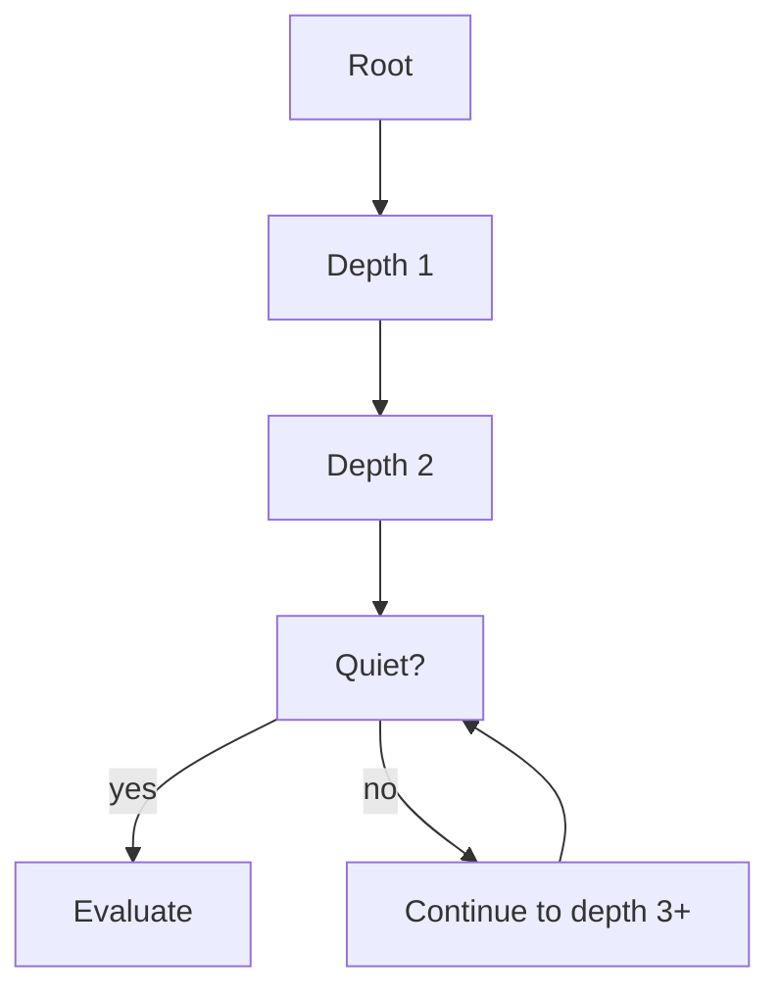

# 1. Massively Bounded Exploration Paths

> "An engine does not search the full space of possibilities. It searches a *tiny, highly relevant subset* — typically 0.001% or less of the total space. This massive reduction is what makes engines fast enough to be useful, and it is the first and most powerful of the cognitive illusions: the engine appears to be 'considering everything', but it is actually considering almost nothing."

This is the first of four notes on the cognitive illusions that make heuristic search systems appear intelligent. The illusions are: pruning (this note), approximation (next note), cached knowledge, and iterative refinement. Together, they explain why a chess engine appears to "understand" chess, why a search engine appears to "know" what you want, and why a trading engine appears to "anticipate" the market.

---

## 5.1.1 Eliminating Search Space Explosion

Most engine search spaces are **exponential**: the number of possible futures grows exponentially with the depth of the search. Chess has a branching factor of ~35; a 7-ply search has $35^7 \approx 6 \times 10^{10}$ nodes. A 10-ply search has $35^{10} \approx 2 \times 10^{15}$ nodes. A 20-ply search — well beyond the reach of any engine — would have $35^{20} \approx 4 \times 10^{30}$ nodes.

Without pruning, no engine could search deeper than a few ply. With pruning, modern chess engines search 30+ ply in the middle game. The 100-trillion-fold reduction in search space is what makes this possible.

### The Math of Pruning

The general formula for a pruned search:

$$\text{Nodes searched} = b^{d \cdot (1 - p)}$$

where:
- $b$ is the branching factor.
- $d$ is the depth.
- $p$ is the pruning efficiency (fraction of branches pruned).

For alpha-beta with perfect move ordering, $p \approx 0.5$ — half the branches are pruned. This reduces the effective branching factor from $b$ to $\sqrt{b}$. For chess ($b = 35$), this is a reduction from 35 to ~6.

| Pruning efficiency $p$ | Effective branching factor (b=35) | Nodes at depth 10 |
|---|---|---|
| 0 (no pruning) | 35 | $2.8 \times 10^{15}$ |
| 0.5 (alpha-beta) | 5.9 | $5.1 \times 10^7$ |
| 0.7 (alpha-beta + LMR) | 1.9 | 613 |
| 0.9 (theoretical limit) | 1.4 | 28 |

Each increment in pruning efficiency reduces the search space by orders of magnitude. This is why pruning is the most powerful optimization in any search engine.


### Sources of Pruning

Pruning comes from several sources, each exploiting a different property of the search:

1. **Tree-search pruning** (alpha-beta, PVS). Exploits the adversarial structure: if the opponent has a good reply, my move is bad, so stop searching it.

2. **Heuristic pruning** (null-move, late-move reductions). Exploits statistical properties: if a "null move" still gives a good position, the position is so good that further search is unnecessary.

3. **Transposition pruning** (transposition tables). Exploits the fact that the same position can be reached via different move orders. Once evaluated, no need to re-evaluate.

4. **Symmetry pruning**. Exploits symmetries in the problem: a chess position with pieces reflected is equivalent; only one needs to be searched.

5. **Dominance pruning**. If move A dominates move B (A is at least as good as B in every continuation), B can be pruned.

6. **Threshold pruning** (WAND in search). If a candidate's maximum possible score is below the current top-k threshold, prune it.

---

## 5.1.2 Bounding the Search Frontier

The second technique for bounding exploration is **depth limiting**: do not search to arbitrary depth; search to a fixed depth (or a depth bounded by a time budget).

### Fixed-Depth Search

The simplest form: search to depth $d$, evaluate leaves with a heuristic.

```python
def search(state, depth):
    if depth == 0:
        return evaluate(state)
    # ... search children at depth - 1
```

Pros: predictable time, easy to implement.
Cons: horizon effect — tactics just beyond the depth limit are missed.

### Iterative Deepening

Already discussed in Chapter 2. Search depth 1, then 2, then 3, ... until time budget is exhausted. Provides any-time behavior and improves move ordering for deeper searches.

### Variable-Depth Search (Quiescence, Singular Extensions)

Some positions warrant deeper search than others. **Quiescence search** extends the search at "noisy" positions (captures, checks) until the position is "quiet". **Singular extensions** extend the search along moves that are "clearly best".



Variable-depth search combines the speed of fixed-depth with the accuracy of deeper search. It is the dominant pattern in modern game-tree engines.

### Time-Bounded Search

For real-time engines, the search must respect a time budget. The budget is divided across the tree:

- **Root moves** get equal time initially.
- **Promising moves** get more time (iterative deepening allocates time based on previous iterations).
- **Quiescence search** gets a fraction of the per-node budget.

If the budget is exhausted mid-search, the engine returns the best move found so far. This is why any-time algorithms (iterative deepening, MCTS) are essential: they always have a "best so far" answer ready.

### Bounding by Latency Budget

For real-time engines (trading, search), the latency budget is the ultimate bound. A search engine has ~200 ms to return results; a trading engine has ~10 μs to decide whether to trade. The engine's search is structured to fit within this budget:

- **Pre-compute as much as possible.** Indexes, embeddings, learned models are computed offline; the search just looks them up.
- **Multi-stage cascade.** Cheap stages on many candidates; expensive stages on few.
- **Early termination.** If a stage has enough good candidates, stop processing more.


Each stage respects its time budget. If a stage runs over, the next stage gets less time. If the total runs over, the engine returns partial results.

---

## 5.1.3 The Illusion of Intelligence

The cognitive illusion: when an engine returns a brilliant move (chess), a perfect recommendation (search), or a profitable trade (trading), the user attributes this to "intelligence". In reality, it is the product of massive pruning:

- The chess engine searched $10^7$ nodes, not $10^{15}$.
- The search engine scored $10^4$ candidates, not $10^9$ documents.
- The trading engine evaluated $10^2$ order combinations, not $10^6$.

The pruning is invisible to the user; the result appears to be the product of exhaustive consideration. This is the first and most powerful cognitive illusion of heuristic search.

### How the Illusion Is Manufactured

The illusion is manufactured by three techniques:

1. **The pruning is correct (or nearly so).** Alpha-beta pruning is provably correct: the pruned branches cannot affect the answer. The user can trust the result as if it came from exhaustive search.

2. **The result is "good enough".** Even when pruning is heuristic (and therefore not provably correct), the result is usually correct in practice. The engine may miss the absolute best move occasionally, but it almost always finds a good move.

3. **The result is presented with confidence.** The engine does not say "I searched 0.001% of the space and found this". It says "Best move: e4". The presentation obscures the pruning.

### Why This Matters for Engine Engineers

Understanding this illusion matters because:

1. **It tells you where to focus.** Improving pruning is the highest-leverage optimization. A 10% improvement in pruning efficiency reduces search time by ~50%.

2. **It tells you when to be careful.** Heuristic pruning can fail. Null-move pruning fails in zugzwang; LMR can miss tactical resources. Always test pruned search against unpruned.

3. **It tells you what users expect.** Users expect exhaustive consideration. When the engine fails (returns a bad move), users are surprised. The engine should be conservative — better to be slightly slower and more accurate than to be fast and wrong.

---

## 5.1.4 Pruning in Different Domains

The pruning techniques vary by domain:

### Chess

- **Alpha-beta pruning.** Adversarial pruning; provably correct.
- **Null-move pruning.** Heuristic; fails in zugzwang.
- **Late-move reductions (LMR).** Heuristic; may miss tactics in late moves.
- **Futility pruning.** Heuristic; prunes non-capturing moves at depth 1.
- **Transposition table.** Caching; eliminates duplicate work.

### Search

- **WAND / MaxScore.** Threshold pruning; skips documents that cannot make top-k.
- **Term-based pruning.** Ignore rare or non-discriminative terms.
- **Shard pruning.** Skip shards that cannot contain relevant documents (using Bloom filters or shard statistics).
- **Static ranking pruning.** Only consider documents above a PageRank threshold.

### Trading

- **Risk-based pruning.** Skip orders that violate risk limits.
- **Liquidity pruning.** Skip instruments with insufficient liquidity.
- **Latency pruning.** Skip signals that arrived too late to be actionable.

### Parser

- **Grammar pruning.** Skip non-terminals that cannot match the input.
- **Memoization pruning.** Skip re-parsing of memoized prefixes.
- **Error recovery pruning.** After an error, skip ahead to a synchronization point.

### Recommendation

- **ANN pruning.** Skip items that are far from the user embedding.
- **Popularity pruning.** Skip items with insufficient interaction history (cold-start items).
- **Diversity pruning.** After selecting an item, skip similar items to maintain diversity.

---

## 5.1.5 Common Pitfalls

### Pitfall 1: Over-Pruning

Aggressive pruning can miss important branches. Symptoms: the engine returns moves that are clearly worse than a human would find; the engine's strength regresses after adding a new pruning technique.

Mitigation: test pruned search against unpruned (or lightly pruned) search on a benchmark suite. If pruning causes a measurable strength regression, reduce its aggressiveness.

### Pitfall 2: Under-Pruning

Conservative pruning leaves performance on the table. Symptoms: the engine is much slower than competitors of similar strength; the engine searches shallower than competitors.

Mitigation: profile the search to identify where time is spent. If most time is spent on branches that do not affect the answer, add pruning for those branches.

### Pitfall 3: Pruning Without Testing

Adding a pruning technique without testing its effect on correctness is dangerous. The pruning may be incorrect in subtle ways, causing the engine to fail in specific positions.

Mitigation: every pruning technique should be (1) tested against unpruned search on a benchmark, (2) provably correct (if possible) or empirically validated, (3) configurable so it can be disabled in case of problems.

### Pitfall 4: Wrong Pruning for the Domain

Adversarial pruning (alpha-beta) does not work for non-adversarial search. Threshold pruning (WAND) does not work for problems without a clear "top-k" structure. Choose the right pruning technique for the domain.

### Pitfall 5: Not Bounding the Search Depth

Without a depth bound, the search may run forever (or until memory runs out). Always bound the depth, either explicitly (fixed depth) or implicitly (time budget).

### Pitfall 6: Not Handling the Time Budget

If the time budget is exhausted mid-search, the engine must return a "best so far" answer. This requires any-time algorithms (iterative deepening, MCTS). Without them, the engine either misses the deadline (bad) or returns no answer (worse).

### Pitfall 7: Variable Latency Without Backpressure

If the engine's latency varies (due to varying search depth), downstream systems may be overwhelmed. Either keep latency constant (fixed depth) or implement backpressure (refuse work when the queue is full).

---

## 5.1.6 Important Reminders

- **Pruning is the highest-leverage optimization in search.** A 10% improvement in pruning efficiency gives ~50% speedup.
- **Different pruning techniques exploit different properties.** Choose the right one for your domain.
- **Heuristic pruning can fail.** Test against unpruned search; be conservative.
- **Iterative deepening for any-time behavior.** Always have a "best so far" answer.
- **Quiescence search prevents horizon effect.** Extend at noisy positions.
- **Time budget is the ultimate bound.** Structure the search to fit.
- **Multi-stage cascade for real-time engines.** Cheap stages on many candidates; expensive on few.
- **The illusion of intelligence comes from pruning.** Users see the result; they do not see the 99.999% of the space that was skipped.

---

## 5.1.7 Summary

Massively bounded exploration paths — pruning — is the first and most powerful cognitive illusion of heuristic search. Engines do not search the full space; they search a tiny, highly relevant subset (typically 0.001% or less). This massive reduction is what makes engines fast enough to be useful.

Pruning comes from many sources: tree-search pruning (alpha-beta), heuristic pruning (null-move, LMR), transposition pruning (caching), threshold pruning (WAND), and many others. Each exploits a different property of the search.

The illusion of intelligence is manufactured by correct (or nearly correct) pruning that produces results indistinguishable from exhaustive search. The user sees the result; they do not see the pruning.

For engine engineers, pruning is the highest-leverage optimization. Improving pruning efficiency by 10% can reduce search time by 50%. But heuristic pruning can fail; always test against unpruned search and be conservative.

---

**Previous chapter:** [[5. Improving Execution Predictability]]
**Next note:** [[2. Fast Approximations vs Complete Evaluations]]
