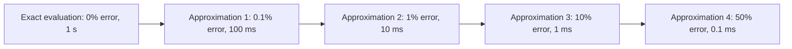

# 2. Fast Approximations vs Complete Evaluations

> "An engine's evaluation function is not the truth. It is a fast estimate of the truth — a heuristic that is right 95% of the time and wrong 5% of the time. The 5% errors are usually small enough to be corrected by deeper search; the 95% correctness is enough to make the engine appear to 'understand' the position. This is the second cognitive illusion: the engine appears to evaluate exactly, when it is actually approximating."

This is the second note on the cognitive illusions of heuristic search. The first illusion (pruning) was about *what* the engine searches; this illusion (approximation) is about *how* the engine evaluates what it searches.

---

## 5.2.1 Design of Heuristic Scoring Functions

The **evaluation function** is the engine's estimate of the value of a state. In a perfect world, it would compute the exact game-theoretic value (win/draw/loss for chess; relevance score for search; expected return for trading). In practice, exact computation is intractable, and the engine uses a heuristic.

### The Anatomy of a Heuristic Scorer

Most heuristic scorers are **linear combinations of features**:

$$\text{score}(s) = \sum_{i=1}^{k} w_i \cdot f_i(s)$$

where:
- $f_i$ are **feature functions** that extract a numeric property of the state.
- $w_i$ are **weights** that determine each feature's contribution.

The art is choosing the features and tuning the weights. This has been the dominant paradigm in engine design since the 1950s, and it remains competitive with learned models in many domains.

### Feature Engineering

Good features have three properties:

1. **Relevance.** The feature correlates with the target. (Material count is relevant to chess evaluation; the number of vowels on the board is not.)
2. **Cheap computation.** The feature can be computed in O(1) or O(log N) time. (Material count is O(1); "the number of forced mates in 5 moves" is exponential.)
3. **Orthogonality.** The feature is not redundant with other features. (Material count and "sum of piece values" are the same feature; using both is wasteful.)

**Examples of features by domain:**

| Domain | Feature | What it captures |
|---|---|---|
| Chess | Material count | Who is ahead in pieces |
| Chess | Piece-square tables | Positional bonus for pieces on good squares |
| Chess | Pawn structure | Doubled, isolated, passed pawns |
| Chess | King safety | Pawn shield, open files near king |
| Search | BM25 score | Text relevance of document to query |
| Search | PageRank | Authority of the document |
| Search | Click-through rate | User engagement with the document |
| Search | Freshness | How recent the document is |
| Trading | Order book imbalance | Buy vs sell pressure |
| Trading | Recent trade flow | Direction of recent trades |
| Trading | Volatility | Recent price movement magnitude |
| Recommendation | User-item dot product | Latent similarity |
| Recommendation | Item popularity | Broad appeal |
| Recommendation | Recency of interaction | User's current interest |

### Weight Tuning

Once features are chosen, the weights must be tuned. Methods:

1. **Manual tuning.** An expert sets the weights based on intuition. Slow, subjective, but useful for prototyping.

2. **Grid search.** Try every combination of weights on a grid; pick the best. Exponential in the number of features; only feasible for small feature sets.

3. **Logistic regression.** Treat weight tuning as a supervised learning problem: given a dataset of (state, correct_score) pairs, learn the weights via logistic regression. Effective when labeled data is available.

4. **Reinforcement learning.** The engine plays against itself; weights are adjusted based on win/loss outcomes. Used by AlphaZero, Leela Chess Zero.

5. **Bayesian optimization.** A sample-efficient method for tuning black-box functions. Used when the evaluation is expensive (e.g., a full tournament).

### When Heuristics Beat Learned Models

Despite the hype around ML, hand-tuned heuristics remain competitive in many domains:

- **When training data is scarce.** A learned model needs thousands of examples; a heuristic can be designed from first principles.
- **When interpretability matters.** A heuristic can be inspected and understood; a neural network is opaque.
- **When the cost of error is high.** A heuristic can be conservative; a learned model may have blind spots.
- **When the cost of inference matters.** A heuristic is typically O(1); a learned model is typically O(N) for N parameters.

Modern engines often combine both: a heuristic for the bulk of the evaluation, with a learned model for the final refinement.

---

## 5.2.2 Multi-Stage Selection Filters

The most powerful pattern in modern engine evaluation is the **multi-stage cascade**: cheap approximate scorers filter the candidate set, and expensive exact scorers finalize the ranking.

Each stage:
- Takes the previous stage's survivors as input.
- Applies a more expensive, more accurate scorer.
- Filters to a smaller candidate set.

The key insight: **the cheap stage filters out 90% of candidates with 10% error, but the 10% that survive are evaluated by the expensive stage with 0.1% error**. The overall error rate is dominated by the expensive stage, not the cheap stage.

### Stage Design Principles

1. **Cheap stages should be conservative.** They should not prune candidates that the expensive stage would rank highly. False positives are OK (the expensive stage will reject them); false negatives are not (a missed candidate is gone forever).

2. **Expensive stages should be accurate.** They are the final arbiters; their accuracy is the system's accuracy.

3. **The candidate set should shrink rapidly.** Each stage should reduce the set by 5–10×. If a stage only reduces by 2×, it is not earning its cost.

4. **Stages should be order-sensitive.** The cheapest stage comes first; the most expensive stage comes last. Reordering wastes work.

### Real-World Examples

**Web search (Google, Bing):**
- Stage 1: BM25 (text relevance) — 1 ms per 1000 candidates.
- Stage 2: Learned ranker (hundreds of features) — 10 ms per 1000.
- Stage 3: Cross-encoder (BERT) — 1 ms per candidate.
- Total: ~100 ms per query.

**Recommendation (TikTok, YouTube):**
- Stage 1: ANN retrieval — 10 ms per 1000 candidates.
- Stage 2: Coarse neural ranker — 5 ms per 1000.
- Stage 3: Fine neural ranker — 50 ms per 100.
- Stage 4: Re-ranker (diversity, freshness) — 5 ms per 30.
- Total: ~100 ms per recommendation.

**Trading:**
- Stage 1: Alpha signal threshold — 1 μs per instrument.
- Stage 2: Risk check — 5 μs per order.
- Stage 3: Smart order routing — 10 μs per venue.
- Total: ~20 μs per decision.

**Chess:**
- Stage 1: Static evaluation (NNUE) — 10 ns per position.
- Stage 2: Quiescence search — 1 μs per position.
- Stage 3: Full alpha-beta search — 100 μs per position.
- Total: ~1 s per move (millions of positions).

In every domain, the same pattern: cheap approximate scorers filter; expensive exact scorers finalize.

### The Math of Multi-Stage Filtering

Suppose we have N candidates and three stages with:
- Cost per candidate: $c_1 < c_2 < c_3$.
- Selectivity (fraction passing): $s_1 > s_2 > s_3$.
- Total cost: $N \cdot c_1 + N \cdot s_1 \cdot c_2 + N \cdot s_1 \cdot s_2 \cdot c_3$.

For $N = 10000$, $c_1 = 1$ μs, $c_2 = 10$ μs, $c_3 = 100$ μs, $s_1 = 0.1$, $s_2 = 0.1$:
- Cost = $10000 \cdot 1 + 1000 \cdot 10 + 100 \cdot 100 = 10000 + 10000 + 10000 = 30$ ms.

Without the cascade (all candidates through stage 3):
- Cost = $10000 \cdot 100 = 1000$ ms.

**33× speedup** from the cascade.

The cascade is the dominant pattern because it works. Always look for opportunities to add a cheap pre-filter before an expensive computation.

---

## 5.2.3 The Trade-off: Approximation Error vs Cost

Every approximation trades accuracy for speed. The trade-off is governed by the **Pareto frontier**: the set of (error, cost) pairs where you cannot improve one without worsening the other.

The engineer's job is to find the right point on this frontier for their use case:

- **0% error, 1 s:** acceptable if the engine has 1 second per query (e.g., batch analytics).
- **0.1% error, 100 ms:** acceptable for real-time search (Google's 200 ms budget).
- **1% error, 10 ms:** acceptable for recommendation (TikTok's 100 ms budget).
- **10% error, 1 ms:** acceptable for high-frequency trading (10 μs budget).
- **50% error, 0.1 ms:** only acceptable for pre-filtering (the candidates will be re-evaluated).

### Choosing the Right Approximation

The right approximation depends on:

1. **The latency budget.** How much time can you afford per evaluation?
2. **The error tolerance.** How much error can the downstream system tolerate?
3. **The cost of error.** Is a wrong answer catastrophic (trading) or merely suboptimal (recommendation)?
4. **The structure of the problem.** Some problems have natural approximations (e.g., sampling for Monte Carlo); others do not.

### Bounding Approximation Error

For an approximation to be trustworthy, its error must be bounded:

- **Deterministic bound.** The error is at most ε, for all inputs. Example: floating-point arithmetic (relative error ~$2^{-23}$ for float32).
- **Probabilistic bound.** The error is at most ε with probability $1 - \delta$. Example: Monte Carlo estimation (error decreases as $O(1/\sqrt{N})$).
- **Empirical bound.** The error is at most ε on a test set, but no theoretical guarantee. Example: most learned models.

For engine correctness, deterministic bounds are preferred. Probabilistic bounds are acceptable when the failure probability can be made arbitrarily small. Empirical bounds are risky — the model may fail on out-of-distribution inputs.

---

## 5.2.4 Approximation Techniques

### Sampling

Replace exhaustive computation with computation on a random sample. The error decreases as $O(1/\sqrt{N})$ where N is the sample size.

**Examples:**
- **Monte Carlo Tree Search.** Estimate the value of a game state by simulating N random playouts.
- **Approximate counting.** Estimate the cardinality of a set by sampling.
- **Survey sampling.** Estimate user preferences by sampling the user base.

### Sketching

Replace a large data structure with a small "sketch" that approximates it.

**Examples:**
- **Bloom filter.** Approximates a set; supports membership queries with false positives.
- **HyperLogLog.** Approximates cardinality; uses $O(\log \log N)$ memory.
- **Count-Min Sketch.** Approximates frequencies; uses sublinear memory.
- **T-Digest.** Approximates quantiles; uses sublinear memory.

### Lossy Compression

Replace exact data with lossily compressed data.

**Examples:**
- **Product quantization (PQ).** Compresses vector embeddings 10–100× with small accuracy loss.
- **Scalar quantization.** Compresses 32-bit floats to 8-bit integers.
- **Image compression.** JPEG, WebP — discard high-frequency components.

### Learned Models

Replace hand-coded logic with a learned model.

**Examples:**
- **NNUE.** Replaces hand-tuned chess evaluation with a neural network.
- **Learned rankers.** Replaces BM25-only search ranking with a learned model.
- **Reinforcement-learned policies.** Replaces hand-coded trading rules with a learned policy.

### Caching

Replace recomputation with retrieval from a cache. The cache returns an approximate answer (the cached value may be stale).

**Examples:**
- **Search result cache.** Returns cached results for frequent queries.
- **Feature cache.** Returns cached feature values for recently-seen inputs.
- **Embedding cache.** Returns cached embeddings for recently-seen items.

### Lookup Tables

Replace complex computation with a lookup in a precomputed table.

**Examples:**
- **Magic bitboards (chess).** Precomputed attack sets for sliding pieces.
- **Endgame tablebases.** Precomputed exact results for endgame positions.
- **Pattern databases (puzzles).** Precomputed exact distances for subsets of the state.

---

## 5.2.5 Common Pitfalls

### Pitfall 1: Single-Stage Evaluation

A single expensive evaluator on all candidates is 10–100× slower than a multi-stage cascade. Always look for opportunities to add a cheap pre-filter.

### Pitfall 2: Cheap Stage That Is Not Conservative

If the cheap stage prunes candidates the expensive stage would rank highly, the system loses accuracy. Make the cheap stage conservative — false positives are OK, false negatives are not.

### Pitfall 3: Inappropriate Approximation

Using sampling when a deterministic bound is required. Using lossy compression when exactness is needed. Choose the approximation technique that matches the error tolerance.

### Pitfall 4: Not Bounding Error

An approximation without an error bound is just a guess. Either prove a bound or measure the empirical error on a representative test set.

### Pitfall 5: Stale Caches

A cache returns old data, which may be wrong. Implement cache invalidation; set TTLs (time-to-live) appropriately.

### Pitfall 6: Over-Fitting Learned Models

A learned model that fits the training data perfectly may fail on out-of-distribution inputs. Use cross-validation; regularize; monitor production performance.

### Pitfall 7: Not Profiling Each Stage

If you don't know how much time each stage takes, you cannot optimize. Profile each stage separately; identify the bottleneck.

### Pitfall 8: Wrong Stage Order

Stages must be ordered cheapest-first. If an expensive stage comes before a cheap one, the cheap stage's selectivity is wasted. Reorder.

---

## 5.2.6 Important Reminders

- **Heuristic scorers are linear combinations of features.** Choose features carefully; tune weights with data.
- **Multi-stage cascade is the dominant pattern.** Cheap approximate stages filter; expensive exact stages finalize.
- **Cheap stages must be conservative.** False positives OK; false negatives not.
- **Each stage should reduce the candidate set 5–10×.** Less reduction means the stage is not earning its cost.
- **Choose the right approximation technique.** Sampling, sketching, compression, learned models, caching, lookup tables.
- **Bound the approximation error.** Deterministic > probabilistic > empirical.
- **Profile each stage.** Identify bottlenecks.
- **The illusion of intelligence comes from approximation.** The engine appears to evaluate exactly; it is actually approximating, with bounded error.

---

## 5.2.7 Summary

Fast approximations vs complete evaluations is the second cognitive illusion of heuristic search. Engines do not compute exact values; they compute fast approximations that are "good enough" for the downstream decision.

The dominant pattern is the multi-stage cascade: cheap approximate scorers filter the candidate set, and expensive exact scorers finalize the ranking. Each stage reduces the candidate set 5–10×, so the expensive stages see only a small set.

Approximation techniques include sampling (Monte Carlo), sketching (Bloom filter, HyperLogLog), lossy compression (product quantization), learned models (NNUE, learned rankers), caching, and lookup tables. Each technique has its own error characteristics; choose based on the error tolerance and cost budget.

The illusion of intelligence is manufactured by approximations with bounded error that produce results indistinguishable from exact computation. The user sees the result; they do not see the approximation.

---

**Previous note:** [[1. Massively Bounded Exploration Paths]]
**Next note:** [[3. Stateful Memory Management]]
