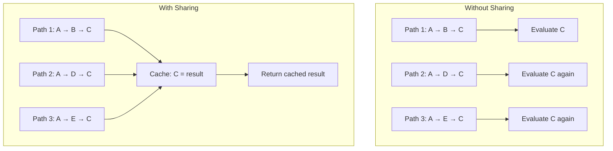
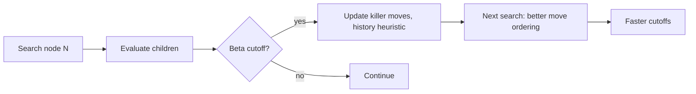
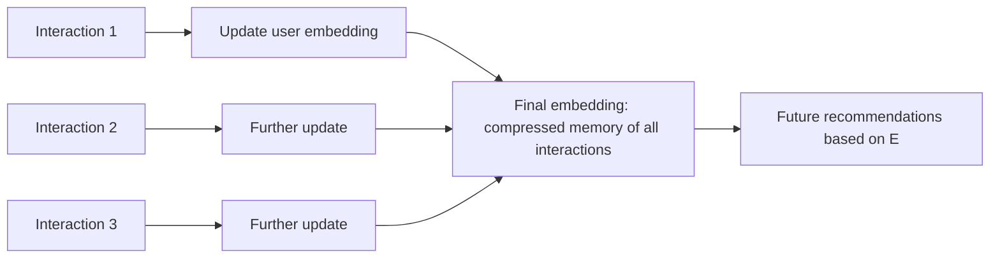

# 3. Stateful Memory Management

> "What looks like insight is often just memory. A chess engine that has seen a position 10,000 times during search 'knows' its value instantly — not because it has understood the position, but because it has cached the result. This is the third cognitive illusion: the engine appears to 'remember' and 'recognize', when it is actually performing a hash table lookup."

This is the third note on the cognitive illusions of heuristic search. The first illusion (pruning) was about what the engine searches; the second (approximation) was about how it evaluates; this illusion (memory) is about how it avoids repeating work.

---

## 5.3.1 Transposition and Path Sharing

A **transposition** is when the same state is reached via different paths. In chess, the position after `1. e4 e5 2. Nf3 Nc6 3. Bb5` is the same as after `1. e4 e5 2. Nf3 Nc6 3. Bb5` reached via a different move order. Without transposition detection, the engine would evaluate this position twice — once for each path.

### The Frequency of Transpositions

Transpositions are common in many search spaces:

- **Chess:** 30–50% of positions in a deep search are transpositions.
- **Checkers:** even more common, due to forced move sequences.
- **Graph search:** any time there are multiple paths to the same node.
- **Compiler ASTs:** the same expression may appear in multiple places.
- **Search engine queries:** the same query may be repeated by many users.

Without transposition detection, the engine does 30–50% more work than necessary. With it, each position is evaluated once.

### Transposition Tables

A **transposition table** is a hash map from state to evaluated result. The state is hashed (e.g., Zobrist hash for chess); the value is the result of the previous evaluation.

```python
def search(state, depth):
    hash = compute_hash(state)
    if hash in transposition_table:
        entry = transposition_table[hash]
        if entry.depth >= depth:
            return entry.score  # cache hit
    
    # ... compute result ...
    
    transposition_table[hash] = (depth, score, flag)
    return score
```

The transposition table is the single largest optimization in most game-tree engines, providing 5–10× speedup. The table is typically 1–16 GB; the hash is 64 bits; the replacement policy is depth-preferred.

### Path Sharing Beyond Transpositions

Transpositions are not the only form of path sharing. Other forms:

1. **Subproblem sharing.** In dynamic programming, the same subproblem is solved many times. Memoization (caching) gives exponential speedup. Example: Fibonacci, edit distance, longest common subsequence.

2. **Prefix sharing.** In parsing, the same prefix may be parsed many times in different contexts. Packrat parsing memoizes the result.

3. **Query sharing.** In search engines, the same query is repeated by many users. Query result caching gives 30–50% hit rate.

4. **Feature sharing.** In ML systems, the same feature may be computed for many users. Feature caching avoids recomputation.



### The General Pattern

The general pattern: **identify repeated computation across paths, cache the result, return the cached value on subsequent encounters.**

This is the foundation of:

- Dynamic programming.
- Memoization in functional programming.
- Transposition tables in game-tree search.
- Result caching in databases and search engines.
- Feature caching in ML systems.

---

## 5.3.2 Implicit Memory Retention

Engines do not only cache explicit computation results. They also retain **implicit memory** — patterns learned from past computation that influence future computation without being explicit lookups.

### Move Ordering as Implicit Memory

In chess, the order in which moves are tried affects the speed of alpha-beta pruning. Good move ordering (best moves first) gives 1000× speedup over random ordering.

The engine maintains several forms of implicit memory about move quality:

- **Transposition table move.** The best move from a previous search of this position. Tried first.
- **Killer moves.** Quiet moves that caused beta cutoffs at the same depth in sibling nodes. Tried second.
- **History heuristic.** Quiet moves that caused beta cutoffs anywhere in the tree. Stored in a `history[from][to]` table.
- **Countermove heuristic.** For each move, the move that most often refutes it.

These tables are updated as a side effect of search. They do not affect the *result* of the search (the same position evaluates to the same score); they affect the *speed* of the search.



### Learned Embeddings as Implicit Memory

In recommendation engines, the user and item embeddings are **implicit memory** of past interactions. The embedding captures the user's preferences in a 256-dimensional vector; future recommendations are based on this vector.

The embedding is updated as the user interacts with more items. Each interaction adjusts the embedding slightly, reflecting the new information. Over time, the embedding becomes a compressed representation of the user's entire interaction history.



### Indexes as Implicit Memory

A search engine's inverted index is **implicit memory** of the document corpus. The index was built once (or is incrementally updated); it stores, for each term, the list of documents containing it. At query time, the engine does not scan the documents; it looks up the index.

The index is a form of pre-computed memory: the work of scanning all documents for each term was done once, at index time, not repeated for each query.

### Statistics as Implicit Memory

Many engines maintain running statistics that summarize past behavior:

- **Click-through rate per document.** A search engine tracks how often each document is clicked; this influences ranking.
- **Trade success rate per strategy.** A trading engine tracks how profitable each strategy has been; this influences capital allocation.
- **Move success rate per opening.** A chess engine tracks which openings lead to wins; this influences opening book selection.

These statistics are updated continuously and influence future decisions without being explicit lookups.

---

## 5.3.3 Cache Design Principles

Whether explicit (transposition table) or implicit (move ordering), all engine memory follows similar design principles.

### Sizing

The cache must be sized appropriately:

- **Too small.** Low hit rate; the cache provides little benefit.
- **Too large.** Wastes memory; may evict other useful data from cache.
- **Just right.** High hit rate without excessive memory use.

For transposition tables, the right size is typically "as large as fits in available RAM". For chess engines, 1–16 GB is typical.

### Replacement Policy

When the cache is full, an entry must be evicted. The replacement policy determines which:

- **LRU (Least Recently Used).** Evict the entry that has not been accessed for the longest time. Simple, good in practice.
- **Depth-preferred.** For transposition tables: evict the entry with the shallowest search depth. Deeper entries are more valuable.
- **LFU (Least Frequently Used).** Evict the entry with the lowest access count. Better than LRU for skewed access patterns.
- **TinyLFU / W-TinyLFU.** Modern frequency-based policies with small footprint. Used in Caffeine (Java cache library).

The right policy depends on the access pattern. For transposition tables, depth-preferred is standard. For general caches, W-TinyLFU is state-of-the-art.

### Concurrency

For multi-threaded engines, the cache must be thread-safe. Options:

- **Lock-based.** A mutex protects the cache. Simple, but limits scalability.
- **Lock-free.** Atomic operations update the cache. Higher scalability, but tricky to implement correctly.
- **Per-thread caches.** Each thread has its own cache; no synchronization needed. Periodically merge into a shared cache.
- **Sharded.** The cache is partitioned into N shards, each with its own lock. Reduces contention.

For most engines, sharded caches with 4–16 shards provide a good balance of scalability and simplicity.

### Persistence

Should the cache survive engine restarts?

- **No persistence.** The cache is rebuilt on each restart. Simple; suitable for caches that are fast to rebuild.
- **Persistence to disk.** The cache is written to disk periodically and reloaded on restart. Suitable for caches that are expensive to rebuild (e.g., learned embeddings).
- **Persistence to a distributed store.** The cache is shared across multiple engine instances. Suitable for distributed engines (e.g., search engines with multiple shards).

---

## 5.3.4 The Illusion of Memory

The cognitive illusion: when an engine "instantly" evaluates a position (chess), "knows" the result of a query (search), or "recognizes" a user's preferences (recommendation), the user attributes this to memory or recognition. In reality, it is a cache lookup.

The illusion is manufactured by:

1. **The cache hit rate is high.** A 90% hit rate means the engine returns cached results 90% of the time — fast enough to feel "instant".
2. **The cache is invisible.** The engine does not say "this is a cached result"; it just returns the result.
3. **The cache is correct (or nearly so).** Cached results are as accurate as fresh results (modulo staleness, which is usually bounded).

### Why This Matters for Engine Engineers

Understanding this illusion matters because:

1. **It tells you where to invest.** Improving cache hit rate is high-leverage. A 10% improvement in hit rate gives ~10% speedup.
2. **It tells you when to be careful.** Cached results may be stale. For domains where staleness matters (trading, news), implement cache invalidation.
3. **It tells you what users expect.** Users expect instant responses. If the cache miss rate is too high, the engine feels slow. Size the cache for > 90% hit rate on the hot path.

---

## 5.3.5 Common Pitfalls

### Pitfall 1: No Cache Invalidation

A cache that never invalidates returns stale data. For domains where staleness matters (trading, news, real-time analytics), this is a bug. Implement TTLs (time-to-live) or event-based invalidation.

### Pitfall 2: Cache Stampede

When the cache is empty (e.g., at startup or after a flush), all requests miss and go to the underlying computation. This can overwhelm the system. Mitigation: warm the cache before going live; use "stale-while-revalidate" to serve stale data while computing fresh.

### Pitfall 3: Cache Thrashing

If the working set is larger than the cache, every access evicts a useful entry. The cache hit rate drops to near zero. Mitigation: increase cache size; reduce working set; use a smarter replacement policy.

### Pitfall 4: Hash Collisions

A 64-bit hash has a ~$2^{-64}$ collision probability per pair. With 1 billion entries, the expected number of collisions is ~$10^9 \times 10^9 / 2^{64} \approx 0.00005$. Negligible, but not zero. For correctness-critical applications, verify the cached entry matches the current state (store a few bits of the state alongside the hash).

### Pitfall 5: Cache Pollution

If the cache is filled with entries that are never accessed again, the cache hit rate drops. Mitigation: admission policies (only cache entries that are likely to be accessed again); TinyLFU.

### Pitfall 6: Lock Contention

A single mutex protecting the cache can become a bottleneck. Mitigation: sharded caches; per-thread caches; lock-free data structures.

### Pitfall 7: Memory Leaks

Caches that grow without bound will eventually run out of memory. Always set a size limit and a replacement policy.

### Pitfall 8: Not Caching the Right Thing

Caching is most beneficial for:
- Expensive computations (so the cache hit saves a lot of time).
- Frequently-accessed data (so the hit rate is high).
- Idempotent operations (so caching is correct).

Caching is least beneficial for:
- Cheap computations (the cache lookup costs as much as the computation).
- Rarely-accessed data (the hit rate is low).
- Non-idempotent operations (caching gives wrong results).

---

## 5.3.6 Important Reminders

- **Transpositions are common.** 30–50% of positions in a deep chess search are transpositions. Without a transposition table, the engine does 30–50% more work.
- **Implicit memory is as important as explicit memory.** Move ordering tables, learned embeddings, indexes, statistics — all are forms of implicit memory.
- **Size the cache for > 90% hit rate on the hot path.** Lower hit rates make the engine feel slow.
- **Choose the right replacement policy.** Depth-preferred for transposition tables; W-TinyLFU for general caches.
- **Invalidate caches when the underlying data changes.** Stale caches give wrong answers.
- **Avoid cache stampede.** Warm the cache; use stale-while-revalidate.
- **Cache expensive, frequently-accessed, idempotent operations.** Don't cache the rest.
- **The illusion of intelligence comes from memory.** The engine appears to "remember"; it is actually doing a cache lookup.

---

## 5.3.7 Summary

Stateful memory management is the third cognitive illusion of heuristic search. Engines appear to "remember" and "recognize" — but this is the product of caching: explicit caches (transposition tables, query result caches) and implicit caches (move ordering tables, learned embeddings, indexes, statistics).

The general pattern is: identify repeated computation across paths, cache the result, return the cached value on subsequent encounters. This applies to game-tree search (transposition tables), parsing (memoization), search (query result caching), recommendation (embedding caching), and many other domains.

Cache design principles include sizing (for > 90% hit rate), replacement policy (depth-preferred, W-TinyLFU), concurrency (sharded, lock-free), and persistence (none, disk, distributed).

The illusion of intelligence is manufactured by high cache hit rates, invisible caching, and correct (or nearly correct) cached results. Users see instant responses; they do not see the cache lookups.

---

**Previous note:** [[2. Fast Approximations vs Complete Evaluations]]
**Next note:** [[4. Iterative Refinement Architectures]]
