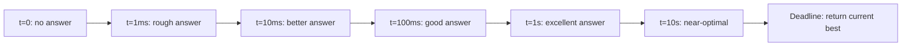
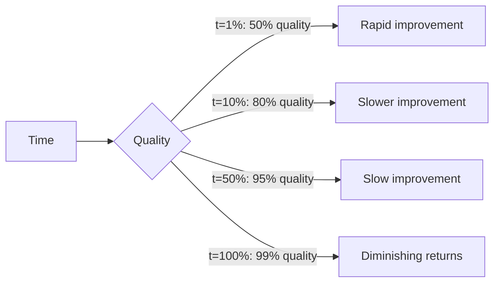

# 4. Iterative Refinement Architectures

> "An engine does not compute an answer; it produces a *stream* of increasingly good answers and returns the best one when the deadline hits. The user perceives 'the engine found the answer', but the engine merely returned its current best guess. This is the fourth and final cognitive illusion: the engine appears to deliver a definitive answer, when it is actually delivering a work-in-progress."

This is the fourth and final note on the cognitive illusions of heuristic search. The first three illusions (pruning, approximation, memory) were about how the engine searches, evaluates, and remembers. This illusion (iterative refinement) is about how the engine *delivers* its result.

---

## 5.4.1 Real-Time Output Tuning

The defining property of iterative refinement is that the engine produces a stream of outputs, each better than the last, and returns the best one when interrupted. This is called **any-time computation**: the engine can be interrupted at any time and return a useful answer.

### The Any-Time Property

An algorithm is any-time if:

1. It can be interrupted at any point.
2. At any point, it has a "best so far" answer ready.
3. The answer improves (monotonically or near-monotonically) as more time is given.



Any-time algorithms are essential for real-time engines, where the deadline is non-negotiable. A non-any-time algorithm either completes (returns the answer) or does not (returns nothing); for a real-time engine, "does not complete" is unacceptable.

### Algorithms That Are Any-Time

- **Iterative deepening (game-tree search).** Search depth 1, then 2, then 3, ... The best move from depth N is the "best so far" answer.
- **Monte Carlo Tree Search.** Each iteration produces a better estimate of the best move.
- **Gradient descent.** Each step produces a better solution to the optimization problem.
- **Beam search.** Each expansion of the beam produces a better set of candidates.
- **Cascaded evaluation.** Each stage of the cascade produces a better-filtered candidate set.

### Algorithms That Are NOT Any-Time

- **BFS.** Returns the answer only when the search completes.
- **Dijkstra's algorithm.** Returns the answer only when the destination is reached.
- **Most exact algorithms.** Return a single answer at the end.

For real-time engines, the non-any-time algorithms must be wrapped in an any-time framework (e.g., iterative deepening wraps DFS).

### The Structure of an Any-Time Loop

```python
def any_time_search(state, deadline):
    best_so_far = None
    depth = 1
    while now() < deadline:
        try:
            result = search_at_depth(state, depth, deadline)
            best_so_far = result
            depth += 1
        except TimeUp:
            break
    return best_so_far
```

Key properties:
- The deadline is checked frequently (every 1000 nodes, or ~1 ms).
- The best-so-far is updated only when a depth completes successfully.
- If the deadline hits mid-depth, the partial result is discarded.
- The function always returns a non-None answer (assuming at least one depth completed).

---

## 5.4.2 Interruptible Runtime Routines

For an any-time algorithm to work, the underlying search must be **interruptible**: it must be possible to stop it at any point without corrupting state or losing the best-so-far answer.

### Cooperative vs Preemptive Interruption

**Cooperative interruption.** The search checks a "should I stop?" flag periodically and exits gracefully. The flag is set by an external timer.

```python
def search(state, depth, deadline):
    if now() > deadline:
        raise TimeUp()
    # ... search children ...
```

Pros: clean; no state corruption.
Cons: requires explicit checks in the code; if a check is missing, the search may overrun.

**Preemptive interruption.** A separate thread kills the search thread when the deadline hits.

```python
search_thread = Thread(target=search, args=(state, depth))
search_thread.start()
search_thread.join(timeout=deadline)
if search_thread.is_alive():
    search_thread.kill()  # or terminate
```

Pros: works even if the search does not check the flag.
Cons: may corrupt state; resource leaks; not portable.

For engines, cooperative interruption is strongly preferred. The search must check the deadline frequently — every 1000 nodes or every 1 ms, whichever comes first.

### Where to Check the Deadline

The deadline check should be in the hot loop, not in cold paths:

```python
def search(state, depth, deadline):
    # Check at the start of each node
    if (nodes_processed % 1000) == 0:
        if now() > deadline:
            raise TimeUp()
    nodes_processed += 1
    
    # ... rest of search ...
```

Checking every 1000 nodes is a good balance: frequent enough to bound overrun to ~1 ms, infrequent enough to not slow the search.

### Handling Partial Results

When the search is interrupted mid-depth, what happens to the partial result?

**Option 1: Discard.** The partial result is incomplete; discard it. Use the best-so-far from the previous completed depth. This is the standard approach for iterative deepening.

**Option 2: Use partial.** If the partial result has found a clearly better move (e.g., a forced mate), use it. This requires careful validation.

**Option 3: Refine.** Continue the partial search in the next iteration, using the partial result as a starting point. Used in some MCTS variants.

The standard approach is Option 1: discard partial results. It is simplest and avoids subtle bugs.

---

## 5.4.3 The Convergence Pattern

Any-time algorithms exhibit a **convergence pattern**: the answer improves rapidly at first, then more slowly.



This pattern has important implications:

1. **Most of the value comes early.** The first 10% of the time budget gives 80% of the quality. The last 90% of the time budget only improves quality by 19%.

2. **The deadline can be relaxed.** If the engine can run for 10× longer, the quality improvement is small. This justifies using shorter time budgets in production (e.g., 100 ms instead of 1 s) without much quality loss.

3. **The deadline can be tightened under load.** If the engine is overloaded, reducing the time budget gives 80% quality in 10% of the time — a 10× throughput improvement at the cost of 20% quality.

### Quality vs Time Trade-off

For most engines, the quality-vs-time curve follows:

$$\text{quality}(t) = q_{\max} - \frac{c}{t^\alpha}$$

where $q_{\max}$ is the maximum achievable quality, $c$ is a constant, and $\alpha$ is the convergence rate (typically 0.5–1).

For chess engines, $\alpha \approx 0.5$ — doubling the time gives $\sqrt{2} \approx 1.4×$ quality improvement (in terms of search depth).

For search engines, $\alpha \approx 0.3$ — doubling the time gives $2^{0.3} \approx 1.2×$ quality improvement (in terms of recall).

For recommendation engines, $\alpha \approx 0.2$ — the quality improvement from more time is small, because the bottleneck is feature engineering, not search depth.

### Adaptive Time Budgets

Some engines adapt their time budget based on the difficulty of the problem:

- **Chess engines** allocate more time for "critical" positions (where the evaluation is unstable) and less for "quiet" positions (where the evaluation is stable).
- **Search engines** allocate more time for ambiguous queries (where multiple interpretations are possible) and less for clear queries.
- **Trading engines** allocate more time for high-uncertainty situations (e.g., just before a major announcement) and less for low-uncertainty situations.

Adaptive time budgets squeeze more quality out of the same total time budget.

---

## 5.4.4 The Illusion of Definitive Answers

The cognitive illusion: when an engine returns an answer, the user perceives it as "the answer" — the result of complete, exhaustive computation. In reality, it is the engine's current best guess at the moment the deadline hit.

The illusion is manufactured by:

1. **The answer is presented with confidence.** The engine does not say "this is my best guess after 100 ms"; it says "Best move: e4".
2. **The answer is usually good.** The convergence pattern means that even with a short time budget, the answer is usually close to optimal.
3. **The user does not see the alternatives.** The engine considered (and discarded) many other candidates; the user sees only the final choice.

### Why This Matters for Engine Engineers

Understanding this illusion matters because:

1. **It tells you to invest in any-time algorithms.** Without any-time, the engine either completes (slow) or fails (worse). Any-time gives a useful answer regardless of the time budget.
2. **It tells you to invest in the convergence rate.** A faster convergence rate means better quality in less time. The first 10% of the time budget gives most of the value.
3. **It tells you to invest in adaptive time budgets.** Allocating more time to hard problems and less to easy ones improves overall quality.
4. **It tells you to be honest about uncertainty.** If the engine's answer is a "best guess" rather than a "definitive answer", the user (or downstream system) should know. Confidence scores, multiple alternatives, and uncertainty estimates help.

---

## 5.4.5 Real-Time Output Tuning in Practice

### Chess Engine

A chess engine uses iterative deepening with alpha-beta. Each iteration:
1. Searches to depth N (1, 2, 3, ...).
2. Returns the best move from depth N.
3. Uses the result to order moves in depth N+1.

The engine produces a stream of (depth, best_move, score) tuples. When the deadline hits, it returns the best move from the deepest completed depth.

### Search Engine

A search engine uses a multi-stage cascade. Each stage:
1. Filters the candidate set.
2. Returns the top-k from the filtered set.

The engine produces a stream of (stage, top-k) tuples. If the deadline hits before the final stage completes, the engine returns the top-k from the most recent completed stage.

### Trading Engine

A trading engine runs an event-driven reactive loop. Each market event:
1. Updates the order book.
2. Computes an alpha signal.
3. Decides whether to send an order.

The engine does not produce a "stream" in the same sense; each event produces one decision. But the engine's behavior over time is a stream of decisions, each based on the latest available information.

### Recommendation Engine

A recommendation engine uses a multi-stage funnel. Each stage:
1. Reduces the candidate set.
2. Returns the top-k.

Similar to search, the engine produces a stream of (stage, top-k) tuples. If the deadline hits, the engine returns the top-k from the most recent completed stage.

### Common Pattern

In all cases, the engine:
1. Has a time budget.
2. Produces a stream of improving answers.
3. Returns the best answer when the deadline hits.
4. The user perceives "the answer", not "the best guess so far".

---

## 5.4.6 Common Pitfalls

### Pitfall 1: Non-Any-Time Algorithms

If the algorithm is not any-time, it either completes or fails. For real-time engines, this is unacceptable. Always use any-time algorithms (iterative deepening, MCTS, cascaded evaluation).

### Pitfall 2: Infrequent Deadline Checks

If the deadline is checked only every 10 million nodes, the engine may overrun by 100 ms. Check every 1000 nodes or every 1 ms.

### Pitfall 3: Discarding the Best-So-Far

If the engine overwrites the best-so-far with a partial result that is worse, the answer quality regresses. Always keep the best-so-far from completed iterations; discard partial results from interrupted iterations.

### Pitfall 4: Not Adapting the Time Budget

If the engine uses a fixed time budget for all problems, it wastes time on easy problems and runs out on hard ones. Adapt the budget based on problem difficulty.

### Pitfall 5: No Graceful Degradation

If the engine's deadline is reduced (e.g., due to load), the engine should still return a useful answer. Have a "fast fallback" path that returns a quick, low-quality answer.

### Pitfall 6: Ignoring Convergence

If the engine runs for 10× longer for a 1% quality improvement, it is wasting resources. Understand the convergence rate; stop when the marginal improvement is not worth the cost.

### Pitfall 7: Presenting Partial Results as Final

If the engine returns a partial result without indicating it is partial, the user may trust it more than they should. For applications where this matters (medical, financial), include confidence scores or uncertainty estimates.

### Pitfall 8: Not Testing Under Time Pressure

An engine that works well with a generous time budget may fail under a tight budget. Test with realistic (and unrealistic) time budgets; verify graceful degradation.

---

## 5.4.7 Important Reminders

- **Any-time is mandatory for real-time engines.** Always have a best-so-far answer ready.
- **Iterative deepening, MCTS, cascaded evaluation are any-time.** Use them.
- **Check the deadline frequently.** Every 1000 nodes or every 1 ms.
- **Discard partial results from interrupted iterations.** Keep the best-so-far from completed iterations.
- **Convergence is rapid at first, then slow.** The first 10% of the time gives 80% of the quality.
- **Adapt the time budget to problem difficulty.** More time for hard problems; less for easy.
- **Have a fast fallback.** For when the deadline is very tight.
- **The illusion of intelligence comes from iterative refinement.** The engine appears to deliver a definitive answer; it is actually delivering its current best guess.

---

## 5.4.8 Summary

Iterative refinement is the fourth and final cognitive illusion of heuristic search. Engines do not compute a single answer; they produce a stream of increasingly good answers and return the best one when the deadline hits.

The any-time property is mandatory for real-time engines. Algorithms like iterative deepening, MCTS, and cascaded evaluation are any-time; algorithms like BFS and Dijkstra are not (and must be wrapped in an any-time framework).

The convergence pattern is rapid at first, then slow: the first 10% of the time budget gives 80% of the quality. This justifies shorter time budgets in production and allows adaptive time budgets based on problem difficulty.

The illusion of intelligence is manufactured by confident presentation of the best-so-far answer, the answer's usual goodness (due to rapid convergence), and the invisibility of the alternatives considered.

This completes Chapter 5 — Cognitive Illusions and Optimization in Heuristic Search Systems. The four illusions (pruning, approximation, memory, iterative refinement) together explain why heuristic search systems appear intelligent, and provide the framework for optimizing them.

---

**Previous note:** [[3. Stateful Memory Management]]
**Next chapter:** [[1. Phase 1 High-Fidelity State Mapping]]
