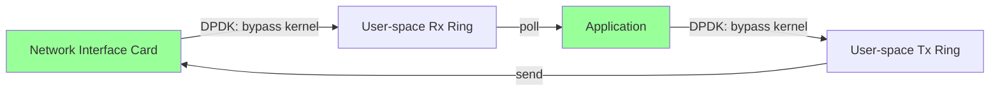
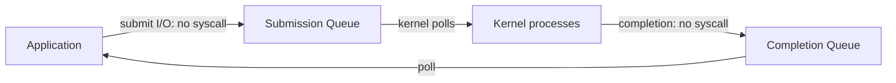

# 5. Zero-Copy Data Pipelines and Kernel Bypass Frameworks

> "For ultra-low-latency engines, the kernel is the enemy. Every syscall costs ~300 ns; every context switch costs ~1000 ns; every packet copy costs ~10 ns. Kernel bypass frameworks eliminate these costs by reading packets directly from the NIC into user-space memory — and the engine's end-to-end latency drops from microseconds to hundreds of nanoseconds."

This is the fifth note in Chapter 7. The previous notes covered languages, data structures, SIMD, and concurrency; this note covers the networking and I/O frameworks that enable ultra-low-latency engines.

---

## 7.5.1 Ultra-Low Latency I/O Systems

### DPDK (Data Plane Development Kit)

**DPDK** is the leading kernel bypass framework for high-speed packet processing. It is used in networking equipment, telecom infrastructure, and high-frequency trading.

**How it works:**
- The NIC is taken out of the kernel's control and put into "user-space" mode.
- Packets are received directly into user-space memory rings, bypassing the kernel network stack entirely.
- The application polls the rings in a busy loop, processing packets with no syscall overhead.



**Performance:**
- End-to-end latency: ~500 ns (vs. ~5 μs with the kernel network stack).
- Throughput: 10+ million packets per second per core.
- CPU usage: 100% per core (busy-polling).

**Use cases:**
- High-frequency trading (read market data, send orders).
- Software routers and switches.
- NFV (Network Function Virtualization).
- Packet capture and analysis.

**Supported NICs:** Intel, Mellanox, Broadcom, and many others. Check the DPDK compatibility list.

### Solarflare OpenOnload

**Solarflare OpenOnload** is a user-space TCP/IP stack for Solarflare NICs. It accelerates the POSIX socket API without requiring application changes.

**How it works:**
- The application uses standard `socket()`, `recv()`, `send()` calls.
- OpenOnload intercepts these calls and routes them through a user-space TCP/IP stack.
- The kernel network stack is bypassed for supported operations.
- Falls back to the kernel for unsupported operations.

**Performance:**
- Latency: ~1 μs improvement over the kernel stack.
- No application changes required.
- POSIX-compatible.

**Use cases:**
- High-frequency trading (FIX protocol over TCP).
- Low-latency financial messaging.
- Any application using POSIX sockets that needs lower latency.

**Limitations:** requires Solarflare NICs; commercial product.

### Linux AF_XDP

**AF_XDP** is Linux's native kernel bypass technology, introduced in Linux 4.18 (2018). It is the open-source alternative to DPDK.

**How it works:**
- The application opens an `AF_XDP` socket and binds it to a NIC.
- Packets matching a filter (set by an eBPF program) are redirected to the socket's user-space ring.
- The application polls the ring, processing packets.

**Performance:**
- Comparable to DPDK for many workloads.
- No proprietary NIC drivers required (works with any NIC supported by Linux).
- Lower CPU usage than DPDK (kernel can handle non-XDP traffic normally).

**Use cases:**
- Similar to DPDK: HFT, packet processing, NFV.
- When you want to avoid DPDK's complexity.
- When you need to mix XDP and normal kernel traffic.

### io_uring (Linux 5.1+)

**io_uring** is Linux's modern asynchronous I/O interface. It is not strictly kernel bypass — the kernel is still involved — but it eliminates the syscall overhead of traditional async I/O (`epoll`, `aio`).

**How it works:**
- The application and kernel share two ring buffers: a submission queue (SQ) and a completion queue (CQ).
- The application submits I/O requests by adding entries to the SQ (no syscall).
- The kernel processes the requests and adds completion entries to the CQ.
- The application polls the CQ for completions (no syscall).
- Syscalls are needed only to "kick" the kernel when SQ entries are not being processed fast enough.



**Performance:**
- 5–10× higher throughput than `epoll` for high-IOPS workloads.
- Near-zero syscall overhead.
- Supports network I/O, file I/O, timers, and more.

**Use cases:**
- High-throughput network servers (databases, message queues).
- File I/O-intensive applications (databases, log processors).
- When you need async I/O without kernel bypass complexity.

**Libraries:**
- **`liburing`** — the official C library.
- **`tokio-uring`** — Rust bindings for Tokio.
- **`rio`** — Rust io_uring library.

### RDMA (Remote Direct Memory Access)

**RDMA** allows one computer to read/write another computer's memory without involving either CPU. It is the lowest-latency inter-machine communication technology.

**How it works:**
- RDMA NICs (RNICs) can directly access host memory.
- An application on machine A can request the RNIC to read/write a memory region on machine B.
- The RNIC on machine A sends a request to the RNIC on machine B, which performs the read/write.
- Neither CPU is involved.

**Performance:**
- Latency: ~1–2 μs for small messages.
- Throughput: 100+ Gbps on modern RNICs.
- Zero CPU overhead on the remote machine.

**Use cases:**
- Distributed databases (e.g., Teradata, Exadata).
- HPC (High-Performance Computing) clusters.
- Distributed storage (e.g., NVMe-oF).
- High-frequency trading (inter-shard communication).

**Libraries:**
- **`libibverbs`** — the standard RDMA programming library.
- **`librdmacm`** — RDMA connection manager.
- **`rsocket`** — POSIX-like socket API over RDMA.

### Netty (Java)

**Netty** is the leading Java framework for high-performance network applications. It is not kernel bypass, but it provides efficient I/O on top of Java's NIO.

**Features:**
- **Event-driven model.** Netty uses an event loop (Reactor pattern) to handle I/O.
- **Zero-copy.** Byte buffers can be transferred without copying.
- **Channel pipeline.** Modular processing of incoming/outgoing data.
- **SSL/TLS.** Built-in support.
- **HTTP/2, WebSocket.** Protocol implementations.

**Use cases:**
- High-throughput Java servers (Cassandra, Spark, Akka).
- Microservices frameworks (gRPC-Java, Spring WebFlux).
- When you need high-performance networking in Java.

**Performance:** 80–90% of native C/C++ performance for most workloads; sufficient for many engines but not for HFT.

---

## 7.5.2 Comparison of I/O Frameworks

| Framework | Language | Latency | Use Case |
|---|---|---|---|
| Kernel sockets (TCP) | Any | ~5 μs | General-purpose networking |
| OpenOnload | C/C++ (POSIX) | ~1 μs | HFT with POSIX compatibility |
| DPDK | C/C++ | ~500 ns | Maximum performance; HFT, NFV |
| AF_XDP | C/C++ | ~500 ns | Open-source kernel bypass |
| io_uring | C/C++, Rust | ~1 μs | High-throughput async I/O |
| RDMA | C/C++ | ~1–2 μs | Inter-machine communication |
| Netty | Java | ~10 μs | Java high-performance networking |

**For HFT:** DPDK or AF_XDP for the hot path; OpenOnload if POSIX compatibility is required.
**For high-throughput servers:** io_uring (Linux) or Boost.Asio (cross-platform).
**For Java engines:** Netty.
**For distributed engines:** RDMA for inter-machine communication.

---

## 7.5.3 Zero-Copy Techniques

Beyond kernel bypass, several techniques minimize or eliminate data copies:

### `sendfile` and `splice` (Linux)

**`sendfile(out_fd, in_fd, offset, count)`** copies data directly from one file descriptor to another, in the kernel, without copying to user space.

**`splice(fd_in, off_in, fd_out, off_out, len, flags)`** is a more general version that works with pipes.

**Use case:** serving static files (web server), proxying data between sockets.

### Memory-Mapped Files (`mmap`)

**`mmap`** maps a file into the process's address space. Reading from the mapped region reads the file (via the page cache); no explicit `read()` is needed.

```c
void* data = mmap(NULL, file_size, PROT_READ, MAP_PRIVATE, fd, 0);
// data now points to the file contents; no copy
```

**Use case:** reading large read-only data files (indexes, models, lookup tables).

### `writev` and `readv` (Scatter/Gather I/O)

**`writev(fd, iov, iovcnt)`** writes from multiple buffers in a single syscall. **`readv`** reads into multiple buffers.

**Use case:** combining header and body data without copying them into a single buffer.

### Reference-Counted Buffers

Pass buffers by reference (with a reference count) instead of copying. The buffer is freed only when all references are dropped.

**Libraries:**
- **`std::shared_ptr<T>`** (C++) — reference-counted pointer.
- **`bytes::Bytes`** (Rust) — reference-counted byte buffer.
- **`folly::IOBuf`** (C++) — chained buffer with reference counting.
- **`ByteBuf`** (Netty) — reference-counted byte buffer.

### Slice-Based APIs

Functions take slices (`(pointer, length)` pairs) instead of owning containers (`std::string`, `std::vector`). The function does not own the data; it just reads/writes through the slice.

**Libraries:**
- **`std::string_view` / `std::span`** (C++17/C++20).
- **`&[u8]`** (Rust slices).

---

## 7.5.4 The Pipeline Pattern for Zero-Copy

For maximum performance, the entire data pipeline should be zero-copy: from NIC to engine to output, no copies.

```mermaid
flowchart LR
    NIC[Network packet] -->|DPDK| RX[User-space Rx ring]
    RX -->|pointer only| PARSE[Parser: pointers into packet]
    PARSE -->|pointer only| ENGINE[Engine core: process]
    ENGINE -->|pointer only| ENC[Encoder: build output]
    ENC -->|pointer only| TX[User-space Tx ring]
    TX -->|DPDK| NIC2[Network packet out]
```



At every stage, data is referenced by pointer, not copied. The packet buffer is allocated once (by the NIC's DMA) and freed once (after the engine is done with it).

This pattern is essential for HFT (where each copy adds nanoseconds) and useful for any high-throughput engine (where each copy adds CPU and memory bandwidth overhead).

---

## 7.5.5 Common Pitfalls

### Pitfall 1: Using Kernel Sockets for HFT

Kernel sockets add ~5 μs of latency — too much for HFT. Use DPDK, AF_XDP, or OpenOnload.

### Pitfall 2: Copying Data Between Layers

Every copy adds latency and CPU overhead. Use pointer-based APIs (slices, IOBuf) to avoid copies.

### Pitfall 3: Not Using `mmap` for Large Read-Only Data

Loading a 10 GB index into memory with `read()` is slow (and copies from kernel to user space). `mmap` is faster and uses less memory (the page cache is shared).

### Pitfall 4: Blocking I/O in the Hot Loop

Blocking I/O stops the engine. Use async I/O (io_uring, Boost.Asio, Tokio) or busy-polling (DPDK).

### Pitfall 5: Not Pinning the NIC's IRQs

By default, NIC interrupts are distributed across all cores. This causes cache thrashing and unpredictable latency. Pin the NIC's IRQs to dedicated cores (`/proc/irq/<irq>/smp_affinity`).

### Pitfall 6: Not Tuning the NIC

Default NIC settings are optimized for throughput, not latency. Tune:
- Disable interrupt coalescing (latency vs. throughput trade-off).
- Increase ring buffer sizes (reduces packet drops under burst).
- Enable RSS (Receive Side Scaling) for multi-core parallelism.

### Pitfall 7: Not Using Huge Pages

Memory-mapped regions and large allocations should use huge pages (2 MB or 1 GB) to reduce TLB misses. Enable with `madvise(MADV_HUGEPAGE)` or mount a hugetlbfs filesystem.

### Pitfall 8: Not Considering Power Management

CPU power management (frequency scaling, C-states) can cause latency spikes. Disable for HFT:
- Set the CPU governor to `performance`.
- Disable C-states deeper than C1.
- Disable turbo boost (it can cause frequency changes mid-execution).

### Pitfall 9: Using TCP When UDP Would Suffice

TCP has overhead (ACKs, retransmission, ordering). For latency-critical one-shot messages, UDP (or RDMA) may be faster.

### Pitfall 10: Not Measuring End-to-End Latency

Latency at each stage does not matter; end-to-end latency does. Measure from packet arrival to packet departure; optimize the longest segment.

---

## 7.5.6 Important Reminders

- **For HFT, use DPDK, AF_XDP, or OpenOnload.** Kernel sockets are too slow.
- **For high-throughput servers, use io_uring (Linux).** Near-zero syscall overhead.
- **For inter-machine communication, use RDMA.** Lowest latency, zero CPU overhead.
- **For Java, use Netty.** Best Java networking framework.
- **Use zero-copy techniques: `mmap`, `sendfile`, `writev`, reference-counted buffers, slices.**
- **Avoid copying data between layers.** Use pointer-based APIs.
- **Pin NIC IRQs to dedicated cores.** Avoid cache thrashing.
- **Tune the NIC: disable interrupt coalescing, increase ring buffers, enable RSS.**
- **Use huge pages for large allocations.** Reduce TLB misses.
- **Disable CPU power management for HFT.** Performance governor, disable deep C-states.
- **Measure end-to-end latency.** Optimize the longest segment.

---

## 7.5.7 Summary

Zero-copy data pipelines and kernel bypass frameworks are essential for ultra-low-latency engines. DPDK, AF_XDP, and OpenOnload bypass the kernel network stack, reducing packet-to-application latency from microseconds to hundreds of nanoseconds. io_uring provides near-zero-syscall async I/O for high-throughput servers. RDMA enables zero-CPU inter-machine communication.

Zero-copy techniques — `mmap`, `sendfile`, `writev`, reference-counted buffers, slice-based APIs — minimize copies throughout the pipeline. The goal: data flows from NIC to engine to output by pointer, never by copy.

Common pitfalls include using kernel sockets for HFT, copying data between layers, not using `mmap` for large read-only data, blocking I/O in the hot loop, not pinning NIC IRQs, not tuning the NIC, not using huge pages, not considering power management, using TCP when UDP would suffice, and not measuring end-to-end latency.

With the right I/O framework and zero-copy techniques, the engine's I/O subsystem can keep up with the engine's compute subsystem — neither is the bottleneck.

---

**Previous note:** [[4. Thread Schedulers and Concurrency Frameworks]]
**Next note:** [[6. Real-World Reference Architectures to Study]]
