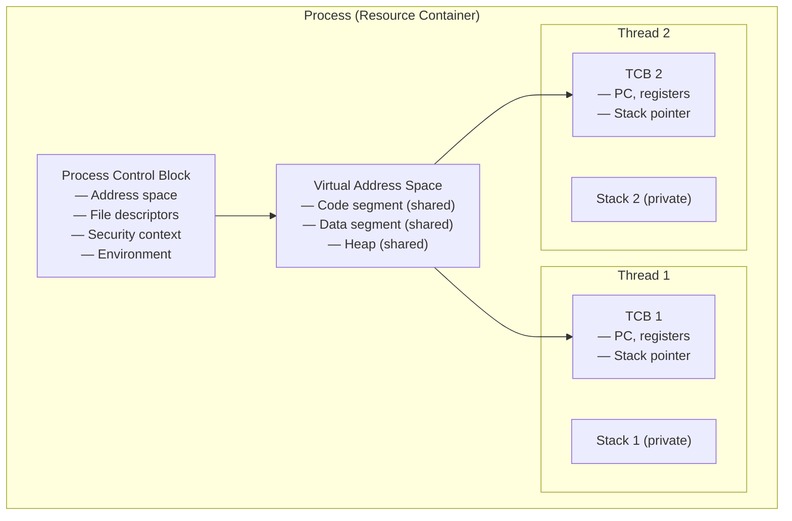
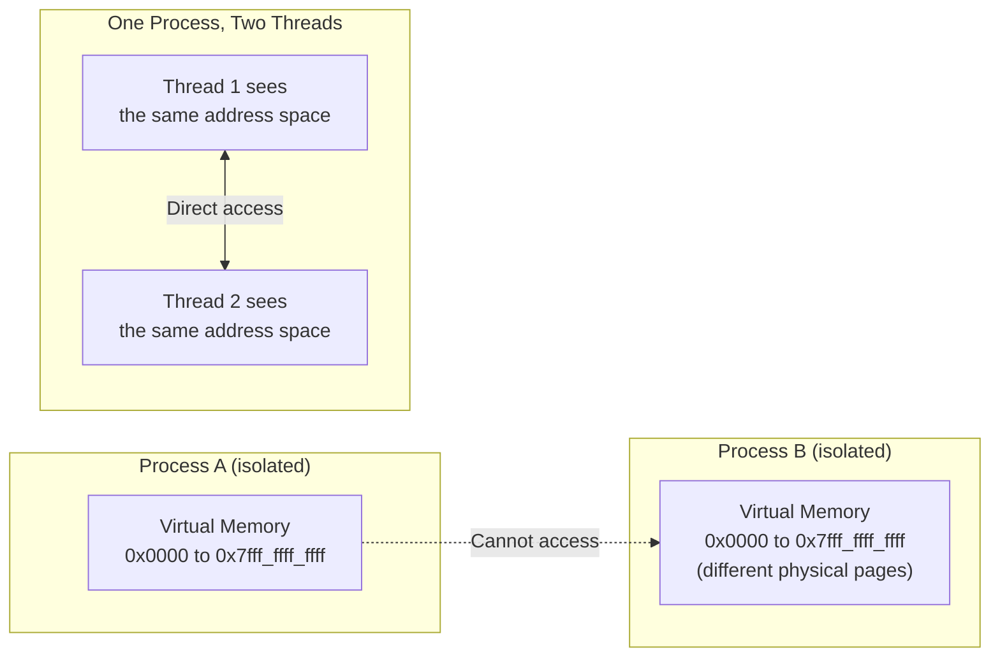
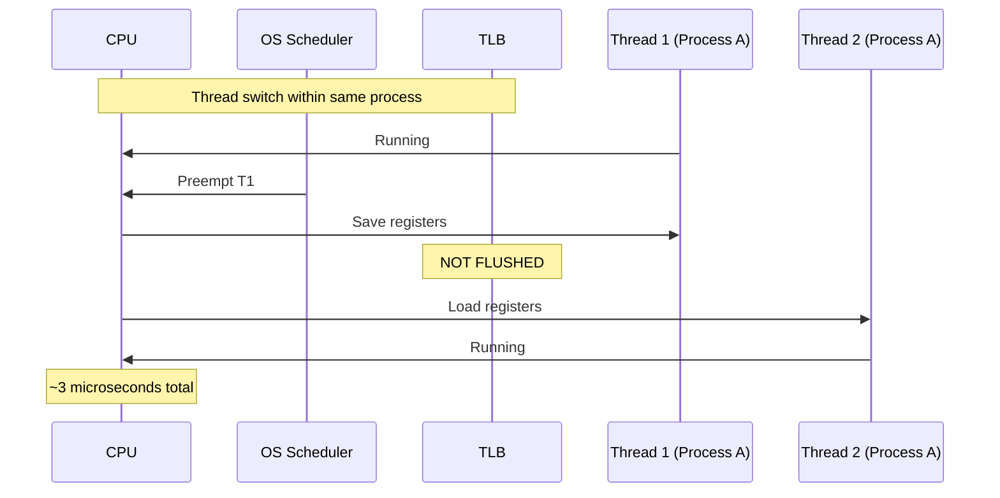
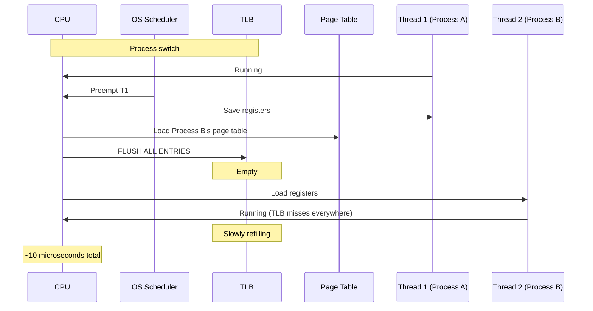

# 1.1. Process vs Thread Conceptual Analysis

> **Why this note exists.** The terms "process" and "thread" are used loosely in everyday programming conversation, but they have precise technical meanings that determine everything from performance characteristics to failure modes. This note establishes the rigorous OS-level definitions that every subsequent chapter depends on. Misunderstandings here propagate through the entire course — so we go slowly and exhaustively.

---

## 1. Context and Theoretical Background

To understand why modern operating systems support both processes and threads, we must examine how **resource ownership** is decoupled from **execution**. This decoupling is the central architectural insight of all modern operating systems.

### 1.1 The Process (Resource Unit)

A **process** is the operating system's unit of resource allocation. When you start a program — say, by typing `./my_program` at a shell — the OS creates a new process. That process is defined by the resources the kernel grants it:

- A **private virtual address space**: typically 48 bits of addressable memory on x86-64 (256 TB), entirely its own. No other process can read or write this memory.
- A **file descriptor table**: every open file, socket, pipe, or device is referenced by an integer (the file descriptor). The table maps these integers to kernel-side structures.
- A **security context**: user ID, group ID, capabilities (on Linux), security labels (on SELinux systems).
- **Environment variables**: a per-process set of key-value strings inherited from the parent.
- **Network sockets and their states**: each process owns its sockets' connection state.
- A **current working directory** and a **umask**.
- A **process ID (PID)** and a **parent process ID (PPID)**.

The kernel maintains this state inside a structure called the **Process Control Block (PCB)**. On Linux, this is the `task_struct` defined in `include/linux/sched.h` — a structure with hundreds of fields covering everything from memory mappings to CPU scheduling statistics.

### 1.2 The Thread (Execution Unit)

A **thread** is the dispatchable unit of execution. It represents a single, sequential control flow within a process. A process must contain at least one thread (the "main thread"); without a thread, the process has nothing to execute and is just a container of resources.

Each thread has its own:

- **Thread Control Block (TCB)** — a kernel structure tracking the thread's state. On Linux, this is also a `task_struct` (Linux unifies processes and threads internally as "tasks" — see §1.4 below).
- **Program Counter (PC)** — the address of the next instruction this thread will execute.
- **CPU register state** — the contents of all general-purpose registers, the stack pointer, the flags register.
- **Stack** — a private region of memory where the thread stores local variables, function arguments, return addresses, and saved register values across function calls.
- **Thread ID** — unique within the process (and usually unique system-wide on most OSes).

What a thread does **not** own:

- The address space (it shares the process's address space with all sibling threads).
- File descriptors (shared across all threads of the process).
- Heap memory (shared).
- Code segment (shared — every thread is executing the same program).
- Global and static variables (shared).

### 1.3 The Conceptual Split

This split is fundamental: **the process owns resources, the thread executes code.** When the OS scheduler picks a thread to run, it doesn't pick a "process" — it picks a thread, which happens to belong to a process whose address space is then activated on the CPU.

### 1.4 Linux's Unification: "Tasks"

A particularly interesting implementation detail: **Linux does not distinguish processes and threads internally.** Both are called "tasks" and both are represented by `task_struct`. The only difference is whether the task shares resources with another task:

- A new **process** (created via `fork()`) gets a copy of the parent's address space (copy-on-write), file descriptor table, etc.
- A new **thread** (created via `clone()` with flags like `CLONE_VM | CLONE_FILES | CLONE_SIGHAND`) shares these resources with the parent.

This is why Linux system calls like `getpid()` can be confusing: from the kernel's perspective, every thread has its own PID (called a "TID", thread ID). The "PID" reported to user space is actually the TGID (Thread Group ID) — the TID of the thread that started the process.

> **Tip.** Run `ps -eLf` on a Linux system to see every thread as a separate row. You'll see that even a simple program like Firefox has dozens of "processes" — those are actually threads, each with its own LWP (Light-Weight Process) ID.

---

## 2. Deep Dive: Architectural Comparison

### 2.1 Memory Space Isolation vs. Sharing

#### Processes: Hardware-Enforced Isolation

The operating system uses hardware-level memory protection (via the **Memory Management Unit**, or MMU) to isolate the virtual address space of each process. Each process has its own **page table** — a mapping from virtual addresses to physical addresses. The CPU's `CR3` register (on x86) points to the currently-active page table.

When Process A attempts to access memory at virtual address `0x4000`, the MMU looks up that address in Process A's page table. If the address is mapped, the access succeeds. If Process A attempts to access an address that's not in its page table — say, an address that happens to be valid in Process B — the MMU raises a **page fault**, and the OS terminates Process A with `SIGSEGV` (segmentation fault).

This isolation is enforced by hardware. Software cannot bypass it without exploiting a kernel vulnerability or using explicit shared-memory APIs (`shmget`, `mmap` with `MAP_SHARED`, etc.).

#### Threads: Voluntary Sharing

All threads belonging to a single process share the exact same virtual address space — meaning they share the same page table. Thread A can write a value to a global pointer at address `0x601040`, and Thread B can read that value instantly. There is no hardware protection between threads of the same process.

This has two important consequences:

1. **Data sharing is essentially free.** No system call, no copy, no marshalling. The pointer is just an address; both threads can dereference it.
2. **Bugs are catastrophic.** If Thread A writes past the end of an array, it can corrupt Thread B's stack or heap. There is no `SIGSEGV` to save you — the write succeeds, and the corruption manifests later as a "spooky" bug that seems impossible.

### 2.2 Context Switching Overhead

A **context switch** is the process of storing the state of a CPU core so that it can be restored and execution can resume from the same point later. Context switches are the dominant cost of concurrency — they happen every few milliseconds and take microseconds each. The performance difference between process-switching and thread-switching comes down to **one specific operation: TLB flushing**.

#### Process Context Switch (EXPENSIVE)

When the OS switches from running a thread in Process A to running a thread in Process B:

1. **Save CPU registers** of the currently running thread to its TCB (general-purpose registers, stack pointer, instruction pointer, flags register).
2. **Switch from user mode to kernel mode** (ring transition on x86 — sets the CPU privilege level).
3. **Change the active page tables** by writing to the CPU's page directory register (e.g., `CR3` on x86). This points the MMU at Process B's page table.
4. **Flush the Translation Lookaside Buffer (TLB)**. The TLB is a small, very fast cache inside the CPU that stores recent virtual-to-physical address translations. After a page-table switch, all TLB entries from Process A are invalid — they refer to physical pages that may have nothing to do with Process B.
5. **Load the register state** of the target thread from its TCB.
6. **Switch back to user mode** and resume execution.

Steps 4 and the resulting cache effects are the expensive parts. After the TLB is flushed, every memory access from Process B initially causes a TLB miss, which means the MMU has to walk the page table (a multi-level data structure that can require 4 memory accesses on x86-64). These page-table walks are slow.

Furthermore, the CPU's data and instruction caches (L1, L2, L3) are now polluted with Process A's data. Process B's working set has to be loaded fresh, causing a cascade of cache misses.

> **Reminder that students often forget.** The TLB flush isn't the OS's choice — it's a hardware requirement. The TLB doesn't track which process each entry belongs to (on most CPUs), so switching page tables requires invalidating all entries. Modern x86 CPUs support **PCID (Process Context Identifiers)**, which tags TLB entries with a process ID and avoids the flush — but the OS must enable this feature, and older hardware doesn't have it.

#### Thread Context Switch (CHEAP, within the same process)

When the OS switches between two threads of the **same** process:

1. Save CPU registers.
2. Switch to kernel mode if using kernel threads (almost always the case in modern OSes).
3. **Skip page-table change** — both threads share the same page table.
4. **Skip TLB flush** — TLB entries are still valid.
5. **Swap the active stack pointer and program counter** to the target thread's stack.
6. Load the target thread's register state.
7. Return to user mode.

Because the virtual memory space remains identical, the page tables do not change, and the TLB is not flushed. Cache locality is preserved (mostly — the L1/L2 caches may still be polluted by the previous thread's data, but the page-table walks are avoided).

> **Quantitative comparison.** A process context switch takes roughly **5-15 microseconds** on modern hardware (most of which is TLB refill and cache warmup). A thread context switch within the same process takes roughly **1-5 microseconds**. For I/O-bound workloads with thousands of context switches per second, this 3-10× difference adds up.

### 2.3 Creation Cost

Creating a process is dramatically more expensive than creating a thread, even with copy-on-write optimizations:

| Operation | Process (`fork()`) | Thread (`pthread_create`) |
| :--- | :--- | :--- |
| Allocate new address space | Yes (copy-on-write, but page-table copy is real) | No (shared) |
| Copy file descriptor table | Yes | No (shared) |
| Allocate new stack | Yes (typically 8 MB virtual, allocated lazily) | Yes (typically 8 MB virtual, allocated lazily) |
| Initialize new TCB | Yes | Yes |
| Initialize new PCB | Yes | No |
| Time on modern Linux | ~100-500 µs | ~30-80 µs |

The process cost is dominated by copying the page table (even with COW, the page-table structure itself is copied). For a process with a large address space (e.g., a database server with 100 GB mapped), `fork()` can take milliseconds.

---

## 3. Comparison Reference

| Parameter | Process | Thread |
| :--- | :--- | :--- |
| **System Cost** | Extremely high to create, manage, and switch. | Low overhead; highly lightweight. |
| **Memory Map** | Completely private and isolated virtual space. | Shares code, heap, data, and open file tables. |
| **IPC Mechanics** | Must use pipes, shared memory segments, message queues, or sockets. | Directly shares memory; uses mutexes/semaphores. |
| **Fault Isolation** | If one process crashes, others are completely unaffected. | If one thread crashes (e.g., dereferences `NULL`), the OS terminates the entire process. |
| **Creation time** | ~100-500 µs | ~30-80 µs |
| **Context switch time** | ~5-15 µs (TLB flush) | ~1-5 µs (no TLB flush) |
| **Memory cost per instance** | Full PCB + page tables + address space | Just TCB + stack (~8 MB virtual, mostly unused) |
| **Communication speed** | Slow (kernel-mediated IPC) | Fast (direct memory access) |
| **Security isolation** | Strong (hardware-enforced) | None within the same process |

---

## 4. When to Use Processes vs Threads

### 4.1 Choose Processes When:
- **Fault isolation matters more than performance.** Examples: web browsers (each tab in Chrome is a separate process so a crash in one tab doesn't kill the browser), database servers (PostgreSQL uses a process per connection so a crash doesn't take down the server), security-critical services.
- **You need privilege separation.** Each process can run with different user IDs, different capabilities, different security labels.
- **You're using a language runtime that doesn't handle threads well** (e.g., classic Unix C programs that use lots of global state).
- **You need to run untrusted code** (e.g., a code-judging system).

### 4.2 Choose Threads When:
- **You need to share lots of data** between concurrent units of execution.
- **You need low-latency communication** between them (no IPC round-trips).
- **Your workload is I/O-bound** and you need many concurrent operations.
- **Creation cost matters** (you'll spawn thousands of execution units).
- **You're on a single-address-space runtime** (JVM, .NET, Python, Node.js).

### 4.3 The Modern Hybrid: Process Pools + Threads

Many production systems use **both**: a small number of processes (typically matching the number of CPU cores), each with a thread pool (typically dozens to hundreds of threads per process). This gives you:
- Fault isolation at the process level (one worker crashing doesn't take down the others).
- Cheap concurrency at the thread level (within a worker).
- Horizontal scalability across cores.

This is the architecture of **NGINX**, **Apache's event MPM**, **Gunicorn** with threaded workers, and most modern web servers.

---

## 5. Common Pitfalls and Reminders

1. **"Threads share file descriptors."** A common surprise: if Thread A opens a file, Thread B can read from the same fd. Both threads see the same file-offset (the offset is per-fd, not per-thread). If you want independent offsets, use `pread`/`pwrite` or `dup` the fd.

2. **"A signal can be delivered to any thread in the process."** Signals in POSIX are delivered to a *process*, but the kernel picks *one* thread to actually receive it. Don't assume the main thread will handle `SIGINT` — it might go to a worker.

3. **"Each thread has its own errno."** This is correct on modern systems (see §4.1 of Chapter 4) but was not always true. On very old Unix systems, `errno` was a global int — making multithreaded programming nearly impossible.

4. **"`fork()` in a multithreaded program only copies the calling thread."** This is a famous gotcha. If your program has 10 threads and one of them calls `fork()`, the child process has exactly **one** thread (the one that called `fork`). The other 9 are gone. Any locks they held are still held in the child — forever. This is why `fork()` + multithreading is dangerous; only call async-signal-safe functions between `fork()` and `exec()` in the child.

5. **"Stack size is per-thread, but the default is per-OS."** Linux defaults to 8 MB per thread stack. Windows defaults to 1 MB. macOS gives the main thread 8 MB but secondary threads only 512 KB. If you have code that uses deep recursion or large stack-allocated arrays, it may work on Linux but stack-overflow on macOS threads.

6. **"Thread-safe ≠ re-entrant."** A function can be thread-safe (uses locks internally) but not re-entrant (cannot be safely interrupted and re-entered). See §4.2 of Chapter 4 for the full distinction.

7. **"The PCB and TCB are not the same structure."** A PCB describes the process; a TCB describes a thread. On Linux they're both `task_struct`, but conceptually they're different. A process with N threads has 1 PCB + N TCBs.

8. **"Memory protection between threads is impossible."** Some students ask if you can use `mprotect` to make one thread's memory read-only to another. The answer is no — `mprotect` operates on the process's page table, which is shared by all threads. There is no per-thread memory protection in standard operating systems.

---

## 6. The Bigger Picture

The process/thread distinction is one of the most successful abstractions in computing history. It was popularized by Unix (processes) in the 1970s and refined by systems like Mach and Solaris (threads) in the 1980s and 1990s. Today, every major operating system — Linux, Windows, macOS, iOS, Android — uses essentially the same model.

But the model has limitations:

- **Sharing data still requires synchronization**, which is hard (see Chapter 4).
- **The GIL in Python** (see §5.1 of Chapter 5) is a consequence of using a single process-wide lock to protect the interpreter — a pragmatic choice that prioritizes simplicity over parallelism.
- **Modern hardware is increasingly parallel** (64+ cores on commodity servers), which strains the thread-per-task model. Languages like Go (goroutines) and Rust (async tasks) are exploring lighter-weight alternatives.

Understanding this foundation lets you reason about all of these systems.

---

## 7. What to Remember Forever

If you forget everything else from this note, remember these three sentences:

1. **A process owns resources; a thread executes.**
2. **Threads share their process's address space; processes don't share anything by default.**
3. **Process context switches flush the TLB; thread switches don't — and that's why threads are faster than processes for concurrent I/O.**

---

> **Next note.** §1.2 covers **thread state transitions** — the Ready/Running/Blocked state machine from your course slides (translated from the French *Prêt/Élu/Bloqué*), plus the memory layout of a multithreaded process and the subtle stack-overflow hazard that arises when threads share an address space.
