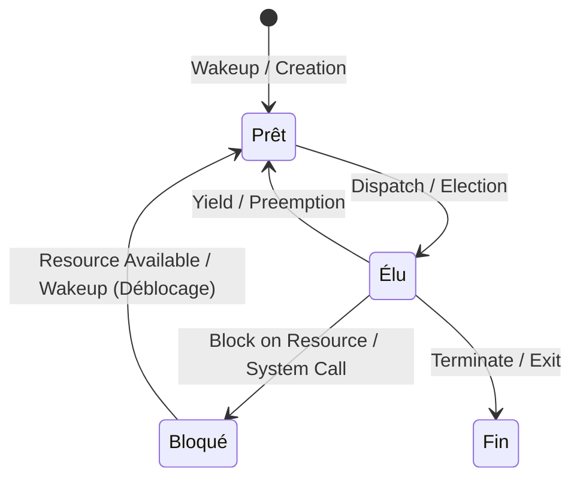
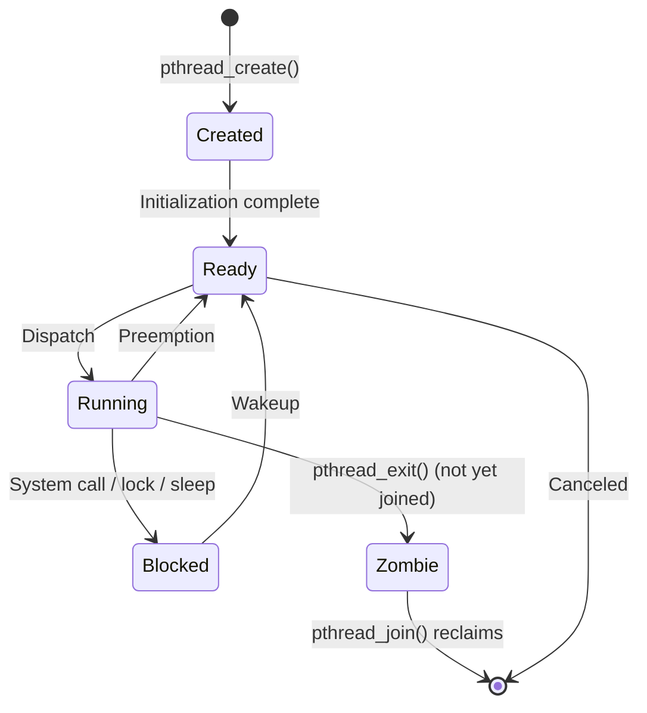
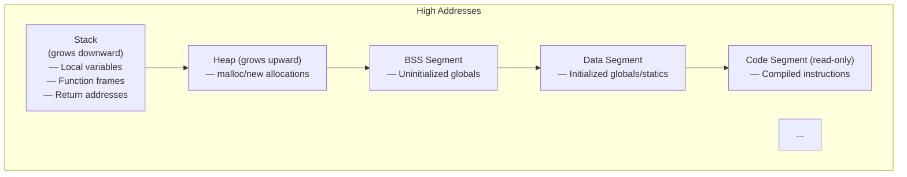
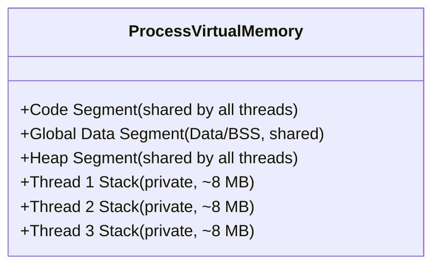
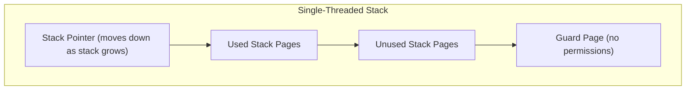
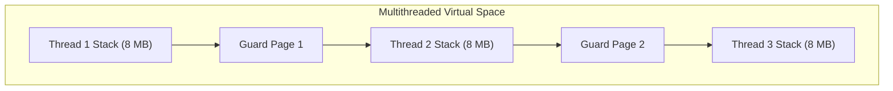
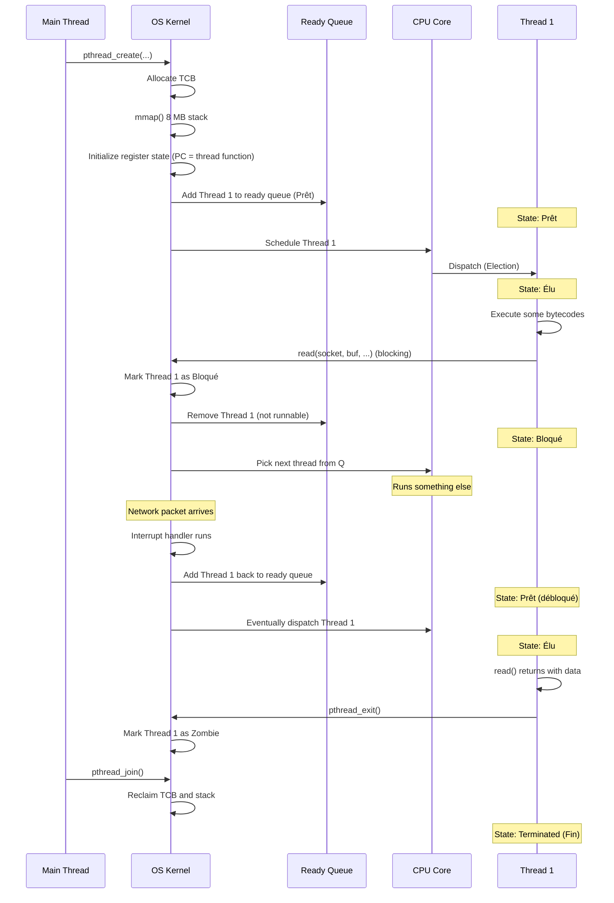

# 1.2. State Transitions and Memory Layout of Threads

> **Why this note exists.** Your course slides include a state-transition diagram with French labels (*Prêt*, *Élu*, *Bloqué*) and a memory-layout diagram showing per-thread stacks. This note translates those visuals into a complete, rigorous explanation: what each state means, what causes transitions, what happens to memory when threads run, and why multithreaded stack growth is fundamentally harder than single-threaded stack growth.

---

## 1. The Thread State Machine (Visual Slide Translation)

### 1.1 The Three States

The classic three-state model from operating-systems theory describes every thread as being in exactly one of these states at any moment:



#### Prêt (Ready / Runnable)
The thread has a fully allocated stack, valid CPU state, and is ready to execute. It is placed in the operating system's **ready queue** — a data structure (often a per-CPU run queue, organized by priority) of all threads that want CPU time but don't currently have it.

A thread enters the *Prêt* state when:
- It is **newly created** (the OS has allocated its TCB and stack).
- It is **woken up** from the *Bloqué* state because the resource it was waiting for became available.
- It is **preempted** from the *Élu* state (its time quantum expired).
- It **voluntarily yields** via `sched_yield()` or `pthread_yield()`.

The transition out of *Prêt* into *Élu* happens when the CPU scheduler performs an **Election** (dispatching): the scheduler picks this thread from the ready queue and assigns it to a physical processor core.

#### Élu (Running)
The thread is currently executing instructions on a physical CPU core. Its program counter (PC) is actively incrementing. On a 4-core system, at most 4 threads can be in the *Élu* state at any instant.

A thread leaves the *Élu* state by:
- **Preemption**: its time slice (quantum) expired. The OS timer interrupt fires, the kernel takes over, and the thread is moved back to *Prêt*.
- **Voluntary yield**: the thread calls `sched_yield()`.
- **Blocking**: the thread initiates an operation that cannot complete immediately (e.g., `read()` on a slow socket). It moves to *Bloqué*.
- **Termination**: the thread finishes its work and exits. It moves to *Fin* (terminated) and its resources are reclaimed.

#### Bloqué (Blocked / Waiting)
The thread is suspended and removed from the scheduler's ready queue. It does not consume any CPU cycles while in this state. The kernel does not even consider it for scheduling.

A thread enters *Bloqué* when it:
- Performs a **blocking system call** (e.g., `read()`, `recv()`, `wait()`).
- Acquires a **locked mutex** (must wait for the holder to release it).
- Calls **`sleep()`** or **`nanosleep()`**.
- Triggers a **page fault** that requires disk I/O to resolve.
- Calls **`pthread_cond_wait()`** to wait for a condition variable.

The transition out of *Bloqué* into *Prêt* — called **Déblocage** — happens when the awaited event occurs:
- Data arrives on the socket (the network interrupt handler wakes the thread).
- The mutex is unlocked (the unlocking thread wakes one waiter).
- The sleep timer expires.
- The page fault is resolved (the disk I/O completes).
- The condition variable is signaled.

**Critical point:** the thread does **not** go directly from *Bloqué* to *Élu*. It goes through *Prêt*. Even if the CPU is idle when the thread is unblocked, the scheduler still has to make the decision to dispatch it. This is important for understanding priority inversions and scheduling latency.

### 1.2 Why Three States Are Not Enough

The classic three-state model is a simplification. Real operating systems have more states:



- **Created**: the TCB has been allocated but the thread hasn't been added to the run queue yet.
- **Zombie**: the thread has terminated but its parent hasn't called `pthread_join()` yet. The TCB is retained so the parent can retrieve the exit status. If the parent never joins, the zombie leaks.
- **Stopped/Suspended**: the thread has been paused via `SIGSTOP` or `pthread_suspend`. It's not runnable until resumed.

For the purpose of this course, the three-state model is sufficient — but be aware that production schedulers are more complex.

### 1.3 Linux Run Queue Internals

On Linux, the run queue is implemented as a **red-black tree** keyed by virtual runtime (the "Completely Fair Scheduler" or CFS). The thread with the smallest virtual runtime is picked next. This gives fair CPU distribution without strict time slices.

Each CPU core has its own run queue. When a thread is woken up, the scheduler decides which core's queue to place it on — typically the core that previously ran it (for cache locality) or the least-loaded core (for load balancing).

> **Tip for performance work.** If you observe threads "migrating" between cores frequently (visible in `perf sched`), your application is suffering from cache-line loss on each migration. Pin threads to cores with `pthread_setaffinity_np` to prevent this.

---

## 2. Thread Stack and Global Layout

### 2.1 The Standard Process Memory Layout

A single-threaded process has the classic Unix memory layout:



- **Code segment**: the compiled machine instructions. Read-only and shared across `fork()`-ed processes via copy-on-write.
- **Data segment**: initialized global and static variables (e.g., `int x = 42;` at file scope).
- **BSS segment**: uninitialized globals (e.g., `int y;` at file scope — zero-initialized by the loader).
- **Heap**: dynamically allocated memory (`malloc`/`new`). Grows upward via `brk()`/`sbrk()` or `mmap()`.
- **Stack**: function call frames. Grows downward (on x86). Starts near the top of the address space.

### 2.2 Multithreaded Layout — Stacks Are Embedded in the Address Space

When you create multiple threads, each thread needs its own stack. These stacks are typically allocated in the same virtual address space as the heap, often using `mmap()`:



The layout in memory might look something like this (addresses approximate):

```
0x7fff_ffff_e000  ┌─────────────────┐  ← Top of address space
                  │ Main Thread Stack│
0x7fff_ff7f_e000  ├─────────────────┤
                  │ Thread 1 Stack   │
0x7fff_feff_e000  ├─────────────────┤
                  │ Thread 2 Stack   │
0x7fff_fe7f_e000  ├─────────────────┤
                  │ ...              │
                  ├─────────────────┤
                  │ Heap (grows up)  │
                  │ ...              │
                  │ BSS              │
                  │ Data             │
                  │ Code             │
0x400000          └─────────────────┘
```

Each thread stack is typically 8 MB (Linux default) but allocated lazily — only the pages actually touched consume physical memory.

### 2.3 The Private Stack — What's Inside

Each thread has its own private stack to support independent function call histories and local variables. When a thread calls a function, a new **stack frame** is pushed onto its private stack.

The stack frame contains:

1. **Function arguments** (those not passed in registers).
2. **Local variables** (allocated on the stack, not the heap).
3. **The return address** — where to jump back to when the function returns.
4. **The saved frame pointer** of the calling function.
5. **Saved registers** that the function modifies but promises to restore.
6. **Temporary values** the compiler generates.

When the function returns, the frame is popped: the stack pointer is restored to the saved frame pointer, and execution jumps to the saved return address.

### 2.4 Why Threads Cannot Safely Grow Their Stacks

This is one of the most subtle and important points of this chapter. In a **single-threaded** program, the OS places a **guard page** at the bottom of the stack:



If the stack grows past its current allocation and hits the guard page, the access triggers a page fault. The kernel's page-fault handler recognizes this as a legitimate stack-growth request and **automatically allocates more virtual memory** to grow the stack. The guard page is moved down to maintain the protection.

This works in single-threaded programs because there's only one stack, and it's at a well-known location with clear boundaries.

**In a multithreaded program, this automatic growth is impossible.** Here's why:



The stacks are allocated adjacent to each other (typically with a guard page between them, but the next stack's data is just past the guard page). If Thread 1's stack hits its guard page, the kernel **cannot** grow it — because the next page belongs to Thread 2's stack. Growing Thread 1's stack would corrupt Thread 2's stack.

So the kernel just terminates the program with a stack-overflow signal (`SIGSEGV` on Linux).

> **Critical reminder.** In multithreaded programs, **stack overflow = immediate crash, no recovery.** If you need large allocations, use the heap (`malloc`/`new`), not stack-allocated arrays. If you need deep recursion, set a larger stack size at thread creation (`pthread_attr_setstacksize`) — but make sure the total virtual memory fits in your address space.

### 2.5 Stack Sizes in Practice

| Operating System | Default Main Thread Stack | Default Secondary Thread Stack |
| :--- | :--- | :--- |
| Linux | 8 MB | 8 MB |
| Windows | 1 MB | 1 MB |
| macOS | 8 MB | 512 KB (!) |

The macOS value is a famous source of cross-platform bugs: code that works on Linux (8 MB) crashes on macOS secondary threads (512 KB) because of stack overflow during deep recursion.

You can query and change the stack size:

```c
// POSIX (Linux, macOS)
#include <pthread.h>
size_t stacksize;
pthread_attr_t attr;
pthread_attr_init(&attr);
pthread_attr_getstacksize(&attr, &stacksize);  // Get default
pthread_attr_setstacksize(&attr, 16 * 1024 * 1024);  // Set to 16 MB
pthread_t t;
pthread_create(&t, &attr, worker_function, NULL);
```

```cpp
// C++ std::thread — no standard way to set stack size; use pthread on POSIX
#include <pthread.h>
#include <thread>

void worker() { /* ... */ }

int main() {
    pthread_attr_t attr;
    pthread_attr_init(&attr);
    pthread_attr_setstacksize(&attr, 16 * 1024 * 1024);

    pthread_t native_handle;
    pthread_create(&native_handle, &attr,
        [](void*) -> void* { worker(); return nullptr; }, nullptr);

    pthread_join(native_handle, nullptr);
}
```

### 2.6 The "Adjacent Stacks" Security Issue

Because thread stacks are allocated adjacent to each other (typically with only a small guard page between), a buffer overflow in Thread 1's stack can theoretically overflow past the guard page into Thread 2's stack. Modern OSes use larger guard pages and address-space layout randomization (ASLR) to mitigate this, but it remains a subtle concern in security-critical code.

---

## 3. Thread-Local Storage (TLS) — A Fourth Memory Region

In addition to code, data, BSS, heap, and per-thread stacks, modern systems support **thread-local storage (TLS)** — global variables that have a **separate instance per thread**.

```c
// POSIX C
__thread int errno;  // Each thread has its own errno

// C11
_Thread_local int counter;

// C++
thread_local int counter;
```

When a thread accesses a `thread_local` variable, the compiler emits code that:
1. Reads a thread-pointer register (e.g., `FS` segment base on x86 Linux).
2. Adds an offset specific to this variable.
3. Reads/writes the resulting address.

The result: each thread sees its own private copy of the variable, even though the source code looks like a global. We cover this in detail in §4.1 of Chapter 4.

---

## 4. The Lifecycle of a Thread — Putting It All Together

Let's trace a thread from creation to termination, noting state transitions and memory effects:



This trace illustrates:
- A thread can move Prêt → Élu → Bloqué → Prêt → Élu many times during its life.
- Each transition involves kernel work (scheduling decisions, queue manipulation).
- The stack and TCB persist throughout the thread's life; only at `join()` are they reclaimed.

---

## 5. Common Pitfalls and Reminders

1. **"I created a thread and it crashed with SIGSEGV immediately."** Likely causes: (a) you passed a stack-allocated argument and the spawning function returned before the thread read it; (b) the thread function pointer is wrong; (c) stack overflow.

2. **"My thread mysteriously dies after a few seconds."** Stack overflow from deep recursion. Increase the stack size with `pthread_attr_setstacksize`.

3. **"A thread is stuck in Bloqué forever."** It's waiting on something that will never happen — a deadlock (mutex held by a terminated thread), a network read with no timeout, or a `pthread_cond_wait` without a corresponding signal. Use a debugger (`gdb: info threads`, `thread apply all bt`) to find which resource it's blocked on.

4. **"My program works on Linux but crashes on macOS."** Stack size. macOS secondary threads default to 512 KB; Linux to 8 MB. Set the stack size explicitly.

5. **"I have 1000 threads and the OS refuses to create more."** You've hit either virtual memory limits (1000 × 8 MB = 8 GB of stack address space) or kernel limits on the number of threads per process (`ulimit -u`). Use a thread pool.

6. **"The same code gives different results across runs."** Race condition (see Chapter 4). Threads access shared state without synchronization.

7. **"My thread-local variable is showing the wrong value."** You probably set it in one thread and read it from another. TLS is per-thread; setting it in one doesn't affect the other.

8. **"Why doesn't my thread receive the signal I sent?"** Signals to a process can be delivered to any thread. Use `pthread_kill(thread, sig)` to send to a specific thread, or `sigaction` with `SA_SIGNALINFO` and check the `si_tid` field.

9. **"My thread keeps being preempted at the worst moment."** That's how preemptive multitasking works. You cannot prevent preemption; you can only ensure correctness under it (via locks).

10. **"I called `pthread_exit(NULL)` from `main` and the program hung."** `pthread_exit` from main terminates the main thread but keeps the process alive until all other threads exit. If you want to wait, call `pthread_join` for each child. If you want to terminate immediately, call `exit()` (which kills all threads).

---

## 6. Summary — What You Should Internalize

After studying this note, you should be able to:

1. Draw the three-state diagram (Prêt/Élu/Bloqué) from memory and explain every transition.
2. Explain why thread context switches are cheaper than process context switches (TLB).
3. Draw the memory layout of a multithreaded process and identify which regions are shared vs. private.
4. Explain why stacks cannot grow in multithreaded programs (adjacent stacks + guard pages).
5. Identify the default stack sizes on Linux, Windows, and macOS.
6. Describe the contents of a stack frame.
7. Explain what thread-local storage is and when to use it.
8. Trace a thread through its lifecycle from creation to termination.

These foundations are essential for everything that follows. Chapter 2 builds on this by examining the different ways OSes map user threads to kernel threads. Chapter 3 has you write pthreads code that creates and joins threads. Chapter 4 discusses what happens when threads share data without synchronization.

---

> **Next chapter.** Chapter 2 covers **multi-threading models and systems** — the three classic mappings between user-level threads and kernel execution contexts (many-to-one, one-to-one, many-to-many), scheduler activations and the upcall architecture, and the design of pop-up threads in distributed systems.
