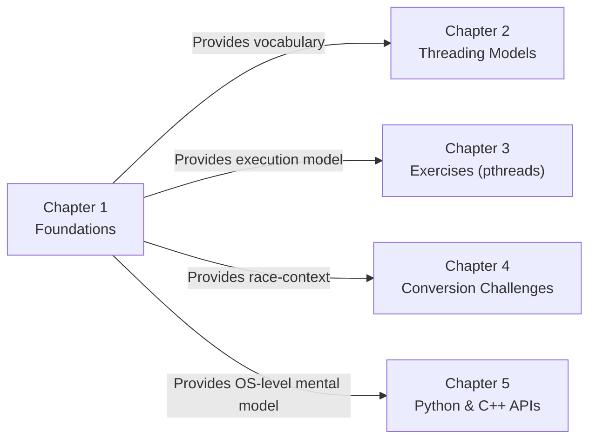

# Chapter 1 — Foundations of Threads and Processes

> **Chapter purpose.** Before any discussion of multithreaded programming can be useful, you need a crystal-clear mental model of what a *process* is, what a *thread* is, how they differ, and how the operating system tracks their state. This chapter establishes that foundation. Every later chapter — from threading models (Chapter 2) to modern Python/C++ APIs (Chapter 5) — assumes you have internalized the material here.

---

## What This Chapter Covers

```
Chapter 1: Foundations of Threads and Processes
    - 1.1. Process vs Thread Conceptual Analysis
    - 1.2. State Transitions and Memory Layout of Threads
```

### 1.1. Process vs Thread Conceptual Analysis
Establishes the conceptual separation between *resource ownership* (the process) and *execution* (the thread). Covers the Process Control Block (PCB), the Thread Control Block (TCB), memory isolation via the MMU, TLB-flush cost in process context switches, and why thread context switches are dramatically cheaper.

### 1.2. State Transitions and Memory Layout of Threads
Translates the French state diagram (*Prêt / Élu / Bloqué*) from your course slides into a complete state-machine analysis. Then dives into the per-thread stack layout, why threads cannot safely grow their stacks in multithreaded programs, and how stack frames are organized.

---

## How This Chapter Connects to the Rest of the Course



If you remember only three things from Chapter 1, remember:

1. **A process is a unit of resource ownership.** It owns memory, file descriptors, sockets, security context. A thread is a unit of execution. A process must contain at least one thread.
2. **Threads in the same process share almost everything** — except their stacks, program counters, and CPU register state.
3. **Process context switches flush the TLB; thread context switches don't.** This is the single biggest reason threads are faster than processes for I/O-bound concurrent work.

---

## Prerequisites

This chapter assumes basic familiarity with:
- What a program is (a file on disk containing code).
- What "running a program" means (the OS loads it into memory and starts executing it).
- The high-level idea of virtual memory (each process thinks it owns the entire address space).

If any of these is fuzzy, you can still read this chapter — but the memory-management discussion in §1.1 will be easier if you review virtual memory basics first.

---

**Next:** Open `1.1. Process vs Thread Conceptual Analysis.md`.
