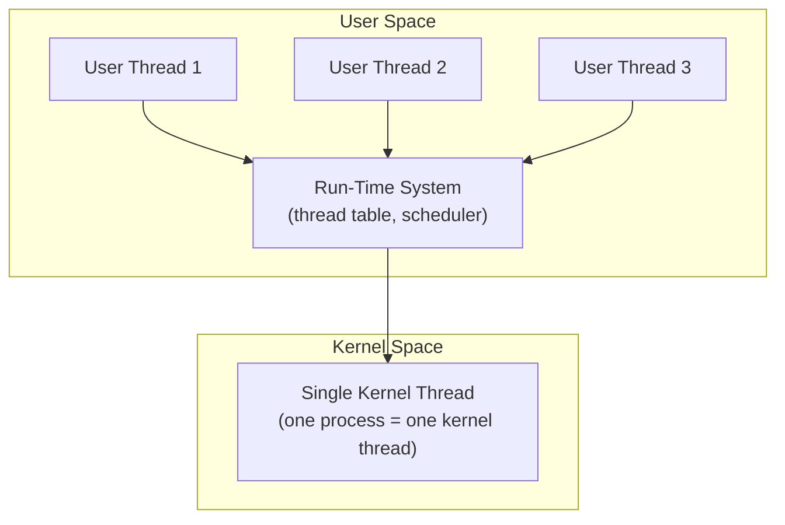
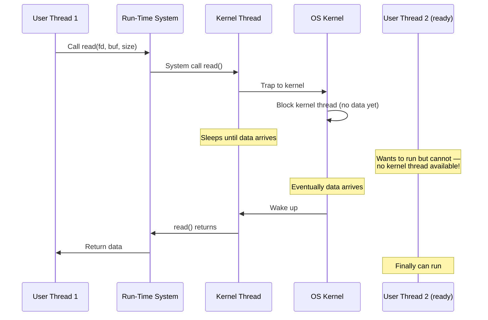
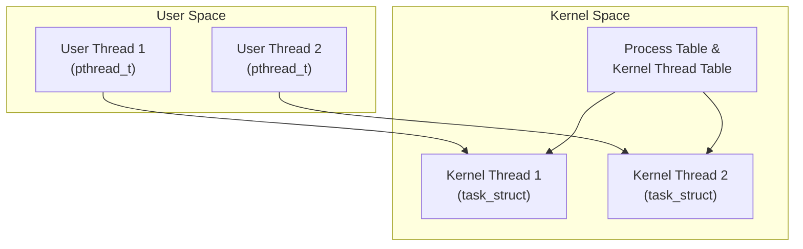
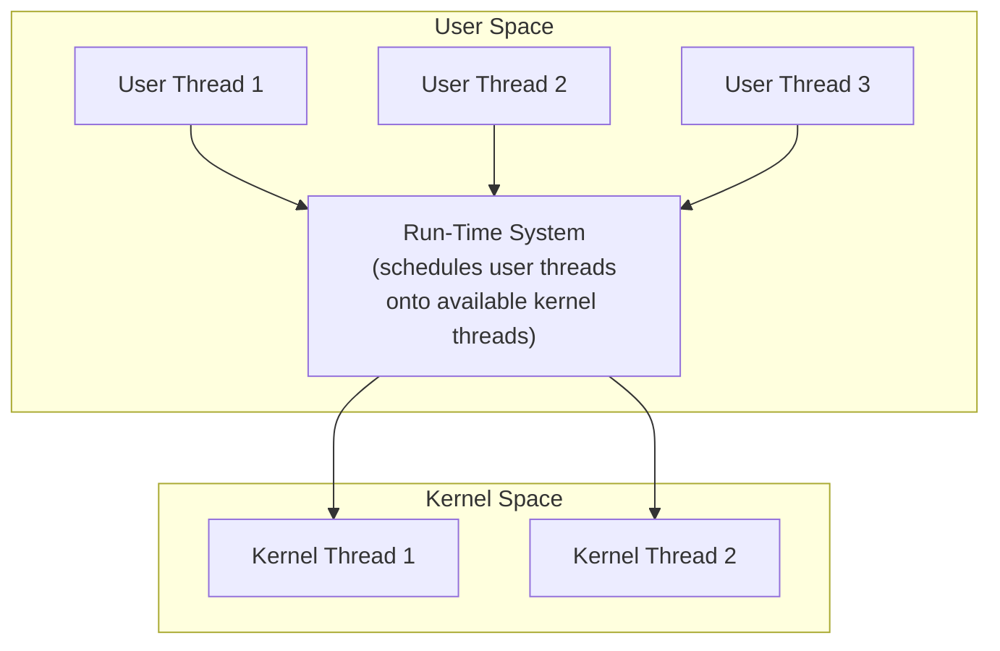

# 2.1. Threading Models and Thread Tables

> **Why this note exists.** "A thread" sounds like a single, well-defined thing — but in practice there are **two layers** of threading that may or may not match up: the threads your programming library exposes to you (user threads) and the threads the OS kernel actually schedules on CPU cores (kernel threads). The mapping between these layers — many-to-one, one-to-one, or many-to-many — determines everything about how your program behaves under blocking I/O, on multiprocessors, and during context switches. This note covers all three models in depth.

---

## 1. The Two Layers of Threading

Before diving into the models, we need to be precise about the two layers:

### 1.1 User-Level Threads
These are threads managed entirely by a **user-space library** — the "run-time system" (RTS). The library provides functions like `thread_create`, `thread_yield`, `thread_join`, and maintains its own **thread table** in user space. The kernel has no idea these threads exist; from the kernel's perspective, the process has just one execution context.

Examples:
- Old Unix systems with `setjmp`/`longjmp`-based thread libraries
- GNU Pth (Portable GNU threads)
- Python's `greenlet` library (used by gevent)
- Go's goroutines (somewhat — they're a hybrid, see §1.4)
- Old Java "green threads" (pre-Java 1.2 on Solaris)

### 1.2 Kernel-Level Threads
These are threads managed by the OS kernel. The kernel maintains a kernel-side thread table, schedules them onto CPU cores, and handles their blocking operations. Each kernel thread is a real schedulable entity that the kernel can dispatch on any core.

Examples:
- Linux's `clone()`-based threads (used by `pthread_create`)
- Windows threads (`CreateThread`)
- Modern Java threads (since Java 1.2)
- Modern Python `threading.Thread` (via `pthread_create`)

### 1.3 The Mapping Question

Given these two layers, how do we map user-level threads to kernel-level threads? Three classical answers:

- **Many-to-One**: many user threads → one kernel thread.
- **One-to-One**: one user thread → one kernel thread.
- **Many-to-Many**: many user threads → some smaller-or-equal number of kernel threads.

### 1.4 Modern Complications (Virtual Threads, Goroutines, etc.)

In modern languages, the lines blur:

- **Go goroutines** are user-level "threads" (very lightweight, ~2 KB stacks) multiplexed onto a small pool of kernel threads by the Go runtime. This is essentially **many-to-many**.
- **Java 21 virtual threads** are similar: user-level threads (continuations) scheduled onto a small carrier-thread pool by the JVM. Also **many-to-many**.
- **Python `asyncio` tasks** are not threads at all — they're coroutines running on a single thread with cooperative multitasking. They don't fit the classic model.
- **Erlang processes** are extremely lightweight user-level "processes" (not OS processes) multiplexed onto kernel threads by the BEAM VM. Also **many-to-many**.

We'll cover these in Chapter 5 (Python) and discuss them again briefly at the end of this note.

---

## 2. Many-to-One Model (User-Level Threads)

In this model, the operating system kernel is completely unaware of the existence of individual threads. The application uses a user-level library containing a **Run-Time System (RTS)** to manage scheduling.



### 2.1 Thread Table Placement

Located entirely in **user space**, inside the thread library. The table tracks for each user thread:
- The saved register state (PC, SP, general-purpose registers).
- The stack pointer (each user thread has its own user-space stack).
- The thread's state (ready, running, blocked).
- The thread's start function and argument.

The kernel has no entry for these threads. From the kernel's perspective, the process has exactly one execution stream.

### 2.2 How Context Switches Work

When user Thread A yields to user Thread B:
1. Thread A calls `thread_yield()` (a library function).
2. The library saves A's register state to A's entry in the user-space thread table.
3. The library picks B from the ready queue.
4. The library loads B's saved register state.
5. The library jumps to B's saved PC.

**No system call. No kernel involvement. No ring transition.** The entire switch happens in user space, taking just a few hundred nanoseconds. This is **dramatically faster** than a kernel context switch (which takes microseconds).

### 2.3 Advantages

- **Context switching is incredibly fast** because it doesn't require a system call or ring transition. Some benchmarks show 10× faster switches than kernel threads.
- **Highly portable**: runs on systems with no native thread support. The library can be implemented using `setjmp`/`longjmp` and `sigaltstack` on any POSIX system.
- **Customizable scheduling**: the library can implement any scheduling policy (priority, fair, real-time) without kernel modifications.
- **Lower per-thread overhead**: each user thread only needs a small stack (typically 4-64 KB), not the 8 MB default for kernel threads. You can spawn 100,000 user threads; you cannot spawn 100,000 kernel threads.

### 2.4 Disadvantages — The Global Blocking Problem

This is the killer issue. **If any user thread performs a blocking system call, the kernel sees the entire process as blocked.** It halts the single kernel thread, which blocks **all** user threads — even those that were ready to execute.

Why does this happen? Because the kernel doesn't know about the user threads. When user Thread 1 calls `read(fd, buf, size)`, the kernel sees a process making a blocking `read`. The kernel puts the kernel thread (the only one) to sleep until data arrives. The user-space scheduler has no chance to run because it lives in the same process — and that process is now blocked.



### 2.5 The "Workarounds" — Why They Don't Fully Work

User-thread libraries have tried various workarounds:

1. **Wrapper functions for blocking calls.** The library wraps `read()` with a version that uses non-blocking I/O and `select()` to check if data is ready. If not ready, the library yields to another user thread. This works but requires wrapping every potentially-blocking system call — a massive, fragile undertaking.

2. **Signal-based wakeup.** The library sets an alarm signal before each blocking call. If the alarm fires, the signal handler longjmps back to the scheduler. This is hacky and unreliable.

3. **Light-weight processes (LWPs).** Some systems (notably Solaris) provided LWPs as a middle layer — kernel-visible execution contexts that the user library could multiplex user threads onto. This led to the **many-to-many model** (§4 below).

None of these workarounds fully solve the problem. The fundamental issue is that the kernel doesn't know about user threads, so it can't help.

### 2.6 No True Parallel Processing

Even on a multi-core machine, a many-to-one process can only use **one core at a time**. The kernel schedules the single kernel thread on one core; the user-space scheduler multiplexes user threads onto that one core. There is no way to run two user threads simultaneously.

For CPU-bound work on multi-core systems, this is a deal-breaker.

### 2.7 Where It's Still Used

Despite these disadvantages, the many-to-one model survives in:

- **Embedded systems** with no MMU (no process isolation, so kernel threads don't make sense anyway).
- **Cooperative multitasking** libraries (like Python's `greenlet`).
- **State machines** disguised as threads (like `asyncio` — but those aren't really threads).
- **Educational settings** (to teach thread scheduling without kernel involvement).

---

## 3. One-to-One Model (Kernel-Level Threads)

Each user thread maps directly to an independent kernel execution context managed by the operating system scheduler. This is the model used by modern Linux and Windows.



### 3.1 Thread Table Placement

Located inside **kernel space**. The kernel maintains a thread table (on Linux, this is just the linked list of all `task_struct`s in the system) with entries for every kernel thread. Each entry tracks:

- The thread's saved register state.
- The thread's stack pointer (the kernel stack for this thread).
- Scheduling information (priority, run queue position, CPU affinity).
- The thread's state (running, runnable, blocked, etc.).
- A pointer to the owning process (for address space, file descriptors, etc.).

### 3.2 How Context Switches Work

When kernel Thread A is preempted and kernel Thread B is dispatched:

1. A timer interrupt (or other preempting event) triggers a transition to kernel mode.
2. The kernel saves A's register state to A's `task_struct`.
3. The scheduler picks B from the ready queue.
4. The kernel loads B's saved register state.
5. If A and B belong to the same process: just swap the stack pointer and program counter. The page tables are unchanged.
6. If A and B belong to different processes: also swap the page-table pointer (`CR3` on x86) and flush the TLB.
7. Return to user mode running B.

This involves at least one ring transition (user → kernel → user) and is significantly slower than a pure user-space context switch.

### 3.3 Advantages

- **True parallelism**: threads can execute on different CPU cores simultaneously. On a 4-core machine, 4 threads of the same process can run in parallel.
- **Non-blocking**: if one thread blocks on an I/O operation, the kernel schedules other threads from the same process. They continue running.
- **Preemptive**: the kernel can preempt a running thread at any timer tick. No thread can monopolize the CPU (within its priority class).
- **Simpler semantics**: there's a one-to-one mapping between user and kernel threads, so blocking behavior is predictable.
- **Hardware utilization**: the kernel can spread threads across all available cores.

### 3.4 Disadvantages

- **Context switches require entering the kernel**, which increases overhead. Each switch involves a system call (or interrupt return), adding ~1-5 microseconds.
- **Creating a thread requires allocating kernel structures**, making it resource-intensive. Each thread needs a kernel stack (typically 8-16 KB) and a `task_struct` (~8 KB on Linux).
- **Higher per-thread overhead**: the default 8 MB user stack plus kernel stack adds up. You can't have 100,000 kernel threads in a single process.
- **Kernel limits**: there's a system-wide limit on the number of threads (configured by `ulimit -u` and `kernel.threads-max` on Linux).

### 3.5 Modern Dominance

Almost every modern operating system uses the one-to-one model:

- **Linux**: `pthread_create` calls `clone()` with `CLONE_VM | CLONE_FILES | ...` flags. Each pthread is a kernel task.
- **Windows**: `CreateThread` directly creates a kernel thread.
- **macOS**: `pthread_create` calls into the BSD kernel which creates a kernel thread.
- **Modern Java**: `Thread.start()` calls `pthread_create` (on Linux) or `CreateThread` (on Windows).
- **Python**: `threading.Thread.start()` calls `pthread_create` via CPython's C code.
- **C++**: `std::thread` constructor calls `pthread_create` or `CreateThread`.

The reason for this dominance: **multi-core CPUs are universal**, and any model that can't use multiple cores is unacceptable for performance-critical applications.

---

## 4. Many-to-Many Model (Hybrid Threads)

This model maps many user-level threads to a smaller or equal number of kernel threads, combining the benefits of both approaches.



### 4.1 Thread Table Placement

Managed in **both user space and kernel space**:
- **User-space table**: tracks all user threads, their state, their stacks.
- **Kernel-space table**: tracks the smaller set of kernel threads.

The user-space scheduler is responsible for assigning user threads to available kernel threads. When a kernel thread becomes free, the scheduler picks a ready user thread to run on it.

### 4.2 Advantages

- **High flexibility**: context switches between user threads on the same kernel thread can occur entirely in user space (fast).
- **Blocking is contained**: if a user thread on kernel thread K1 blocks, the kernel can notify the user-space scheduler (via an upcall, see §2.2), which can then schedule another user thread onto a different kernel thread.
- **True parallelism**: with N kernel threads, up to N user threads can run in parallel on N cores.
- **Customizable scheduling**: the user-space scheduler can implement its own policies (priority, fairness, gang scheduling).

### 4.3 Disadvantages

- **Extremely complex to implement and maintain**. The coordination between the kernel and user-space scheduler is intricate. Bugs in the scheduler can deadlock the entire process.
- **Requires kernel support**: the kernel must provide primitives like upcalls (see §2.2) to notify the user-space scheduler of events. This means the OS must be modified — not portable to vanilla kernels.
- **Hard to debug**: when something goes wrong, it's not clear whether the bug is in the user-space scheduler, the kernel scheduler, or the interaction between them.

### 4.4 Historical Implementations

- **Solaris threads (pre-Solaris 9)**: the canonical example. Solaris had user-level threads, LWPs (lightweight processes — kernel-visible execution contexts), and kernel threads. The user library multiplexed user threads onto LWPs.
- **Mach threads**: the basis for macOS XNU kernel's threading. Used a similar model.
- **IRIX, HP-UX**: similar models.

By the early 2000s, **all of these systems had moved to one-to-one**. The complexity of many-to-many wasn't worth the benefits, given that multi-core CPUs made one-to-one fast enough.

### 4.5 The Many-to-Many Renaissance

Interestingly, the many-to-many model has had a renaissance in the 2010s-2020s, but at the **language runtime level** rather than the OS level:

- **Go goroutines**: the Go runtime multiplexes millions of goroutines onto a small pool of kernel threads (default: `GOMAXPROCS` = number of cores). Blocking syscalls are intercepted; if a goroutine blocks, the runtime moves other goroutines to a new kernel thread.
- **Java 21 virtual threads**: same idea. The JVM multiplexes virtual threads onto a small pool of carrier threads (kernel threads).
- **Erlang processes**: the BEAM VM multiplexes millions of Erlang processes onto kernel threads.
- **Kotlin coroutines, Python `asyncio` (sort of)**: similar concepts.

These systems get the best of both worlds: **kernel-thread parallelism** plus **user-thread lightness**. But they require massive engineering effort in the language runtime — they're not something you can build in user space on top of standard OS APIs.

---

## 5. Comparing the Models — A Concrete Example

Imagine you're writing a web server that needs to handle 100 concurrent connections. Each connection spends 90% of its time waiting for network I/O and 10% processing requests.

### 5.1 Many-to-One Implementation

- You spawn 100 user threads, one per connection.
- The user-space scheduler round-robins between them.
- When one thread calls `recv()`, **all 100 threads block** until data arrives.
- Effectively serial — no concurrency.

**Result**: unusable for a web server.

### 5.2 One-to-One Implementation

- You spawn 100 kernel threads, one per connection.
- When one thread calls `recv()`, the kernel blocks just that thread. The other 99 keep running.
- True concurrency — you can serve 100 requests in parallel.

**Result**: works well, but each thread costs ~8 MB virtual memory. 100 threads × 8 MB = 800 MB of virtual address space (most of it unused, but reserved).

### 5.3 Many-to-Many Implementation

- You spawn 100 user threads on a pool of, say, 8 kernel threads (one per core).
- The user-space scheduler multiplexes the 100 user threads onto the 8 kernel threads.
- When one user thread blocks on `recv()`, the scheduler moves it to a "blocked" list and runs another user thread on the same kernel thread (assuming the scheduler is using non-blocking I/O).

**Result**: best of both worlds — 8 cores fully utilized, 100 concurrent connections, low memory overhead.

This is exactly what Go, Java 21, and Erlang do. The catch: building the runtime that achieves this is **very hard**.

---

## 6. Thread Tables — A Closer Look

A **thread table** is the data structure that tracks all threads in a system. Its location and contents depend on the threading model.

### 6.1 User-Space Thread Table (Many-to-One, Many-to-Many)

Located inside the thread library. Each entry contains:
- Thread ID
- Saved register state (PC, SP, GPRs)
- Stack pointer (and stack base/size for cleanup)
- State (running, ready, blocked, terminated)
- Start function and argument
- Priority (if the library supports priorities)
- Wait reason (what the thread is blocked on)

The library typically implements this as an array or linked list, protected by a single lock (since only one thread runs at a time in many-to-one).

### 6.2 Kernel-Space Thread Table (One-to-One)

Located in kernel memory. On Linux, this is the linked list of all `task_struct`s in the system (organized into multiple data structures for efficient lookup by PID, by run-queue position, etc.).

Each `task_struct` contains (among hundreds of fields):
- PID and TGID
- Saved register state (in `thread_info`)
- Kernel stack pointer
- Scheduling parameters (priority, policy, run queue position)
- Pointer to `mm_struct` (the address space)
- Pointer to `files_struct` (the file descriptor table)
- Signal handling state
- CPU affinity mask
- Statistics (CPU time consumed, last run time)

### 6.3 Why the Table Location Matters

The location of the thread table determines:
- **Switching speed**: user-space tables switch faster (no kernel involvement).
- **Visibility to kernel tools**: kernel-space tables are visible to `ps`, `top`, `gdb`. User-space tables are not — the kernel doesn't know they exist.
- **Robustness**: a bug in a user-space thread library can corrupt its table; the kernel can't help. A bug in the kernel's thread table is a kernel panic.

---

## 7. Common Pitfalls and Reminders

1. **"My user-thread library deadlocks when I call `read()`."** Classic many-to-one problem. Use non-blocking I/O with `select()`/`poll()`, or switch to a one-to-one library.

2. **"I created 10,000 threads and the system refuses to create more."** One-to-one limit. Use a thread pool (limit concurrency to a few hundred) or switch to a many-to-many runtime like Go.

3. **"My program uses 100% CPU on one core but other cores are idle."** Many-to-one model. Switch to one-to-one (use real `pthread_create`) to use multiple cores.

4. **"My threads work fine until I add a third-party library that uses threads internally."** Mixing threading models is dangerous. If your program uses many-to-one user threads but calls into a library that uses kernel threads, the kernel threads may block and freeze your user threads.

5. **"Go's goroutines look like threads but don't act like them."** They're user-level, multiplexed by the Go runtime onto kernel threads. They have small stacks (~2 KB) that grow on demand. Blocking calls are intercepted and handled specially.

6. **"Java's virtual threads (Java 21+) are confusing."** They're essentially goroutines for Java. Same model: user-level, multiplexed onto carrier threads. Use them for I/O-bound work; don't use them for CPU-bound work that needs parallelism (they only run when their carrier runs).

7. **"I'm on Linux; what model am I using?"** Linux's `pthread_create` is one-to-one. If you use `pthread_create` (or `std::thread`, or Python's `threading.Thread`, or Java's `Thread`), you're using one-to-one. The only way to use many-to-one on Linux is to use a non-standard library like GNU Pth.

8. **"The thread table is shared; how is it protected?"** In user-space tables, by a single lock acquired during scheduling decisions. In kernel tables, by per-CPU run-queue locks (modern Linux) or a single global lock (older systems).

---

## 8. Summary — The Big Picture

```mermaid
graph TD
    Q{Need concurrency?} -->|"Yes"| Q1{Need multi-core parallelism?}
    Q1 -->|"No, I/O-bound only"| M1[Many-to-One<br/>or async/await]
    Q1 -->|"Yes"| Q2{Need 10,000+ concurrent tasks?}
    Q2 -->|"No, dozens to hundreds"| OTO[One-to-One<br/>(standard pthreads / std::thread)]
    Q2 -->|"Yes"| MTM[Many-to-Many<br/>(Go, Java 21 virtual threads, Erlang)]
```

The dominant model today is **one-to-one**. The many-to-many model is experiencing a renaissance in language runtimes (goroutines, virtual threads), but it's implemented inside the runtime, not at the OS level. The many-to-one model is largely historical — it taught us a lot about scheduling but couldn't survive the multi-core era.

---

> **Next note.** §2.2 covers **scheduler activations** — the 1990s attempt to give many-to-many threading proper kernel support via the **upcall** mechanism, where the kernel calls into user space to notify the library of blocking events.
