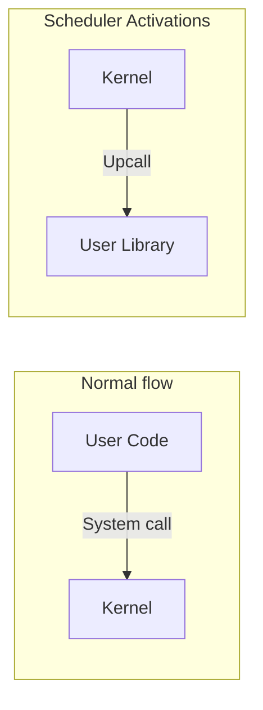
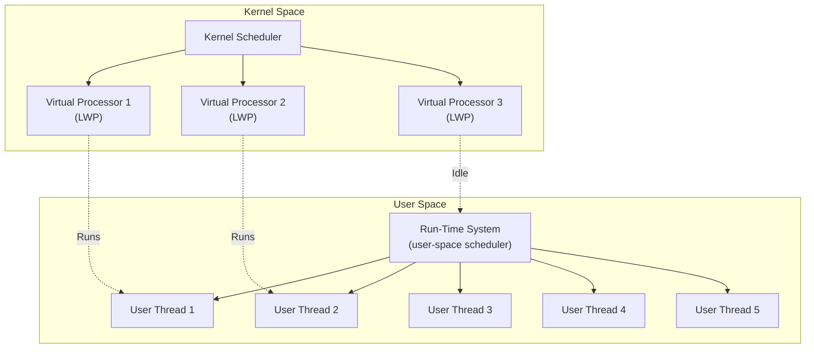
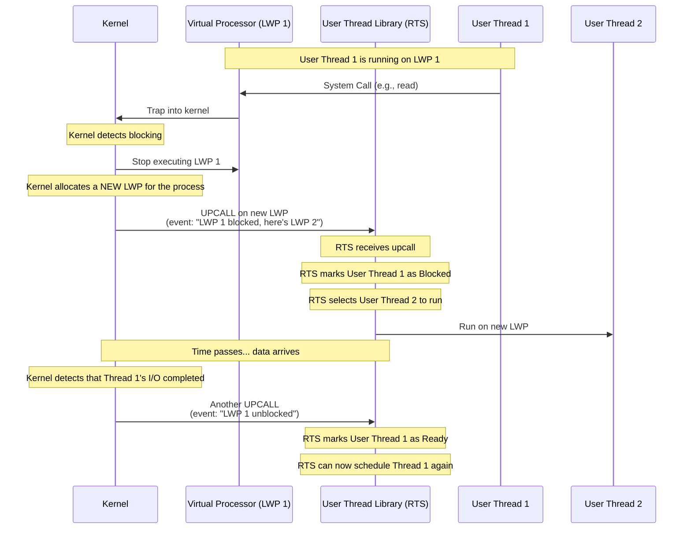

# 2.2. Scheduler Activations and Upcall Architecture

> **Why this note exists.** The many-to-many threading model (§2.1) sounds great in theory: user-level threads give you fast context switches, and kernel threads give you parallelism and proper blocking behavior. But making it actually work requires the kernel and user-space library to **communicate** — and traditional kernels don't talk to user-space libraries. **Scheduler activations** are a clever mechanism (proposed by Anderson, Bershad, Lazowska, and Levy in 1991) that lets the kernel notify the user-space scheduler of events that affect its scheduling decisions. This note explains the architecture in depth, including the **upcall** mechanism that makes it possible.

---

## 1. The Problem Scheduler Activations Solve

Recall the many-to-many model: a user-space scheduler maps many user threads onto a smaller number of kernel threads. The kernel schedules the kernel threads onto CPU cores. The user library schedules user threads onto kernel threads.

This works fine **until something goes wrong**:

- A user thread blocks on a system call. The kernel blocks the kernel thread running it. But the user library doesn't know — it thinks the kernel thread is still running that user thread.
- A kernel thread that was running a user thread gets preempted. The user library doesn't know — it thinks the user thread is still executing.
- A page fault occurs and the kernel thread is suspended while the page is loaded from disk. The user library doesn't know.
- A new CPU becomes available (the process was running on 2 cores, now 4 are free). The user library doesn't know — it could be running more user threads in parallel but doesn't.

In all these cases, the **user-space scheduler is flying blind**. It cannot make good scheduling decisions because the kernel doesn't tell it what's happening.

### 1.1 The Naive Solution: Polling

The user library could periodically poll the kernel: "are my kernel threads still running? did any block? are there more cores available?" But polling is wasteful (consumes CPU even when nothing changes) and adds latency (events aren't noticed until the next poll).

### 1.2 The Scheduler Activations Solution: Upcalls

**Scheduler activations** turn the communication around: instead of the user library asking the kernel, the **kernel notifies the user library** via a function call. This kernel-to-user notification is called an **upcall** (as opposed to a system call, which is user-to-kernel).

When something interesting happens (a thread blocks, a thread is preempted, a CPU becomes available), the kernel makes an upcall to a well-known entry point in the user-space library. The library can then update its thread table and reschedule.

This is the inverse of the normal control flow:



---

## 2. Architectural Concept

The kernel allocates a set of **Virtual Processors** (often implemented as Light-Weight Processes, or LWPs) to the process. The user-space thread library then schedules user threads onto these virtual processors.



The kernel promises to maintain a certain number of virtual processors for the process — say, one per CPU core. The user library can rely on having that many execution contexts available.

### 2.1 The Upcall Mechanism — Step by Step

An **upcall** is a kernel-to-user signal where the kernel calls a predefined entry point in the user-space thread library.



#### Step-by-Step Upcall Execution Workflow

1. **Thread Blockage:** A user thread (Thread 1) running on LWP 1 makes a blocking system call (e.g., `read()`) or triggers a page fault.

2. **Kernel Detection:** The kernel intercepts the blocking event. It marks LWP 1 as blocked — that LWP cannot continue executing until the event resolves.

3. **Upcall Allocation:** The kernel allocates a *new* LWP (LWP 2) to the process. This new LWP is created with a special initial state: its program counter is set to the **upcall handler** address (an entry point in the user-space thread library that the library registered with the kernel at startup). Its stack is set up so that the upcall handler can be called like a normal function.

4. **Library State Update:** The upcall handler receives parameters indicating which thread blocked (Thread 1) and why. The user library updates its internal thread table, marking Thread 1 as "Blocked" and recording the reason.

5. **Rescheduling:** The library scheduler selects another runnable thread (Thread 2) and runs it on LWP 2 in user space. The library's normal user-space scheduling code now executes on the new LWP — it picks a thread, loads its saved state, and jumps to it.

6. **Wakeup Upcall:** When the kernel detects that Thread 1's blocking event has completed (e.g., the disk I/O finished and the data is now in memory), it triggers another upcall to notify the user-space runtime. The runtime can then move Thread 1 back to the "Ready" queue and (if appropriate) wake it up.

### 2.2 Why This Is Better Than Polling

- **Low latency**: the user library is notified the instant an event happens, not on the next poll.
- **No wasted CPU**: the user library doesn't burn cycles polling when nothing has changed.
- **Accurate state**: the user library always has an up-to-date picture of which kernel threads are runnable.
- **Cooperative scheduling**: the user library can make informed decisions, like "I have 3 runnable user threads and only 2 LWPs — let me run the 2 highest-priority ones."

---

## 3. The Upcall Handler — In Detail

The upcall handler is a function in the user-space thread library that the kernel calls when an interesting event occurs. It's registered with the kernel at process startup (via a special system call that doesn't exist in standard POSIX but was proposed in the original scheduler activations paper).

### 3.1 The Handler's Signature

Conceptually:

```c
void upcall_handler(
    upcall_event_t event,      // What happened
    lwp_id_t affected_lwp,     // Which LWP was affected
    void* saved_state,         // Saved state of the affected LWP
    int available_lwps         // How many LWPs the process now has
);
```

### 3.2 The Events

The kernel calls the handler with one of these events:

- **`UPCALL_BLOCKED`**: the LWP blocked on a system call. The handler should mark the running user thread as blocked and pick another to run on a new LWP.
- **`UPCALL_UNBLOCKED`**: a previously-blocked LWP is now runnable. The handler should mark the corresponding user thread as ready.
- **`UPCALL_PREEMPTED`**: the LWP was preempted by the kernel scheduler. The handler should record that the user thread didn't finish its time slice.
- **`UPCALL_CPU_AVAILABLE`**: a new CPU is available (e.g., the process's CPU quota was increased). The handler can now run more user threads in parallel.
- **`UPCALL_CPU_REMOVED`**: a CPU was taken away. The handler must migrate user threads off the affected LWP.

### 3.3 The Handler's Job

For each event, the handler:

1. Updates the user-space thread table to reflect the new state.
2. Decides which user thread(s) to run on the available LWP(s).
3. Loads the chosen user thread's state and jumps to it.

The handler must be **non-blocking** — it cannot make any blocking system calls (which would cause another upcall, leading to infinite recursion). It must use only user-space data structures and simple operations.

---

## 4. Interrupt Handling Cases

When a hardware interrupt occurs, the CPU enters kernel mode, and the executing thread is suspended. The kernel must handle this based on whether the interrupt is related to the running process:

### 4.1 Case A: Unrelated Interrupt (e.g., Network Packet for another process)

The kernel handles the interrupt and restores the suspended thread's state. The process is unaware that the interrupt occurred.

Example: Thread 1 of Process A is running on CPU 0. A network packet arrives for Process B. The kernel's network interrupt handler runs on CPU 0, processes the packet, queues it for Process B, and returns. Thread 1 resumes execution as if nothing happened.

### 4.2 Case B: Related Interrupt (e.g., Disk Page requested by the running thread arrives)

The kernel handles the interrupt. It then performs an upcall to the user-space runtime system to notify it that the page is loaded, allowing the runtime scheduler to wake up the blocked thread.

Example: Thread 1 of Process A triggered a page fault while accessing memory. The kernel started a disk read and blocked Thread 1. Now the disk read completes. The kernel:

1. Moves the disk data into the page frame.
2. Updates the page table to map the virtual address to the new physical page.
3. Performs an upcall to the user-space runtime: "Thread 1's page fault is resolved, it can run again."
4. The runtime adds Thread 1 back to the ready queue.

### 4.3 Case C: Timer Interrupt (Preemption)

The timer fires, indicating that the current thread's time quantum has expired. The kernel:

1. Saves the thread's register state.
2. Performs an upcall: "Thread 1 was preempted at this point."
3. The runtime records that Thread 1 didn't finish its work and adds it back to the ready queue.
4. The runtime picks another thread to run on this LWP.

Without this upcall, the runtime would think Thread 1 was still running, leading to scheduling inconsistencies.

---

## 5. Critical Sections and Upcall Safety

A subtle issue: what happens if an upcall occurs while the user-space library is in the middle of updating its thread table?

For example:
1. The library is removing Thread A from the ready queue.
2. It has removed A from the queue but not yet added it to the running list.
3. At this moment, an upcall fires.

If the upcall handler tries to access the thread table, it will see an inconsistent state — A is neither in the ready queue nor in the running list. This could cause the handler to crash or make wrong decisions.

### 5.1 The Solution: Disable Upcalls During Critical Sections

The library must be able to **disable upcalls** during critical sections. While upcalls are disabled, the kernel queues them and delivers them all at once when the library re-enables upcalls.

This is analogous to disabling interrupts in the kernel during critical sections. The library provides two functions:

```c
void disable_upcalls();   // Kernel will queue upcalls
void enable_upcalls();    // Kernel delivers any queued upcalls
```

Inside critical sections, the library wraps its work:

```c
disable_upcalls();
// ... modify thread table ...
enable_upcalls();
```

### 5.2 The Re-entrancy Constraint

Because upcalls can be delivered between any two user-space instructions (when not disabled), the library must be **re-entrant** in the sense that an upcall handler can safely execute while another thread is in the middle of library code.

This is hard to achieve in practice. The original scheduler activations paper proposed several techniques, but the complexity is one reason the model wasn't widely adopted.

---

## 6. Why Scheduler Activations Didn't Take Over the World

Despite being a beautiful design, scheduler activations never became mainstream. Why?

### 6.1 Implementation Complexity

The kernel modifications required are extensive. Every blocking system call, every page fault, every preemption point needs to be instrumented to generate upcalls. This is invasive and bug-prone.

### 6.2 The User Library Is Complex Too

The library must handle re-entrancy, manage its own critical sections, and correctly process upcalls under all conditions. The original paper's reference implementation was thousands of lines of subtle code.

### 6.3 One-to-One Got Fast Enough

As CPU speeds increased and multi-core became universal, the performance advantage of user-level threads shrank. Modern one-to-one thread context switches take 1-5 microseconds — fast enough for most applications.

### 6.4 Multi-Core Made Many-to-One Unusable

The "global blocking problem" of many-to-one was bad enough on single-core; on multi-core, leaving cores idle because one thread blocked was inexcusable. The one-to-one model, which uses all cores naturally, won.

### 6.5 Language Runtimes Solved It Differently

Modern languages like Go, Java (virtual threads), and Erlang implement many-to-many **inside the runtime**, not in the kernel. The runtime intercepts blocking calls (using non-blocking I/O and async facilities like `io_uring` on Linux), so it doesn't need kernel upcalls. This achieves the same goal with less kernel support.

### 6.6 Where It Does Live On

The ideas from scheduler activations influenced:

- **Linux's `clone()` system call** and the way the kernel communicates scheduling events to user space (via signals, futexes).
- **`io_uring`** (Linux 5.1+), which provides a kernel-to-user notification mechanism for I/O completion — conceptually similar to upcalls.
- **Windows Thread Pool API**, which uses similar notification patterns.
- **Async I/O libraries** (libuv, libevent), which use kernel events to drive user-space callbacks.

---

## 7. A Concrete Pseudocode Example

Here's how a user-space thread library using scheduler activations might look in pseudocode:

```c
// === Initialization ===
void thread_library_init() {
    // Register the upcall handler with the kernel
    kernel_register_upcall_handler(upcall_handler);

    // Request virtual processors (LWPs)
    int n_cpus = kernel_get_ncpus();
    kernel_request_lwps(n_cpus);

    // Initialize the thread table
    init_thread_table();

    // Create the main thread
    thread_t* main = create_thread(main_function, NULL);
    set_thread_state(main, RUNNING);
}

// === Upcall Handler ===
void upcall_handler(upcall_event_t event, lwp_id_t lwp, void* state) {
    disable_upcalls();
    switch (event) {
        case UPCALL_BLOCKED:
            // The user thread running on `lwp` blocked
            thread_t* blocked = find_thread_on_lwp(lwp);
            set_thread_state(blocked, BLOCKED);
            save_thread_state(blocked, state);

            // Pick a new thread to run on this LWP
            thread_t* next = pick_next_runnable();
            if (next) {
                set_thread_state(next, RUNNING);
                load_thread_state(next);
            }
            break;

        case UPCALL_UNBLOCKED:
            // A previously-blocked thread can run again
            thread_t* unblocked = find_blocked_thread_for_lwp(lwp);
            set_thread_state(unblocked, READY);
            add_to_ready_queue(unblocked);
            break;

        case UPCALL_PREEMPTED:
            // The kernel preempted us; save state and reschedule
            thread_t* preempted = find_thread_on_lwp(lwp);
            save_thread_state(preempted, state);
            set_thread_state(preempted, READY);
            add_to_ready_queue(preempted);

            // Pick next thread
            thread_t* next = pick_next_runnable();
            set_thread_state(next, RUNNING);
            load_thread_state(next);
            break;
    }
    enable_upcalls();
}

// === Thread Creation ===
thread_t* thread_create(void (*fn)(void*), void* arg) {
    disable_upcalls();
    thread_t* t = allocate_thread_struct();
    t->fn = fn;
    t->arg = arg;
    t->state = READY;
    t->stack = allocate_stack(DEFAULT_STACK_SIZE);
    set_thread_state(t, READY);
    add_to_ready_queue(t);
    enable_upcalls();
    return t;
}
```

This is simplified — a real implementation handles dozens of edge cases. But it gives the flavor: the upcall handler is the heart of the system, responding to kernel events and updating the user-space thread table.

---

## 8. Common Pitfalls and Reminders

1. **"Scheduler activations are mentioned in my textbook but I can't find a Linux implementation."** They were never merged into Linux. The ideas influenced other mechanisms (`io_uring`, futexes) but the full upcall model isn't there.

2. **"What's the difference between an upcall and a signal?"** A signal is a kernel-to-user notification with limited information (just the signal number). An upcall is a kernel-to-user function call with arbitrary parameters (event type, affected LWP, saved state). Upcalls are more flexible but require more kernel support.

3. **"Why doesn't Go use scheduler activations?"** Go doesn't need them. The Go runtime intercepts blocking syscalls (using `non-blocking I/O` and `epoll`), so it always knows when a goroutine blocks. No kernel upcall required.

4. **"What's an LWP?"** Light-Weight Process. A kernel-visible execution context (essentially a kernel thread) that the user library can map user threads onto. The term comes from Solaris.

5. **"Is the upcall handler the same as a signal handler?"** Conceptually similar but with important differences. Signal handlers run on the same stack (or an alternate stack) and have severe restrictions on what they can do. Upcall handlers run on a fresh LWP with a fresh stack and can do anything a normal user-space function can.

6. **"If scheduler activations were so great, why didn't they catch on?"** Mostly because one-to-one threading got fast enough, and language runtimes found ways to do many-to-many without kernel support. The complexity wasn't worth it.

7. **"Are there any modern systems using scheduler activations?"** Not directly. The closest thing is **Linux's `io_uring`**, which uses ring buffers to communicate I/O completions from kernel to user — conceptually similar to upcalls but for I/O only, not for scheduling events.

---

## 9. Summary — What to Remember

1. **Scheduler activations** are a mechanism for the kernel to notify a user-space thread library of scheduling events.
2. The notification is called an **upcall** — a kernel-to-user function call.
3. The user library registers an **upcall handler** that the kernel calls on events like thread blockage, preemption, or CPU availability changes.
4. The handler updates the user-space thread table and reschedules user threads onto available kernel threads.
5. The model requires both kernel support (to generate upcalls) and user library support (to handle them).
6. It never achieved widespread adoption because one-to-one threading got fast enough, and modern language runtimes (Go, Java, Erlang) implement many-to-many without kernel upcalls.
7. The **ideas** live on in `io_uring`, async I/O libraries, and Windows Thread Pool API.

Scheduler activations are an important part of OS history and a beautiful design — even if you'll never implement them, understanding them deepens your understanding of the kernel-user interface.

---

> **Next note.** §2.3 covers **pop-up threads** — a different design concern: in high-throughput network servers, creating a fresh thread for each incoming request can be faster than waking up a pre-existing worker thread, because the new thread has no historical state to restore.
