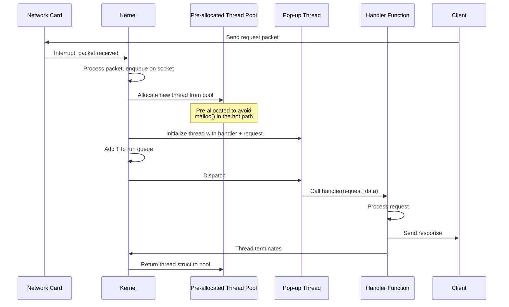
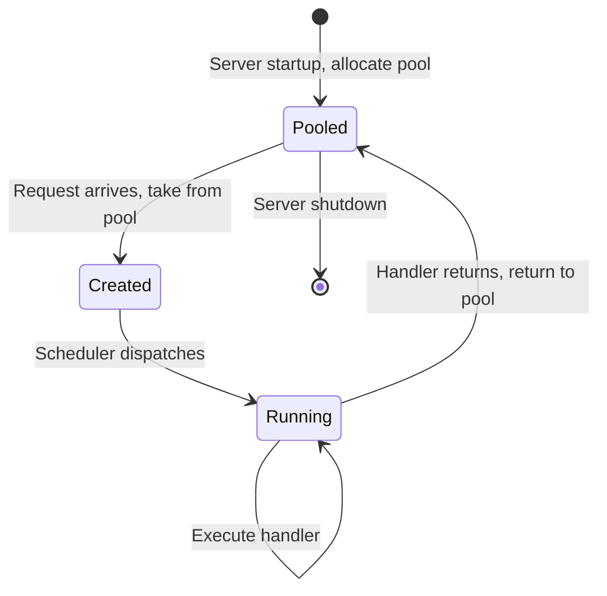
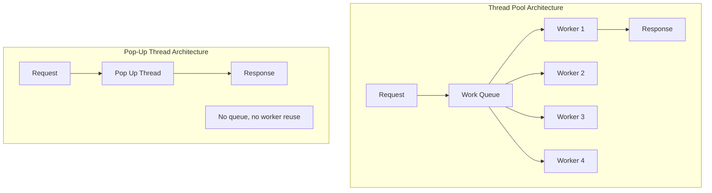

# 2.3. Distributed Systems and Pop-Up Thread Design

> **Why this note exists.** In high-throughput distributed systems — web servers, RPC frameworks, message brokers — the cost of handling an incoming request can be dominated by **scheduling latency**: the time between "a packet arrived" and "a thread is actually executing the request handler." Traditional thread-pool architectures add latency because waking an idle worker thread requires restoring its saved register state, invalidating cache lines, and possibly migrating it between cores. **Pop-up threads** offer an alternative: create a brand-new thread for each request. This note explains when this counterintuitive design wins, and the trade-offs it involves.

---

## 1. The Latency Problem in Distributed Systems

Imagine a high-performance RPC server. It receives 100,000 requests per second. For each request, the server must:

1. Receive the packet from the network.
2. Schedule a thread to handle it.
3. The thread executes the request handler (reads from a database, computes a result, etc.).
4. The thread sends the response.

The total latency of a request is the sum of:
- Network latency (out of our control)
- **Scheduling latency** (time from "packet received" to "thread running")
- Execution latency (time to actually process the request)
- Response-sending latency

If the request handler takes 100 µs to execute, but the scheduling latency is 50 µs, then 33% of your latency is just scheduling. Cutting scheduling latency can dramatically improve tail latency (P99, P99.9) — which is often what matters most in real-world systems.

### 1.1 Where Scheduling Latency Comes From

When a packet arrives:
1. The network card raises an interrupt.
2. The kernel's interrupt handler runs.
3. The kernel enqueues the packet on the receiving socket's buffer.
4. The kernel wakes up a thread that was blocked in `recv()` on that socket.

That last step — "wakes up a thread" — is where the latency hides:

- The thread was in the **Bloqué** state (see §1.2). Its register state was saved when it blocked.
- The kernel changes its state to **Prêt** (ready) and adds it to the run queue.
- The scheduler eventually dispatches it to a CPU core.
- The CPU loads the thread's saved register state.
- The thread resumes execution in `recv()`, which returns with the data.

This process involves:
- A system call (the wakeup)
- A scheduling decision
- A context switch (loading the thread's state)
- **Cache effects**: the thread's stack and code may have been evicted from cache while it was sleeping. The first few hundred instructions it executes will be cache misses.

For very fast requests (microseconds), this overhead can dominate.

---

## 2. The Pop-Up Thread Alternative

A **pop-up thread** is a brand-new thread created on-demand for each incoming request. Instead of waking up a pre-existing worker thread, the system creates a new thread, gives it the request, and lets it run.


### 2.1 Why This Can Be Faster

The key insight: **a newly-created thread has no historical execution context to restore.** Its stack is empty, its registers are initialized to known values, and its program counter points to the start function.

Compare:

#### Waking an Existing Worker Thread
1. Find the thread in the blocked-threads list.
2. Change its state to Ready.
3. Add it to the run queue.
4. Wait for the scheduler to dispatch it.
5. Load its saved register state (which includes a stack pointer to a stack that may have cold cache lines).
6. Resume execution at the point where it called `recv()` — which then returns.
7. The thread checks what was received and processes it.

Total: multiple scheduling decisions, register restoration, cold cache effects.

#### Popping Up a New Thread
1. Allocate a new TCB.
2. Allocate a new stack (from a pre-allocated pool, so no `mmap` needed).
3. Initialize the thread's state: PC = handler function, SP = top of new stack, the request data is passed as an argument.
4. Add the thread to the run queue.
5. Wait for the scheduler to dispatch it.
6. The thread starts executing the handler function with the request data immediately.

Total: no register state to restore, no cold stack to walk back into, the handler runs from its entry point with a fresh stack.

### 2.2 Why "Fresh" Matters for Cache

When you wake an existing thread:
- Its stack contains old stack frames from previous `recv()` calls, the previous request's local variables, etc.
- These stack pages may have been evicted from L1/L2 cache while the thread slept.
- When the thread resumes, it pushes a new stack frame — which likely causes cache misses on the stack memory.

When you pop up a new thread:
- Its stack is brand-new (from a pre-allocated pool, but never used by this thread before).
- The first stack writes are to a known location, which can be cache-line-aligned and pre-fetched.
- No old stack frames to walk through.

For very short-lived request handlers, this cache difference can save 10-50% of the per-request cost.

---

## 3. The Architecture in Detail



### 3.1 The Pre-allocation Trick

Naively, "create a new thread per request" sounds expensive: each `pthread_create` takes 30-80 µs. That's way too slow for a 100,000 req/sec server.

The trick is **pre-allocation**: at server startup, allocate a pool of, say, 10,000 thread structures (TCBs and stacks). When a request arrives:
1. Grab a free TCB+stack from the pool (constant time, just a pointer swap).
2. Initialize the TCB (set PC to the handler, SP to the stack top, arg to the request data).
3. Add to the run queue.

When the thread finishes:
1. Reset the stack (zero it out, for security).
2. Return the TCB+stack to the pool.

This makes thread "creation" essentially free — just a few memory writes.

### 3.2 The Lifecycle of a Pop-Up Thread



Note: the thread never goes through the Blocked state (unless the handler itself blocks on I/O, which is a separate concern). It's Created → Running → Pooled.

---

## 4. Space Planning Trade-offs

When designing pop-up threads, you must choose where the thread is created:

### 4.1 Kernel-Space Pop-Up Threads

The thread is created entirely in kernel space. The handler function runs in kernel mode.

**Pros:**
- **Extremely fast creation.** No user-space/kernel-space transition is needed; the kernel just initializes a new kernel thread.
- **Direct hardware access.** The thread can interact directly with kernel network buffers and device drivers, avoiding the cost of copying data to user space.
- **No syscall overhead for I/O.** The thread can do I/O operations directly.

**Cons:**
- **High risk.** A programming bug or memory leak in a kernel-space thread can crash the entire operating system.
- **Limited language support.** Kernel code is usually C (or Rust on newer systems); you can't easily write your handler in Python or Java.
- **Security concerns.** Running user-request handlers in kernel mode is dangerous — a malicious request could potentially exploit a bug to take over the kernel.
- **Difficult to update.** Updating a handler requires rebuilding and reloading the kernel module.

**Where it's used:** High-performance network stack components (e.g., Linux's `AF_XDP` for kernel-bypass networking), certain database engines (older versions of Oracle used kernel threads for connections).

### 4.2 User-Space Pop-Up Threads

The thread is created in user space. The kernel notifies a user-space server (via a signal, upcall, or shared-memory queue) that a request arrived; the user-space code creates the thread.

**Pros:**
- **Highly secure.** If a thread crashes (e.g., due to a null pointer or buffer overflow), only that thread or its parent process is terminated. The kernel remains stable.
- **Easy to update.** Just restart the user-space server; no kernel changes.
- **Language flexibility.** You can write the handler in any language that compiles to native code (C, C++, Rust, Go).

**Cons:**
- **Slower creation.** Creating the thread requires crossing the boundary between user and kernel space — the kernel must allocate the TCB and stack, then return to user space.
- **Additional copy.** The request data must be copied from kernel buffers to user-space memory (unless using zero-copy techniques like `io_uring`'s registered buffers).

**Where it's used:** Most modern web servers and RPC frameworks (gRPC, Apache Thrift, Finagle).

### 4.3 Comparison Table

| Aspect | Kernel-Space Pop-Up | User-Space Pop-Up |
| :--- | :--- | :--- |
| Creation time | ~5 µs | ~30-80 µs |
| Stability | Crash risk to kernel | Crash limited to process |
| Security | High risk | Low risk |
| Language | C/Rust | Any |
| Hardware access | Direct | Via syscalls |
| Update ease | Hard (kernel module) | Easy (restart process) |

For almost all applications, **user-space pop-up threads are the right choice**. Kernel-space threads are reserved for very specialized high-performance networking where the kernel is the bottleneck.

---

## 5. Pop-Up Threads vs. Thread Pools

A thread pool is the more common alternative: a fixed set of worker threads, each taking work from a queue. When a request arrives, it's enqueued; a worker dequeues and processes it.



### 5.1 When Pop-Up Threads Win

- **Very short requests** (microseconds). The thread-pool wakeup cost dominates.
- **Variable request sizes.** Thread pools can suffer from "head-of-line blocking" if a worker takes a long request; pop-up threads handle each independently.
- **High burst rates.** A thread pool with N workers can only handle N concurrent requests; pop-up threads can scale to thousands.
- **Tail-latency-sensitive workloads.** Pop-up threads avoid the "wait for a worker to be free" delay.

### 5.2 When Thread Pools Win

- **Long-running requests** (seconds to minutes). Creating a thread per request is wasteful when the thread will live for a long time anyway.
- **Limited memory.** Each thread needs a stack (8 MB virtual, but at least 64 KB physical). 10,000 threads = ~600 MB of physical memory just for stacks.
- **Steady, predictable load.** Thread pools amortize the creation cost.
- **Shared state.** If workers can share cached data, a thread pool keeps the cache warm; pop-up threads start cold each time.

### 5.3 Modern Hybrids: Thread Pools + Async I/O

Most modern high-performance servers (NGINX, Envoy, gRPC, Finagle) use a **hybrid**:

- A small thread pool (one thread per CPU core).
- Each thread runs an event loop (epoll/kqueue/io_uring).
- The event loop processes many concurrent requests via callbacks or coroutines.
- For long-running CPU-bound work, the event loop dispatches to a separate worker pool.

This gets the best of all worlds: the low overhead of event-driven I/O, the parallelism of multiple threads, and the simplicity of a thread pool for CPU-bound work.

---

## 6. Real-World Examples

### 6.1 The Original Mach Pop-Up Threads

The Mach kernel (basis for macOS XNU) implemented pop-up threads in the 1990s. When an IPC message arrived at a port, the kernel could either wake an existing server thread or create a new one. The choice was up to the server. The Mach documentation showed that for very short RPC handlers, pop-up threads were measurably faster.

### 6.2 Linux `SO_REUSEPORT` + Thread Pools

Modern Linux uses a different approach to the same problem: multiple processes/threads each open the same listening socket (with `SO_REUSEPORT`), and the kernel distributes incoming connections among them. Each worker is already running and waiting in `accept()` — no wakeup needed. This is how NGINX scales.

### 6.3 Go's Goroutine-per-Request

Go's HTTP server creates a new goroutine for each request. Because goroutines are extremely lightweight (~2 KB initial stack) and the Go runtime pre-allocates pools of them, this is essentially pop-up threads implemented at the language level. The simplicity is striking:

```go
http.HandleFunc("/", func(w http.ResponseWriter, r *http.Request) {
    // This runs in a fresh goroutine for each request
    fmt.Fprintf(w, "Hello, %s!", r.URL.Path[1:])
})
http.ListenAndServe(":8080", nil)
```

Each request gets its own goroutine, with no need for the developer to manage a thread pool.

### 6.4 Java 21 Virtual Threads

Java 21's virtual threads do the same thing for the JVM:

```java
var server = new ServerSocket(8080);
while (true) {
    var socket = server.accept();
    Thread.startVirtualThread(() -> handleRequest(socket));
}
```

Each request gets its own virtual thread. The JVM multiplexes these onto a small pool of carrier (kernel) threads.

### 6.5 Python's `asyncio` Approach

Python's `asyncio` doesn't use pop-up threads — it uses coroutines on a single thread. But the *idea* is the same: each request gets its own task (coroutine), with no pre-existing worker to wake up. The asyncio event loop schedules tasks efficiently without thread-creation overhead.

---

## 7. The Math: When Pop-Up Threads Are Worth It

Let's quantify. Assume:
- Request handler takes **T_compute** microseconds to execute.
- Thread-pool wakeup latency: **T_wakeup** = 20 µs (context switch + cache effects).
- Pop-up thread creation latency (with pre-allocation): **T_create** = 5 µs.

The per-request costs:
- Thread pool: T_wakeup + T_compute = 20 + T_compute
- Pop-up: T_create + T_compute = 5 + T_compute

Pop-up is faster when T_create < T_wakeup — which is true when the pre-allocation pool is well-designed.

But this ignores:
- **Memory pressure**: each pop-up thread occupies stack memory until it terminates.
- **GC pressure** (in managed languages): more threads means more thread-local allocation buffers.
- **Scheduler contention**: more threads in the run queue means longer scheduler decision times.

For workloads with **short, frequent requests** (e.g., cache lookups, simple RPCs), pop-up threads win. For workloads with **long, expensive requests** (e.g., video transcoding, ML inference), thread pools win.

---

## 8. Common Pitfalls and Reminders

1. **"Pop-up threads sound wasteful — won't I run out of memory?"** Only if you don't pre-allocate. With a pre-allocated pool, the cost per "creation" is just a few memory writes. The pool size caps your concurrency.

2. **"Won't creating threads in the hot path be slow?"** Not with pre-allocation. The trick is to do the expensive work (allocating stacks, initializing structures) at startup, then just hand them out at runtime.

3. **"Can I use pop-up threads in Python?"** You can, but `threading.Thread` creation is slow (~80 µs) due to the GIL and interpreter overhead. For Python, asyncio tasks (coroutines) are the right "pop-up" primitive — they cost ~5 µs to create.

4. **"What's the difference between pop-up threads and a thread pool with one thread per request?"** None, conceptually — they're the same idea. The term "pop-up thread" emphasizes the "create fresh" aspect; "thread pool with N=1" emphasizes the pooling. The key is whether the thread is reused (pool) or discarded (pop-up).

5. **"Why not just use processes?"** Process creation is 100× slower than thread creation. Pop-up processes are too slow for any practical workload.

6. **"Are pop-up threads reentrant?"** Each pop-up thread has its own stack, so yes. They don't share stack state. They do share the process's heap and globals, which still requires synchronization.

7. **"How is this different from fork()?"** `fork()` creates a new process (with a copy of the address space). A pop-up thread creates a new thread in the same process (sharing the address space). Threads are 100× cheaper to create.

8. **"Can a pop-up thread leak resources?"** Yes — if the handler doesn't clean up properly (e.g., closes files, frees memory). The "fresh thread" model means there's no worker loop to clean up after a bug. Use RAII (C++) or try/finally (Python) religiously.

---

## 9. Summary — What to Remember

1. **Pop-up threads** are brand-new threads created for each incoming request, rather than waking up pre-existing worker threads.
2. They can be faster because new threads have **no saved state to restore** and **no cold stack frames** to walk through.
3. The trick to making them fast is **pre-allocated thread pools** of TCBs and stacks.
4. They can be created in **kernel space** (faster, dangerous) or **user space** (slower, safe).
5. They win for **short, frequent requests**; thread pools win for **long, expensive requests**.
6. Modern language runtimes (Go, Java 21, Erlang) implement pop-up-thread-like models using lightweight user-level threads.
7. The **idea** lives on in event-loop-driven architectures (asyncio, Node.js, NGINX), which create a fresh task/callback per request without the overhead of a real thread.

---

## 10. The Bigger Picture

Pop-up threads illustrate a general principle in distributed systems design: **the cost of concurrency primitives matters at scale.** A 20 µs wakeup cost is irrelevant if your requests take 100 ms. It's catastrophic if your requests take 50 µs.

The history of high-performance server design is largely the history of reducing these per-request overheads:

- 1990s: One process per connection (Apache prefork). Slow creation, high memory.
- 2000s: One thread per connection (Apache worker). Faster, but thread creation still costs.
- 2000s: Thread pool + work queue (most Java servers). Amortizes creation.
- 2010s: Event loop + callbacks (Node.js, Twisted). No threads at all for I/O.
- 2010s: Coroutines / green threads (Go, asyncio). Lightweight user-level threads.
- 2020s: Virtual threads (Java 21). Goroutine-like model for the JVM.

Each step reduces the per-request overhead, allowing more concurrent requests with the same hardware.

---

> **Next chapter.** Chapter 3 puts the theory into practice with two rigorous pthreads exercises: parallel computation of `a*b + c*d`, and a multithreaded array search with sequential thread dependencies.
