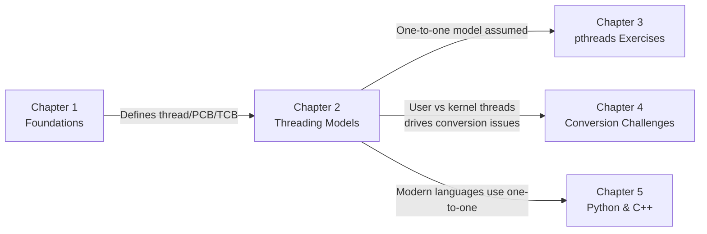
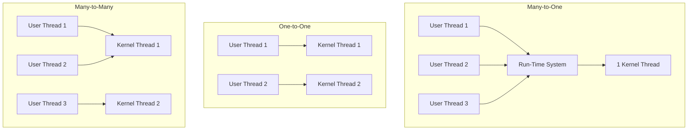

# Chapter 2 — Multi-threading Models and Systems

> **Chapter purpose.** Chapter 1 established what a thread *is*. This chapter examines the **mapping between user-visible threads and kernel-managed execution contexts**. The choice of mapping has profound consequences: it determines whether your program can use multiple cores, whether a single blocking call freezes all threads, and how fast context switches are. We also cover two advanced architectures — **scheduler activations** and **pop-up threads** — that demonstrate how OS designers have tried to combine the best of user-level and kernel-level threading.

---

## What This Chapter Covers

```
Chapter 2: Multi-threading Models and Systems
    - 2.1. Threading Models and Thread Tables
    - 2.2. Scheduler Activations and Upcall Architecture
    - 2.3. Distributed Systems and Pop-Up Thread Design
```

### 2.1. Threading Models and Thread Tables
The three classic models: **many-to-one** (user-level threads), **one-to-one** (kernel-level threads), and **many-to-many** (hybrid). For each, we examine where the thread table lives, what happens on a blocking system call, and whether true parallelism is possible.

### 2.2. Scheduler Activations and Upcall Architecture
A clever design from the 1990s that tried to give user-level libraries the speed of user threads plus the parallelism of kernel threads. The kernel communicates with the user-space scheduler via **upcalls** — kernel-to-user function calls that notify the library of blocking events.

### 2.3. Distributed Systems and Pop-Up Thread Design
A different concern: in high-throughput network servers, the cost of waking up an idle worker thread can dominate latency. **Pop-up threads** are created from scratch for each incoming request, avoiding the cost of restoring a pre-existing thread's state.

---

## How This Chapter Connects to the Rest of the Course



The key insight from Chapter 2 that propagates forward: **Python, C++, Java, and almost all modern languages use the one-to-one model.** Every Python `threading.Thread` and every C++ `std::thread` is backed by a real OS kernel thread. The many-to-one and many-to-many models are mostly of historical interest — but understanding them is essential for understanding the design trade-offs of modern systems.

---

## Three Models at a Glance



| Property | Many-to-One | One-to-One | Many-to-Many |
| :--- | :--- | :--- | :--- |
| Thread table location | User space | Kernel space | Both |
| Blocking system call | Blocks ALL threads | Blocks one thread | Blocks one thread (with scheduler activations) |
| True parallelism | No | Yes | Yes |
| Context switch speed | Fastest (user-space) | Slowest (kernel) | Mixed |
| Implementation complexity | Easy | Medium | Hard |

---

**Next:** Open `2.1. Threading Models and Thread Tables.md`.
