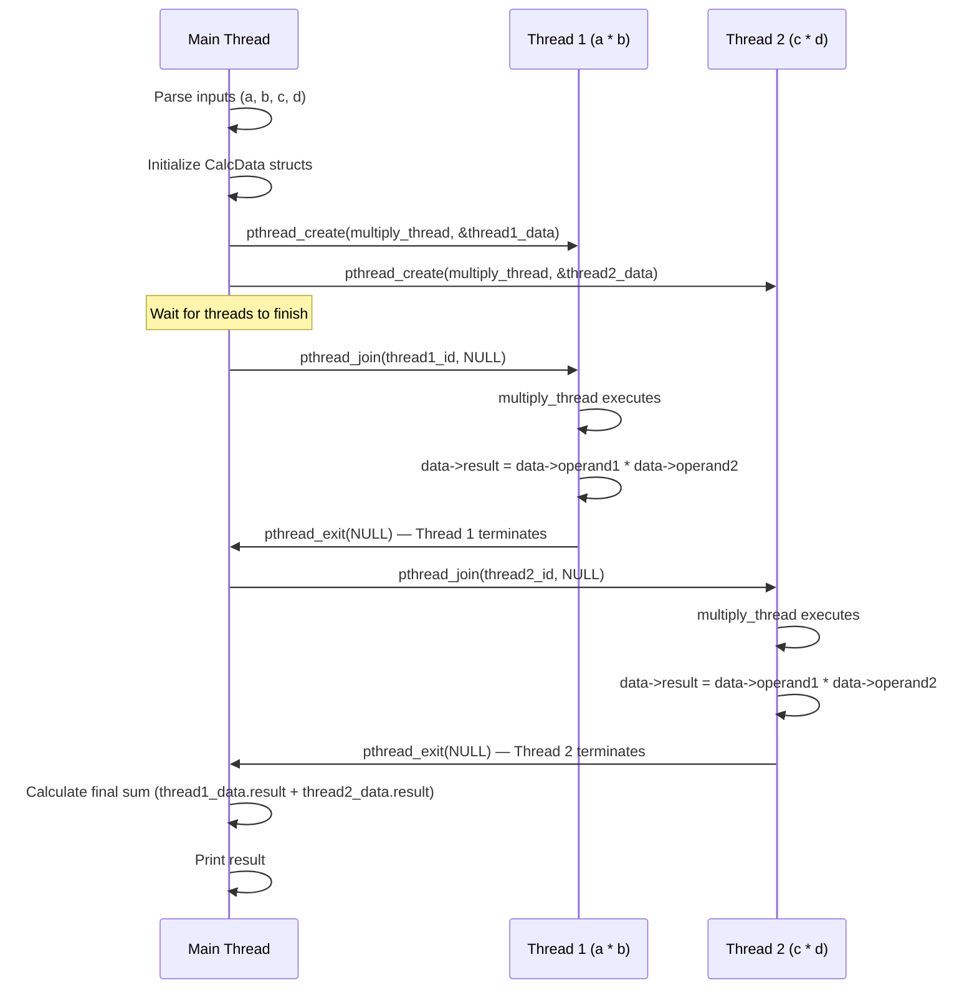
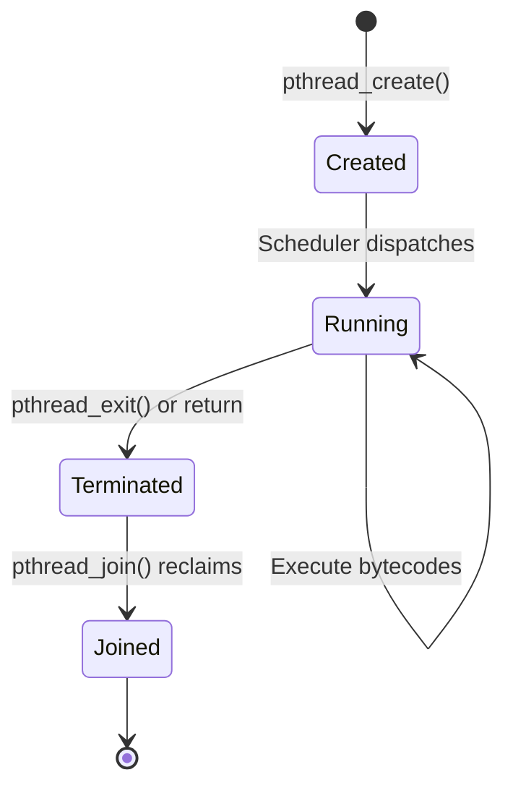
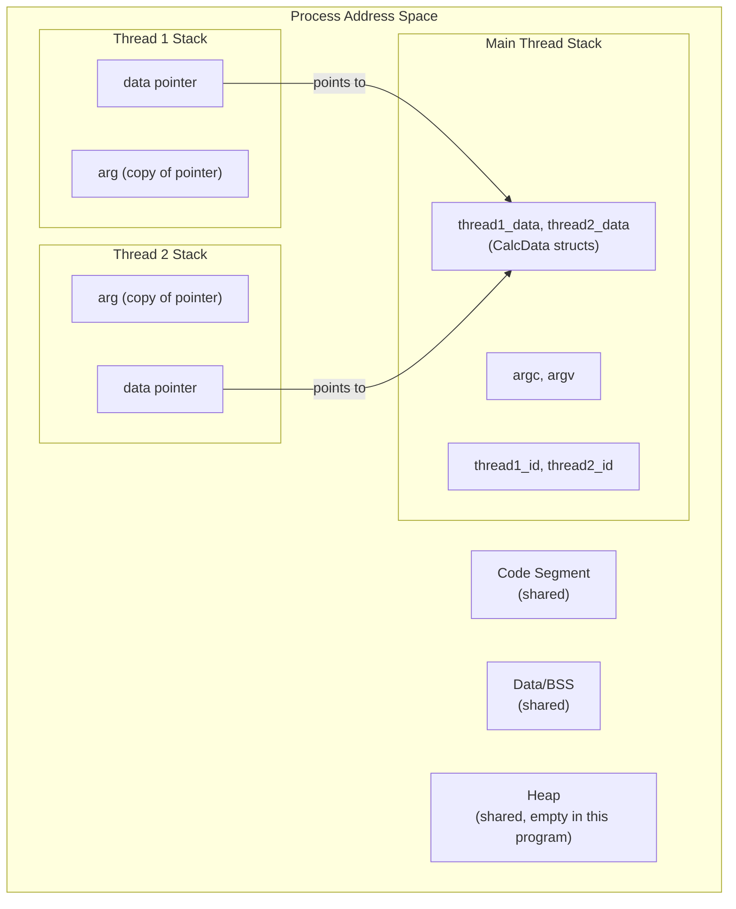

# 3.1. Detailed Solution and Analysis of Thread Exercise 1

> **Why this note exists.** This is the canonical first pthreads exercise: compute `a*b + c*d` in parallel using two threads. The math is trivial; the point is to learn the **mechanics** of pthreads — how to spawn a thread, how to pass arguments, how to wait for completion, how to retrieve results. Every concept here recurs in all subsequent pthreads code. We give a complete solution with exhaustive explanation, then expand on the underlying mechanics.

---

## 1. Problem Definition

Write a multithreaded C program that takes four decimal arguments ($a$, $b$, $c$, $d$) from the command line and computes $a \cdot b + c \cdot d$ using parallel execution:

- **Thread 1** computes the product $p_1 = a \cdot b$.
- **Thread 2** computes the product $p_2 = c \cdot d$.
- The **Main Thread** waits for both threads to complete, reads their results, and prints the final sum.

### 1.1 Why This Exercise Matters

The exercise looks trivial — multiplication and addition are nanosecond operations, so parallelizing them is slower than doing them serially. But the **structure** is what matters:

1. **Argument passing to threads.** pthreads can only accept a single `void*` argument. You must package multiple values into a struct.
2. **Returning results from threads.** The thread can write to shared memory, return a value via `pthread_exit`, or both.
3. **Synchronization with `pthread_join`.** The main thread must wait for both children before reading their results.
4. **Memory management.** Where do you allocate the structs so they survive long enough?

This is the skeleton of every parallel pthreads program. Master this, and you can master much more complex patterns.

---

## 2. Code Implementation (`parallel_calc.c`)

```c
#include <pthread.h>
#include <stdio.h>
#include <stdlib.h>

/* Structure to pass parameters to the calculation threads */
typedef struct {
    double operand1;
    double operand2;
    double result;
} CalcData;

/* Thread function to calculate the product of two numbers */
void* multiply_thread(void* arg) {
    // Cast the argument to the correct structure pointer
    CalcData* data = (CalcData*)arg;

    // Perform multiplication
    data->result = data->operand1 * data->operand2;

    // Terminate thread and return success
    pthread_exit(NULL);
}

int main(int argc, char* argv[]) {
    // Validate command-line arguments
    if (argc != 5) {
        fprintf(stderr, "Error: Invalid number of arguments.\n");
        fprintf(stderr, "Usage: %s <a> <b> <c> <d>\n", argv[0]);
        return EXIT_FAILURE;
    }

    // Allocate structures on the stack for each thread
    CalcData thread1_data;
    CalcData thread2_data;

    // Parse command line inputs into double precision floats
    thread1_data.operand1 = atof(argv[1]);
    thread1_data.operand2 = atof(argv[2]);
    thread2_data.operand1 = atof(argv[3]);
    thread2_data.operand2 = atof(argv[4]);

    // Declare thread identifiers
    pthread_t thread1_id;
    pthread_t thread2_id;

    // Create Thread 1
    int status1 = pthread_create(&thread1_id, NULL, multiply_thread, (void*)&thread1_data);
    if (status1 != 0) {
        perror("Error: Failed to create Thread 1");
        return EXIT_FAILURE;
    }

    // Create Thread 2
    int status2 = pthread_create(&thread2_id, NULL, multiply_thread, (void*)&thread2_data);
    if (status2 != 0) {
        perror("Error: Failed to create Thread 2");
        return EXIT_FAILURE;
    }

    // Wait for Thread 1 to complete
    int join_status1 = pthread_join(thread1_id, NULL);
    if (join_status1 != 0) {
        perror("Error: Failed to join Thread 1");
        return EXIT_FAILURE;
    }

    // Wait for Thread 2 to complete
    int join_status2 = pthread_join(thread2_id, NULL);
    if (join_status2 != 0) {
        perror("Error: Failed to join Thread 2");
        return EXIT_FAILURE;
    }

    // Calculate final result in the main thread
    double total_sum = thread1_data.result + thread2_data.result;

    // Print the final result
    printf("Result of (%lf * %lf) + (%lf * %lf) = %lf\n",
           thread1_data.operand1, thread1_data.operand2,
           thread2_data.operand1, thread2_data.operand2,
           total_sum);

    return EXIT_SUCCESS;
}
```

### 2.1 How to Compile and Run

```bash
# Compile (use -pthread, not -lpthread, for correct preprocessing)
gcc -O2 -Wall -Wextra -pthread -o parallel_calc parallel_calc.c

# Run with four arguments
./parallel_calc 3 4 5 6
# Output: Result of (3.000000 * 4.000000) + (5.000000 * 6.000000) = 42.000000
```

---

## 3. Detailed Step-by-Step Code Walkthrough



### 3.1 Step 1: Input Validation and Struct Allocation

Before spawning any threads, the main thread verifies that the user provided exactly four arguments (`argc == 5`). It parses these arguments into `double` values and writes them to the `CalcData` structures on its stack.

```c
if (argc != 5) { ... }  // Program name + 4 args = argc of 5

CalcData thread1_data;  // On main thread's stack
CalcData thread2_data;  // On main thread's stack

thread1_data.operand1 = atof(argv[1]);  // a
thread1_data.operand2 = atof(argv[2]);  // b
thread2_data.operand1 = atof(argv[3]);  // c
thread2_data.operand2 = atof(argv[4]);  // d
```

#### Why is it safe to pass stack-allocated structs to threads?

The structs `thread1_data` and `thread2_data` live on the main thread's stack. They will remain valid as long as the main thread is alive and hasn't returned from the function that allocated them. Since `main()` calls `pthread_join()` before returning, the structs are guaranteed to exist when the threads access them.

#### What would be unsafe

```c
// DANGEROUS: don't do this
void spawn_thread(double a, double b) {
    CalcData data = {a, b, 0};
    pthread_t t;
    pthread_create(&t, NULL, multiply_thread, &data);
    // data goes out of scope here, but the thread may still be running!
    // The thread will access freed memory.
}
```

If `spawn_thread` returns before the thread finishes, the struct is destroyed and the thread reads garbage. Always `pthread_join` before the allocating function returns, OR allocate on the heap.

### 3.2 Step 2: Thread Creation

The main thread calls `pthread_create()` to spawn Thread 1 and Thread 2.

```c
int pthread_create(
    pthread_t *thread,              // Output: thread ID
    const pthread_attr_t *attr,     // Attributes (NULL = default)
    void *(*start_routine)(void *), // Function to run
    void *arg                       // Argument to pass
);
```

- **`&thread1_id`**: We pass the address of a `pthread_t` variable. `pthread_create` writes the new thread's ID there, so we can refer to it later (e.g., to join).
- **`NULL` for attributes**: Use default attributes (default stack size, default scheduling, joinable state). To customize, you'd create a `pthread_attr_t`, initialize it, set the desired properties, and pass its address.
- **`multiply_thread`**: The function the thread will run. The signature must be `void* function(void* arg)` — pthreads requires this exact signature.
- **`(void*)&thread1_data`**: The single argument. We cast the struct pointer to `void*` because that's what pthreads expects. Inside the thread, we cast it back.

#### Why do we pass `(void*)&thread1_data`?

`pthread_create()` can only accept a single argument of type `void*`. To pass multiple arguments (both operands), we group them in a struct and pass its address. The thread receives this address, casts it back to `CalcData*`, and accesses the fields.

If we had only one argument to pass, we could pass it directly:
```c
pthread_create(&t, NULL, thread_fn, (void*)some_value);
```
But for multiple arguments, the struct pattern is standard.

### 3.3 Step 3: Execution of the Thread Function

Once spawned, the kernel runs `multiply_thread` asynchronously.

```c
void* multiply_thread(void* arg) {
    CalcData* data = (CalcData*)arg;     // Cast back to struct pointer
    data->result = data->operand1 * data->operand2;  // Compute and store
    pthread_exit(NULL);                  // Terminate
}
```

1. The thread casts the `void*` pointer back to a `CalcData*` pointer:
   `CalcData* data = (CalcData*)arg;`
2. It calculates the product and writes the result directly to the struct:
   `data->result = data->operand1 * data->operand2;`
3. It exits via `pthread_exit(NULL);`.

#### Why write to the struct instead of returning a value?

We could have returned the product via `pthread_exit((void*)&product)` — but the product would be a local variable, and its address would be invalid after the thread exits. To return a value via `pthread_exit`, you must allocate it on the heap (see §3.2 of this chapter for the canonical pattern).

In Exercise 1, we avoid this by writing the result directly into the shared struct. The struct lives on the main thread's stack, which is still valid when the main thread reads the result after `pthread_join`.

#### `pthread_exit(NULL)` vs. `return NULL`

These are almost equivalent inside a thread function:

- `return NULL;` — returns from the function. The pthreads library intercepts this and treats it as if `pthread_exit(NULL)` had been called.
- `pthread_exit(NULL);` — explicitly terminates the thread. Can be called from anywhere (including functions called by the thread function).

The difference: `pthread_exit` works from anywhere; `return` only works from the top-level thread function. We use `pthread_exit` for clarity and consistency.

### 3.4 Step 4: Synchronization and Output

The main thread calls `pthread_join()`. This is a **blocking system call**: the main thread yields the CPU and remains in the *Bloqué* state (see §1.2 of Chapter 1) until both threads have terminated. Once they finish, the main thread reads the results directly from the structures and prints the final sum.

```c
pthread_join(thread1_id, NULL);  // Wait for Thread 1
pthread_join(thread2_id, NULL);  // Wait for Thread 2

double total_sum = thread1_data.result + thread2_data.result;
printf(...);
```

#### The second argument of `pthread_join`

```c
int pthread_join(pthread_t thread, void **retval);
```

The second argument is a pointer to a `void*`. If non-NULL, pthreads writes the value passed to `pthread_exit()` (or returned from the thread function) into `*retval`. We pass `NULL` because we're not using the return value — the result was written directly into the shared struct.

In Exercise 2, we'll use this second argument to retrieve a value.

#### Why join in this order (Thread 1 then Thread 2)?

It doesn't matter. `pthread_join` blocks until the specified thread terminates, regardless of which finished first. If Thread 2 finishes first, joining Thread 1 first will still work — Thread 2 just sits in the "zombie" state until we join it.

You can also join in a loop:
```c
pthread_t threads[N];
for (int i = 0; i < N; ++i) pthread_join(threads[i], NULL);
```

---

## 4. The Lifecycle of a Thread in This Program



The key states:
- **Created**: `pthread_create` has been called, but the kernel hasn't dispatched the thread yet.
- **Running**: the thread is on a CPU, executing instructions.
- **Terminated**: the thread has finished, but its TCB and stack haven't been reclaimed yet (it's a "zombie").
- **Joined**: `pthread_join` has been called, and the kernel has reclaimed the thread's resources.

If you don't call `pthread_join` (or `pthread_detach`), the thread stays in the zombie state forever, leaking memory.

---

## 5. Memory Layout During Execution



Both threads' `data` pointers point to the structs on the main thread's stack. This is safe because the main thread is blocked in `pthread_join` while the threads run — its stack frame is stable.

---

## 6. Error Handling — Why We Check Return Values

Every pthreads function returns an error code (0 on success, an error number on failure). Many tutorials skip checking these, but production code must check them all.

### 6.1 `pthread_create` Can Fail

Common failure modes:
- **`EAGAIN`**: Insufficient resources to create another thread (hit `ulimit -u` or system memory limit).
- **`EINVAL`**: Invalid attributes (e.g., requested stack size too small).
- **`EPERM`**: No permission to set the requested scheduling parameters.

If you ignore the return value and the thread wasn't created, your subsequent `pthread_join` will fail or hang.

### 6.2 `pthread_join` Can Fail

- **`ESRCH`**: No thread with that ID (already joined or never existed).
- **`EINVAL`**: The thread is not joinable (was detached).
- **`EDEADLK`**: Trying to join yourself (would deadlock).

### 6.3 The Right Way

```c
int status = pthread_create(&t, NULL, fn, arg);
if (status != 0) {
    fprintf(stderr, "pthread_create failed: %s\n", strerror(status));
    exit(EXIT_FAILURE);
}
```

Note that pthreads functions don't set `errno` — they return the error code directly. Use `strerror(status)` to get a human-readable message.

---

## 7. Possible Variations and Extensions

### 7.1 Using a Single Struct with an Index

Instead of two structs, use one array:

```c
typedef struct {
    double a, b, result;
} CalcData;

CalcData data[2];
data[0].a = atof(argv[1]); data[0].b = atof(argv[2]);
data[1].a = atof(argv[3]); data[1].b = atof(argv[4]);

pthread_t threads[2];
for (int i = 0; i < 2; ++i) {
    pthread_create(&threads[i], NULL, multiply_thread, &data[i]);
}
for (int i = 0; i < 2; ++i) {
    pthread_join(threads[i], NULL);
}
double total = data[0].result + data[1].result;
```

This pattern scales to N threads easily.

### 7.2 Returning the Result via `pthread_exit`

```c
void* multiply_thread(void* arg) {
    CalcData* data = (CalcData*)arg;
    double* result = malloc(sizeof(double));  // MUST be heap
    *result = data->operand1 * data->operand2;
    pthread_exit((void*)result);
}

// In main:
void* ret1;
pthread_join(thread1_id, &ret1);
double p1 = *(double*)ret1;
free(ret1);  // Free the heap memory!
```

This is more general but adds `malloc`/`free` overhead. The struct-based approach in our solution is simpler and faster.

### 7.3 N-Way Parallel Computation

For computing `a1*b1 + a2*b2 + ... + aN*bN` in parallel:

```c
#define N 10
CalcData data[N];
pthread_t threads[N];

for (int i = 0; i < N; ++i) {
    data[i].operand1 = ...;
    data[i].operand2 = ...;
    pthread_create(&threads[i], NULL, multiply_thread, &data[i]);
}

double total = 0;
for (int i = 0; i < N; ++i) {
    pthread_join(threads[i], NULL);
    total += data[i].result;
}
```

This is the foundation of parallel reduction.

---

## 8. Common Pitfalls and Reminders

1. **"I forgot `-pthread` and got a link error."** The pthreads library is not linked by default. Add `-pthread` to your compile command (preferred over `-lpthread`).

2. **"My thread gets garbage values for its arguments."** You passed a pointer to a stack variable that went out of scope before the thread read it. Either `pthread_join` before returning, or allocate on the heap.

3. **"My program hangs at `pthread_join`."** The thread never terminated. Check that `pthread_exit` is reached, or that the thread isn't stuck in an infinite loop or a blocking call.

4. **"I get `EINVAL` from `pthread_join`."** The thread was created with the detached attribute, or you already joined it. Detached threads cannot be joined.

5. **"The result is sometimes wrong."** In this specific exercise, that shouldn't happen — each thread writes to a different struct field, so there's no race. If you modified the program to share a single result variable, you'd need a mutex.

6. **"I see `Segmentation fault` after `pthread_join`."** You probably freed the struct before reading the result, or the thread wrote past the end of the struct.

7. **"Why do I need to cast to `void*` and back?"** Pthreads uses `void*` as a generic pointer type because C (unlike C++ templates) doesn't have type-generic function signatures. The cast is a type-erasure pattern.

8. **"Can I pass multiple arguments without a struct?"** Sort of — you can pack them into a single integer (if they're small) or use thread-local storage. But the struct pattern is the cleanest.

9. **"What happens if the main thread exits before the threads finish?"** The process terminates, killing all threads. Use `pthread_join` to wait. (Or use `pthread_detach` if you don't care.)

10. **"Can I join a thread multiple times?"** No. The second join returns `EINVAL`. After joining, the `pthread_t` is no longer valid.

11. **"What if I pass the same `CalcData` struct to two threads?"** Both threads would access the same memory, causing a data race on the `result` field. Each thread needs its own struct.

12. **"Should I check `argc` before accessing `argv[1]`?"** YES. Always. The check `argc != 5` is essential — without it, `atof(argv[4])` could crash if the user provides fewer arguments.

---

## 9. Theoretical Performance Analysis

This exercise is **slower** than the equivalent single-threaded code:

```c
double result = atof(argv[1]) * atof(argv[2]) + atof(argv[3]) * atof(argv[4]);
```

Why? Because:
- Two thread creations: ~80 µs each = 160 µs
- Two joins: ~10 µs each = 20 µs
- The actual computation: ~5 ns

Total threaded: ~180 µs. Total serial: ~10 ns. The threaded version is 18,000× slower.

This exercise is **pedagogical, not practical**. The goal is to learn the API, not to optimize this specific computation. For real parallelism, you need:
- A workload large enough to amortize thread creation (typically > 1 ms).
- Or a thread pool that reuses threads (see §5.3 of Chapter 5).
- Or a workload with N independent chunks where N matches the core count.

---

## 10. What This Exercise Teaches

After completing this exercise, you should understand:

1. **The basic pthreads API**: `pthread_create`, `pthread_join`, `pthread_exit`.
2. **The struct-passing pattern**: how to package multiple arguments for a thread.
3. **The shared-memory result pattern**: how threads communicate results back to the main thread via shared structs.
4. **The synchronization requirement**: `pthread_join` is the barrier that ensures the main thread sees the threads' writes.
5. **The cost of threading**: thread creation is expensive (~80 µs); use it wisely.
6. **Error handling**: always check return values from pthreads functions.

These concepts are the foundation for Exercise 2 (which adds sequential thread dependencies and heap-allocated return values) and for all the more complex pthreads patterns you'll encounter.

---

> **Next note.** §3.2 covers Exercise 2 — a sequential dependency pattern where Thread 1 populates an array, Thread 2 searches it, and the main thread coordinates. This introduces `pthread_join`'s second argument (for retrieving a thread's return value) and the critical "don't return stack pointers" rule.
