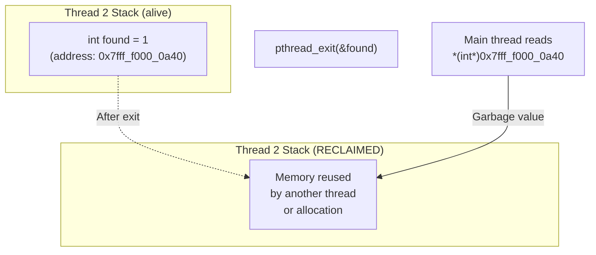
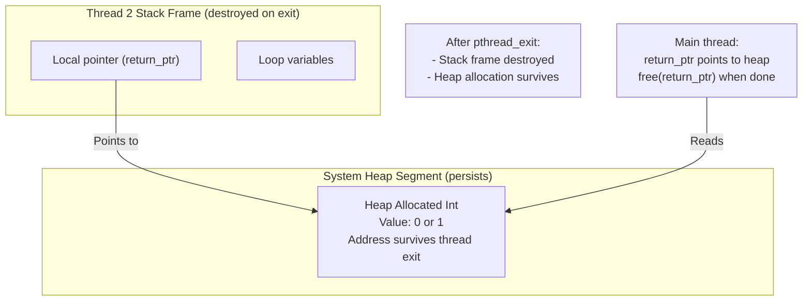
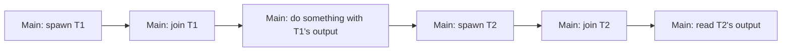

# 3.2. Detailed Solution and Analysis of Thread Exercise 2

> **Why this note exists.** Exercise 1 (§3.1) showed the simplest pattern: independent parallel threads. Exercise 2 introduces two new concepts: (1) **sequential thread dependencies** — Thread 2 cannot start until Thread 1 has finished — and (2) **returning values from threads via `pthread_exit` and `pthread_join`'s second argument**. The second concept comes with a critical trap: you cannot return a pointer to a stack variable, because the stack is destroyed when the thread exits. This note explains the solution in full, with extensive coverage of the dangling-pointer trap and the memory-management responsibilities of the joining thread.

---

## 1. Problem Definition

Create a structure named `TypeTable` with the following fields:
1. An integer array.
2. An integer tracking the number of elements in the array.
3. An integer target value `x`.

Write a multithreaded program that performs these operations sequentially:

- **Step 1:** The Main Thread allocates and initializes the struct.
- **Step 2:** The Main Thread spawns **Thread 1** to populate the integer array with random values between `0` and `99`. The Main Thread waits for this thread to complete.
- **Step 3:** The Main Thread prompts the user to enter a target integer `x`.
- **Step 4:** The Main Thread spawns **Thread 2** to search the array for `x`. Thread 2 returns `1` if the value is found, and `0` otherwise.
- **Step 5:** The Main Thread reads Thread 2's return value and prints whether the search was successful.

### 1.1 Why This Exercise Matters

This exercise introduces several patterns that are essential in real multithreaded programming:

1. **Sequential thread dependencies.** Thread 2 depends on Thread 1's output (the populated array). You can't just spawn both at once.
2. **User interaction between threads.** The main thread prompts the user for input after Thread 1 finishes but before Thread 2 starts.
3. **Returning values from threads.** Thread 2 returns 0 or 1. This requires the `pthread_join(thread, &retval)` pattern.
4. **Heap allocation for return values.** The returned value must outlive the thread, so it must be heap-allocated.
5. **Memory ownership transfer.** The joining thread (main) is responsible for freeing memory allocated by the joined thread.

These patterns appear in every non-trivial multithreaded program. Master them.

---

## 2. Code Implementation (`array_search_thread.c`)

```c
#include <pthread.h>
#include <stdio.h>
#include <stdlib.h>
#include <time.h>

#define MAX_SIZE 1000

/* Structure containing array data and target search value */
typedef struct {
    int array[MAX_SIZE];
    int size;
    int x;
} TypeTable;

/* Thread 1: Populates array with random numbers */
void* fill_array_thread(void* arg) {
    TypeTable* table = (TypeTable*)arg;

    // Seed random number generator with current time
    srand(time(NULL));

    for (int i = 0; i < table->size; i++) {
        table->array[i] = rand() % 100; // Generate values between 0 and 99
    }

    pthread_exit(NULL);
}

/* Thread 2: Searches array for target value x */
void* search_array_thread(void* arg) {
    TypeTable* table = (TypeTable*)arg;

    // Allocate memory on heap to return result
    int* found = malloc(sizeof(int));
    if (found == NULL) {
        perror("Error: Failed to allocate heap memory inside Thread 2");
        pthread_exit(NULL);
    }

    *found = 0; // Initialize as not found

    for (int i = 0; i < table->size; i++) {
        if (table->array[i] == table->x) {
            *found = 1; // Found target
            break;
        }
    }

    // Exit thread and return pointer to result
    pthread_exit((void*)found);
}

int main() {
    TypeTable table;

    // Initialize array size
    table.size = 20; // Search within an array of size 20

    pthread_t thread1;
    pthread_t thread2;

    printf("[Main] Spawning Thread 1 to populate array with random numbers...\n");

    // Spawn Thread 1 to populate the array
    if (pthread_create(&thread1, NULL, fill_array_thread, (void*)&table) != 0) {
        perror("Error: Failed to create Thread 1");
        return EXIT_FAILURE;
    }

    // Wait for Thread 1 to complete before continuing
    pthread_join(thread1, NULL);
    printf("[Main] Thread 1 complete. Array initialized.\n");

    // Print the initialized array
    printf("[Main] Current Array: [ ");
    for (int i = 0; i < table.size; i++) {
        printf("%d ", table.array[i]);
    }
    printf("]\n");

    // Read the search target from the user
    printf("[Main] Enter target integer to search (0-99): ");
    if (scanf("%d", &table.x) != 1) {
        fprintf(stderr, "Error: Invalid integer input.\n");
        return EXIT_FAILURE;
    }

    printf("[Main] Spawning Thread 2 to search for %d...\n", table.x);

    // Spawn Thread 2 to perform search
    if (pthread_create(&thread2, NULL, search_array_thread, (void*)&table) != 0) {
        perror("Error: Failed to create Thread 2");
        return EXIT_FAILURE;
    }

    // Declare pointer to hold Thread 2's return status
    void* return_ptr = NULL;

    // Wait for Thread 2 to complete and read its exit value
    if (pthread_join(thread2, &return_ptr) != 0) {
        perror("Error: Failed to join Thread 2");
        return EXIT_FAILURE;
    }

    // Retrieve value from the returned pointer
    int result = *(int*)return_ptr;

    // Free the heap memory allocated by Thread 2
    free(return_ptr);

    // Display search results
    if (result == 1) {
        printf("[Main] SUCCESS: Value %d was found in the array.\n", table.x);
    } else {
        printf("[Main] FAILURE: Value %d was NOT found in the array.\n", table.x);
    }

    return EXIT_SUCCESS;
}
```

### 2.1 How to Compile and Run

```bash
gcc -O2 -Wall -Wextra -pthread -o array_search_thread array_search_thread.c
./array_search_thread
# Output:
# [Main] Spawning Thread 1 to populate array with random numbers...
# [Main] Thread 1 complete. Array initialized.
# [Main] Current Array: [ 42 17 88 3 91 55 23 76 4 39 60 12 84 27 51 96 8 33 70 19 ]
# [Main] Enter target integer to search (0-99): 42
# [Main] Spawning Thread 2 to search for 42...
# [Main] SUCCESS: Value 42 was found in the array.
```

---

## 3. Detailed Walkthrough

```mermaid
sequenceDiagram
    participant Main as Main Thread
    participant T1 as Thread 1 (fill)
    participant User as User (stdin)
    participant T2 as Thread 2 (search)
    participant Heap as Heap

    Main->>Main: Initialize TypeTable (size=20)
    Main->>T1: pthread_create(fill_array_thread, &table)
    Main->>T1: pthread_join (block)
    T1->>T1: srand(time(NULL))
    T1->>T1: Fill array with rand() % 100
    T1->>Main: pthread_exit(NULL) — Thread 1 done
    Main->>Main: pthread_join returns
    Main->>Main: Print array
    Main->>User: printf("Enter target...")
    User->>Main: scanf("%d", &table.x) (e.g., 42)
    Main->>T2: pthread_create(search_array_thread, &table)
    Main->>T2: pthread_join(thread2, &return_ptr) (block)
    T2->>Heap: malloc(sizeof(int)) — allocate result
    T2->>T2: Search array for table->x
    T2->>T2: *found = 1 (or 0)
    T2->>Main: pthread_exit((void*)found)
    Main->>Main: pthread_join returns; return_ptr = found
    Main->>Main: result = *(int*)return_ptr
    Main->>Heap: free(return_ptr) — clean up!
    Main->>Main: Print SUCCESS or FAILURE
```

### 3.1 Step 1: Struct Initialization

```c
TypeTable table;
table.size = 20;
```

The struct is allocated on the main thread's stack. Its lifetime is the duration of `main()`. The array inside the struct is `int array[MAX_SIZE]` — a fixed-size array of 1000 ints (4 KB). Only the first `table.size` (20) elements will be used.

Note: we **don't** initialize `table.x` here — it will be set later by `scanf`. Reading `table.x` before that would be undefined behavior.

### 3.2 Step 2: Spawn Thread 1 to Fill the Array

```c
pthread_create(&thread1, NULL, fill_array_thread, (void*)&table);
pthread_join(thread1, NULL);
```

Thread 1 receives a pointer to `table`. It fills the first `table.size` elements with random numbers between 0 and 99.

The `pthread_join(thread1, NULL)` blocks the main thread until Thread 1 finishes. The `NULL` second argument means we don't care about Thread 1's return value (it doesn't return one — it calls `pthread_exit(NULL)`).

After `pthread_join` returns, the array is fully populated and safe to read.

### 3.3 Step 3: Print the Array and Prompt the User

```c
printf("[Main] Current Array: [ ");
for (int i = 0; i < table.size; i++) {
    printf("%d ", table.array[i]);
}
printf("]\n");

printf("[Main] Enter target integer to search (0-99): ");
scanf("%d", &table.x);
```

The main thread prints the array (so the user can verify the search), then prompts for the target value. `scanf("%d", &table.x)` reads an integer from stdin and stores it in `table.x`.

Note that `table.x` is a field of the struct that will be passed to Thread 2. By setting it before spawning Thread 2, we ensure Thread 2 sees the correct value. There's no race here — Thread 2 doesn't exist yet.

### 3.4 Step 4: Spawn Thread 2 to Search

```c
pthread_create(&thread2, NULL, search_array_thread, (void*)&table);
```

Thread 2 receives the same `&table` pointer. It searches `table->array` for `table->x`.

### 3.5 Step 5: Retrieve Thread 2's Return Value

```c
void* return_ptr = NULL;
pthread_join(thread2, &return_ptr);
int result = *(int*)return_ptr;
free(return_ptr);
```

The key pattern:
1. Declare a `void* return_ptr = NULL`.
2. Pass `&return_ptr` as the second argument to `pthread_join`. pthreads writes Thread 2's exit value (the pointer passed to `pthread_exit`) into `return_ptr`.
3. Cast `return_ptr` to `int*` and dereference to get the actual integer.
4. **Free the heap memory** that Thread 2 allocated.

This is the canonical way to retrieve a value from a thread in pthreads.

---

## 4. The Dangling Pointer Trap — Why Heap Allocation Is Required

This is the most important lesson of Exercise 2. Let's see what happens if we get it wrong.

### 4.1 The Wrong Way — Returning a Stack Pointer

```c
// DON'T DO THIS
void* search_array_thread(void* arg) {
    TypeTable* table = (TypeTable*)arg;
    int found = 0;  // LOCAL VARIABLE — on this thread's stack

    for (int i = 0; i < table->size; i++) {
        if (table->array[i] == table->x) {
            found = 1;
            break;
        }
    }

    pthread_exit((void*)&found);  // RETURNING A STACK POINTER!
}
```

What happens:
1. The thread declares `int found` on its stack.
2. The thread computes the result (0 or 1) and stores it in `found`.
3. The thread calls `pthread_exit((void*)&found)` — passing the address of the stack variable.
4. **The thread exits. Its stack is reclaimed by the OS.** The memory that held `found` is now free for reuse.
5. The main thread's `pthread_join` retrieves `&found` as the return value.
6. The main thread dereferences `*(int*)return_ptr` — reading memory that may have been reused by another thread or another allocation.



This is a **dangling pointer**. The behavior is undefined — sometimes you get the right value (if the memory hasn't been reused yet), sometimes you get garbage, sometimes the program crashes. The bug is non-deterministic and extremely hard to debug.

### 4.2 The Right Way — Heap Allocation

```c
void* search_array_thread(void* arg) {
    TypeTable* table = (TypeTable*)arg;

    int* found = malloc(sizeof(int));  // ALLOCATE ON HEAP
    if (found == NULL) {
        perror("malloc failed");
        pthread_exit(NULL);
    }

    *found = 0;
    for (int i = 0; i < table->size; i++) {
        if (table->array[i] == table->x) {
            *found = 1;
            break;
        }
    }

    pthread_exit((void*)found);  // RETURN HEAP POINTER — SAFE
}
```

The heap is **not** reclaimed when the thread exits. The `malloc`-ed memory remains valid until explicitly `free`-d. So the main thread can safely read `*found` after `pthread_join`.

### 4.3 The Memory Layout



### 4.4 Who Frees the Memory?

This is a common confusion. The rule is:

**The thread that joins is responsible for freeing memory allocated by the joined thread.**

In our code:
- Thread 2 calls `malloc(sizeof(int))`.
- Thread 2 calls `pthread_exit((void*)found)`, passing the heap pointer to the joining thread.
- The main thread's `pthread_join` retrieves the pointer.
- The main thread calls `free(return_ptr)`.

If the main thread didn't call `free`, the memory would leak — there's no automatic garbage collection in C.

> **Critical reminder.** Every `malloc` must have a matching `free`. When memory is allocated in one thread and the pointer is transferred to another thread via `pthread_exit`/`pthread_join`, the receiving thread owns the responsibility to free it. Document this in your code with comments.

---

## 5. The `pthread_join` Second Argument in Detail

Let's dissect this line:
```c
pthread_join(thread2, &return_ptr);
```

The signature is:
```c
int pthread_join(pthread_t thread, void **retval);
```

The second argument is a **pointer to a `void*`**. pthreads writes the thread's exit value into `*retval`.

### 5.1 What Is the "Exit Value"?

The exit value is whatever was passed to `pthread_exit()`:
```c
pthread_exit((void*)found);   // Exit value is the pointer `found`
```
Or, if the thread function uses `return`:
```c
return (void*)found;   // Same effect — exit value is `found`
```

If the thread was canceled (via `pthread_cancel`), the exit value is `PTHREAD_CANCELED` (a special constant).

### 5.2 What If the Thread Returns NULL?

If the thread calls `pthread_exit(NULL)` or returns `NULL`, the exit value is `NULL`. The `return_ptr` in the main thread will be set to `NULL`. Always check for this:
```c
if (return_ptr == NULL) {
    fprintf(stderr, "Thread returned NULL (failure?)\n");
}
```

In our code, Thread 2 returns `NULL` if `malloc` fails. The main thread should check for this.

### 5.3 What If I Pass NULL for the Second Argument?

```c
pthread_join(thread2, NULL);
```

This means "I don't care about the return value." pthreads still reaps the thread (frees its TCB and stack), but doesn't give you the exit value. This is what we did for Thread 1 in our code.

---

## 6. The Sequential Dependency Pattern

This exercise demonstrates a sequential dependency: Thread 2 needs Thread 1's output. The pattern is:



This is the simplest form of pipeline parallelism. Each stage depends on the previous one. In this exercise, the stages are:
1. Fill the array (Thread 1)
2. Read user input (Main)
3. Search the array (Thread 2)

There's no actual parallelism here — the threads run one at a time, sequentially. The exercise is purely about learning the API.

For real parallelism, you'd want to overlap work. For example: while Thread 2 searches array N, Thread 1 could be filling array N+1. This requires double-buffering and more complex synchronization.

---

## 7. The `srand` Issue — A Subtle Bug

Our code does this:
```c
void* fill_array_thread(void* arg) {
    TypeTable* table = (TypeTable*)arg;
    srand(time(NULL));  // BUG: not thread-safe
    for (int i = 0; i < table->size; i++) {
        table->array[i] = rand() % 100;
    }
    pthread_exit(NULL);
}
```

### 7.1 The Problem

`srand` and `rand` maintain internal state in a global variable. If multiple threads call them simultaneously, you get a data race. Even with only one thread calling them, the `srand(time(NULL))` call is fragile:
- `time(NULL)` returns seconds since the epoch.
- If you call this function twice in the same second, you get the same seed — and the same "random" sequence.

### 7.2 The Fix

Use `rand_r`, the reentrant version of `rand`:
```c
void* fill_array_thread(void* arg) {
    TypeTable* table = (TypeTable*)arg;
    unsigned int seed = time(NULL);  // Each thread has its own seed
    for (int i = 0; i < table->size; i++) {
        table->array[i] = rand_r(&seed) % 100;
    }
    pthread_exit(NULL);
}
```

`rand_r` takes a pointer to a seed (which the function modifies as it generates numbers). The seed is local to the calling thread, so there's no race.

> **Tip.** For real production code, don't use `rand` or `rand_r` — they have poor statistical properties. Use a modern PRNG like `pcg32` or `xoroshiro128+`, or read from `/dev/urandom`.

---

## 8. Variations and Extensions

### 8.1 Using `pthread_exit` with a Struct

You can return any pointer — including a pointer to a struct:

```c
typedef struct {
    int found;
    int index;  // Where in the array
} SearchResult;

void* search_array_thread(void* arg) {
    TypeTable* table = (TypeTable*)arg;
    SearchResult* result = malloc(sizeof(SearchResult));
    result->found = 0;
    result->index = -1;
    for (int i = 0; i < table->size; i++) {
        if (table->array[i] == table->x) {
            result->found = 1;
            result->index = i;
            break;
        }
    }
    pthread_exit((void*)result);
}

// In main:
SearchResult* result;
pthread_join(thread2, (void**)&result);
printf("Found: %d, Index: %d\n", result->found, result->index);
free(result);
```

### 8.2 Parallel Search (Multiple Threads)

For a large array, you could split the search across multiple threads:

```c
#define N_THREADS 4

typedef struct {
    int* array;
    int begin;
    int end;
    int target;
    int found;
} SearchTask;

void* search_chunk(void* arg) {
    SearchTask* task = (SearchTask*)arg;
    task->found = 0;
    for (int i = task->begin; i < task->end; i++) {
        if (task->array[i] == task->target) {
            task->found = 1;
            break;
        }
    }
    pthread_exit(NULL);
}

// In main: split array into N_THREADS chunks, spawn N_THREADS threads,
// join them all, and combine the results.
```

This pattern scales to large arrays on multi-core systems.

### 8.3 Returning the Result via a Shared Variable

Instead of using `pthread_exit`/`pthread_join`'s second argument, you could write the result to a field in the struct:

```c
typedef struct {
    int array[MAX_SIZE];
    int size;
    int x;
    int found;  // Result field
} TypeTable;

void* search_array_thread(void* arg) {
    TypeTable* table = (TypeTable*)arg;
    table->found = 0;
    for (int i = 0; i < table->size; i++) {
        if (table->array[i] == table->x) {
            table->found = 1;
            break;
        }
    }
    pthread_exit(NULL);
}

// In main: after join, just read table.found
```

This is simpler (no `malloc`/`free`) but less general — it requires modifying the struct definition.

---

## 9. Common Pitfalls and Reminders

1. **"My program crashes after `pthread_join`."** You're returning a stack pointer from the thread. Allocate on the heap with `malloc`, return the heap pointer, free it in the joining thread.

2. **"My program leaks memory."** You forgot to `free(return_ptr)` after `pthread_join`. Every `malloc` needs a matching `free`.

3. **"The result is sometimes wrong."** If you modified the code to share a result variable across multiple threads, you have a race condition. Use a mutex or atomic.

4. **"I get the same random numbers every time."** You called `srand(time(NULL))` and ran the program twice within the same second. Use a higher-resolution timer or read from `/dev/urandom` for the seed.

5. **"My `scanf` hangs."** It's waiting for input. Make sure you actually type something and press Enter. If stdin is closed, `scanf` returns EOF (which is not 1, so the check `if (scanf(...) != 1)` catches it).

6. **"I get a warning about casting `void*` to `int*`."** This is normal on systems where `void*` and `int*` have different sizes (rare) or with strict warning flags. Use an intermediate `void*` variable to make the cast explicit.

7. **"My thread function signature is wrong."** It must be `void* function(void* arg)`. No other signature works with `pthread_create`.

8. **"I pass `&return_ptr` but get garbage."** Make sure `return_ptr` is a `void*`, not a `void**`. The pattern is `void* ptr; pthread_join(t, &ptr);`, not `void** ptr;`.

9. **"What if the thread was canceled?"** `pthread_join` writes `PTHREAD_CANCELED` (a special non-NULL value) into `*retval`. Check for this if you use `pthread_cancel`.

10. **"Can I call `pthread_join` from a different thread than the one that called `pthread_create`?"** Yes, any thread can join any other thread (as long as it has the `pthread_t` ID). But each thread can only be joined **once**.

11. **"What happens if I forget to join?"** The thread becomes a zombie — its TCB and stack are not freed. This leaks memory. Either join or detach every thread.

12. **"My code crashes inside the thread function."** Use a debugger (`gdb`). Set a breakpoint at the start of the thread function and step through. Common causes: null pointer dereference, array out of bounds, uninitialized variables.

---

## 10. The Memory Management Responsibility Chain

This is a critical concept that students often miss. Let's make it explicit:

```mermaid
graph LR
    Allocate["Thread 2:<br/>malloc(sizeof(int))"] -->|"Pointer passed via pthread_exit"| Transfer
    Transfer["pthread_exit((void*)found)"] -->|"pthreads stores exit value"| Retrieve
    Retrieve["Main thread:<br/>pthread_join(t, &return_ptr)"] -->|"return_ptr now points to the int"| Use
    Use["Main thread:<br/>result = *(int*)return_ptr"] -->|"Read the value"| Free
    Free["Main thread:<br/>free(return_ptr)"] -->|"Memory reclaimed"| Done["Done"]
```



The chain of responsibility:
1. **Thread 2 allocates** the memory. It owns the memory while it's running.
2. **Thread 2 transfers ownership** to the main thread by passing the pointer to `pthread_exit`.
3. **Main thread takes ownership** by receiving the pointer from `pthread_join`.
4. **Main thread uses** the memory (reads the value).
5. **Main thread frees** the memory.

If any step is skipped, you have a bug:
- Skip step 1: return a stack pointer (dangling pointer).
- Skip step 5: memory leak.

This ownership-transfer pattern is fundamental in C. In C++, it's formalized via `std::unique_ptr` and move semantics. In Rust, it's enforced by the borrow checker.

---

## 11. What This Exercise Teaches

After completing Exercise 2, you should understand:

1. **Sequential thread dependencies**: how to spawn a thread, wait for it, then spawn another that depends on the first one's output.
2. **Returning values from threads**: the `pthread_exit(value)` + `pthread_join(t, &ptr)` pattern.
3. **The dangling-pointer trap**: never return a pointer to a stack variable from a thread.
4. **Heap allocation for return values**: `malloc` in the thread, `free` in the joiner.
5. **Memory ownership transfer**: when you pass a heap pointer from a thread to its joiner, the joiner becomes responsible for freeing it.
6. **Reentrant random number generation**: use `rand_r` instead of `rand` in multithreaded code.
7. **User interaction in multithreaded programs**: the main thread can do I/O while child threads do computation.

These skills are the foundation for everything in subsequent chapters: race conditions (Chapter 4), Python and C++ threading APIs (Chapter 5), and beyond.

---

> **Next chapter.** Chapter 4 covers the **challenges of converting single-threaded code to multithreaded code**: race conditions (with the classic `errno` example), thread-local storage as a solution, non-reentrant functions like `strtok` and `malloc`, signal handling issues, and stack overflow vulnerabilities.
