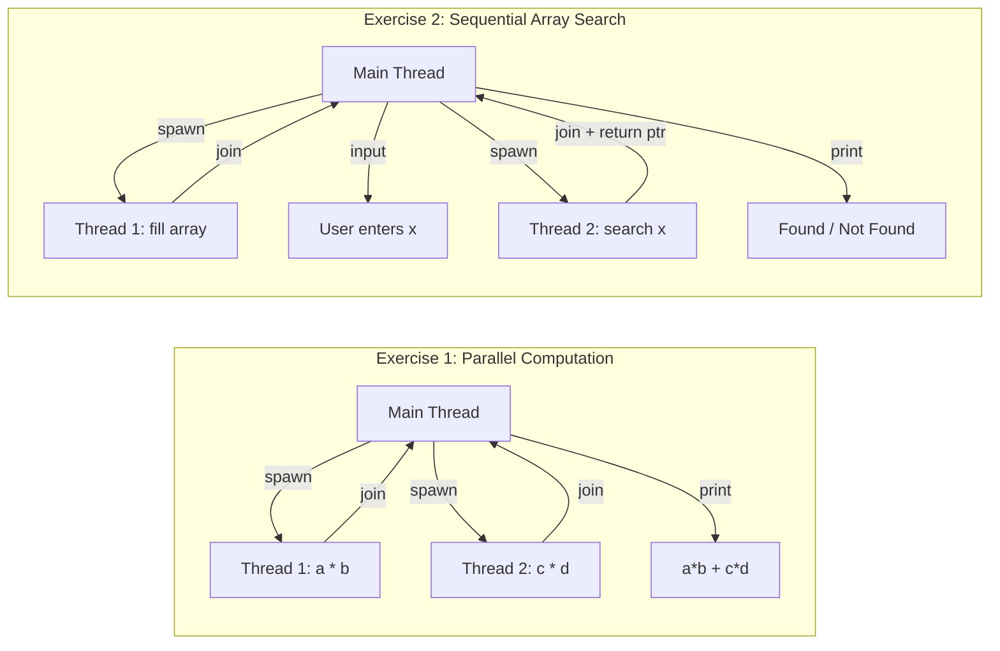

# Chapter 3 — Rigorous Exercise Solutions

> **Chapter purpose.** This chapter takes the theory from Chapters 1 and 2 and puts it into practice with two complete pthreads exercises. Each solution is presented in full, with line-by-line explanations, sequence diagrams, common pitfalls, and extensions. These exercises form the bridge between "understanding threads conceptually" and "being able to write correct multithreaded code."

---

## What This Chapter Covers

```
Chapter 3: Rigorous Exercise Solutions
    - 3.1. Detailed Solution and Analysis of Thread Exercise 1
    - 3.2. Detailed Solution and Analysis of Thread Exercise 2
```

### 3.1. Detailed Solution and Analysis of Thread Exercise 1
A parallel computation of `a*b + c*d` using two threads. Demonstrates the canonical pattern: spawn N threads, pass them arguments via structs, join them, and read their results. This is the simplest non-trivial multithreaded program.

### 3.2. Detailed Solution and Analysis of Thread Exercise 2
A more complex pattern: sequential thread dependencies. Thread 1 populates an array; the main thread waits for it; Thread 2 searches the array; the main thread reads Thread 2's result. Demonstrates `pthread_join` for synchronization, passing return values via heap-allocated memory, and the dangling-pointer trap.

---

## Prerequisites

Before reading this chapter, make sure you understand:
- Process vs. thread (Chapter 1 §1.1)
- Thread states and lifecycle (Chapter 1 §1.2)
- The one-to-one threading model (Chapter 2 §2.1)
- Basic C syntax: structs, pointers, `malloc`/`free`, function pointers

You should also be able to compile a C program with pthreads:
```bash
gcc -o myprogram myprogram.c -lpthread
# or, on most modern systems:
gcc -o myprogram myprogram.c -pthread
```

The `-pthread` flag (versus `-lpthread`) is preferred because it correctly handles both compilation (defines `_REENTRANT`) and linking.

---

## The Two Exercises at a Glance



### Key Differences
- Exercise 1: threads run **in parallel** (independent).
- Exercise 2: threads run **sequentially** (Thread 2 depends on Thread 1's output).
- Exercise 1: threads return values via shared struct fields.
- Exercise 2: Thread 2 returns a value via `pthread_exit((void*)ptr)` and the main thread reads it via `pthread_join`'s second argument.

---

## What You Should Be Able to Do After This Chapter

1. Write a C program that spawns multiple threads, passes them arguments via structs, and collects their results.
2. Use `pthread_create`, `pthread_join`, and `pthread_exit` correctly.
3. Avoid the dangling-pointer trap when returning values from threads.
4. Free heap memory allocated by child threads (responsibility lies with the joiner).
5. Compile and run pthreads programs on Linux.
6. Debug common pthreads errors (missing `-pthread`, passing args by value vs. reference, etc.).

---

**Next:** Open `3.1. Detailed Solution and Analysis of Thread Exercise 1.md`.
