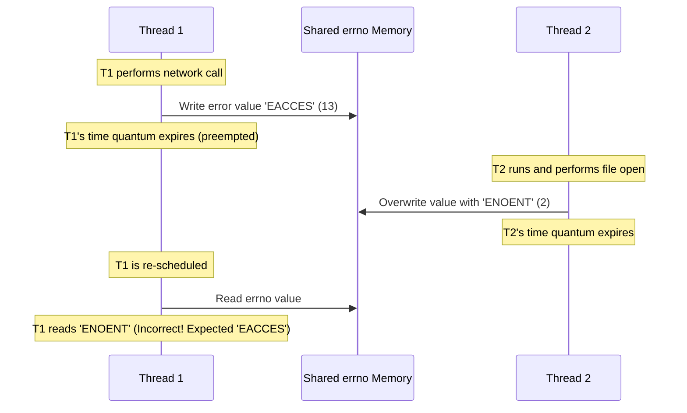
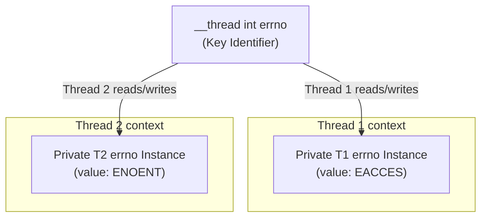

# 4.1. Race Conditions and Thread-Local Storage Mechanics

> **Why this note exists.** Your course slides include a diagram showing two threads overwriting a shared `errno` variable — a textbook race condition. This note explains the race in detail, then introduces **thread-local storage (TLS)** as the canonical fix. We cover the POSIX `pthread_key_t` API (the low-level mechanism), the `__thread` keyword (the GCC/Clang extension), and the C11/C++11 `thread_local` keyword (the modern, portable way). By the end, you'll understand both *why* TLS exists and *how* to use it in every major C dialect.

---

## 1. The Global Variable Race Hazard (Visual Slide Analysis)

### 1.1 What Is `errno`?

`errno` is a global variable used by C system calls and library functions to report error codes. The pattern is:

```c
#include <errno.h>
#include <string.h>

FILE* f = fopen("/nonexistent/file", "r");
if (f == NULL) {
    // errno was set by fopen
    printf("Error: %s (code %d)\n", strerror(errno), errno);
}
```

The function (e.g., `fopen`) returns a value indicating success or failure (NULL for failure). If it failed, it also set `errno` to a code describing the failure (e.g., `ENOENT` for "file not found", `EACCES` for "permission denied").

### 1.2 Why This Works in Single-Threaded Code

In single-threaded programs, this works perfectly:
1. The function fails and sets `errno` to (say) `ENOENT`.
2. The caller reads `errno` immediately.
3. No other code can run between the set and the read (only one thread of control).

### 1.3 Why This Breaks in Multithreaded Code

In multithreaded programs, the pattern is broken. Consider:



What happened:
1. Thread 1 calls a function that fails. It writes `errno = EACCES` (13, "permission denied").
2. The OS preempts Thread 1 before it can read `errno` back.
3. Thread 2 runs and calls a function that also fails. It writes `errno = ENOENT` (2, "no such file").
4. Thread 1 is scheduled again. It reads `errno` and gets `ENOENT` — the wrong error code.
5. Thread 1 now reports "file not found" when the actual error was "permission denied".

This is a **lost update race condition** — exactly the same pattern as the `counter += 1` race in §5.2 of Chapter 5. The shared variable is overwritten between write and read.

### 1.4 Why This Occurs

1. `errno` is a global variable used by system calls to report error codes.
2. In single-threaded programs, this works perfectly.
3. In multithreaded programs, if Thread 1 fails and writes to `errno`, then gets preempted before it can read the value, Thread 2 can run and overwrite `errno`. When Thread 1 resumes, it reads the wrong error code.

### 1.5 The Frequency of This Bug

This isn't a theoretical concern. Before operating systems added thread-safe `errno`, every multithreaded C program had this bug. It manifested as:
- Programs reporting the wrong error message ("Permission denied" when the file didn't exist).
- Programs retrying failed operations incorrectly (because the error code was wrong).
- Programs crashing because of misunderstood error states.

Modern systems have fixed `errno` via TLS (see below), but the same pattern affects any global variable used to communicate state between function calls.

---

## 2. The General Pattern — Lost Updates

The `errno` race is one instance of a general pattern: **lost updates**. The pattern is:

1. Thread A reads a shared variable.
2. Thread A computes a new value based on the read.
3. Thread A writes the new value back.
4. Between steps 1 and 3, Thread B does the same thing — and one of the writes is lost.

This applies to:
- `errno` (the system call writes, the application reads).
- `counter++` (read, add 1, write).
- Lazy initialization (check if pointer is null, allocate, set pointer).
- File position tracking (two threads both reading the same file offset).

The fix is always the same: **synchronize access to the shared variable** (use a mutex, atomic, or thread-local storage).

For `errno` specifically, the right fix is **thread-local storage** — because each thread should see its own error codes, not share them with other threads.

---

## 3. Thread-Local Storage (TLS) Architecture

To resolve conflicts with shared global variables, modern operating systems support **Thread-Local Storage (TLS)**. Each thread is given its own private instance of a global variable.



When Thread 1 writes `errno = EACCES`, it writes to *its own* private instance. When Thread 2 writes `errno = ENOENT`, it writes to *its own* private instance. They never interfere.

### 3.1 How TLS Works Internally

The OS allocates, for each thread, a small region of memory called the **thread control block** (TCB) or **thread-local storage area**. This region holds per-thread instances of TLS variables.

When the compiler sees a `thread_local` variable, it doesn't allocate a single global instance. Instead, it:
1. Allocates a single **TLS key** (an index into the TCB).
2. Emits code that, on each access to the variable, looks up the key in the current thread's TCB.

On x86-64 Linux, the TCB is pointed to by the `FS` segment register. Each thread has its own `FS` base address. Accessing a `thread_local` variable compiles to:

```asm
mov   rax, fs:[offset_of_variable]   ; Read from this thread's TLS
```

This is just a single memory access, very fast (~1 ns).

### 3.2 The Three Ways to Declare TLS in C/C++

#### Option A: GCC/Clang `__thread` keyword (pre-C11)

```c
__thread int errno;  // Each thread has its own errno
```

This is a compiler extension, predating C11. It's still widely supported and is what most production C code uses today. It's simple and fast.

#### Option B: C11 `_Thread_local` keyword

```c
#include <threads.h>
_Thread_local int errno;
```

C11 standardized TLS. `_Thread_local` is the official keyword. The header `<threads.h>` provides the `thread_local` macro that expands to `_Thread_local`:

```c
#include <threads.h>
thread_local int errno;  // Same as _Thread_local
```

#### Option C: C++11 `thread_local` keyword

```cpp
thread_local int errno;  // C++ native TLS
```

C++11 made `thread_local` a first-class keyword (no header needed). It works for any type, including classes with constructors.

#### Option D: POSIX `pthread_key_t` (the low-level way)

Before any of the keywords existed, POSIX provided a low-level API. We cover this in detail in §4 below because it explains the underlying mechanism.

### 3.3 Which Should You Use?

- **Modern C++**: `thread_local` (it's a language feature, works with any type).
- **Modern C (C11+)**: `_Thread_local` or `thread_local` from `<threads.h>`.
- **Older C (pre-C11)**: `__thread` (GCC/Clang extension).
- **Maximum portability**: `pthread_key_t` (works everywhere, but verbose).

In practice, `thread_local` (C++) or `__thread` (C) are what you'll see in real code.

---

## 4. POSIX Thread Implementation (`pthread_key_t`)

The C library implements this using keys. Each thread uses the same key to access a unique, thread-private memory address. This is the lowest-level TLS API and is useful to understand because it shows what `__thread` and `thread_local` are doing under the hood.

### 4.1 The API

```c
#include <pthread.h>

int pthread_key_create(pthread_key_t *key, void (*destructor)(void*));
int pthread_key_delete(pthread_key_t key);
int pthread_setspecific(pthread_key_t key, const void *value);
void* pthread_getspecific(pthread_key_t key);
```

### 4.2 The Pattern

```c
#include <pthread.h>
#include <stdio.h>
#include <stdlib.h>

static pthread_key_t errno_key;

// Destructor: called when a thread exits, to free its TLS value
void errno_destructor(void* data) {
    free(data);
}

// One-time initialization (use pthread_once for thread safety)
void init_errno_key() {
    pthread_key_create(&errno_key, errno_destructor);
}

// Get this thread's errno
int get_errno() {
    int* ptr = pthread_getspecific(errno_key);
    if (ptr == NULL) {
        // First access by this thread: allocate
        ptr = malloc(sizeof(int));
        *ptr = 0;
        pthread_setspecific(errno_key, ptr);
    }
    return *ptr;
}

// Set this thread's errno
void set_errno(int value) {
    int* ptr = pthread_getspecific(errno_key);
    if (ptr == NULL) {
        ptr = malloc(sizeof(int));
        pthread_setspecific(errno_key, ptr);
    }
    *ptr = value;
}
```

### 4.3 How It Works

1. **Key Creation**: `pthread_key_create` allocates a key visible to all threads in the process. The key is just an integer (an index into a per-thread array).
2. **Setting a Thread-Specific Value**: `pthread_setspecific(key, value)` binds a thread-private pointer to the key for the current thread. Internally, the pthreads library stores this pointer in the current thread's TCB at the slot indicated by `key`.
3. **Retrieving a Thread-Specific Value**: `pthread_getspecific(key)` returns the thread-private pointer associated with the key for the current thread. If no value was set, returns NULL.

### 4.4 The Destructor

When a thread exits, the pthreads library calls the destructor function (passed to `pthread_key_create`) for each key that has a non-NULL value in the exiting thread. This is your chance to free per-thread resources:

```c
void errno_destructor(void* data) {
    free(data);  // Free the per-thread errno int
}
```

Without the destructor, the per-thread memory would leak when threads exit.

### 4.5 The Init-Once Problem

`pthread_key_create` should only be called once — if two threads call it simultaneously, you get two keys, which is wrong. Use `pthread_once`:

```c
static pthread_once_t key_once = PTHREAD_ONCE_INIT;

void ensure_key_created() {
    pthread_once(&key_once, []() {
        pthread_key_create(&errno_key, errno_destructor);
    });
}
```

`pthread_once` guarantees that the function is called exactly once, even if multiple threads call `ensure_key_created` simultaneously.

### 4.6 Why This Is Verbose

Compare:

```c
// pthread_key_t approach (20+ lines)
static pthread_key_t key;
static pthread_once_t once = PTHREAD_ONCE_INIT;
void init() { pthread_key_create(&key, destructor); }
int get() {
    pthread_once(&once, init);
    int* p = pthread_getspecific(key);
    if (!p) { p = malloc(sizeof(int)); *p = 0; pthread_setspecific(key, p); }
    return *p;
}
void set(int v) {
    pthread_once(&once, init);
    int* p = pthread_getspecific(key);
    if (!p) { p = malloc(sizeof(int)); pthread_setspecific(key, p); }
    *p = v;
}

// __thread approach (1 line)
__thread int errno;

// thread_local approach (1 line)
thread_local int errno;  // C++
```

The keyword approaches do all the work for you: key creation, initialization, and per-thread storage are handled by the compiler. The `pthread_key_t` API is the underlying mechanism, but you should rarely use it directly.

---

## 5. Modern TLS Usage

### 5.1 C++ `thread_local` — Beyond Plain Types

C++'s `thread_local` works with any type, including classes with constructors and destructors:

```cpp
#include <string>
#include <thread>
#include <iostream>

thread_local std::string thread_name = "anonymous";

void worker(int id) {
    thread_name = "Worker-" + std::to_string(id);
    std::cout << "Inside thread: " << thread_name << "\n";
}

int main() {
    std::thread t1(worker, 1);
    std::thread t2(worker, 2);
    t1.join(); t2.join();
    std::cout << "In main: " << thread_name << "\n";  // "anonymous"
}
```

Each thread has its own `thread_name`. The constructor `std::string("anonymous")` runs once per thread when the thread first accesses the variable. The destructor runs when the thread exits.

### 5.2 Python's `threading.local()`

Python has its own TLS mechanism:

```python
import threading

local_data = threading.local()
local_data.user = "alice"  # Sets in the current thread

# In another thread, local_data.user is NOT set — each thread sees its own.
```

See §5.3 of Chapter 5 for details.

### 5.3 Java's `ThreadLocal`

```java
ThreadLocal<String> threadName = new ThreadLocal<>();
threadName.set("Worker-1");
String name = threadName.get();  // Returns "Worker-1" in this thread, null in others.
```

Java's `ThreadLocal` is a class with `get`/`set` methods. The implementation is conceptually identical to `pthread_key_t`: a per-thread map from `ThreadLocal` instances to values.

### 5.4 Go's Goroutine-Local Storage (and Why It Doesn't Exist)

Famously, Go **does not** have goroutine-local storage. The Go designers decided that TLS is a footgun: it makes code that depends on hidden per-thread state, which is hard to reason about. Instead, Go encourages explicit parameter passing.

This was a controversial decision but has been largely vindicated — Go code is generally easier to reason about than equivalent Java code that uses ThreadLocals heavily.

---

## 6. When to Use TLS (and When Not To)

### 6.1 Good Uses of TLS

- **`errno`**: each thread should see its own error codes.
- **Per-thread caches**: e.g., a per-thread memory allocator cache.
- **Random number generator state**: each thread has its own PRNG state, avoiding races on `rand`.
- **Per-thread database connections**: see §5.3 of Chapter 5.
- **Logging context**: per-thread metadata (request ID, user ID) that should be automatically included in log messages.

### 6.2 Bad Uses of TLS

- **Hidden global state** that makes code hard to test or reason about. If your function's behavior depends on a TLS variable, callers can't see this dependency.
- **Replacing function arguments.** If a function needs a value, pass it as an argument. Don't stash it in TLS to "save typing."
- **Cross-thread communication.** TLS variables are *per-thread* — they cannot be used to share data between threads. (For that, use mutexes, queues, etc.)
- **Long-lived state in a thread pool.** TLS variables persist across tasks in a thread pool (see §5.3 of Chapter 5 for the leak pitfall).

### 6.3 The Hidden Dependency Problem

```cpp
thread_local User* current_user;

void check_permission(Permission p) {
    if (!current_user->has(p)) {
        throw std::runtime_error("denied");
    }
}
```

This code looks clean — `check_permission` takes only a `Permission` argument. But its behavior depends on `current_user`, which is set somewhere else. This makes the code:
- **Hard to test**: you have to set `current_user` before each test.
- **Hard to reason about**: you can't tell from the call site what user is being checked.
- **Easy to misuse**: a developer might call `check_permission` from a thread where `current_user` is null, causing a crash.

The fix: pass the user explicitly:
```cpp
void check_permission(User* user, Permission p) {
    if (!user->has(p)) {
        throw std::runtime_error("denied");
    }
}
```

This is more verbose but clearer. Use TLS only when explicit parameter passing is impractical (e.g., for cross-cutting concerns like logging context that would pollute every function signature).

---

## 7. Common Pitfalls and Reminders

1. **"My TLS variable is showing stale data from a previous request."** You're using a thread pool, and TLS persists across tasks. Reset TLS at the start of each task (see §5.3 of Chapter 5).

2. **"I declared a TLS variable but it seems shared across threads."** You probably forgot the `thread_local`/`__thread` keyword, or you're using a non-reentrant function that wraps a non-TLS global.

3. **"My TLS variable leaks memory."** In C, you need a destructor (with `pthread_key_t`) or manual cleanup. In C++, `thread_local` objects with proper destructors are cleaned up automatically when the thread exits.

4. **"TLS is slow."** It's not — a single memory access (~1 ns). The perceived slowness is usually from the first access, which may require allocation.

5. **"Can I have a `thread_local` pointer?"** Yes, but be careful — the pointer is per-thread, but the pointed-to memory is whatever you point it at. If you point it at shared memory, you have a race.

6. **"What about `static thread_local`?"** This is fine. The variable is per-thread (TLS) and has internal linkage (static). Useful for module-private per-thread state.

7. **"Does TLS work with `fork()`?"** Sort of. After `fork()`, only the calling thread exists in the child. Its TLS variables are preserved. Other threads' TLS values are gone (the threads themselves are gone).

8. **"Is TLS the same as `static`?"** No! `static` means "internal linkage" (file-scope) or "persist across function calls" (function-scope). `thread_local` means "one per thread." They're orthogonal: you can have `static thread_local`, `extern thread_local`, etc.

9. **"Can I initialize a TLS variable with a non-constant expression?"** In C++ yes, the initializer runs the first time each thread accesses the variable. In C11, only constant initializers are allowed.

10. **"Is TLS safe to use in signal handlers?"** No. TLS access is not async-signal-safe (it may involve locking or allocation). Don't access TLS variables inside signal handlers.

---

## 8. Summary — What to Remember

1. **Race conditions** occur when multiple threads access shared state without synchronization. The `errno` example is the canonical illustration.
2. **Thread-local storage (TLS)** gives each thread its own private instance of a global variable, eliminating the race.
3. Modern C uses `__thread` (GCC/Clang) or `_Thread_local` (C11). Modern C++ uses `thread_local`.
4. POSIX provides `pthread_key_t` as the low-level API — useful to understand but rarely used directly.
5. TLS is a per-thread variable, **not** a cross-thread communication mechanism.
6. The main pitfall is **hidden dependencies**: code that depends on TLS variables is harder to reason about than code that takes explicit arguments.
7. In **thread pools**, TLS values persist across tasks — always reset them at the start of each task.

The `errno` race is now solved on every modern system — `errno` is thread-local by default. But the pattern recurs for any global variable used to communicate state. When you see a global variable in multithreaded code, ask yourself: "Should this be thread-local?"

---

> **Next note.** §4.2 covers the broader challenges of converting legacy single-threaded code to multithreaded: non-reentrant functions (`strtok`, `malloc`), signal handling, alarm collisions, and stack overflow vulnerabilities.
