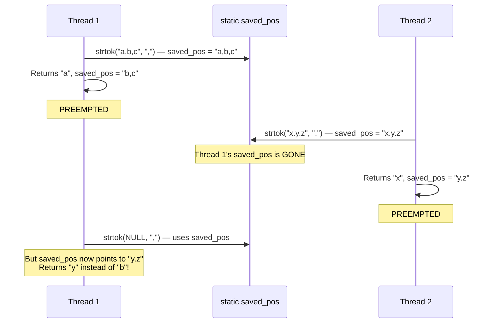
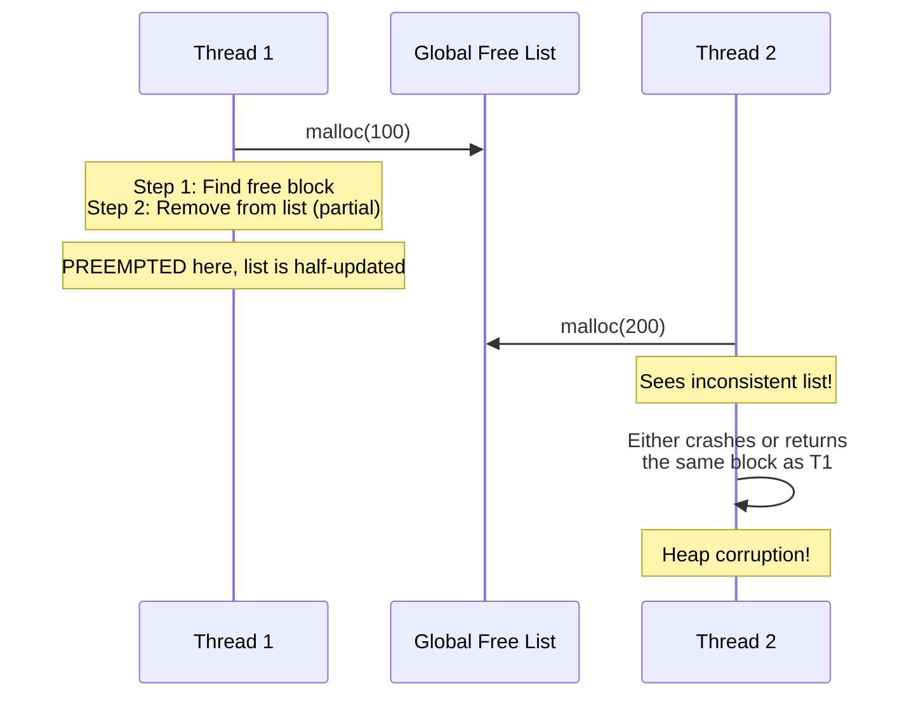
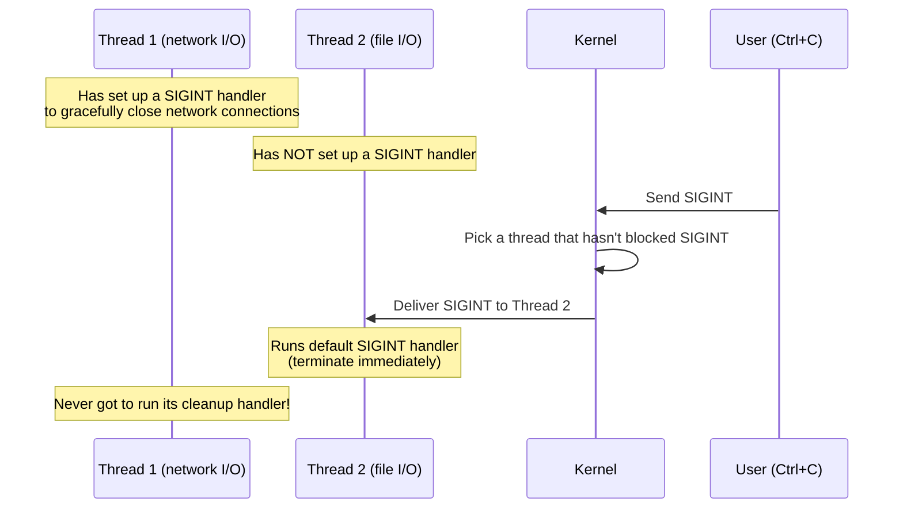
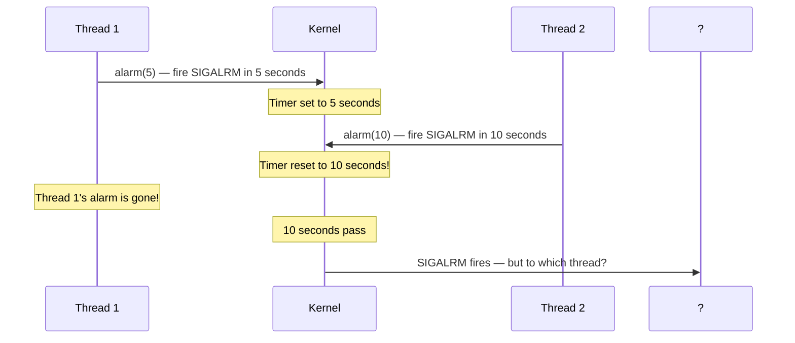
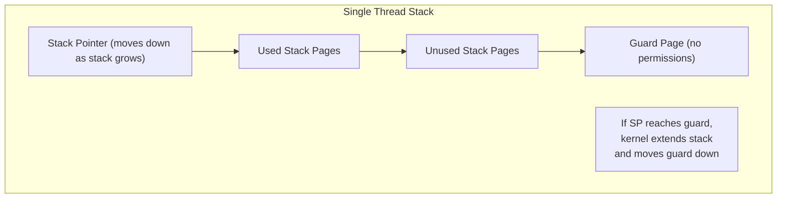
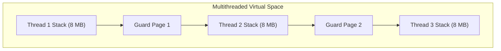
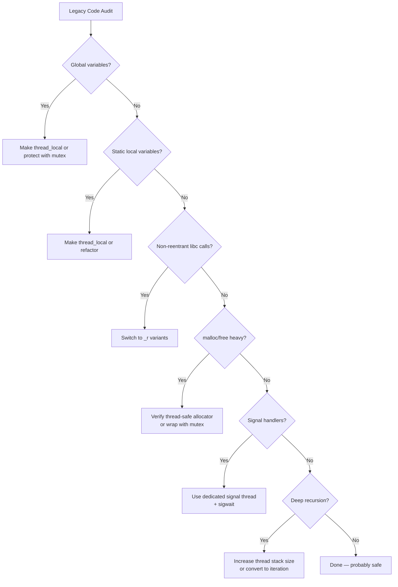

# 4.2. Legacy Code Conversion Challenges

> **Why this note exists.** Most C code written before the mid-1990s was not designed with threading in mind. The C standard library itself was originally single-threaded. When multithreading became mainstream, every library function that used static internal state, global variables, or non-reentrant patterns became a potential bug. This note catalogs the four major categories of legacy-code conversion challenges and explains the standard solutions. These are the bugs you'll encounter when maintaining or porting any old C codebase.

---

## 1. Non-Reentrant Functions

### 1.1 What Is Reentrancy?

A function is **reentrant** if it can be safely interrupted and called again ("re-entered") before its previous execution completes. Reentrancy requires that the function:

1. **Does not use static or global mutable state.** All state must be local (on the stack) or passed as arguments.
2. **Does not call non-reentrant functions.** A reentrant function that calls a non-reentrant one is itself non-reentrant.
3. **Does not modify its own code.** (This is rare but technically a requirement.)

A function that uses static internal buffers, global variables, or hidden state is **not reentrant** — and therefore not thread-safe.

### 1.2 The Canonical Example: `strtok`

The standard string tokenization function `strtok` uses an internal static pointer to track its progress between calls. This is necessary because the function API doesn't include a "state" parameter — the caller just calls `strtok(str, delim)` repeatedly.

```c
#include <string.h>

char* strtok(char* str, const char* delim);
```

The first call passes the string to tokenize. Subsequent calls pass `NULL` to get the next token. The function remembers where it left off — in a static variable.

```c
// Internal implementation (simplified)
static char* saved_pos;

char* strtok(char* str, const char* delim) {
    if (str != NULL) {
        saved_pos = str;
    }
    // Skip leading delimiters
    saved_pos += strspn(saved_pos, delim);
    if (*saved_pos == '\0') return NULL;
    // Find end of token
    char* token_start = saved_pos;
    saved_pos += strcspn(saved_pos, delim);
    if (*saved_pos != '\0') {
        *saved_pos = '\0';
        saved_pos++;
    }
    return token_start;
}
```

### 1.3 The Race Condition

If Thread 1 calls `strtok` and is then interrupted by Thread 2 calling `strtok`, Thread 2 will overwrite the internal static pointer, causing Thread 1 to crash or yield corrupt data when it resumes.



This is the same lost-update pattern as `errno` (§4.1). The shared state is the static pointer; two threads overwrite each other's progress.

### 1.4 The Solution: Reentrant Variants

Use thread-safe, reentrant variants of standard functions. These variants require you to pass your own state tracking variable as an argument:

```c
// Non-reentrant (BAD in multithreaded code)
char* strtok(char* str, const char* delim);

// Reentrant (GOOD in multithreaded code)
char* strtok_r(char* str, const char* delim, char** saveptr);
```

The `_r` suffix stands for "reentrant." The function takes an extra `saveptr` argument — the caller provides the storage, so there's no shared static state.

```c
#include <string.h>
#include <stdio.h>

void worker(char* input) {
    char* saveptr;
    char* token = strtok_r(input, ",", &saveptr);
    while (token != NULL) {
        printf("Token: %s\n", token);
        token = strtok_r(NULL, ",", &saveptr);
    }
}
```

Each thread has its own `saveptr` (on its stack), so there's no race.

### 1.5 Common Non-Reentrant Functions and Their Reentrant Replacements

| Non-Reentrant | Reentrant | Purpose |
| :--- | :--- | :--- |
| `strtok` | `strtok_r` | Tokenize a string |
| `asctime` | `asctime_r` | Convert `struct tm` to string |
| `ctime` | `ctime_r` | Convert `time_t` to string |
| `gmtime` | `gmtime_r` | Convert `time_t` to UTC `struct tm` |
| `localtime` | `localtime_r` | Convert `time_t` to local `struct tm` |
| `gethostbyname` | `gethostbyname_r` | DNS lookup |
| `gethostbyaddr` | `gethostbyaddr_r` | Reverse DNS lookup |
| `getpwnam` | `getpwnam_r` | Password database lookup |
| `getgrnam` | `getgrnam_r` | Group database lookup |
| `rand` | `rand_r` | Random number generation |
| `ttyname` | `ttyname_r` | Get terminal name |

> **Reminder.** On macOS, the `_r` suffix is sometimes replaced with `_s` (for "safe"), and the arguments may differ. Always check the man page for your specific platform.

### 1.6 The Modern Solution: `_REENTRANT` and `_POSIX_C_SOURCE`

If you compile with `-D_POSIX_C_SOURCE=200809L` or `-D_REENTRANT`, some platforms automatically make functions thread-safe (by hiding the non-reentrant versions or making them use TLS internally). But this is platform-dependent and not portable.

The portable solution: **always use the `_r` variants in multithreaded code.**

---

## 2. Non-Reentrant Memory Allocation (`malloc` / `free`)

### 2.1 The Problem

The standard C memory allocator (`malloc`) maintains a global list of free memory blocks. When a thread calls `malloc`, it modifies this list. If a context switch occurs while Thread 1 is updating the free list, the list may be left in an inconsistent state. If Thread 2 then calls `malloc`, it can corrupt heap memory and crash the application.



### 2.2 Why This Was a Big Deal

In the early 1990s, most C libraries had non-thread-safe `malloc`. Converting a multithreaded program meant either:
1. Writing your own thread-safe allocator (hard).
2. Wrapping `malloc` and `free` with a single global mutex (easy, but slow — all threads serialize on every allocation).
3. Using a third-party thread-safe allocator (ptmalloc, jemalloc, tcmalloc).

### 2.3 Modern Systems: Thread-Safe Allocators

Modern glibc (Linux), libc (macOS), and the C runtimes on Windows all have **thread-safe `malloc`**. They achieve this in two ways:

#### Approach 1: Internal Locking
The allocator uses internal mutexes to protect the free list. Each `malloc` call acquires the lock, modifies the list, releases the lock. This is correct but slow under heavy contention.

#### Approach 2: Per-Thread Arenas (Modern)
Modern allocators (glibc's ptmalloc2 since ~2001, jemalloc, tcmalloc) maintain **separate arenas per thread**. Each thread has its own pool of memory, so most allocations don't need to lock. Only when a thread exhausts its arena does it need to acquire a global lock to get more.

This is dramatically faster — `malloc` becomes essentially lock-free in the common case.

### 2.4 The Library Wrapper Pattern (for Old Code)

If you're stuck with a non-thread-safe allocator, you can wrap it with a mutex:

```c
#include <pthread.h>
static pthread_mutex_t malloc_mutex = PTHREAD_MUTEX_INITIALIZER;

void* safe_malloc(size_t size) {
    void* ptr;
    pthread_mutex_lock(&malloc_mutex);
    ptr = malloc(size);                  // Execute non-reentrant call
    pthread_mutex_unlock(&malloc_mutex);
    return ptr;
}

void safe_free(void* ptr) {
    pthread_mutex_lock(&malloc_mutex);
    free(ptr);
    pthread_mutex_unlock(&malloc_mutex);
}
```

This works but serializes all allocations. For programs that allocate heavily (most non-trivial programs), this is a major performance bottleneck.

> **Tip.** The wrapper pattern is also useful for any non-thread-safe library function you can't avoid. Wrap it with a mutex and document that the wrapper exists. Modern code should use thread-safe libraries, but legacy code sometimes forces your hand.

### 2.5 Modern Allocators in Practice

If you're writing high-performance multithreaded C/C++, consider replacing the default allocator with one of:

- **jemalloc** (used by Facebook, Rust default): excellent at reducing fragmentation, per-thread arenas.
- **tcmalloc** (used by Google): very fast for small allocations, per-thread caches.
- **mimalloc** (Microsoft): newer, very fast, low overhead.
- **scudo** (LLVM): security-hardened.

These can give 5-20% speedups on multithreaded workloads, just by replacing `LD_PRELOAD`.

---

## 3. Signals and Alarms in Multithreaded Environments

Unix **signals** were originally designed for single-threaded processes. They're asynchronous notifications sent to a process in response to events: hardware exceptions (SIGSEGV, SIGFPE), terminal interrupts (SIGINT, SIGTSTP), timers (SIGALRM), child process termination (SIGCHLD), and so on.

### 3.1 The Signal Delivery Problem in Multithreaded Programs

In a multithreaded program, signals become problematic because the kernel must decide **which thread** to deliver the signal to. POSIX defines two categories:

#### Synchronous Signals (Per-Thread)
Caused by the executing thread itself. Delivered to the thread that caused them:
- `SIGSEGV` (segmentation fault)
- `SIGFPE` (arithmetic error)
- `SIGBUS` (bus error)
- `SIGILL` (illegal instruction)
- `SIGPIPE` (write to a closed pipe — though this can be considered process-wide)

These are easy to handle: the offending thread receives the signal.

#### Asynchronous Signals (Process-Wide)
Generated externally to the process. The kernel must choose a thread to deliver them to:
- `SIGINT` (Ctrl+C from terminal)
- `SIGTERM` (termination request)
- `SIGKILL` (forced termination — cannot be caught)
- `SIGALRM` (timer expiration)
- `SIGCHLD` (child process exited)
- `SIGHUP` (terminal hangup)

POSIX rules for asynchronous signal delivery:
- The signal is delivered to **any thread that has not blocked it**.
- If all threads have blocked it, the signal is pending until a thread unblocks it.
- The kernel does not deliver to threads that have blocked the signal.

### 3.2 The "Wrong Thread" Problem



The handler in Thread 1 never runs because the kernel picked Thread 2 to receive the signal.

### 3.3 The Solution: Dedicated Signal-Handling Thread

The standard pattern:

1. **Block the signal in all threads** at the start of the program (using `pthread_sigmask`).
2. **Spawn a dedicated signal-handling thread** that calls `sigwait()` to synchronously wait for signals.
3. Other threads never receive the signal (it's blocked) — the signal-handling thread always gets it.

```c
#include <signal.h>
#include <pthread.h>
#include <stdio.h>

void* signal_handler_thread(void* arg) {
    sigset_t* mask = (sigset_t*)arg;
    int signum;
    while (1) {
        if (sigwait(mask, &signum) == 0) {
            printf("Received signal %d\n", signum);
            if (signum == SIGINT) {
                // Handle Ctrl+C gracefully
                cleanup_and_exit();
            }
        }
    }
    return NULL;
}

int main() {
    // Block SIGINT in the main thread (will inherit to children)
    sigset_t mask;
    sigemptyset(&mask);
    sigaddset(&mask, SIGINT);
    pthread_sigmask(SIG_BLOCK, &mask, NULL);

    // Spawn the signal handler thread
    pthread_t sigthread;
    pthread_create(&sigthread, NULL, signal_handler_thread, &mask);

    // Spawn other worker threads (they inherit the blocked SIGINT)
    // ...

    pthread_join(sigthread, NULL);
    return 0;
}
```

This pattern is the **only reliable way** to handle asynchronous signals in a multithreaded program.

### 3.4 The Alarm Collision Problem

Unix supports a single alarm timer per process. If Thread 1 calls `alarm(5)` and Thread 2 immediately calls `alarm(10)`, the second call **overrides the first**. This cancels Thread 1's timer and can break application logic.



The fix is to use **per-thread timers** (POSIX `timer_create` with `SIGEV_THREAD_ID`), which allow each thread to have its own timer that delivers its signal to that specific thread.

```c
#include <signal.h>
#include <time.h>

timer_t create_thread_timer(void (*handler)(union sigval)) {
    timer_t timerid;
    struct sigevent sev;
    sev.sigev_notify = SIGEV_THREAD;  // Notify via function call
    sev.sigev_notify_function = handler;
    sev.sigev_value.sival_ptr = NULL;
    timer_create(CLOCK_MONOTONIC, &sev, &timerid);
    return timerid;
}
```

This avoids the alarm-collision problem entirely.

### 3.5 Async-Signal-Safety

Even if you handle signals correctly, you must be careful about what you do inside a signal handler. POSIX defines a list of **async-signal-safe functions** — functions that are safe to call from a signal handler. The list is small:

- `_exit`, `_Exit`, `abort`, `accept`, `access`, `alarm`, `cfgetispeed`, `cfgetospeed`, `cfsetispeed`, `cfsetospeed`, `chdir`, `chmod`, `chown`, `close`, `creat`, `dup`, `dup2`, `execle`, `execve`, `fchmod`, `fchown`, `fcntl`, `fork`, `fpathconf`, `fstat`, `fsync`, `ftruncate`, `getegid`, `geteuid`, `getgid`, `getgroups`, `getpeername`, `getpgrp`, `getpid`, `getppid`, `getsockname`, `getsockopt`, `getuid`, `kill`, `link`, `listen`, `lseek`, `lstat`, `mkdir`, `mkfifo`, `open`, `pathconf`, `pause`, `pipe`, `raise`, `read`, `readlink`, `recv`, `recvfrom`, `recvmsg`, `rename`, `rmdir`, `select`, `sem_post`, `send`, `sendmsg`, `sendto`, `setgid`, `setpgid`, `setsid`, `setsockopt`, `setuid`, `shutdown`, `sigaction`, `sigaddset`, `sigdelset`, `sigemptyset`, `sigfillset`, `sigismember`, `signal`, `sigpause`, `sigpending`, `sigprocmask`, `sigsuspend`, `sleep`, `socket`, `socketpair`, `stat`, `symlink`, `sysconf`, `tcdrain`, `tcflow`, `tcflush`, `tcgetattr`, `tcgetpgrp`, `tcsendbreak`, `tcsetattr`, `tcsetpgrp`, `time`, `times`, `umask`, `uname`, `unlink`, `utime`, `wait`, `waitpid`, `write`.

**Notable unsafe functions** (do NOT call from signal handlers):
- `printf`, `malloc`, `free`, `fopen`, `fread`, `fwrite` — anything that uses locks or global state.
- Most pthreads functions (only `pthread_sigmask` and a few others are safe).
- `syslog` (uses internal locks).
- Almost any function from a third-party library.

If you need to do non-trivial work in a signal handler, the safe pattern is:
1. In the handler, set a `volatile sig_atomic_t` flag.
2. In the main loop, check the flag and do the real work.

```c
volatile sig_atomic_t got_interrupt = 0;

void sigint_handler(int sig) {
    got_interrupt = 1;  // Safe — single-byte write
}

int main() {
    signal(SIGINT, sigint_handler);
    while (1) {
        if (got_interrupt) {
            printf("Cleaning up...\n");  // Now safe — not in handler
            cleanup();
            break;
        }
        do_work();
    }
}
```

---

## 4. Stack Overflow Vulnerabilities

### 4.1 The Single-Threaded Model: Auto-Growing Stacks

In single-threaded applications, the operating system places a **guard page** at the bottom of the process stack. The layout is:



If the stack grows past its current allocation and hits the guard page, the access triggers a page fault. The kernel's page-fault handler recognizes this as a legitimate stack-growth request (the faulting address is just below the current stack) and **automatically allocates more virtual memory** to grow the stack. The guard page is moved down to maintain the protection.

This means single-threaded programs can use deep recursion or large stack-allocated arrays without configuration — the stack grows on demand.

### 4.2 Why This Fails in Multithreaded Environments

When multiple threads are created, their stacks are allocated **next to each other** in virtual memory (typically within the heap segment, via `mmap`).



Because the stacks are adjacent, the kernel **cannot** automatically grow Thread 1's stack without risk of overwriting Thread 2's stack. The guard page is hit, but the kernel sees that the next page is mapped (to Thread 2's stack) and cannot grow. Instead, it terminates the program with `SIGSEGV`.

As a result, **stack overflows in multithreaded environments cannot be handled automatically** and will instantly crash your program.

### 4.3 The Symptoms

- A multithreaded program works fine on Linux (8 MB default stack) but crashes on macOS (512 KB default for secondary threads) when running the same code.
- A program that uses deep recursion works single-threaded but crashes when the recursive function is called from a thread.
- A program crashes with `SIGSEGV` and the stack trace shows the crash occurred inside a thread function with no obvious null pointers.

### 4.4 The Solutions

#### Solution 1: Use Heap Memory Instead of Stack

The most portable solution: don't put large data on the stack.

```c
// BAD — may overflow thread stack
void worker() {
    int big_array[1000000];  // 4 MB on stack
    // ...
}

// GOOD — use heap
void worker() {
    int* big_array = malloc(sizeof(int) * 1000000);
    if (!big_array) { /* handle */ }
    // ...
    free(big_array);
}
```

#### Solution 2: Set a Larger Stack Size at Thread Creation

```c
#include <pthread.h>

void* worker(void* arg) {
    // Use deep recursion or large stack arrays
    // ...
    return NULL;
}

int main() {
    pthread_attr_t attr;
    pthread_attr_init(&attr);
    pthread_attr_setstacksize(&attr, 32 * 1024 * 1024);  // 32 MB

    pthread_t t;
    pthread_create(&t, &attr, worker, NULL);
    pthread_attr_destroy(&attr);

    pthread_join(t, NULL);
    return 0;
}
```

Note: the stack size must be set **before** `pthread_create` via attributes. You cannot resize a thread's stack after creation.

#### Solution 3: Convert Recursion to Iteration

Deep recursion is the most common cause of stack overflow. Most recursive algorithms can be rewritten iteratively using an explicit stack (on the heap):

```c
// Recursive (stack-based)
void traverse_recursive(Node* n) {
    if (!n) return;
    traverse_recursive(n->left);
    process(n);
    traverse_recursive(n->right);
}

// Iterative (heap-based)
void traverse_iterative(Node* root) {
    std::stack<Node*> stack;  // Heap-allocated
    Node* current = root;
    while (current || !stack.empty()) {
        while (current) {
            stack.push(current);
            current = current->left;
        }
        current = stack.top();
        stack.pop();
        process(current);
        current = current->right;
    }
}
```

The iterative version uses heap memory for the stack, which can grow much larger than the per-thread stack.

#### Solution 4: Use `ulimit -s` for the Main Thread

The main thread's stack size is controlled by `ulimit -s` (Linux) or the linker (macOS). You can change it before running the program:

```bash
ulimit -s 65536  # 64 MB stack
./my_program
```

This only affects the main thread, not secondary threads.

---

## 5. Other Legacy Conversion Challenges

### 5.1 Global Variables and Static State

Any global variable is a potential race condition. Audit your code for:

```c
int counter = 0;          // Global — race condition
static int cache_size;    // File-scope static — race condition
```

For each one, decide:
- Should it be thread-local? (Use `__thread` or `thread_local`.)
- Should it be protected by a mutex? (Use `pthread_mutex_t`.)
- Should it be atomic? (Use C11 `stdatomic.h` or C++ `std::atomic`.)
- Should it be refactored away? (Pass as a parameter instead.)

### 5.2 Function-Local Statics

```c
int* get_singleton() {
    static int instance = 42;  // Initialized once, shared across threads
    return &instance;
}
```

C++11 guarantees thread-safe initialization of function-local statics. C11 does not (without `_Thread_local`). Be careful with this pattern in plain C.

### 5.3 Hidden State in Macros

```c
#define NEXT_BYTE() (buffer[position++])
```

This macro has hidden state (`position`). If two threads call `NEXT_BYTE` simultaneously, they race on `position`. The fix: pass `position` explicitly:

```c
inline int next_byte(int* position) {
    return buffer[(*position)++];
}
```

### 5.4 File Descriptors as Implicit Shared State

File descriptors are per-process, not per-thread. The file offset (for `read`/`write`/`lseek`) is per-fd. If two threads use the same fd, they race on the offset:

```c
// Thread 1 and Thread 2 both call this:
read(fd, buf, 100);
// Each call advances the offset by 100. The threads' reads interleave
// unpredictably.
```

Solutions:
- Use separate file descriptors per thread (open the file multiple times, or `dup` the fd).
- Use `pread`/`pwrite` which take an explicit offset and don't advance the file position.
- Use a mutex around all access to the fd.

### 5.5 Environment Variables

`getenv` and `setenv` operate on a process-wide environment. `setenv` is not thread-safe on most systems (it modifies the global `environ` array). `getenv` is usually safe but may return a stale value if another thread is concurrently setting.

For per-thread configuration, use thread-local storage instead of environment variables.

---

## 6. A Checklist for Converting Legacy Code

When converting a single-threaded C program to multithreaded, audit every file for:



---

## 7. Common Pitfalls and Reminders

1. **"My program crashes when I add threads, but works fine single-threaded."** Audit for: non-reentrant functions, unprotected globals, deep recursion (stack overflow).

2. **"The `_r` variant doesn't exist on my system."** Some platforms (older Windows, embedded systems) don't have all the `_r` functions. You'll need to write your own or use a portability library.

3. **"My signal handler crashes."** You're calling non-async-signal-safe functions (like `printf`). Use only the safe functions, or set a flag and do the work outside the handler.

4. **"I called `alarm()` from two threads and only one fired."** `alarm` is per-process. Use `timer_create` with `SIGEV_THREAD_ID` for per-thread timers.

5. **"My thread crashes with `SIGSEGV` after deep recursion."** Stack overflow. Increase the stack size with `pthread_attr_setstacksize` or use heap-based data.

6. **"My code works on Linux but crashes on macOS."** macOS secondary threads default to 512 KB stack. Set the stack size explicitly.

7. **"My `malloc` is slow in multithreaded code."** Your allocator may not be thread-safe or may use a single global lock. Switch to jemalloc, tcmalloc, or mimalloc.

8. **"I get `EINTR` from system calls randomly."** A signal interrupted the call. Either retry (the standard pattern) or use `sigaction` with `SA_RESTART` to automatically restart.

9. **"My static variable seems shared across threads."** It is. Make it `thread_local` if it should be per-thread.

10. **"My function uses `strtok` and crashes."** Use `strtok_r`. The static state in `strtok` is being corrupted by another thread.

---

## 8. Summary — What to Remember

1. **Non-reentrant functions** use static internal state, which races across threads. Use the `_r` variants (`strtok_r`, `asctime_r`, `rand_r`, etc.).
2. **Non-thread-safe `malloc`** can corrupt the heap. Modern allocators (glibc, jemalloc, tcmalloc) are thread-safe via per-thread arenas. For old allocators, wrap with a mutex.
3. **Signals** are per-process. Use a dedicated signal-handling thread with `sigwait` to handle them reliably. Inside signal handlers, only call async-signal-safe functions.
4. **Alarms** are per-process. Use `timer_create` for per-thread timers.
5. **Stacks in multithreaded programs cannot auto-grow.** Use heap memory for large allocations, or set a larger stack size at thread creation.
6. **Audit legacy code** for: globals, statics, non-reentrant calls, signal handlers, deep recursion. Each is a potential bug.

These problems are why modern languages (Python, C++, Java, Rust, Go) provide thread-safe standard libraries and language features that make many of these bugs impossible. Chapter 5 covers those modern APIs in Python and C++ — they exist largely to solve the problems cataloged in this chapter.

---

## 9. The Bigger Picture

The challenges in this chapter motivated much of the design of modern language runtimes:

- **Python's GIL** (§5.1) is essentially a giant mutex around the entire interpreter — an extreme solution to the "non-reentrant" problem.
- **C++'s `std::mutex` and RAII lock guards** (§5.6) make it easy to wrap non-thread-safe code safely.
- **`thread_local`** in C++ (§4.1 of this chapter, §5.3 of Chapter 5) solves the `errno` problem at the language level.
- **Python's `asyncio`** (§5.4) sidesteps signal and race issues by being single-threaded.
- **Rust's ownership model** prevents data races at compile time — the most ambitious solution to the problems in this chapter.

Understanding these legacy challenges helps you appreciate why modern languages are designed the way they are. The bugs that plagued 1990s C programmers are the bugs that modern language designers worked hardest to prevent.

---

> **Next chapter.** Chapter 5 covers **modern thread management in Python and C++** — the application-level APIs that build on the OS foundation from Chapters 1-4 to provide safe, ergonomic, high-performance concurrency.
