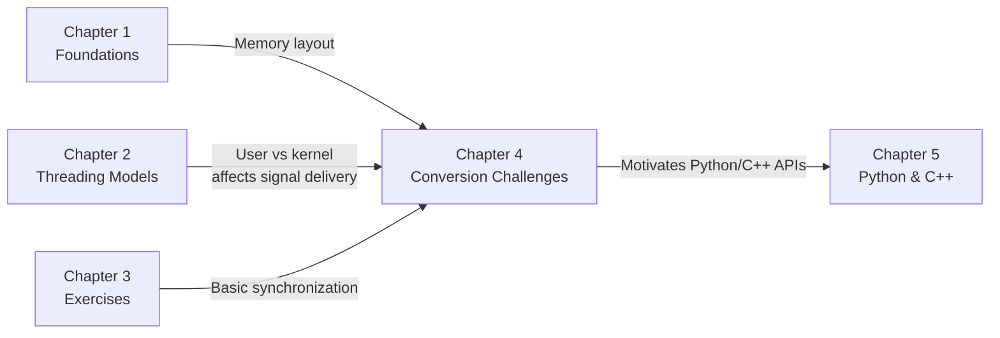
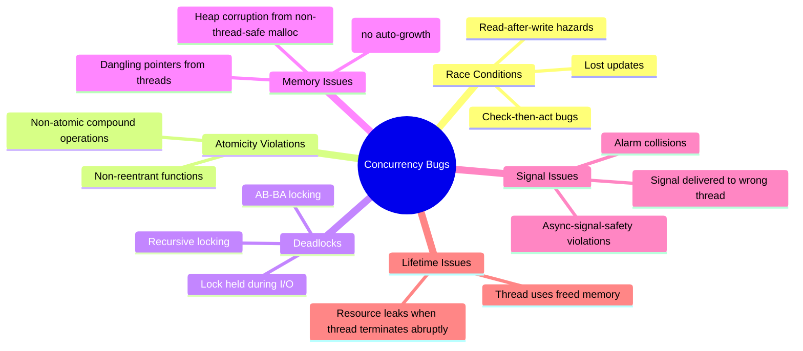

# Chapter 4 — The Challenges of Concurrency Conversion

> **Chapter purpose.** Chapters 1–3 gave you the theory and basic practice of threads. This chapter confronts the **practical challenges** that arise when you try to make existing single-threaded code work in a multithreaded environment. Most C code written before 1995 was not designed with threading in mind — it uses global variables, static buffers, and non-reentrant patterns that break catastrophically when multiple threads run concurrently. Understanding these challenges is essential for working with any legacy codebase.

---

## What This Chapter Covers

```
Chapter 4: The Challenges of Concurrency Conversion
    - 4.1. Race Conditions and Thread-Local Storage Mechanics
    - 4.2. Legacy Code Conversion Challenges
```

### 4.1. Race Conditions and Thread-Local Storage Mechanics
The classic `errno` race condition (from your course slides) — two threads overwrite a shared global variable, causing one to read the wrong value. The fix is **thread-local storage (TLS)**: each thread gets its own private instance of a global variable. We cover the POSIX `pthread_key_t` mechanism and the C11/C++11 `thread_local` keyword.

### 4.2. Legacy Code Conversion Challenges
Four major categories of problems when converting single-threaded code to multithreaded:
1. **Non-reentrant functions** (`strtok`, `asctime`, `gethostbyname`) — use reentrant variants (`strtok_r`, etc.).
2. **Non-reentrant memory allocation** (`malloc`/`free`) — wrap with mutexes or use thread-safe allocators.
3. **Signals and alarms** — signal delivery is per-process, not per-thread; alarms collide.
4. **Stack overflow vulnerabilities** — multithreaded stacks can't grow on demand.

---

## How This Chapter Connects to the Rest of the Course



The problems in this chapter are the **motivation** for the modern APIs in Chapter 5:
- `threading.local()` in Python and `thread_local` in C++ solve the TLS problem (§4.1).
- `std::mutex` and the RAII lock guards in C++ solve the non-reentrant function problem (§4.2).
- `asyncio` in Python sidesteps the signal-handling issues by being single-threaded.
- Thread pools in both languages solve the stack-overflow-due-to-many-threads problem.

---

## The Central Lesson

If you remember one thing from Chapter 4, remember this:

> **Code that works correctly in a single-threaded environment may fail unpredictably in a multithreaded environment. The failure modes are non-deterministic, hard to reproduce, and hard to debug.**

This is why concurrency conversion is hard. It's not that the bugs are conceptually difficult — it's that they only manifest under specific timing conditions that may not occur during testing. The classic advice: **design for concurrency from the start**, rather than retrofitting it later.

---

## A Catalog of Concurrency Bugs

This chapter covers the major categories, but here's the complete catalog at a glance:



§4.1 covers the top-left (race conditions) and §4.2 covers the rest. By the end of the chapter, you should be able to identify and fix each of these bug categories in legacy code.

---

**Next:** Open `4.1. Race Conditions and Thread-Local Storage Mechanics.md`.
