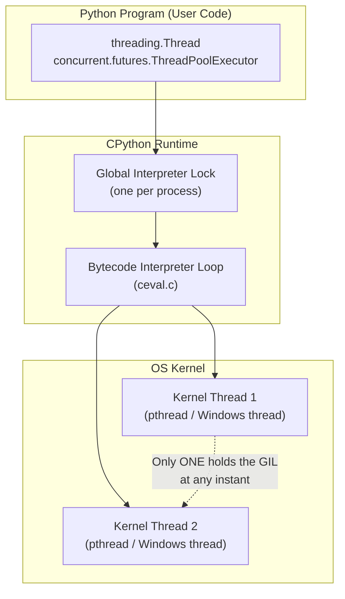
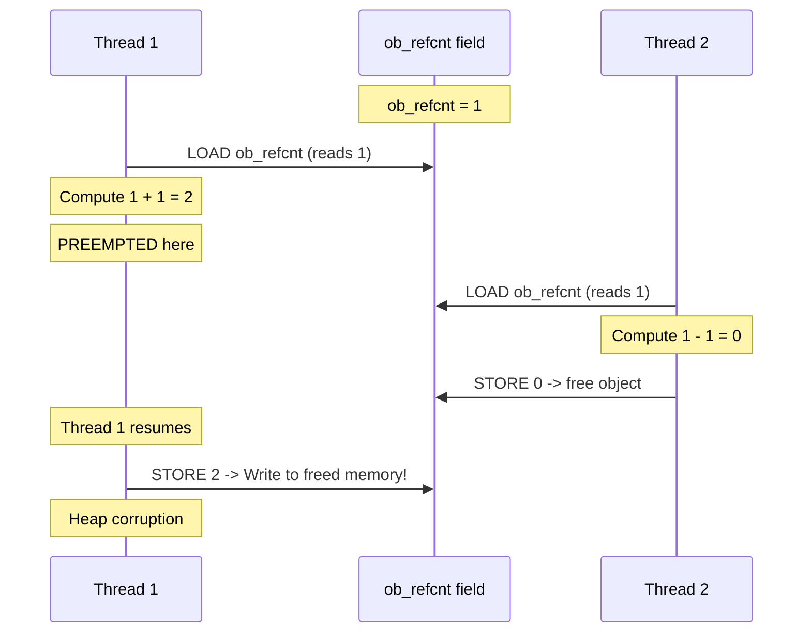
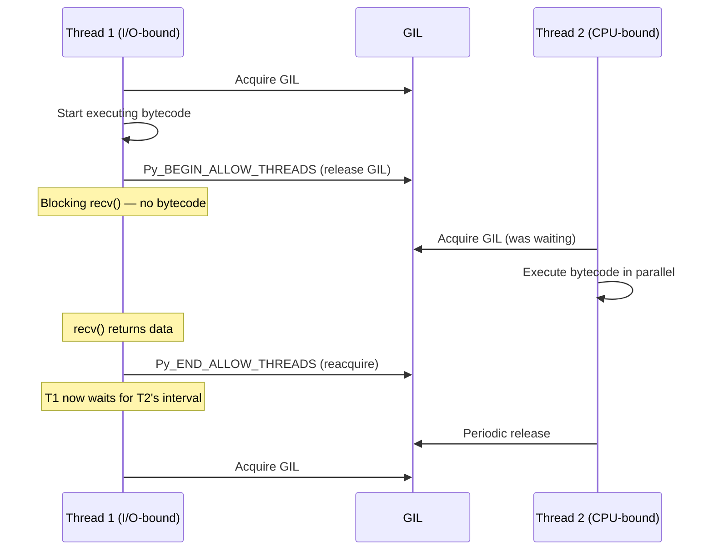
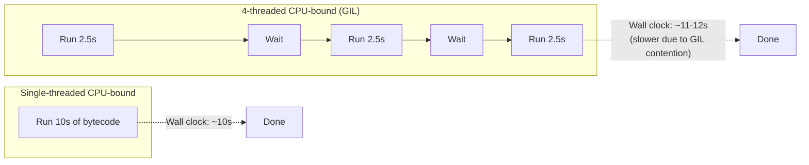
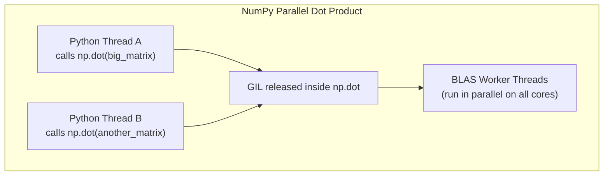
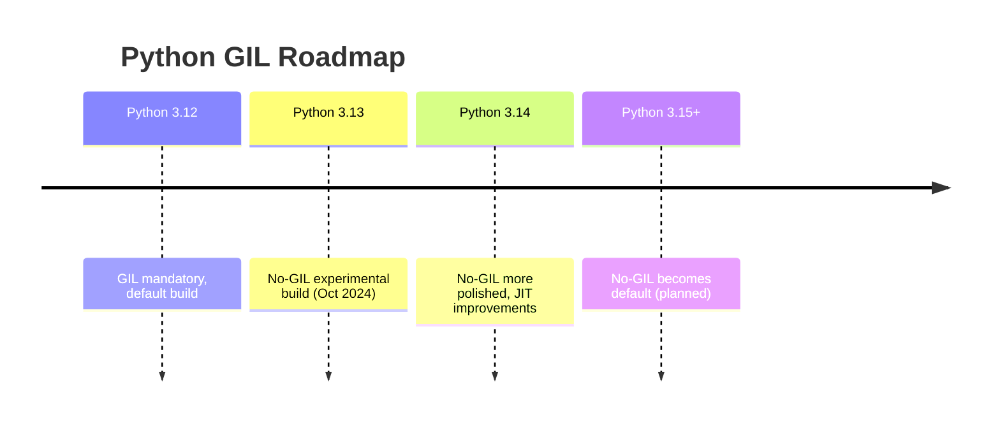

# 5.1. The Python Threading Ecosystem and the Global Interpreter Lock

> **Context within the vault.** Chapters 1–4 covered the OS-level machinery of threads: process vs. thread, kernel vs. user threads, scheduler activations, race conditions, and the legacy conversion problems of single-threaded C code. This chapter now shifts to **application-level thread management** in two of the most widely used languages: **Python** and **C++**. We start with Python because its concurrency model has one of the most discussed (and most misunderstood) mechanisms in all of programming — the **Global Interpreter Lock (GIL)**.

---

## 1. The Three Layers of Python Concurrency

Before we discuss the GIL, you must understand that the word "thread" in Python can refer to three completely different runtime artefacts. Confusing them is the single most common cause of wrong performance intuition in Python concurrency.



### Layer 1 — The `threading.Thread` Object
This is the Python-level abstraction you instantiate in your code. Under the hood, every `threading.Thread` is a thin Python wrapper around an **OS-level kernel thread** (created via `pthread_create` on POSIX or `CreateThread` on Windows). Python uses the **one-to-one threading model** described in §2.1 of your existing notes — every Python thread is a real, scheduled, preemptive kernel thread.

### Layer 2 — The CPython Bytecode Interpreter
The interpreter loop lives in `ceval.c` in the CPython source tree. It is the engine that fetches Python bytecode instructions and executes them one at a time. **The interpreter itself is not thread-safe.** Many internal data structures (the freelist for small ints, the dictionary used for `globals()`, the reference counts on every `PyObject`) assume single-threaded access.

### Layer 3 — The Global Interpreter Lock
The GIL is a single **mutex-like** lock that guards the interpreter loop. **At any given instant, exactly one OS thread is allowed to hold the GIL, and only that thread may execute Python bytecode.** The other kernel threads, even though they are scheduled by the OS and sitting on real CPU cores, are blocked waiting for the GIL.

> **Reminder that students often forget.** The GIL is **not** a language feature of Python. It is an **implementation detail of CPython**. Jython, IronPython, and the experimental no-GIL builds of CPython (PEP 703, merged experimentally in 3.13) do not have a GIL. When someone says "Python can't do parallelism because of the GIL," they mean "CPython can't do CPU-bound parallelism with threads." Always qualify which Python you mean.

---

## 2. Why the GIL Exists — Reference Counting Is Not Thread-Safe

The GIL exists for one fundamental historical reason: **CPython uses reference counting for memory management**, and reference counting is not safe under concurrent mutation.

Every `PyObject` in CPython has a `ob_refcnt` field. When you do `x = some_object` in Python, the interpreter increments `ob_refcnt`. When `x` goes out of scope, it decrements it. When `ob_refcnt` reaches zero, the object is freed immediately.

Consider what happens without the GIL:



This is a textbook **lost update race condition** (the same pattern as §4.1 of your existing notes on `errno`). Without a lock, two threads can simultaneously read the same refcount, both compute new values, and one of the writes wins — corrupting the heap.

CPython's designers chose the simplest fix: **a single global mutex around the entire interpreter.** Every thread that wants to execute Python bytecode must acquire this mutex first. The result is that, although Python threads are real kernel threads, **only one of them is executing bytecode at any instant.**

---

## 3. How the GIL Is Released and Reacquired

A common misconception is that the GIL "blocks all other threads forever until the current one finishes." This is wrong. The GIL is released on two kinds of occasions:

### 3.1 Periodic Release (Every N Bytecodes)
The interpreter loop checks a counter. Every **100 bytecode instructions** by default (the constant is `_Py_CheckInterval`, controlled by `sys.setswitchinterval()` in Python 3.2+), the running thread:

1. Sets a "drop GIL" flag.
2. Signals the OS-level condition variable that other threads are waiting on.
3. Releases the GIL.
4. Waits to reacquire it (which may not happen immediately if another thread was waiting).

The default `sys.setswitchinterval` is **5 milliseconds** (in Python 3.2+). You can tune it: `sys.setswitchinterval(0.001)` makes switching more aggressive (lower latency for other threads, more overhead); `sys.setswitchinterval(0.1)` makes it less aggressive (better throughput for the current thread, worse latency).

### 3.2 Blocking I/O Release
When a Python thread performs a **blocking I/O operation** (file read, network socket recv, `time.sleep()`, etc.), the underlying C function explicitly calls `Py_BEGIN_ALLOW_THREADS` / `Py_END_ALLOW_THREADS` macros. These:

- `Py_BEGIN_ALLOW_THREADS`: saves thread state, **releases the GIL**, then the C code can do whatever blocking work it wants.
- `Py_END_ALLOW_THREADS`: reacquires the GIL, restores thread state, returns to interpreter.

This is why **I/O-bound multithreading works in Python**: while one thread is blocked in `recv()` (GIL released), another thread can run Python bytecode and do useful work.



---

## 4. CPU-Bound vs I/O-Bound: The Performance Cliff

This distinction is the most important practical takeaway of the entire chapter.

### 4.1 I/O-Bound Workload — Multithreading Wins
If your workload spends most of its time in blocking system calls (network requests, disk reads, database queries), then threads give you near-linear speedup up to the number of concurrent I/O operations you can sustain.

```python
# I/O-bound: each thread waits on a network call.
# The GIL is released during the wait, so threads overlap.
import threading, urllib.request

def fetch(url):
    return urllib.request.urlopen(url).read()

urls = ["https://example.com" for _ in range(50)]
threads = [threading.Thread(target=fetch, args=(u,)) for u in urls]
for t in threads: t.start()
for t in threads: t.join()
# Wall-clock time ≈ time for ONE request, not 50.
```

### 4.2 CPU-Bound Workload — Multithreading Is Worse Than Useless
If your workload spends most of its time executing Python bytecode (numerical computation, parsing, image processing in pure Python), the GIL forces all threads to serialize. **Adding threads will not speed up CPU-bound Python code.** Worse, it will often be **slower** than the single-threaded version because:

- Thread context switches have OS-level overhead.
- The GIL handoff involves condition variable wakeups (kernel scheduling decisions).
- Cache locality is destroyed when threads ping-pong between cores.



> **Critical reminder.** If you see a blog post saying "I made my Python script 4x faster with threads on my 4-core CPU," check whether the workload was I/O-bound. If it was CPU-bound, the post is either wrong, using a C extension that releases the GIL (like NumPy), or using `multiprocessing`.

---

## 5. C Extensions That Release the GIL

There is one major escape hatch: **C extensions can release the GIL during their work.** NumPy, for example, does this in its heavy linear algebra routines. When you call `numpy.dot(a, b)` on large arrays, NumPy:

1. Acquires the GIL to enter the C function.
2. Validates inputs.
3. Calls `Py_BEGIN_ALLOW_THREADS` to release the GIL.
4. Calls into BLAS (highly optimized, multi-threaded linear algebra library).
5. BLAS spawns its own OS threads and runs in parallel on all cores.
6. When done, NumPy calls `Py_END_ALLOW_THREADS` to reacquire the GIL.
7. Returns the result to Python.

This is why the rule "threads can't parallelize Python CPU work" has a footnote: **threads CAN parallelize CPU work that happens inside C extensions which release the GIL.** NumPy, SciPy, scikit-learn (parts), Pillow, and many database drivers all do this.



---

## 6. The `threading` Module — API Surface

The `threading` module is the high-level thread API. Below is the canonical surface you must remember.

### 6.1 Creating and Starting a Thread

```python
import threading

def worker(name, iterations):
    for i in range(iterations):
        print(f"[{name}] iteration {i}")

t = threading.Thread(target=worker, args=("A", 3))
t.start()       # Spawns the OS thread, begins running target
t.join()        # Blocks the calling thread until t terminates
print("Done")
```

**Key API details that students often miss:**

- `Thread(target, args, kwargs, daemon=None, name=...)`. The `target` is callable, not a string. `args` must be a tuple — even for a single argument, write `args=(x,)` not `args=(x)`.
- `start()` actually creates the OS thread. If you call `t.run()` directly, **no thread is created** — you are just calling the method in the current thread. This is a classic exam trap.
- `join(timeout=None)` blocks until the thread terminates or the timeout expires. If a timeout is given and the thread is still alive, `join` returns anyway; check `t.is_alive()` to detect this.
- A thread can only be `start()`-ed **once**. To re-run, you must create a new `Thread` object.
- `name=` lets you give the thread a debug-friendly name (visible in `threading.enumerate()` and in debugger stacks). Default name is `Thread-N`.

### 6.2 Inspecting the Runtime

```python
threading.main_thread()       # Returns the main Thread object
threading.current_thread()    # Returns the currently running Thread
threading.enumerate()         # List of all alive Thread objects
threading.active_count()      # Number of alive threads
threading.get_ident()         # OS-level thread identifier (e.g., pthread_t)
```

> **Reminder.** `threading.get_ident()` returns an opaque integer that is unique among currently-alive threads but **may be reused** after a thread terminates. Do not use it as a permanent identifier. For a stable identifier across the process lifetime, use `id(threading.current_thread())` (the Python object id).

### 6.3 The `_thread` Module (Low-Level)
Beneath `threading` sits `_thread` (formerly `thread`). It exposes the bare `start_new_thread(function, args)` function and the `allocate_lock()` primitive. You should almost never use `_thread` directly — it provides no `join`, no exception handling, and no daemon management. It exists primarily because `threading` itself is implemented on top of it.

---

## 7. The GIL and the OS Scheduler — A Subtle Interaction

A particularly nasty failure mode occurs when the GIL hands off between threads but the OS scheduler is not aware of it. Before Python 3.2, the GIL used a **simple `poll()`-based release**: the running thread would check a flag every N ticks, and if another thread wanted the GIL, it would yield. This had a pathology called **the GIL thrash**:

1. Thread A is running on core 0, holding the GIL.
2. Thread B wakes up on core 1 and wants the GIL.
3. B sets the "I want the GIL" flag.
4. A sees the flag on its next tick, releases the GIL, signals B.
5. The OS, however, schedules A again (because B was just woken and is "cold" on core 1's cache).
6. A reacquires the GIL immediately.
7. B sees that the GIL is gone, sets the flag again, waits.
8. Repeat — livelock with constant context switches.

**Python 3.2 fixed this** by switching to a **conditional wait with timeout** model. Now when B wants the GIL, it waits on a condition variable with a timeout equal to `sys.setswitchinterval()`. If A doesn't release the GIL in time, the OS signals A to drop it. This eliminates the thrash.

> **For your notes.** If you ever profile a CPU-bound multithreaded Python program and see 80% CPU utilization but no speedup over the single-threaded version, **this GIL handoff overhead is what you're seeing**, not actual parallel work.

---

## 8. The Future: PEP 703 and the No-GIL Build

In 2023, PEP 703 ("Making the GIL Optional in CPython") was accepted. As of Python 3.13 (October 2024), CPython can be built **without the GIL** as an experimental feature (`--disable-gil` build flag, enabled via `PYTHON_GIL=0` environment variable or `python -X gil=0`).

The no-GIL build works by:

1. Replacing the `ob_refcnt` field with a **biased reference counter** — atomic increments when the object is shared across threads, plain increments when it's thread-local.
2. Adding **true internal locking** to dict, list, and set operations (they become internally thread-safe).
3. Using **thread-safe memory allocators** (mimalloc) to prevent heap races.

PEP 703 is a multi-release migration: 3.13 ships it experimentally, 3.14 makes it more usable, and a future version (likely 3.15+) will make the no-GIL build the default. The GIL will remain available as a fallback for legacy C extensions that cannot tolerate concurrent access.



---

## 9. Mental Model Summary

| Question | Answer |
| :--- | :--- |
| Are Python threads real OS threads? | Yes, kernel threads via `pthread_create` / `CreateThread`. |
| Can two Python threads run bytecode in parallel? | No, on standard CPython. The GIL serializes bytecode execution. |
| Can two Python threads run I/O in parallel? | Yes, because the GIL is released during blocking I/O. |
| Can two Python threads run NumPy/BLAS in parallel? | Yes, because those C extensions release the GIL. |
| Should I use threads for CPU-bound Python work? | No. Use `multiprocessing` or write a C extension. |
| Should I use threads for I/O-bound Python work? | Yes, or use `asyncio` for even better scalability. |

---

## 10. Common Pitfalls and Reminders

1. **"I spawned 8 threads and got slower."** You hit GIL contention on a CPU-bound workload. Switch to `multiprocessing` or rewrite the hot loop in C/NumPy.
2. **"My thread didn't run."** You called `t.run()` instead of `t.start()`. Always use `start()`.
3. **"My program exits before the thread finishes."** Either the thread is a daemon thread (covered in §5.3) or you forgot to call `join()`.
4. **"Random segfaults in a C extension."** The extension is calling Python C API functions without holding the GIL. This is an extension bug, not your code's bug.
5. **"The `args=(value)` syntax threw a weird error."** `args` must be a tuple. `(value)` is just `value`. Use `(value,)`.
6. **"I tuned `sys.setswitchinterval()` and made things worse."** Lower intervals help latency-sensitive I/O workloads but hurt CPU-bound ones due to GIL handoff overhead. Default 5 ms is a reasonable compromise.
7. **"I see only one core busy even though I have 8 threads."** This is correct behavior for CPU-bound CPython. The GIL serializes execution onto one core.

---

> **Next note.** §5.2 builds on this foundation by exploring the **synchronization primitives** Python provides: `Lock`, `RLock`, `Semaphore`, `Event`, `Condition`, `Barrier`, and the thread-safe `queue.Queue`. Even with the GIL, you still need these for any non-trivial coordination between threads, because the GIL only protects single bytecode operations — not multi-step critical sections.
