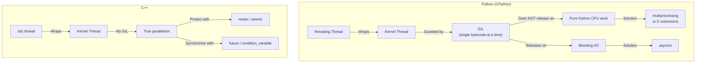
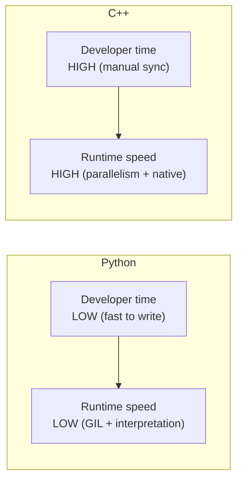
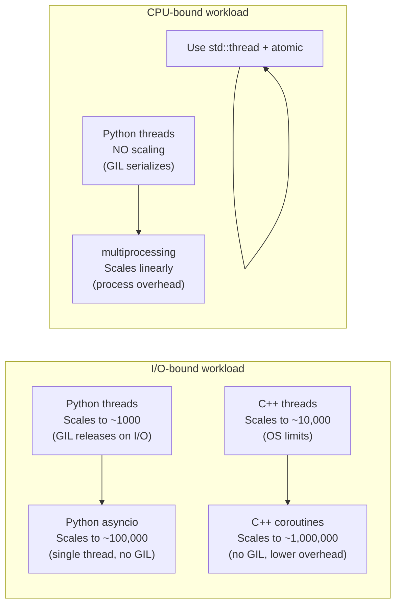
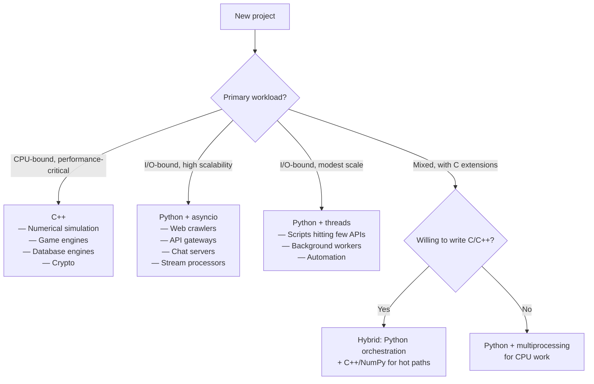
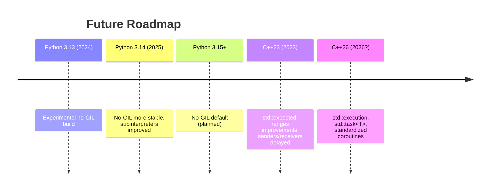

# 5.10. Comparative Analysis: Python vs C++ Thread Management

> **Why this note exists.** The previous nine notes covered Python and C++ threading in depth separately. This final note of Chapter 5 steps back and compares them head-to-head. The goal is to give you a clear mental model of when to use which, what the fundamental differences are, and how to translate ideas between the two languages.

---

## 1. The Big Picture — A Side-by-Side Comparison



| Aspect | Python (CPython) | C++ |
| :--- | :--- | :--- |
| **Threading model** | 1:1 (kernel threads) | 1:1 (kernel threads) |
| **Parallelism** | None for pure Python (GIL) | Full parallelism |
| **Memory cost per thread** | ~8 MB stack + Python interpreter state | ~8 MB stack (default) + minimal state |
| **Creation time** | ~50 µs | ~50 µs |
| **Context switch** | OS-level (~1-10 µs) | OS-level (~1-10 µs) |
| **Synchronization primitives** | Lock, RLock, Semaphore, Event, Condition, Barrier, Queue | mutex, recursive_mutex, timed_mutex, shared_mutex, condition_variable, future, atomic, latch, barrier, semaphore |
| **Atomic operations** | Implicit in single bytecode; explicit via `queue.Queue` | `std::atomic` template, CAS, memory ordering |
| **Async alternative** | `asyncio` (single-threaded event loop) | C++20 coroutines (no standard event loop) |
| **Cancellation** | Cooperative (Event flag); no clean kill | `jthread` + `stop_token` (C++20) |
| **Error handling in threads** | Silent (exceptions lost unless caught) | `std::terminate()` unless using promise/future |
| **Standard library** | Excellent, batteries-included | Excellent, but lower-level |

---

## 2. The Fundamental Architectural Difference

### 2.1 Python's GIL — Protection at the Cost of Parallelism

CPython's GIL is a **safety mechanism**: it makes the interpreter's internal state (reference counts, dict layouts, list structures) safe under concurrent access without requiring fine-grained locking throughout the implementation. The cost: **no two threads can execute Python bytecode simultaneously**, even on different cores.

This is the right trade-off for Python's use case (scripting, glue code, fast development) but bad for CPU-bound parallelism.

### 2.2 C++ — Power at the Cost of Responsibility

C++ has no GIL. Every byte of memory is potentially shared. The developer is **fully responsible** for synchronization. Get it wrong, and you get undefined behavior — races, deadlocks, heap corruption, segfaults.

This is the right trade-off for C++'s use case (systems programming, performance-critical code) but bad for rapid development.

### 2.3 The Cost of Each Choice



Neither is "better" — they optimize for different things.

---

## 3. Equivalent Primitives — A Translation Table

| Concept | Python | C++ | Notes |
| :--- | :--- | :--- | :--- |
| Basic thread | `threading.Thread(t, args)` | `std::thread t(fn, args)` | C++ starts immediately; Python needs `.start()` |
| Wait for thread | `t.join()` | `t.join()` | Same name |
| Thread ID | `threading.get_ident()` | `std::this_thread::get_id()` | Python's is int; C++'s is opaque |
| Sleep | `time.sleep(s)` | `std::this_thread::sleep_for(...)` | |
| Yield | `time.sleep(0)` (asyncio) / not available (threading) | `std::this_thread::yield()` | |
| Hardware concurrency | `os.cpu_count()` | `std::thread::hardware_concurrency()` | |
| Mutex | `threading.Lock()` | `std::mutex` | |
| RAII lock | `with lock:` | `std::lock_guard` / `std::scoped_lock` | |
| Reentrant mutex | `threading.RLock()` | `std::recursive_mutex` | |
| Reader/writer lock | (no built-in) | `std::shared_mutex` + `std::shared_lock` | Python lacks this |
| Semaphore | `threading.Semaphore(n)` | `std::counting_semaphore<n>` | C++20 |
| Event | `threading.Event()` | (no direct equivalent; use `atomic<bool>` + `condition_variable`) | |
| Condition variable | `threading.Condition()` | `std::condition_variable` | |
| Barrier | `threading.Barrier(n)` | `std::barrier` | C++20 |
| Latch | (no built-in; build with Event) | `std::latch` | C++20 |
| Thread-local storage | `threading.local()` | `thread_local` keyword | C++'s is language-level |
| Future | `concurrent.futures.Future` | `std::future` | |
| Promise | (no built-in) | `std::promise` | |
| Async | `concurrent.futures.ThreadPoolExecutor` | `std::async` | Different APIs |
| Thread pool | `ThreadPoolExecutor` | (no standard; use Boost.Asio / TBB) | |
| Queue | `queue.Queue` | (no standard; use moodycamel::ConcurrentQueue) | |
| Atomic | (no equivalent; use Lock) | `std::atomic<T>` | |
| Coroutines | `async`/`await` | `co_await`/`co_yield`/`co_return` | C++ lacks standard library |
| Event loop | `asyncio` | (no standard; use Boost.Asio) | |
| Daemon thread | `t.daemon = True` | (no equivalent; detached threads have no auto-cleanup) | |
| Cancellation | Cooperative (Event flag) | `jthread` + `stop_token` (C++20) | |

---

## 4. Performance Characteristics

### 4.1 Per-Task Overhead

| Operation | Python | C++ |
| :--- | :--- | :--- |
| Create + start a thread | ~80 µs | ~50 µs |
| Create a coroutine | ~5 µs | ~1 µs |
| Mutex lock + unlock (uncontended) | ~200 ns | ~25 ns |
| Atomic increment | N/A (must use lock) | ~5 ns |
| Context switch (OS) | ~5 µs | ~5 µs |
| Async context switch (coroutine) | ~500 ns | ~50 ns |

These are rough numbers; actual values vary by hardware and workload. The pattern is clear: **Python is ~5-10× slower** on these primitive operations due to interpretation overhead.

### 4.2 Scaling Characteristics



### 4.3 Practical Implications

- **Python + 1000 threads**: Possible but wasteful. Use asyncio.
- **Python + 10000 threads**: Will hit OS limits (memory) and be slow.
- **C++ + 1000 threads**: Easy. Each thread costs ~8 MB virtual, but pages are allocated lazily.
- **C++ + 10000 threads**: Possible but you should be using a thread pool.
- **C++ + 100000 concurrent I/O**: Use coroutines (Boost.Asio), not threads.

---

## 5. Developer Ergonomics

### 5.1 Python Wins
- **No memory management.** No dangling pointers, no use-after-free, no leaks (mostly).
- **Batteries-included.** `queue.Queue`, `ThreadPoolExecutor`, `asyncio` all in the standard library.
- **GIL is forgiving.** Most accidental races don't cause corruption (the GIL protects single bytecodes).
- **Easy async syntax.** `async`/`await` since 3.5, with a complete standard library (`asyncio`).
- **Clean cancellation.** `asyncio.Task.cancel()` raises `CancelledError` at the next `await`.

### 5.2 C++ Wins
- **True parallelism.** No GIL. Use all cores.
- **Deterministic performance.** No GC pauses, no interpreter overhead.
- **Fine-grained control.** Memory ordering, lock types, allocator choice — all in your hands.
- **Compile-time safety.** Many threading bugs (e.g., moving a `std::mutex`) are caught at compile time.
- **Zero-cost abstractions.** RAII wrappers compile to the same code as manual locking.

### 5.3 Where C++ Is Harder
- **Memory ownership across threads.** Who owns the shared data? Who's responsible for freeing it? `std::shared_ptr` helps but adds complexity.
- **Memory ordering.** The hardest topic in concurrency. Get it wrong, and you have heisenbugs.
- **No standard thread pool.** Everyone uses a different one (TBB, Boost.Asio, homegrown).
- **No standard async library.** C++20 coroutines exist but no `task<T>` type.
- **Crash-on-failure.** Uncaught exception in a thread → `std::terminate`. Forgotten `join()` → `std::terminate`. Use RAII everywhere.

### 5.4 Where Python Is Harder
- **No true parallelism for CPU work.** Must use `multiprocessing` (inter-process communication is harder than threads).
- **GIL thrash.** CPU-bound multithreading can be slower than single-threaded due to GIL contention.
- **Daemon threads are dangerous.** Killed without cleanup; can leave resources dangling.
- **TLS leaks in thread pools.** Thread-local storage persists across tasks.
- **No fine-grained atomics.** You can't do `counter += 1` atomically without a lock.

---

## 6. When to Choose Which



### 6.1 Choose Python when:
- **Development speed matters more than runtime speed.**
- **The workload is I/O-bound.**
- **You need rapid prototyping and iteration.**
- **The team has more Python than C++ expertise.**
- **You're building on top of async libraries** (FastAPI, aiohttp, asyncpg).

### 6.2 Choose C++ when:
- **Performance is critical** (latency-sensitive trading, games, real-time).
- **You need true parallelism** for CPU-bound work.
- **Memory footprint matters** (embedded systems, mobile).
- **You're building a library** to be used by other languages (via FFI).
- **You need fine-grained control** over memory and synchronization.

### 6.3 Choose Both (Hybrid)
The most powerful pattern in modern systems: **Python for orchestration, C++ for hot paths**.
- NumPy: Python wrapper around C/BLAS.
- PyTorch: Python frontend, C++/CUDA backend.
- TensorFlow: Python API, C++ engine.
- Redis: C core, multiple language clients.

This is the "best of both worlds": fast development with Python's ergonomics, fast execution with C++'s performance.

---

## 7. Translation Patterns

### 7.1 From Python Threading to C++

```python
# Python
import threading
lock = threading.Lock()
counter = 0

def worker():
    global counter
    for _ in range(1000):
        with lock:
            counter += 1

threads = [threading.Thread(target=worker) for _ in range(4)]
for t in threads: t.start()
for t in threads: t.join()
```

```cpp
// C++ — direct translation (using mutex)
#include <thread>
#include <mutex>
#include <vector>

std::mutex m;
int counter = 0;

void worker() {
    for (int i = 0; i < 1000; ++i) {
        std::lock_guard<std::mutex> lock(m);
        ++counter;
    }
}

int main() {
    std::vector<std::thread> threads;
    for (int i = 0; i < 4; ++i)
        threads.emplace_back(worker);
    for (auto& t : threads) t.join();
}
```

```cpp
// C++ — idiomatic (using atomic, much faster)
#include <atomic>
std::atomic<int> counter{0};

void worker() {
    for (int i = 0; i < 1000; ++i) {
        counter.fetch_add(1, std::memory_order_relaxed);
    }
}
```

### 7.2 From Python asyncio to C++ Coroutines

```python
# Python
import asyncio

async def fetch(url):
    await asyncio.sleep(1)
    return f"data from {url}"

async def main():
    results = await asyncio.gather(fetch("a"), fetch("b"), fetch("c"))
    print(results)

asyncio.run(main())
```

```cpp
// C++ (using Boost.Asio for the awaitable machinery)
#include <boost/asio.hpp>
#include <iostream>

using namespace boost::asio;
using awaitable = awaitable<void>;

awaitable fetch(std::string url) {
    co_await async_sleep(1s);
    std::cout << "data from " << url << "\n";
}

awaitable main_coro() {
    co_await compose(fetch("a"), fetch("b"), fetch("c"));
}

int main() {
    io_context ctx;
    co_spawn(ctx, main_coro(), detached);
    ctx.run();
}
```

The C++ version is significantly more verbose because:
1. C++ has no standard `async_sleep` — you use Boost.Asio's `steady_timer`.
2. C++ has no standard `gather` — you build it from `co_await` + composition.
3. C++ requires an explicit `io_context` (event loop).

This is the biggest practical difference: **Python's asyncio is batteries-included; C++ coroutines are a low-level mechanism.**

### 7.3 From Python `multiprocessing` to C++ Threads

```python
# Python — multiprocessing for true parallelism
from multiprocessing import Pool

def square(x): return x * x

if __name__ == "__main__":
    with Pool(4) as p:
        results = p.map(square, range(1000))
```

```cpp
// C++ — std::thread + std::atomic
#include <thread>
#include <vector>
#include <atomic>

long long square_sum(const std::vector<int>& data, size_t begin, size_t end) {
    long long sum = 0;
    for (size_t i = begin; i < end; ++i) {
        sum += (long long)data[i] * data[i];
    }
    return sum;
}

int main() {
    std::vector<int> data(1000);
    for (int i = 0; i < 1000; ++i) data[i] = i;

    int n = std::thread::hardware_concurrency();
    std::vector<std::thread> threads;
    std::vector<long long> partials(n, 0);
    size_t chunk = data.size() / n;
    for (int i = 0; i < n; ++i) {
        size_t begin = i * chunk;
        size_t end = (i == n - 1) ? data.size() : (i + 1) * chunk;
        threads.emplace_back(square_sum, std::ref(data), begin, end, std::ref(partials[i]));
    }
    for (auto& t : threads) t.join();
    long long total = 0;
    for (auto p : partials) total += p;
}
```

In Python, this CPU-bound work would **not** parallelize with threads (GIL). C++ gives you parallelism for free, with the same code structure.

---

## 8. Concurrency Bugs — How They Differ

### 8.1 Race Conditions

**Python:** Rare for single-bytecode operations (GIL protects them). Common for multi-step operations (`counter += 1` is four bytecodes).

**C++:** Common for any unprotected access. Even `++counter` on a plain `int` is a race.

### 8.2 Deadlocks

**Python:** Same patterns as C++ (AB-BA, recursive locking). Diagnosed similarly.

**C++:** More failure modes — you can also deadlock via `std::terminate` (if you forget to join).

### 8.3 Memory Errors

**Python:** Cannot happen (no raw pointers). Worst case: a stale reference to a closed file/socket raises an exception.

**C++:** The dominant source of bugs. Dangling pointers, use-after-free, double-free, iterator invalidation. Tools like AddressSanitizer and ThreadSanitizer are essential.

### 8.4 Memory Ordering Bugs

**Python:** Cannot happen (GIL provides sequential consistency for Python code).

**C++:** A real and dangerous category. x86 hides many of them (it's strongly ordered); ARM/PowerPC exposes them. Always run on weakly-ordered hardware for testing.

### 8.5 Lost Wakeups

**Python:** Possible with `Condition` if you don't use a `while` loop. Same pattern as C++.

**C++:** Same — use the predicate form of `wait()`.

---

## 9. Tooling and Debugging

| Task | Python | C++ |
| :--- | :--- | :--- |
| **Race detection** | Manual (no good tool) | ThreadSanitizer (`-fsanitize=thread`) |
| **Deadlock detection** | Manual | Clang Thread Safety Analysis |
| **Memory errors** | (Cannot happen in Python) | AddressSanitizer, Valgrind |
| **Profiler** | cProfile, py-spy | perf, VTune, gprof |
| **Coroutine debugger** | `asyncio`'s built-in debug mode | (No standard; library-specific) |
| **Concurrent visualization** | `py-spy` flame graphs | `perf record` + FlameGraph |

> **Tip.** Always run C++ code through `-fsanitize=thread,undefined,address` during testing. These sanitizers catch the vast majority of concurrency and memory bugs at the cost of ~3× slowdown. In Python, the best you can do is test thoroughly and use `threading.get_ident()` to log thread IDs.

---

## 10. Best Practices Summary

### 10.1 Python Concurrency Best Practices
1. **For I/O-bound work:** Use `asyncio` if your libraries support it. Otherwise use `ThreadPoolExecutor`.
2. **For CPU-bound work:** Use `multiprocessing` or write a C extension. Threads will not help.
3. **Always use `with` for locks.** Never call `acquire`/`release` manually.
4. **Always use `queue.Queue` for inter-thread data.** Don't manually coordinate with `Condition` unless you have a specific reason.
5. **Always use `try/finally` with `task_done()`.** Otherwise `queue.join()` deadlocks.
6. **Daemon threads only for stateless background tasks.** Never for tasks that touch files/sockets/databases.
7. **Reset `threading.local()` at the start of each task** in a thread pool.
8. **Tune `sys.setswitchinterval` only if you've profiled** and know what you're doing.

### 10.2 C++ Concurrency Best Practices
1. **Default to `std::jthread` (C++20)** or wrap `std::thread` in an RAII class. Never let a `std::thread` go out of scope unjoined.
2. **Always use RAII lock wrappers** (`std::lock_guard`, `std::scoped_lock`, `std::unique_lock`). Never call `lock()`/`unlock()` manually.
3. **Default to `std::scoped_lock` for multi-mutex locking** (deadlock-free).
4. **Use `std::atomic` instead of mutex for simple counters and flags.**
5. **Default to `memory_order_seq_cst`.** Only use weaker orderings after profiling.
6. **Always use the predicate form of `condition_variable::wait()`.**
7. **Propagate exceptions via `std::promise::set_exception()`.** Never let an exception escape a thread function.
8. **Use `std::async(std::launch::async, ...)` for quick parallelism**, but use a thread pool for many tasks.
9. **Test with sanitizers** (`-fsanitize=thread,address,undefined`).
10. **Test on weakly-ordered hardware** (ARM) if you use non-`seq_cst` atomics.

### 10.3 Universal Best Practices
1. **Minimize shared state.** The best synchronization is no synchronization. Use message passing (queues/channels) when possible.
2. **Make critical sections short.** The less time you hold a lock, the less contention.
3. **Don't hold locks across I/O.** Acquire, modify, release — then do I/O.
4. **Profile before optimizing.** Most concurrency "improvements" make things slower.
5. **Test under load.** Concurrency bugs only appear under contention.
6. **Document your locking strategy.** Which mutex protects which data? In what order should locks be acquired?
7. **Prefer high-level abstractions** (thread pools, futures, channels) over raw threads and locks.
8. **Use library concurrency primitives** rather than rolling your own. They've been debugged.

---

## 11. The Future of Both Languages

### 11.1 Python
- **PEP 703 (no-GIL Python):** Will eventually remove the GIL, enabling true parallelism for CPU-bound Python code. Multi-year migration; first experimental in 3.13, likely default in 3.15+.
- **`asyncio` improvements:** Each Python release adds performance and ergonomics improvements (e.g., `TaskGroup` in 3.11, `eager_task_factory` in 3.12).
- **Subinterpreters (PEP 684):** Multiple interpreters per process, each with its own GIL — true parallelism without `multiprocessing` overhead. Available as experimental in 3.12+.

### 11.2 C++
- **C++23 `std::execution` (Senders/Receivers):** A unified model for async computation, replacing `std::async`. May ship in C++26.
- **`std::task<T>`:** Likely standardized in C++26, providing a coroutine-based async task type.
- **Better atomics:** `std::atomic_ref` improvements, possibly hardware-specific atomic operations.
- **`std::execution::scheduler`:** A standard abstraction over execution backends (thread pools, GPUs, etc.).



---

## 12. Final Mental Model

```mermaid
graph TD
    Q[Need concurrency] -->|"Python"| PQ{Workload?}
    PQ -->|"I/O-bound, async libraries available"| PA[asyncio]
    PQ -->|"I/O-bound, blocking libraries"| PT[threading.ThreadPoolExecutor]
    PQ -->|"CPU-bound"| PM[multiprocessing<br/>or NumPy/C extension]
    
    Q -->|"C++"| CQ{Need abstraction?}
    CQ -->|"Yes, simple parallelism"| CA[std::async<br/>or jthread + future]
    CQ -->|"Yes, many tasks"| CTP[Thread pool<br/>(Boost.Asio / TBB)]
    CQ -->|"Yes, scalable I/O"| CC[Coroutines<br/>(Boost.Asio awaitable)]
    CQ -->|"No, raw control"| CRT[std::thread<br/>+ std::mutex<br/>+ std::atomic]
```

**In one sentence each:**

- **Python** is the right choice when development speed and ecosystem matter more than peak performance, and when your workload is I/O-bound or can be offloaded to C extensions.
- **C++** is the right choice when you need maximum performance, true parallelism, fine-grained control, and you're willing to pay the cost in development complexity.

Both languages have mature, well-designed concurrency systems. The skills you learn in one transfer to the other — the underlying OS concepts (threads, mutexes, condition variables, atomics, futures) are the same. The differences are in ergonomics, safety guarantees, and performance characteristics.

---

## 13. Chapter 5 Summary — What You Should Now Know

After studying all ten notes of Chapter 5, you should be able to:

1. **Explain the GIL** — what it is, why it exists, when it's released, and what it means for CPU- vs I/O-bound workloads.
2. **Choose the right Python primitive** — Lock, RLock, Semaphore, Event, Condition, Barrier, Queue — for any given synchronization need.
3. **Use `ThreadPoolExecutor`** correctly — `submit` vs `map`, `Future` objects, `as_completed`.
4. **Use `threading.local()`** safely, including the thread-pool leak pitfall.
5. **Know when to use `asyncio`** vs threading — and how to mix them via `run_in_executor`.
6. **Create and manage `std::thread`** correctly, including the `join()`/`detach()` rule and RAII wrappers.
7. **Use the C++ mutex family** with RAII lock guards, including `scoped_lock` for multi-mutex deadlock-free locking.
8. **Use `condition_variable`** with the predicate form, and `future`/`promise`/`async` for one-shot results.
9. **Use `std::atomic`** with appropriate memory orderings, and understand CAS for lock-free programming.
10. **Use C++20's modern additions** — `jthread`, coroutines, `latch`, `barrier`, `counting_semaphore`.
11. **Compare Python and C++** on performance, ergonomics, and use cases, and translate code between them.

This chapter builds directly on Chapters 1–4: the OS-level concepts (process vs thread, kernel vs user threads, race conditions) are the foundation; what we've added here is the application-level API surface in two real languages. Future chapters can build on this for specific application domains (web servers, game engines, scientific computing, etc.).

---

> **End of Chapter 5.** You now have a complete, rigorous, working understanding of modern thread management in Python and C++. The notes are designed to be self-contained — you should not need to look anything up to apply them in practice.
