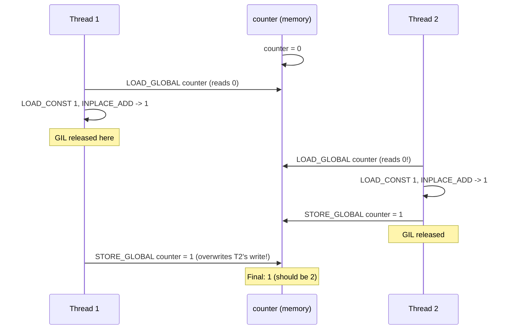
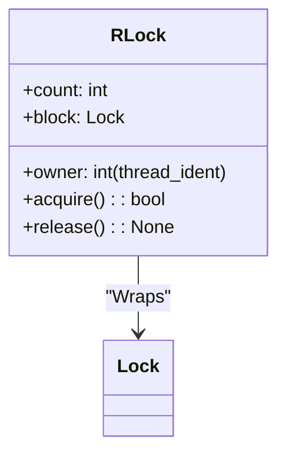
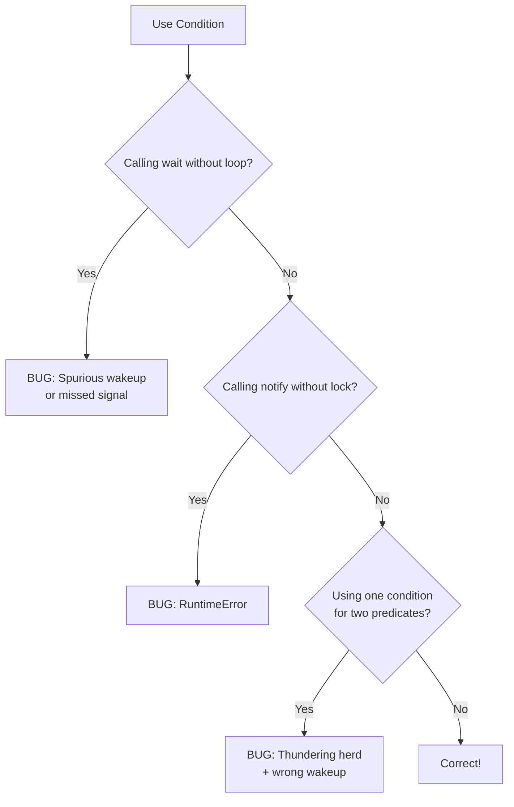
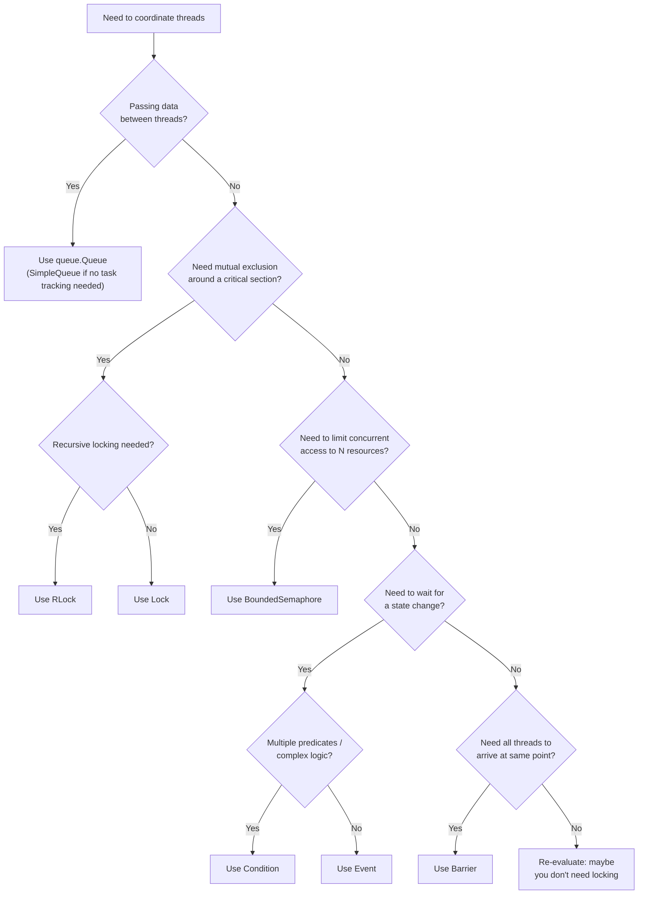

# 5.2. Python Synchronization Primitives and Thread-Safe Patterns

> **Why this note exists.** A common student misconception after reading about the GIL is: *"If the GIL makes Python single-threaded for bytecode, why do I need locks at all?"* The answer: **the GIL only guarantees that a single bytecode instruction executes atomically. It does NOT protect multi-instruction critical sections.** A statement like `counter += 1` compiles to **four** bytecodes (`LOAD_NAME`, `LOAD_CONST`, `BINARY_ADD`, `STORE_NAME`) and can be preempted between any two of them. This note explains every synchronization primitive in Python's `threading` module and when to use each.

---

## 1. Why the GIL Does Not Make Your Code Thread-Safe

Let's dissect the canonical race condition. Consider:

```python
import threading

counter = 0

def increment():
    global counter
    for _ in range(1_000_000):
        counter += 1

t1 = threading.Thread(target=increment)
t2 = threading.Thread(target=increment)
t1.start(); t2.start()
t1.join(); t2.join()
print(counter)   # Expected: 2_000_000  Actual: ~1_200_000 (varies)
```

### 1.1 The Bytecode Disassembly

```python
>>> import dis
>>> dis.dis(increment)
  4           0 LOAD_GLOBAL              0 (counter)
              2 LOAD_CONST               1 (1)
              4 INPLACE_ADD
              6 STORE_GLOBAL             0 (counter)
```

**Four bytecode instructions.** The GIL is released every ~100 bytecodes (default `setswitchinterval` of 5 ms). Between any two of those four instructions, the GIL can be dropped and another thread can run.

### 1.2 The Race Condition Visualized



This is the exact same "lost update" pattern as §4.1 of your existing notes. The fix is the same: a **mutual exclusion lock** around the critical section.

---

## 2. `threading.Lock` — The Basic Mutex

A `Lock` is the simplest synchronization primitive. It has two states: **locked** and **unlocked**. It supports two operations:

- `acquire(blocking=True, timeout=-1)`: Attempts to lock. If unlocked, locks and returns `True`. If locked and `blocking=True`, waits until released. If `timeout > 0`, waits at most `timeout` seconds. If `blocking=False`, returns `False` immediately if it cannot lock.
- `release()`: Unlocks. If called on an unlocked Lock, raises `RuntimeError`.

```python
import threading

lock = threading.Lock()
counter = 0

def increment():
    global counter
    for _ in range(1_000_000):
        lock.acquire()
        try:
            counter += 1
        finally:
            lock.release()
```

### 2.1 The Context Manager Idiom (Preferred)
`Lock` objects support the `with` statement, which is the **idiomatic, exception-safe** way to use them:

```python
def increment():
    global counter
    for _ in range(1_000_000):
        with lock:
            counter += 1
```

The `with` block guarantees `release()` is called even if an exception is raised inside. **Always prefer the `with` form.**

### 2.2 Lock Ownership
A `Lock` is **not reentrant**. The thread that acquires it is not tracked — the lock simply cannot be acquired twice. If a thread that already holds the lock calls `acquire()` again, it deadlocks:

```python
lock = threading.Lock()
lock.acquire()
lock.acquire()  # DEADLOCK — same thread, blocks forever
```

> **Reminder that students often forget.** `Lock` does not remember which thread owns it. This is by design: it is faster than `RLock`. If you need recursive acquisition (e.g., one locked function calls another locked function), use `RLock`.

---

## 3. `threading.RLock` — The Reentrant Lock

An `RLock` (Reentrant Lock) can be acquired **multiple times by the same thread** without deadlocking. It tracks the **owning thread** and an **acquisition count**. The lock is only released when the count returns to zero.

```python
lock = threading.RLock()

def outer():
    with lock:
        inner()  # Same thread re-acquires — OK

def inner():
    with lock:
        print("Inside nested lock")

outer()  # Works correctly
```

### 3.1 Performance Trade-Off
`RLock` is slower than `Lock` because:

- It must store the owning thread's `get_ident()`.
- Each `acquire()` checks whether the current thread is the owner.
- Each `release()` decrements the counter; the lock is only actually released when the counter hits zero.

Use `RLock` **only when you need reentrancy** (e.g., recursive functions, or class methods that call each other while holding the same lock). For all other cases, use `Lock`.

### 3.2 Internal Implementation
Roughly, an RLock in CPython is built on top of a `Lock` plus a counter and an owner field:



---

## 4. `threading.Semaphore` — Counting Lock

A `Semaphore` manages an internal counter that starts at an initial value `n`. `acquire()` decrements the counter (blocking if it's zero); `release()` increments it.

A semaphore with `n=1` behaves like a `Lock`. A semaphore with `n=N` allows up to `N` threads to hold it simultaneously.

### 4.1 Bounded vs Unbounded

- **`Semaphore(value=1)`**: `release()` can be called more times than `acquire()`, and the counter just grows. This is sometimes useful but can mask bugs.
- **`BoundedSemaphore(value=1)`**: raises `ValueError` if you call `release()` more times than you've called `acquire()`. **Use `BoundedSemaphore` whenever possible** — it catches resource-leak bugs.

### 4.2 Classic Use Case: Connection Pool

```python
import threading

# Only 3 concurrent database connections allowed
db_slots = threading.BoundedSemaphore(value=3)

def query_database(sql):
    with db_slots:           # Acquire one of 3 slots
        return execute_sql(sql)
```

### 4.3 Classic Use Case: Signaling (Not Locking)
Semaphores can also be used as **event signals** between threads, not as locks:

```python
# Producer signals Consumer via semaphore
items_available = threading.Semaphore(value=0)

def producer():
    while True:
        item = produce_item()
        put_in_queue(item)
        items_available.release()  # Increment: signal one item ready

def consumer():
    while True:
        items_available.acquire()  # Decrement: wait for an item
        item = get_from_queue()
        consume(item)
```

> **Tip.** When used as a signal, a semaphore's counter represents the number of "credits" available. The producer adds credits; the consumer removes them. This is a common alternative to `Condition` variables for simple producer-consumer patterns.

---

## 5. `threading.Event` — One-Shot Signaling

An `Event` is the simplest possible primitive for one thread to wake up one or more waiting threads. It has an internal boolean flag (initially `False`).

- `set()`: sets the flag to `True`. **All** threads waiting on the event wake up.
- `clear()`: sets the flag to `False`.
- `is_set()`: returns the current flag value.
- `wait(timeout=None)`: blocks until the flag is `True` or until `timeout`. Returns `True` if the flag was set, `False` on timeout.

```python
import threading, time

ready = threading.Event()

def worker():
    print("[worker] waiting for go signal...")
    ready.wait()               # Blocks until ready.set() is called
    print("[worker] running!")

t = threading.Thread(target=worker)
t.start()
time.sleep(2)
print("[main] signalling worker")
ready.set()
t.join()
```

### 5.1 Event Is Not Reset Automatically
After `set()`, the flag stays `True` until you call `clear()`. This means **any thread that calls `wait()` after `set()` returns immediately.** This is great for "one-time setup complete" patterns but bad for "wait for the next event" patterns — use `Condition` for that.

### 5.2 Multi-Thread Broadcast
`Event.set()` wakes up **all** waiting threads simultaneously. This makes `Event` the right choice for "broadcast start" patterns:

```python
start_gun = threading.Event()
runners = [threading.Thread(target=runner, args=(i, start_gun)) for i in range(8)]
for r in runners: r.start()
start_gun.set()  # All runners start at once
for r in runners: r.join()
```

---

## 6. `threading.Condition` — State-Dependent Waiting

A `Condition` is the most powerful synchronization primitive. It combines:

- A lock (default `RLock`, can be a `Lock`).
- A "wait set" of threads that are blocked waiting for some state to change.

It is the canonical primitive for **producer-consumer** patterns where the consumer must wait for state to be available.

### 6.1 API

- `acquire()` / `release()`: operate the underlying lock.
- `wait(timeout=None)`: **atomically releases the lock** and blocks the calling thread. When notified, **reacquires the lock** before returning.
- `notify(n=1)`: wakes up at most `n` threads waiting on this condition. **You must hold the lock when calling `notify()`.**
- `notify_all()`: wakes up all waiting threads.

### 6.2 Producer-Consumer Pattern

```python
import threading

queue = []
MAX_ITEMS = 5
not_empty = threading.Condition()
not_full = threading.Condition()

def producer(item):
    with not_full:
        while len(queue) >= MAX_ITEMS:
            not_full.wait()             # Queue is full, wait
        queue.append(item)
    with not_empty:
        not_empty.notify()              # Tell consumer there's an item

def consumer():
    with not_empty:
        while not queue:
            not_empty.wait()            # Queue is empty, wait
        item = queue.pop(0)
    with not_full:
        not_full.notify()               # Tell producer there's space
    return item
```

### 6.3 The Three Pitfalls of `Condition`



1. **Always use `while`, not `if`, before `wait()`.** This handles **spurious wakeups** — the OS may wake a thread even when `notify()` was not called. After waking, re-check the predicate.
2. **Always hold the lock when calling `notify()`.** Otherwise Python raises `RuntimeError`.
3. **Use separate `Condition` objects for separate predicates.** Don't use one condition for both "not empty" and "not full" — a `notify_all()` would wake everyone up but only some can make progress, causing the **thundering herd** problem (all threads wake, all but one immediately re-wait, wasting CPU).

> **Reminder.** `Condition.wait()` releases the lock *atomically* with blocking. This is the entire point of `Condition` — you cannot do this with `Lock` + `Event` because there would be a window between checking the predicate and starting to wait where a `notify` could be lost.

---

## 7. `threading.Barrier` — Phase Synchronization

A `Barrier` is for situations where N threads must all reach a synchronization point before any of them may proceed. It is the canonical primitive for **staged computations** like parallel iterations.

### 7.1 API

```python
b = threading.Barrier(parties=4, timeout=None)

# Each thread calls:
b.wait()         # Blocks until 4 threads have called wait()
                 # Then all 4 are released simultaneously
```

- `parties`: number of threads that must arrive.
- `timeout`: default timeout for `wait()` if not overridden.
- `wait(timeout=None)`: blocks until all parties arrive. Returns an integer 0..parties-1 indicating the thread's "arrival index". The thread that receives `0` may perform a one-time setup task.
- `reset()`: returns the barrier to its initial state. Threads currently waiting raise `BrokenBarrierError`.
- `abort()`: puts the barrier into a "broken" state. All currently-waiting threads raise `BrokenBarrierError`. Useful if something goes wrong and you want to release everyone.

### 7.2 Example: Staged Pipeline

```python
import threading

barrier = threading.Barrier(3)

def stage(name, stage_num):
    print(f"[{name}] starting stage {stage_num}")
    # ... do work ...
    arrival_index = barrier.wait()
    if arrival_index == 0:
        print(f"[{name}] I am the leader, doing setup for next stage")
    print(f"[{name}] passed stage {stage_num}")

for n in ["A", "B", "C"]:
    threading.Thread(target=stage, args=(n, 1)).start()
```

---

## 8. `queue.Queue` — The Thread-Safe FIFO

For most producer-consumer problems, you do **not** need to manually use `Condition`. Python's `queue` module provides thread-safe queues implemented on top of `Condition` + a deque. **This is the recommended primitive for inter-thread data passing.**

### 8.1 The Queue Family

| Class | Ordering | Behavior |
| :--- | :--- | :--- |
| `queue.Queue` | FIFO | Items come out in the order they went in. |
| `queue.LifoQueue` | LIFO | Stack-like — most-recently-added item comes out first. |
| `queue.PriorityQueue` | Heap | Items come out sorted by their priority (lowest first). |
| `queue.SimpleQueue` | FIFO | Lighter-weight `Queue` without task tracking; faster. |

### 8.2 Core API

```python
import queue

q = queue.Queue(maxsize=10)   # Bounded queue, blocks on put when full

q.put(item, block=True, timeout=None)  # Adds item; blocks if full
q.get(block=True, timeout=None)        # Removes and returns; blocks if empty
q.task_done()                  # Marks a previously-returned item as processed
q.join()                       # Blocks until all items have been task_done()
q.qsize()                      # Approximate size (not reliable)
q.empty() / q.full()           # Approximate (not reliable)
```

### 8.3 The Canonical Worker-Pool Pattern

```python
import threading, queue, time

work_queue = queue.Queue(maxsize=100)

def worker():
    while True:
        item = work_queue.get()       # Blocks until an item is available
        try:
            process(item)
        finally:
            work_queue.task_done()    # ALWAYS call this in a finally block

# Start 4 workers
for _ in range(4):
    threading.Thread(target=worker, daemon=True).start()

# Submit work
for i in range(1000):
    work_queue.put(i)

work_queue.join()   # Wait for all 1000 items to be processed
```

### 8.4 Why `task_done()` and `join()` Matter
Without `task_done()`, the queue cannot know when work is "really" finished. A worker that calls `get()` removes the item from the queue, but if it's still processing it, the queue is empty but the work isn't done. `join()` waits for **the count of `task_done()` calls to equal the count of `put()` calls** — this is the actual "all work finished" signal.

> **Critical reminder.** If you call `get()` and forget `task_done()`, `q.join()` will deadlock forever. Wrap your work in `try/finally` to guarantee `task_done()` runs even if an exception is thrown.

---

## 9. Choosing the Right Primitive — Decision Tree



---

## 10. Common Pitfalls and Reminders

1. **"I used `Lock` and the program deadlocked."** You either (a) acquired the same lock twice in the same thread (use `RLock`), (b) acquired two locks in different orders in two threads (use `threading.Lock` + `with` carefully, or acquire locks in a globally-agreed order), or (c) forgot to release the lock (always use `with`).

2. **"My `Condition.wait()` returned but the predicate was still False."** Spurious wakeup. You used `if` instead of `while`. Always loop:
   ```python
   while not predicate:
       cond.wait()
   ```

3. **"I called `notify()` outside the lock and got a `RuntimeError`."** This is correct behavior. You must hold the lock to call `notify()`.

4. **"My `queue.join()` never returns."** A worker called `get()` but didn't call `task_done()`. Wrap your `process(item)` in `try/finally` and call `task_done()` in `finally`.

5. **"My BoundedSemaphore raised `ValueError` on `release()`."** You released more than you acquired. This is a bug in your code — `BoundedSemaphore` is correctly catching it.

6. **"I'm using `Queue.qsize()` and it sometimes returns wrong values."** `qsize()` is **not reliable** in concurrent code — it's a snapshot that may be stale by the time you read it. Never use it for synchronization logic.

7. **"My Event.wait() returned immediately."** The event was already set from a previous signal. Call `clear()` if you want a fresh wait.

8. **"I used `with lock:` inside a generator and got weird hangs."** Generators suspend execution between yields. If you `yield` while holding a lock, the lock stays held until the generator resumes. Never `yield` inside a `with lock:` block.

---

> **Next note.** §5.3 covers **thread pools** (`concurrent.futures.ThreadPoolExecutor`), **thread-local storage** (`threading.local`), and **daemon threads** — the three pieces you need to write scalable, well-structured multithreaded Python programs in production.
