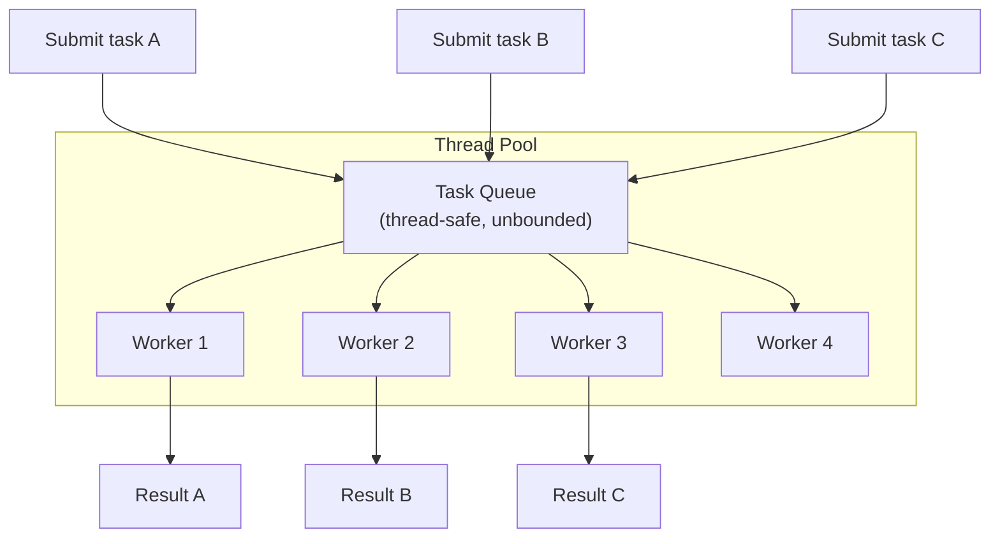
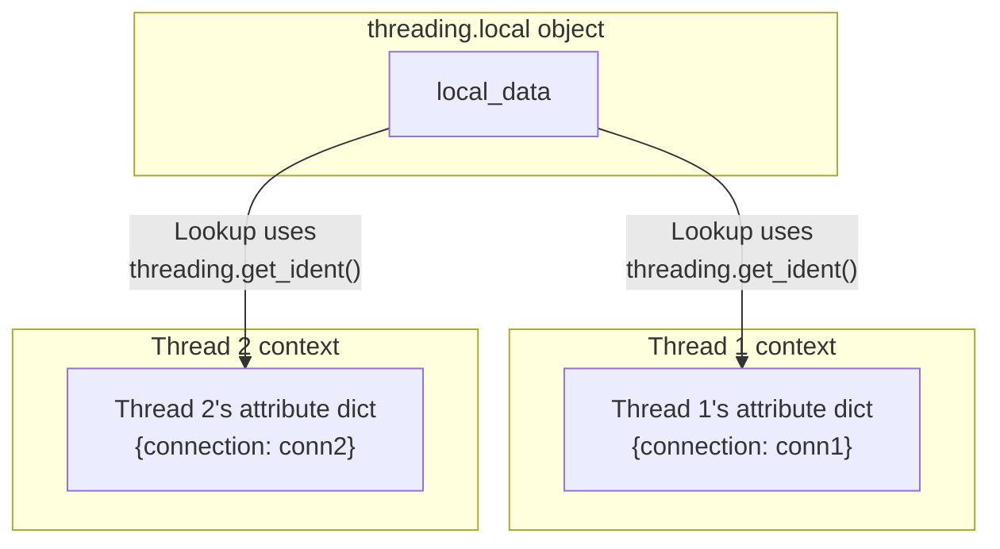
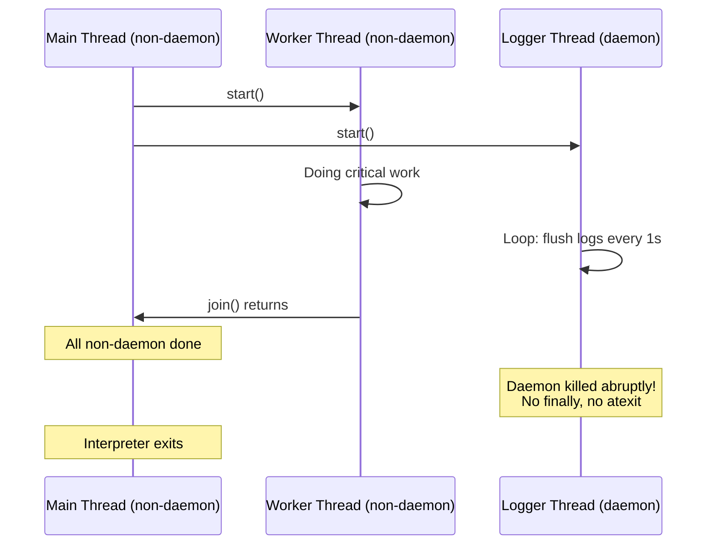
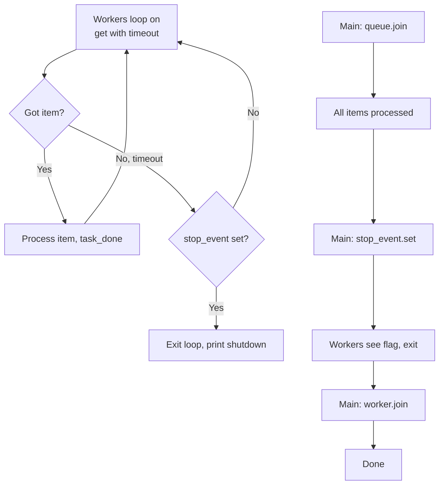

# 5.3. Python Thread Pools, Thread-Local Storage, and Daemon Threads

> **Why this note exists.** §5.1 and §5.2 covered the basics: how to spawn a thread, how to lock. But spawning raw `threading.Thread` objects for every task is wasteful — each thread costs 8 MB of virtual address space (default stack size on Linux) plus kernel state. In production code you almost always want a **thread pool**: a fixed set of worker threads that pull tasks from a queue. This note explains `concurrent.futures.ThreadPoolExecutor`, `threading.local()` for per-thread state, and the subtle behavior of daemon threads.

---

## 1. Why Thread Pools?

Three problems arise when you spawn one thread per task:

1. **Thread creation cost.** Spawning an OS thread involves a system call (`clone` on Linux), allocating a stack, and registering it with the scheduler. On a modern system this takes ~50 microseconds. If your task itself takes 100 microseconds, you spend 33% of your time on thread creation.
2. **Resource exhaustion.** Spawning 100,000 threads requires 800 GB of virtual address space for stacks. The OS will refuse long before that.
3. **Unbounded concurrency causes contention.** If you spawn 10,000 threads that all hit the same database, the database connection pool (typically 50-100 connections) becomes the bottleneck, and the threads mostly wait.

A **thread pool** fixes all three: it creates a fixed number of worker threads once, then reuses them for many tasks.



---

## 2. `concurrent.futures.ThreadPoolExecutor`

Since Python 3.2, the standard library ships `concurrent.futures`, a unified API for asynchronous execution. The two main classes are:

- `ThreadPoolExecutor` — for I/O-bound work (uses threads, subject to the GIL).
- `ProcessPoolExecutor` — for CPU-bound work (uses processes, sidesteps the GIL).

This note covers only the thread variant. The API is identical between the two, which is one of the great strengths of the module.

### 2.1 Basic Usage

```python
from concurrent.futures import ThreadPoolExecutor
import urllib.request

def fetch(url):
    with urllib.request.urlopen(url) as r:
        return r.read()

urls = ["https://example.com"] * 50

with ThreadPoolExecutor(max_workers=10) as executor:
    futures = [executor.submit(fetch, url) for url in urls]
    results = [f.result() for f in futures]
```

The `with` block is critical: when the `with` exits, `executor.shutdown(wait=True)` is called automatically, which **waits for all submitted tasks to complete** before returning. Without it, your program could exit while tasks are still running.

### 2.2 `submit()` vs `map()`

Two ways to submit work:

#### `submit(fn, *args, **kwargs)`
Returns a `Future` object immediately. The task is queued and will run on the next available worker. You retrieve the result later via `future.result()`. **This is the flexible option** — you can submit tasks one at a time, mix different functions, handle each result independently, and even cancel pending tasks.

#### `map(fn, *iterables, timeout=None, chunksize=1)`
Returns an **iterator** that yields results **in order** (the order of the input iterables, not the order of completion). Simpler for "apply this function to every item" patterns.

```python
with ThreadPoolExecutor(max_workers=10) as executor:
    results = list(executor.map(fetch, urls))   # In input order
```

**Trade-offs:**

| Aspect | `submit()` | `map()` |
| :--- | :--- | :--- |
| Result order | Completion order (if you want) | Input order (always) |
| Different functions per task | Yes | No |
| Exception handling | Per-future via `f.exception()` | Raises on first `next()` |
| Cancellation | `f.cancel()` possible | No |
| Lazy evaluation | Yes, via `as_completed()` | Yes, on iteration |

### 2.3 `as_completed()` — Handling Results as They Finish

`concurrent.futures.as_completed(futures)` returns an iterator that yields futures **in the order they complete**, not the order they were submitted. This is the right tool when you want to display progress or process fast results first:

```python
from concurrent.futures import ThreadPoolExecutor, as_completed

with ThreadPoolExecutor(max_workers=10) as executor:
    futures = {executor.submit(fetch, url): url for url in urls}
    for future in as_completed(futures):
        url = futures[future]
        try:
            data = future.result()
        except Exception as e:
            print(f"Failed to fetch {url}: {e}")
        else:
            print(f"Got {len(data)} bytes from {url}")
```

### 2.4 The `Future` Object

A `Future` represents the eventual result of an asynchronous computation. Key methods:

- `result(timeout=None)`: blocks until the computation finishes, returns the result. If the function raised, `result()` re-raises that exception in the caller. If timeout expires, raises `TimeoutError`.
- `exception(timeout=None)`: returns the exception raised by the function, or `None` if it succeeded.
- `done()`: returns `True` if the computation finished (non-blocking).
- `cancelled()`: returns `True` if the future was cancelled.
- `cancel()`: attempts to cancel. **Only succeeds if the task hasn't started yet** (still in the queue). Returns `True` if cancelled, `False` otherwise.
- `add_done_callback(fn)`: registers a callback to be called when the future completes. The callback receives the future as its only argument.

> **Critical reminder.** `Future.cancel()` is not a "kill switch." It cannot stop a running task — Python threads cannot be forcibly terminated. It only removes tasks that are still in the queue. If you need killable tasks, you must implement cooperative cancellation (e.g., check a `threading.Event` flag inside the task).

### 2.5 Choosing `max_workers`

The default `max_workers` in modern Python (3.8+) is `min(32, os.cpu_count() + 4)`. This is reasonable for mixed workloads but not optimal:

- **I/O-bound, high latency (network):** Many more workers than cores. Often 50–200, limited by the downstream service's tolerance.
- **I/O-bound, low latency (local disk, localhost network):** Close to the number of cores. Spinning 100 threads to read local files just adds scheduler overhead.
- **CPU-bound (NumPy, BLAS, etc.):** Equal to or slightly less than the number of physical cores. Oversubscribing causes cache thrash.

> **Tip.** Always benchmark. The optimal `max_workers` depends on the actual latency distribution of your downstream calls, the size of the responses, and the memory pressure of holding many in-flight results.

---

## 3. Thread-Local Storage with `threading.local`

Sometimes each thread needs its own private copy of a resource — typically a database connection, a logger, or a request context. **You cannot use a plain global variable** because all threads would share it. **You cannot use `threading.Lock`** because that serializes access. The right tool is **thread-local storage (TLS)** — a mechanism by which a single global name resolves to a different object in each thread.

### 3.1 Creating a Thread-Local Object

```python
import threading

# One object, but each thread sees a different attribute set.
local_data = threading.local()

def worker():
    local_data.connection = create_db_connection()  # Private to this thread
    do_work()
    local_data.connection.close()

for _ in range(10):
    threading.Thread(target=worker).start()
```

Each thread that accesses `local_data.connection` gets its own value — there are 10 separate `connection` attributes, one per thread. Setting it in one thread does not affect what another thread sees.

### 3.2 The Internals — How Thread-Local Works



Internally, `threading.local` maintains a dictionary keyed by `threading.get_ident()`. When you access `local_data.x`, the `__getattribute__` method looks up `x` in the current thread's entry. When a thread exits, its entry is removed (the `__del__` method of the local object handles this).

### 3.3 The Database Connection Pattern
The canonical use case for TLS is per-thread database connections. Sharing a single connection across threads is unsafe (most DB drivers are not thread-safe). Creating a connection per request is too slow. TLS gives you a connection per worker thread, reused across requests handled by that thread:

```python
import threading
import psycopg2  # PostgreSQL driver

_local = threading.local()

def get_connection():
    if not hasattr(_local, "connection"):
        _local.connection = psycopg2.connect(...)
    return _local.connection

def handle_request(query):
    conn = get_connection()
    return conn.execute(query).fetchall()
```

### 3.4 The Subtle Gotcha — Thread Pool Reuse
When you use `ThreadPoolExecutor`, threads are **reused across tasks**. This means TLS values persist across tasks. If task A sets `_local.user = "alice"` and finishes, task B running on the same thread will see `_local.user == "alice"` — which may be a security bug!

**Fix:** Always initialize or clear TLS at the start of each task:

```python
def handle_request(user, query):
    _local.user = user          # Set explicitly per task
    try:
        return do_query(query)
    finally:
        _local.user = None      # Clear on exit
```

> **Reminder.** Thread-local is per-thread, not per-task. With a thread pool, multiple tasks run on the same thread. If you store per-request state in TLS without clearing it, you have a data leak between requests.

---

## 4. Daemon Threads

A **daemon thread** is a thread that **does not prevent the program from exiting**. When all non-daemon threads have finished, the interpreter exits and daemon threads are **abruptly killed** (no `finally` blocks, no cleanup).

### 4.1 Setting the Daemon Flag

```python
# Option 1: At construction time (Python 3.3+)
t = threading.Thread(target=worker, daemon=True)

# Option 2: Before start()
t = threading.Thread(target=worker)
t.daemon = True
t.start()

# Option 3: Querying
print(t.daemon)   # True or False
```

The `daemon` flag **cannot be changed after `start()` is called** — attempting to do so raises `RuntimeError`.

### 4.2 The Shutdown Sequence



### 4.3 When to Use Daemon Threads

**Good uses:**
- Background heartbeat / keepalive threads that have no critical state.
- Status monitors that just observe.
- Threads that read from a continuously-flowing stream (sensor data, telemetry) where partial data loss on shutdown is acceptable.

**Bad uses:**
- Threads that write to a database or file (data loss on shutdown).
- Threads that hold locks (the lock is left locked, other threads deadlock before they're killed).
- Threads that manage external resources (open sockets, temp files).

### 4.4 The "Daemon Thread Held a Lock" Bug
A particularly insidious failure mode:

1. Daemon thread D acquires `lock`.
2. D is doing some I/O.
3. Main thread finishes, exits.
4. Daemon thread D is killed while holding `lock`.
5. The lock is never released.
6. If, in some later path, another thread tries to acquire `lock`, it deadlocks forever — but the program has already exited, so you might not even notice.

> **Rule of thumb.** Use daemon threads **only** for stateless background tasks. If a thread touches anything you care about — a file, a socket, a database — it should be non-daemon, and you should `join()` it explicitly at shutdown.

---

## 5. Graceful Shutdown — The Right Pattern

A well-structured multithreaded program has a clean shutdown sequence. Here is the canonical pattern using a `threading.Event` as a "stop signal":

```python
import threading, queue, time

stop_event = threading.Event()
work_queue = queue.Queue(maxsize=100)

def worker(name):
    while not stop_event.is_set():
        try:
            item = work_queue.get(timeout=1.0)  # Wait with timeout
        except queue.Empty:
            continue                            # Check stop_event again
        try:
            process(item)
        finally:
            work_queue.task_done()
    print(f"[{name}] shutting down cleanly")

def process(item):
    # ... do real work ...
    pass

# Start workers
workers = [threading.Thread(target=worker, args=(f"W{i}",), daemon=False)
           for i in range(4)]
for w in workers: w.start()

# Submit some work
for i in range(50):
    work_queue.put(i)

# Wait for queued work to finish
work_queue.join()

# Signal workers to exit
stop_event.set()

# Wait for workers to terminate
for w in workers: w.join()

print("All workers stopped cleanly.")
```

### 5.1 Why This Pattern Works



The key insights:

1. **Workers poll with timeout.** They never block indefinitely on `get()`, so they can re-check the stop flag.
2. **`queue.join()` waits for queued work, not for workers.** This guarantees no work is dropped.
3. **`stop_event.set()` is a one-way signal.** Workers see it on their next loop iteration.
4. **`worker.join()` lets the main thread wait until each worker has actually exited** — at which point it's safe to release any resources they were using.

---

## 6. `atexit` and Daemon Threads

The `atexit` module lets you register cleanup functions to run when the interpreter exits:

```python
import atexit

@atexit.register
def cleanup():
    print("Cleaning up...")
```

**Trap:** `atexit` handlers run **after** all non-daemon threads have joined but **before** daemon threads are killed. So:

- Daemon threads are still running when `atexit` runs.
- But the order of operations is: (1) all non-daemon threads finish → (2) `atexit` handlers run → (3) daemon threads killed.

If your `atexit` handler depends on daemon threads having flushed their state, it will fail. The fix is to make the logger non-daemon and `join()` it explicitly.

---

## 7. Putting It All Together — A Production Pattern

Below is the skeleton of a production-quality multithreaded worker. It combines a thread pool, thread-local storage, clean shutdown, and proper error handling:

```python
import threading, queue, logging, time
from contextlib import contextmanager

logger = logging.getLogger(__name__)

# Globals shared by workers
work_queue = queue.Queue(maxsize=1000)
stop_event = threading.Event()
_local = threading.local()

@contextmanager
def db_session():
    """Per-thread database session, properly cleaned up."""
    if not hasattr(_local, "session"):
        _local.session = create_db_session()
    try:
        yield _local.session
    finally:
        # Don't close — we'll reuse it for the next task on this thread
        pass

def worker(name):
    logger.info(f"[{name}] starting")
    while not stop_event.is_set():
        try:
            task = work_queue.get(timeout=1.0)
        except queue.Empty:
            continue
        try:
            with db_session() as session:
                process_task(task, session)
        except Exception:
            logger.exception(f"[{name}] task failed")
        finally:
            work_queue.task_done()
    # Cleanup thread-local resources on exit
    if hasattr(_local, "session"):
        _local.session.close()
    logger.info(f"[{name}] stopped")

def start_workers(n=4):
    workers = []
    for i in range(n):
        t = threading.Thread(target=worker, args=(f"W{i}",), name=f"Worker-{i}")
        t.start()
        workers.append(t)
    return workers

def shutdown(workers):
    stop_event.set()
    for w in workers:
        w.join(timeout=10)
        if w.is_alive():
            logger.error(f"Worker {w.name} did not shut down cleanly")

# Usage
workers = start_workers(4)
try:
    for i in range(10000):
        work_queue.put(make_task(i))
    work_queue.join()
finally:
    shutdown(workers)
```

---

## 8. Common Pitfalls and Reminders

1. **"My `ThreadPoolExecutor` swallowed an exception."** Exceptions raised inside `submit()`-ed tasks are stored in the `Future`. They are re-raised when you call `f.result()`. If you never call `result()`, the exception is silently lost. Always call `result()` or `exception()`.

2. **"My program hangs at exit."** You have a non-daemon thread that's blocked. Use `threading.enumerate()` and `py-spy`/`faulthandler.dump_traceback()` to find which thread is stuck.

3. **"Random `OperationalError: database connection lost`."** You're sharing a single DB connection across threads. Use `threading.local()` to give each thread its own.

4. **"My daemon thread's log file is truncated."** Daemon threads are killed without `finally`. Make loggers non-daemon and `join()` them, or use `logging.handlers.QueueHandler` to push log records to a non-daemon logger thread.

5. **"Thread pool tasks run sequentially."** Check your `max_workers` — if it's 1, you have no parallelism. Also check whether you're holding a lock for the entire task duration.

6. **"`with ThreadPoolExecutor()` exits while tasks are running."** It shouldn't — `shutdown(wait=True)` is called on exit. But if you're seeing this, you may have set `wait=False` somewhere or be using `cancel_futures=True` (Python 3.9+).

7. **"I see stale data from a previous request."** Thread-local state in a thread pool leaks between tasks. Always reset TLS at the start of each task.

---

> **Next note.** §5.4 introduces **`asyncio`** — Python's modern alternative to threads for I/O-bound concurrency. Where threads require OS context switches, asyncio uses a single-threaded event loop that can manage tens of thousands of concurrent I/O operations with lower overhead and no GIL contention.
