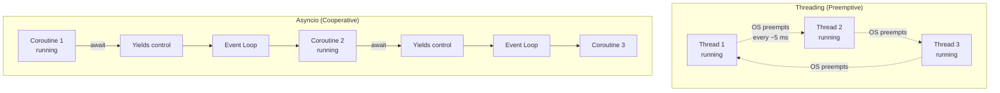
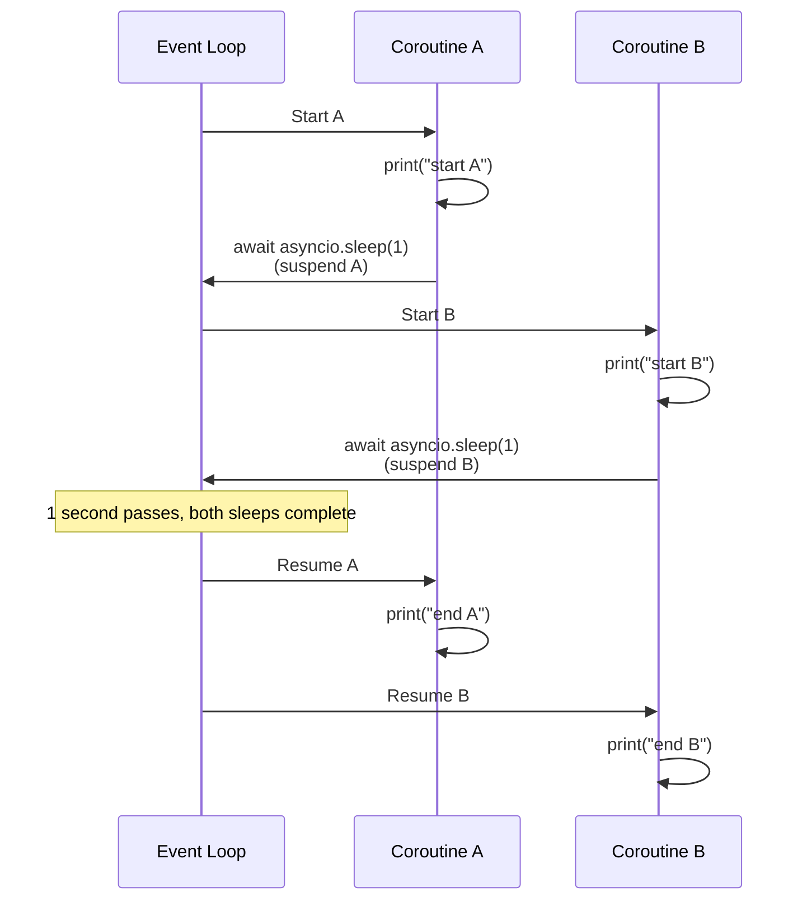
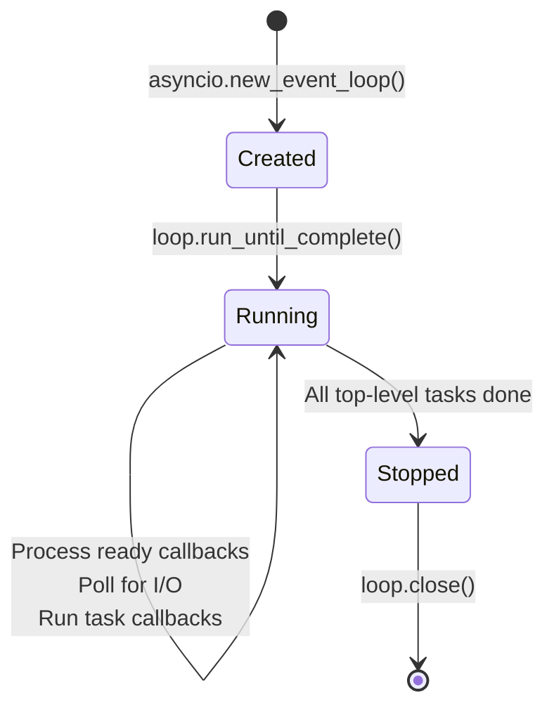
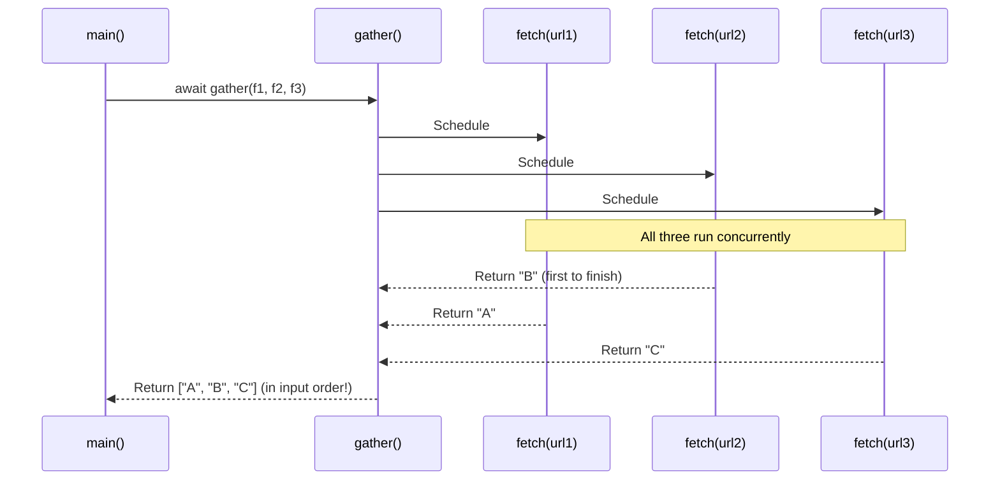
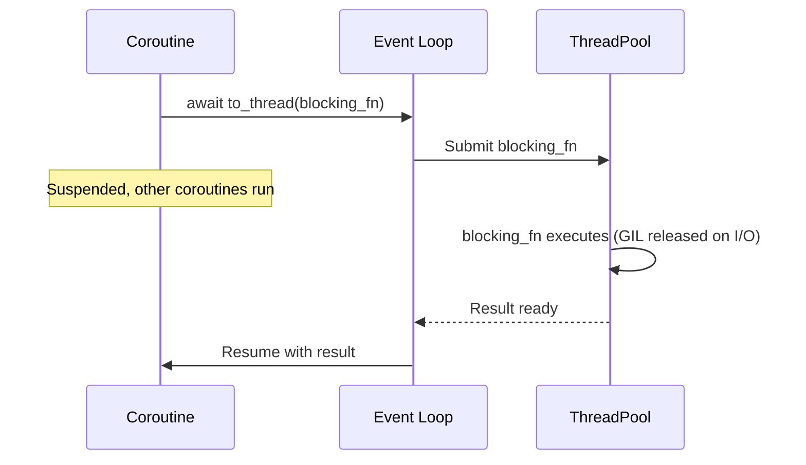
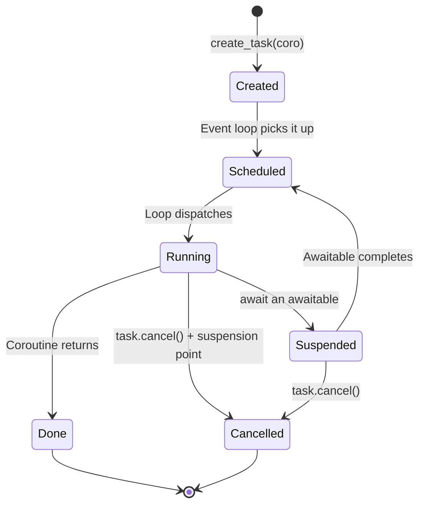

# 5.4. Python Asyncio as a Modern Alternative to Threads

> **Why this note exists.** Threads in Python are subject to the GIL, have non-trivial memory cost (8 MB virtual stack each), and require OS context switches. For I/O-bound workloads that need to handle thousands of concurrent connections — web crawlers, chat servers, real-time data feeds — `asyncio` is the modern alternative. It uses a **single-threaded event loop** that can multiplex thousands of I/O operations with far lower per-task overhead. This note explains the architecture, syntax, and the practical trade-offs of asyncio vs threading.

---

## 1. The Core Insight — Cooperative vs Preemptive Multitasking



### 1.1 Threading: Preemptive Multitasking
The OS scheduler decides when to switch threads. The thread has no control over when it's interrupted. The OS may interrupt at any bytecode boundary. This is why you need locks (§5.2) — you might be interrupted in the middle of a multi-step operation.

### 1.2 Asyncio: Cooperative Multitasking
Each coroutine runs until it explicitly yields control via `await`. The event loop then picks another ready coroutine to run. **No coroutine is ever interrupted mid-operation** — you only switch at well-defined `await` points. This makes most locking unnecessary.

### 1.3 The Trade-off
- **Asyncio pros:** No locks needed for most code; can handle 100k+ concurrent I/O operations on a single core; no GIL contention (only one thread runs Python anyway); no per-thread stack overhead (coroutines cost ~1 KB each).
- **Asyncio cons:** One blocking call (e.g., `time.sleep(10)` or `requests.get(url)`) **freezes the entire event loop** — no other coroutine can run until it returns. Every I/O library you use must be asyncio-aware. CPU-bound work must be offloaded to a thread or process pool.

---

## 2. The `async`/`await` Syntax

Python 3.5 introduced `async def` and `await` as first-class syntax. A function defined with `async def` is a **coroutine function**. Calling it does not execute it — it returns a **coroutine object** that must be awaited or scheduled.

```python
import asyncio

async def greet(name):
    print(f"Hello, {name}")
    await asyncio.sleep(1)         # Non-blocking sleep
    print(f"Goodbye, {name}")

# Calling greet() does NOT run it.
coro = greet("Alice")
print(type(coro))                  # <class 'coroutine'>

# To actually run it, you must await it (inside another coroutine)
# or schedule it on the event loop:
asyncio.run(greet("Alice"))
```

### 2.1 What `await` Actually Does

`await` is only valid inside `async def` functions. When Python encounters `await expr`:

1. `expr` is evaluated. It must produce an **awaitable** (a coroutine, a `Task`, a `Future`, or any object with an `__await__` method).
2. The current coroutine **suspends** at this point.
3. Control returns to the event loop, which can run other coroutines.
4. When the awaited awaitable is "done", the event loop **resumes** the current coroutine.
5. The `await` expression evaluates to the result of the awaitable.

This is conceptually identical to a generator's `yield`, but specialized for concurrency.



---

## 3. The Event Loop

The event loop is the heart of asyncio. It maintains a queue of ready-to-run coroutines and a set of pending I/O operations (monitored via `epoll` on Linux, `kqueue` on macOS, IOCP on Windows).

### 3.1 `asyncio.run()` — The Entry Point

```python
async def main():
    await asyncio.gather(greet("A"), greet("B"))

asyncio.run(main())
```

`asyncio.run()` is the standard way to start asyncio from synchronous code (Python 3.7+). It:

1. Creates a new event loop.
2. Runs the given coroutine to completion.
3. Cancels any remaining tasks.
4. Shuts down async generators.
5. Closes the event loop.

> **Reminder.** You should call `asyncio.run()` **exactly once** per program, at the top level. Inside async code, never call `asyncio.run()` recursively — use `await` instead. Calling `asyncio.run()` from inside an already-running loop raises `RuntimeError`.

### 3.2 The Loop's Lifecycle



### 3.3 The Three Types of Work the Loop Does

1. **Run ready callbacks.** Each task that was suspended and is now ready (e.g., its `sleep` expired) has a callback queued. The loop runs them in FIFO order.
2. **Poll for I/O.** The loop calls `epoll_wait` (or equivalent) with a timeout. If any file descriptor is ready for read/write, the corresponding callback is scheduled.
3. **Run scheduled timers.** Any `call_later` or `call_at` callbacks whose time has arrived are scheduled.

The loop cycles through these phases forever until it's stopped.

---

## 4. Concurrency Primitives — `gather`, `wait`, `create_task`

### 4.1 `asyncio.create_task(coro)` — Schedule a Coroutine

```python
async def main():
    task = asyncio.create_task(greet("Alice"))
    # The task is now running in the background.
    # The current coroutine can do other work here.
    await task           # Wait for the task to complete
```

`create_task` schedules the coroutine on the event loop **immediately** and returns a `Task` object (a subclass of `Future`). The task runs concurrently with the calling coroutine.

### 4.2 `asyncio.gather(*coros)` — Run Many in Parallel

```python
async def main():
    results = await asyncio.gather(
        fetch("url1"),
        fetch("url2"),
        fetch("url3"),
    )
    # results is a list in the same order as the input coros
```

`gather` schedules all the coroutines concurrently and returns a single awaitable that resolves to a list of their results. **The order of results matches the input order, not the completion order.**



### 4.3 `asyncio.wait(coros)` — Lower-Level Control

```python
async def main():
    done, pending = await asyncio.wait(
        [fetch("url1"), fetch("url2"), fetch("url3")],
        return_when=asyncio.FIRST_COMPLETED,
        timeout=5.0,
    )
    # `done` is a set of completed tasks
    # `pending` is a set of still-running tasks
    for task in pending:
        task.cancel()    # Clean up
```

`wait` is more flexible than `gather`:
- `return_when=FIRST_COMPLETED` returns as soon as any task finishes.
- `return_when=FIRST_EXCEPTION` returns on the first exception or when all complete.
- `return_when=ALL_COMPLETED` (default) returns when all complete.
- `timeout` limits how long to wait.

### 4.4 `asyncio.wait_for(coro, timeout)` — Simple Timeout

```python
try:
    result = await asyncio.wait_for(fetch("url"), timeout=5.0)
except asyncio.TimeoutError:
    print("Timed out")
```

If the timeout expires, `wait_for` cancels the coroutine and raises `TimeoutError`.

---

## 5. Asyncio Synchronization Primitives

Although asyncio is single-threaded, you still need synchronization for **coordinating coroutines** (not for memory protection — there's only one thread). The primitives mirror `threading` but are awaitable:

| `threading` | `asyncio` |
| :--- | :--- |
| `Lock` | `asyncio.Lock` |
| `RLock` | (no equivalent — not needed) |
| `Semaphore` | `asyncio.Semaphore` |
| `Event` | `asyncio.Event` |
| `Condition` | `asyncio.Condition` |
| `Queue` | `asyncio.Queue` |

### 5.1 `asyncio.Lock`

```python
lock = asyncio.Lock()

async def critical_section():
    async with lock:
        # Only one coroutine can be here at a time
        await do_io_work()
```

**Why do you need this if there's only one thread?** Because a coroutine can be **suspended at any `await`**. If coroutine A enters a critical section, then `await`s (yielding to the event loop), coroutine B can run and try to enter the same section. The lock prevents this.

### 5.2 `asyncio.Semaphore` — Rate Limiting

```python
# Limit to 10 concurrent HTTP requests
sem = asyncio.Semaphore(10)

async def fetch_limited(url):
    async with sem:
        return await fetch(url)

async def main():
    urls = [f"https://example.com/{i}" for i in range(1000)]
    results = await asyncio.gather(*[fetch_limited(u) for u in urls])
```

This pattern is the standard way to avoid overwhelming a downstream service with thousands of simultaneous requests.

### 5.3 `asyncio.Queue` — Async Producer-Consumer

```python
import asyncio

queue = asyncio.Queue(maxsize=100)

async def producer():
    for i in range(1000):
        await queue.put(i)        # Blocks if queue is full
    await queue.put(None)         # Sentinel to signal consumers to stop

async def consumer(name):
    while True:
        item = await queue.get()
        if item is None:
            await queue.put(None) # Pass the sentinel to other consumers
            return
        try:
            await process(item)
        finally:
            queue.task_done()

async def main():
    producers = [asyncio.create_task(producer()) for _ in range(2)]
    consumers = [asyncio.create_task(consumer(f"C{i}")) for i in range(4)]
    await asyncio.gather(*producers)
    await queue.join()              # Wait for all items processed
    # Consumers will exit on their own via the sentinel
```

---

## 6. The "Blocking Call" Trap

The single most common asyncio bug is calling a blocking function inside a coroutine. This **freezes the entire event loop** until the call returns.

### 6.1 The Bad Pattern

```python
import requests          # Synchronous HTTP library

async def fetch(url):
    return requests.get(url).text   # BLOCKS THE EVENT LOOP
```

While `requests.get(url)` is blocked waiting for the network, **no other coroutine can run**. The 1000 other "concurrent" fetches are all frozen. You've effectively serialized your program.

### 6.2 The Fix — Use Async Libraries

```python
import aiohttp           # Asynchronous HTTP library

async def fetch(session, url):
    async with session.get(url) as response:
        return await response.text()

async def main():
    async with aiohttp.ClientSession() as session:
        results = await asyncio.gather(
            *[fetch(session, f"https://example.com/{i}") for i in range(1000)]
        )
```

### 6.3 What If You Must Use a Blocking Library?

Use `asyncio.to_thread()` (Python 3.9+) or `loop.run_in_executor()` to run the blocking call in a thread pool:

```python
import requests, asyncio

async def fetch(url):
    # Runs requests.get in a thread, returns awaitable
    return await asyncio.to_thread(requests.get, url)
```

This is the bridge between the sync and async worlds. The blocking call runs in a thread (where blocking is fine), and the coroutine gets a non-blocking awaitable.



---

## 7. asyncio vs Threading — When to Choose Which

```mermaid
flowchart TD
    Start[Need concurrency] --> Q1{CPU-bound or I/O-bound?}
    Q1 -->|CPU-bound| M[Use multiprocessing<br/>(threads are GIL-blocked<br/>asyncio doesn't help either)]
    Q1 -->|I/O-bound| Q2{Need to integrate with<br/>blocking sync libraries?}
    Q2 -->|Mostly no| A[Use asyncio<br/>— better scalability<br/>— lower overhead per task]
    Q2 -->|Mostly yes| Q3{Many thousands of<br/>concurrent connections?}
    Q3 -->|Yes| A2[Use asyncio +<br/>run_in_executor for blocking calls]
    Q3 -->|No, tens to hundreds| T[Use ThreadPoolExecutor<br/>— simpler model<br/>— no async library needed]
```

### 7.1 Choose asyncio when:
- You need to handle 1,000+ concurrent connections.
- Your workload is I/O-bound.
- Your dependencies are async-aware (`aiohttp`, `asyncpg`, `aioredis`, `aiofiles`).
- You want lower memory overhead (~1 KB per coroutine vs 8 MB per thread).

### 7.2 Choose threading when:
- Your workload is I/O-bound but you need to use blocking libraries (`requests`, `psycopg2`, `redis-py`).
- You have modest concurrency needs (tens to low hundreds).
- You're calling C extensions that release the GIL.
- You're working with legacy code that isn't async-aware.

### 7.3 Choose multiprocessing when:
- Your workload is CPU-bound.
- You need true parallelism in pure Python.

---

## 8. The `asyncio` Task Lifecycle



### 8.1 Task Cancellation
Cancellation in asyncio is **cooperative**. When you call `task.cancel()`:

1. The task's next suspension point (`await`) raises `asyncio.CancelledError`.
2. The coroutine can catch this (rarely a good idea) or let it propagate.
3. If it propagates, the task is marked as cancelled.
4. `await task` raises `CancelledError` to the awaiter.

> **Critical reminder.** `CancelledError` is a `BaseException` in Python 3.8+, not an `Exception`. So `except Exception:` will not catch it — you must use `except BaseException:` or `except asyncio.CancelledError:`. This is intentional: it ensures cancellation propagates even through `except Exception:` blocks.

### 8.2 Cleanup in `finally`
Always use `try/finally` to release resources in coroutines that may be cancelled:

```python
async def fetch_with_cleanup(url):
    resource = await acquire_resource()
    try:
        return await do_work(resource)
    finally:
        await release_resource(resource)   # Always runs, even on cancel
```

---

## 9. Mixing asyncio and Threading

### 9.1 `asyncio.to_thread()` — From Async to Sync
Run a sync function in a thread, await its result:

```python
async def main():
    data = await asyncio.to_thread(requests.get, "https://example.com")
```

### 9.2 `loop.call_soon_threadsafe()` — From Sync to Async
Schedule a callback on the event loop from another thread. **Required** if you want to wake up the event loop from a sync thread:

```python
def on_thread_event():
    # This runs in a worker thread
    loop.call_soon_threadsafe(notify_event_loop)

async def main():
    global loop
    loop = asyncio.get_running_loop()
    threading.Thread(target=on_thread_event).start()
    await some_async_work()
```

### 9.3 The "Asyncio in Threads" Trap
**You cannot run `asyncio.run()` from multiple threads** and have them share state. Each call to `asyncio.run()` creates a new event loop in a new thread. They cannot see each other's tasks.

If you need an asyncio loop accessible from multiple threads, run it in **one dedicated thread** and use `asyncio.run_coroutine_threadsafe(coro, loop)` to schedule coroutines onto it from other threads:

```python
import asyncio, threading

loop = asyncio.new_event_loop()
loop_thread = threading.Thread(target=loop.run_forever, daemon=True)
loop_thread.start()

# From any other thread:
future = asyncio.run_coroutine_threadsafe(my_coro(), loop)
result = future.result(timeout=10)
```

---

## 10. Common Pitfalls and Reminders

1. **"My async program runs as slow as the synchronous version."** You're using a blocking library (`requests`, `time.sleep`, `open()`). Replace with async equivalents (`aiohttp`, `asyncio.sleep`, `aiofiles`), or use `asyncio.to_thread()`.

2. **"I get `RuntimeError: coroutine was never awaited`."** You wrote `coro = fetch(url)` but forgot to `await coro`. Or you wrote `return fetch(url)` instead of `return await fetch(url)`.

3. **"I get `RuntimeError: asyncio.run() cannot be called from a running event loop`."** You called `asyncio.run()` from inside an `async def` function. Use `await` directly, or use `asyncio.gather()`.

4. **"My `gather()` result is in the wrong order."** It's not — `gather` returns results in input order, not completion order. If you want completion order, use `asyncio.as_completed()`.

5. **"My task is stuck and never finishes."** You probably forgot to `await` something. The task is sitting at the point where it should have awaited but didn't, so it never yields control. Use `asyncio.current_task().print_stack()` to debug.

6. **"CancelledError is propagating through my `except Exception:` block."** Since Python 3.8, `CancelledError` inherits from `BaseException`, not `Exception`. This is intentional — never swallow `CancelledError` unless you know exactly why.

7. **"My `await asyncio.sleep(0)` is weirdly useful."** It is! `await asyncio.sleep(0)` yields control to the event loop **without actually sleeping**. It's the canonical way to say "let other coroutines run for a bit" — useful in long CPU-bound sections of an async function to keep the loop responsive.

8. **"I'm awaiting a coroutine twice."** You can't. A coroutine object is single-use. If you need to run it twice, call the coroutine function again to get a new coroutine object.

9. **"Asyncio is faster than threading for everything."** No. Asyncio has lower per-task overhead, but each coroutine runs on a single core. For CPU-bound work mixed with I/O, threading (with GIL-releasing C extensions) can be faster.

10. **"My web framework doesn't support asyncio."** Most modern ones do: FastAPI, Starlette, Sanic, Tornado, aiohttp. Django has async views since 3.1. Flask is async-compatible since 2.0. If you're on an old framework, threading is your only option.

---

> **Next note.** §5.5 shifts the focus to **C++**. C++ threads are real OS threads with no GIL, and the standard library (since C++11) provides a rich set of primitives that go far beyond Python's. We start with `std::thread` — the foundation of modern C++ concurrency.
