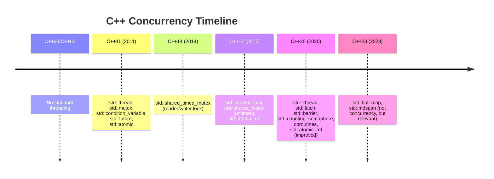
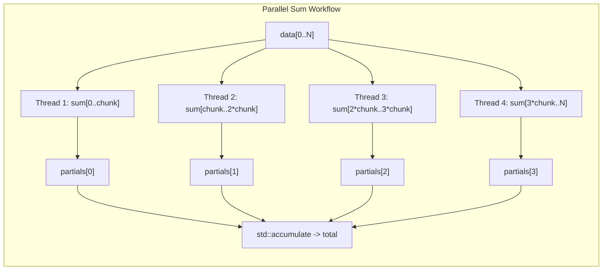

# 5.5. The C++ Standard Thread Library (std::thread)

> **Why this note exists.** Before C++11, C++ had no standard threading. You used `pthread` on POSIX or `CreateThread`/`_beginthreadex` on Windows — platform-specific code that was impossible to write portably. C++11 introduced `std::thread`, a portable, type-safe wrapper around OS threads. Unlike Python, **C++ has no GIL**: multiple threads can execute C++ code in true parallel on multiple cores. This note covers everything from basic creation to the subtle pitfalls that catch C++ developers new to concurrency.

---

## 1. Pre-C++11 vs Modern C++ Threading

### 1.1 The Dark Ages (Pre-2011)
```cpp
// POSIX (Linux/macOS)
#include <pthread.h>
void* worker(void* arg) { /* ... */ return nullptr; }
pthread_t t;
pthread_create(&t, nullptr, worker, &data);
pthread_join(t, nullptr);

// Windows
#include <windows.h>
DWORD WINAPI worker(LPVOID arg) { /* ... */ return 0; }
HANDLE h = CreateThread(nullptr, 0, worker, &data, 0, nullptr);
WaitForSingleObject(h, INFINITE);
CloseHandle(h);
```

These are completely incompatible APIs. Cross-platform threading meant `#ifdef _WIN32` everywhere or depending on Boost.Thread.

### 1.2 The Modern Era (C++11+)
```cpp
#include <thread>

void worker(int x) { /* ... */ }
std::thread t(worker, 42);
t.join();
```

One API, all platforms. `std::thread` is a thin wrapper around `pthread_create` or `CreateThread`, but with C++-style type safety, RAII semantics, and integration with the rest of the standard library.



---

## 2. Creating and Joining Threads

### 2.1 Basic Construction

```cpp
#include <thread>
#include <iostream>

void worker(int id) {
    std::cout << "Worker " << id << " running\n";
}

int main() {
    std::thread t(worker, 42);  // Construct + start in one step
    t.join();                   // Wait for it to finish
    return 0;
}
```

The constructor is variadic: `std::thread f, args...` creates a thread that runs `f(args...)`. Unlike Python's `threading.Thread`, **construction immediately starts the thread** — there is no separate `start()` call.

### 2.2 `join()` vs `detach()`

A `std::thread` object represents a thread of execution. You must do exactly one of:

- **`join()`**: Block the calling thread until the spawned thread finishes. After `join()`, the `std::thread` object no longer represents a thread (it's "empty").
- **`detach()`**: Release the thread. It continues running independently in the background. The `std::thread` object no longer represents it.
- **Neither**: This is a **fatal error**. When a `std::thread` object is destroyed (its destructor runs) and it still "represents" a running thread, the program calls `std::terminate()` — instant crash.

```cpp
std::thread t(worker, 42);
// If we don't join() or detach() before t goes out of scope:
// ~thread() calls std::terminate() -> abort()
```

> **Critical reminder.** This is the most important rule of `std::thread`: **always decide the fate of every thread you create.** If you're not sure, `join()`. If you want a "fire and forget" background thread, `detach()` and never touch the `std::thread` object again.

### 2.3 Checking Joinability

```cpp
std::thread t;
std::cout << t.joinable() << "\n";  // 0 (false)

t = std::thread(worker, 42);
std::cout << t.joinable() << "\n";  // 1 (true)

t.join();
std::cout << t.joinable() << "\n";  // 0 (false) — join() reset it
```

`joinable()` returns `true` if the `std::thread` object represents a thread that hasn't been joined or detached. **The destructor only calls `std::terminate()` if `joinable()` returns `true`.**

### 2.4 The RAII Wrapper Pattern
Because the destructor's "terminate" behavior is so dangerous, the standard practice is to wrap `std::thread` in an RAII class that joins (or detaches) on destruction:

```cpp
class joining_thread {
    std::thread t_;
public:
    joining_thread() = default;
    template<typename F, typename... Args>
    explicit joining_thread(F&& f, Args&&... args)
        : t_(std::forward<F>(f), std::forward<Args>(args)...) {}
    joining_thread(joining_thread&&) = default;
    joining_thread& operator=(joining_thread&&) = default;
    ~joining_thread() { if (t_.joinable()) t_.join(); }
};

// Usage:
void worker() { /* ... */ }
{
    joining_thread t(worker);   // Starts thread
}   // ~joining_thread joins — safe even if exception thrown
```

**C++20 note:** `std::jthread` (covered in §5.9) is essentially this RAII wrapper plus cooperative cancellation, added to the standard library.

---

## 3. Passing Arguments — The Decay Trap

`std::thread`'s constructor takes the function and arguments by **rvalue reference** and then **copies/moves** them into the new thread's storage. This leads to two famous traps.

### 3.1 Trap 1: String Literal to `char*` or `std::string`

```cpp
void worker(std::string s) { /* ... */ }

std::thread t(worker, "hello");
```

This **usually** works, but there's a subtle issue: the string literal `const char*` is passed to the thread constructor. The thread constructor defers the conversion to `std::string` until the new thread starts. If `worker` instead took `char*` (non-const), you'd have a problem. **Best practice:** explicitly construct the argument:

```cpp
std::thread t(worker, std::string("hello"));
```

### 3.2 Trap 2: Passing a Reference

```cpp
void update_counter(int& counter) { counter++; }

int counter = 0;
std::thread t(update_counter, std::ref(counter));  // CORRECT
// std::thread t(update_counter, counter);         // WRONG — copies!
t.join();
std::cout << counter << "\n";   // 1 if std::ref used, 0 otherwise
```

**`std::thread` copies arguments by default.** If your function takes a reference, you must wrap the argument in `std::ref()` (for lvalue references) or `std::cref()` (for const references). Without this, the compiler silently copies — your function modifies a temporary, not your actual variable.

### 3.3 Trap 3: Passing a Pointer to a Stack Variable

```cpp
void worker(int* p) { /* use p */ }

void dangerous() {
    int local = 42;
    std::thread t(worker, &local);
    t.detach();   // BAD!
}   // local is destroyed here, but worker might still use it
```

If you `detach()` a thread that holds a pointer to a local variable, you have a **dangling pointer**. The thread may access the variable after its lifetime ends — undefined behavior.

**Fix:** Either `join()` before the variable goes out of scope, or pass by value, or use a smart pointer (`std::shared_ptr`).

### 3.4 Passing a Member Function

```cpp
class Worker {
public:
    void do_work(int x) { /* ... */ }
};

Worker w;
std::thread t(&Worker::do_work, &w, 42);   // Note: pointer to w
t.join();
```

The first argument is a pointer-to-member. The second is the object (pointer or reference) on which to call the member. Then the rest of the arguments follow.

---

## 4. Returning Values from Threads

`std::thread` has no built-in mechanism to return a value. The function's return value is silently discarded. There are three standard solutions:

### 4.1 Solution 1: Pass a Non-`const` Reference

```cpp
void worker(int input, int& output) {
    output = input * 2;
}

int result = 0;
std::thread t(worker, 42, std::ref(result));
t.join();
// result is now 84
```

Simple, but requires synchronization if multiple threads write to the same output.

### 4.2 Solution 2: Use `std::promise` / `std::future`

```cpp
#include <future>

int worker(int input) { return input * 2; }

std::future<int> f = std::async(std::launch::async, worker, 42);
int result = f.get();   // 84
```

Or explicitly with `std::promise`:

```cpp
void worker(std::promise<int> p, int input) {
    p.set_value(input * 2);
}

std::promise<int> p;
std::future<int> f = p.get_future();
std::thread t(worker, std::move(p), 42);
t.join();
int result = f.get();
```

This is the canonical, exception-safe way. (Covered in detail in §5.7.)

### 4.3 Solution 3: Capture by Reference in a Lambda

```cpp
int result = 0;
std::thread t([&result]() { result = 42 * 2; });
t.join();
// result is now 84
```

Concise, but be careful with `[&]` captures — every captured variable is captured by reference, which means lifetime management is on you.

---

## 5. Exception Safety — The Untold Story

What happens if a thread function throws an exception?

### 5.1 Uncaught Exception = `std::terminate`

```cpp
void worker() {
    throw std::runtime_error("oops");
}

std::thread t(worker);
t.join();   // Program crashes inside worker() with std::terminate
```

**An exception that escapes a thread function calls `std::terminate()`.** There is no "main thread" to catch it. The exception does not propagate to the joining thread.

### 5.2 The Fix: `std::promise` Exception Handling

If you use `std::promise`/`std::future`, you can propagate exceptions:

```cpp
void worker(std::promise<int> p) {
    try {
        throw std::runtime_error("oops");
        p.set_value(42);
    } catch (...) {
        p.set_exception(std::current_exception());
    }
}

std::promise<int> p;
std::future<int> f = p.get_future();
std::thread t(worker, std::move(p));
t.join();
try {
    int result = f.get();   // Re-throws the runtime_error
} catch (const std::exception& e) {
    std::cerr << "Caught: " << e.what() << "\n";
}
```

When you call `set_exception` on a promise, the corresponding future's `get()` re-raises the exception in the consumer thread.

### 5.3 The `try/catch` Pattern in Threads
If you're not using promises, **always wrap your thread function in a `try/catch`**:

```cpp
void worker() {
    try {
        // ... actual work ...
    } catch (const std::exception& e) {
        std::cerr << "Thread caught: " << e.what() << "\n";
        // Optionally log to a shared error sink
    } catch (...) {
        std::cerr << "Thread caught unknown exception\n";
    }
}
```

---

## 6. Thread Identification

`std::thread::id` is a small, opaque, copyable identifier for a thread. Each running thread has a unique id.

```cpp
std::thread::id main_id = std::this_thread::get_id();
std::cout << "Main thread id: " << main_id << "\n";

std::thread t([]() {
    std::cout << "Worker id: " << std::this_thread::get_id() << "\n";
});
t.join();
```

### 6.1 Uses for `thread::id`

1. **Debug logging.** Print the thread id alongside log messages to trace which thread did what.
2. **Per-thread data structures.** Use `thread::id` as a key in a `std::unordered_map` to store per-thread state (alternative to `thread_local`).
3. **Owner-checking.** A mutex class could store the owning thread's id and assert that the unlocker is the same thread.

### 6.2 Caveats
- `thread::id` is **not numeric**. You can print it (it has `operator<<`), but you cannot cast it to `int`.
- A default-constructed `thread::id` represents "no thread." Comparing equal to it means the thread doesn't exist.
- `thread::id` values may be **reused** after a thread terminates. Do not use them as long-term identifiers.

---

## 7. `std::this_thread` — The Current Thread's API

The `std::this_thread` namespace provides functions for the currently-running thread:

### 7.1 `get_id()`
Returns the current thread's `thread::id`. Covered above.

### 7.2 `sleep_for(duration)`
Blocks the current thread for at least the given duration.

```cpp
#include <chrono>
std::this_thread::sleep_for(std::chrono::milliseconds(100));
```

The actual sleep may be longer due to OS scheduling. The standard guarantees "at least" the duration, not "exactly."

### 7.3 `sleep_until(time_point)`
Blocks until the given time point.

```cpp
std::this_thread::sleep_until(std::chrono::steady_clock::now() + std::chrono::seconds(1));
```

### 7.4 `yield()`
Hint to the scheduler that now is a good time to switch to another thread. **Mostly used in spin-waits**:

```cpp
while (!ready_flag.load()) {
    std::this_thread::yield();   // Don't burn 100% CPU
}
```

Without `yield()`, a spin-wait loop would consume an entire core doing nothing. With `yield()`, the OS scheduler can run other threads on this core while waiting.

> **Tip.** Use `std::this_thread::yield()` in spin-waits, but **prefer `std::condition_variable` for long waits** (see §5.7). Spin-waits burn CPU; condition variables put the thread to sleep.

---

## 8. `hardware_concurrency()` — How Many Threads Can Run in Parallel?

```cpp
unsigned int n = std::thread::hardware_concurrency();
// Returns the number of concurrent threads the hardware supports.
// E.g., 8 on a quad-core CPU with hyperthreading.
// Returns 0 if the value is not computable.
```

This is a **hint, not a guarantee**. It typically returns the number of logical cores (hyperthreads), not physical cores. Use it to size thread pools:

```cpp
unsigned int n_workers = std::thread::hardware_concurrency();
if (n_workers == 0) n_workers = 4;  // Fallback
std::vector<std::thread> workers;
for (unsigned int i = 0; i < n_workers; ++i) {
    workers.emplace_back(worker_function, i);
}
```

> **Reminder.** `hardware_concurrency()` does not account for:
> - Other processes competing for the same cores.
> - The fact that hyperthreads share execution units (so 8 hyperthreads ≠ 8× throughput).
> - Memory bandwidth limits (CPU-bound code often saturates RAM before saturating cores).
>
> Treat it as a starting point, not a final answer.

---

## 9. Thread Lifetime and Resource Management

### 9.1 Stack Size

The default stack size for `std::thread` is OS-dependent:
- Linux: typically 8 MB (configurable via `ulimit -s`)
- Windows: typically 1 MB
- macOS: typically 512 KB (main thread), 8 MB (secondary threads)

If you need to change the stack size, you must drop down to platform-specific APIs — `std::thread` does not expose this. (POSIX: `pthread_attr_setstacksize`. Windows: see `CreateThread`'s `dwStackSize` parameter.)

### 9.2 The 8 MB Trap

Spawning 1,000 threads × 8 MB stack = 8 GB of virtual address space. On a 64-bit system, virtual address space is not the constraint (it's 128 TB), but **physical RAM** and **page table entries** are. The OS overcommits, but if all those threads actually use their stacks, you'll get OOM-killed.

**Rule of thumb:** If you need more than a few hundred threads, use a thread pool (e.g., Intel TBB, Boost.Asio thread pool, or your own).

### 9.3 Detached Threads and Resource Leaks
A `detach()`-ed thread continues running in the background. If it allocates resources (file handles, sockets, memory) and never cleans them up, they leak forever. **Detached threads should always be designed to terminate cleanly**, e.g., by checking a `std::atomic<bool> stop_flag` periodically.

---

## 10. A Complete Example — Parallel Sum

Putting it all together: computing the sum of a large array in parallel.

```cpp
#include <thread>
#include <vector>
#include <numeric>
#include <chrono>
#include <iostream>

void partial_sum(const std::vector<int>& data, size_t begin, size_t end, long long& result) {
    long long sum = 0;
    for (size_t i = begin; i < end; ++i) {
        sum += data[i];
    }
    result = sum;
}

int main() {
    const size_t N = 100'000'000;
    std::vector<int> data(N);
    for (size_t i = 0; i < N; ++i) data[i] = i % 100;

    unsigned int n_threads = std::thread::hardware_concurrency();
    if (n_threads == 0) n_threads = 4;
    std::cout << "Using " << n_threads << " threads\n";

    std::vector<std::thread> threads;
    std::vector<long long> partials(n_threads, 0);

    size_t chunk = N / n_threads;
    for (unsigned int i = 0; i < n_threads; ++i) {
        size_t begin = i * chunk;
        size_t end = (i == n_threads - 1) ? N : (i + 1) * chunk;
        threads.emplace_back(partial_sum, std::ref(data), begin, end, std::ref(partials[i]));
    }

    auto start = std::chrono::steady_clock::now();
    for (auto& t : threads) t.join();
    auto end = std::chrono::steady_clock::now();

    long long total = std::accumulate(partials.begin(), partials.end(), 0LL);
    std::cout << "Sum = " << total << "\n";
    std::cout << "Time: "
              << std::chrono::duration_cast<std::chrono::milliseconds>(end - start).count()
              << " ms\n";
    return 0;
}
```

### Key Points to Notice:

1. **`std::ref(data)`** — passes the vector by reference (avoids a copy).
2. **`std::ref(partials[i])`** — each thread writes to its own slot, no locking needed.
3. **`threads.emplace_back(...)`** — constructs the thread in-place in the vector.
4. **`for (auto& t : threads) t.join();`** — wait for all threads.
5. **Last thread gets the remainder** — handles `N % n_threads != 0`.



---

## 11. Common Pitfalls and Reminders

1. **"My program crashed with `std::terminate`."** You let a `std::thread` go out of scope without `join()` or `detach()`. Always decide the fate of every thread.

2. **"My `int&` argument didn't get modified."** You forgot `std::ref()`. `std::thread` copies by default.

3. **"My program crashes with a segfault in a detached thread."** The thread is accessing a captured-by-reference variable that went out of scope. Detached threads must own their data.

4. **"Exceptions seem to disappear."** An uncaught exception in a thread function calls `std::terminate()`. Wrap your thread function in `try/catch`.

5. **"I spawned 10,000 threads and the system ground to a halt."** Each thread costs ~8 MB stack + OS scheduler overhead. Use a thread pool.

6. **"My lambda capture by reference is fine, right?"** Only if you `join()` before the captured variables go out of scope. Otherwise it's a dangling reference.

7. **"`hardware_concurrency()` returned 0 on my embedded system."** It's a hint. Always have a fallback.

8. **"My spin-wait is using 100% CPU."** Add `std::this_thread::yield()` in the loop, or use a `condition_variable` instead.

9. **"I forgot to include `<thread>`."** Some headers transitively include it (like `<future>`), but don't rely on that. Always explicitly include `<thread>`.

10. **"Building with `-pthread` flag missing."** On Linux, you must pass `-pthread` to the compiler AND the linker. Otherwise `std::thread` throws `std::system_error` at runtime.

---

> **Next note.** §5.6 covers the **mutex family** (`std::mutex`, `std::recursive_mutex`, `std::timed_mutex`, `std::shared_mutex`) and the **RAII lock wrappers** (`std::lock_guard`, `std::unique_lock`, `std::scoped_lock`) that make C++ mutex usage dramatically safer than raw `lock()`/`unlock()` calls.
