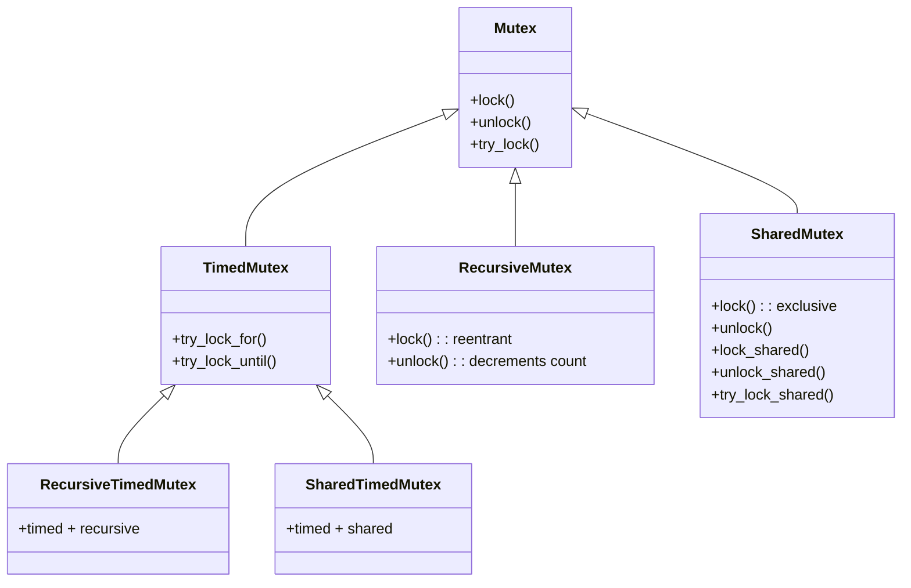
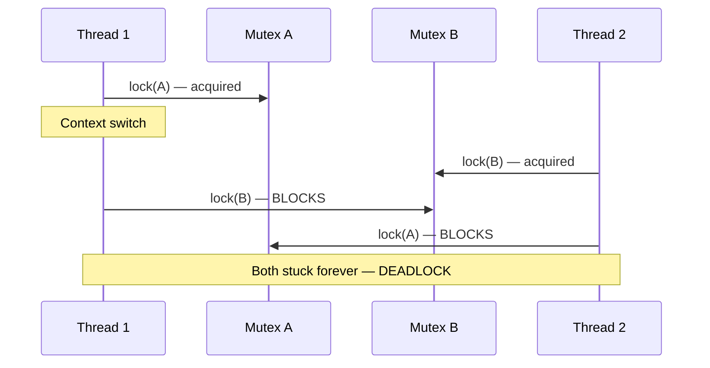
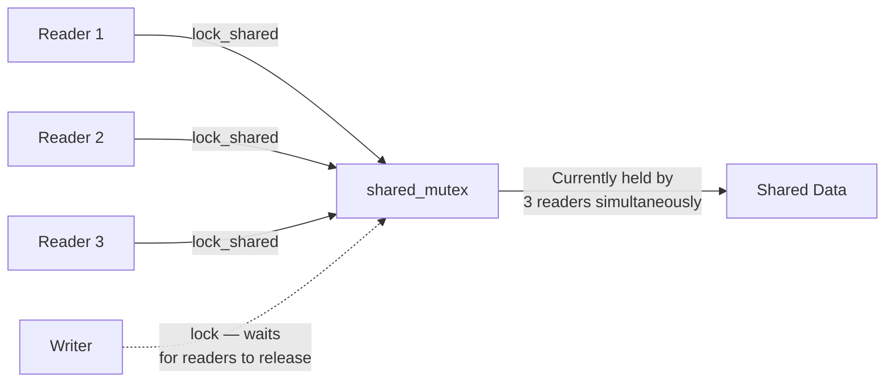

# 5.6. C++ Mutex Family and RAII Lock Management

> **Why this note exists.** Once you have multiple threads sharing data (§5.5), you need to protect it. C++ provides a rich family of mutexes and — critically — a set of RAII wrappers that make locking exception-safe. The single biggest difference between amateur and professional C++ concurrency code is **whether they use RAII lock guards or call `lock()/unlock()` manually.** Manual unlocking is almost always wrong. This note explains the entire mutex family and how to use it safely.

---

## 1. The Mutex Family Tree



### 1.1 The Six Standard Mutex Types

| Type | Header | Reentrant? | Timed? | Shared (RW)? |
| :--- | :--- | :--- | :--- | :--- |
| `std::mutex` | `<mutex>` | No | No | No |
| `std::timed_mutex` | `<mutex>` | No | Yes | No |
| `std::recursive_mutex` | `<mutex>` | Yes | No | No |
| `std::recursive_timed_mutex` | `<mutex>` | Yes | Yes | No |
| `std::shared_mutex` | `<shared_mutex>` (C++17) | No | No | Yes |
| `std::shared_timed_mutex` | `<shared_mutex>` (C++14) | No | Yes | Yes |

### 1.2 What Each Feature Means

- **Reentrant:** The same thread can call `lock()` multiple times without deadlocking. The mutex tracks an acquisition count; `unlock()` decrements it; the mutex is actually released when count reaches 0.
- **Timed:** Supports `try_lock_for(duration)` and `try_lock_until(time_point)`, which return `false` after the timeout instead of blocking forever.
- **Shared (Reader/Writer):** Allows multiple "readers" to hold the lock simultaneously (`lock_shared()`) OR one "writer" to hold it exclusively (`lock()`). Useful for read-heavy data structures.

---

## 2. `std::mutex` — The Basic Mutex

### 2.1 API

```cpp
std::mutex m;

m.lock();          // Block until acquired
// ... critical section ...
m.unlock();        // Release

if (m.try_lock()) {
    // ... critical section ...
    m.unlock();
} else {
    // Someone else has it; do something else
}
```

### 2.2 The Three Rules of Manual Locking

1. **Never call `lock()` without a matching `unlock()`** on every path (including exceptions).
2. **Never call `unlock()` on a mutex you don't own** — undefined behavior.
3. **Never call `lock()` again from the same thread** without an intervening `unlock()` — undefined behavior (deadlock on most platforms).

These rules are so easy to violate that **manual locking is considered an anti-pattern** in modern C++. Use RAII wrappers (§3 below).

### 2.3 The Exception Safety Problem

```cpp
std::mutex m;
void risky() {
    m.lock();
    do_work_that_might_throw();   // If this throws...
    m.unlock();                   // ...this never runs!
}
```

If `do_work_that_might_throw()` throws, the mutex is **never unlocked**. Every subsequent attempt to lock it deadlocks forever.

**The fix:** RAII.

---

## 3. RAII Lock Wrappers

C++ solves the manual-unlocking problem with three RAII classes that acquire the lock in their constructor and release it in their destructor.

### 3.1 `std::lock_guard<Mutex>` — Strictly Scoped

```cpp
#include <mutex>

std::mutex m;

void safe() {
    std::lock_guard<std::mutex> lock(m);   // Acquires
    do_work_that_might_throw();            // Exception? ~lock_guard runs.
}                                          // ~lock_guard releases
```

`lock_guard` is the simplest wrapper:
- Constructor acquires the lock.
- Destructor releases the lock.
- **No other methods.** You cannot manually unlock, move, or transfer it.

**Use `lock_guard` whenever you don't need flexibility.** It has zero runtime overhead vs. manual locking (the compiler optimizes the wrapper away).

### 3.2 `std::unique_lock<Mutex>` — Flexible

```cpp
std::mutex m;

void flexible() {
    std::unique_lock<std::mutex> lock(m);   // Acquires

    lock.unlock();                          // Manually unlock
    do_unprotected_work();
    lock.lock();                            // Manually re-lock

    // Can be moved:
    std::unique_lock<std::mutex> other = std::move(lock);

    // Can be queried:
    if (lock.owns_lock()) { /* ... */ }

    // Can defer locking:
    std::unique_lock<std::mutex> deferred(m, std::defer_lock);
    // ... do stuff ...
    deferred.lock();
}
```

`unique_lock` is movable (but not copyable) and supports:
- **Deferred locking** (`std::defer_lock`): construct without locking.
- **Try-locking** (`std::try_to_lock`): try to lock, don't block.
- **Adopt-locking** (`std::adopt_lock`): assume the mutex is already locked by this thread; just take ownership.
- **Manual `lock()`/`unlock()`**.
- **`owns_lock()`**: query whether it currently holds the lock.
- **`release()`**: release ownership (return the mutex pointer, don't unlock).

`unique_lock` is required when:
- You need to lock multiple mutexes with `std::lock()` (which uses deadlock-avoidance algorithms).
- You need to pass the lock to a `condition_variable` (it requires `unique_lock`).
- You need to manually unlock/re-lock for performance (e.g., release the lock while doing I/O).

`unique_lock` has slightly more overhead than `lock_guard` (it tracks ownership state), but the overhead is typically negligible.

### 3.3 `std::scoped_lock<...>` — Multi-Mutex (C++17)

```cpp
std::mutex m1, m2;

void transfer(Account& from, Account& to, int amount) {
    std::scoped_lock lock(m1, m2);   // Locks BOTH, deadlock-free
    // ... atomic transfer ...
}   // Unlocks both
```

`scoped_lock` is variadic — it can lock any number of mutexes **with deadlock avoidance**. Internally, it uses `std::lock(m1, m2, ...)` which uses a deadlock-avoidance algorithm (lock mutexes in a consistent order, or use try-and-back-off).

**`scoped_lock` with one argument is functionally identical to `lock_guard`** — use `scoped_lock` for everything in C++17+ code for consistency.

### 3.4 Class Template Argument Deduction (CTAD)
Since C++17, you can omit the template argument:

```cpp
std::mutex m;
std::lock_guard lock(m);   // CTAD deduces lock_guard<std::mutex>
std::scoped_lock lock2(m1, m2);   // CTAD
```

The compiler figures out the right type from the constructor arguments.

---

## 4. Deadlock and How to Avoid It

### 4.1 The Classic Deadlock Pattern

```cpp
std::mutex account_a_mutex, account_b_mutex;

void transfer_a_to_b(int amount) {
    std::lock_guard<std::mutex> la(account_a_mutex);   // Lock A first
    std::lock_guard<std::mutex> lb(account_b_mutex);   // Then B
    // ...
}

void transfer_b_to_a(int amount) {
    std::lock_guard<std::mutex> lb(account_b_mutex);   // Lock B first
    std::lock_guard<std::mutex> la(account_a_mutex);   // Then A
}
```

If thread 1 is in `transfer_a_to_b` (holds A, waiting for B) and thread 2 is in `transfer_b_to_a` (holds B, waiting for A), neither can ever make progress. This is the **AB-BA deadlock**.



### 4.2 Solution 1: Always Lock in the Same Order
Pick a global order (e.g., by memory address) and always lock in that order:

```cpp
void transfer(Account& from, Account& to, int amount) {
    auto* first = &from < &to ? &from.mutex : &to.mutex;
    auto* second = &from < &to ? &to.mutex : &from.mutex;
    std::lock_guard<std::mutex> l1(*first);
    std::lock_guard<std::mutex> l2(*second);
    // ...
}
```

This works but is error-prone — every developer must remember the rule.

### 4.3 Solution 2: `std::lock()` with Deadlock Avoidance
`std::lock(m1, m2, ...)` uses a deadlock-avoidance algorithm (lock all mutexes using try-and-back-off). Combined with `std::adopt_lock`:

```cpp
std::mutex m1, m2;
void f() {
    std::lock(m1, m2);                                  // Locks both, deadlock-free
    std::lock_guard<std::mutex> l1(m1, std::adopt_lock);  // Adopt (already locked)
    std::lock_guard<std::mutex> l2(m2, std::adopt_lock);
    // ...
}
```

### 4.4 Solution 3: `std::scoped_lock` (C++17, Recommended)
`std::scoped_lock` does this for you:

```cpp
std::mutex m1, m2;
void f() {
    std::scoped_lock lock(m1, m2);   // Locks both, deadlock-free, exception-safe
    // ...
}
```

This is the **modern idiomatic way** to lock multiple mutexes.

### 4.5 Lock Hierarchies
For complex systems, a **lock hierarchy** can prevent deadlocks: assign each mutex a "level" and require that locks are always acquired in increasing level order. Violations are caught at runtime. This is the technique used in the Linux kernel.

```cpp
class hierarchical_mutex {
    std::mutex internal_mutex;
    unsigned long const hierarchy_value;
    unsigned long previous_hierarchy_value;
    static thread_local unsigned long this_thread_hierarchy_value;

    void check_for_hierarchy_violation() {
        if (hierarchy_value >= this_thread_hierarchy_value) {
            throw std::logic_error("mutex hierarchy violated");
        }
    }
    void update_hierarchy_value() {
        previous_hierarchy_value = this_thread_hierarchy_value;
        this_thread_hierarchy_value = hierarchy_value;
    }
public:
    explicit hierarchical_mutex(unsigned long value)
        : hierarchy_value(value), previous_hierarchy_value(0) {}

    void lock() {
        check_for_hierarchy_violation();
        internal_mutex.lock();
        update_hierarchy_value();
    }
    void unlock() {
        this_thread_hierarchy_value = previous_hierarchy_value;
        internal_mutex.unlock();
    }
    bool try_lock() {
        check_for_hierarchy_violation();
        if (!internal_mutex.try_lock()) return false;
        update_hierarchy_value();
        return true;
    }
};

thread_local unsigned long hierarchical_mutex::this_thread_hierarchy_value(ULONG_MAX);
```

(Adapted from Anthony Williams, *C++ Concurrency in Action*.)

---

## 5. `std::recursive_mutex` — When to Use (Hint: Almost Never)

A `recursive_mutex` allows the same thread to acquire it multiple times. Each `lock()` increments a counter; each `unlock()` decrements it; the mutex is released when the counter reaches 0.

### 5.1 The Use Case

```cpp
std::recursive_mutex m;

void f() {
    std::lock_guard<std::recursive_mutex> lock(m);
    g();   // g also locks m
}

void g() {
    std::lock_guard<std::recursive_mutex> lock(m);
    // ...
}
```

With a regular `std::mutex`, calling `g()` from `f()` would deadlock. With `recursive_mutex`, it works.

### 5.2 Why It's Usually a Code Smell

Recursive mutexes are usually a sign of **poor design**. If `g()` is sometimes called from a context that holds the lock and sometimes not, your code has implicit state coupling. Better alternatives:

- **Split `g` into `g_locked` (assumes lock held) and `g` (locks then calls `g_locked`).** This makes the locking contract explicit.
- **Refactor so `f` doesn't hold the lock while calling `g`.** Move the locked section to be smaller.

### 5.3 Performance Cost
`recursive_mutex` is slower than `mutex`:
- It must track ownership (the thread id).
- It must maintain a counter.
- It must check ownership on every `lock()`.

If you don't need reentrancy, use `std::mutex`.

### 5.4 The Foot-Gun
A `recursive_mutex` can hide bugs:

```cpp
std::recursive_mutex m;
void f() {
    std::lock_guard<std::recursive_mutex> lock(m);
    // ... modify shared state ...
    if (something_went_wrong) {
        // We expect this to deadlock, but it doesn't!
        // The recursive_mutex hides the bug.
        g();
    }
}
```

Use `recursive_mutex` only when you have a clear, documented reason.

---

## 6. `std::shared_mutex` — Reader/Writer Lock (C++17)

For data structures that are read frequently but written rarely, a `shared_mutex` allows multiple readers OR one writer.

### 6.1 API

```cpp
std::shared_mutex rw_mutex;

// Writer:
void write_data(int new_value) {
    std::unique_lock<std::shared_mutex> lock(rw_mutex);  // Exclusive lock
    data = new_value;
}

// Reader:
int read_data() {
    std::shared_lock<std::shared_mutex> lock(rw_mutex);  // Shared lock
    return data;
}
```

- `lock()` / `unlock()`: exclusive (writer) access.
- `lock_shared()` / `unlock_shared()`: shared (reader) access. Multiple readers can hold simultaneously.
- `std::shared_lock<M>` (in `<shared_mutex>`) is the RAII wrapper for shared locking.

### 6.2 When to Use



Reader/writer locks make sense when:
- Reads vastly outnumber writes (10:1 or more).
- The critical section is non-trivial (so the overhead of the shared_mutex is amortized).
- Contention is high (many threads competing).

**Don't use `shared_mutex` for tiny critical sections** — its overhead is higher than a plain mutex, and for short sections, plain `mutex` is faster.

### 6.3 Writer Starvation
A naive `shared_mutex` implementation can starve writers: as long as readers keep coming, the writer never gets exclusive access. C++ standard library implementations typically use writer-preference, but check your implementation's docs.

---

## 7. `std::call_once` — One-Time Initialization

For thread-safe lazy initialization, use `std::call_once` instead of double-checked locking:

```cpp
#include <mutex>

std::once_flag init_flag;
ExpensiveResource* resource = nullptr;

void ensure_initialized() {
    std::call_once(init_flag, []() {
        resource = new ExpensiveResource();   // Runs exactly once
    });
}
```

`std::call_once` guarantees:
- The callable runs **exactly once**, even if multiple threads call it concurrently.
- All threads that call it synchronize with the one that ran the callable.
- It's exception-safe: if the callable throws, it's considered "not run" and the next caller will try again.

### 7.1 vs. `static` Local Variables (Meyers Singleton)
Since C++11, **static local variable initialization is thread-safe** by the language standard:

```cpp
ExpensiveResource& get_resource() {
    static ExpensiveResource instance;   // Thread-safe since C++11
    return instance;
}
```

This is simpler and preferred when possible. Use `std::call_once` only when the initialization cannot be expressed as a static local (e.g., when it depends on multiple variables or needs to be triggered by an event).

---

## 8. Putting It Together — A Thread-Safe Counter

### 8.1 Naive (Bug: race condition)
```cpp
class Counter {
    int count_ = 0;
public:
    void increment() { ++count_; }    // RACE!
    int get() const { return count_; }  // RACE!
};
```

### 8.2 With `std::mutex` (Correct but coarse)
```cpp
class Counter {
    mutable std::mutex m_;   // mutable: can lock in const methods
    int count_ = 0;
public:
    void increment() {
        std::lock_guard<std::mutex> lock(m_);
        ++count_;
    }
    int get() const {
        std::lock_guard<std::mutex> lock(m_);
        return count_;
    }
};
```

### 8.3 With `std::atomic` (Best for simple counters)
```cpp
#include <atomic>
class Counter {
    std::atomic<int> count_{0};
public:
    void increment() { ++count_; }   // Atomic, no lock needed
    int get() const { return count_.load(); }
};
```

For simple integer operations, `std::atomic` (covered in §5.8) is faster than a mutex.

### 8.4 With `std::shared_mutex` (For read-heavy counters)
```cpp
class Counter {
    mutable std::shared_mutex m_;
    int count_ = 0;
public:
    void increment() {
        std::unique_lock<std::shared_mutex> lock(m_);
        ++count_;
    }
    int get() const {
        std::shared_lock<std::shared_mutex> lock(m_);
        return count_;
    }
};
```

If `get()` is called 1000× more often than `increment()`, this is significantly faster than the `std::mutex` version.

---

## 9. Common Pitfalls and Reminders

1. **"My program deadlocks with two mutexes."** You locked them in different orders in different functions. Use `std::scoped_lock(m1, m2)` which avoids deadlock automatically.

2. **"My destructor hangs."** You're holding a lock while destroying an object that another thread is waiting on. Re-examine your shutdown sequence.

3. **"I locked, then called a function that also locks."** With `std::mutex`, you deadlocked. With `std::recursive_mutex`, you didn't — but you might have a design smell. Refactor.

4. **"My `try_lock()` returns false unexpectedly."** Another thread holds the lock. That's the whole point of `try_lock`. If you didn't expect contention, you have a bug in your design.

5. **"My reader/writer lock is slower than a plain mutex."** `shared_mutex` has higher overhead than `mutex`. For tiny critical sections, plain `mutex` wins. Only use `shared_mutex` when reads dominate and critical sections are non-trivial.

6. **"I forgot `mutable` on my mutex."** If your mutex is a member of a class with `const` methods that need to lock, declare it `mutable`. Otherwise you can't lock in `const` methods.

7. **"I returned a reference from a locked function."** The lock is released when the function returns, but the caller still has the reference — they're now accessing the data unprotected. Return by value, or have the caller hold the lock.

8. **"I'm locking inside a tight loop."** Each lock/unlock is a syscall if contended. Batch your work: do as much as possible while holding the lock, then release.

9. **"`lock_guard` vs `unique_lock`?"** Default to `lock_guard` (cheapest). Use `unique_lock` only when you need to defer locking, manually unlock, or work with `condition_variable`.

10. **"In C++17+, what should I use?"** Default to `std::scoped_lock` for everything — it's the most flexible (handles 1 or N mutexes with deadlock avoidance) and has zero overhead for the single-mutex case.

---

> **Next note.** §5.7 covers **`std::condition_variable`** (the C++ equivalent of Python's `threading.Condition`) and **futures** (`std::promise`, `std::future`, `std::async`, `std::packaged_task`) — the two mechanisms C++ provides for one thread to wait for an event or result from another thread.
