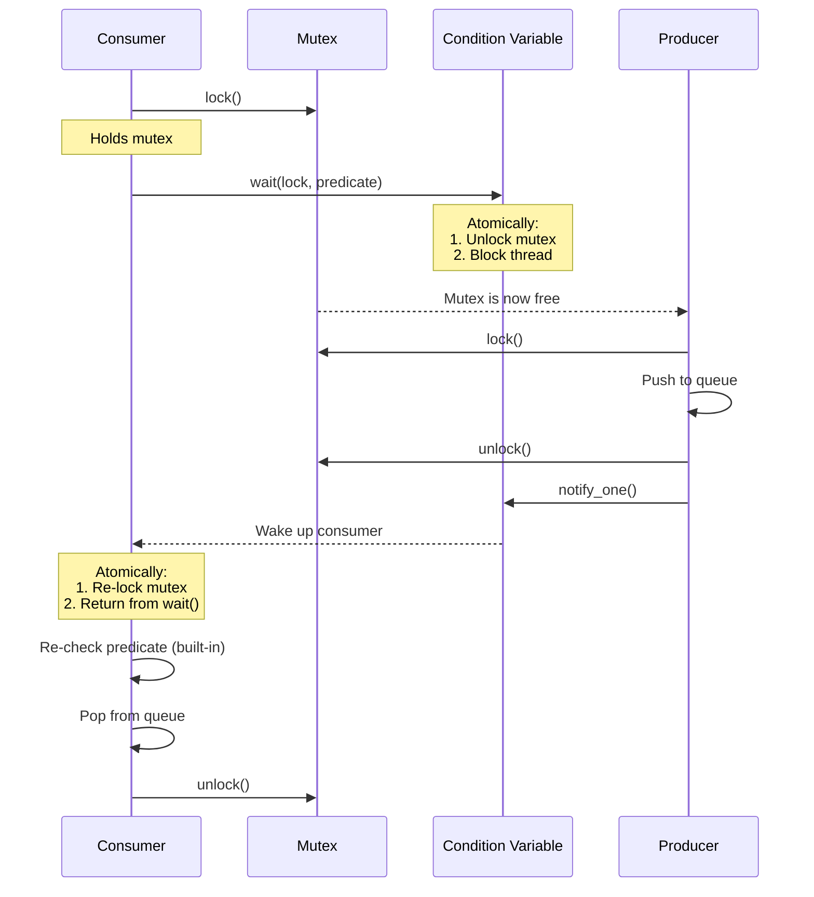
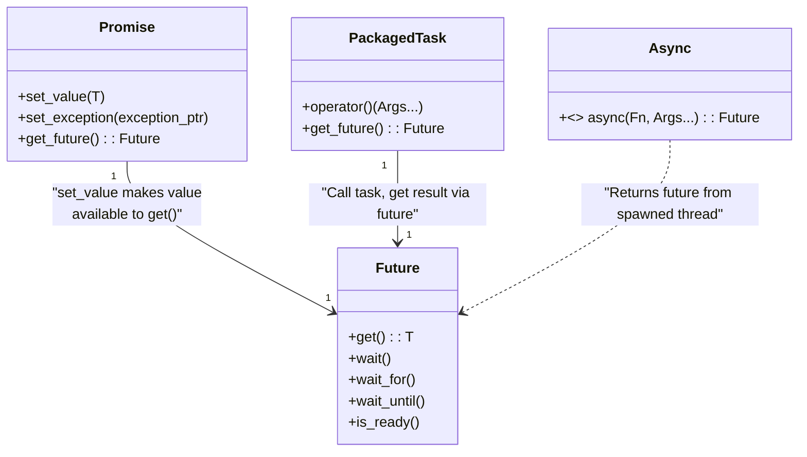
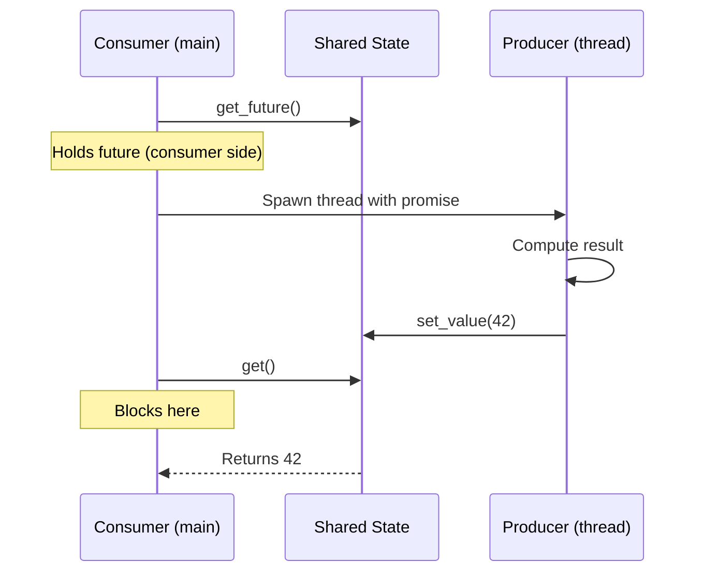
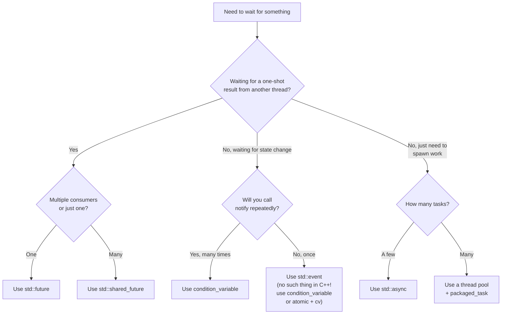

# 5.7. C++ Condition Variables and Future-Based Synchronization

> **Why this note exists.** Mutexes (§5.6) protect data, but they don't solve the **waiting** problem: how does thread A wait until thread B has produced a result, or until some shared state reaches a certain value? Naively, you could spin-wait with `while (!ready);` — but that burns CPU. C++ provides two solutions: **`std::condition_variable`** for general event waiting, and **`std::future` / `std::promise` / `std::async`** for one-shot result-returning synchronization. This note covers both in exhaustive detail.

---

## 1. The Problem with Spin-Waiting

```cpp
std::atomic<bool> ready{false};

// Thread 2:
while (!ready.load()) {
    // Burn CPU
}
do_work();
```

This **spin-wait** has two problems:

1. **Wastes CPU.** The thread runs at 100% on its core, doing nothing useful.
2. **Memory bandwidth.** Even with `std::atomic`, each `load()` may hit memory (depending on memory order, see §5.8), saturating the memory bus.

You could add `std::this_thread::yield()` to be polite to the scheduler:

```cpp
while (!ready.load()) {
    std::this_thread::yield();
}
```

But this is still polling. The right solution is to **sleep until the event happens** — and that's exactly what `condition_variable` provides.

---

## 2. `std::condition_variable` — The Event-Wait Primitive

A condition variable lets one thread **wait** for a state change that another thread **signals**. It always works with a mutex (the mutex protects the shared state being waited on).

### 2.1 The Three-Operation API

- `wait(unique_lock<mutex>& lock)`: **atomically** unlocks the mutex and blocks the calling thread. When notified, **re-locks** the mutex before returning.
- `wait(unique_lock<mutex>& lock, Predicate pred)`: equivalent to `while (!pred()) wait(lock);`. **Always use this form** — it handles spurious wakeups.
- `notify_one()`: wake up one waiting thread (chosen by the OS).
- `notify_all()`: wake up **all** waiting threads (the "thundering herd").

### 2.2 The Canonical Pattern — Producer/Consumer

```cpp
#include <mutex>
#include <condition_variable>
#include <queue>
#include <thread>

std::queue<int> q;
std::mutex m;
std::condition_variable cv;

void producer() {
    for (int i = 0; i < 100; ++i) {
        {
            std::lock_guard<std::mutex> lock(m);
            q.push(i);
        }   // Release lock BEFORE notifying
        cv.notify_one();
    }
}

void consumer() {
    while (true) {
        std::unique_lock<std::mutex> lock(m);
        cv.wait(lock, []() { return !q.empty(); });   // Loop is built-in
        int item = q.front();
        q.pop();
        lock.unlock();   // Process outside the lock
        process(item);
        if (item == 99) break;
    }
}
```

### 2.3 Why `wait()` Reacquires the Lock



The atomicity of "unlock + block" is the entire reason condition variables exist. If they were separate operations, you'd have a race:

1. Consumer checks predicate (false).
2. Consumer unlocks mutex.
3. **Producer runs, changes state, calls notify_one() — but no one is waiting yet!**
4. Consumer calls wait() — blocks forever, missed the notification.

The `wait()` function makes steps 2 and 4 atomic, eliminating this race.

### 2.4 Spurious Wakeups
A subtle but well-documented issue: `wait()` may return **even if `notify_one()` was not called**. This is allowed by the POSIX standard and is a real behavior on some hardware (it simplifies implementation of condition variables on certain architectures).

**This is why you must always use the predicate form:**

```cpp
// BAD — may return without notification
cv.wait(lock);

// GOOD — re-checks predicate on every wake
cv.wait(lock, []() { return !q.empty(); });

// EQUIVALENT MANUAL FORM
std::unique_lock<std::mutex> lock(m);
while (q.empty()) {
    cv.wait(lock);
}
```

> **Critical reminder.** Never use `cv.wait(lock)` without a `while` loop or a predicate. The single-argument form is essentially a bug magnet.

### 2.5 `notify_one()` vs `notify_all()`

- **`notify_one()`**: Wake up one waiter (the OS picks which one). Use when:
  - Each unit of work can be handled by exactly one thread (e.g., queue items).
  - You want to avoid the "thundering herd" of waking everyone.
- **`notify_all()`**: Wake up all waiters. Use when:
  - Multiple threads are waiting for different predicates on the same CV (rare — better to use separate CVs).
  - All waiters can make progress on the new state (e.g., a barrier-style wakeup).

```mermaid
graph TB
    subgraph "notify_one (Targeted)"
        W1[Waiter 1] -->|Sleeping| CV1[cv]
        W2[Waiter 2] -->|Sleeping| CV1
        W3[Waiter 3] -->|Sleeping| CV1
        N1[Notifier] -->|notify_one| CV1
        CV1 -->|Wakes ONE (e.g., W2)| AWake[W2 runs]
        W1 -.->|Still sleeping| CV1
        W3 -.->|Still sleeping| CV1
    end
```

### 2.6 Timed Waits
```cpp
std::unique_lock<std::mutex> lock(m);
if (cv.wait_for(lock, std::chrono::seconds(5), []() { return !q.empty(); })) {
    // Predicate is true within 5 seconds
    int item = q.front();
    q.pop();
} else {
    // Timed out
}
```

`wait_for` returns `true` if the predicate became true, `false` if the timeout expired.

---

## 3. Futures — One-Shot Result Synchronization

A **future** represents a value that will be available at some point in the future. It's the C++ equivalent of Python's `concurrent.futures.Future`. The C++ model has four interacting pieces:



### 3.1 The Three Ways to Get a Future

1. **`std::promise<T>` + `std::future<T>`**: Explicit producer/consumer. The producer thread holds a promise, the consumer holds the corresponding future.
2. **`std::packaged_task<F>`**: Wrap a callable; when called, the result is delivered to a future.
3. **`std::async(LaunchPolicy, Fn, Args...)`**: High-level wrapper that spawns a thread (or defers) and returns a future.

### 3.2 `std::promise` and `std::future`

```cpp
#include <future>
#include <thread>
#include <iostream>

void producer(std::promise<int> p) {
    std::this_thread::sleep_for(std::chrono::seconds(1));
    p.set_value(42);   // The corresponding future's get() will return 42
}

int main() {
    std::promise<int> p;
    std::future<int> f = p.get_future();   // Get the consumer side
    std::thread t(producer, std::move(p)); // Promise must be moved into thread
    std::cout << "Waiting for result...\n";
    int result = f.get();                  // Blocks until p.set_value() is called
    std::cout << "Got: " << result << "\n";
    t.join();
}
```

#### The Promise/Future Relationship



### 3.3 Key Behaviors

- **`promise` is move-only.** You cannot copy it — you must move it into the producing thread.
- **`future` is move-only.** Only one thread can call `get()` on a future.
- **`get()` can be called exactly once.** Calling it twice is undefined behavior (typically crashes).
- **`set_value()` can be called exactly once.** Calling it twice throws `future_error`.
- **`get()` re-throws exceptions.** If the producer called `set_exception()`, `get()` re-raises it in the consumer.

### 3.4 Exception Propagation

```cpp
void producer(std::promise<int> p) {
    try {
        throw std::runtime_error("oops");
    } catch (...) {
        p.set_exception(std::current_exception());   // Propagate to consumer
    }
}

int main() {
    std::promise<int> p;
    std::future<int> f = p.get_future();
    std::thread t(producer, std::move(p));
    try {
        int result = f.get();   // Re-throws std::runtime_error
    } catch (const std::exception& e) {
        std::cerr << "Caught: " << e.what() << "\n";
    }
    t.join();
}
```

This is the **standard way to propagate exceptions across threads** in C++. Without it, exceptions in thread functions call `std::terminate()` (see §5.5).

---

## 4. `std::packaged_task` — Wrapping a Callable

`std::packaged_task` binds a callable to a future. When the task is invoked, its return value is set on the future.

```cpp
#include <future>
#include <iostream>

int compute(int x) { return x * 2; }

int main() {
    std::packaged_task<int(int)> task(compute);
    std::future<int> f = task.get_future();

    task(21);   // Run the task (synchronously in this thread)
    std::cout << f.get() << "\n";   // 42
}
```

### 4.1 Use Case: Thread Pools

`packaged_task` is the standard way to submit work to a thread pool:

```cpp
class ThreadPool {
    std::queue<std::function<void()>> tasks_;
    std::vector<std::thread> workers_;
    std::mutex m_;
    std::condition_variable cv_;
    bool stop_ = false;
public:
    ThreadPool(size_t n) {
        for (size_t i = 0; i < n; ++i) {
            workers_.emplace_back([this]() {
                while (true) {
                    std::function<void()> task;
                    {
                        std::unique_lock<std::mutex> lock(m_);
                        cv_.wait(lock, [this]() { return stop_ || !tasks_.empty(); });
                        if (stop_ && tasks_.empty()) return;
                        task = std::move(tasks_.front());
                        tasks_.pop();
                    }
                    task();
                }
            });
        }
    }

    template<typename F, typename... Args>
    auto submit(F&& f, Args&&... args) -> std::future<decltype(f(args...))> {
        using RetType = decltype(f(args...));
        auto task = std::make_shared<std::packaged_task<RetType()>>(
            std::bind(std::forward<F>(f), std::forward<Args>(args)...)
        );
        std::future<RetType> result = task->get_future();
        {
            std::lock_guard<std::mutex> lock(m_);
            tasks_.emplace([task]() { (*task)(); });
        }
        cv_.notify_one();
        return result;
    }

    ~ThreadPool() {
        {
            std::lock_guard<std::mutex> lock(m_);
            stop_ = true;
        }
        cv_.notify_all();
        for (auto& w : workers_) w.join();
    }
};
```

Now clients can submit work and get a future:

```cpp
ThreadPool pool(4);
std::future<int> f = pool.submit(compute, 21);
std::cout << f.get() << "\n";   // 42
```

---

## 5. `std::async` — The High-Level API

`std::async` is the simplest way to run a function asynchronously and get a future:

```cpp
#include <future>

int compute(int x) { return x * 2; }

int main() {
    std::future<int> f = std::async(std::launch::async, compute, 21);
    // ... do other work ...
    int result = f.get();   // 42
}
```

### 5.1 Launch Policies

- **`std::launch::async`**: Spawn a new thread. The function runs concurrently.
- **`std::launch::deferred`**: Defer execution until `get()` is called. The function runs **synchronously in the calling thread** when `get()` is invoked.
- **`std::launch::async | std::launch::deferred`** (the default): The implementation chooses. **Most implementations defer** unless the system is idle, which is usually not what you want.

> **Critical reminder.** The default launch policy (`async | deferred`) is a known foot-gun. **Always specify `std::launch::async` explicitly** unless you specifically want deferred execution. Otherwise, you may discover at runtime that your "concurrent" code is actually running synchronously.

### 5.2 The `std::async` Destructor Trap

```cpp
void dangerous() {
    auto f = std::async(std::launch::async, []() {
        std::this_thread::sleep_for(std::chrono::seconds(10));
    });
    // f's destructor BLOCKS until the async task completes!
}
// This function takes 10 seconds to return.
```

Unlike `std::thread` (which calls `std::terminate` if not joined), `std::future` from `std::async` **blocks in its destructor** until the task completes. This is by design (it ensures the task's locals are valid), but it's surprising.

**Implication:** Don't store `std::async` futures in a vector expecting parallelism:

```cpp
std::vector<std::future<int>> futures;
for (int i = 0; i < 10; ++i) {
    futures.push_back(std::async(std::launch::async, compute, i));
    // Each push may block waiting for the previous future to be destroyed!
}
```

Actually, this case is fine because the futures are stored in the vector (not destroyed). But:

```cpp
for (int i = 0; i < 10; ++i) {
    auto f = std::async(std::launch::async, compute, i);   // Temporary
    // f is destroyed at end of iteration — blocks until compute(i) finishes!
}
// Runs sequentially, not in parallel.
```

This is the **"fake parallelism" bug**. The fix: store the futures somewhere and wait on them all at the end.

### 5.3 When to Use `std::async`

- **Quick parallelization** of a handful of independent operations.
- **Prototyping** before deciding on a thread pool.
- **When you don't need fine-grained control** over thread management.

For production code with many tasks, a **thread pool** is better than spawning many `std::async` calls (each `async` with `launch::async` creates a new thread).

---

## 6. `std::shared_future` — Multiple Consumers

`std::future` is single-consumer: only one thread can call `get()`. If multiple threads need the result, use `std::shared_future`:

```cpp
std::promise<int> p;
std::shared_future<int> sf = p.get_future().share();   // Convert

// Multiple threads can call sf.get() — all get the same value
std::thread t1([sf]() { std::cout << "t1: " << sf.get() << "\n"; });
std::thread t2([sf]() { std::cout << "t2: " << sf.get() << "\n"; });

p.set_value(42);
t1.join(); t2.join();
```

`shared_future` is copyable (unlike `future`). All copies share the same underlying state. `get()` can be called multiple times from multiple threads.

---

## 7. A Complete Example — Parallel Web Crawler Skeleton

Putting it all together: a simple parallel fetcher using `std::async`:

```cpp
#include <future>
#include <vector>
#include <string>
#include <iostream>

std::string fetch_url(const std::string& url) {
    // Imagine this does real HTTP
    std::this_thread::sleep_for(std::chrono::milliseconds(100));
    return "content of " + url;
}

int main() {
    std::vector<std::string> urls = {
        "https://a.com", "https://b.com", "https://c.com", "https://d.com"
    };

    // Launch all fetches in parallel
    std::vector<std::future<std::string>> futures;
    for (const auto& url : urls) {
        futures.push_back(std::async(std::launch::async, fetch_url, url));
    }

    // Collect results as they complete
    for (size_t i = 0; i < futures.size(); ++i) {
        try {
            std::string content = futures[i].get();
            std::cout << urls[i] << " -> " << content << "\n";
        } catch (const std::exception& e) {
            std::cerr << urls[i] << " failed: " << e.what() << "\n";
        }
    }
}
```

### Notes:
- Each `std::async` call spawns a thread (no pooling, so this is fine for ~10 URLs but not 10,000).
- `futures[i].get()` blocks until that specific future completes, but other futures continue running in parallel.
- Exceptions are propagated per-fetch — one failure doesn't kill the others.

---

## 8. Choosing the Right Synchronization Primitive



---

## 9. Common Pitfalls and Reminders

1. **"My condition_variable wait returned but the predicate was false."** Spurious wakeup. Use the predicate form: `cv.wait(lock, predicate)`.

2. **"I called notify_one() before the consumer started waiting, and it missed the notification."** This is correct behavior. Use the predicate form — the consumer checks the predicate before waiting, so it won't miss the state change.

3. **"My future.get() returns twice and crashes."** `get()` can only be called once. If multiple consumers need the result, use `shared_future`.

4. **"std::async seems to run sequentially."** Either you forgot `std::launch::async`, or you're letting futures go out of scope (blocking in destructors).

5. **"My producer called set_value() but the consumer is still blocked."** Check that you actually moved the promise into the producer thread, and that the producer thread actually runs.

6. **"I called cv.wait() without holding the lock."** Undefined behavior. `wait()` requires a `unique_lock<mutex>` that is currently held by this thread.

7. **"I notified all waiters but only one made progress."** That's correct — `notify_all()` wakes everyone, but they all re-check the predicate and re-wait if it's not satisfied.

8. **"My future returned but I have no idea if it was from a real thread or deferred."** Use `future.wait_for(std::chrono::seconds(0))` — returns `std::future_status::deferred` if the task hasn't started. This is the standard idiom for checking.

9. **"I want to wait for any of N futures to complete."** There's no built-in "wait for any" in standard C++. The pattern is to poll each future with `wait_for(0)` in a loop, or use a `promise` that all the workers notify. C++26 may add `when_any`.

10. **"My thread pool task threw an exception."** The exception is stored in the future. Call `f.get()` to retrieve it; if you never call `get()`, the exception is silently discarded.

---

> **Next note.** §5.8 covers **`std::atomic`** — the foundation of lock-free programming. Atomics let you perform operations on shared data without using a mutex, which is dramatically faster for simple operations. We'll also cover **memory ordering**, the most subtle and dangerous topic in all of concurrency.
