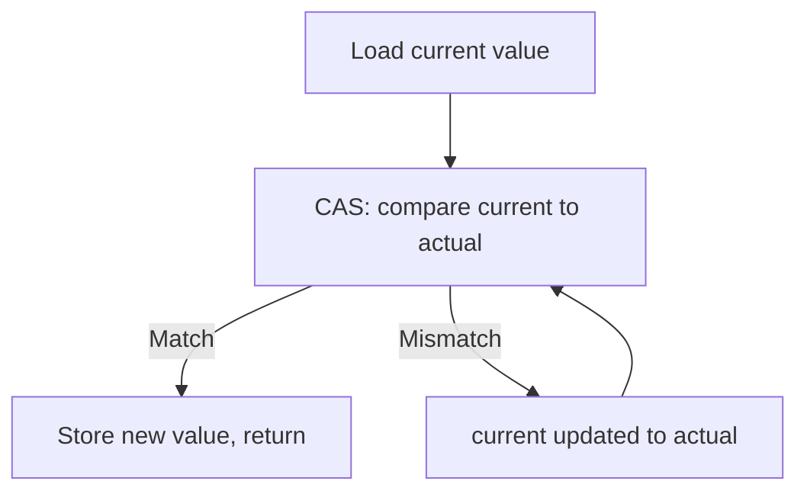
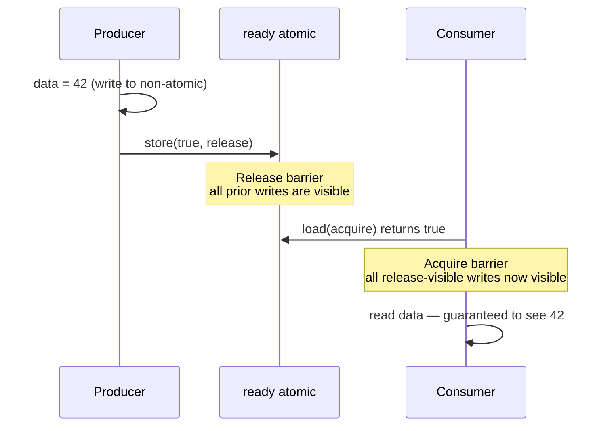
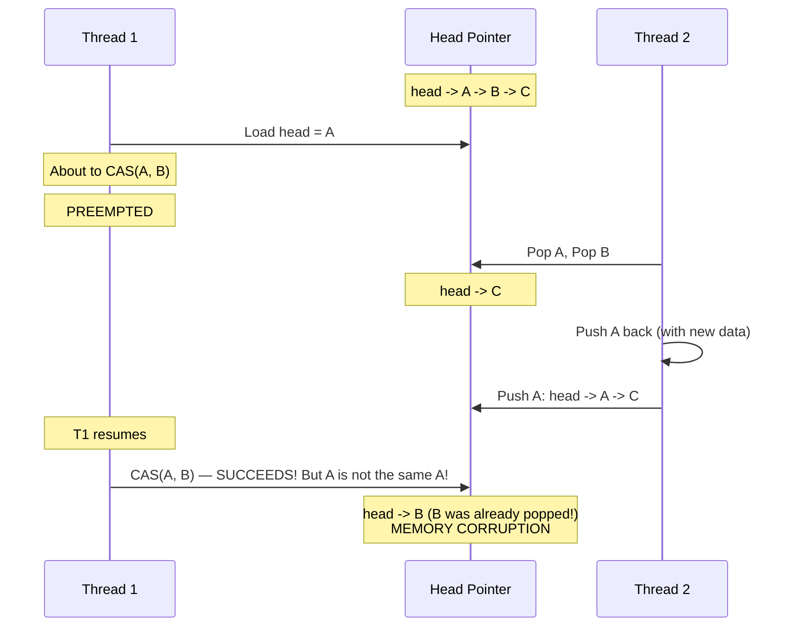

# 5.8. C++ Atomic Operations and Memory Ordering

> **Why this note exists.** Mutexes are expensive. Each lock/unlock pair involves a system call (when contended) plus the cost of putting threads to sleep and waking them up. For simple operations — incrementing a counter, setting a flag, swapping a pointer — a mutex is overkill. **`std::atomic`** lets you perform these operations directly on hardware-supported atomic instructions, which are 10–100× faster than a mutex. But atomics introduce **memory ordering**: subtle rules about how the CPU and compiler may reorder memory operations around atomics. Getting this wrong causes bugs that are nearly impossible to reproduce. This note covers the full picture.

---

## 1. The Problem Atomics Solve

Recall the race condition from §5.2 (Python) and §5.6 (C++): `counter += 1` is not atomic because it loads, increments, and stores. Without protection, two threads can both load `0`, both compute `1`, and both store `1` — losing one increment.

### 1.1 Solution 1: Mutex
```cpp
std::mutex m;
int counter = 0;
void increment() {
    std::lock_guard<std::mutex> lock(m);
    ++counter;
}
```
Costs ~100 ns per increment (uncontended) up to microseconds (contended).

### 1.2 Solution 2: `std::atomic`
```cpp
std::atomic<int> counter{0};
void increment() {
    ++counter;   // Atomic increment
}
```
Costs ~5 ns per increment (single instruction on x86). **20× faster.**

### 1.3 Why Not Just `volatile`?
A common beginner mistake is to use `volatile` for thread synchronization. **`volatile` does not make operations atomic.** It only prevents the compiler from optimizing away loads/stores — it does not prevent the CPU from reordering them, and it does not make `++` atomic.

In C++, `volatile` is for **memory-mapped I/O** (talking to hardware registers), not for multithreading. **Never use `volatile` for thread synchronization.** Use `std::atomic`.

---

## 2. `std::atomic` — The Basics

### 2.1 The Atomic Template

```cpp
#include <atomic>

std::atomic<int> a{0};
std::atomic<bool> flag{false};
std::atomic<long long> b{0};

// Atomic operations:
a.store(42);                  // Atomically write 42
int x = a.load();             // Atomically read
int y = a.exchange(99);       // Atomically write 99, return old value
int z = a.fetch_add(5);       // Atomically add 5, return old value
int w = a.fetch_sub(3);       // Atomically subtract 3, return old value

// For integral types, operators are overloaded:
++a;       // Equivalent to fetch_add(1)
a += 5;    // Equivalent to fetch_add(5)
a -= 3;    // Equivalent to fetch_sub(3)
a *= 2;    // Equivalent to fetch_mul(2) (C++20)
a |= 0xff; // fetch_or
a &= 0xff; // fetch_and
a ^= 0xff; // fetch_xor
```

### 2.2 The Three Guarantees

Each operation on an atomic is:
1. **Atomic**: it happens entirely or not at all — no thread can observe a "partial" state.
2. **Visible**: when one thread writes, other threads see the write in a well-defined manner (governed by memory ordering — see §4).
3. **Ordered**: the operation imposes constraints on the reordering of other memory operations around it.

### 2.3 Specializations

The standard library provides specializations of `std::atomic` for:
- **Integral types**: `bool`, `char`, `short`, `int`, `long`, `long long`, and their `unsigned` variants. Plus extra operations: `fetch_add`, `fetch_sub`, `fetch_or`, `fetch_and`, `fetch_xor`.
- **Pointer types**: `std::atomic<T*>`. Supports `fetch_add` and `fetch_sub` (for pointer arithmetic).
- **`std::atomic_flag`**: the only type guaranteed to be lock-free on all platforms. Used for spinlocks.

For user-defined types, `std::atomic<MyType>` works only if `MyType` is **trivially copyable** (no virtual functions, no non-trivial copy/move constructors). For such types, the atomicity may be implemented with a hidden mutex on some platforms — check with `is_lock_free()`.

### 2.4 `is_lock_free()`

```cpp
std::atomic<BigStruct> a;
if (a.is_lock_free()) {
    // Hardware atomic instructions are used
} else {
    // The implementation uses a hidden mutex — slower
}
```

> **Reminder.** Always check `is_lock_free()` if you're using a non-trivial type with `std::atomic`. If it returns `false`, you may be better off with an explicit `std::mutex`.

---

## 3. The Crown Jewel: Compare-Exchange (CAS)

**Compare-and-swap (CAS)** is the fundamental primitive of lock-free programming. It atomically:

1. Reads the current value of the atomic.
2. Compares it to an expected value.
3. If they match, writes a new value and returns `true`.
4. If they don't match, **stores the current value into the expected variable** and returns `false`.

```cpp
std::atomic<int> a{0};

int expected = 0;
bool success = a.compare_exchange_strong(expected, 42);
// If a == 0 (== expected): a becomes 42, returns true
// If a != 0: expected becomes the current value of a, returns false

// Weak version: may fail spuriously (return false even if a == expected)
bool success2 = a.compare_exchange_weak(expected, 42);
```

### 3.1 Strong vs Weak

- **`compare_exchange_strong`**: only returns `false` if the values genuinely differ.
- **`compare_exchange_weak`**: may return `false` even if the values match ("spurious failure").

**Why would you ever want the weak version?** Because on some platforms (notably ARM), the weak version compiles to a single instruction, while the strong version requires a loop. If you're already going to loop (the typical CAS pattern), the weak version is faster.

### 3.2 The CAS Loop Pattern

This is the canonical lock-free pattern:

```cpp
std::atomic<int> value{0};

void atomic_double() {
    int current = value.load();
    while (!value.compare_exchange_weak(current, current * 2)) {
        // If we get here, the CAS failed:
        // - 'current' has been updated to the latest value
        // - We try again with the new value
    }
}
```

The flow:



### 3.3 Use Case: Lock-Free Stack

```cpp
template<typename T>
class LockFreeStack {
    struct Node {
        T data;
        Node* next;
    };
    std::atomic<Node*> head{nullptr};

public:
    void push(T value) {
        Node* new_node = new Node{std::move(value), nullptr};
        new_node->next = head.load();
        while (!head.compare_exchange_weak(new_node->next, new_node)) {
            // CAS failed: new_node->next was updated to current head
            // Loop and try again
        }
    }

    bool pop(T& out) {
        Node* old_head = head.load();
        while (old_head && !head.compare_exchange_weak(old_head, old_head->next)) {
            // CAS failed: old_head was updated
        }
        if (!old_head) return false;
        out = std::move(old_head->data);
        delete old_head;
        return true;
    }
};
```

> **Reminder.** This stack has the **ABA problem** (see §6 below). It's a teaching example; for production, use hazard pointers or epoch-based reclamation.

---

## 4. Memory Ordering — The Subtle Part

By default, `std::atomic` operations use **`std::memory_order_seq_cst`** (sequentially consistent). This is the strongest ordering: it guarantees that all threads see operations in the same global order. It's also the slowest.

For performance-critical code, you can choose weaker orderings. **But you must understand what you're giving up.** Getting this wrong causes bugs that manifest only on certain CPUs (typically ARM or PowerPC; x86 is more forgiving).

### 4.1 The Six Memory Orderings

| Ordering | Guarantee | Use When |
| :--- | :--- | :--- |
| `memory_order_relaxed` | No ordering, only atomicity | Statistics, counters where order doesn't matter |
| `memory_order_consume` | Data-dependent ordering (rarely used; most compilers treat as `acquire`) | Reading a pointer that depends on a load |
| `memory_order_acquire` | No reads/writes can be reordered before this load | Loading a flag to check if data is ready |
| `memory_order_release` | No reads/writes can be reordered after this store | Writing data then setting a flag |
| `memory_order_acq_rel` | Both acquire AND release (for read-modify-write) | Atomic increment that synchronizes |
| `memory_order_seq_cst` | All of the above PLUS a single global order (default) | When in doubt |

### 4.2 The Acquire-Release Pattern

The most common non-default pattern:

```cpp
std::atomic<bool> ready{false};
int data = 0;   // Non-atomic, but protected by the ready flag

void producer() {
    data = 42;                          // (1) Write the data
    ready.store(true, std::memory_order_release);  // (2) Release: data write visible
}

void consumer() {
    while (!ready.load(std::memory_order_acquire))  // (3) Acquire: see all writes before release
        ;
    std::cout << data << "\n";          // (4) Guaranteed to see 42
}
```

The acquire-release handshake:
- The **release** store (2) guarantees that all writes before it (1) are visible to any thread that performs an **acquire** load of the same atomic.
- The **acquire** load (3) guarantees that all writes before the matching release are visible to the consumer.
- Therefore, (4) is guaranteed to print `42`.



### 4.3 Why Relaxed Is Sometimes Enough

```cpp
std::atomic<int> counter{0};

void increment_many_times() {
    for (int i = 0; i < 1000000; ++i) {
        counter.fetch_add(1, std::memory_order_relaxed);
    }
}
```

We don't care about ordering — we just want the final count to be correct. Each `fetch_add` is atomic; the order in which increments happen doesn't matter because addition is commutative. `memory_order_relaxed` is the fastest ordering.

### 4.4 Why Relaxed Is Sometimes Wrong

```cpp
int data = 0;
std::atomic<bool> ready{false};

void producer() {
    data = 42;
    ready.store(true, std::memory_order_relaxed);   // BUG!
}

void consumer() {
    while (!ready.load(std::memory_order_relaxed)) ;
    std::cout << data << "\n";   // May print 0!
}
```

With `relaxed`, the compiler/CPU is free to reorder `data = 42` **after** the `store(true)`. The consumer may see `ready == true` but `data == 0`. **Always use acquire/release for synchronization.**

---

## 5. The Cost of Each Ordering (on x86-64)

| Ordering | Cost on x86-64 | Cost on ARM |
| :--- | :--- | :--- |
| `relaxed` | Plain load/store | Plain load/store |
| `acquire` (load) | Plain load (hardware gives this for free) | `ldar` instruction |
| `release` (store) | Plain store (hardware gives this for free) | `stlr` instruction |
| `acq_rel` (RMW) | `lock` prefix | `ldaxr`/`stlxr` loop |
| `seq_cst` (load) | Plain load (x86 is strongly ordered) | `ldar` |
| `seq_cst` (store) | `mov` + `mfence` or `xchg` | `stlr` |

**Key insight:** On x86, acquire/release is essentially free. The cost difference is mainly on ARM/PowerPC, where acquire/release requires special instructions.

> **For students.** Don't micro-optimize memory ordering unless you've profiled and found atomics to be the bottleneck. The default `seq_cst` is correct almost always; the others are foot-guns. Use them only when you can prove correctness.

---

## 6. The ABA Problem

A classic lock-free bug:



### 6.1 The Problem
CAS only checks the **value** of the variable, not its **history**. If a thread reads `A`, then other threads change it to `B` and back to `A`, the CAS will succeed — but the assumption "nothing has changed" is wrong.

### 6.2 Solutions

1. **Tagged pointers**: Combine the pointer with a counter. Each modification increments the counter, so even if the pointer cycles back, the counter differs. Requires double-width CAS (`std::atomic<struct { void* ptr; uint64_t tag; }>`).
2. **Hazard pointers**: Threads "publish" pointers they're using; other threads check before reclaiming memory.
3. **Epoch-based reclamation (EBR)**: Threads enter/leave "epochs"; memory is only reclaimed when no thread is in an old epoch.
4. **Just use a mutex**: For most applications, this is the right answer. Lock-free data structures are hard.

---

## 7. `std::atomic_flag` — The Building Block

`std::atomic_flag` is the simplest atomic — a single boolean flag. It's the **only** atomic guaranteed to be lock-free on all platforms (since C++11).

### 7.1 Limited API

```cpp
std::atomic_flag f = ATOMIC_FLAG_INIT;  // Must be initialized this way (pre-C++20)

f.clear();                 // Set to false
bool was_set = f.test_and_set();  // Set to true, return previous value
```

That's it. No `load()`, no `store()`, no `exchange()`. Just `clear()` and `test_and_set()`.

### 7.2 Spinlock Implementation

```cpp
class Spinlock {
    std::atomic_flag flag = ATOMIC_FLAG_INIT;
public:
    void lock() {
        while (flag.test_and_set(std::memory_order_acquire)) {
            // Spin until we acquire
            // On some CPUs, add _mm_pause() / yield() here
        }
    }
    void unlock() {
        flag.clear(std::memory_order_release);
    }
};
```

### 7.3 C++20 Additions
C++20 adds `test()` (non-modifying read), `wait()`, `notify_one()`, `notify_all()` to `atomic_flag` and all `std::atomic` types. This lets you use atomics like condition variables without a separate mutex:

```cpp
std::atomic<bool> ready{false};

// Consumer:
ready.wait(false);   // Blocks until ready becomes true (and is notified)
// ready is now true

// Producer:
ready.store(true);
ready.notify_one();   // Wake one waiter
```

---

## 8. `std::atomic_ref` — Atomically Accessing Non-Atomic Data (C++20)

Sometimes you have a `T` that isn't atomic, but you want to access it atomically in specific contexts. C++20 introduces `std::atomic_ref<T>`:

```cpp
int counter = 0;   // Plain int

void increment() {
    std::atomic_ref<int> ref(counter);
    ref.fetch_add(1);   // Atomic access to counter
}

// WARNING: All accesses to counter must go through atomic_ref,
// or you have a data race!
```

This is useful when:
- You're integrating with a legacy API that returns plain `int*`.
- You have a large array of `int` and want to access specific elements atomically without making the whole array `atomic<int>` (which would change its layout).

**Lifetime constraint:** The referenced object must outlive all `atomic_ref`s to it. And **at least one** of the following must be true:
- All accesses to the object are through `atomic_ref`.
- Or the object is already `std::atomic<T>` (and you're using `atomic_ref` to access it).

Mixing atomic and non-atomic accesses is a data race.

---

## 9. Putting It Together — A Practical Atomic Counter

```cpp
#include <atomic>
#include <iostream>
#include <thread>
#include <vector>

class AtomicCounter {
    std::atomic<long long> value_{0};
public:
    void increment() {
        value_.fetch_add(1, std::memory_order_relaxed);
    }
    void decrement() {
        value_.fetch_sub(1, std::memory_order_relaxed);
    }
    long long get() const {
        return value_.load(std::memory_order_relaxed);
    }
};

int main() {
    AtomicCounter counter;
    std::vector<std::thread> threads;

    for (int i = 0; i < 8; ++i) {
        threads.emplace_back([&counter]() {
            for (int j = 0; j < 1'000'000; ++j) {
                counter.increment();
            }
        });
    }

    for (auto& t : threads) t.join();
    std::cout << "Final: " << counter.get() << "\n";   // Always 8'000'000
}
```

### Why This Works

- `fetch_add` is atomic — no lost updates.
- `memory_order_relaxed` is sufficient because:
  - We don't need to synchronize with any other memory.
  - We just need each increment to be atomic.
  - The final `get()` reads the final value, which is well-defined because all threads have joined.

### Why `std::mutex` Would Be Slower

The same code with a `std::mutex` would take ~100× longer because each increment would involve a system call when contended. With `std::atomic`, each increment is a single `lock incl` instruction on x86.

---

## 10. When NOT to Use Atomics

1. **Multi-step operations.** If you need "read X, then write Y if X meets condition Z" across multiple variables, use a mutex. Atomics only synchronize one variable at a time.
2. **Complex data structures.** If your structure has multiple invariants that must hold together (e.g., a balanced tree), use a mutex. Lock-free data structures are notoriously hard.
3. **When correctness is more valuable than performance.** A mutex-based solution is much easier to verify correct. Lock-free code is full of subtle traps (ABA, memory ordering, lost wakeups).
4. **When you don't understand memory ordering.** The default `seq_cst` is always correct. The weaker orderings can give you 1.5× speedup but cost weeks of debugging if misused.

---

## 11. Common Pitfalls and Reminders

1. **"I used `volatile` and my multithreaded code is broken."** `volatile` is not for threading. Use `std::atomic`.

2. **"My CAS loop spins forever."** Most likely you forgot to update `expected` after a failed CAS. The CAS automatically updates it, but if you overwrote it manually, you have a bug.

3. **"My lock-free stack crashes randomly."** ABA problem. Use tagged pointers or hazard pointers, or just use a mutex.

4. **"My program works on x86 but fails on ARM."** x86 is strongly ordered and forgives many memory ordering mistakes. ARM is weakly ordered and exposes them. Test on weakly-ordered hardware.

5. **"I declared `std::atomic<BigStruct>` and it's slow."** Check `is_lock_free()`. If it returns `false`, the implementation is using a hidden mutex — slower than an explicit one.

6. **"I used `memory_order_relaxed` for a synchronization flag."** That's a bug. Use `acquire` on the load and `release` on the store. Or just use the default `seq_cst`.

7. **"I called `atomic<int>::operator++` and it's slower than expected."** The `++` operator uses `seq_cst` by default. If you only need `relaxed`, use `fetch_add(1, std::memory_order_relaxed)` explicitly.

8. **"My atomic boolean flag is being set, but the other thread sees the old value."** You're using `relaxed` ordering. Use `acquire`/`release` (or `seq_cst`).

9. **"I'm using `compare_exchange_strong` in a loop."** Switch to `compare_exchange_weak` — it's faster on ARM and the loop handles spurious failures anyway.

10. **"I tried to use atomics for a non-trivially-copyable type."** `std::atomic<NonTrivial>` doesn't compile. Use `std::mutex` to protect it, or restructure the type.

---

> **Next note.** §5.9 covers **C++20's modern concurrency additions**: `std::jthread` (RAII threads with cooperative cancellation), **coroutines** (`co_await`/`co_yield`/`co_return`), `std::latch`, `std::barrier`, and `std::counting_semaphore`. These bring C++ up to (and in some ways beyond) the ergonomics of Python's `asyncio`.
