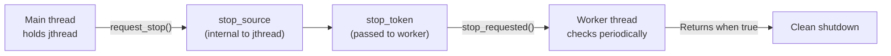
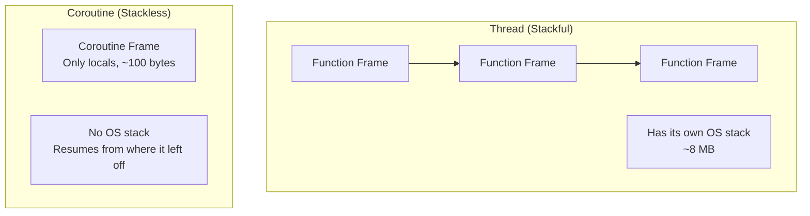
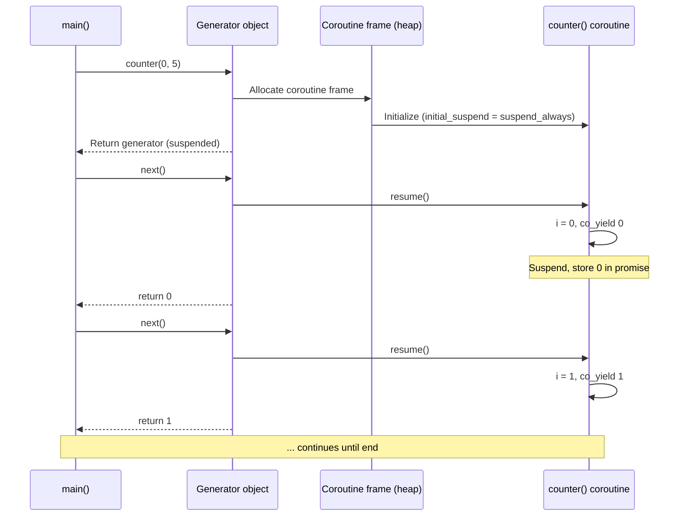

# 5.9. Modern C++20 Concurrency: jthread, Coroutines, Latch, Barrier, Semaphore

> **Why this note exists.** C++11–C++17 gave us a solid foundation: `std::thread`, mutexes, futures, atomics. But three things were still missing: (1) **safe-by-default threads** that don't crash if you forget to `join()`, (2) **cooperative cancellation** so you can ask a running thread to stop, and (3) **coroutines** for stackless async programming (like Python's `asyncio`). C++20 delivered all of this plus three new synchronization primitives — `latch`, `barrier`, and `counting_semaphore`. This note covers all of them in exhaustive detail.

---

## 1. `std::jthread` — Joining Thread (RAII + Cancellation)

### 1.1 The Problem with `std::thread`
Recall from §5.5: if a `std::thread` is destroyed while `joinable()`, the program calls `std::terminate()`. This means every `std::thread` must be explicitly `join()`-ed or `detach()`-ed — or your program crashes.

C++ developers have been writing RAII wrappers for years (the "joining_thread" pattern shown in §5.5). C++20 finally standardizes this as `std::jthread`.

### 1.2 The Two Improvements

1. **Auto-join on destruction.** When a `jthread` is destroyed, it calls `join()` automatically. No more crashes from forgotten joins.
2. **Cooperative cancellation via `std::stop_token`.** You can ask a `jthread` to stop, and the thread function can check periodically whether it's been asked to stop.

### 1.3 Basic Usage

```cpp
#include <thread>
#include <iostream>
#include <chrono>

void worker(std::stop_token stoken, int id) {
    while (!stoken.stop_requested()) {
        std::cout << "Worker " << id << " running\n";
        std::this_thread::sleep_for(std::chrono::milliseconds(100));
    }
    std::cout << "Worker " << id << " stopping cleanly\n";
}

int main() {
    std::jthread t(worker, 1);
    std::this_thread::sleep_for(std::chrono::seconds(1));
    // No need to call t.join() — destructor does it.
    // But we can request stop explicitly:
    t.request_stop();
    // ~jthread() will join() if not already stopped.
}
```

### 1.4 The `stop_token` Mechanism



The components:
- **`std::stop_source`**: Owns a stop state. Can request a stop.
- **`std::stop_token`**: A view of a stop state. Can query whether stop was requested. Passed to the thread function.
- **`std::stop_callback`**: Register a callback to run when stop is requested.

A `jthread` owns a `stop_source`. When you call `jthread.request_stop()`, it calls `stop_source.request_stop()`. The thread function (which receives the `stop_token`) can poll `stop_token.stop_requested()`.

### 1.5 `stop_callback` — Register a Handler

```cpp
void worker(std::stop_token stoken) {
    std::stop_callback cb(stoken, []() {
        std::cout << "Stop requested!\n";
    });
    while (!stoken.stop_requested()) {
        // ... work ...
    }
}
```

When `request_stop()` is called on the source, all registered `stop_callback`s are invoked (on the requesting thread).

### 1.6 Conditional Variable Integration

A common pattern: a worker waits on a condition variable, and we want it to wake up when stop is requested. C++20 provides `std::condition_variable_any::wait_for(lock, stop_token, predicate)` for exactly this:

```cpp
void worker(std::stop_token stoken) {
    std::mutex m;
    std::condition_variable_any cv;
    bool work_ready = false;

    std::unique_lock<std::mutex> lock(m);
    cv.wait_for(lock, stoken, [&]() {
        return work_ready || stoken.stop_requested();
    });

    if (stoken.stop_requested()) {
        std::cout << "Stopped before work arrived\n";
        return;
    }
    // ... do work ...
}
```

When `request_stop()` is called, the cv's wait is interrupted and the predicate is re-checked.

### 1.7 Important Caveat: Cancellation Is Cooperative

`jthread` cancellation is **not** thread termination. The thread function must **poll** `stop_requested()` and exit voluntarily. If your worker is stuck in a blocking call (like a long `recv()`), `request_stop()` won't wake it up.

For I/O-bound threads, you must combine `request_stop()` with closing the socket or using non-blocking I/O.

---

## 2. C++20 Coroutines — Stackless Async Programming

### 2.1 What Is a Coroutine?

A **coroutine** is a function that can suspend its execution and later resume. Unlike threads (which have their own stack), coroutines are **stackless**: their state is stored in a heap-allocated "frame" that's just big enough for the local variables.



### 2.2 The Three Coroutine Keywords

- **`co_await expr`**: Suspend the coroutine until `expr` (an awaitable) is ready. The result of `expr` becomes the value of the expression.
- **`co_yield expr`**: Suspend the coroutine and produce a value (for use in generators).
- **`co_return expr`**: End the coroutine and produce a final value.

A function is a coroutine if it uses any of these. Regular functions cannot use them, and coroutines cannot use plain `return`.

### 2.3 A Simple Generator

```cpp
#include <coroutine>
#include <iostream>

// Boilerplate: a generator that yields ints
struct Generator {
    struct promise_type {
        int current_value;
        Generator get_return_object() { return Generator{std::coroutine_handle<promise_type>::from_promise(*this)}; }
        std::suspend_always initial_suspend() { return {}; }
        std::suspend_always final_suspend() noexcept { return {}; }
        std::suspend_always yield_value(int v) { current_value = v; return {}; }
        void return_void() {}
        void unhandled_exception() { std::terminate(); }
    };

    std::coroutine_handle<promise_type> handle;

    Generator(std::coroutine_handle<promise_type> h) : handle(h) {}
    ~Generator() { if (handle) handle.destroy(); }
    Generator(const Generator&) = delete;
    Generator& operator=(const Generator&) = delete;
    Generator(Generator&& other) noexcept : handle(other.handle) { other.handle = nullptr; }

    int next() {
        if (!handle || handle.done()) return -1;
        handle.resume();
        return handle.promise().current_value;
    }
};

Generator counter(int start, int end) {
    for (int i = start; i < end; ++i) {
        co_yield i;
    }
}

int main() {
    auto gen = counter(0, 5);
    while (true) {
        int v = gen.next();
        if (v == -1) break;
        std::cout << v << "\n";   // 0 1 2 3 4
    }
}
```

### 2.4 What's Happening Under the Hood



### 2.5 The Promise Type

Every coroutine has a **`promise_type`** that controls its behavior. The promise:
- Creates the return object (`get_return_object()`).
- Decides initial suspension (`initial_suspend()`).
- Decides what happens on `co_yield` (`yield_value()`).
- Decides what happens on `co_return` (`return_value()` or `return_void()`).
- Decides final suspension (`final_suspend()`).
- Handles unhandled exceptions (`unhandled_exception()`).

The promise is the C++ equivalent of Python's "send"/"throw" protocol for generators — it's the protocol between the coroutine and its caller.

### 2.6 The Coroutine Handle

A `std::coroutine_handle<P>` is a non-owning handle to a coroutine frame. It supports:
- `resume()`: resume the coroutine from where it suspended.
- `done()`: returns `true` if the coroutine has finished.
- `destroy()`: destroys the frame (must be called exactly once).
- `promise()`: returns a reference to the promise.

### 2.7 Coroutine Use Cases

1. **Generators** (Python-style): produce a sequence lazily.
2. **Async I/O** (like Python's `asyncio`): suspend while waiting for I/O, resume when ready.
3. **State machines**: implement complex stateful logic cleanly.
4. **Event loops**: build an entire async framework on coroutines (e.g., C++23 may standardize `std::execution`).

### 2.8 The Big Caveat: C++20 Doesn't Ship an Async Library

C++20 added the **language features** for coroutines (the keywords, the machinery). But it did **not** add the **library** — there's no standard `task<T>` type, no standard event loop, no standard `async_read()`. You have to either:

- Write your own (significant effort).
- Use a library like **CppCoro** (now Lewis Baker's `cppcoro`), **Boost.Asio** (which has coroutine support since 1.74), or **folly's coroutines**.
- Wait for C++26, which may standardize `std::execution::task`.

For most developers today, coroutines are a "preview feature" — useful in libraries like Asio, but not for everyday application code.

---

## 3. `std::latch` — One-Shot Countdown

A `latch` is a synchronization primitive that allows one or more threads to block until a counter reaches zero. Once the counter hits zero, it stays at zero — the latch cannot be reset.

### 3.1 API

```cpp
#include <latch>

std::latch l{3};   // Initialize with count 3

// Worker threads:
l.count_down();    // Decrement by 1
l.count_down(2);   // Decrement by 2 (default is 1)

// Main thread:
l.wait();          // Block until count reaches 0
// or:
if (l.try_wait()) { /* count is 0 */ }
l.arrive_and_wait();  // Decrement by 1, then block until 0
```

### 3.2 Use Case: One-Time Initialization Barrier

```cpp
std::latch init_latch{N_THREADS};

void worker(int id) {
    // Initialize this thread's resources
    init_per_thread_state(id);
    init_latch.count_down();   // Signal done initializing
    init_latch.wait();         // Wait for all threads to finish init
    // Now all threads can safely start the main work
    do_main_work();
}
```

Unlike `barrier` (below), the latch is **single-use**. Once everyone arrives, it's done.

### 3.3 Latch vs `pthread_barrier_t`
`std::latch` is similar to POSIX `pthread_barrier_t` but:
- Latch can be decremented without waiting (`count_down()`).
- Latch can be waited on without decrementing (`wait()`).
- Latch can be queried (`try_wait()`).
- Latch is **single-use** (cannot be reset).
- Latch allows decrementing by more than 1.

---

## 4. `std::barrier` — Reusable Phase Synchronization

A `barrier` is like a latch, but **reusable**. After all threads arrive, the barrier resets and can be used again. This is the C++ equivalent of Python's `threading.Barrier` (see §5.2).

### 4.1 API

```cpp
#include <barrier>

std::barrier b{N_THREADS};

// Worker:
b.arrive_and_wait();   // Decrement by 1, wait for all to arrive, then all proceed
// or:
b.arrive();            // Decrement by 1, don't wait (advance token)
// or:
auto token = b.arrive();
token.wait();          // Wait on the token (synchronization point)
```

### 4.2 The "Completion Function"

A `barrier` can take a **completion function** that runs once when all threads have arrived (before any are released):

```cpp
std::barrier b{N_THREADS, []() noexcept {
    std::cout << "All threads arrived at phase boundary\n";
}};

void worker() {
    for (int phase = 0; phase < 5; ++phase) {
        do_phase_work(phase);
        b.arrive_and_wait();   // Completion function runs once per phase
    }
}
```

The completion function is called by **one of the arriving threads** (which one is unspecified). It's useful for swapping buffers, advancing the global phase counter, or computing aggregates.

### 4.3 Use Case: Parallel Iterative Computation

```cpp
// Compute Game of Life for 100 generations
std::barrier sync{N_THREADS};
std::vector<std::thread> threads;

for (int t = 0; t < N_THREADS; ++t) {
    threads.emplace_back([t, &sync]() {
        for (int gen = 0; gen < 100; ++gen) {
            compute_my_strip(t, gen);
            sync.arrive_and_wait();   // Wait for all threads to finish this gen
            // After this, all strips are updated; safe to proceed to next gen
        }
    });
}
```

Without the barrier, thread 0 might start generation 5 while thread 3 is still on generation 4, leading to inconsistent reads.

---

## 5. `std::counting_semaphore` — Counting Synchronization

A `counting_semaphore` is a more flexible version of `std::mutex`. Instead of being binary (locked/unlocked), it has an internal counter. Threads can release (increment) without having acquired (decremented) — unlike a mutex, which must be released by the same thread that locked it.

### 5.1 API

```cpp
#include <semaphore>

std::counting_semaphore<10> sem{3};   // Max 10, initial 3

sem.acquire();              // Decrement (block if 0)
sem.release();              // Increment (no ownership requirement)
sem.release(5);             // Increment by 5

if (sem.try_acquire()) { /* got one */ }
if (sem.try_acquire_until(deadline)) { /* got one */ }
if (sem.try_acquire_for(std::chrono::seconds(1))) { /* got one */ }
```

The template parameter is the **max value** — a hint to the implementation for the maximum the counter can reach. It must be at least 1.

### 5.2 `std::binary_semaphore`

`std::binary_semaphore` is a typedef for `std::counting_semaphore<1>` — a semaphore whose counter can only be 0 or 1. This is essentially a mutex that doesn't enforce ownership.

### 5.3 Use Case: Resource Pool

```cpp
// Limit concurrent database connections to 5
std::counting_semaphore<5> db_slots{5};

void query_database() {
    db_slots.acquire();   // Take a slot (block if 5 are in use)
    try {
        do_db_work();
    } catch (...) {
        db_slots.release();
        throw;
    }
    db_slots.release();
}
```

### 5.4 Use Case: Signaling (Producer-Consumer Without Mutex)

```cpp
std::counting_semaphore<1000> items_available{0};
std::counting_semaphore<1000> slots_available{1000};

void producer() {
    while (true) {
        auto item = produce_item();
        slots_available.acquire();     // Take a queue slot
        queue.push(item);              // Assumes queue is internally thread-safe
        items_available.release();     // Signal: one item available
    }
}

void consumer() {
    while (true) {
        items_available.acquire();     // Wait for an item
        auto item = queue.pop();
        slots_available.release();     // Signal: one slot freed
        consume(item);
    }
}
```

### 5.5 Semaphore vs Mutex
| Feature | `std::mutex` | `std::counting_semaphore` |
| :--- | :--- | :--- |
| Counter | Binary (0 or 1) | Up to max |
| Ownership | Must be released by acquirer | No ownership |
| Use case | Critical section protection | Resource counting, signaling |
| Performance | Faster (usually) | Slightly slower (more general) |

---

## 6. Putting It All Together — A Modern C++20 Worker Pool

```cpp
#include <thread>
#include <latch>
#include <barrier>
#include <semaphore>
#include <atomic>
#include <vector>
#include <iostream>
#include <functional>

class ModernWorkerPool {
    std::vector<std::jthread> workers_;
    std::counting_semaphore<1000> work_sem_{0};
    std::counting_semaphore<1000> done_sem_{0};
    std::atomic<int> tasks_completed_{0};
    int total_tasks_;

public:
    ModernWorkerPool(int n_workers, int n_tasks)
        : total_tasks_(n_tasks)
    {
        std::latch init_latch{n_workers};

        for (int i = 0; i < n_workers; ++i) {
            workers_.emplace_back([this, i, &init_latch](std::stop_token stoken) {
                // Per-thread initialization
                init_per_thread_state(i);
                init_latch.count_down();
                init_latch.wait();   // All threads synchronized before starting

                while (!stoken.stop_requested()) {
                    if (!work_sem_.try_acquire_for(std::chrono::milliseconds(100))) {
                        continue;
                    }
                    do_work();
                    done_sem_.release();
                }
            });
        }
    }

    void submit_task() {
        work_sem_.release();   // Signal a worker to pick up work
    }

    void wait_for_completion() {
        for (int i = 0; i < total_tasks_; ++i) {
            done_sem_.acquire();
        }
    }

    void shutdown() {
        for (auto& t : workers_) t.request_stop();
        // ~jthread joins all
    }

    ~ModernWorkerPool() {
        shutdown();
    }
};
```

This combines:
- `jthread` for safe-by-default threads + cooperative cancellation.
- `latch` for one-time initialization synchronization.
- `counting_semaphore` for work signaling (no need for a queue + condition variable).
- `stop_token` polling for graceful shutdown.

---

## 7. Common Pitfalls and Reminders

1. **"My `jthread` didn't actually stop when I called `request_stop()`."** Cancellation is cooperative. Your thread function must poll `stop_requested()`. If it's blocked in I/O, you also need to close the socket.

2. **"My coroutine leaks memory."** You must destroy the coroutine frame. If you have a `coroutine_handle`, you must call `destroy()` on it exactly once (usually in the destructor of your return object).

3. **"My coroutine crashes when I call `resume()` after `done()`."** That's undefined behavior. Always check `done()` before resuming.

4. **"I forgot `final_suspend() returns suspend_always`."** If `final_suspend()` returns `suspend_never`, the coroutine frame is destroyed immediately when the coroutine finishes — and the caller's `coroutine_handle` becomes a dangling pointer. Always use `suspend_always` for `final_suspend` unless you really know what you're doing.

5. **"My latch's `wait()` returned but a worker hadn't finished its work."** `wait()` only means the counter reached zero, not that all workers have completed their post-countdown work. If you need that, use a barrier or another synchronization primitive.

6. **"My barrier is stuck."** Most likely cause: not all expected threads called `arrive_and_wait()`. Check your thread count.

7. **"I used `release()` on a semaphore without `acquire()`-ing first."** That's legal (semaphores don't track ownership) — but it might be a bug if you didn't intend it. Be deliberate.

8. **"My `binary_semaphore` behaves like a mutex but is slower."** It is. Use `std::mutex` for critical sections; use `binary_semaphore` only when you need to release from a different thread than the one that acquired.

9. **"Coroutines seem really complicated."** They are. C++20's coroutines are a low-level mechanism for library writers. For application code, wait for higher-level libraries (Boost.Asio's `awaitable`, C++26's `std::task`).

10. **"My barrier's completion function threw an exception."** The exception propagates out of `arrive_and_wait()` in **one** of the threads (the one that ran the completion function). The other threads may still be blocked. Be careful: exceptions in completion functions can deadlock the barrier.

---

> **Next note.** §5.10 is the **capstone**: a side-by-side comparative analysis of Python and C++ thread management. We'll cover performance characteristics, developer ergonomics, when to choose each, and migration patterns.
