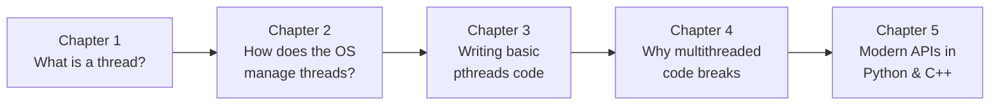

# Operating Systems — Threads & Concurrency

> **The complete course.** This Obsidian vault is a rigorous, self-contained course on threads and concurrency, spanning five chapters: from the OS foundations of processes and threads, through threading models and pthreads exercises, to modern thread management in Python and C++.

---

## Course Structure

```
Course {
    Chapter 1: Foundations of Threads and Processes
        - 1.1. Process vs Thread Conceptual Analysis
        - 1.2. State Transitions and Memory Layout of Threads

    Chapter 2: Multi-threading Models and Systems
        - 2.1. Threading Models and Thread Tables
        - 2.2. Scheduler Activations and Upcall Architecture
        - 2.3. Distributed Systems and Pop-Up Thread Design

    Chapter 3: Rigorous Exercise Solutions
        - 3.1. Detailed Solution and Analysis of Thread Exercise 1
        - 3.2. Detailed Solution and Analysis of Thread Exercise 2

    Chapter 4: The Challenges of Concurrency Conversion
        - 4.1. Race Conditions and Thread-Local Storage Mechanics
        - 4.2. Legacy Code Conversion Challenges

    Chapter 5: Modern Thread Management in Python and C++
        - 5.1.  The Python Threading Ecosystem and the GIL
        - 5.2.  Python Synchronization Primitives and Thread-Safe Patterns
        - 5.3.  Python Thread Pools, Thread-Local Storage, and Daemon Threads
        - 5.4.  Python Asyncio as a Modern Alternative to Threads
        - 5.5.  The C++ Standard Thread Library (std::thread)
        - 5.6.  C++ Mutex Family and RAII Lock Management
        - 5.7.  C++ Condition Variables and Future-Based Synchronization
        - 5.8.  C++ Atomic Operations and Memory Ordering
        - 5.9.  Modern C++20 Concurrency: jthread, Coroutines, Latch, Barrier, Semaphore
        - 5.10. Comparative Analysis: Python vs C++ Thread Management
}
```

Each chapter has its own `README.md` with a chapter-level overview, and each section is a separate Markdown note with full explanations, Mermaid diagrams, code examples, and a "Common Pitfalls and Reminders" section.

---

## How to Use This Vault

### Reading Order (Recommended)

1. **Chapter 1** — Foundations. Read both notes in order. This establishes the vocabulary used everywhere else.
2. **Chapter 2** — Threading Models. Read in order. The three models (many-to-one, one-to-one, many-to-many) are foundational concepts.
3. **Chapter 3** — Exercises. Read both exercises after Chapter 2; they put the theory into practice with real C/pthreads code.
4. **Chapter 4** — Conversion Challenges. Read in order. This explains why multithreaded code is hard, motivating the modern APIs in Chapter 5.
5. **Chapter 5** — Modern APIs. Read in order. Python first (notes 5.1–5.4), then C++ (notes 5.5–5.9), then the comparative analysis (5.10).

### If You're Short on Time

- **Need OS fundamentals:** Chapter 1 + Chapter 2.
- **Need to write pthreads code:** Chapter 3 + Chapter 4.
- **Need Python concurrency:** Chapter 5 §5.1–5.4.
- **Need C++ concurrency:** Chapter 5 §5.5–5.9.
- **Need a quick comparison of Python vs C++:** Chapter 5 §5.10.

### For Exam Revision

Each note ends with a "Common Pitfalls and Reminders" section. These are the points that students most often forget on exams. Re-read them the night before.

---

## Vault Statistics

| Chapter | Notes | Total Size (approx) |
| :--- | :--- | :--- |
| Chapter 1 | 1.1, 1.2 + README | ~28 KB |
| Chapter 2 | 2.1, 2.2, 2.3 + README | ~50 KB |
| Chapter 3 | 3.1, 3.2 + README | ~40 KB |
| Chapter 4 | 4.1, 4.2 + README | ~45 KB |
| Chapter 5 | 5.1–5.10 + README | ~205 KB |
| **Total** | **22 files** | **~370 KB** |

---

## Style Conventions Used Throughout

- **Numbering scheme:** `X.Y. Title` (e.g., `5.3. Python Thread Pools...`). No underscores anywhere in titles.
- **Diagrams:** Mermaid only — no ASCII art.
- **Code blocks:** Fenced with language tags (` ```c `, ` ```cpp `, ` ```python `, ` ```bash `).
- **Cross-references:** `§X.Y` (within same chapter) or `§X.Y of Chapter Z` (across chapters).
- **Frontmatter:** YAML at the top of each note with `tags`, `chapter`, `section`.
- **Per-note structure:**
  1. Frontmatter
  2. Title (`# X.Y. Title`)
  3. "Why this note exists" callout
  4. Numbered sections
  5. Mermaid diagrams where helpful
  6. Code examples where helpful
  7. "Common Pitfalls and Reminders" section
  8. "Next note" pointer

---

## File Layout

```
ObsidianVault/
├── README.md  (this file)
├── Chapter 1 - Foundations of Threads and Processes/
│   ├── README.md
│   ├── 1.1. Process vs Thread Conceptual Analysis.md
│   └── 1.2. State Transitions and Memory Layout of Threads.md
├── Chapter 2 - Multi-threading Models and Systems/
│   ├── README.md
│   ├── 2.1. Threading Models and Thread Tables.md
│   ├── 2.2. Scheduler Activations and Upcall Architecture.md
│   └── 2.3. Distributed Systems and Pop-Up Thread Design.md
├── Chapter 3 - Rigorous Exercise Solutions/
│   ├── README.md
│   ├── 3.1. Detailed Solution and Analysis of Thread Exercise 1.md
│   └── 3.2. Detailed Solution and Analysis of Thread Exercise 2.md
├── Chapter 4 - The Challenges of Concurrency Conversion/
│   ├── README.md
│   ├── 4.1. Race Conditions and Thread-Local Storage Mechanics.md
│   └── 4.2. Legacy Code Conversion Challenges.md
└── Chapter 5 - Modern Thread Management in Python and C++/
    ├── README.md
    ├── 5.1. The Python Threading Ecosystem and the GIL.md
    ├── 5.2. Python Synchronization Primitives and Thread-Safe Patterns.md
    ├── 5.3. Python Thread Pools, Thread-Local Storage, and Daemon Threads.md
    ├── 5.4. Python Asyncio as a Modern Alternative to Threads.md
    ├── 5.5. The C++ Standard Thread Library.md
    ├── 5.6. C++ Mutex Family and RAII Lock Management.md
    ├── 5.7. C++ Condition Variables and Future-Based Synchronization.md
    ├── 5.8. C++ Atomic Operations and Memory Ordering.md
    ├── 5.9. Modern C++20 Concurrency.md
    └── 5.10. Comparative Analysis Python vs C++.md
```

---

## The Conceptual Arc



The course follows a deliberate progression:
- **Chapter 1** defines the vocabulary (process, thread, PCB, TCB, states).
- **Chapter 2** examines the OS-level design space (threading models).
- **Chapter 3** puts theory into practice (pthreads exercises).
- **Chapter 4** confronts the difficulties that arise when concurrency meets legacy code.
- **Chapter 5** shows how modern languages provide high-level APIs that solve those difficulties.

By the end, you should be able to:
- Explain what a thread is and how the OS schedules it.
- Choose an appropriate threading model for a given workload.
- Write correct multithreaded code in C (pthreads), Python, and C++.
- Diagnose and fix common concurrency bugs (races, deadlocks, memory issues).
- Decide when to use threads vs. async vs. processes for a given problem.

---

## Acknowledgments

The material in this vault draws from:
- The original course slides (referenced in Chapter 1 §1.2, Chapter 4 §4.1).
- Tanenbaum's *Modern Operating Systems* (general OS theory).
- Anthony Williams' *C++ Concurrency in Action* (C++ threading).
- The pthreads man pages (POSIX standard).
- PEP 703 and the Python documentation (Python threading and asyncio).
- The C++ reference at cppreference.com.

---

## Errata and Feedback

If you find errors or have suggestions for additional notes, mention them. The vault is designed to be expanded incrementally — new notes can be added to any chapter without overwriting existing ones.

Suggested future expansions:
- **Chapter 6: Lock-Free Programming** — hazard pointers, epoch-based reclamation, RCU.
- **Chapter 7: Distributed Concurrency** — consensus, Paxos, Raft, distributed locks.
- **Chapter 8: Performance Analysis** — profiling tools, false sharing, cache effects.
- **Chapter 9: Real-World Case Studies** — how NGINX, Redis, Apache Kafka handle concurrency.

---

**Start reading:** Open `Chapter 1 - Foundations of Threads and Processes/README.md` or `1.1. Process vs Thread Conceptual Analysis.md`.
