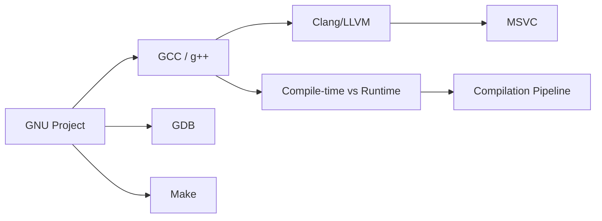
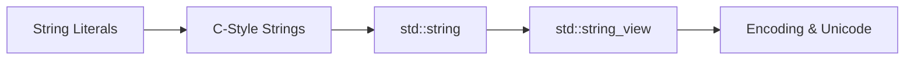
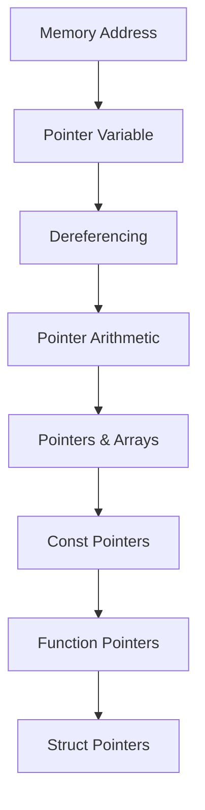
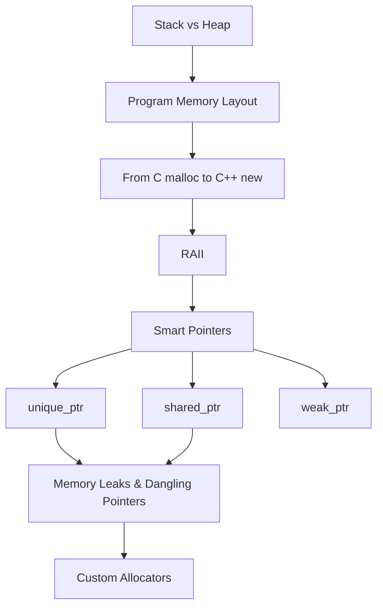
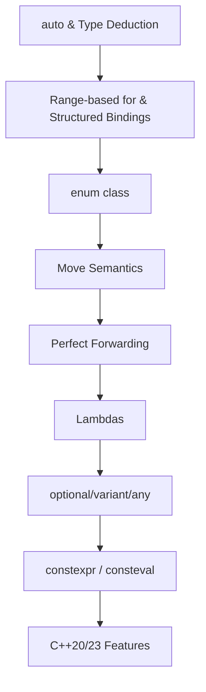
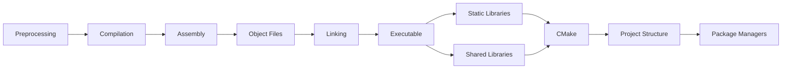
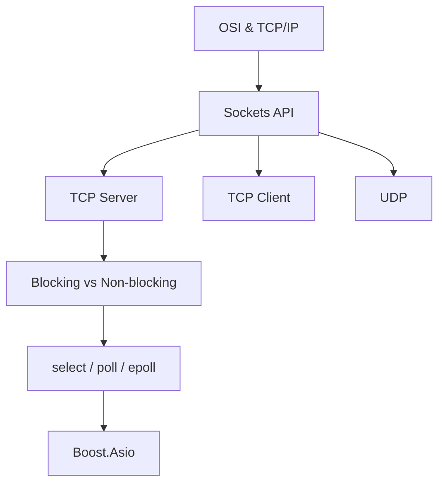

# C++ Roadmap

This is the master roadmap for the C++ track. Each chapter is a self-contained unit of mastery. Do not skip chapters — the progression is carefully ordered so that each new topic builds on concepts you have already internalized.

## The Big Picture

```mermaid
flowchart TD
    L0[1. Compiler & Toolchain] --> L1[2. C++ Fundamentals]
    L1 --> L2[3. Strings]
    L2 --> L3[4. Functions]
    L3 --> L4[5. Structs, Unions, Bit-Fields]
    L4 --> L5[6. Pointers & References]
    L5 --> L6[7. Memory Management]
    L6 --> L7[8. Modern C++]
    L7 --> L8[9. OOP]
    L8 --> L9[10. Templates & Metaprogramming]
    L9 --> L10[11. STL Deep Dive]
    L10 --> L11[12. Build Systems & Project Structure]
    L11 --> L12[13. Error Handling & Exceptions]
    L12 --> L13[14. Concurrency & Multithreading]
    L13 --> L14[15. Debugging & Profiling]
    L14 --> L15[16. Testing]
    L15 --> L16[17. Networking]
    L16 --> L17[18. Software Engineering Practices]
    L17 --> L18[19. Performance Optimization]
    L18 --> L19[20. Advanced C++ Topics]
    L19 --> L20[21. C++ and Python Interoperability]
    L20 --> L21[22. Projects]
    L21 --> L22[99. Reference Cards]

    style L0 fill:#e1f5ff,stroke:#0288d1
    style L5 fill:#fff4e1,stroke:#f57c00
    style L6 fill:#fff4e1,stroke:#f57c00
    style L7 fill:#fce4ec,stroke:#c2185b
    style L13 fill:#e8f5e9,stroke:#388e3c
    style L19 fill:#f3e5f5,stroke:#7b1fa2
    style L21 fill:#fff9c4,stroke:#fbc02d
```



## Why This Order?

The order is **not** arbitrary. Each transition has a pedagogical reason:

1. **Compiler first (Ch. 1)** — before writing C++, you must know what happens when you press "compile." Without this, every later error message is magic.
2. **Fundamentals (Ch. 2)** — syntax, types, operators, control flow. The atoms of every C++ program.
3. **Strings (Ch. 3)** — the first non-trivial standard library type. Forces you to confront ownership, immutability, and encoding.
4. **Functions (Ch. 4)** — decomposition. Pass-by-value vs pointer vs reference is one of the most important distinctions in the language.
5. **Structs (Ch. 5)** — the first user-defined aggregate. Required before classes.
6. **Pointers (Ch. 6)** — the famous hard topic. Taught after structs because pointers to structs make the motivation concrete.
7. **Memory (Ch. 7)** — pointers lead naturally to "where does memory live?" Stack vs heap, RAII, smart pointers.
8. **Modern C++ (Ch. 8)** — `auto`, move semantics, lambdas. The tools that make C++ *not* feel like C.
9. **OOP (Ch. 9)** — classes, inheritance, polymorphism. Now that you understand memory, you can understand why virtual dispatch has a cost.
10. **Templates (Ch. 10)** — generic programming. C++'s answer to "write once, use for many types."
11. **STL (Ch. 11)** — the standard library built on templates. Now you understand *why* `std::vector` works the way it does.
12. **Build Systems (Ch. 12)** — at this point your programs are too big for one file. You need CMake.
13. **Error Handling (Ch. 13)** — exceptions, error codes, `std::expected`.
14. **Concurrency (Ch. 14)** — multithreading, atomics, coroutines.
15. **Debugging (Ch. 15)** — GDB, Valgrind, sanitizers.
16. **Testing (Ch. 16)** — Google Test, Catch2.
17. **Networking (Ch. 17)** — sockets, Boost.Asio.
18. **Software Engineering (Ch. 18)** — SOLID, design patterns, architecture.
19. **Performance (Ch. 19)** — cache locality, SIMD, branch prediction.
20. **Advanced C++ (Ch. 20)** — coroutines, modules, ranges, C++23.
21. **Python Interop (Ch. 21)** — pybind11.
22. **Projects (Ch. 22)** — apply everything.

---

## Chapter 1. Compiler and Toolchain



Files:
- `1. GNU and Free Software.md`
- `2. GCC and g++.md`
- `3. Clang and LLVM.md`
- `4. MSVC and Other Compilers.md`
- `5. Compile-time vs Runtime.md`
- `6. The Compilation Pipeline.md`

---

## Chapter 2. C++ Fundamentals


Files:
- `1. Hello World and Program Structure.md`
- `2. Comments and Coding Style.md`
- `3. Variables and Fundamental Types.md`
- `4. Operators.md`
- `5. Literals and Constants.md`
- `6. size_t and Integer Types.md`
- `7. Control Flow.md`
- `8. Arrays and Multidimensional Arrays.md`

---

## Chapter 3. Strings and Character Data



Files:
- `1. String Literals and C-Style Strings.md`
- `2. std::string Deep Dive.md`
- `3. string_view and Modern String Handling.md`

---

## Chapter 4. Functions and Program Structure

Files:
- `1. Function Basics.md`
- `2. Pass-by-Value, Pointer, Reference.md`
- `3. Default Arguments and Overloading.md`
- `4. Inline, Constexpr, Consteval.md`
- `5. Function Pointers and Lambdas.md`

---

## Chapter 5. Structs, Unions, and Bit-Fields

Files:
- `1. Structs.md`
- `2. Unions.md`
- `3. Bit-Fields.md`

---

## Chapter 6. Pointers and References



Files:
- `1. Introduction to Pointers.md`
- `2. Memory Address vs Pointer vs Reference.md`
- `3. Referencing and Dereferencing.md`
- `4. Pointers Inside Functions.md`
- `5. Dynamic Memory Allocation.md`
- `6. Pointer Arithmetic and Arrays.md`
- `7. Reading Pointer Declarations.md`
- `8. Constant Pointers and Pointers to Constants.md`
- `9. Pointers to Functions.md`
- `10. Pointers to Structs.md`

---

## Chapter 7. Memory Management



Files:
- `1. Stack and Heap.md`
- `2. Memory Layout of a Program.md`
- `3. From C to C++ Memory Management.md`
- `4. RAII.md`
- `5. Smart Pointers.md`
- `6. Memory Leaks and Dangling Pointers.md`
- `7. Custom Allocators.md`

---

## Chapter 8. Modern C++



Files:
- `1. auto and Type Deduction.md`
- `2. Range-based for and Structured Bindings.md`
- `3. enum class.md`
- `4. Move Semantics.md`
- `5. Perfect Forwarding.md`
- `6. Lambdas Deep Dive.md`
- `7. std optional, std variant, std any.md`
- `8. constexpr and Compile-time Computation.md`
- `9. C++20 and C++23 New Features.md`

---

## Chapter 9. Object-Oriented Programming

Files:
- `1. Classes and Objects.md`
- `2. Constructors and Destructors.md`
- `3. Inheritance.md`
- `4. Polymorphism and Virtual Functions.md`
- `5. Multiple and Virtual Inheritance.md`
- `6. Operator Overloading.md`
- `7. const Correctness.md`
- `8. The Rule of 0, 3, and 5.md`

---

## Chapter 10. Templates and Metaprogramming

Files:
- `1. Function Templates.md`
- `2. Class Templates.md`
- `3. Variadic Templates.md`
- `4. SFINAE.md`
- `5. Concepts (C++20).md`
- `6. CRTP.md`
- `7. Compile-time Computation.md`

---

## Chapter 11. STL Deep Dive

```mermaid
flowchart TD
    A[Containers Overview] --> B[Sequence: vector, deque, list]
    A --> C[Associative: map, set]
    A --> D[Unordered: unordered_map]
    A --> E[Adapters: stack, queue]
    B --> F[Iterators]
    C --> F
    D --> F
    F --> G[Algorithms]
    G --> H[Ranges (C++20)]
```

Files:
- `1. Containers Overview.md`
- `2. Sequence Containers.md`
- `3. Associative Containers.md`
- `4. Unordered Containers.md`
- `5. Container Adapters.md`
- `6. Iterators.md`
- `7. Algorithms.md`
- `8. Ranges (C++20).md`
- `9. Function Objects and Binders.md`

---

## Chapter 12. Build Systems and Project Structure



Files:
- `1. Compilation Process.md`
- `2. Headers, Include Guards, Modules.md`
- `3. Static vs Shared Libraries.md`
- `4. Make and Makefiles.md`
- `5. CMake Basics.md`
- `6. CMake Advanced.md`
- `7. Project Structure.md`
- `8. Package Managers (vcpkg, Conan).md`

---

## Chapter 13. Error Handling and Exceptions

Files:
- `1. Error Handling Strategies.md`
- `2. Exceptions Basics.md`
- `3. Exception Safety Guarantees.md`
- `4. Custom Exceptions.md`
- `5. std expected and std error code.md`

---

## Chapter 14. Concurrency and Multithreading

```mermaid
flowchart TD
    A[Processes vs Threads] --> B[std::thread / std::jthread]
    B --> C[Mutexes & Locks]
    C --> D[Condition Variables]
    D --> E[Futures, Promises, Async]
    E --> F[Atomics & Memory Ordering]
    F --> G[Thread Pools]
    G --> H[Lock-Free Programming]
    H --> I[Coroutines (C++20)]
```

Files:
- `1. Introduction to Multithreading.md`
- `2. std thread and std jthread.md`
- `3. Mutexes and Locks.md`
- `4. Condition Variables.md`
- `5. Futures, Promises, Async.md`
- `6. Atomics and Memory Ordering.md`
- `7. Thread Pools.md`
- `8. Lock-Free Programming.md`
- `9. Coroutines (C++20).md`

---

## Chapter 15. Debugging and Profiling

Files:
- `1. GDB.md`
- `2. LLDB.md`
- `3. Valgrind.md`
- `4. Sanitizers (ASan, UBSan, TSan).md`
- `5. perf and Flamegraphs.md`
- `6. Debugging Strategies.md`

---

## Chapter 16. Testing

Files:
- `1. Testing Concepts.md`
- `2. Google Test.md`
- `3. Catch2.md`
- `4. Mocking with gMock.md`

---

## Chapter 17. Networking



Files:
- `1. Network Fundamentals.md`
- `2. Sockets in C++.md`
- `3. TCP Server and Client.md`
- `4. UDP Communication.md`
- `5. Non-blocking I-O and epoll.md`
- `6. Boost.Asio Overview.md`

---

## Chapter 18. Software Engineering Practices

Files:
- `1. Design Patterns Overview.md`
- `2. Creational Patterns.md`
- `3. Structural Patterns.md`
- `4. Behavioral Patterns.md`
- `5. SOLID Principles.md`
- `6. Software Architecture.md`
- `7. Code Quality and Refactoring.md`

---

## Chapter 19. Performance Optimization

Files:
- `1. CPU Cache Locality.md`
- `2. Branch Prediction.md`
- `3. SIMD and Vectorization.md`
- `4. Memory Pool and Arena Allocators.md`
- `5. Profiling Workflow.md`

---

## Chapter 20. Advanced C++ Topics

Files:
- `1. Coroutines Deep Dive.md`
- `2. Modules.md`
- `3. Ranges Deep Dive.md`
- `4. Reflection (Future).md`
- `5. C++23 and Beyond.md`

---

## Chapter 21. C++ and Python Interoperability

Files:
- `1. pybind11 Basics.md`
- `2. Calling C++ from Python.md`
- `3. Calling Python from C++.md`
- `4. NumPy Interoperability.md`

---

## Chapter 22. Projects

Files:
- `1. Build Your Own Vector.md`
- `2. Build Your Own String.md`
- `3. Build a Thread Pool.md`
- `4. Build an HTTP Server.md`
- `5. Build Your Own Redis.md`

---

## Chapter 99. Reference Cards

Files:
- `1. C Reference Card.md`
- `2. C++ Specific Features Reference Card.md`

---

## Active Recall — Vault-Wide Self-Test

After completing the C++ track, you should be able to answer:

1. What are the four freedoms of free software, and why does GCC exist?
2. Trace a `.cpp` file through preprocessing, compilation, assembly, and linking. What does each stage produce?
3. Explain the difference between `int* p`, `int *p`, `int * p`, and `const int* const p`.
4. When does `std::vector` reallocate, and why is amortized O(1) push_back still efficient?
5. What are the four exception safety guarantees? Give an example of each.
6. Why does C++ need `std::move`, and what does it actually do at the type level?
7. Explain the difference between `std::thread`, `std::async`, and `std::jthread`.
8. What is the Rule of 0, and when should you break it?
9. Trace what happens when you call `delete` on a `std::unique_ptr<Base>` pointing to a `Derived` object without a virtual destructor.
10. Why is `std::shared_ptr` slower than `std::unique_ptr`, and what is the control block?

---

## Next Steps

Once you have completed the C++ track, return to the [[Shared/readme|master index]] and continue with the Python track, or jump to [[21. C++ and Python Interoperability]] to see how the two languages connect.
