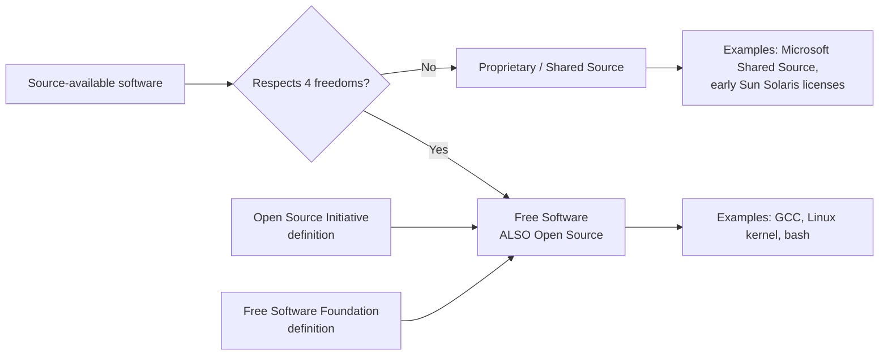
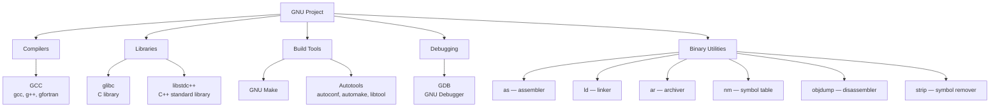

# GNU and Free Software

Before we can write, compile, or debug a single line of C++, we have to understand the soil in which the modern C++ ecosystem grows. For the vast majority of C++ developers — whether on Linux servers, macOS laptops, embedded ARM boards, or even Windows machines running MinGW — that soil is the **GNU Project** and the philosophy of **Free Software** that gave it birth.

This note is not a political manifesto. It is a practical explanation of *why* your compiler behaves the way it does, *why* certain licenses constrain how you ship binaries, *why* `g++` and `gcc` exist as separate commands, and *why* the GNU toolchain (`glibc`, `libstdc++`, `binutils`, `make`, `gdb`, `autotools`) is the default environment for serious C++ work. Skip this note and the rest of the chapter will feel arbitrary; read it carefully and the entire C++ build ecosystem will snap into focus.

## Background

### The world before GNU (1970s–1983)

In the early days of computing, software was routinely shipped with its source code. Engineers at Bell Labs, MIT, and Berkeley freely shared patches, fixes, and entire programs. This began to change in the late 1970s and early 1980s: vendors started shipping binaries without source, and users were legally forbidden from modifying or redistributing the software they had purchased.

One of the most famous incidents involved the **Xerox 9700 laser printer** at the MIT Artificial Intelligence Lab. The printer's software was buggy and tended to jam; lab members wanted to patch the driver to notify users when their print jobs were blocked. Xerox refused to provide the source code. Richard Stallman, a programmer at the lab, experienced this as a moral injury: he had the skill to fix the bug, but the legal and technical barriers made it impossible.

> [!info] Why this story matters
> The printer incident is not folklore for its own sake. It explains the *emotional* and *ethical* motivation behind free software. When you read the GPL, you are reading a document designed to prevent exactly this scenario: a user with the ability to fix a bug being legally prevented from doing so.

### The GNU announcement (27 September 1983)

On that date, Richard Stallman posted a message to the `net.unix-wizards` and `net.usoft` Usenet newsgroups announcing the **GNU Project**. The name is a recursive acronym: **"GNU's Not Unix"**. The goal was to build a complete, free, Unix-compatible operating system so that no computer user would ever again be unable to modify the software they ran.

By 1985 Stallman had founded the **Free Software Foundation (FSF)** to support the project. By the early 1990s, GNU had produced almost every component of a Unix-like operating system — the shell (`bash`), the compiler (`gcc`), the C library (`glibc`), the text editor (`emacs`), the build tool (`make`), the debugger (`gdb`), the binary utilities (`binutils`) — but it was missing one critical piece: a **kernel**. That gap was filled in 1991 when Linus Torvalds wrote **Linux**, which he combined with the GNU userland to produce what is technically called **GNU/Linux** but is colloquially called "Linux".

> [!tip] The naming debate
> Stallman has spent decades asking people to say "GNU/Linux" rather than "Linux", because most of the userland you actually type at the shell (`ls`, `cp`, `bash`, `gcc`) comes from GNU, not from the Linux kernel. You do not need to take sides in this debate, but you should know what it is about — it surfaces constantly in C++ community discussions.

## Main Content

### The Four Freedoms

The FSF defines "free software" by **four freedoms**, numbered 0 through 3 (because computer scientists count from zero). These freedoms are the source of every other practical distinction you will encounter in the C++ toolchain world.

| Freedom | Statement | Practical consequence for C++ developers |
|---------|-----------|-------------------------------------------|
| **0** | The freedom to *run* the program as you wish, for any purpose. | You can use `g++` to compile proprietary commercial software. You can use it on a server, on a phone, in a missile, in a hospital. No license audit needed for *use*. |
| **1** | The freedom to *study* how the program works and *change* it so it does your computing as you wish. Access to source code is a precondition. | You can read the GCC source to understand exactly why a warning fires. You can patch `libstdc++` to fix a bug without waiting for upstream. |
| **2** | The freedom to *redistribute* copies so you can help others. | You can hand a colleague a copy of GCC on a USB stick. You can mirror GNU tools inside a corporate firewall. |
| **3** | The freedom to *distribute* copies of your *modified* versions. Access to source code is a precondition. | You can fork `gdb`, add a feature, and ship your own `megagdb` — provided you respect the license of the original (see "Copyleft" below). |

> [!warning] "Free" means liberty, not price
> The phrase "free software" is ambiguous in English. The FSF's slogan is **"free as in speech, not free as in beer"**. You can absolutely sell free software — what you cannot do is restrict the four freedoms of the people you sell it to. Software that costs nothing but denies these freedoms (much "freeware" and "shareware") is *not* free software.

### Free Software vs Open Source

In 1998 a group of developers including Eric S. Raymond and Bruce Perens coined the term **"Open Source"** as a marketing-friendly alternative to "Free Software". They wanted to emphasise the *practical engineering benefits* of source availability (better code, faster bug fixes, distributed review) without invoking Stallman's ethical framework.

The two movements produce largely the same set of licenses and largely the same code, but they are **not identical philosophies**:



For C++ developers, the practical implication is this: when you read "free software", hear "GPL-family licensed and ethically committed to user freedom". When you read "open source", hear "OSI-approved license, which may be permissive (MIT, BSD, Apache) or copyleft (GPL)".

### The GNU toolchain ecosystem

GNU is not a single program; it is a constellation of tools that, together, form a complete development environment. For a C++ developer, the most important components are:



Let's examine each in the depth you need as a C++ developer.

#### GCC (GNU Compiler Collection)

The flagship. Includes frontends for C (`gcc`), C++ (`g++`), Fortran (`gfortran`), Ada (`gnat`), Go (`gccgo`), D (`gdc`), and Modula-2. Covered in detail in [[2. GCC and g++]].

#### glibc (GNU C Library)

The implementation of the C standard library (ISO C11, POSIX) used on essentially every mainstream Linux distribution. Your C++ program — even one that uses only `<iostream>` — ultimately calls into `glibc` for system calls (`open`, `read`, `write`, `mmap`, `pthread_create`). `libstdc++` is layered *on top of* `glibc`.

> [!info] Why C++ developers care about glibc
> If you have ever hit the error message `/lib/x86_64-linux-gnu/libc.so.6: version 'GLIBC_2.34' not found`, you have already felt glibc. Binaries compiled against a newer glibc will not run on systems with an older glibc, because glibc symbols are versioned. This is one of the most common sources of "works on my machine" failures in C++ deployment.

#### libstdc++ (GNU C++ Standard Library)

The implementation of the C++ standard library that ships with GCC. Provides `<vector>`, `<string>`, `<iostream>`, `<memory>`, `<algorithm>`, the STL containers, `std::thread`, `std::regex`, and everything else in the standard. It is dual-licensed under the **GPLv3 with the GCC Runtime Library Exception** (which lets you link it into proprietary software) and a permissive license. This exception is *critical* — without it, every proprietary C++ program compiled with GCC would have to be GPL.

#### GNU Make

The build automation tool. Reads `Makefile`s, tracks file dependencies, and recompiles only what is necessary. Pre-dates CMake, Meson, Bazel, and Ninja by decades and is still the lowest common denominator — CMake's default generator on Linux is GNU Make. Covered in [[2. GCC and g++]].

#### Autotools (Autoconf, Automake, Libtool)

The classic Unix solution to "how do I build this on twenty different Unix variants". You write `configure.ac`; `autoconf` generates a `configure` shell script; running `./configure` probes the host system for compilers, libraries, and quirks, then generates a `Makefile`. Many large C++ open-source projects (GCC itself, LLVM until recently, the GIMP, ImageMagick) still use Autotools.

#### GDB (GNU Debugger)

The debugger used with GCC-compiled code. Supports breakpoints, watchpoints, stepping, conditional breakpoints, reverse debugging (on some targets), Python scripting, and pretty-printers for STL containers. Covered in [[15. Debugging and Profiling]].

#### binutils

The lower-level tools that GCC and LD invoke under the hood:

- `as` — the GNU assembler. Invoked by `gcc -c` after compilation.
- `ld` — the GNU linker. Invoked by `gcc` (or `g++`) when producing a final executable.
- `ar` — creates static library archives (`.a` files).
- `ranlib` — generates an index for `ar` archives (often invoked automatically by `ar -s`).
- `nm` — lists the symbols defined and referenced by an object file or library.
- `objdump` — disassembles object files and executables; essential when you want to verify what code the compiler actually generated.
- `readelf` — prints ELF file metadata (headers, sections, symbols, relocations).
- `strip` — removes symbols from a binary to reduce size (and make reverse engineering harder).
- `strings` — extracts printable strings from a binary.

You will rarely invoke these directly, but understanding that they exist helps you read compiler error messages and Makefiles.

### Licenses: GPL, LGPL, AGPL

The GNU Project invented a clever legal mechanism called **copyleft**: a copyright license that *uses* copyright law to *guarantee* the four freedoms are passed downstream. Copyleft licenses say "you may use, modify, and redistribute this software, *provided* that any redistribution — including of modified versions — is itself licensed under the same terms".

There are three copyleft licenses you must distinguish:

#### GPL (GNU General Public License) — versions 2 and 3

The strongest copyleft. If you *link* GPL code into your program (statically or dynamically) and distribute the result, your *entire program* must be released under a GPL-compatible license. This is why you cannot legally link a proprietary application against a GPL library, but you *can* link against an LGPL library (see below).

- **GPLv2** (1991): Used by the Linux kernel. Lacks an explicit patent grant and has a "liberty or death" clause that prevents distribution if patent litigation makes further distribution impossible.
- **GPLv3** (2007): Used by GCC, Bash, GDB. Adds an explicit patent license, anti-tivoization provisions (you must allow modified versions to actually run on the device, not just be theoretically installable), and compatibility clarification.

> [!danger] The GPL "infection" is real
> Many a commercial project has discovered — sometimes in court — that linking against a GPL library (such as a GPL-licensed codec, font renderer, or compression algorithm) forces the *entire* application to be GPL. **Before linking any third-party C++ library, check its license.** Permissive licenses (MIT, BSD, Apache 2.0, Boost Software License) are safe. LGPL is safe with caveats. GPL is "safe" only if your project is also GPL.

#### LGPL (Lesser General Public License)

Formerly called the "Library GPL". Designed for libraries (like `glibc` and `libstdc++`). You may link a proprietary application against an LGPL library *provided* the user can re-link your application against a modified version of the library. In practice, this means:

- **Dynamic linking** against an LGPL `.so`/`.dll` is always fine — the user can swap the library.
- **Static linking** against an LGPL `.a` is *technically* allowed but requires you to also ship your object files (`.o`) so the user can re-link. This is why most proprietary C++ projects dynamically link against LGPL libraries.

#### AGPL (Affero General Public License)

The GPL, but with a "network use" clause. If you modify AGPL software and *expose it over a network* (e.g. as a web service), you must offer the source of your modified version to every user who interacts with it remotely. This closes the "ASP loophole" in the regular GPL, which only triggers distribution obligations when you ship binaries. Many databases (MongoDB until 2018, Redis fork Valkey, Mastodon) are AGPL.

For C++ developers, the AGPL most often surfaces when you embed an AGPL-licensed HTTP server (like some builds of `wt`) into a proprietary backend service.

### Why this matters for C++ developers specifically

You might reasonably ask: "I just want to write C++, not study licenses." Here is the practical answer:

1. **Default toolchain on Linux**: GCC, glibc, libstdc++, Make, GDB — these *are* the GNU toolchain. Understanding their licenses tells you what you can ship. (Short answer: anything, including proprietary code, because the GCC Runtime Library Exception and LGPL let you link freely.)

2. **Open-source contribution**: If you contribute a patch to GCC, GDB, or libstdc++, you must assign copyright to the FSF (via the standard contributor agreement) and license your contribution under GPLv3. This is non-negotiable for the projects themselves.

3. **Third-party libraries**: The C++ ecosystem is rich in libraries. Many are permissively licensed (Boost, fmt, spdlog, nlohmann/json). Some are LGPL (Qt). Some are GPL (some parts of KDE, FFmpeg's GPL codecs). Knowing which is which prevents catastrophic legal mistakes.

4. **Reading error messages and tools**: When your C++ build fails because `ld` cannot find a symbol, you are interacting with GNU `ld`. When your binary segfaults and you run `gdb`, you are using GNU `gdb`. Knowing the provenance of these tools helps you find documentation, file bug reports, and write better questions on Stack Overflow.

## Code Examples

### Example 1: Inspecting the GNU toolchain on your system

```bash
# Which compiler do you have?
g++ --version
# g++ (Ubuntu 13.2.0-4ubuntu3) 13.2.0
# Copyright (C) 2023 Free Software Foundation, Inc.
# ...

# Which version of glibc?
ldd --version
# ldd (Ubuntu GLIBC 2.39-0ubuntu8) 2.39
# ...

# Which version of libstdc++?
# (libstdc++ is shipped with GCC, so its version tracks GCC's version,
#  but you can query it directly with the macro below.)

# Which binutils?
ld --version
# GNU ld (GNU Binutils for Ubuntu) 2.42
```

### Example 2: Checking the license of a library you want to link against

```bash
# Debian/Ubuntu: package copyright summary
apt-cache show libfmt-dev | grep -i license

# Or inspect the copyright file directly:
cat /usr/share/doc/libfmt-dev/copyright | head -30
```

### Example 3: A minimal C++ program compiled with GNU tools

```cpp
// hello.cpp
#include <iostream>

int main() {
    std::cout << "Hello from GNU toolchain!\n"
              << "Compiled with GCC " << __VERSION__ << '\n';
    return 0;
}
```

```bash
# Compile (g++ invokes the GNU C++ frontend, GNU as internally,
# GNU ld internally, and links against libstdc++ and glibc).
g++ -std=c++20 -Wall -Wextra -o hello hello.cpp

# Run it
./hello
# Hello from GNU toolchain!
# Compiled with GCC 13.2.0

# Verify the dynamic libraries it depends on:
ldd ./hello
#         linux-vdso.so.1 (...)
#         libstdc++.so.6 => /lib/x86_64-linux-gnu/libstdc++.so.6 (...)
#         libc.so.6 => /lib/x86_64-linux-gnu/libc.so.6 (...)
#         libm.so.6 => /lib/x86_64-linux-gnu/libm.so.6 (...)
#         libgcc_s.so.1 => /lib/x86_64-linux-gnu/libgcc_s.so.1 (...)
```

Every single shared object in that `ldd` output except `linux-vdso` is a GNU library. That is how deeply GNU shapes your daily C++ work.

## Common Pitfalls

1. **Confusing "free" with "free of charge"**: You can charge money for free software. The freedom at issue is the user's, not the price tag.

2. **Assuming "open source" means "no obligations"**: Permissive licenses (MIT, BSD, Apache) have minimal obligations (typically: keep the copyright notice). Copyleft licenses (GPL, AGPL) have *strong* obligations. Read the actual license, not the marketing term.

3. **Statically linking GPL code into a proprietary app**: This is the single most common legal mistake in C++ development. It is rarely intentional — usually the developer linked a "helpful" utility library without checking its license.

4. **Shipping binaries built against a newer glibc**: The binary will refuse to run on older systems with a confusing `version 'GLIBC_2.X' not found` error. Build on the oldest system you intend to support, or use static linking for the C++ runtime, or use container-based builds.

5. **Saying "Linux" when you mean "GNU/Linux"**: This is technically a category error. The Linux kernel by itself cannot compile a C++ program; you need GCC, glibc, libstdc++, bash, binutils — all of which are GNU. You are allowed to say "Linux" colloquially, but you should know what is happening.

6. **Forgetting that `g++` links `libstdc++` but `gcc` does not**: If you invoke `gcc hello.cpp`, you will get linker errors about missing `std::cout`. Always use `g++` for C++ files. (Covered in detail in [[2. GCC and g++]].)

## Tips and Tricks

- **Use `dpkg -L` / `rpm -ql` to find what files a GNU package installed.** This is invaluable when you need to know the exact path to a header or library.
- **Read the GCC manual locally with `info gcc`**. The `info` reader is older than the web, but the GCC info pages are the canonical reference and are usually more complete than the HTML manual.
- **`__VERSION__` is a predefined macro in GCC and Clang** that expands to a string describing the compiler. Useful for embedding build provenance into your binary.
- **`ldd --version` prints the glibc version**, which is the single most important compatibility constraint when shipping Linux binaries.
- **If a license is unclear, look at the `COPYING` or `LICENSE` file in the project's source repository**, not the package metadata in your distro. Distros sometimes add their own summary that is subtly wrong.
- **The FSF maintains a list of licenses at <https://www.gnu.org/licenses/license-list.html>** with clear "compatible with GPL / not compatible" classifications.

## Active Recall

1. What does the recursive acronym "GNU" stand for, and why is the "Not Unix" framing historically important?
2. List the four freedoms, numbered 0–3, and explain *why* freedom 1 requires source code.
3. What is the difference between *free software* and *open source* as movements, even though they largely describe the same set of licenses?
4. Name the three main copyleft licenses discussed (GPL, LGPL, AGPL) and the single most important obligation each imposes on a downstream user.
5. Why can you legally link a proprietary C++ application against `libstdc++` even though `libstdc++` is part of the GPL-licensed GCC project?
6. List five components of the GNU toolchain that a C++ developer will use on a typical Linux build, and one task each is responsible for.
7. What is the practical difference between statically and dynamically linking against an LGPL library?
8. What is the "ASP loophole" that the AGPL was designed to close, and when might it matter to a C++ backend developer?
9. You see `version 'GLIBC_2.34' not found` when running your binary on a customer's machine. What went wrong, and how do you prevent it next time?
10. Why is it technically inaccurate to say "I compiled this on Linux"? What is the more precise statement?

## Next Steps

- [[2. GCC and g++]] — Deep dive into the GNU C++ compiler, its flags, and its workflow.
- [[3. Clang and LLVM]] — The modern alternative to GCC, born from a different design philosophy.
- [[4. MSVC and Other Compilers]] — The Windows-native compiler and the broader compiler landscape.
- [[6. The Compilation Pipeline]] — How `g++` actually transforms `.cpp` into an executable, stage by stage.
- [[12. Build Systems and Project Structure]] — How GNU Make scales to large projects, and how CMake and Meson sit on top of it.
