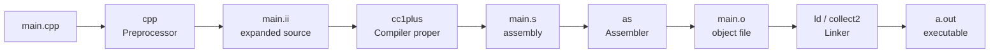

# GCC and g++

For most C++ developers — and especially for anyone learning C++ on Linux, macOS, or in a CI pipeline — `g++` is *the* compiler. It is the program that takes your `.cpp` files and turns them into a runnable executable. It is also a deeply powerful tool: behind a deceptively simple command-line interface sit four decades of optimisation research, dozens of warning categories, multiple language standards, sanitiser support, profile-guided optimisation, and cross-compilation for hundreds of architectures.

This note explains `g++` in depth. We will cover its history, the difference between `gcc` and `g++`, every flag you actually need to know, the multi-file compilation workflow, how to drive it with Make, and the common errors you will hit. After this note you will be able to read any `g++` invocation in any open-source project and understand exactly what it is doing.

## Background

### A brief history of GCC

GCC began in 1987 as the **GNU C Compiler** — Stallman's effort to provide a free, portable, optimising C compiler for the GNU operating system. It was a single, monolithic program for years, supporting only C.

In 1997, a group of developers frustrated with the slow pace of GCC development forked it into **EGCS** (Experimental GNU Compiler System). EGCS merged in features from many forks and was so successful that in 1999 the FSF designated EGCS as the official GCC. From that point the project was renamed the **GNU Compiler Collection**, reflecting that it now supported C, C++, Fortran, Ada, Objective-C, and (later) Go, D, and Modula-2 from a shared infrastructure.

Major releases that matter for C++ developers:

| Version | Year | C++ standard first supported |
|---------|------|------------------------------|
| GCC 2.95 | 1999 | C++98 (partial) |
| GCC 4.7 | 2012 | C++11 (partial) |
| GCC 4.8 | 2013 | C++11 (full) |
| GCC 5 | 2015 | C++14 (full) |
| GCC 7 | 2017 | C++17 (partial) |
| GCC 8 | 2018 | C++17 (full) |
| GCC 11 | 2021 | C++20 (partial) |
| GCC 12 | 2022 | C++20 (most features) |
| GCC 13 | 2023 | C++23 (partial) |
| GCC 14 | 2024 | C++23 (more), C++26 (partial) |

> [!info] ABI breaks
> GCC 5 introduced a new `std::string` and `std::list` ABI (the "C++11 ABI"). For several years you had to opt into it with `_GLIBCXX_USE_CXX11_ABI=1`. By GCC 9 the old ABI was deprecated; today the new ABI is the default and you should never have to think about it. But if you ever encounter a binary that mysteriously fails to link against `libstdc++.so.6` with `std::string` symbol errors, this is the historical reason.

### `gcc` vs `g++` — what is the actual difference?

Both `gcc` and `g++` are thin driver programs that invoke the same underlying compiler (`cc1plus` for C++, `cc1` for C). The difference is purely in the *defaults* the driver applies:

| Behaviour | `gcc` | `g++` |
|-----------|-------|-------|
| Determines language from extension `.cpp` / `.cc` / `.cxx` | C++ | C++ |
| Determines language from extension `.c` | C | **C++** (this is the trap) |
| Links `libstdc++` automatically | **No** | Yes |
| Defines `__cplusplus` macro when compiling a `.c` file | No | Yes |
| Default output filename | `a.out` | `a.out` |

The most important practical difference is the third row: **`gcc` does not link `libstdc++`**. If you compile a C++ program with `gcc`, you will get a wall of `undefined reference to 'std::cout'` errors at link time. You can force `gcc` to behave like `g++` with `-lstdc++ -lm`, but the correct fix is to invoke `g++` in the first place.

```bash
# WRONG: this will fail at link time on most C++ programs
gcc hello.cpp -o hello

# RIGHT: use g++ for C++ source files
g++ hello.cpp -o hello
```

> [!tip] Mnemonic
> Use `gcc` for `.c` files, use `g++` for `.cpp`/`.cc`/`.cxx` files. If you only remember one rule, remember: **"g++ = gcc + libstdc++"**.

## Main Content

### The GCC compilation stages

A single invocation of `g++` actually runs four distinct programs in sequence:



You can stop at any intermediate stage using one of three flags:

| Flag | Stop after stage | Output file (when given `main.cpp`) |
|------|-------------------|--------------------------------------|
| `-E` | Preprocessing | `main.ii` (or to stdout) |
| `-S` | Compilation (preprocessing + compiling to assembly) | `main.s` |
| `-c` | Assembly (preprocessing + compiling + assembling to object) | `main.o` |
| (none) | All four stages including linking | `a.out` |

This is covered in full depth in [[6. The Compilation Pipeline]] — for now, understand that every `g++` invocation is a pipeline, and the `-E`/`-S`/`-c` flags are how you inspect each stage.

### Specifying the C++ standard

```bash
g++ -std=c++20 main.cpp -o main
```

The `-std=` flag selects the language standard. Common values:

| Flag | Standard | Notes |
|------|----------|-------|
| `-std=c++98` | ISO/IEC 14882:1998 | Rarely needed today |
| `-std=c++03` | ISO/IEC 14882:2003 | Bug-fix release of C++98 |
| `-std=c++11` | ISO/IEC 14882:2011 | The "modern C++" turning point |
| `-std=c++14` | ISO/IEC 14882:2014 | Small refinement of C++11 |
| `-std=c++17` | ISO/IEC 14882:2017 | Major features: `std::optional`, structured bindings |
| `-std=c++20` | ISO/IEC 14882:2020 | Concepts, ranges, modules (partial), coroutines |
| `-std=c++23` | ISO/IEC 14882:2023 | `std::print`, `std::expected`, more |
| `-std=c++26` | (draft) | Experimental, available in GCC 14+ as `-std=c++26` |

There are also `gnu++NN` variants: `-std=gnu++20` enables C++20 *plus* GNU extensions. This is the default. If you want strict standard conformance (no GNU-specific builtins or extensions), use the `c++NN` form.

> [!warning] Default standard lags
> If you do not pass `-std`, GCC picks a default that is deliberately conservative. As of GCC 13, the default is `-std=gnu++17`. This means code using C++20 features (`std::format`, concepts, ranges) will *silently fail to compile* unless you explicitly request C++20. Always pass `-std=` in your build scripts.

### Warning flags

Warnings are the compiler telling you about code that *compiles* but is *probably* wrong. Treat warnings as gifts from a friend who has read more code than you.

```bash
g++ -Wall -Wextra -Wpedantic -Werror -Wshadow -Wconversion main.cpp -o main
```

- **`-Wall`** — Enables a curated set of "common" warnings. Despite the name, it does *not* enable *all* warnings; it enables the ones the GCC maintainers consider safe enough to recommend by default. Includes: unused variables, sign-compare in some cases, missing return statements, missing braces, etc.
- **`-Wextra`** — Enables warnings that are useful but sometimes noisy: empty parameter lists, comparison of signed/unsigned, missing field initializers, base classes not virtual-destructed when needed.
- **`-Wpedantic`** (older form: `-pedantic`) — Warns about code that uses compiler extensions or violates the strict letter of the standard. Required if you want portability between GCC, Clang, and MSVC.
- **`-Werror`** — Turns *all* warnings into errors, halting compilation. Best for CI; risky for local development where you might want to investigate a warning without being blocked.
- **`-Wshadow`** — Warns when a local variable shadows another variable in an outer scope. Catches an enormous class of subtle bugs.
- **`-Wconversion`** — Warns on implicit conversions that may lose data (e.g. `int` to `char`). Noisy but very valuable.
- **`-Wno-<name>`** — Disables a specific warning. Use to silence a noisy warning you have investigated and accepted.

> [!tip] Find the full warning list
> Run `g++ --help=warnings` for a summary, or `man g++` and search for `-W`. There are *hundreds*. A useful baseline for serious projects is `-Wall -Wextra -Wpedantic -Wshadow -Wnon-virtual-dtor -Wold-style-cast -Wcast-align -Wunused -Woverloaded-virtual -Wconversion -Wsign-conversion -Wnull-dereference -Wdouble-promotion -Wformat=2`. (Yes, that much. The CppCoreGuidelines project recommends this baseline.)

### Optimization flags

```bash
g++ -O2 main.cpp -o main        # release build
g++ -O0 -g main.cpp -o main     # debug build
```

The `-O` family selects how hard the compiler works to make your code fast:

| Flag | Meaning | When to use |
|------|---------|-------------|
| `-O0` (default) | No optimisation. Variables live on the stack as written; debugger sees exact source. | Debugging. |
| `-O1` | Light optimisation: dead-code elimination, simple inlining. | Debug builds where `-O0` is too slow. |
| `-O2` | Standard release optimisation: inlining, loop unrolling, vectorization, instruction scheduling. The "production" default. | Almost all release builds. |
| `-O3` | More aggressive: heavier inlining, more loop transformations. Sometimes faster, sometimes slower (cache effects). | Benchmark for your specific code. |
| `-Os` | Optimise for code size. Similar to `-O2` but disables optimisations that increase size. | Embedded systems, mobile. |
| `-Ofast` | `-O3` plus `-ffast-math` (which breaks strict IEEE 754 compliance). | Numerical code where you do not need exact floating-point semantics. **Dangerous for scientific code.** |
| `-Og` | Light optimisation that preserves debuggability. Recommended over `-O0` for modern debugging. | Debug builds with GDB. |

> [!info] Optimisation can change program behaviour (legally)
> The C++ standard permits the compiler to assume that certain undefined behaviours do not occur. With `-O2`, GCC aggressively exploits this. A program that "worked" at `-O0` may crash or produce wrong output at `-O2`. This is not a compiler bug — it is your program's UB being exposed. Common culprits: signed-integer overflow, use-after-free, reading uninitialized memory, data races.

### Debug-info flags

```bash
g++ -g -O0 main.cpp -o main          # default debug info
g++ -g3 -O0 main.cpp -o main         # include macros in debug info
g++ -gdwarf-4 main.cpp -o main       # force DWARF version 4
g++ -gsplit-dwarf main.cpp -o main   # split DWARF for faster linking
```

- **`-g`** — Generate debug info in the default format (DWARF on Linux, STABS on some legacy Unixes). Without `-g`, GDB will work but cannot map machine instructions back to source lines.
- **`-g3`** — Include macro definitions in debug info. Lets you expand macros in GDB with `print MACRO_NAME`.
- **`-ggdb3`** — Same as `-g3` but explicitly requests GDB-specific extensions. Today `-g3` is equivalent on Linux.
- **`-gsplit-dwarf`** — Splits debug info into a separate `.dwo` file. Dramatically speeds up linking for large projects because the linker does not have to copy debug info into every binary.

> [!tip] Always build with `-g` in development
> Even release builds benefit from `-g` — debug info is normally stripped from shipped binaries with `strip`, but during staging and testing it lets you decode crash backtraces with `addr2line`.

### Header-search and library-search flags

When you `#include <foo.hpp>`, GCC searches a list of directories. By default this list includes `/usr/include`, `/usr/local/include`, and the GCC-internal include directories. The `-I` flag adds to this list:

```bash
g++ -I./include -I./third_party/fmt/include main.cpp -o main
```

When you link a library, the same logic applies to `-L` (library search path) and `-l` (link a specific library):

```bash
g++ main.cpp -o main -L./lib -lfmt -lpthread
```

The order of `-l` flags matters: **libraries are searched left-to-right, and a library is only used to resolve symbols that are *currently undefined*.** This means if `libA` depends on `libB`, you must list `libA` *before* `libB`:

```bash
# CORRECT: A depends on B
g++ main.o -lA -lB -o main

# WRONG: B will not be searched because no symbols are undefined yet
g++ main.o -lB -lA -o main
```

> [!danger] "undefined reference" errors from the linker
> The most common linker error in C++ development — `undefined reference to 'foo'` — is almost always one of: (a) you forgot to list the source file, (b) you listed the `-l` flag in the wrong order, (c) you misspelled the library name, or (d) the library is the C one but you forgot `extern "C"` in your header. See [[6. The Compilation Pipeline]] for the full diagnostic flowchart.

### Preprocessor-defines flags

```bash
g++ -DDEBUG=1 -DNDEBUG -DBOOST_LOG_DYN_LINK main.cpp -o main
```

- **`-DNAME`** — Defines `NAME` as `1` (i.e. `#define NAME 1`).
- **`-DNAME=value`** — Defines `NAME` as `value`.
- **`-UNAME`** — Undefines `NAME`.

This is how you configure build variants from the command line rather than editing source. The classic example is `NDEBUG`: defining it disables `assert()` macros, which is the standard way to make release builds.

```cpp
#include <cassert>
int main() {
    int x = 5;
    assert(x == 6);  // Aborts in debug builds, does nothing in release.
}
```

```bash
g++ -DNDEBUG main.cpp -o main   # assert() disabled
./main                           # runs to completion
```

### Sanitizers (built into GCC)

GCC includes three runtime sanitizers that catch entire classes of bugs at the cost of a roughly 2× runtime overhead. They are *the single most valuable debugging tool in modern C++*:

```bash
g++ -fsanitize=address,undefined -g -O1 main.cpp -o main
```

- **`-fsanitize=address`** (ASan) — Catches out-of-bounds array access, use-after-free, double-free, stack-buffer-overflow, and memory leaks at exit. Adds red zones around every allocation.
- **`-fsanitize=undefined`** (UBSan) — Catches undefined behaviour: signed-integer overflow, null pointer dereference, integer division by zero, misaligned pointer access, shift past bit-width, and more.
- **`-fsanitize=thread`** (TSan) — Catches data races in multithreaded programs. Note: ASan and TSan are mutually exclusive; you cannot combine them.
- **`-fsanitize=leak`** (LSan) — Leak detection only; lighter than ASan. Often used in CI for leak-checking.

Sanitizers require you to compile *and link* with the flag. The runtime library must be linked in.

> [!tip] Sanitizer + `-g1` is the modern debugging workflow
> The combination of `-g -O1 -fsanitize=address,undefined` catches 80% of C++ bugs that would otherwise take hours to diagnose. Always develop with sanitizers on; turn them off only for production.

### Multi-file compilation workflow

Real projects have many `.cpp` files. Compiling them all in one `g++` invocation is wasteful because changing one file forces recompiling all of them. The standard solution is **separate compilation**:

```bash
# Step 1: Compile each .cpp to a .o (object file). Only recompile
#          files that have actually changed.
g++ -std=c++20 -c main.cpp    -o main.o
g++ -std=c++20 -c helper.cpp  -o helper.o
g++ -std=c++20 -c utils.cpp   -o utils.o

# Step 2: Link the .o files into an executable. Linking is much
#          faster than compiling.
g++ -std=c++20 main.o helper.o utils.o -o myapp
```

The two-step workflow means that editing `helper.cpp` only re-runs the second and fourth commands above, not all of them. This is what Make automates (see the Makefile below).

### Driving GCC with Make

```makefile
# --- Toolchain configuration ---
CXX      = g++
CXXFLAGS = -std=c++20 -Wall -Wextra -Wpedantic -Wshadow -g -O0
LDFLAGS  =
LDLIBS   =

# --- Project file lists ---
SRCS = $(wildcard src/*.cpp)
OBJS = $(SRCS:.cpp=.o)
DEPS = $(OBJS:.o=.d)
TARGET = build/myapp

# --- Default target ---
.PHONY: all clean
all: $(TARGET)

# --- Link the executable ---
$(TARGET): $(OBJS)
	@mkdir -p $(dir $@)
	$(CXX) $(CXXFLAGS) $(OBJS) -o $@ $(LDFLAGS) $(LDLIBS)

# --- Compile a single .cpp into a .o, with header-dependency tracking ---
%.o: %.cpp
	$(CXX) $(CXXFLAGS) -MMD -MP -c $< -o $@

# --- Pull in auto-generated header dependencies ---
-include $(DEPS)

# --- Housekeeping ---
clean:
	rm -f $(OBJS) $(DEPS) $(TARGET)
```

Three things deserve explanation:

1. **`$(wildcard src/*.cpp)`** globs all `.cpp` files in `src/`. No need to list them manually.
2. **`-MMD -MP`** asks GCC to generate a `.d` file beside each `.o` file containing the list of headers that `.cpp` depended on. The `-include $(DEPS)` line then tells Make to read these files, so editing a header correctly triggers recompilation of every `.cpp` that included it. **Without this, changing a header will not rebuild the files that include it.**
3. **`.PHONY: all clean`** declares targets that are not files. Without this, if a file named `clean` happens to exist in the directory, `make clean` will refuse to run.

> [!info] Makefile tabs
> Make requires that recipe lines (the lines under each target) start with a **TAB character**, not spaces. If you copy a Makefile from a website and it does not work, this is almost always the cause. Most editors can be configured to use tabs specifically in Makefiles.

### Cross-compilation with GCC

GCC can build binaries for a different architecture than the one it runs on. The standard pattern is to install a "cross-toolchain" with a *triplet prefix* and use that prefix instead of plain `g++`:

```bash
# Build for ARM 64-bit Linux from an x86-64 Linux machine
aarch64-linux-gnu-g++ -std=c++20 -O2 hello.cpp -o hello_arm64

# Build for Windows from Linux (MinGW-w64)
x86_64-w64-mingw32-g++ -std=c++20 hello.cpp -o hello.exe

# Verify the binary's architecture
file hello_arm64
# hello_arm64: ELF 64-bit LSB pie executable, ARM aarch64, ...
```

Cross-compilation also requires cross-versions of every library you link against. This is where dedicated toolchains (Yocto, Buildroot, vcpkg with custom triplets) become essential.

## Common Pitfalls

1. **Using `gcc` instead of `g++` for C++ files**: produces `undefined reference to std::cout` and similar linker errors. Always use `g++` for `.cpp`/`.cc`/`.cxx`.

2. **Forgetting `-std=c++20`**: GCC defaults to `-std=gnu++17`, so C++20 features will not compile. Always specify the standard explicitly.

3. **Wrong order of `-l` flags**: libraries must come *after* the objects that use them. `g++ -lA main.o` (library before object) will not link correctly.

4. **Building with `-O0` and shipping it**: Unoptimised builds are 5–20× slower than `-O2`. Always benchmark with the optimisation level you intend to ship.

5. **Treating warnings as cosmetic**: A warning is almost always a real bug or a portability hazard. The professional baseline is `-Wall -Wextra -Werror` in CI.

6. **Modifying a header but expecting Make to "just know"**: Plain Makefiles do not track header dependencies. You must use `-MMD -MP` (or a build system that does this for you, like CMake or Meson).

7. **Mixing `-fsanitize=address` and `-fsanitize=thread`**: They are mutually exclusive. Pick one per build.

8. **Linking against the wrong `libstdc++` ABI**: Very rare today, but if you link against a binary built before GCC 5, you may see `std::string` symbol errors. The fix is to recompile, or to set `_GLIBCXX_USE_CXX11_ABI=0` (deprecated).

9. **Forgetting `-pthread` (or `-lpthread`) when using `std::thread`**: On older GCC versions, multithreaded C++ programs would silently single-thread or crash. Modern GCC (4.8+) implies `-pthread` for `std::thread`, but it is still required for raw `pthread_*` calls.

10. **Compiling in the same directory as your source**: Clutters the project. Use `build/` directories and `out-of-tree` builds (covered in [[12. Build Systems and Project Structure]]).

## Tips and Tricks

- **`g++ -v hello.cpp -o hello`** prints every internal command GCC invokes (preprocessor, compiler, assembler, linker). The best way to demystify the toolchain.
- **`g++ -dM -E - < /dev/null`** prints every predefined preprocessor macro. Useful to discover `__GNUC__`, `__x86_64__`, `__linux__`, `__cplusplus`, and similar feature-test macros.
- **`g++ -ftime-report main.cpp`** prints a breakdown of how long each compilation phase took.
- **`g++ -fverbose-asm -S main.cpp`** annotates the generated assembly with the original C++ lines.
- **Use `-fuse-ld=gold` or `-fuse-ld=lld`** to switch linkers. `lld` (LLVM's linker) is dramatically faster than GNU `ld` on large projects.
- **`-MMD -MP`** is mandatory for any non-trivial Makefile. Always include it.
- **PGO (Profile-Guided Optimisation)**: compile with `-fprofile-generate`, run a representative workload, then recompile with `-fprofile-use`. Often gives 5–15% extra speedup over `-O2`.
- **LTO (Link-Time Optimisation)**: `-flto` lets the optimiser see across translation units. Combine with `-O2` or `-O3`. Slows linking but improves runtime.
- **Use `g++ --print-file-name=libstdc++.so`** to find the exact path to a library GCC will link against. Invaluable for debugging linker issues.

## Active Recall

1. What is the single most important practical difference between invoking `gcc` and invoking `g++` on a `.cpp` file?
2. Name the four stages GCC runs internally, and the three flags (`-E`, `-S`, `-c`) that stop after each early stage.
3. Why does `-Wall` *not* actually enable "all" warnings? Which flag would you add to get more?
4. What does `-O0` do that makes it the right choice for debugging? What is `-Og` and why might it be better?
5. Why is the order of `-l` flags significant, and what error do you get if the order is wrong?
6. Explain what `-MMD -MP` does in a Makefile, and what goes wrong if you omit it.
7. What are the four GCC sanitizers discussed? Which two are mutually exclusive?
8. What is the difference between `-std=c++20` and `-std=gnu++20`? Which is the default?
9. What does the GCC Runtime Library Exception permit that plain GPLv3 would not?
10. Walk through, in order, the commands you would use to compile and link a three-file project (`main.cpp`, `engine.cpp`, `utils.cpp`) with separate compilation.

## Next Steps

- [[1. GNU and Free Software]] — The philosophical and legal foundation that produced GCC.
- [[3. Clang and LLVM]] — The modern alternative compiler with a different architecture.
- [[4. MSVC and Other Compilers]] — The Windows-native compiler and Intel/ARM alternatives.
- [[6. The Compilation Pipeline]] — Deep dive into preprocessing, compiling, assembling, and linking.
- [[12. Build Systems and Project Structure]] — How Make, CMake, and Meson wrap `g++` for real projects.
- [[15. Debugging and Profiling]] — How GDB uses the debug info that `-g` produces.
