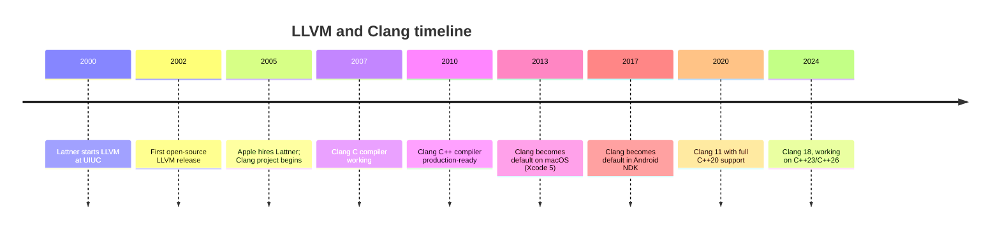
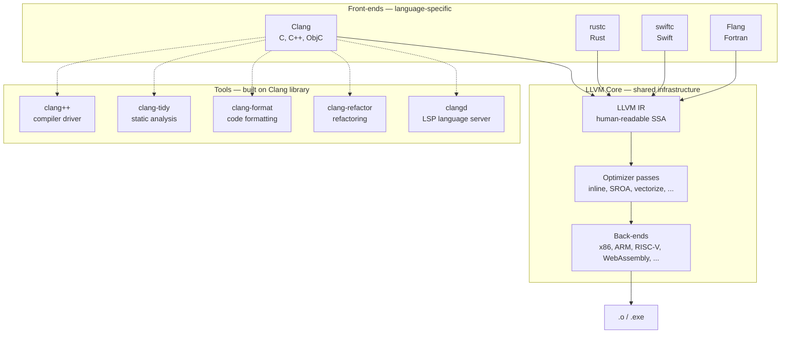
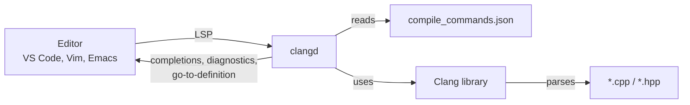

# Clang and LLVM

GCC has been the dominant free C++ compiler since 1987. By the mid-2000s, however, its architecture — a single monolithic codebase designed in the era of C — had become a serious obstacle. Compiler research was hard, contributors struggled to extend the codebase, and error messages were notoriously cryptic. **LLVM** and **Clang** were born to fix this. Today Clang is the default C++ compiler on macOS, the foundation of Apple's entire development stack, the engine behind many IDE features (IntelliSense, code completion, refactoring), and a first-class compiler on Linux and Windows.

This note explains what LLVM is, how Clang fits into it, why its error messages are universally praised, how it differs from GCC in practice, and the surrounding tooling (`clang-format`, `clang-tidy`, `lldb`) that has become the modern C++ developer's everyday toolkit.

## Background

### Why LLVM was built

LLVM began in 2000 as a research project by **Chris Lattner** at the University of Illinois Urbana-Champaign. His advisor, Vikram Adve, was interested in novel compiler techniques for dynamic optimisation. The name originally stood for "Low-Level Virtual Machine" — a JVM-like abstract machine for compilers — but the project quickly grew into a general-purpose compiler infrastructure, and today the name is officially just "LLVM" with no expansion.

The key insight was: **compilers should be modular**. A traditional compiler (like GCC at the time) is a single program that takes source code in, spits machine code out, and exposes no reusable interface in between. LLVM proposed a different design:

1. A **front-end** translates source code (C++, Rust, Swift, etc.) into an intermediate representation called **LLVM IR**.
2. An **optimizer** runs a long pipeline of passes on the IR — inlining, dead-code elimination, loop transformations — independent of the source language.
3. A **back-end** translates the optimised IR into machine code for a specific architecture, also independent of the source language.

Each of these pieces is a separate library. New languages plug in new front-ends. New architectures plug in new back-ends. The optimizer is shared infrastructure — write an optimisation once, and every language benefits.

> [!info] Why this matters for C++ developers
> The modularity means: (a) `clang-tidy`, `clang-format`, IDE tooling, and the compiler all share the *same* parser, so they never disagree about what your code means; (b) writing a new C++ static analysis is "just" an LLVM pass; (c) LLVM IR is human-readable and you can inspect exactly what the optimizer did. None of this was practical with the monolithic GCC of 2005.

### Clang's birth at Apple (2005)

In 2005, Apple hired Chris Lattner and made LLVM the foundation of its developer tools. GCC's licence (GPLv3 from version 4.2 onwards) was incompatible with Apple's business needs — Apple could not legally embed GCC into proprietary products like Xcode's code-completion engine without those products becoming GPL. LLVM's licence (Apache 2.0 with LLVM exceptions, formerly a BSD-like licence) had no such restriction.

Out of this need, Apple funded the development of **Clang** — a new C, C++, and Objective-C front-end for LLVM. The name is a portmanteau of "C" and "language", pronounced like the English word "clang". Work began in 2005; Clang became usable for production C++ around 2010; by 2013 it was the default compiler on macOS.



## Main Content

### The LLVM architecture



Key facts about this diagram:

- The **LLVM IR** is a typed, human-readable, register-based static-single-assignment language. You can dump it with `clang++ -S -emit-llvm main.cpp`. You can write it by hand.
- The **optimizer** is a sequence of "passes" — over 100 of them — that transform IR into more efficient IR. The pass pipeline is the same regardless of which front-end produced the IR.
- The **back-ends** generate machine code for each target. Adding a new architecture is "just" writing a new back-end; all front-ends immediately gain support.
- **Tools** like `clang-tidy` link against the Clang library and reuse its parser. This is why `clang-tidy`'s understanding of C++ syntax is always exactly as good as the compiler's — it *is* the compiler's parser.

### The Clang compilation pipeline

```mermaid
flowchart LR
    SRC[main.cpp] --> CPP[Preprocessor<br/>libclang]
    CPP --> AST[AST<br/>Abstract Syntax Tree]
    AST --> SEMA[Sema<br/>semantic analysis<br/>type-checking]
    SEMA --> IRGEN[IRGen<br/>AST → LLVM IR]
    IRGEN --> LIR[Unoptimised LLVM IR]
    LIR --> OPT[Optimizer<br/>~100 passes]
    OPT --> OIR[Optimised LLVM IR]
    OIR --> BE[Back-end<br/>instruction selection,<br/>register allocation,<br/>scheduling]
    BE --> ASM[main.s<br/>assembly]
    ASM --> ASMTOOL[llvm-mc<br/>assembler]
    ASMTOOL --> OBJ[main.o]
    OBJ --> LLD[ld.lld<br/>LLVM linker]
    LLD --> EXE[main executable]
```



Compare this to the GCC pipeline. The external shape is the same — preprocessing, compilation, assembly, linking — but the *internal* shape is fundamentally different: GCC's middle-end operates on a tree-like IR called GIMPLE; LLVM's operates on LLVM IR. The LLVM IR is a more aggressively designed format, with a cleaner type system and explicit memory model, which is one reason LLVM optimisations tend to be more aggressive on modern code.

### Why Clang's error messages are universally praised

Consider the following buggy C++:

```cpp
#include <vector>
int main() {
    std::vector<int> v;
    v.empace_back(42);   // typo: empace_back instead of emplace_back
}
```

**GCC's error:**

```
main.cpp: In function 'int main()':
main.cpp:4:6: error: 'class std::vector<int>' has no member named 'empace_back'
    4 |     v.empace_back(42);
      |     ~^~~~~~~~~~~
```

**Clang's error:**

```
main.cpp:4:6: error: no member named 'empace_back' in 'std::vector<int>'; did you mean 'emplace_back'?
    v.empace_back(42);
    ~^~~~~~~~~~~
     emplace_back
main.cpp:4:19: note: 'emplace_back' declared here
    1 | #include <vector>
      |                 ~~~~~~
  155 |     emplace_back(value_type __x)
      |     ^
```

Three things make Clang's diagnostic better:

1. **Did-you-mean suggestions**. Clang uses edit-distance matching to suggest the closest valid identifier. GCC has since caught up, but Clang still does it more often and more accurately.
2. **Fix-it hints**. Clang can tell you not only what was wrong but exactly what to insert, delete, or replace. Editors and IDEs can apply these automatically.
3. **Precise caret positioning**. Clang uses a tilde (`~`) under exactly the offending range, not just a caret at the start of the token. For multi-character errors this is far clearer.

> [!tip] Color and rich diagnostics
> Clang enables colored diagnostics by default when stdout is a terminal. You can force this on or off with `-fcolor-diagnostics` / `-fno-color-diagnostics`. The same flags exist in GCC as `-fdiagnostics-color=always` / `=never`.

### `clang++` vs `g++`: flag compatibility

Clang was designed to be a **drop-in replacement** for GCC. Almost every command-line flag that works with `g++` also works with `clang++`:

| Flag | `g++` | `clang++` |
|------|-------|-----------|
| `-std=c++20` | Yes | Yes |
| `-Wall -Wextra -Wpedantic` | Yes | Yes |
| `-O0` / `-O1` / `-O2` / `-O3` / `-Os` / `-Ofast` | Yes | Yes |
| `-g` / `-g3` | Yes | Yes |
| `-c` / `-S` / `-E` | Yes | Yes |
| `-I` / `-L` / `-l` / `-D` | Yes | Yes |
| `-fsanitize=address,undefined,thread` | Yes | Yes |
| `-flto` | Yes | Yes |
| `-MMD -MP` | Yes | Yes |
| `-fprofile-generate` / `--fprofile-use` (PGO) | Yes | Yes |
| `-fuse-ld=lld` | Yes | Yes (lld is LLVM's) |

The few flags that *differ*:

- `-fsanitize=memory` (MSan) is Clang-only. GCC has no equivalent. MSan catches reads of uninitialized memory — invaluable for security-sensitive code.
- `-fsanitize=cfi` (Control Flow Integrity) is Clang-only.
- `-fwhole-program-vtables` is Clang-only (related to CFI and devirtualisation).
- Some `-W` warning names differ. `-Wnull-dereference` is GCC; Clang uses `-Wnull-dereference` too but also has its own set of `-W` flags (try `clang++ -Weverything` to see them all — it is far noisier than GCC's, hence not for production).
- `__GNUC__`, `__GNUC_MINOR__` are predefined by both compilers (Clang defines them for GCC compatibility). Clang also defines `__clang__`, `__clang_major__`, etc.

```bash
# A typical Clang invocation — almost indistinguishable from g++
clang++ -std=c++20 -Wall -Wextra -Wpedantic -O2 -g main.cpp -o main
```

> [!info] When to choose Clang over GCC
> Use Clang when: (a) you are on macOS (it is the system compiler); (b) you want `-fsanitize=memory` or CFI; (c) you want faster compilation of large projects (Clang is often measurably faster); (d) you want the best error messages for teaching or onboarding; (e) you want to use `clang-tidy` or `clangd` for IDE integration. Use GCC when: (a) you are on Linux and want maximum compatibility with existing toolchains; (b) you need a feature Clang does not yet implement (rare today, but happens on the bleeding edge of C++23/26); (c) you need GCC-specific extensions or builtins.

### Clang-specific tools you should know

#### `clang-format`

A standalone code formatter. Reads a `.clang-format` file in YAML that specifies indentation, brace placement, column limit, alignment, etc. Applies one consistent style across an entire codebase. The de facto standard for C++ style enforcement.

```bash
# Generate a starting .clang-format file
clang-format -style=google -dump-config > .clang-format

# Format a file in place
clang-format -i main.cpp

# Format all .cpp/.hpp files in a tree
find . -name '*.cpp' -o -name '*.hpp' | xargs clang-format -i
```

Most editors (VS Code, CLion, Vim with clang-format plugin, Emacs with clang-format.el) can run `clang-format` on every save.

#### `clang-tidy`

A static-analysis linter that runs *on top of* the Clang parser. Ships with hundreds of "checks" grouped into categories: `bugprone-*`, `cert-*`, `cppcoreguidelines-*`, `modernize-*`, `performance-*`, `readability-*`, `clang-analyzer-*`.

```bash
# Run modernize checks (suggests C++11/14/17/20 idioms)
clang-tidy -checks='-*,modernize-*' main.cpp -- -std=c++20

# Run the C++ Core Guidelines checks
clang-tidy -checks='-*,cppcoreguidelines-*' main.cpp -- -std=c++20

# Apply automatic fix-its
clang-tidy -checks='-*,modernize-use-nullptr' -fix main.cpp -- -std=c++20
```

The `--` separates `clang-tidy` flags from compiler flags that follow. The modernize checks alone can teach you most of what changed between C++98 and C++17.

#### `clangd`

A language server (LSP implementation) built on Clang. Provides code completion, go-to-definition, find-references, hover docs, and diagnostics to any editor that speaks LSP (VS Code, Vim with coc.nvim, Emacs with lsp-mode, Helix, Neovim). Reads `compile_commands.json` (produced by CMake with `-DCMAKE_EXPORT_COMPILE_COMMANDS=ON`) to know the exact compile flags for each file.



#### `lldb` vs `gdb`

LLDB is LLVM's debugger, the default on macOS. For C++ programs compiled with Clang it is essentially interchangeable with GDB for everyday use:

| Feature | `gdb` | `lldb` |
|---------|-------|--------|
| Default on | Linux GCC builds | macOS, iOS, Android NDK |
| Command syntax | GDB's classic syntax (`break main`, `run`, `next`) | Mostly GDB-compatible, plus an LLDB-specific syntax (`b main`, `r`, `n`) |
| Python scripting | Yes | Yes (slightly more modern API) |
| STL pretty-printers | Built-in for libstdc++ | Built-in for both libc++ and libstdc++ |
| Reverse debugging | Yes (on Linux with `record`) | Limited |
| Speed on large binaries | Slower | Often faster |

A pragmatic recommendation: use whichever is the default on your platform. If you work on macOS, learn LLDB; on Linux, learn GDB. The command syntax overlaps ~80%.

### `libc++` vs `libstdc++`

Clang ships with its own C++ standard library implementation, **libc++**, originally developed at Apple. GCC ships **libstdc++**. Clang can link against either; GCC effectively only links libstdc++.

```bash
# Use libc++ (Clang's default on macOS, optional on Linux)
clang++ -stdlib=libc++ main.cpp -o main

# Use libstdc++ (Clang's default on Linux)
clang++ -stdlib=libstdc++ main.cpp -o main
```

When does this matter?

- **macOS**: libc++ is the only fully-supported option. macOS does not ship a current libstdc++.
- **Linux**: most distributions default Clang to libstdc++ for compatibility with the rest of the system. You can opt into libc++ with `-stdlib=libc++`, but then you need to also have `libc++-dev` installed.
- **Cross-platform ABI**: binaries linked against libc++ and libstdc++ are *not* ABI-compatible. You cannot pass a `std::string` from a libstdc++-built shared library to a libc++-built executable — the layouts differ.

> [!warning] Mixing libc++ and libstdc++ in one process
> If you link a shared library built with one standard library into an executable built with the other, you will get linker errors (different mangled names for `std::string` etc.) or, worse, mysterious runtime crashes from layout mismatches. Always use the same standard library for every component in a process.

## Code Examples

### Example 1: Side-by-side error message comparison

```cpp
// broken.cpp
#include <string>
#include <iostream>

struct Person {
    std::string name;
    int age;
};

int main() {
    Person p;
    std::cout << p.nam << '\n';  // typo: nam instead of name
}
```

```bash
g++      -std=c++20 broken.cpp -o broken 2>&1 | head -20
clang++  -std=c++20 broken.cpp -o broken 2>&1 | head -20
```

Try this yourself — the difference in suggestion quality and the under-range highlighting is the easiest way to feel the value of Clang.

### Example 2: Dumping LLVM IR

```cpp
// add.cpp
int add(int a, int b) {
    return a + b;
}
```

```bash
# Emit unoptimised LLVM IR
clang++ -S -emit-llvm -O0 add.cpp -o add.ll

# Emit optimised LLVM IR (see what the optimiser did)
clang++ -S -emit-llvm -O2 add.cpp -o add_opt.ll

# Diff to see what -O2 changed
diff add.ll add_opt.ll
```

The unoptimised IR is verbose and clearly maps to your source. The optimised IR for `add(int, int)` will typically be just a `ret i32 add` — Clang realises the function is just `add` and lowers it directly to a single machine instruction.

### Example 3: Using Clang sanitizers (including MSan, which GCC lacks)

```cpp
// use_uninit.cpp
#include <iostream>
int main() {
    int x;            // uninitialized
    std::cout << x;   // UB: read of uninitialized memory
}
```

```bash
# GCC has no equivalent to MSan. Clang does:
clang++ -fsanitize=memory -g -O1 use_uninit.cpp -o use_uninit
./use_uninit
# ==1234==WARNING: MemorySanitizer: use-of-uninitialized-value
#     #0 0x... in main use_uninit.cpp:4:18
#     ...
```

### Example 4: clang-tidy as a teacher

```cpp
// legacy.cpp
#include <stdio.h>
int main() {
    int* p = NULL;   // pre-C++11 idiom
    if (p == NULL) printf("null\n");
    return 0;
}
```

```bash
clang-tidy -checks='-*,modernize-use-nullptr,modernize-use-nullptr' \
           legacy.cpp -- -std=c++20

# Output:
# warning: use nullptr [modernize-use-nullptr]
#     int* p = NULL;
#              ^~~~
#              nullptr
```

`clang-tidy` literally teaches you the modern idiom and offers a fix-it. This is one of the fastest ways to upgrade a legacy C++ codebase.

## Common Pitfalls

1. **Mixing `libc++` and `libstdc++` in the same process**: produces ABI mismatches. Pick one and stick with it across all libraries.

2. **Expecting `-Weverything` to be reasonable**: it enables *every* Clang warning, including ones that are noisy or experimental. Use `-Wall -Wextra -Wpedantic` and selectively add what you want.

3. **Forgetting `--` in `clang-tidy` invocations**: the `--` separates clang-tidy flags from compiler flags. Without it, `-std=c++20` will be misinterpreted.

4. **Assuming `clang++` and `g++` produce identical code**: they do not. Floating-point edge cases, ABI layout details, and template instantiation order can all differ. If you ship a library, test with both.

5. **Using LLDB on a binary compiled without debug info**: LLDB is no better than GDB at reading non-existent debug info. Always pass `-g`.

6. **Using the system Clang on Ubuntu LTS, which lags**: Ubuntu's Clang is often one or two major versions behind upstream. For modern C++23 features you may need the `llvm.org/apt/` repository.

7. **Forgetting that `clang` (no `++`) compiles C, not C++**: same trap as `gcc`/`g++`. Use `clang++` for C++.

8. **Not running `clang-format` before commit**: the easiest way to prevent code-style arguments is to have `clang-format` enforce one style. Configure your CI to fail if `clang-format --dry-run` reports changes.

## Tips and Tricks

- **`clang++ -Xclang -ast-dump -fsyntax-only main.cpp`** dumps the AST Clang built for your file. The ultimate tool for understanding what the compiler sees.
- **`clang++ -emit-llvm -S -O2 main.cpp -o -`** pipes optimised LLVM IR to stdout for inspection.
- **`llvm-mca`** (LLVM Machine Code Analyzer) predicts the performance of a hot loop on a specific CPU microarchitecture. Invaluable for performance work.
- **`llvm-objdump -d main`** disassembles a binary. More readable than GNU `objdump` on modern binaries.
- **`llvm-profdata` and `llvm-cov`** are Clang's equivalent of `gcov` for code coverage, with much better reports.
- **`clangd` + `compile_commands.json`** is the modern C++ IDE workflow. If you are not using it, you are missing the single biggest quality-of-life improvement in modern C++ development.
- **`clang-tidy -fix`** can auto-apply many fix-its, turning it into a refactoring tool, not just a linter.
- **Install `lld`** (`sudo apt install lld`) and use `-fuse-ld=lld` — link times on large projects can drop by 5–10×.
- **`-ftime-trace`** (Clang only) produces a Chrome-trace JSON file showing exactly where compile time went. Brilliant for diagnosing slow builds.

## Active Recall

1. What year was LLVM started, by whom, and at which institution? What did the acronym originally stand for?
2. Why did Apple fund Clang in 2005? What licence issue with GCC motivated it?
3. Sketch the three-part LLVM architecture (front-end, optimizer, back-end) and explain what flows between them.
4. Name three Clang features that GCC lacks or implements less aggressively.
5. What is LLVM IR, and how do you inspect it from the command line?
6. List four tools that link against the Clang library and what each does.
7. What is the difference between `libc++` and `libstdc++`? When must you not mix them?
8. What does the `--` separator do in a `clang-tidy` invocation?
9. Name two Clang-specific sanitizers and what they catch.
10. Compare and contrast `lldb` and `gdb` for everyday debugging of a C++ program. When would you choose each?

## Next Steps

- [[2. GCC and g++]] — The other major C++ compiler; understand the differences and shared flags.
- [[4. MSVC and Other Compilers]] — The Windows compiler and the broader landscape.
- [[5. Compile-time vs Runtime]] — What Clang does at compile time vs what your program does at runtime.
- [[6. The Compilation Pipeline]] — The pipeline Clang implements, in depth.
- [[12. Build Systems and Project Structure]] — How CMake drives Clang and generates `compile_commands.json` for `clangd`.
- [[15. Debugging and Profiling]] — LLDB in detail, plus sanitiser workflows.
