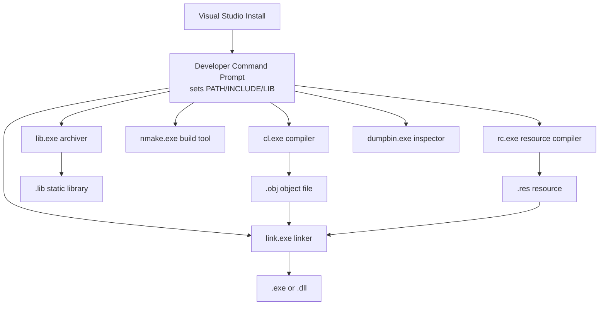
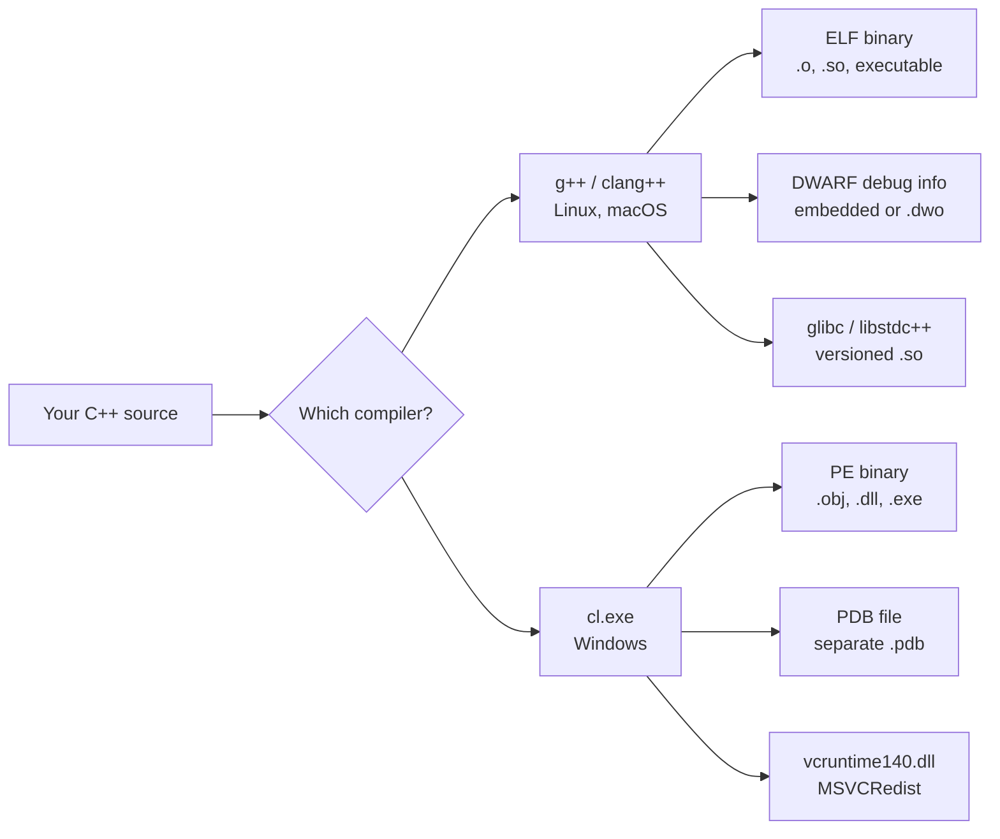
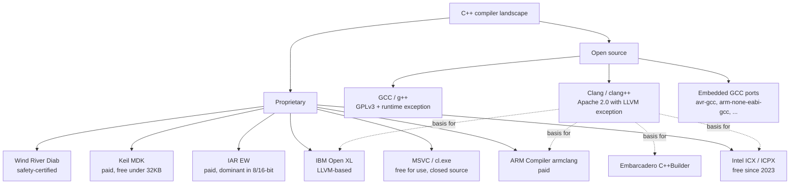

# MSVC and Other Compilers

GCC and Clang dominate Linux and macOS development, but the C++ world is broader than that. **Microsoft Visual C++ (MSVC)** is the compiler inside Visual Studio and the default — and often mandatory — compiler for native Windows development. **Intel's ICX/ICPX** targets HPC and scientific computing with aggressive auto-vectorisation. **ARM's `armclang`** is the standard for embedded ARM Cortex development. **IAR** and **Keil** dominate 8- and 16-bit microcontrollers. **Wind River's Diab** powers safety-critical automotive ECUs.

A C++ mastery vault that ignores these compilers leaves a hole in your toolkit. This note covers MSVC in detail (its flags, its quirks, its PDB-based debug format), surveys the other major compilers, and ends with a practical discussion of cross-compilation. After this note you will be able to read any C++ build script — Windows, embedded, HPC, or mobile — and know which compiler is being used and why.

## Background

### The Windows C++ ecosystem

Microsoft has shipped a C++ compiler since the late 1980s. The line of descent runs roughly:

- **Microsoft C/C++ Compiler** (1987–1993): the original `cl.exe`, sold separately.
- **Visual C++ 1.0** (1993): integrated into the new Visual Studio IDE.
- **MSVC 6.0** (1998): wildly popular, notoriously non-standards-compliant (it predated C++98 by months and never fully implemented it).
- **MSVC .NET 2002 / 2003 (VC7 / VC7.1)**: the rewrite, much more standard-compliant.
- **MSVC 2005–2019 (VC8–VC14.2)**: steady improvement.
- **MSVC 2022 (VC14.3)**: current major version, full C++20, partial C++23.

> [!info] The MSVC ABI break
> Unlike GCC's single ABI break (the GCC 5 transition), MSVC has had *several* ABI breaks. Each major version of MSVC ships its own C++ runtime library (`msvcr140.dll`, `vcruntime140.dll`, etc.) and you cannot mix object files or DLLs built with different major versions of MSVC. This is the source of the infamous "MSVCR140.dll not found" error on Windows — it means the user does not have the Visual C++ Redistributable for VS 2015–2022 installed.

### The Visual Studio "toolset" model

MSVC is never just `cl.exe`. The Windows C++ toolchain is a *set* of programs:

- `cl.exe` — the compiler (and the only one most people invoke directly).
- `link.exe` — the linker.
- `lib.exe` — static library archiver (the MSVC equivalent of `ar`).
- `nmake.exe` — Microsoft's Make clone.
- `rc.exe` — resource compiler (compiles `.rc` files into Windows resources embedded in PE binaries).
- `editbin.exe` — binary patching tool (e.g. to set the `/LARGEADDRESSAWARE` flag).
- `dumpbin.exe` — the MSVC equivalent of `objdump`/`nm`/`readelf` rolled together.
- `ml64.exe` — the Microsoft Macro Assembler (MASM), for x64.

Visual Studio ships these in a special **Developer Command Prompt** that sets the `PATH`, `INCLUDE`, `LIB`, and `LIBPATH` environment variables so that `cl` can find headers, libraries, and the CRT. If you open a regular `cmd.exe` and type `cl`, you will get "command not found". You must use the Developer Command Prompt (or run `vcvarsall.bat` yourself).



## Main Content

### Invoking `cl.exe`

```bat
cl /EHsc /W4 /std:c++20 /O2 main.cpp
```

Compared to `g++`/`clang++`, MSVC flags use a different syntax: `/flag` instead of `-flag`, and arguments are separated by spaces (sometimes by colons). Let's decode the above:

| Flag | Meaning |
|------|---------|
| `/EHsc` | Enable C++ exception handling with `extern "C"` functions assumed not to throw. This is the standard setting; without it, throwing an exception is undefined behaviour. |
| `/W4` | Warning level 4 (the highest practical level — `/Wall` enables warnings that are too noisy for production). Equivalent to roughly `-Wall -Wextra`. |
| `/std:c++20` | Compile against the C++20 standard. (Older flag: `/std:c++latest` enables the latest *draft* features.) |
| `/O2` | Optimise for speed. Equivalent to GCC's `-O2`. Other options: `/O1` (size), `/Ox` (a subset of `/O2`, older), `/Od` (no optimisation, default for debug). |
| `main.cpp` | The source file. The output will be `main.exe` and `main.obj` (intermediate). |

Other essential MSVC flags:

| Flag | Meaning |
|------|---------|
| `/Fe:<name>` | Name the output executable (default: source basename + `.exe`). Equivalent of GCC's `-o`. |
| `/Fo:<dir>` | Place `.obj` files in `<dir>`. There is no single-flag equivalent in GCC; you specify output per file with `-o`. |
| `/c` | Compile only, do not link. Equivalent of GCC's `-c`. |
| `/I<dir>` | Add an include directory. Equivalent of GCC's `-I`. |
| `/D<name>` | Define a preprocessor macro. Equivalent of GCC's `-D`. |
| `/link <flags>` | Pass flags through to `link.exe`. Use this for libraries: `cl main.cpp /link kernel32.lib user32.lib`. |
| `/MD` | Link against the *dynamic* multithreaded CRT (`msvcrt.lib` → `vcruntime140.dll`). The default for release builds. |
| `/MT` | Link against the *static* multithreaded CRT (`libcmt.lib`). Produces a self-contained `.exe` but a larger one. |
| `/MDd` / `/MTd` | Debug versions of the above (`/MDd` → `msvcrtd.lib`). |
| `/Zi` | Generate full debug info in a separate PDB file. Equivalent of GCC's `-g`. |
| `/Z7` | Generate debug info embedded in the `.obj` (older format, less common). |
| `/GL` | Whole-program optimisation (LTO). Equivalent of GCC's `-flto`. |
| `/permissive-` | Strict standards-conformance mode. **Always use this in modern code.** Without it, MSVC silently allows two-phase lookup violations and other non-conformances. |
| `/Wx` | Treat warnings as errors. Equivalent of GCC's `-Werror`. |
| `/utf-8` | Treat source files and string literals as UTF-8. Essential on any project that touches non-ASCII. |
| `/std:c++latest` | Use the latest draft standard supported by this version of MSVC (currently partial C++26). |

> [!danger] `/permissive-` is essential
> Pre-2019 MSVC was notoriously lenient about template two-phase lookup. The `/permissive-` flag (introduced in VS 2017, default in VS 2019+) enforces the standard. If you write code that compiles on MSVC but fails on GCC/Clang, the most common cause is missing `/permissive-`. Always enable it.

### MSVC vs GCC/Clang feature comparison



| Aspect | GCC / Clang | MSVC |
|--------|-------------|------|
| Object file format | ELF (Linux), Mach-O (macOS) | PE/COFF |
| Executable format | ELF / Mach-O | PE |
| Debug info | DWARF (embedded or in `.dwo`) | PDB (separate `.pdb` file) |
| Dynamic library extension | `.so` (Linux), `.dylib` (macOS) | `.dll` |
| Static library extension | `.a` | `.lib` |
| Import library | n/a | `.lib` (import lib, distinct from static lib) |
| Standard library | libstdc++ (GCC) or libc++ (Clang) | MSVC STL (ships with Visual Studio) |
| C runtime | glibc | Universal CRT (UCRT, since Windows 10) |
| Symbol mangling | Itanium C++ ABI | MSVC C++ ABI (incompatible) |
| Export visibility | `__attribute__((visibility("default")))` | `__declspec(dllexport)` / `__declspec(dllimport)` |
| Build system default | Make, CMake, Meson, Ninja | MSBuild, CMake, Ninja |

> [!warning] ABI incompatibility between MSVC and GCC/Clang-on-Windows
> You cannot link an MSVC-compiled `.obj` against a MinGW-compiled library, and vice versa. The C++ name-mangling, exception model, and struct layout rules differ. The only safe boundary is `extern "C"` functions, which use a shared calling convention but still cannot throw C++ exceptions across. If you must mix MinGW and MSVC code, use a C-style FFI with no exceptions crossing the boundary.

### PDB files: the Windows debug format

Where GCC and Clang embed DWARF debug info inside the binary (or split it into `.dwo`), MSVC writes all debug info into a separate **PDB (Program Database)** file. This has practical consequences:

- A release `.exe` shipped without its `.pdb` will produce useless stack traces.
- You can keep PDBs in a symbol server and use Microsoft's `symchk` / `symstore` tooling to retrieve them on demand when debugging crashes.
- PDBs are *required* for stack-trace decoding in tools like WinDbg, Visual Studio, Crashpad, and Breakpad.

```bat
:: Build with debug info
cl /Zi /EHsc /std:c++20 main.cpp /Fe:myapp.exe

:: myapp.pdb is generated alongside myapp.exe
:: Move both to a symbol server:
symstore add /f myapp.pdb /s \\myserver\symbols /t MyApplication
```

> [!tip] Always archive your PDBs
> When you ship a binary, archive its PDB. Six months later when a customer sends you a crash dump, you will need the matching PDB to translate addresses into function names. This is the Windows equivalent of "always build with `-g`".

### The Visual Studio IDE vs the command line

Visual Studio the IDE is one of the best C++ IDEs in existence — its debugger in particular is widely considered the best-in-class for native code. But it is also a heavyweight tool, and many developers prefer to use `cl` directly from the command line, or to drive `cl` via CMake and a separate editor (VS Code, CLion, Vim).

A modern CMake-based project that targets Windows can use either MSVC or Clang-on-Windows (which Microsoft ships as the `ClangCL` toolset). Both produce PE binaries and PDB debug info:

```bat
:: Use MSVC
cmake -G "Visual Studio 17 2022" -A x64 .

:: Use Clang on Windows (Microsoft's distribution of Clang)
cmake -G "Visual Studio 17 2022" -A x64 -T ClangCL .

:: Use Ninja with MSVC underlying
cmake -G Ninja -DCMAKE_C_COMPILER=cl -DCMAKE_CXX_COMPILER=cl .
```

### Other compilers worth knowing

#### Intel ICX / ICPX

Intel's compilers (`icx` for C, `icpx` for C++) replaced the classic `icc`/`icpc` in 2023. They are now **built on top of Clang/LLVM** — they *are* Clang with Intel's back-end plugged in, plus Intel's high-performance libraries (MKL, TBB) on top. Key use cases:

- HPC: aggressive auto-vectorisation for AVX-512, including Intel's "Deep Vector" intrinsics.
- Fortran: `ifx` is the LLVM-based Fortran compiler, replacing `ifort`.
- Cross-CPU targeting: the same source can target Intel CPUs, Intel GPUs (with SYCL), and Intel FPGAs.

```bash
icpx -std=c++20 -O3 -march=native simulation.cpp -o simulation
```

Intel's compilers are now free for all use, including commercial. They remain closed-source.

#### ARM Compiler (`armclang`)

ARM's official compiler, used for embedded Cortex-M and Cortex-A development. Like Intel ICX, modern `armclang` is built on Clang/LLVM. It replaces the older `armcc`. Sold as part of Arm Development Studio. Many embedded shops use it because it generates tighter code than open-source GCC for ARM, especially for the small-footprint Cortex-M0/M3/M4 cores.

```bash
armclang --target=arm-arm-none-eabi -mcpu=cortex-m4 -O2 -std=c++17 firmware.cpp -o firmware.elf
```

#### IAR Embedded Workbench

Closed-source compiler dominant in 8- and 16-bit microcontroller development (8051, AVR, MSP430, STM8) and competitive on 32-bit ARM. Famous for extremely tight code size — often 30–50% smaller than GCC on the same hardware. Licensed per-architecture; expensive.

#### Keil MDK (Microcontroller Development Kit)

ARM-owned. Uses the ARM Compiler (`armclang` or the older `armcc`) for Cortex-M development. The de facto standard for STM32, NXP, and Nordic Semiconductor projects. The free version has a 32 KB code-size limit.

#### Wind River Diab

Used in safety-critical automotive (ISO 26262 ASIL-D) and aerospace (DO-178C) certification. Closed-source, expensive, but certified. The compiler itself produces verification artifacts that auditors require.

#### Oracle Developer Studio (`CC`)

Solaris-native C++ compiler. Still in use at large enterprises with Solaris infrastructure; otherwise fading.

#### IBM XL C/C++

IBM's compiler for AIX and IBM i. Now being replaced by `IBM Open XL C/C++`, which is LLVM-based.

#### Embarcadero (Borland) C++Builder

Still actively developed; popular for Windows GUI applications with the VCL/FMX frameworks. Uses Clang-based compilers since 2019.

### The compiler landscape: a unified view



A pattern is clear: **Clang/LLVM is becoming the shared infrastructure for almost every proprietary compiler**. Intel, ARM, IBM, and Embarcadero have all migrated to LLVM-based front-ends. GCC remains the largest independent alternative.

### Cross-compilation concepts

Cross-compilation is building binaries for platform B on platform A. It is essential for:

- Embedded development (build on Linux x86-64, run on ARM Cortex-M).
- Mobile development (build on Mac x86-64, run on iOS ARM64).
- Game console development (build on Windows x86-64, run on PlayStation 5, Xbox Series, Switch).
- Container image creation (build on Mac, run on Linux in a container).

The fundamental requirements for cross-compilation:

1. **A cross-compiler** that emits code for the target architecture. This is GCC/Clang built with a different default target.
2. **Target headers and libraries** so the compiler can find `<iostream>`, libc, etc. for the target.
3. **A target-aware build system** that does not accidentally run host binaries on the target during build.
4. **A triplet** that identifies the target: `<arch>-<vendor>-<os>-<libc>`. Examples: `aarch64-linux-gnu`, `arm-none-eabi`, `x86_64-w64-mingw32`.

```bash
# Cross-compile for ARM64 Linux from x86-64 Linux
aarch64-linux-gnu-g++ -std=c++20 -O2 hello.cpp -o hello_arm64

# Cross-compile for Windows from Linux
x86_64-w64-mingw32-g++ -std=c++20 hello.cpp -o hello.exe

# Cross-compile for 32-bit ARM bare metal
arm-none-eabi-g++ -std=c++20 -mcpu=cortex-m4 -O2 \
    -ffreestanding -nostdlib firmware.cpp -o firmware.elf
```

LLVM's "single-compiler-many-targets" design makes cross-compilation simpler: a single `clang++` binary can target any architecture it was built with back-ends for, just by passing `--target=`:

```bash
# Same clang++ binary, different target
clang++ --target=aarch64-linux-gnu -std=c++20 hello.cpp -o hello_arm64
clang++ --target=x86_64-w64-mingw32   -std=c++20 hello.cpp -o hello.exe
clang++ --target=wasm32               -std=c++20 hello.cpp -o hello.js
```

You still need target libraries (libstdc++ built for aarch64, etc.), but the *compiler* itself is unified.

## Code Examples

### Example 1: A minimal MSVC build

```cpp
// hello.cpp
#include <iostream>
int main() {
    std::cout << "Built with MSVC " << _MSC_VER << '\n';
    return 0;
}
```

```bat
:: In Developer Command Prompt for VS 2022
cl /EHsc /W4 /std:c++20 /permissive- /utf-8 /O2 hello.cpp /Fe:hello.exe
hello.exe
:: Built with MSVC 1938
```

`_MSC_VER` is the MSVC version macro. Major version `1938` corresponds to Visual Studio 2022 17.8. The mapping is published on Microsoft's "Visual C++ compiler version" page.

### Example 2: Detecting the compiler in source code

```cpp
// which_compiler.cpp
#include <iostream>

int main() {
#if defined(__clang__)
    std::cout << "Clang " << __clang_major__ << "."
              << __clang_minor__ << "."
              << __clang_patchlevel__ << '\n';
#elif defined(__GNUC__)
    std::cout << "GCC " << __GNUC__ << "."
              << __GNUC_MINOR__ << "."
              << __GNUC_PATCHLEVEL__ << '\n';
#elif defined(_MSC_VER)
    std::cout << "MSVC " << _MSC_VER << '\n';
#else
    std::cout << "Unknown compiler\n";
#endif
    return 0;
}
```

`#if defined(...)` is the standard way to write portable C++ across compilers. Order matters: check `__clang__` *before* `__GNUC__` because Clang also defines `__GNUC__` for compatibility.

### Example 3: Cross-platform build with CMake

```cmake
# CMakeLists.txt
cmake_minimum_required(VERSION 3.20)
project(hello CXX)

set(CMAKE_CXX_STANDARD 20)
set(CMAKE_CXX_STANDARD_REQUIRED ON)
set(CMAKE_CXX_EXTENSIONS OFF)

# Compiler-specific flags
if(MSVC)
    add_compile_options(/W4 /permissive- /utf-8 /EHsc)
    # Disable the unsafe CRT warnings (_CRT_SECURE_NO_WARNINGS)
    add_compile_definitions(_CRT_SECURE_NO_WARNINGS)
else()
    add_compile_options(-Wall -Wextra -Wpedantic -Wshadow)
endif()

add_executable(hello hello.cpp)
```

This is the canonical pattern for portable CMake: a common baseline (`C++20`, no extensions) plus per-compiler flag selection via `if(MSVC) / else()`.

## Common Pitfalls

1. **Forgetting `/EHsc` on MSVC**: without it, throwing an exception calls `std::terminate`. This is the single most common MSVC error for developers coming from GCC/Clang.

2. **Mixing `/MD` and `/MT` in the same project**: produces linker errors about multiple definitions of CRT symbols. Pick one CRT linkage for the entire project (and every dependency).

3. **Not using `/permissive-`**: silent non-conformance bugs that compile on MSVC but fail on other compilers. Always enable.

4. **Shipping without the VC++ Redistributable**: users see "VCRUNTIME140.dll not found". Either statically link (`/MT`), or instruct users to install the Redistributable, or bundle the DLLs alongside your `.exe` (per Microsoft's licensing terms).

5. **Using `cl` outside the Developer Command Prompt**: "cl is not recognized". Always use the Developer Command Prompt or run `vcvarsall.bat x64`.

6. **Assuming MSVC matches GCC/Clang on standard conformance**: MSVC was years behind on `constexpr` improvements, two-phase lookup, and several C++20 features. As of VS 2022 17.6+ it is largely caught up, but check feature-test macros (`__cpp_*`) before assuming a feature works.

7. **Cross-compiling without the target's libstdc++**: The compiler can emit machine code for any target, but you still need the *target's* standard library. Install `g++-aarch64-linux-gnu` (or equivalent) before cross-compiling.

8. **Using `_MSC_VER` for feature detection**: prefer `__cpp_*` feature-test macros (e.g. `__cpp_concepts`, `__cpp_lib_format`). They work across compilers and reflect what is actually available, not the compiler version.

9. **Confusing MSVC's `/O2` with GCC's `-O2`**: they are not equivalent. MSVC's `/O2` is roughly GCC's `-O2 -funroll-loops`. Always benchmark your own code.

10. **Forgetting that `wchar_t` is 2 bytes on Windows, 4 bytes on Linux**: this is a platform difference, not a compiler difference, but it surfaces constantly when porting code that uses `std::wstring` between platforms.

## Tips and Tricks

- **Install Microsoft's `vcpkg`** for C++ libraries on Windows. It integrates with CMake and MSVC seamlessly and produces binaries compatible with the toolchain you select.
- **Use `dumpbin /exports mylib.dll`** to list a DLL's exports — the MSVC equivalent of `nm -D` on Linux.
- **`/Zc:preprocessor`** enables a standards-conformant preprocessor (the so-called "new preprocessor"). Required for some modern C++ idioms that depend on `__VA_OPT__`.
- **`/std:c++latest`** is useful for experimentation but not for production. Pin a specific standard.
- **`/JMC` (Just My Code debugging)** makes the debugger skip non-user code (CRT, STL). Makes MSVC debugging dramatically less noisy.
- **`/source-charset:utf-8 /execution-charset:utf-8`** or just **`/utf-8`** sets both. Absolutely required on any project with non-ASCII source or literals.
- **CMake's `-A x64` and `-T ClangCL`** are the cleanest ways to drive MSVC or Clang-on-Windows from a build script.
- **PDBs support "source server" extensions** that automatically fetch the right source from Git for a given binary. Combined with a symbol server, this makes retroactive debugging of customer crashes practical.
- **`/Brepro`** makes builds reproducible by stripping timestamps from the binary. Essential for security auditing and binary diffing.

## Active Recall

1. Name the Windows C++ compiler executable and the build tool MSVC ships as the Microsoft equivalent of `make`.
2. What does `/EHsc` do, and what happens if you omit it?
3. What is `/permissive-` and why is it considered essential for modern MSVC projects?
4. List three differences between MSVC and GCC/Clang: object file format, debug info format, and standard library.
5. What is a PDB file, and why must you archive it when you ship a binary?
6. Why cannot you link a MinGW-compiled object file against an MSVC-compiled library? What is the only safe boundary?
7. Name three proprietary compilers that are now built on top of LLVM/Clang.
8. What is a "triplet" in cross-compilation, and what are the four components?
9. Why is `_MSC_VER` not the best way to detect C++ feature availability? What should you use instead?
10. Why does the same `clang++` binary support cross-compilation for many targets out of the box, while `g++` requires a separate cross-toolchain for each target?

## Next Steps

- [[1. GNU and Free Software]] — The movement that produced GCC.
- [[2. GCC and g++]] — The Linux/macOS-default compiler.
- [[3. Clang and LLVM]] — The modular alternative that powers modern Windows Clang and most proprietary compilers.
- [[5. Compile-time vs Runtime]] — What every compiler (MSVC included) does before your program runs.
- [[6. The Compilation Pipeline]] — The four-stage pipeline that every compiler implements.
- [[12. Build Systems and Project Structure]] — How CMake abstracts over MSVC, GCC, and Clang.
