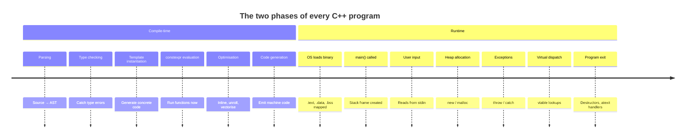
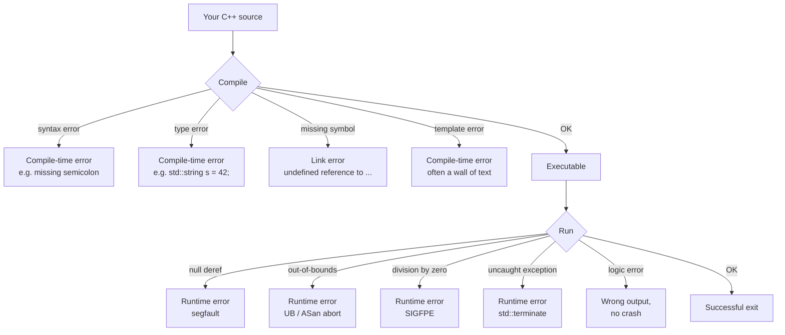

# Compile-time vs Runtime

Every C++ program lives two lives. The **first life** happens inside the compiler, the moment you type `g++ main.cpp`. The compiler parses your code, checks types, instantiates templates, evaluates `constexpr` functions, applies optimisations, and emits machine code. This is **compile-time**. The **second life** happens when the resulting executable runs on a CPU — `main()` is called, variables get values, files are read, network packets are sent. This is **runtime**.

C++ is unusual among popular languages in how much it forces you to care about the distinction. Languages like Python or JavaScript have a single phase (interpreted at runtime); languages like Java have a clear "compile to bytecode" / "JIT to native" split but hide the second phase from the programmer. C++ has *no runtime environment* in that sense — what the CPU executes is exactly what the compiler produced, and the programmer is responsible for deciding what work happens at compile-time and what happens at runtime. Getting this distinction wrong is the source of countless bugs; getting it right is the source of C++'s legendary performance.

This note explains compile-time and runtime in depth, walks through the kinds of errors that occur in each phase, and then dives into the three modern keywords — `constexpr`, `consteval`, `constinit` — that C++ uses to explicitly move work from runtime to compile-time.

## Background

### The two-phase mental model

Before we go deeper, internalise this picture:



Everything to the left of the dividing line happens once, on the developer's machine, before any user ever sees the program. Everything to the right happens every time the user runs the program. Work moved left is "paid for" once; work left on the right is "paid for" on every execution.

### Why C++ programmers obsess over this distinction

Three reasons:

1. **Performance.** A computation done at compile-time costs zero nanoseconds at runtime. If you can compute a lookup table at compile-time, the table is baked into the binary as a constant array — the user never pays for the computation.
2. **Safety.** The compiler can refuse to compile code that would have undefined behaviour, mismatched types, or contract violations. Errors caught at compile-time never reach users.
3. **Resource constraints.** Embedded systems have severe RAM and CPU budgets. Moving work to the developer's laptop (which has gigabytes of RAM and many CPU cores) shrinks the binary and the runtime footprint of the embedded target.

## Main Content

### What happens at compile-time

When you invoke `g++ main.cpp`, the compiler performs these activities, in roughly this order:

#### 1. Lexing and parsing

The compiler reads your `.cpp` file character by character, breaks it into tokens, and builds an **Abstract Syntax Tree (AST)** representing the program's structure. Syntax errors (`int x = ;`) are caught here.

#### 2. Preprocessing

The `#include`, `#define`, `#ifdef`, `#if` directives are processed. Macros are expanded. Included headers are textually pasted into the translation unit. See [[6. The Compilation Pipeline]] for the full details.

#### 3. Type checking (semantic analysis)

The compiler walks the AST and checks that every expression has a valid type. Calling `std::string s = 42;` is a compile-time error: there is no valid conversion from `int` to `std::string`. C++'s type system is *static* — types are determined at compile-time and do not change at runtime (unlike Python or JavaScript).

#### 4. Template instantiation

When you write `std::vector<int> v;`, the compiler takes the template `std::vector<T>` and instantiates it with `T = int`, generating a concrete class `std::vector<int>` with all its member functions. This happens entirely at compile-time; the runtime has no concept of "templates". Heavy template use is the main reason C++ compiles more slowly than C.

#### 5. `constexpr` evaluation

Functions and variables marked `constexpr` are *eligible* to be evaluated by the compiler during compilation. If the compiler can prove the inputs are compile-time constants, it will execute the function itself and substitute the result as a literal in the generated code. This is a strictly limited form of interpretation that the C++ standard specifies in great detail.

#### 6. Optimisation

The compiler analyses the program and rewrites it for speed or size. Optimisations include: function inlining, loop unrolling, dead-code elimination, constant folding (`int x = 2 + 3;` becomes `int x = 5;`), strength reduction (`x * 2` becomes `x << 1`), vectorisation (using SIMD instructions), and many more. See [[2. GCC and g++]] for the `-O` flags.

#### 7. Code generation

The compiler emits machine code (or assembly, then machine code) for each function. Templates, `constexpr` functions that were not constant-evaluated, and regular functions all become sequences of CPU instructions.

### What happens at runtime

When the user runs your executable, the operating system loader does the following before `main()` is ever called:

1. The loader (e.g. `ld-linux.so` on Linux) reads the ELF file, maps the `.text` (code) segment read-execute, the `.data` (initialised globals) read-write, and the `.bss` (zero-initialised globals) read-write.
2. Dynamic libraries (`.so` / `.dll`) are loaded and their symbols resolved.
3. The C runtime startup code (`crt0` / `crti` / `crtbegin`) runs.
4. Global constructors run in their defined order.
5. `main()` is called.

Inside `main()`, runtime activities include:

- **Variable assignment**: every `x = 5;` runs at runtime.
- **Function calls**: every non-inlined function call is a runtime event.
- **Dynamic memory allocation**: `new`, `delete`, `malloc`, `free` happen at runtime. The heap is a runtime concept.
- **I/O**: `std::cout << x` involves runtime system calls (`write`).
- **Exception handling**: throwing and catching exceptions is runtime control flow.
- **Virtual dispatch**: which override of a `virtual` function is called is determined at runtime via the vtable.
- **RTTI**: `dynamic_cast`, `typeid` are runtime operations.
- **Polymorphism**: the actual type a base-class pointer points to is a runtime fact.

When `main()` returns, the runtime calls `std::exit`, which calls registered `atexit` handlers, destructors of static objects, and finally returns control to the OS. The OS reclaims all memory and file handles.

### Compile-time errors vs runtime errors

This is the practical heart of the distinction. The compiler refuses to produce a binary if any compile-time error occurs; you must fix them. Runtime errors may or may not crash the program — they happen in the field, often under conditions you did not anticipate.



#### Compile-time error examples

```cpp
// 1. Syntax error: missing semicolon
int main() {
    int x = 5
    return x;
}
// error: expected ';' at end of declaration

// 2. Type error: no implicit int -> std::string
#include <string>
int main() {
    std::string s = 42;
}
// error: no viable conversion from 'int' to 'std::string'

// 3. Undeclared identifier
int main() {
    foo();
}
// error: use of undeclared identifier 'foo'

// 4. Template instantiation failure
#include <vector>
struct NoDefaultCtor {
    NoDefaultCtor(int);
};
int main() {
    std::vector<NoDefaultCtor> v(10);
}
// error: no matching constructor for initialization of 'NoDefaultCtor'

// 5. static_assert failure (compile-time assertion)
static_assert(sizeof(int) == 4, "int must be 4 bytes");
```

Every one of these halts compilation. No binary is produced. The error message points you at the line and the compiler will not budge until you fix it.

#### Runtime error examples

```cpp
// 1. Null pointer dereference
int main() {
    int* p = nullptr;
    return *p;            // Segfault (SIGSEGV) on most platforms
}

// 2. Out-of-bounds access (UB, may or may not crash)
#include <vector>
int main() {
    std::vector<int> v(10);
    return v[100];        // No bounds check with operator[]
                           // Use v.at(100) for bounds-checked access
}

// 3. Division by zero
int main() {
    int x = 0;
    return 10 / x;        // SIGFPE on x86
}

// 4. Use-after-free (UB, may crash)
int main() {
    int* p = new int(42);
    delete p;
    return *p;            // UB: reading freed memory
}

// 5. Uncaught exception
#include <stdexcept>
int main() {
    throw std::runtime_error("boom");
}
// terminate called after throwing an instance of 'std::runtime_error'
// Aborted (core dumped)

// 6. Logic error (no crash, wrong answer)
int main() {
    int total = 0;
    for (int i = 1; i < 10; ++i) {   // bug: should be i <= 10
        total += i;
    }
    // Expected 55, got 45. No error reported.
}
```

The crucial difference: **the compiler cannot catch runtime errors**. It cannot know that `p` will be null when `*p` executes, because that depends on the program's runtime state. The whole point of compile-time analysis is "what can we know *before* the program runs?"

> [!info] Undefined Behaviour is a third category
> Some operations — signed integer overflow, use-after-free, data races — are **undefined behaviour (UB)**. The standard imposes no requirement on what happens. In practice, UB often "works" at `-O0` and crashes (or silently corrupts data) at `-O2`, because the optimiser assumes UB does not occur. This is why UB is the most dangerous category: the compiler is not even required to report it.

### `constexpr`, `consteval`, `constinit` — moving work to compile-time

Modern C++ (C++11 onward) provides explicit keywords to request compile-time evaluation. These are the most important compile-time tools in the language.

#### `constexpr` — "may be evaluated at compile-time"

`constexpr` on a variable means its initialiser must be a compile-time constant expression. `constexpr` on a function means the function *may* be evaluated at compile-time *if* its arguments are compile-time constants; otherwise it is evaluated at runtime like any other function.

```cpp
// A constexpr function: usable both at compile-time and runtime.
constexpr int factorial(int n) {
    return (n <= 1) ? 1 : n * factorial(n - 1);
}

int main() {
    // Compile-time evaluation: result baked into the binary as 720.
    constexpr int compile_time_result = factorial(6);
    static_assert(compile_time_result == 720);

    // Runtime evaluation: the same function is called at runtime.
    int n;
    std::cin >> n;
    int runtime_result = factorial(n);   // can't be constexpr; n is runtime
    return runtime_result;
}
```

`constexpr` functions have restrictions: they cannot call non-`constexpr` functions, cannot use `goto`, cannot have `try`/`catch` blocks (until C++20), and cannot modify static or thread-local variables. They *can* (since C++14) use loops, mutation of local variables, and `if` statements. Since C++20 they can also use `std::string`, `std::vector`, and other constexpr-friendly standard containers, dramatically expanding what can be computed at compile-time.

#### `consteval` — "must be evaluated at compile-time" (C++20)

`consteval` (added in C++20) marks a function as **immediate**: it *must* be evaluated at compile-time. If a call to a `consteval` function cannot be constant-evaluated, the program is ill-formed (a compile-time error).

```cpp
consteval int square(int x) {
    return x * x;
}

int main() {
    constexpr int s = square(5);   // OK: evaluated at compile-time
    static_assert(s == 25);

    int n;
    std::cin >> n;
    int bad = square(n);           // ERROR: n is not a constant expression
    return bad;
}
```

`consteval` is the strict version of `constexpr`. Use it when the function makes sense *only* at compile-time (e.g. parsing a format string, generating lookup tables, computing type-info strings).

#### `constinit` — "initialised at compile-time, but not const" (C++20)

`constinit` (added in C++20) is subtler. It asserts that a variable with static or thread storage duration is *initialised at compile-time*, but does *not* make the variable `const`. This solves the "static initialisation order fiasco" for non-const globals.

```cpp
// Without constinit: this global might be initialised at runtime,
// in some order relative to other globals. If another global's
// constructor calls getThreshold(), the answer is undefined.
int getThreshold() { return 42; }

// With constinit: the initialiser must be a constant expression,
// so initialisation happens at compile-time. No SIOF possible.
constinit int threshold = getThreshold();  // ERROR: getThreshold() is
                                            // not constexpr.
constinit int good_threshold = 42;          // OK: literal is a constant expr

int main() {
    threshold = 100;  // OK: constinit does not imply const
    return threshold;
}
```

> [!warning] The three keywords are easily confused
> - `const` — "read-only after initialisation". May be initialised at runtime.
> - `constexpr` — "may be evaluated at compile-time". Implies `const` for variables.
> - `consteval` — "must be evaluated at compile-time". Functions only.
> - `constinit` — "must be *initialised* at compile-time". Does *not* imply `const`.
>
> Mnemonic: `const` = immutability, `constexpr` = computability, `consteval` = enforced computability, `constinit` = enforced initialisation-time.

### `static_assert`: compile-time assertions

`static_assert(condition, message);` is evaluated at compile-time. If `condition` is false, compilation halts with `message`. This is the primary way to enforce compile-time invariants:

```cpp
#include <cstdint>
#include <limits>

// Architecture check
static_assert(sizeof(void*) == 8, "This code requires a 64-bit platform");

// Type-size check (important for binary compatibility)
static_assert(sizeof(std::int32_t) == 4, "int32_t must be 4 bytes");

// Numeric-limits check
static_assert(std::numeric_limits<float>::is_iec559,
              "float must be IEEE 754");

// User-defined computation
constexpr int buffer_size = 1024;
static_assert(buffer_size % 16 == 0,
              "buffer_size must be a multiple of 16 for SIMD alignment");
```

### Why move work to compile-time?

Three reasons, in increasing order of importance:

1. **Performance**. A compile-time-computed lookup table is "free" at runtime — it is a constant in the binary. A `constexpr` parser-generator runs at compile-time; the runtime gets a pre-built state machine.

2. **Safety**. A `static_assert` prevents a class of bugs from ever reaching users. A `consteval` function refuses to compile if its inputs are not known at compile-time, eliminating a class of "what if the user passes garbage" bugs.

3. **API design**. Compile-time parameters (template parameters, `consteval` parameters) cannot be misused at runtime. `std::format("Hello {}", name)` checks the format string at compile-time — you cannot accidentally pass `std::format("Hello %d", name)` and have it crash at runtime.

### Compile-time vs runtime: feature map

| Feature | Phase | Notes |
|---------|-------|-------|
| `template` instantiation | Compile-time | The runtime sees only instantiated code. |
| `constexpr` function eval | Compile-time (if args are constant) | Otherwise runtime. |
| `consteval` function eval | Compile-time (always) | Refuses to compile if not possible. |
| `constinit` | Compile-time (initialisation) | Variable itself can be modified at runtime. |
| `static_assert` | Compile-time | Halts compilation if condition is false. |
| `#if` / `#ifdef` | Preprocessing (subset of compile-time) | Textual; no type information. |
| Type checking | Compile-time | C++ is statically typed. |
| Function inlining | Compile-time | Decision made by optimiser. |
| Virtual dispatch | Runtime | The actual function called depends on runtime type. |
| `new` / `delete` | Runtime | Heap is a runtime concept. |
| Exception throw/catch | Runtime | Compile-time only checks types are compatible. |
| `dynamic_cast` | Runtime | Uses RTTI. |
| `typeid` | Runtime | Uses RTTI. |
| `std::thread::create` | Runtime | Threads are an OS runtime concept. |

## Code Examples

### Example 1: Compile-time Fibonacci with caching

```cpp
#include <array>
#include <cstddef>

// constexpr array of the first N Fibonacci numbers, computed at
// compile-time. The runtime pays nothing for this computation.
template <std::size_t N>
constexpr std::array<unsigned long long, N> fib_table() {
    std::array<unsigned long long, N> arr{};
    arr[0] = 0;
    if constexpr (N > 1) arr[1] = 1;
    for (std::size_t i = 2; i < N; ++i) {
        arr[i] = arr[i - 1] + arr[i - 2];
    }
    return arr;
}

// The table is materialised in the binary as a constant.
constexpr auto fibs = fib_table<50>();

static_assert(fibs[10] == 55, "Fib(10) should be 55");
static_assert(fibs[49] == 7778742049ULL, "Fib(49) check");

int main() {
    return static_cast<int>(fibs[20]);   // Runtime cost: zero.
}
```

### Example 2: A `consteval` format-string checker (toy version)

```cpp
#include <string_view>

// A toy consteval function that "validates" a format string at
// compile-time. Real std::format does something similar with the
// std::format_string type.
consteval bool validate_format(std::string_view fmt) {
    int placeholders = 0;
    for (char c : fmt) {
        if (c == '{') ++placeholders;
    }
    return placeholders <= 3;   // toy rule: at most 3 args
}

template <typename... Args>
void log(std::string_view fmt, Args&&...) {
    // The static_assert inside the consteval call validates fmt
    // at compile-time. If fmt has too many placeholders, this
    // line fails to compile.
    static_assert(validate_format(fmt), "format string has too many args");
}

int main() {
    log("hello {}", 1);                 // OK
    log("{} {} {} {}", 1, 2, 3, 4);     // COMPILE-TIME ERROR
}
```

### Example 3: The same logic at compile-time and runtime

```cpp
#include <iostream>

constexpr int sum_to(int n) {
    int total = 0;
    for (int i = 1; i <= n; ++i) total += i;
    return total;
}

int main() {
    // Compile-time: result is baked into the binary as 5050.
    constexpr int compile_time = sum_to(100);
    static_assert(compile_time == 5050);

    // Runtime: same function, called with a runtime value.
    int n;
    std::cin >> n;
    int runtime = sum_to(n);
    std::cout << "Compile-time: " << compile_time << '\n'
              << "Runtime:      " << runtime << '\n';
    return 0;
}
```

The compiler generates *one* copy of `sum_to`'s machine code. It also evaluates it once during compilation to compute `compile_time`. The runtime call uses the same machine code with a runtime input.

## Common Pitfalls

1. **Assuming `const` means compile-time**: `const int x = read_input();` is `const` but its value is determined at runtime. Use `constexpr` if you need compile-time.

2. **Forgetting that `constexpr` on a function is just permission, not a requirement**: a `constexpr` function called with runtime arguments is executed at runtime. Use `consteval` if you need to force compile-time.

3. **Expecting `static_assert` to fire in `if constexpr` false-branches**: `static_assert(false)` in a discarded branch still halts compilation. Use a dependent type like `static_assert(sizeof(T) == 0, "...")` to delay the assertion.

4. **Believing "compile-time = no cost"**: compile-time work *does* cost — it makes compilation slower. C++ compile times are a real engineering concern, especially with heavy template metaprogramming. Profile your builds.

5. **Confusing compile-time and link-time**: "undefined reference" errors are *linker* errors, not compiler errors. They occur after each translation unit has compiled successfully but the linker cannot resolve a symbol. See [[6. The Compilation Pipeline]].

6. **Hiding runtime errors behind `try`/`catch`**: catching an exception does not fix the underlying bug. Use exceptions for genuinely exceptional conditions, not for ordinary control flow.

7. **Assuming UB will crash**: UB might "work" for years and then break when you upgrade the compiler. The only defence is to enable sanitizers (`-fsanitize=address,undefined`) during development and CI.

8. **Thinking `consteval` makes runtime impossible**: `consteval` functions can be called from runtime code; they just must receive compile-time arguments. The result is a compile-time constant which can be used at runtime.

9. **Forgetting that template instantiation is compile-time**: heavy template code balloons binary size and compile time. Use `extern template` to suppress re-instantiation in every TU.

10. **Mixing compile-time and runtime polymorphism**: a `constexpr` function cannot be virtual; virtual dispatch is inherently runtime. Templates and `constexpr` are the compile-time equivalent of polymorphism — they are *not* interchangeable with `virtual`.

## Tips and Tricks

- **Use `static_assert` liberally**. Every assumption you encode as a `static_assert` is a bug that cannot happen at runtime.
- **Mark functions `constexpr` by default in modern C++**. Since C++14, the restrictions are minimal and the upside is real: any function that *could* be `constexpr` is a function someone can call from a `static_assert`.
- **Use `consteval` for parsers, validators, and table generators**. If the function makes no sense at runtime, enforce it.
- **Use `constinit` for global variables** to eliminate the Static Initialisation Order Fiasco.
- **`if constexpr` (C++17) is compile-time `if`**: branches not taken are not even instantiated. Excellent for template code that needs to behave differently for different types.
- **Prefer `[[likely]]` / `[[unlikely]]` (C++20) for runtime branches the optimiser should bias**. This is *not* compile-time evaluation, but it is a compile-time *hint* that affects runtime code generation.
- **Compile-time programming is its own discipline**. If you find yourself writing heavily templated code, read up on C++20 **concepts** (`std::integral`, `std::ranges::range`); they make template errors readable.
- **Use the `__cpp_*` feature-test macros** to detect language/library features at compile-time, rather than probing compiler versions.
- **Profile your build times with `-ftime-trace` (Clang) or `-ftime-report` (GCC)**. Long builds are a sign of too much compile-time work.

## Active Recall

1. Define compile-time and runtime in one sentence each. Give one activity that is unique to each.
2. List the seven compile-time activities discussed in this note, in roughly the order they occur.
3. What is the difference between a *compile-time error*, a *link error*, and a *runtime error*? Give one example of each.
4. What is undefined behaviour (UB), and why is it dangerous even when it "works"?
5. Explain the difference between `const`, `constexpr`, `consteval`, and `constinit` in your own words. Which implies `const`-ness?
6. Why does `constexpr` on a function not guarantee compile-time evaluation? How do you force it?
7. Write a `constexpr` function that returns the cube of its argument and a `static_assert` that verifies `cube(3) == 27`.
8. What is the Static Initialisation Order Fiasco, and how does `constinit` help avoid it?
9. Give three reasons to move work from runtime to compile-time.
10. Why is `static_assert(false)` in a discarded `if constexpr` branch still a compile error? How would you write a static_assert that only fires inside a non-discarded branch?

## Next Steps

- [[1. GNU and Free Software]] — The movement that produced the GCC toolchain you use to compile.
- [[2. GCC and g++]] — The compiler that performs all the compile-time work discussed here.
- [[3. Clang and LLVM]] — The alternative compiler with the same compile-time model.
- [[6. The Compilation Pipeline]] — The detailed mechanics of preprocessing, compiling, assembling, and linking.
- [[10. Templates and Metaprogramming]] — The most powerful compile-time tool in C++.
- [[8. Modern C++]] — Where `constexpr`, `consteval`, and `constinit` were introduced.
