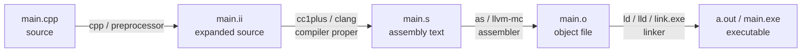
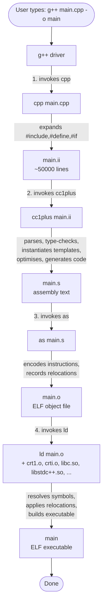
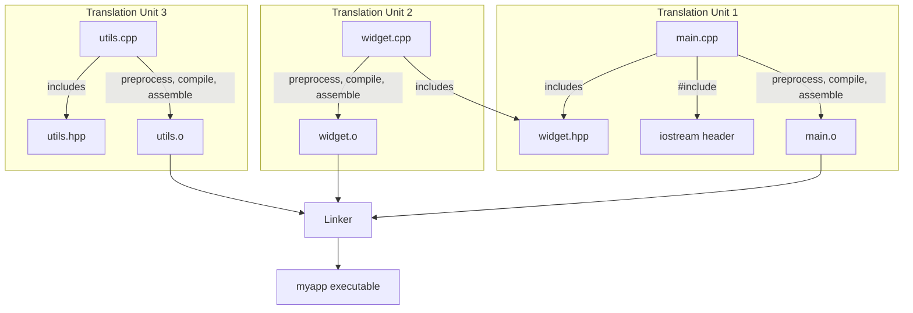

# The Compilation Pipeline

When you type `g++ main.cpp -o main`, four distinct programs run in sequence — preprocessor, compiler, assembler, linker — and the four-stage pipeline they implement is one of the most important things a C++ developer can understand. Every "weird linker error", every "why does changing this header rebuild the whole project", every "what does `-c` actually do" question has its answer in this pipeline. The same pipeline is implemented by GCC, Clang, and MSVC (with slightly different program names but identical concepts).

This note walks through each of the four stages in detail, shows how to stop after each stage using `-E`, `-S`, and `-c`, then explains the **separate compilation model** that lets large projects scale. We cover header files, include guards, static vs dynamic linking, symbol resolution, and the common errors you will hit at each stage.

## Background

### Why a pipeline?

C and C++ were designed in an era when computers had kilobytes of RAM, not gigabytes. A compiler that tried to read a 50,000-line program, parse it, optimise it, and emit machine code all in one program would not have fit in memory. The solution was to **decompose** the work: a small preprocessor handles textual inclusion; a compiler handles parsing and code generation; an assembler turns text into bytes; a linker stitches pre-built units together. Each program is small, fast, and replaceable.

This decomposition has held up remarkably well. Modern compilers still implement the same four stages, even on machines with 64 GB of RAM. The benefits — incremental compilation, separate compilation of libraries, language-agnostic linkers, replaceable components — are too valuable to abandon.

### The four stages at a glance



| Stage | Program (GCC) | Program (Clang) | Program (MSVC) | Output |
|-------|---------------|-----------------|----------------|--------|
| 1. Preprocessing | `cpp` | `clang -E` | `cl /E` | `.ii` (C++) / `.i` (C) |
| 2. Compilation | `cc1plus` | `clang -cc1` | `cl` (front-end) | `.s` (assembly) |
| 3. Assembly | `as` | `llvm-mc` | `cl` (back-end) | `.o` / `.obj` |
| 4. Linking | `ld` (or `collect2`) | `ld.lld` | `link.exe` | Executable |

Note that MSVC folds stages 1–3 into a single `cl.exe` invocation — there is no separate `cpp` or `as` you would invoke directly. But the *conceptual* pipeline is identical.

## Main Content

### Stage 1: Preprocessing

The preprocessor is a **textual** program. It does not understand C++ syntax; it manipulates text according to a small set of rules:

- It expands `#include <header>` by replacing that line with the entire content of the file `header`.
- It expands `#include "file"` similarly, searching the local directory first.
- It expands macros: `#define FOO 42` causes every later `FOO` token to be replaced with `42`.
- It evaluates `#if`, `#ifdef`, `#ifndef`, `#elif`, `#else`, `#endif` and keeps or discards the enclosed text.
- It processes `#pragma` directives (implementation-defined behaviour).
- It removes comments (`//` and `/* ... */`).

The result is a single flat stream of C++ source code with no `#include` directives, no macros, and no comments — ready for the actual compiler to parse.

To stop after preprocessing and inspect the result, use `-E`:

```bash
g++ -E main.cpp -o main.ii     # Save to file
g++ -E main.cpp | less         # Page through it
g++ -E main.cpp | wc -l        # Count lines (often surprising)
```

A typical "small" `.cpp` file that includes `<iostream>` expands to **tens of thousands of lines**. The preprocessor has pasted in the entire iostream machinery, the entire string machinery, and large chunks of the C library. This is why compilation can be slow: the compiler proper must parse all of this even for a hello-world program.

> [!info] Preprocessor-only flags
> `-dM` dumps every defined macro. `-dD` dumps every macro definition *and* preserves the source. `-H` prints every header included, with depth indentation. These are invaluable for debugging include-path issues.

#### Header files and include guards

A header file (`.h`, `.hpp`, `.hh`) is a file intended to be `#include`d. It typically contains declarations (function prototypes, class definitions, template definitions) that need to be visible in multiple `.cpp` files.

The same header can be transitively included many times in a single translation unit. To prevent double-definition errors, every header must use an **include guard**:

```cpp
// widget.hpp
#ifndef WIDGET_HPP
#define WIDGET_HPP

class Widget {
    // ...
};

#endif // WIDGET_HPP
```

The first time `widget.hpp` is included, `WIDGET_HPP` is undefined, so the body is processed and `WIDGET_HPP` is defined. The second time, `WIDGET_HPP` is defined, so the entire body is skipped. Without this, including `widget.hpp` twice would produce a "redefinition of class Widget" error.

The alternative, **`#pragma once`**, is non-standard but supported by every modern compiler:

```cpp
// widget.hpp
#pragma once

class Widget {
    // ...
};
```

`#pragma once` tells the compiler "do not process this file more than once per compilation". It is shorter, less error-prone (no need to invent a unique macro name), and often faster (the compiler can skip reading the file entirely on subsequent includes). Its only disadvantage is theoretical: if the same header is reachable via two different filesystem paths (e.g. through a symlink), `#pragma once` may fail to deduplicate. In practice this is rare.

> [!tip] Prefer `#pragma once` in new code
> The cost-benefit has shifted. Modern projects overwhelmingly use `#pragma once`. Use traditional include guards only in codebases that must support extremely old or exotic compilers.

### Stage 2: Compilation (proper)

The compiler proper takes the preprocessed source (a flat stream of C++ tokens) and produces **assembly language** text. Its work includes:

1. **Lexing and parsing**: tokens → AST.
2. **Semantic analysis**: type checking, name lookup, access checking.
3. **Template instantiation**: generating concrete code from templates.
4. **`constexpr` evaluation**: running constexpr functions during compilation.
5. **IR generation and optimisation**: lowering the AST to an intermediate representation (GIMPLE in GCC, LLVM IR in Clang) and running optimisation passes.
6. **Code generation**: emitting assembly text for the target architecture.

To stop after compilation and inspect the generated assembly, use `-S`:

```bash
g++ -S main.cpp -o main.s      # Emit assembly
g++ -S -O2 main.cpp -o main.s  # Emit optimised assembly
```

The `.s` file is human-readable assembly language. On x86-64 Linux it uses AT&T syntax by default (source, destination order); use `-masm=intel` to get Intel syntax if you prefer:

```bash
g++ -S -masm=intel main.cpp -o main.s
```

For comparing optimised and unoptimised output, the most useful flag is `-fverbose-asm`, which interleaves comments identifying the source line each instruction came from:

```bash
g++ -S -O2 -fverbose-asm main.cpp -o main.s
```

> [!info] Compiler Explorer (godbolt.org)
> The website <https://godbolt.org> is the standard tool for inspecting compiler output. You paste C++ code, pick a compiler and flags, and see colorised assembly. It supports GCC, Clang, MSVC, ICX, and many others. Indispensable for performance work.

### Stage 3: Assembly

The assembler translates assembly text into **machine code** packed into an object file. This is a mostly mechanical process: each assembly instruction becomes one or more bytes; symbols become entries in a symbol table; references to symbols that are defined elsewhere become **relocations** that the linker will later fix up.

To stop after assembly and produce an object file (without linking), use `-c`:

```bash
g++ -c main.cpp -o main.o
```

The resulting `main.o` is a binary file in the platform's object format (ELF on Linux, Mach-O on macOS, PE/COFF on Windows). It contains:

- **Text section** (`.text`): the actual machine code bytes.
- **Data section** (`.data`): global variables with non-zero initialisers.
- **BSS section** (`.bss`): global variables with zero initialisers (no bytes stored; allocated by the loader at runtime).
- **Read-only data** (`.rodata`): string literals, `constexpr` constants.
- **Symbol table**: every function and variable this object defines, plus every symbol it references but does not define.
- **Relocation table**: every place in the text section where the linker must patch in the address of an external symbol.

You can inspect object files with `nm` (symbol table), `objdump -d` (disassembly), and `readelf -a` (everything). On macOS the equivalent tools are `nm`, `otool -tV`, and `size`.

```bash
# List symbols defined and referenced by main.o
nm main.o
#                  U _printf          (U = undefined, must be resolved at link time)
# 0000000000000000 T main             (T = text section, defined here)
# 0000000000000010 T _Z3addii         (mangled C++ name: add(int, int))
```

> [!info] C++ name mangling
> C++ allows function overloading (`add(int, int)`, `add(double, double)`, `add(std::string, std::string)`). The linker, which is a C-era tool that does not understand overloading, cannot have multiple symbols all named `add`. So C++ compilers **mangle** names by encoding parameter types into the symbol name: `_Z3addii` means "function `add`, 3-character name, parameters `i`nt and `i`nt". Use `c++filt` to demangle: `echo _Z3addii | c++filt` prints `add(int, int)`. Use `extern "C"` to disable mangling for a function — required when calling C++ functions from C, or when exporting from a DLL.

### Stage 4: Linking

The linker takes one or more object files (and one or more libraries), resolves all symbol references, and produces the final executable (or shared library). Its job:

1. **Symbol resolution**: for each `U` (undefined) symbol in any object file, find an object file or library that defines it. If found, record the address. If not found, emit "undefined reference" error.
2. **Relocation**: for each relocation entry, patch the machine code with the actual address of the resolved symbol.
3. **Section merging**: concatenate `.text` from all inputs into one big `.text`, similarly for `.data`, `.rodata`, etc.
4. **Library handling**: for static libraries (`.a`), pull in only the members that satisfy an unresolved symbol. For dynamic libraries (`.so` / `.dll`), record a dependency that the runtime loader will resolve.
5. **Final layout**: assign virtual addresses to each section, build the executable header (ELF / Mach-O / PE), and write the file.

If you have multiple `.o` files, you link them with a single `g++` invocation:

```bash
g++ main.o engine.o utils.o -o myapp
```

`g++` invokes `ld` (or `collect2`, which wraps `ld`) under the hood. You can see the exact linker command with `-v`:

```bash
g++ -v main.o engine.o utils.o -o myapp 2>&1 | tail -30
```

### The full pipeline, single file

Putting it all together, here is what happens when you type:

```bash
g++ main.cpp -o main
```



You can verify each step by stopping at it:

```bash
g++ -E   main.cpp -o main.ii   # stop after preprocess
g++ -S   main.cpp -o main.s    # stop after compile
g++ -c   main.cpp -o main.o    # stop after assemble
g++       main.cpp -o main      # full pipeline → executable
```

### The separate compilation model

Real C++ projects have many `.cpp` files. Compiling them all in a single `g++` invocation is wasteful: change one file and you recompile everything. The solution is the **separate compilation model**: each `.cpp` file is independently preprocessed, compiled, and assembled into its own `.o` file. Only the changed files are recompiled. Linking is then fast.



Each translation unit is independent. The header `widget.hpp` is parsed twice — once when compiling `main.cpp`, once when compiling `widget.cpp` — but the **One Definition Rule (ODR)** says this is OK as long as every translation unit sees the *same* definition.

> [!info] The One Definition Rule
> The ODR states that each entity (function, class, template, variable) must have exactly one definition in the entire program. There are exceptions: inline functions, templates, and `constexpr` variables can be defined in headers and "defined" in every TU that includes them, *provided* every definition is token-for-token identical. Violating the ODR is undefined behaviour and notoriously hard to debug — the program may seem to work, then crash mysteriously. Use include guards / `#pragma once` and avoid putting non-inline, non-template definitions in headers.

### Linking: static vs dynamic

Libraries come in two flavours:

- **Static libraries** (`.a` on Unix, `.lib` on Windows MSVC): an archive of `.o` files. The linker pulls in only the `.o` members needed to satisfy unresolved symbols, then links them directly into the executable. The resulting executable has no runtime dependency on the library.
- **Dynamic / shared libraries** (`.so` on Linux, `.dylib` on macOS, `.dll` on Windows): a single file loaded by the OS loader at program startup. The executable contains a *reference* to the library, not the library's code.

| Aspect | Static linking | Dynamic linking |
|--------|----------------|-----------------|
| Executable size | Larger (library code embedded) | Smaller (library separate) |
| Startup time | Faster (no library loading) | Slightly slower (loader must resolve symbols) |
| Memory (multiple processes) | Each process has its own copy | Library loaded once, shared by all processes |
| Updates | Must re-link to update library | Replace `.so`/`.dll` to update all users |
| Distribution | Single self-contained file | Must ship library alongside executable |
| License issues | LGPL requires shipping object files so user can re-link | LGPL-compatible if user can swap the library |

#### Creating and linking a static library

```bash
# Compile the library sources to object files
g++ -c widget.cpp -o widget.o
g++ -c utils.cpp  -o utils.o

# Archive them into a static library (libmylib.a)
ar rcs libmylib.a widget.o utils.o
#    r = insert (replace if exists)
#    c = create the archive
#    s = write an index (equivalent to running ranlib)

# Link the executable against the static library
g++ main.cpp -L. -lmylib -o myapp
#                ^^^^         ^^^^^^
#                add . to library search path
#                          link libmylib.a (the lib prefix and .a suffix
#                          are implicit in -l)
```

#### Creating and linking a shared library

```bash
# Compile with -fPIC (position-independent code)
g++ -c -fPIC widget.cpp -o widget.o
g++ -c -fPIC utils.cpp  -o utils.o

# Link into a shared library
g++ -shared widget.o utils.o -o libmylib.so

# Link the executable against the shared library
g++ main.cpp -L. -lmylib -o myapp

# At runtime, the loader must find libmylib.so.
# Either install it to /usr/local/lib, set LD_LIBRARY_PATH, or
# embed an rpath in the executable:
g++ main.cpp -L. -lmylib -Wl,-rpath,`pwd` -o myapp
```

`-fPIC` (Position-Independent Code) is required for shared libraries on most architectures. It tells the compiler to generate code that does not depend on being loaded at a fixed address — every internal reference goes through a Global Offset Table (GOT) so the loader can relocate the library at any address. Code compiled without `-fPIC` cannot be put in a shared library on x86-64 Linux.

### Symbol resolution and common linker errors

The linker's job is to resolve every undefined symbol. When it cannot, it produces one of these errors:

#### `undefined reference to 'foo'`

The most common linker error. Causes:

1. **You forgot to compile or link the file that defines `foo`**.
   ```bash
   # main.cpp calls foo() defined in foo.cpp
   g++ main.cpp -o myapp         # WRONG: forgot foo.cpp
   g++ main.cpp foo.cpp -o myapp # RIGHT
   ```

2. **You listed the library before the object that uses it**. Linkers process inputs left-to-right; a library is only searched for symbols that are *currently* undefined.
   ```bash
   # main.o uses libfoo; libfoo uses libbar
   g++ -lfoo -lbar main.o   # WRONG: libraries before objects
   g++ main.o -lfoo -lbar   # RIGHT
   ```

3. **You misspelled the library name**. `-lfmt` looks for `libfmt.so` or `libfmt.a`. Spelling it `-lFmt` (different case) on a case-sensitive filesystem fails.

4. **The library is a C library, but you forgot `extern "C"` in the header**. C++ mangles names; C does not. Without `extern "C"`, the C++ compiler mangles the call to `foo` into `_Z3foov`, but the library exports `foo` — mismatch, no link.
   ```cpp
   // myheader.h
   #ifdef __cplusplus
   extern "C" {
   #endif
   void foo(int);     // declared with C linkage
   #ifdef __cplusplus
   }
   #endif
   ```

5. **The symbol is `static` (file-scope) in its `.cpp` file**. A `static` function is internal to its translation unit and not exported. Remove `static` if you want it visible to the linker.

6. **You defined the function in a header but did not mark it `inline`**. Then each TU that includes the header has its own copy — which actually causes a *multiple definition* error (see below), not undefined reference.

#### `multiple definition of 'foo'`

The opposite problem: two object files both define a symbol with the same name. Causes:

1. **You defined a non-inline, non-template function in a header**. Each TU that includes the header compiles the definition; the linker sees two `foo` symbols and refuses to pick. Fix: declare in header, define in `.cpp`. Or mark `inline` if you must define in the header.
2. **You defined a global variable in a header**. Same fix: declare `extern` in header, define in `.cpp`.
3. **You accidentally put the same `.cpp` file twice on the link line**.

#### `cannot find -lfoo`

The linker cannot find `libfoo.so` or `libfoo.a` in its search path. Fixes:

- Install the library (e.g. `apt install libfoo-dev`).
- Add the directory with `-L/path/to/dir`.
- Check the filename. On some systems you need both `-lfoo` and a development package that provides `libfoo.so` (the symlink), not just the runtime `libfoo.so.X.Y`.

> [!tip] Diagnosing linker errors with `nm`
> If you have a `.so` or `.a` file but still get "undefined reference", inspect its symbols:
> ```bash
> nm -D libfoo.so | grep foo       # dynamic symbols in a shared library
> nm libfoo.a                      # symbols in a static library
> ```
> A `U` means undefined (this library references it); a `T` means defined in the text section (this library provides it). If `foo` is missing entirely, the library was built without that symbol — perhaps you have the wrong version.

## Code Examples

### Example 1: A three-file project, built manually

```cpp
// widget.hpp
#pragma once
#include <string>
class Widget {
public:
    explicit Widget(std::string name);
    void greet() const;
private:
    std::string name_;
};
```

```cpp
// widget.cpp
#include <iostream>
#include "widget.hpp"
Widget::Widget(std::string name) : name_(std::move(name)) {}
void Widget::greet() const {
    std::cout << "Hello from " << name_ << '\n';
}
```

```cpp
// main.cpp
#include "widget.hpp"
int main() {
    Widget w("world");
    w.greet();
    return 0;
}
```

Build it manually, exposing each stage:

```bash
# Stage 1: preprocess (inspect if curious)
g++ -E widget.cpp -o widget.ii
g++ -E main.cpp    -o main.ii

# Stage 2: compile to assembly
g++ -S -O2 widget.cpp -o widget.s
g++ -S -O2 main.cpp    -o main.s

# Stage 3: assemble to object files
g++ -c widget.cpp -o widget.o
g++ -c main.cpp    -o main.o

# Stage 4: link
g++ main.o widget.o -o myapp

# Run
./myapp
# Hello from world
```

### Example 2: Inspecting what the linker actually does

```bash
# What symbols does main.o reference?
nm main.o
#                  U Widget::greet() const
#                  U Widget::Widget(std::string)
# 0000000000000000 T main

# What symbols does widget.o define?
nm widget.o
# 0000000000000000 T Widget::Widget(std::string)
# 0000000000000050 T Widget::greet() const
#                  U std::cout
#                  U std::basic_ostream::operator<<(std::string const&)

# After linking, all the U's are resolved:
nm myapp | grep Widget
# 0000000000001169 T Widget::greet() const
# 0000000000001140 T Widget::Widget(std::string)
```

### Example 3: A static vs dynamic library comparison

```bash
# Build the same library two ways

# Static:
g++ -c widget.cpp -o widget.o
ar rcs libwidget_static.a widget.o
g++ main.cpp -L. -lwidget_static -o app_static

ls -lh app_static
# -rwxr-xr-x 1 user user 17K  ... app_static

ldd app_static
#         linux-vdso.so.1 ...
#         libstdc++.so.6 => ...
#         libc.so.6 => ...
#         /lib64/ld-linux-x86-64.so.2 (...)

# Dynamic:
g++ -c -fPIC widget.cpp -o widget_pic.o
g++ -shared widget_pic.o -o libwidget.so
g++ main.cpp -L. -lwidget -Wl,-rpath,`pwd` -o app_dynamic

ls -lh app_dynamic
# -rwxr-xr-x 1 user user 16K  ... app_dynamic

ldd app_dynamic
#         libwidget.so => /path/to/libwidget.so (...)
#         libstdc++.so.6 => ...
#         libc.so.6 => ...
```

The dynamic executable lists `libwidget.so` as a dependency; the static one does not.

### Example 4: The classic `extern "C"` mistake

```cpp
// buggy_main.cpp
#include <cstdint>
extern "C" {
    uint32_t fast_crc32(const uint8_t* data, std::size_t len);  // looks C++ but has C linkage
}
int main() {
    return fast_crc32(nullptr, 0);
}
```

```bash
# Suppose the library was built without extern "C" - it exports
# _Z10fast_crc32PKhm (mangled), but buggy_main expects fast_crc32 (unmangled).
g++ buggy_main.cpp -lcrc -o buggy
# /usr/bin/ld: buggy_main.cpp:7: undefined reference to `fast_crc32'
```

The fix: ensure the header declares `fast_crc32` with `extern "C"` *both* when the library was compiled *and* when the caller includes the header. The standard pattern (used by every system header like `<cstdint>`, `<string.h>`, etc.) is:

```cpp
// crc.h
#pragma once
#include <cstdint>
#include <cstddef>

#ifdef __cplusplus
extern "C" {
#endif

uint32_t fast_crc32(const uint8_t* data, size_t len);

#ifdef __cplusplus
}
#endif
```

## Common Pitfalls

1. **Putting non-inline function definitions in headers**. Causes "multiple definition" errors when the header is included in multiple TUs. Define in `.cpp`; declare in `.hpp`.

2. **Forgetting include guards / `#pragma once`**. Causes "redefinition" errors when a header is transitively included twice.

3. **Listing libraries before objects on the link line**. Causes "undefined reference" errors because the linker processes inputs left-to-right and a library is only searched for *currently* undefined symbols.

4. **Missing `extern "C"` when linking C code from C++**. Causes "undefined reference" because of name-mangling mismatch.

5. **Compiling shared library code without `-fPIC`**. Causes "recompile with -fPIC" errors on x86-64 Linux.

6. **Forgetting to set `LD_LIBRARY_PATH` (or rpath) for shared libraries**. Causes "error while loading shared libraries: libfoo.so: cannot open shared object file" at runtime.

7. **Modifying a header but expecting incremental build to know**. Plain Makefiles do not track header dependencies. Use `-MMD -MP` or a modern build system.

8. **Mixing ABIs**: linking a GCC-built library against a Clang-built executable works on Linux (both use the Itanium ABI), but mixing MSVC- and MinGW-built objects does not work on Windows.

9. **Forgetting to mark class member functions `inline` when defined in the header**. Same problem as #1 — every TU that includes the header gets a definition, causing multiple-definition errors. Member functions defined inside the class body are implicitly `inline`; those defined outside are not.

10. **Linking against the wrong standard library**: combining `libstdc++` and `libc++` in the same process produces mangled-name mismatches. Pick one.

11. **Confusing "compile error" with "link error"**. A *compile* error halts before any object file is produced. A *link* error happens after every TU compiled successfully but the linker cannot resolve a symbol. The fix workflows are different.

12. **Cyclic dependencies between libraries**. If `libA` needs `libB` and `libB` needs `libA`, you must list them twice on the link line: `-lA -lB -lA` (or use linker groups: `-Wl,--start-group -lA -lB -Wl,--end-group`).

## Tips and Tricks

- **`-v` reveals everything**: `g++ -v main.cpp -o main` prints every internal command (preprocessor, compiler, assembler, linker) and every default path. The single best learning tool for the pipeline.
- **`-save-temps`** saves all intermediate files (`.ii`, `.s`, `.o`) in the current directory. Brilliant for debugging pipeline issues.
- **Use `ldd` to verify dynamic dependencies** before shipping. Surprises here cause "works on my machine" failures.
- **Use `readelf -d` to inspect an executable's dynamic section**, including rpath, soname, and needed libraries.
- **`-Wl,--as-needed`** drops unused library dependencies. Without it, every library on the link line becomes a runtime dependency, even if no symbol from it was used.
- **`-Wl,-rpath,$ORIGIN`** embeds an rpath relative to the executable, so it can find sibling `.so` files without `LD_LIBRARY_PATH` hacks.
- **Use `-Wl,--no-undefined`** when building a shared library to catch unresolved symbols at link time rather than at runtime.
- **Prefer the LLVM linker `lld`** with `-fuse-ld=lld` for large projects — 5–10× faster than GNU `ld`.
- **Use `ccache`** to cache object files across builds. Combined with separate compilation, this can turn a 5-minute rebuild into 10 seconds.
- **Use `compile_commands.json`** (generated by CMake with `-DCMAKE_EXPORT_COMPILE_COMMANDS=ON`) for IDE features in `clangd`.
- **`-MMD -MP`** generates header dependency files automatically. Always use this in Makefiles.
- **Symbol visibility**: on Linux, mark classes/functions you want to export from a shared library with `__attribute__((visibility("default")))` and compile with `-fvisibility=hidden`. This produces smaller, faster libraries and prevents symbol collisions.

## Active Recall

1. Name the four stages of the C++ compilation pipeline and the program that implements each in GCC.
2. What do the flags `-E`, `-S`, `-c`, and `-o` do? Which stage does each stop after?
3. Why does including `<iostream>` add tens of thousands of lines to your translation unit? What flag would you use to verify this?
4. Explain the difference between an include guard and `#pragma once`. Which is preferred in modern code, and why?
5. What is the One Definition Rule (ODR), and what is the practical implication for what you may put in a header file?
6. What is name mangling, and why does C++ do it? How do you disable it for a specific function?
7. List five causes of "undefined reference" linker errors.
8. List two causes of "multiple definition" linker errors.
9. Why does a shared library need to be compiled with `-fPIC`? What happens if you forget?
10. What is the difference between static and dynamic linking in terms of executable size, runtime dependencies, and update behaviour?
11. Why does the order of `-l` flags matter? Give an example of a correct and an incorrect ordering.
12. What does `ldd` show you about an executable? What does `nm` show you about an object file?

## Next Steps

- [[1. GNU and Free Software]] — The movement whose toolchain implements this pipeline.
- [[2. GCC and g++]] — The driver that orchestrates the four stages.
- [[3. Clang and LLVM]] — The alternative pipeline, with the same four stages but a different internal architecture.
- [[4. MSVC and Other Compilers]] — How MSVC folds stages 1–3 into a single `cl.exe` invocation.
- [[5. Compile-time vs Runtime]] — The conceptual distinction that this pipeline implements.
- [[12. Build Systems and Project Structure]] — How Make, CMake, Meson, and Ninja wrap this pipeline for real projects.
- [[15. Debugging and Profiling]] — How debug info produced in stage 2 enables GDB and LLDB.
