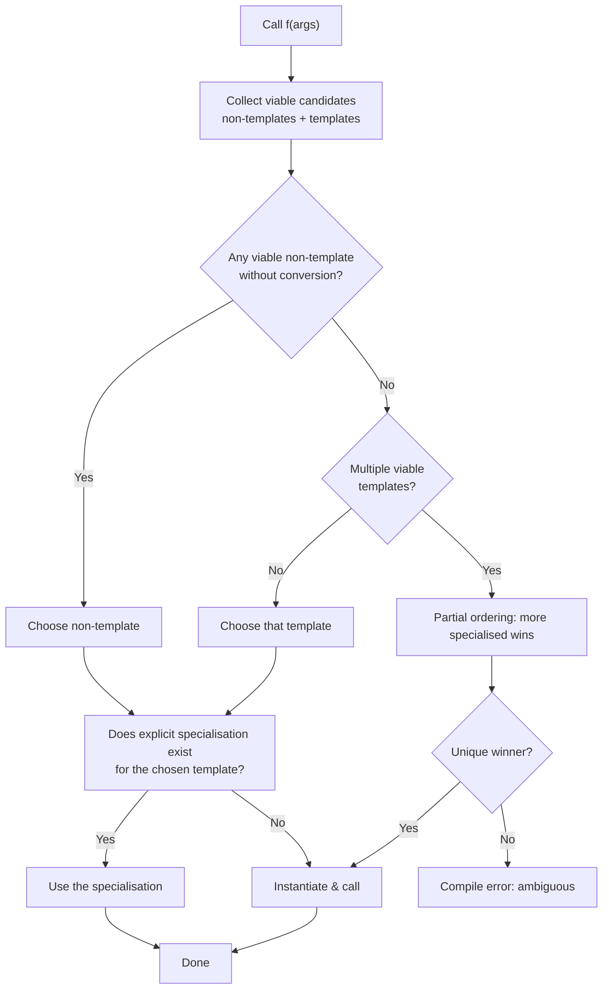
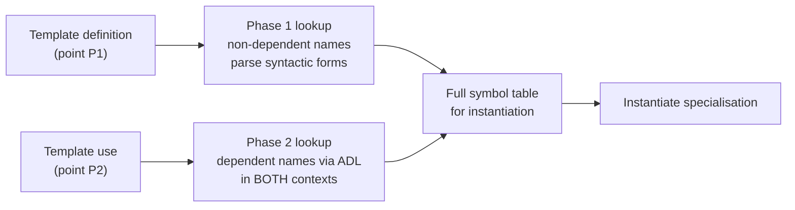

# Function Templates

## Why This Matters

Function templates are the gateway to **generic programming** in C++. They let you write a single function that works for any type — `int`, `double`, `std::string`, your own `Matrix` class — and let the compiler stamp out a concrete, fully type-checked, optimised version for each type you actually use. Without templates, C++ would either degenerate into a sea of copy-paste overloads (`max_int`, `max_double`, `max_string`, …) or be forced to use `void*` + manual casts, which throw away type safety and pay for it in subtle, late-night debugging sessions.

Every container in the STL (`std::vector<T>`, `std::map<K, V>`), every algorithm (`std::sort`, `std::find`, `std::transform`), and every modern utility from `std::optional<T>` to `std::expected<T, E>` is built on the template mechanism described here. If you want to read the standard library — or build your own reusable library — you must understand function templates *deeply*, including the parts that look like compiler voodoo: **two-phase name lookup**, **implicit vs explicit instantiation**, **overload resolution with templates**, and the **instantiation model** itself.

This note is the foundation for the rest of Chapter 10 — [[2. Class Templates]], [[3. Variadic Templates]], [[4. SFINAE]], [[5. Concepts (C++20)]], [[6. CRTP]], and [[7. Compile-time Computation]] all build on it.

## Background

### The problem templates solve

Before templates, generic code in C was written with `void*` and macros:

```c
// C approach: loses type information
void* max_void(void* a, void* b, int (*cmp)(void*, void*)) {
    return cmp(a, b) > 0 ? a : b;
}

// Macro approach: no type checking, double evaluation
#define MAX(a, b) ((a) > (b) ? (a) : (b))
```

Both have well-known failure modes: `void*` strips the compiler's ability to verify types (callers must cast correctly), and macros evaluate their arguments multiple times (`MAX(i++, j++)` increments twice), don't respect scope, and produce confusing error messages.

Bjarne Stroustrup introduced templates in C++ in the late 1980s (the first widely available implementation was in CFront 3.0, 1991). The design goals were:

1. **Type safety** — the compiler checks every instantiation.
2. **Zero-cost abstraction** — generated code is as fast as hand-written code for each type.
3. **No runtime overhead** — generics are a *compile-time* mechanism; nothing flows through `void*` at run time.
4. **Stamps on demand** — only the instantiations actually used end up in the binary.

### Templates vs. runtime polymorphism

| Property                  | Templates (static)             | Virtual functions (dynamic)        |
| ------------------------- | ------------------------------ | ----------------------------------- |
| Dispatch                  | Compile-time                   | Runtime (vtable lookup)             |
| Type knowledge            | Concrete, per instantiation    | Erased to base pointer              |
| Speed                     | Inlinable, no indirection      | Indirect call, often cache-miss     |
| Binary size               | Grows with number of types     | Constant                            |
| Heterogeneous containers  | Awkward (need type erasure)    | Natural                             |

The two mechanisms are complementary. Templates dominate when you know all the types at compile time (containers, algorithms, mathematical libraries). Virtual functions dominate when you genuinely don't know the type until runtime (plugins, UI event systems, scripting bridges). Many designs mix them — a `std::vector<std::unique_ptr<Shape>>` uses templates for the container and virtual dispatch for the shapes.

## Main Content

### 1. The basic syntax

```cpp
template <typename T>
T max_of(T a, T b) {
    return a > b ? a : b;
}
```

- `template <…>` introduces a **template parameter list**.
- `typename T` (or the older, equivalent `class T`) declares a **type parameter**.
- The body uses `T` as if it were a real type.

When you call `max_of(3, 7)`, the compiler deduces `T = int` and synthesises an instantiation equivalent to:

```cpp
int max_of(int a, int b) { return a > b ? a : b; }
```

You can also request a specific instantiation explicitly:

```cpp
auto x = max_of<double>(3, 7.5);   // T = double, 3 is converted to 3.0
```

### 2. Template parameters

Three flavours:

```cpp
template <typename T,           // type parameter
          int N,                // non-type parameter (NTTP)
          template <typename> class C>   // template template parameter
struct Demo { /* ... */ };
```

- **Type parameters** (`typename T`, `class T`) — the workhorse.
- **Non-type parameters** (`int N`, `auto x`, `std::size_t N`, pointers, references, enums) — must be constant expressions at the call site. This is how `std::array<T, N>` carries its size in the type system.
- **Template template parameters** — the parameter itself is a template. Rarely needed; useful for policy-based design.

`typename` and `class` are interchangeable in template parameter lists. Convention: `typename` signals "any type" (a primitive is fine); `class` sometimes signals "expect a class-like type", but the compiler treats them identically.

### 3. Type deduction

When you call a function template, the compiler performs **template argument deduction**. For each function parameter that depends on a template parameter, the compiler matches the parameter's *adjusted type* against the argument's type and unifies the template parameters.

Key rules worth remembering:

- **Top-level cv-qualifiers and references are stripped from the argument's type** when deducing a plain `T` parameter. `max_of(3, 7)` works even though `3` is an rvalue `int`.
- **Arrays decay to pointers**, function names decay to function pointers, just as in non-template calls.
- **A `const T&` parameter can bind to anything** — lvalues, rvalues, const or non-const — without changing the deduced type. This is why most generic functions take `const T&`.
- **A `T&&` parameter (forwarding reference)** deduces `T` differently for lvalues (`T = U&`) vs rvalues (`T = U`). This is the magic behind `std::forward` and perfect forwarding — see [[4. SFINAE]] and [[3. Variadic Templates]].

When deduction fails or you want to override it, write the explicit template arguments in angle brackets. Mismatched explicit arguments cause *conversion*, not deduction failure.

```cpp
template <typename T> T twice(T x) { return x + x; }
twice(std::string("hi"));   // T = std::string
twice(3.14);                // T = double
twice<int>(3.14);           // T = int — explicit, 3.14 truncated to 3
```

### 4. Return type deduction

Pre-C++14 you had to invent a return type that depended on the parameters:

```cpp
template <typename A, typename B>
decltype(a + b) add(A a, B b);   // ERROR — a, b not in scope yet
```

The workaround was the **trailing return type** syntax:

```cpp
template <typename A, typename B>
auto add(A a, B b) -> decltype(a + b) { return a + b; }
```

C++14 simply lets you write:

```cpp
template <typename A, typename B>
auto add(A a, B b) { return a + b; }   // return type deduced from body
```

C++20 adds the **abbreviated function template** syntax — every `auto` parameter is implicitly a template parameter:

```cpp
auto add(auto a, auto b) { return a + b; }   // two independent type parameters
```

### 5. Explicit (full) specialisation

Sometimes one type needs a different implementation. You can write an **explicit specialisation**:

```cpp
template <typename T>
const T& max_of(const T& a, const T& b) { return a < b ? b : a; }

// Specialisation for const char* — compare as strings, not pointers
template <>
const char* const& max_of<const char*>(const char* const& a, const char* const& b) {
    return std::strcmp(a, b) < 0 ? b : a;
}
```

Specialisation rules you must internalise:

- You may **specialise a function template**, but you cannot partially specialise it. (Partial specialisation is allowed for class templates only — see [[2. Class Templates]].)
- Specialisation must occur **before** any use that would cause implicit instantiation of that specialisation, otherwise you get undefined behaviour.
- A specialisation is **not** an overload; the compiler picks the most specialised template first, then checks if a specialisation exists for the chosen one.
- Modern style strongly prefers **overloading** over specialisation for functions because overload resolution is more predictable. See the next section.

### 6. Overloading function templates

Function templates can coexist with non-template functions and with other templates. Overload resolution follows a strict ranking:

1. **Exact match on non-template** beats everything.
2. **Exact match on a more-specialised template** beats a less-specialised one.
3. **Any template** (with conversions) beats a non-template needing conversions.
4. **Ambiguous** if no single best candidate emerges.

```cpp
template <typename T> void f(T);          // #1
template <typename T> void f(T*);         // #2 — more specialised for pointers
void f(int);                              // #3 — non-template

f(42);        // #3 — exact non-template wins
f(42.0);      // #1 — only viable
f(&i);        // #2 — both #1 and #2 viable, #2 more specialised
f("hi");      // #2 — T = const char
```

The partial-ordering rules are subtle: `f(T*)` is more specialised than `f(T)` because every type that matches `T*` also matches `T` (with `T = U*`), but not vice versa. The compiler performs this lattice comparison pairwise and selects the unique most-specialised candidate.



### 7. The instantiation model

The C++ standard describes three forms of instantiation:

- **Implicit instantiation** — happens automatically when you use the template. The compiler synthesises the specialisation on demand.
- **Explicit instantiation definition** — `template int max_of(int, int);`. The compiler emits code for `max_of<int>` here, in this translation unit, *now*. Useful for distributing templates in a library without putting the whole definition in a header.
- **Explicit instantiation declaration** — `extern template int max_of(int, int);`. Tells the compiler "this instantiation exists somewhere else; do not implicitly instantiate it here." Suppresses duplicate instantiation across TUs and improves build times.

```cpp
// max.hpp
template <typename T> T max_of(T a, T b) { return a < b ? b : a; }

// max.cpp
#include "max.hpp"
template int max_of(int, int);          // explicit instantiation definition
template double max_of(double, double); // ditto

// main.cpp
#include "max.hpp"
extern template int max_of(int, int);   // suppress implicit instantiation
int main() { return max_of(1, 2); }     // uses the one emitted in max.cpp
```

This is the **extern template** pattern, used heavily inside libstdc++ and libc++ to keep build times manageable.

### 8. Two-phase name lookup

This is the most frequently misunderstood part of the template mental model. Name lookup in a template happens in **two phases**:

- **Phase 1** (at the *definition* of the template): non-dependent names are looked up. Dependent names (those that depend on a template parameter) are *not* looked up yet, but their syntactic form is parsed.
- **Phase 2** (at the *instantiation* of the template, once `T` is known): dependent names are looked up in both the template definition context and the instantiation context, via **argument-dependent lookup (ADL)**.

A name is **dependent** if its lookup depends on a template parameter — typically because it's qualified by `T::` or called on a `T` value.

```cpp
#include <iostream>

void foo(int) { std::cout << "global foo(int)\n"; }

template <typename T>
void g(T x) {
    foo(x);         // dependent? foo doesn't mention T... NOT dependent.
    x.bar();        // dependent — depends on type of x
    T::baz();       // dependent — qualified by T
}
```

The trap: `foo(x)` is *not* dependent because `foo` doesn't depend on `T`. It is looked up **only** in phase 1, in the defining scope. If a `foo(T)` overload is added later in the instantiation scope, it will *not* be found.

```cpp
struct Blob { void bar() const {} static void baz() {} };
void foo(Blob) { std::cout << "global foo(Blob)\n"; }   // added LATER

int main() {
    Blob b;
    g(b);   // calls foo(int)!! foo(Blob) was not visible at template definition
}
```

The classic workaround for calling a free function from within a template body in a way that ADL will find it later is to bring it in via `using` or to call it with a qualified argument. The **ADL two-step** is the canonical idiom:

```cpp
template <typename T>
void g(T x) {
    using std::swap;     // bring in std::swap as a candidate
    swap(x, x);          // ADL now also finds T's swap overload, if any
}
```

This is why `std::swap` is "found via ADL" — without the `using std::swap;` line, a generic `swap(x, y)` would fail to compile for `T = std::vector<int>` because `std::vector`'s `swap` is in namespace `std`, which is only considered by ADL when the call is unqualified and at least one argument's type lives there.

`typename` and `template` disambiguators are part of phase 1:

```cpp
template <typename T>
void h() {
    typename T::iterator it;        // 'typename' tells the parser
                                    // T::iterator is a type, not a value
    T::template foo<int>();         // 'template' tells the parser
                                    // foo is a template, so < is not less-than
}
```

Without `typename`, the compiler assumes `T::iterator` is a value, and you get a syntax error. Without `template`, `T::foo<int>` parses as `(T::foo) < (int > ())` — a meaningless comparison.



### 9. `inline`, `constexpr`, and `consteval` with templates

- Function templates are **implicitly `inline`** in the ODR sense: the compiler allows the same instantiation in multiple TUs. You don't need to write `inline`.
- A function template can be `constexpr` (evaluable at compile time *if possible*) or `consteval` (must evaluate at compile time).
- C++20: `consteval` templates can be called only in constant-evaluated contexts.

```cpp
template <typename T>
constexpr T square(T x) { return x * x; }

static_assert(square(3) == 9);          // compile-time
int runtime_x = 7;
int y = square(runtime_x);              // runtime — OK, constexpr just allows
```

See [[7. Compile-time Computation]] for the full picture.

### 10. Abbreviated function templates (C++20)

A function with `auto` parameters is a function template in disguise:

```cpp
void print(const auto& x) { std::cout << x << '\n'; }
// equivalent to
template <typename T>
void print(const T& x) { std::cout << x << '\n'; }
```

Combine with concepts (see [[5. Concepts (C++20)]]):

```cpp
void print(const std::ranges::range auto& r) {
    for (const auto& x : r) std::cout << x << ' ';
    std::cout << '\n';
}
```

### 11. Why templates are powerful: the STL story

The entire STL is a library of function and class templates. Consider `std::sort`:

```cpp
namespace std {
    template <typename RandomIt>
    void sort(RandomIt first, RandomIt last);

    template <typename RandomIt, typename Compare>
    void sort(RandomIt first, RandomIt last, Compare comp);
}
```

The same `std::sort` works on `std::vector<int>::iterator`, `std::array<double, 10>::iterator`, raw `int*`, or any custom random-access iterator you design — with **no virtual dispatch**, **no boxing**, and **full inlining**. The compiler emits a *specialised* sort routine for each iterator type and comparator combination. This is why C++ standard library algorithms routinely outperform hand-rolled virtual-dispatch designs in other languages.

## Code Examples

### Example A: a generic clamp

```cpp
#include <cassert>

template <typename T>
constexpr T clamp(const T& v, const T& lo, const T& hi) {
    assert(!(hi < lo));           // precondition: lo <= hi
    return v < lo ? lo : (hi < v ? hi : v);
}

static_assert(clamp(15, 0, 10) == 10);
static_assert(clamp(-3, 0, 10) == 0);
static_assert(clamp(5.5, 0.0, 10.0) == 5.5);
```

### Example B: forwarding-reference printer

```cpp
#include <iostream>
#include <string>
#include <utility>

template <typename T>
void log(T&& msg) {                          // forwarding reference
    std::cout << "[log] " << msg << '\n';
}

int main() {
    std::string s = "hello";
    log(s);                                  // T = std::string&, lvalue kept
    log(std::string("world"));               // T = std::string, rvalue moved
    log(42);                                 // T = int
}
```

### Example C: overload set with templates

```cpp
#include <vector>
#include <iostream>

template <typename T>            // #1 base
std::size_t size(const T&) { return 1; }

template <typename T, typename A>   // #2 for std::vector
std::size_t size(const std::vector<T, A>& v) { return v.size(); }

int main() {
    std::vector<int> v{1, 2, 3};
    std::cout << size(42) << ' ' << size(v) << '\n';    // 1 3
}
```

### Example D: explicit instantiation in a library header

```cpp
// math.hpp
template <typename T>
T fast_inv_sqrt(T x) {
    // ... iterative Newton-Raphson
    return T{1} / std::sqrt(x);
}

// Explicit instantiations: code emitted here, not at every call site
extern template float       fast_inv_sqrt<float>(float);
extern template double      fast_inv_sqrt<double>(double);
```

## Common Pitfalls

- **`T` must be deducible in the parameter list.** Returning `T` doesn't help — you must call `f<int>(...)` explicitly or restructure. `template <typename R> R read()` cannot be deduced; `template <typename R> R read(R*)` can.
- **Forgetting the `using std::swap;` ADL two-step.** Causes silent use of generic `std::swap` instead of the type-specific one, dragging performance down and breaking self-referential types.
- **Specialising a function after use.** `template <> int max_of(int, int)` declared *after* `int z = max_of(1, 2);` is undefined behaviour. Always specialise before any use, or — better — overload.
- **`static` members of class templates used in function templates.** Subtle ODR issues can arise if the same template is implicitly instantiated with the same arguments in multiple TUs and the linker deduplicates them inconsistently across compiler versions.
- **Mixing `auto` and `T&&` parameter lists.** `void f(auto&& x)` is actually a forwarding-reference template (C++20 abbreviated form); the rules apply as if you had written `template <typename T> void f(T&& x)`.
- **Two-phase lookup surprises.** Code that worked in MSVC (which historically performed single-phase lookup) may fail on GCC/Clang. Always test with `-fno-ms-compatibility` or `-pedantic` to catch these.
- **Macro-style max with templates.** Even with templates, `max_of(i++, j++)` is safe (each argument evaluated once), but `max_of(i++, i++)` is still UB because of unsequenced writes to `i`.
- **Forgetting `typename` on dependent types.** `T::value_type x;` fails to compile if `T` is dependent; you must write `typename T::value_type x;`.
- **Including template definitions in headers — necessary but heavy.** Every TU that sees the header parses the template; this is why large template-heavy libraries like Boost.Spirit can be slow to compile.

## Tips and Tricks

- Prefer `const T&` for read-only parameters larger than two words; pass primitives by value.
- For sink parameters (functions that take ownership), use `T` by value and `std::move` internally.
- Use **trailing return types** or `decltype(auto)` when the return type depends on the parameters in non-trivial ways.
- Use `if constexpr` (C++17) instead of tag-dispatch or SFINAE for compile-time branching inside a single function — see [[7. Compile-time Computation]].
- Mark `constexpr` on any function template that *might* be useful at compile time; the cost is zero, the upside is large.
- Prefer **overloading** over **explicit specialisation** for function templates. Overload resolution is more transparent and interacts better with ADL.
- Use `extern template` to suppress implicit instantiation across TUs — typically a 10–40% build-time win in template-heavy projects.
- Use `-frepo` (GCC), `-fmerge-all-templates` (Clang), or `extern template` declarations explicitly to manage duplicate-instantiation costs.
- When you want to constrain a template, prefer [[5. Concepts (C++20)]] over SFINAE — the error messages are vastly better.
- For variadic (any-number-of-arguments) templates, see [[3. Variadic Templates]].

## Active Recall

1. Why does C++ require `template` and `typename` disambiguators inside template bodies? What would happen without them?
2. Explain the difference between implicit instantiation, explicit instantiation definition, and `extern template` declaration. When would you use each?
3. What is the ADL two-step, and why is it necessary inside generic functions that call `swap`?
4. Given `template <typename T> void f(T);` and `template <typename T> void f(T*);`, which overload wins for `f("hello")`? Why?
5. Why can't you partially specialise a function template? What do you do instead?
6. Walk through the two phases of name lookup for `T::iterator it;` inside a template. At which phase does the compiler decide whether `iterator` is a type?
7. Why is the convention `template <typename T>` rather than `template <class T>`? Are they actually different?
8. What is the "abbreviated function template" syntax introduced in C++20? Show an example and its pre-C++20 equivalent.
9. Describe a concrete build-time scenario where `extern template` saves measurable compile time.
10. Why does `template <typename R> R read();` not compile without explicit template arguments, but `template <typename R> R read(R* hint);` does?
11. What happens during overload resolution when both a template and a non-template function match exactly?
12. When does a template instantiation actually emit code into the binary? Under what conditions is no code emitted?
13. Why is `void f(auto&& x)` considered a forwarding reference? What is the deduced `T` for an lvalue `int&` argument?
14. How would you write a function template that accepts any container and prints its elements, *without* requiring `begin()`/`end()` to be member functions?

## Next Steps

- Continue to [[2. Class Templates]] — the same mechanism applied to classes, including partial specialisation and member templates.
- Then [[3. Variadic Templates]] to handle a variable number of arguments.
- [[4. SFINAE]] explains the pre-C++20 technique for conditional template enabling — historically painful but still everywhere in production code.
- [[5. Concepts (C++20)]] replaces most SFINAE with a clean, intent-revealing syntax.
- [[6. CRTP]] uses templates as a compile-time polymorphism mechanism.
- [[7. Compile-time Computation]] shows how templates double as a ( Turing-complete) compile-time programming language.
- For the bigger picture, see [[8. Modern C++]] for the historical timeline and [[11. STL Deep Dive]] for templates in action.
