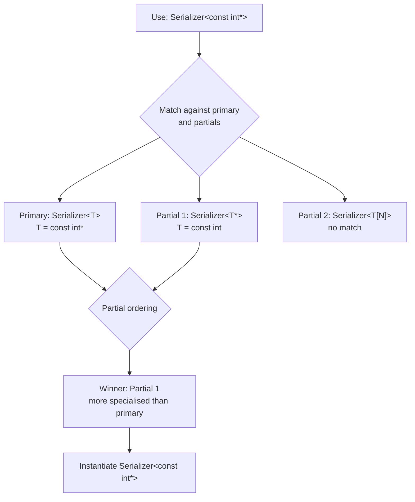

# Class Templates

## Why This Matters

Class templates are the scaffolding of the C++ standard library and almost every modern C++ library you will ever touch. `std::vector<T>`, `std::map<K, V>`, `std::optional<T>`, `std::expected<T, E>`, `std::unique_ptr<T, Deleter>`, `std::function<Signature>`, `std::span<T, Extent>`, `std::chrono::duration<Rep, Period>` — every one of these is a class template, and each one uses the full machinery covered in this note: **type parameters**, **non-type parameters**, **template template parameters**, **default template arguments**, **full and partial specialisation**, **member templates**, **trait classes**, and the subtle rules about where member functions of a class template can be defined.

If you understand class templates deeply, you can read libstdc++ and libc++ source code. If you don't, every container you use is a black box and every compile error involving one is unintelligible. This note takes you from the simplest `Box<T>` to partial specialisation of `Matrix<T, N>` and ends with the design of a small traits class — the same pattern used by `std::iterator_traits`, `std::type_traits`, and the entire `<ranges>` infrastructure.

This note builds on [[1. Function Templates]] and feeds into [[3. Variadic Templates]], [[4. SFINAE]], [[5. Concepts (C++20)]], and [[6. CRTP]].

## Background

### From function templates to class templates

A function template stamps out a function for each `T`. A class template stamps out a *whole class* — including all its members, nested types, member functions, and operators. The compiler does this lazily: only members you actually use are instantiated. This is what allows `std::vector<std::string>` to compile even though you never call, say, `vector::shrink_to_fit`.

The first widely-used class template was the `List<T>` from the original STL (Stepanov & Lee, 1994). By the time the STL was incorporated into the C++ Standard Library in 1995, the design had crystallised: containers are class templates parameterised by element type, allocators, and comparators, with member functions that are themselves function templates (e.g. the constructor that takes an iterator pair).

### What class templates unlock

1. **Type-safe containers** — `vector<int>` and `vector<string>` are unrelated types; the compiler checks every operation.
2. **Zero-overhead abstraction** — generic code specialises at compile time.
3. **Policy-based design** — passing in a comparator, allocator, or mutex type as a template parameter lets you swap behaviour without runtime cost. `std::set<T, Compare, Allocator>` is policy-based.
4. **Compile-time dimensioning** — `std::array<T, N>` carries `N` in the type; the compiler can lay out storage and bounds-check at compile time.
5. **Type-level computation** — by partial-specialising on a template parameter, you can compute at the type level. This is the foundation of template metaprogramming; see [[7. Compile-time Computation]].

## Main Content

### 1. The basic syntax

```cpp
template <typename T>
class Box {
public:
    explicit Box(T value) : value_(std::move(value)) {}
    const T& get() const { return value_; }
    void set(T value) { value_ = std::move(value); }
private:
    T value_;
};

Box<int>         bi{42};
Box<std::string> bs{"hello"};
```

The class name *inside* the template definition refers to the template itself; *outside*, you must write `Box<T>`. Inside member function definitions defined out-of-class, you must write `template <…>` again and qualify with `Box<T>::`:

```cpp
template <typename T>
Box<T>::Box(T value) : value_(std::move(value)) {}
```

Inside the class body, `Box` and `Box<T>` mean the same thing (this is the **injected-class-name** rule). Outside, only `Box<T>` works.

### 2. Member functions: inline vs out-of-line

A member function defined **inside** the class body is implicitly `inline`, can be instantiated lazily, and is the conventional choice for short functions:

```cpp
template <typename T>
class Box {
public:
    const T& get() const { return value_; }   // implicitly inline
};
```

Defined **outside**:

```cpp
template <typename T>
const T& Box<T>::get() const { return value_; }
```

Member function templates defined outside the class body are *not* implicitly `inline` in the ODR sense — but the rules for class template member functions still allow them to be defined in a header and included into multiple TUs, because the template instantiation mechanism handles ODR deduplication.

The compiler **lazily instantiates** member functions of class templates: if you never call `Box<int>::set`, the `Box<int>::set` function is never emitted. This is why you can `#include <vector>` and not pay for `vector::emplace` if you don't use it.

```cpp
template <typename T>
class Demo {
public:
    void used_often();
    void never_used();
};

int main() {
    Demo<int> d;
    d.used_often();           // instantiated
    // d.never_used();        // not instantiated — never emitted
}
```

### 3. Template parameters: the three flavours

#### Type parameters

```cpp
template <typename T, typename U = std::vector<T>>
class Pair { T first; U second; };
```

#### Non-type parameters (NTTPs)

A non-type template parameter is a *value* of some type, supplied as a constant expression.

```cpp
template <typename T, std::size_t N>
class FixedArray {
    T data_[N];
public:
    constexpr std::size_t size() const { return N; }
    T& operator[](std::size_t i) { return data_[i]; }
};

FixedArray<int, 8> buf;
```

Allowed NTTP types (liberalised progressively):

- Pre-C++17: integral and enumeration types, pointers, references.
- C++17: also `auto` and `template<auto>`.
- C++20: also floating-point types and literal class types (with restrictions — must be a structural type: all bases and non-static data members public).

```cpp
// C++20: floating-point NTTP
template <double Pi>
double area(double r) { return Pi * r * r; }
constexpr double earth_area = area<3.14159>(6371.0);

// C++20: literal-class NTTP
struct Coord { int x, y; };
template <Coord C>
struct Grid { /* ... */ };
Grid<Coord{3, 4}> g;
```

#### Template template parameters

A parameter that is itself a template:

```cpp
template <typename T> struct Vector { /* ... */ };
template <typename T> struct List    { /* ... */ };

template <template <typename> class Container, typename T>
class Stack {
    Container<T> data_;
public:
    void push(T x) { data_.push_back(x); }
};

Stack<Vector, int> sv;   // uses Vector<int>
Stack<List,    int> sl;  // uses List<int>
```

C++17 allows `template <typename> typename Container` (using `typename` instead of `class`), which is more consistent with the rest of the language.

### 4. Default template arguments

Defaults can be supplied for *any* template parameter, including type, non-type, and template template parameters. As with function default arguments, defaults can only appear in the rightmost positions.

```cpp
template <typename T,
          typename Allocator = std::allocator<T>,
          typename Compare    = std::less<T>>
class OrderedBag {
    std::set<T, Compare, Allocator> data_;
};

OrderedBag<int> ob;                                  // uses defaults
OrderedBag<int, MyAllocator<int>> ob2;               // override Allocator
```

The standard containers all use defaults for allocator and comparison policy; this is why you can write `std::set<int>` and almost never see the second and third template arguments.

Defaults cannot be repeated across declarations. If a header declares `template <typename T = int> class X;`, a re-declaration must omit the default.

### 5. Full specialisation

You can fully specialise a class template for one specific combination of arguments. The resulting class is **completely independent** — you must redefine every member you want to support.

```cpp
template <typename T>
class Serializer {
public:
    static std::string to_string(const T& v) { return generic_serialize(v); }
};

template <>
class Serializer<bool> {
public:
    static std::string to_string(const bool& v) {
        return v ? "true" : "false";          // custom, not generic
    }
};

Serializer<int>::to_string(42);        // generic
Serializer<bool>::to_string(true);     // specialised
```

The "you must redefine every member" rule has a subtle consequence: if you add a method to the primary template later, the specialisation doesn't get it automatically. This is one reason full specialisation is more brittle than partial specialisation.

### 6. Partial specialisation

A partial specialisation fixes *some* of the template parameters or constrains them with patterns (e.g. `T*`, `T&`, `T[N]`):

```cpp
template <typename T>
class Serializer<T*> {                       // partial: pointer types
public:
    static std::string to_string(const T* p) {
        return p ? Serializer<T>::to_string(*p) : "null";
    }
};

template <typename T, std::size_t N>
class Serializer<T[N]> {                     // partial: array of T
public:
    static std::string to_string(const T (&arr)[N]) {
        std::string s = "[";
        for (std::size_t i = 0; i < N; ++i) {
            if (i) s += ", ";
            s += Serializer<T>::to_string(arr[i]);
        }
        return s + "]";
    }
};
```

The compiler picks the **most specialised** partial specialisation that matches the actual arguments. The partial-ordering rules are the same as for overloaded function templates (see [[1. Function Templates]]).

Partial specialisation is the workhorse of type-level computation: it's how `std::remove_const`, `std::decay`, `std::tuple_size`, and friends are implemented.

```cpp
// Simplified: how std::remove_const is defined
template <typename T> struct remove_const          { using type = T; };
template <typename T> struct remove_const<const T> { using type = T; };

static_assert(std::is_same_v<remove_const<const int>::type, int>);
```



### 7. Member templates

A class template can have members that are *themselves* templates. The canonical example is the converting constructor:

```cpp
template <typename T>
class SmartPtr {
    T* ptr_;
public:
    SmartPtr(T* p = nullptr) : ptr_(p) {}

    // Member template constructor: convert SmartPtr<U> to SmartPtr<T>
    template <typename U>
    SmartPtr(const SmartPtr<U>& other) : ptr_(other.get()) {}

    T* get() const { return ptr_; }
};

SmartPtr<Derived> d{new Derived};
SmartPtr<Base>    b = d;          // uses member-template ctor
```

Member templates are essential for: copy constructors when you want conversions, `operator=` for assignment from compatible types, and member functions like `vector::assign(Iter, Iter)` that work for any iterator pair.

### 8. Friend declarations

There are three idioms for friending in templates:

```cpp
template <typename T> class Vec;

template <typename T>
class Box {
    // 1. Friend a specific instantiation
    friend class Vec<T>;

    // 2. Friend every instantiation of a template (not just Box<T>)
    template <typename U> friend class Operator;

    // 3. Friend a non-template function
    friend std::ostream& operator<<(std::ostream&, const Box&);
};
```

Beware the **one-definition** subtlety: if you want a *free* function `operator<<` to be found via ADL for `Box<T>`, you typically declare it as a friend *inside* the class body, defining it inline. That way each instantiation gets its own `operator<<` injected into the surrounding namespace via ADL.

```cpp
template <typename T>
class Box {
    friend std::ostream& operator<<(std::ostream& os, const Box& b) {
        return os << "Box(" << b.value_ << ')';
    }
private:
    T value_;
};
```

### 9. Trait classes

A **trait class** is a class template (or a set of them) designed to expose *properties* of a type as nested typedefs or constants. The standard library has a whole pile of them in `<type_traits>`.

A small custom trait: an "element type" trait that works for both `std::vector<T>` and raw arrays.

```cpp
#include <vector>
#include <type_traits>

template <typename T>
struct element_type {
    using type = T;                  // primary: identity
};

template <typename T, typename A>
struct element_type<std::vector<T, A>> {
    using type = T;                  // specialisation: peel the vector
};

template <typename T, std::size_t N>
struct element_type<T[N]> {
    using type = T;                  // specialisation: peel the array
};

template <typename T>
using element_type_t = typename element_type<T>::type;

static_assert(std::is_same_v<element_type_t<std::vector<int>>, int>);
static_assert(std::is_same_v<element_type_t<double[8]>, double>);
static_assert(std::is_same_v<element_type_t<int>, int>);
```

The pattern:

1. Define a primary template that gives a default answer.
2. Define one partial specialisation per "shape" you want to recognise.
3. Expose the answer as a nested `using` (modern) or `static constexpr` value.
4. Provide a `_t` (or `_v`) convenience alias so callers don't have to type `typename … ::type` everywhere.

This pattern is used by `std::iterator_traits`, `std::tuple_size`, `std::tuple_element`, `std::pointer_traits`, `std::allocator_traits`, and many more. It's also the foundation of [[4. SFINAE]] detection idioms like `std::void_t`.

### 10. Class templates with dependent scope

Inside a class template, nested types may be **dependent**. When you reference them from outside, you usually need `typename`:

```cpp
template <typename Container>
void print_first(const Container& c) {
    typename Container::value_type first = *c.begin();
    std::cout << first << '\n';
}
```

Without `typename`, the parser can't decide whether `Container::value_type` is a type or a value, and assumes a value — which is almost never what you want.

### 11. The `template` keyword inside dependent names

If a dependent name is itself a template, you need the `template` keyword:

```cpp
template <typename T>
void f() {
    T::template inner_type<int>  x;       // 'template' required
    typename T::template factory<int>()(); // both required!
}
```

### 12. Implicit conversions and class templates

Two instantiations of the same class template are **unrelated types**. `Box<int>` and `Box<long>` don't implicitly convert to each other, even though `int` and `long` do. To allow conversions, you must explicitly write the converting constructor (see the SmartPtr example above).

The same rule explains why `std::vector<int>` and `std::vector<long>` cannot be assigned to each other without an explicit cast or element-wise conversion. This is a *deliberate* design choice — silent cross-container conversions are a common source of subtle bugs.

### 13. Alias templates (C++11)

An **alias template** is a templated `using` declaration. Unlike a `typedef`, it can be partially applied.

```cpp
template <typename T> using Ptr = T*;
Ptr<int>  pi;           // int*
Ptr<void> pv;           // void*
```

Alias templates are not specialisations; they are pure aliases. You cannot specialise an alias template. `std::remove_const_t<T>` is an alias template, and `std::vector<T, std::allocator<T>>` is the definition underlying `std::vector<T>`.

```cpp
// Standard library examples
template <typename T> using remove_const_t    = typename remove_const<T>::type;
template <typename T> using add_pointer_t     = typename add_pointer<T>::type;
```

### 14. Variadic class templates

```cpp
template <typename... Ts>
class Tuple;

Tuple<int, double, std::string> t;
```

Covered in detail in [[3. Variadic Templates]].

### 15. Literal class templates (C++20)

If a class template has a `constexpr` constructor and only literal-type members, it can be used as a NTTP itself in C++20. This enables patterns like compile-time fixed-point arithmetic, units-of-measure libraries, and `std::format_string<Args...>` (a literal class template parameter to `std::format`).

```cpp
template <int Mantissa, int Exp>
struct FixedPoint {
    static constexpr int value = Mantissa;
    static constexpr int exp   = Exp;
    constexpr double as_double() const { return value * std::pow(10.0, exp); }
};

template <FixedPoint FP>
constexpr double pi_times = 3.14159265358979 * FP.as_double();
```

## Code Examples

### Example A: a small `Matrix<T, N, M>` template

```cpp
#include <array>
#include <cstddef>

template <typename T, std::size_t Rows, std::size_t Cols>
class Matrix {
    std::array<T, Rows * Cols> data_{};
public:
    constexpr T& operator()(std::size_t r, std::size_t c) {
        return data_[r * Cols + c];
    }
    constexpr const T& operator()(std::size_t r, std::size_t c) const {
        return data_[r * Cols + c];
    }
    static constexpr std::size_t rows = Rows;
    static constexpr std::size_t cols = Cols;
};

constexpr Matrix<int, 2, 2> identity() {
    Matrix<int, 2, 2> m;
    m(0, 0) = 1; m(1, 1) = 1;
    return m;
}

static_assert([]{
    auto m = identity();
    return m(0, 0) == 1 && m(1, 0) == 0;
}());
```

### Example B: partial specialisation for square matrices

```cpp
template <typename T, std::size_t N>
class Matrix<T, N, N> {            // partial: square
public:
    static constexpr std::size_t size = N * N;
    constexpr T determinant() const {
        // ... specialised determinant algorithm for square matrices
        return T{};
    }
};
```

### Example C: a `policy_ptr` with policy-based design

```cpp
template <typename T> struct RefCounted {
    static void acquire(T* p) { /* incr */ }
    static void release(T* p) { /* decr & delete */ }
};
template <typename T> struct NoOp { static void acquire(T*) {} static void release(T*) {} };

template <typename T, typename Policy = NoOp<T>>
class PolicyPtr {
    T* ptr_;
public:
    PolicyPtr(T* p = nullptr) : ptr_(p) { Policy::acquire(ptr_); }
    ~PolicyPtr() { Policy::release(ptr_); }
    PolicyPtr(const PolicyPtr&) = delete;
    PolicyPtr& operator=(const PolicyPtr&) = delete;
    T& operator*()  const { return *ptr_; }
    T* operator->() const { return  ptr_; }
};
```

### Example D: a minimal traits class

```cpp
#include <type_traits>

template <typename It>
using iter_value_t = typename std::iterator_traits<It>::value_type;

template <typename It>
iter_value_t<It> sum(It first, It last) {
    iter_value_t<It> total{};
    for (; first != last; ++first) total += *first;
    return total;
}
```

## Common Pitfalls

- **Defining member functions outside the class without `template <…>`.** Forgetting the template prefix or the `<T>` after the class name is a classic compile error.
- **Forgetting `typename` on dependent types.** `Container::value_type` outside the class body must be `typename Container::value_type`.
- **Specialising after use.** Same UB trap as function templates: specialise before any use of that instantiation.
- **Confusing full specialisation with partial specialisation.** A specialisation that fixes *all* parameters is full; one that fixes *some* is partial. The syntaxes differ — full has `template <>`, partial has `template <typename T>`.
- **Specialisation in a different namespace.** Specialisations must be declared in the same namespace as the primary template.
- **Default argument duplication.** You can't repeat a default in re-declarations: `template <typename T = int> class X;` and `template <typename T = int> class X {};` is an error.
- **Believing two instantiations of the same class template are related.** `vector<int>` and `vector<long>` are unrelated; you need a converting constructor or copy loop.
- **Putting class template definitions in `.cpp` files.** Unless you `extern template`-declare every instantiation, the linker will not find the instantiation. The conventional solution is to define template members in headers.
- **Bloating binaries with unnecessary instantiations.** `std::vector<Huge>` where you only call `size()` will not instantiate the destructor logic for `Huge` — but if you accidentally call *any* non-trivial member, you pay for all of it. Use forward declarations where possible.
- **Assuming partial specialisation of function templates exists.** It doesn't — only full specialisation. Use overloading or class-template specialisation with a static member function instead.

## Tips and Tricks

- For small classes, define all member functions inside the class body. It's shorter, the implicit `inline` is correct, and two-phase lookup pitfalls are reduced.
- Use **alias templates** to hide policy arguments: `template <typename T> using ref_ptr = PolicyPtr<T, RefCounted<T>>;`.
- Prefer partial specialisation over full specialisation when possible — it scales better and is less brittle.
- Use **defaults** aggressively for policy parameters (allocators, comparators) so callers write the short form.
- Provide an `_t` and `_v` alias for every trait. They massively reduce visual noise in client code.
- When designing a trait class, expose **at least one nested type or constant** even if the answer is always "yes" — it gives callers a uniform interface.
- Use `static_assert` inside class template bodies to enforce invariants at instantiation time.
- To detect whether a type has a member, see [[4. SFINAE]] (pre-C++20) or [[5. Concepts (C++20)]] (modern).
- Use `if constexpr` inside member function templates to dispatch on the type's properties — far more readable than tag dispatch.
- For compile-time polymorphism without virtual functions, see [[6. CRTP]].
- For tuple-like classes, see [[3. Variadic Templates]].

## Active Recall

1. Why does the compiler lazily instantiate member functions of class templates? Give a concrete example where this matters for binary size.
2. What is the **injected-class-name** rule, and where does it let you omit `<T>` inside a class template body?
3. Write a partial specialisation of `template <typename T> class Stack` for pointer element types.
4. Why can't you use `template <typename T> class X; X<int>::type t;` without specifying a specialisation that exposes `type`?
5. Describe how the C++20 floating-point and literal-class NTTPs change what's possible at compile time. Give an example.
6. Explain why `vector<int>` and `vector<long>` are not implicitly convertible even though `int` and `long` are.
7. What is the difference between `template <typename> class C` and `template <typename> typename C`? When was each introduced?
8. Why does the converting constructor of `std::shared_ptr<Derived>` accept a `std::shared_ptr<Base>`? Show the member-template signature.
9. What is an alias template, and why can't you partially specialise one?
10. Define a trait class `rank<T>` that returns `0` for scalars and `1` for arrays. Show both the primary template and the partial specialisation.
11. Why must `friend` declarations for free `operator<<` typically be defined inside the class body of a class template?
12. Walk through how the compiler picks between the primary template and two competing partial specialisations of `Serializer<T*>` and `Serializer<T[N]>` for the instantiation `Serializer<int*>`.
13. How would you declare an explicit instantiation of `std::vector<int>` to suppress implicit instantiation in a TU?
14. What's the difference between a class template, an alias template, and a class-template specialisation? Give a one-line definition of each.

## Next Steps

- [[3. Variadic Templates]] extends class templates to take any number of type parameters — the foundation of `std::tuple`.
- [[4. SFINAE]] shows how to use partial specialisation and `std::enable_if` to conditionally enable template overloads.
- [[5. Concepts (C++20)]] replaces ad-hoc traits with a uniform, named constraint vocabulary.
- [[6. CRTP]] uses class templates to inject behaviour into derived classes statically.
- [[7. Compile-time Computation]] uses class templates (especially partial specialisation) as a Turing-complete compile-time programming language.
- For real-world class templates in action, browse [[11. STL Deep Dive]] and the [[8. Modern C++]] notes.
