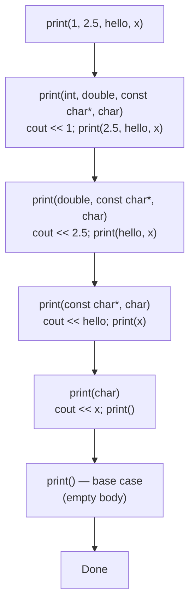
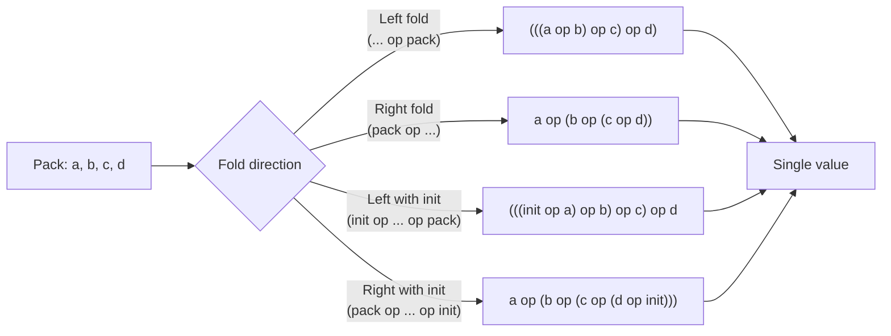

# Variadic Templates

## Why This Matters

Variadic templates, introduced in C++11, let you write a single function or class template that accepts **any number of arguments** of **any types**. Before C++11, the only way to write a function with a variable argument count was C-style `va_args` (the `<cstdarg>` macros), which is unsafe, untyped, requires a sentinel or explicit count, and forbids non-trivial types entirely. `printf` and friends survive on `va_args` and on the goodwill of the caller; the compiler cannot check that `%d` matches an `int`.

Variadic templates fix all of that: every argument is type-checked, the count is known at compile time, and you can pass `std::string`s, lambdas, smart pointers — anything. The feature pays for itself many times over:

- **`std::make_shared<T>(args...)` and `std::make_unique<T>(args...)`** forward any constructor argument list.
- **`std::thread` / `std::async` / `std::invoke`** forward callable + arguments.
- **`std::tuple<T1, T2, …>` and `std::variant<T1, T2, …>`** are variadic class templates.
- **`std::format("…", args...)` (C++20)** is type-safe `printf`.
- **`std::function` and any custom event system** use them to forward argument lists.

The pre-C++17 way to "unpack" a parameter pack was recursion with a base case and an induction step. C++17 introduced **fold expressions**, which collapse most of that boilerplate into a single line. This note covers both, plus perfect forwarding of packs, `sizeof...(pack)`, the `std::tuple` API, and the modern idioms that make variadic templates a pleasure to use.

This note builds on [[1. Function Templates]] and [[2. Class Templates]] and is used heavily in [[5. Concepts (C++20)]] (concepts can have variadic parameter lists), [[6. CRTP]] (variadic mixins), and [[7. Compile-time Computation]] (type-list processing).

## Background

### The pre-C++11 world

Two choices existed:

1. **C varargs (`<cstdarg>`)** — no type checking, no C++ objects, manual count.
2. **Overload cascades** — libraries like Boost.ASIO and pre-C++11 Qt generated `arg1`, `arg2`, … up to some arbitrary limit (often 10) using preprocessor macros (Boost.Preprocessor). The result was a maintenance nightmare.

The C++11 proposal (N2080, Douglas Gregor, Jaakko Järvi) introduced **parameter packs** — a way for the template system itself to carry a list of zero or more arguments. The compiler can recursively unfold the pack at instantiation time. C++14 cleaned up a few rough edges; C++17 added fold expressions; C++20 added lambdas with explicit template parameter lists (which can be variadic); C++23 added `std::print` and `std::println` which are themselves variadic templates.

### Core ideas

A **parameter pack** is a template parameter that can absorb zero or more arguments. There are two kinds:

- **Template parameter pack** — `template <typename... Ts>` absorbs type arguments.
- **Function parameter pack** — `void f(Ts... args)` absorbs function arguments.

A pack **expansion** writes `Ts...` (or `args...`, or `f<Ts>()...`) to expand the pack at the point of use. The number of elements is queried with `sizeof...(pack)`.

```cpp
template <typename... Ts>
void f(Ts... args) {
    std::cout << sizeof...(Ts) << " type args, "
              << sizeof...(args) << " value args\n";
}

f();                       // 0 / 0
f(1, 2.0, "three");        // 3 / 3
```

## Main Content

### 1. The recursive unpacking pattern (pre-C++17)

The classic idiom: define a base case (zero arguments) and a recursion case (one or more). Each recursive call strips one argument off the front.

```cpp
#include <iostream>

// Base case
void print() {}

// Induction case
template <typename T, typename... Rest>
void print(const T& first, const Rest&... rest) {
    std::cout << first << ' ';
    print(rest...);                  // recurse with the remaining pack
}

int main() {
    print(1, 2.5, "hello", 'x');     // prints "1 2.5 hello x "
}
```

How the recursion unfolds:



This works but is verbose: each recursion level generates a separate instantiation. For a 20-argument call you get 20 instantiations plus one for the base case. Compile time grows linearly in the argument count. Fold expressions solve this.

### 2. Fold expressions (C++17)

A **fold expression** expands a pack around a binary operator, all in one expression. Syntaxes:

| Form                       | Meaning                                     |
| -------------------------- | ------------------------------------------- |
| `(... op pack)`            | Left fold: `((e1 op e2) op e3) op … op eN`  |
| `(pack op ...)`            | Right fold: `e1 op (e2 op (… op eN))`       |
| `(init op ... op pack)`    | Left fold with initial value                |
| `(pack op ... op init)`    | Right fold with initial value               |

Allowed operators: `+ - * / % ^ & | = << >> += -= *= /= %= ^= &= |= <<= >>= == != < > <= >= && || , ->* ->` and member-of-pointer, etc. — almost any binary operator.

The variadic `print` rewritten with a fold expression:

```cpp
template <typename... Ts>
void print(const Ts&... args) {
    (std::cout << ... << args) << '\n';       // binary left fold over <<
}
```

A `sum` helper:

```cpp
template <typename... Ts>
auto sum(Ts... args) {
    return (args + ... + 0);                  // binary left fold with init=0
}
```

The `+ 0` matters: it makes the empty pack well-defined (`sum()` returns `0`). Without an init value, **a unary fold over an empty pack is ill-formed except for `&&` (true), `||` (false), and `,` (void)**.

Common patterns:

```cpp
// All of (args) > 0?
template <typename... Ts>
bool all_positive(Ts... args) { return (true && ... && (args > 0)); }

// Any of (args) > 0?
template <typename... Ts>
bool any_positive(Ts... args) { return (false || ... || (args > 0)); }

// Apply f to each argument, in order
template <typename F, typename... Ts>
void for_each_arg(F&& f, Ts&&... args) {
    (static_cast<void>(std::forward<F>(f)(std::forward<Ts>(args))), ...);
}
```

The last pattern — `(f(args), ...)` — uses the comma operator to sequence side effects. The `static_cast<void>` suppresses "left operand of comma has no effect" warnings if `f` returns a non-void type.



### 3. `sizeof...(pack)`

Returns the number of elements in a pack, as a `std::size_t` constant. Works on both type and value packs.

```cpp
template <typename... Ts>
constexpr std::size_t arity = sizeof...(Ts);

static_assert(arity<int, double, char> == 3);
static_assert(arity<> == 0);
```

### 4. Perfect forwarding of packs

The killer application: forward an arbitrary argument list, unchanged in value category, to another function. This is the entire reason `std::make_unique`, `std::emplace_back`, and `std::thread` work.

```cpp
#include <utility>
#include <memory>

template <typename T, typename... Args>
std::unique_ptr<T> make_unique(Args&&... args) {
    return std::unique_ptr<T>(new T(std::forward<Args>(args)...));
}
```

The two ingredients:

1. `Args&&... args` — a **pack of forwarding references**. Each `Args&&` is a forwarding reference; the deduction rules apply element-wise.
2. `std::forward<Args>(args)...` — a **pack expansion inside a `std::forward` call**. The `...` expands the pattern `std::forward<Args>(args)` independently for each pack element, preserving lvalue/rvalue-ness.

```cpp
std::string s = "hello";
auto p = make_unique<std::pair<std::string, int>>(s, 42);
// s forwarded as lvalue (copied), 42 forwarded as prvalue (moved/copy)
```

The `emplace_back` family in containers is exactly this pattern: `vector::emplace_back(Args&&... args)` forwards into `allocator_traits::construct`, which forwards into placement `new`.

### 5. Variadic class templates: `std::tuple`

A variadic class template carries a list of types as part of the type. The simplest meaningful example is `std::tuple`:

```cpp
#include <tuple>
#include <string>

std::tuple<int, double, std::string> t{42, 3.14, "hi"};
auto i = std::get<0>(t);                  // 42 (int)
auto s = std::get<std::string>(t);        // "hi"
auto [a, b, c] = t;                       // structured bindings (C++17)
```

A sketch of how a tuple is implemented:

```cpp
template <typename... Ts> class tuple;

template <> class tuple<> {};                       // base case: empty

template <typename Head, typename... Tail>
class tuple<Head, Tail...> : private tuple<Tail...> {
    Head head_;
public:
    tuple(Head h, Tail... tail) : tuple<Tail...>(std::move(tail)...), head_(std::move(h)) {}
    Head&       front()       { return head_; }
    const Head& front() const { return head_; }
};
```

Each level of inheritance carries one element, and `tuple<Tail...>` is the recursive remainder. The compiler generates a chain of `sizeof...(Ts)` derived-class levels.

Tuple helpers you should know:

- `std::tuple_size<Tuple>::value` — number of elements.
- `std::tuple_element<I, Tuple>::type` — type of the `I`-th element.
- `std::get<I>(t)` — access by index.
- `std::get<T>(t)` — access by type (only valid if `T` is unique in the tuple).
- `std::tuple_cat(t1, t2, …)` — concatenate tuples.
- `std::apply(f, t)` — call `f` with the tuple's elements as arguments (C++17).
- `std::make_from_tuple<T>(t)` — construct a `T` from the tuple's elements (C++17).

```cpp
#include <tuple>
#include <iostream>

int add(int a, int b, int c) { return a + b + c; }

int main() {
    auto args = std::make_tuple(1, 2, 3);
    std::cout << std::apply(add, args) << '\n';      // 6
}
```

### 6. Index sequences

The `<utility>` header provides `std::index_sequence<Ints...>`, `std::make_index_sequence<N>`, and `std::index_sequence_for<Ts...>`. These let you "explode" a pack by index — essential when you need to operate on the `I`-th element of a tuple or array in a context that doesn't allow a `for` loop.

```cpp
#include <array>
#include <utility>

template <typename T, std::size_t N, std::size_t... Is>
constexpr std::array<T, N> to_array_impl(const T (&arr)[N], std::index_sequence<Is...>) {
    return {{ arr[Is]... }};                  // expand Is
}

template <typename T, std::size_t N>
constexpr std::array<T, N> to_array(const T (&arr)[N]) {
    return to_array_impl(arr, std::make_index_sequence<N>{});
}

constexpr int raw[] = {1, 2, 3, 4};
constexpr auto a = to_array(raw);
static_assert(a[2] == 3);
```

The pattern: define a helper template that takes an `index_sequence<Is...>`, expand the pack inside, and have a one-line wrapper that calls `std::make_index_sequence<N>{}` to materialise the indices.

`std::apply` is itself implemented using `index_sequence`: it materialises the indices for the tuple's size, then calls `std::get<I>(t)...` to expand the tuple into a call.

### 7. Fold-like patterns beyond operators

You can fold over **function call** by using the comma operator. Two useful idioms:

#### Verify all arguments satisfy a property

```cpp
template <typename... Ts>
constexpr bool all_integral = (std::is_integral_v<Ts> && ...);

static_assert(all_integral<int, long, char>);
static_assert(!all_integral<int, double>);
```

#### Apply a callable to each element of a parameter pack

```cpp
template <typename F, typename... Ts>
void for_each(F&& f, Ts&&... args) {
    ((void)std::forward<F>(f)(std::forward<Ts>(args)), ...);
}

for_each([](auto&& x) { std::cout << x << '\n'; }, 1, 2.5, "hello");
```

### 8. Lambdas with variadic parameters

A generic lambda can take a variadic parameter list:

```cpp
auto printer = [](auto&&... args) {
    ((std::cout << args << ' '), ...);
    std::cout << '\n';
};

printer(1, 2.0, "three");     // 1 2.0 three
```

C++20 lets you write **explicit template parameter lists on lambdas**, including variadic ones:

```cpp
auto tuple_sum = []<typename... Ts>(const std::tuple<Ts...>& t) {
    return std::apply([](auto... xs) { return (xs + ... + 0); }, t);
};
```

### 9. Variadic concepts (C++20)

Concepts can be variadic. Useful for "all of these satisfy `C`":

```cpp
template <typename... Ts>
concept AllIntegral = (std::is_integral_v<Ts> && ...);

template <AllIntegral... Ts>
auto sum(Ts... args) { return (args + ... + 0); }
```

See [[5. Concepts (C++20)]] for the full concepts story.

### 10. Variadic CRTP and mixin chains

You can chain mixins with variadic CRTP:

```cpp
template <typename Derived> struct Counter { static int count; };
template <typename Derived> struct Logger  { void log(const char* m) { /* … */ } };

template <template <typename> class... Mixins>
struct Compose : Mixins<Compose<Mixins...>>... {};

using MyType = Compose<Counter, Logger>;
```

See [[6. CRTP]] for the dedicated treatment.

### 11. Variadic alias templates

```cpp
template <typename... Ts>
using tuple_of_pointers = std::tuple<Ts*...>;

tuple_of_pointers<int, double, char> t;     // std::tuple<int*, double*, char*>
```

### 12. Pack expansion in initializer-list contexts

You can expand a pack inside `{ }` (braced-init-list), which preserves evaluation order left-to-right — useful when the comma operator is not safe:

```cpp
template <typename... Ts>
void log_all(const Ts&... args) {
    int dummy[] = { (std::cout << args << '\n', 0)... };
    (void)dummy;
}
```

The array `dummy` exists only to give the pack expansion a legal syntactic context. This was *the* pre-C++17 way to iterate over a pack with side effects; fold expressions have replaced it almost everywhere.

### 13. Performance characteristics

- **Compile time:** pre-C++17 recursive unpacking produces one instantiation per pack element — linear growth. Fold expressions collapse this to one expression; instantiation count is essentially constant.
- **Binary size:** each instantiation emits code. A `print` that handles 20 arguments emitted 20 times across a project contributes measurably to binary size.
- **Inlining:** variadic forwarding chains (`make_unique` → constructor) inline cleanly when both ends are visible in the TU.

For a hot path, prefer passing `std::span` or a range over a variadic pack — but for occasional glue code (logging, event systems, factory functions) variadic templates are the right tool.

## Code Examples

### Example A: a type-safe `printf`

```cpp
#include <iostream>
#include <string>
#include <string_view>

void format_impl(std::ostream& os, std::string_view fmt) {
    os << fmt;                       // nothing left to substitute
}

template <typename T, typename... Rest>
void format_impl(std::ostream& os, std::string_view fmt, const T& head, const Rest&... rest) {
    auto pos = fmt.find('%');
    os << fmt.substr(0, pos);
    if (pos != std::string_view::npos) {
        os << head;
        format_impl(os, fmt.substr(pos + 1), rest...);
    }
}

template <typename... Args>
void my_printf(std::string_view fmt, const Args&... args) {
    format_impl(std::cout, fmt, args...);
    std::cout << '\n';
}

int main() {
    my_printf("Hello %, you are % years old", "Alice", 30);
}
```

### Example B: `make_unique` with perfect forwarding

```cpp
#include <memory>
#include <utility>

template <typename T, typename... Args>
std::unique_ptr<T> make_unique(Args&&... args) {
    return std::unique_ptr<T>(new T(std::forward<Args>(args)...));
}

struct Widget {
    Widget(int, std::string, bool) {}
};

auto w = make_unique<Widget>(42, "hi", true);
```

### Example C: variadic `max`

```cpp
#include <algorithm>

template <typename T>
T max_of(T x) { return x; }

template <typename T, typename... Rest>
T max_of(T first, Rest... rest) {
    return std::max(first, max_of(rest...));
}

// Or, C++17 one-liner:
template <typename... Ts>
auto max_fold(Ts... args) {
    return std::max({args...});
}
```

### Example D: a tiny type list

```cpp
#include <type_traits>

template <typename... Ts> struct type_list;

template <typename List> struct size_of;
template <typename... Ts>
struct size_of<type_list<Ts...>> {
    static constexpr std::size_t value = sizeof...(Ts);
};

template <typename List> struct head_of;
template <typename H, typename... R>
struct head_of<type_list<H, R...>> { using type = H; };

template <typename List> struct tail_of;
template <typename H, typename... R>
struct tail_of<type_list<H, R...>> { using type = type_list<R...>; };

static_assert(size_of<type_list<int, double, char>>::value == 3);
static_assert(std::is_same_v<head_of<type_list<int, double>>::type, int>);
static_assert(std::is_same_v<tail_of<type_list<int, double, char>>::type,
                             type_list<double, char>>);
```

Type lists are the foundation of compile-time metaprogramming — see [[7. Compile-time Computation]].

## Common Pitfalls

- **`sizeof...(pack)` requires the `...`**. Forgetting it (`sizeof(pack)`) gives a different meaning — `sizeof` of the *type* — and almost certainly a compile error.
- **Empty pack folds** are ill-formed for `+`, `-`, `*`, `/`, etc. — only `&&`, `||`, and `,` have well-defined empty-pack behaviour. Add an init value (`(args + ... + 0)`) to be safe.
- **Forgetting the `...` in a pack expansion.** `std::forward<Args>(args)` without `...` passes only the first element (or fails to compile). The correct form is `std::forward<Args>(args)...`.
- **Mixing parameter packs with regular parameters in the wrong order.** A pack must be the *last* template parameter (in a function template) or the last function parameter. Otherwise deduction fails.
- **Recursive templates with no base case** — instantiates forever, eventually hitting the compiler's recursion limit (`-ftemplate-depth=N`, default 900 on GCC).
- **Confusing `Ts&&... args` with `Ts... args`.** The former is a pack of forwarding references (correct for forwarding); the latter is a pack of values (forces copies).
- **Forgetting `void` casts in comma-operator folds.** A fold like `(f(args), ...)` where `f` returns a non-void type triggers "left operand of comma has no effect" warnings on most compilers. Wrap with `(void)f(args), ...` or `(static_cast<void>(f(args)), ...)`.
- **Believing fold expressions evaluate lazily.** They don't — every element is evaluated. `(do_thing(args), ...)` calls `do_thing` on every argument.
- **Compile-time blowup from deeply nested recursion.** A 200-argument call to a recursive unpacker produces 200 template instantiations and may noticeably slow compilation. Prefer folds.
- **Tuple access by type with duplicates.** `std::get<std::string>(t)` is a hard error if `t` has two `std::string` elements — the type must be unique.

## Tips and Tricks

- **Prefer fold expressions to recursion.** They are clearer, faster to compile, and produce smaller binaries.
- Use `(args + ... + init)` rather than `(... + args) + init` for left folds with an init — same result, but the `init` form is more readable.
- For "iterate and side-effect" patterns, use `(f(args), ...)` instead of the `int dummy[] = {(f(args), 0)...};` trick from pre-C++17.
- For functions that forward a pack, *always* use `Args&&... args` and `std::forward<Args>(args)...` — even if you don't need lvalue/rvalue preservation today, future callers might.
- Use `std::apply` and `std::tuple_cat` instead of writing manual tuple iteration.
- Use `std::index_sequence` whenever you need to operate on the `I`-th element of a pack in a context that doesn't allow `...`.
- Use `template <typename... Ts> using foo_t = ...` to give convenient aliases to complex variadic patterns.
- For an event system, store handlers as `std::function<void(Args...)>` in a `std::vector` — the variadic signature gives you type-safe observers.
- If you find yourself writing a fold over `&&` and you have C++20, consider a concept instead — `template <Concept... Ts>` is more expressive.
- Variadic templates can be combined with [[6. CRTP]] for powerful mixin chains; with [[5. Concepts (C++20)]] for constrained variadics; with [[7. Compile-time Computation]] for type-level computation.
- Beware that **variadic templates are viral** — once your function takes one, every wrapper above it tends to need one too. That's fine for one-off glue code, but for public APIs consider whether a `std::span` or `std::ranges::range` would express the intent better.

## Active Recall

1. Why are C-style varargs (`<cstdarg>`) unsafe for non-trivial types, and how do variadic templates fix this?
2. Write a fold expression that returns the product of a parameter pack, defaulting to `1` for the empty pack.
3. Explain the difference between `Ts... args` (by-value pack) and `Ts&&... args` (forwarding-reference pack). When must you use the second?
4. Why does `(f(args), ...)` produce warnings if `f` returns a non-void type, and how do you suppress them?
5. Walk through how `std::tuple<int, double, char>` is implemented using recursive inheritance. How many class instantiations does it produce?
6. What is `std::index_sequence` for? Show a use case where you can't use a plain pack expansion.
7. Why is `(args + ...)` ill-formed for an empty pack but `(args && ...)` well-defined?
8. Implement a variadic `all_of(Pred, args...)` that returns true iff `Pred` is true for every argument.
9. What does `std::apply` do, and what feature does it use under the hood?
10. How does the C++20 explicit template-parameter list on lambdas change variadic programming? Give an example.
11. Describe the compile-time and binary-size cost of recursive unpacking vs fold expressions.
12. Why must a parameter pack be the last parameter in a function template? What goes wrong if it isn't?
13. Implement `for_each_arg(f, args...)` with a fold expression. Then explain why you might want `std::forward<F>(f)` inside the fold.
14. How would you detect that a tuple contains a particular type, using only variadic templates and `std::is_same_v`?

## Next Steps

- [[4. SFINAE]] uses variadic packs to express "any one of these overloads is acceptable."
- [[5. Concepts (C++20)]] lets you write `template <Concept... Ts>` — variadic with constraints.
- [[6. CRTP]] combines with variadic templates for mixin chains.
- [[7. Compile-time Computation]] uses type lists and recursive unpacking as a compile-time programming language.
- For real-world use, see `std::tuple`, `std::variant`, `std::function`, and `std::format` in [[11. STL Deep Dive]].
