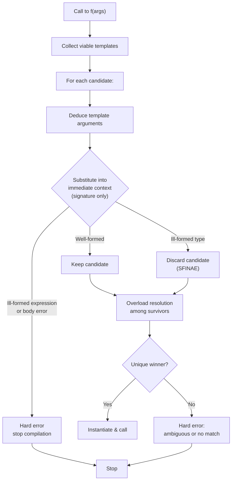

# SFINAE

## Why This Matters

**SFINAE** — *Substitution Failure Is Not An Error* — is the pre-C++20 mechanism for **conditionally enabling** template overloads based on properties of the template arguments. It is the technique behind `std::enable_if`, `std::void_t`, every "is this type a container?" detector, every "does this class have a `size()` member?" trick, and a great deal of legacy library code you will encounter in production.

Understanding SFINAE matters for three reasons:

1. **You will read SFINAE code** in any codebase that targets C++14 or earlier. `std::enable_if` is everywhere in pre-C++20 Boost, Qt, Folly, Abseil, and the standard library itself.
2. **You will occasionally need SFINAE** in C++20/23/26 code: not every situation is covered by concepts, and metaprogramming against arbitrary member-existence still uses the `std::void_t` magic.
3. **You will appreciate Concepts more** once you have felt the pain of a 200-line SFINAE error message. The C++20 design of [[5. Concepts (C++20)]] is a direct response to SFINAE's shortcomings.

This note covers the SFINAE rule itself, the canonical `std::enable_if` patterns (return type, function parameter, default template argument), the `std::void_t` detection idiom, the "member detector" trick, the well-known pitfalls, and the bridge to concepts. It builds on [[1. Function Templates]], [[2. Class Templates]], and [[3. Variadic Templates]].

## Background

### The substitution phase

When the compiler processes a call to a function template, it performs **template argument deduction** and then **substitution**: it replaces each template parameter with the deduced (or explicitly supplied) argument, and re-checks the resulting signature for validity.

A natural expectation might be: "if substitution produces an ill-formed signature, that's an error." The C++ standard disagrees. The **SFINAE rule** says:

> If substitution of deduced template arguments into a *function template signature* produces an ill-formed **type** (not an ill-formed expression or other error), the template is simply removed from the overload set. Compilation continues as if that template had never been a candidate.

The intent is to allow libraries to provide multiple overloads that look plausible but only one of which is valid for a given argument type. The compiler silently discards the invalid ones and picks among the rest.

### Where SFINAE applies — and where it doesn't

SFINAE applies **only to the immediate context of the function template** — i.e., the function signature itself (template parameters, parameter types, return type, and any trailing requires clause in C++20). Errors *inside the function body* are not SFINAE-protected: they are real errors that fire at instantiation time.

```cpp
template <typename T>
auto f(T x) -> decltype(x.foo()) {       // SFINAE-protected: if x has no foo,
    return x.foo();                      // this candidate is discarded.
}                                        // Body is not SFINAE-protected.

struct A { int foo(); };
struct B { /* no foo */ };

f(A{});     // OK, returns int
f(B{});     // compile error: no matching function (the SFINAE'd candidate is gone,
            // and there are no other candidates)
```

The "immediate context" rule is a frequent source of confusion. A type expression `typename T::foo` in the return type is SFINAE-protected. A `static_assert` inside the body is *not* — it fires unconditionally once the template is chosen.

### History

The SFINAE rule was present in C++98, but it was a curiosity until the standard library added `std::enable_if` in C++11. The `void_t` trick was discovered by Walter Brown around 2012 and standardized in C++17. Concepts were originally planned for C++11 but were dropped; they finally landed in C++20 as a clean replacement for SFINAE in many use cases.

## Main Content

### 1. `std::enable_if` — the workhorse

`std::enable_if<Condition, T = void>` exposes a nested `type` only when `Condition` is `true`. When `Condition` is `false`, the nested `type` doesn't exist — and any use of `typename enable_if<...>::type` becomes a substitution failure.

```cpp
// Simplified definition
template <bool Cond, typename T = void>
struct enable_if {};

template <typename T>
struct enable_if<true, T> { using type = T; };

template <bool Cond, typename T = void>
using enable_if_t = typename enable_if<Cond, T>::type;     // C++14
```

You can place `enable_if` in three positions: return type, function parameter, or default template argument.

#### Pattern A: return type

```cpp
template <typename T>
typename std::enable_if<std::is_integral_v<T>, T>::type
halve(T x) { return x / 2; }

template <typename T>
typename std::enable_if<std::is_floating_point_v<T>, T>::type
halve(T x) { return x / 2; }
```

Each `halve` overload is silently dropped for types that don't match its predicate. Calling `halve(42)` keeps the first; `halve(2.5)` keeps the second; `halve(std::string("…"))` keeps neither and fails to compile.

With C++14's `enable_if_t`:

```cpp
template <typename T>
std::enable_if_t<std::is_integral_v<T>, T> halve(T x) { return x / 2; }
```

#### Pattern B: defaulted template parameter

The return-type pattern doesn't work for constructors (they have no return type) or for conversion operators. The default-template-argument pattern does:

```cpp
template <typename T>
class Wrapper {
public:
    template <typename U = T,
              typename = std::enable_if_t<std::is_convertible_v<U, std::string>>>
    Wrapper(U&& value) : value_(std::forward<U>(value)) {}
private:
    std::string value_;
};
```

The defaulted template parameter `typename = enable_if_t<...>` is SFINAE-protected: if the predicate fails, the entire constructor candidate is dropped.

#### Pattern C: extra function parameter

```cpp
template <typename T>
void serialize(const T& x,
               std::enable_if_t<std::is_trivially_copyable_v<T>>* = nullptr) {
    std::memcpy(buffer, &x, sizeof(x));
}

template <typename T>
void serialize(const T& x,
               std::enable_if_t<!std::is_trivially_copyable_v<T>>* = nullptr) {
    x.serialize_to(buffer);
}
```

This pattern gives a clean "either-or" pair. The extra `enable_if_t<...>*` parameter is a dummy pointer the caller never passes; it exists only to make the SFINAE check visible in the signature.

### 2. The `void_t` trick (C++17)

Walter Brown's `void_t` trick is a stunningly elegant way to detect whether an expression is well-formed. The trick relies on a subtle clause in the standard: **if the substitution of template arguments into a *partial specialisation*'s template arguments produces an ill-formed type, the specialisation is simply discarded.**

```cpp
template <typename...>
using void_t = void;            // C++17, defined in <type_traits>
```

A detector for "has `size()` member":

```cpp
// Primary template: by default, no nested ::type
template <typename, typename = void>
struct has_size : std::false_type {};

// Partial specialisation: only valid if T::size() is well-formed.
// If T has no size(), the void_t<…> expression is ill-formed, the
// specialisation is discarded, and the primary template (false_type) is used.
template <typename T>
struct has_size<T, std::void_t<decltype(std::declval<T>().size())>>
    : std::true_type {};

static_assert(has_size<std::vector<int>>::value);
static_assert(!has_size<int>::value);
```

The magic: when the compiler tries to instantiate `has_size<std::vector<int>>`, it looks for matching specialisations. The primary template matches with `T = std::vector<int>`. The partial specialisation *also* looks like it could match — but only if `void_t<decltype(std::declval<T>().size())>` is well-formed. For `std::vector<int>`, it is (vector has a `size()` member). The specialisation matches; `has_size<…>::value` is `true`.

For `has_size<int>`, the specialisation's substitution fails (there's no `int::size()`), the specialisation is silently discarded, the primary template (false_type) is used, and `has_size<int>::value` is `false`.

This works for arbitrary expressions:

```cpp
// Detect operator==
template <typename T, typename = void>
struct has_eq : std::false_type {};
template <typename T>
struct has_eq<T, void_t<decltype(std::declval<T>() == std::declval<T>())>>
    : std::true_type {};

// Detect nested type
template <typename T, typename = void>
struct has_value_type : std::false_type {};
template <typename T>
struct has_value_type<T, void_t<typename T::value_type>> : std::true_type {};

// Detect template member
template <typename T, typename = void>
struct has_template_foo : std::false_type {};
template <typename T>
struct has_template_foo<T, void_t<typename T::template foo<int>>> : std::true_type {};
```

The `void_t` trick is the building block of `std::is_detected`, a proposed standard utility (TS, but widely available in `std::experimental` or as a library like Boost.TypeTraits).

### 3. `decltype` and `std::declval`

The `decltype` operator yields the type of its argument expression **without evaluating it**. `std::declval<T>()` returns a `T&&` (or `T&` for lvalue references) *without* requiring `T` to be default-constructible, and *without* actually constructing anything — it's only valid in unevaluated contexts like `decltype`, `sizeof`, `noexcept`.

Together they let you probe an expression's type:

```cpp
template <typename T>
using dot_size_t = decltype(std::declval<T&>().size());

template <typename T>
constexpr bool has_size_v = std::is_detected_v<dot_size_t, T>;
```

`std::declval<T&>()` rather than `std::declval<T>()` ensures we test the lvalue interface — because in real code you usually call `.size()` on an lvalue.

### 4. Why SFINAE is fragile

- **Error messages are catastrophic.** When SFINAE removes every candidate, you get "no matching function for call" with a wall of "substitution of deduced template arguments failed" notes, each dozens of lines long. Real-world SFINAE errors can easily exceed 1000 lines.
- **Substitution is one-shot.** Once a candidate is discarded, the compiler doesn't try again. You can't say "retry with a relaxed constraint."
- **The "immediate context" rule is brittle.** Errors inside the function body aren't SFINAE-protected, so a body that conditionally references `T::foo` produces a hard error, not a discarded candidate. You have to move every check into the signature.
- **Order of evaluation** between competing SFINAE overloads is governed by the partial-ordering rules (see [[1. Function Templates]]), which are notoriously hard to reason about when multiple `enable_if`s interact.
- **Default-template-argument SFINAE interacts badly with copy-list-initialisation and with class template argument deduction (CTAD).** A constructor enabled via defaulted template argument may not participate in CTAD.
- **SFINAE and `auto` return type deduction** can clash: `auto f(T) -> decltype(expr)` is fine; `decltype(auto) f(T)` cannot be SFINAE'd.
- **SFINAE doesn't compose.** Building up "and", "or", and "not" predicates requires `std::conjunction`, `std::disjunction`, `std::negation` — and even then, short-circuit semantics are subtle.



### 5. Detection idiom in detail

The "detection idiom" packages `void_t` into a reusable tool:

```cpp
// Library helper (or use std::experimental::is_detected)
template <typename, template <typename> class Op, typename = void>
struct is_detected : std::false_type {};

template <typename T, template <typename> class Op>
struct is_detected<T, Op, std::void_t<Op<T>>> : std::true_type {};

template <typename T, template <typename> class Op>
inline constexpr bool is_detected_v = is_detected<T, Op>::value;

// User code: define a template alias as the "probe"
template <typename T> using dot_size_t = decltype(std::declval<T&>().size());

// Use it
static_assert(is_detected_v<std::vector<int>, dot_size_t>);
static_assert(!is_detected_v<int,         dot_size_t>);
```

This is what most production code does. The probe is one line, the check is one `static_assert`, and the underlying machinery is hidden.

### 6. SFINAE for member-existence

Combining `void_t` with `enable_if` for function-template dispatch:

```cpp
template <typename T>
auto serialize(const T& x)
    -> std::enable_if_t<is_detected_v<T, dot_serialize_t>, void>
{
    x.serialize_to(buffer);
}

template <typename T>
auto serialize(const T& x)
    -> std::enable_if_t<!is_detected_v<T, dot_serialize_t> && std::is_trivially_copyable_v<T>, void>
{
    std::memcpy(buffer, &x, sizeof(x));
}
```

The compiler picks the first if `T` has a `serialize_to` member; otherwise, if `T` is trivially copyable, it picks the second.

### 7. SFINAE in class templates

You can SFINAE-enable *member functions* of class templates with the same techniques. Specialising an entire class template on a SFINAE condition is more awkward; the conventional approach is to delegate to a helper class template and partially specialise that.

```cpp
// Choose serialiser implementation based on T's properties
template <typename T, typename = void>
struct SerializerImpl {
    static void to(const T& x, char* buf) { std::memcpy(buf, &x, sizeof(x)); }
};

template <typename T>
struct SerializerImpl<T, std::void_t<decltype(x.serialize_to(std::declval<char*>()))>> {
    static void to(const T& x, char* buf) { x.serialize_to(buf); }
};

template <typename T>
void serialize(const T& x, char* buf) { SerializerImpl<T>::to(x, buf); }
```

### 8. Why Concepts replace SFINAE

C++20 [[5. Concepts (C++20)]] provides a clean, named, composable replacement for SFINAE in *most* use cases:

| Aspect                  | SFINAE                              | Concepts                          |
| ----------------------- | ----------------------------------- | --------------------------------- |
| Readability             | `enable_if<…>::type` boilerplate    | `template <Concept T>`            |
| Error messages          | 100-line substitution-failure dumps | "T does not satisfy Concept"      |
| Composition             | `conjunction`, `disjunction`        | `&&`, `\|\|`, `!`                 |
| Overloading             | Multiple `enable_if`'d signatures   | `requires` clauses, ordered       |
| Short-circuit evaluation | Subtle, sometimes full evaluation  | Guaranteed short-circuit          |
| Detection idiom         | `void_t` + primary + specialisation | `requires (T t) { t.foo(); }`     |

A SFINAE-enabled `halve` becomes:

```cpp
// SFINAE (C++11)
template <typename T>
std::enable_if_t<std::is_integral_v<T>, T> halve(T x) { return x / 2; }

// Concepts (C++20)
template <std::integral T>
T halve(T x) { return x / 2; }
```

A void_t-based member detector becomes:

```cpp
// Concepts (C++20)
template <typename T>
concept HasSize = requires(T t) { t.size(); };

static_assert(HasSize<std::vector<int>>);
static_assert(!HasSize<int>);
```

Concepts are covered in detail in [[5. Concepts (C++20)]].

### 9. When you still need SFINAE in C++20

A few cases remain where SFINAE is the only tool:

- **Distinguishing between two equally viable expressions** in a way that concepts' `requires` cannot express cleanly.
- **Constraining a member of a class template** in a way that interacts with class template argument deduction (CTAD) — concepts have subtle rules there.
- **Library code that must support pre-C++20 compilers.**
- **Detecting private members** — concepts can't reach private members from outside; SFINAE can't either, but the patterns differ.
- **Reflection-style metaprogramming** beyond what concepts express — for example, "list all member functions of T" (still impossible without external reflection; C++26 hopes to add reflection).

## Code Examples

### Example A: enable_if on a constructor

```cpp
#include <type_traits>
#include <string>

class File {
public:
    // Accept only string-like types; reject int, double, etc.
    template <typename T,
              typename = std::enable_if_t<std::is_convertible_v<T, std::string>>>
    File(T&& path) : path_(std::forward<T>(path)) {}

    // Disable copy from a temporary (lvalue-only)
    File(const File&) = default;
    File(File&&)      = default;
private:
    std::string path_;
};
```

### Example B: a generic `toString`

```cpp
#include <string>
#include <type_traits>

template <typename T>
auto toString(const T& x)
    -> std::enable_if_t<std::is_arithmetic_v<T>, std::string> {
    return std::to_string(x);
}

template <typename T>
auto toString(const T& x)
    -> std::enable_if_t<!std::is_arithmetic_v<T>
                        && std::is_convertible_v<T, std::string>, std::string> {
    return static_cast<std::string>(x);
}

toString(42);                 // arithmetic overload
toString(std::string("hi"));  // convertible overload
```

### Example C: detecting an `operator<<`

```cpp
#include <type_traits>
#include <iostream>
#include <vector>

template <typename, typename = void>
struct is_streamable : std::false_type {};

template <typename T>
struct is_streamable<T, std::void_t<decltype(
    std::declval<std::ostream&>() << std::declval<const T&>())>>
    : std::true_type {};

template <typename T>
inline constexpr bool is_streamable_v = is_streamable<T>::value;

static_assert(is_streamable_v<int>);
static_assert(is_streamable_v<std::string>);
static_assert(!is_streamable_v<std::vector<int>>);   // no operator<< for vector
```

### Example D: conditional member function

```cpp
#include <type_traits>

template <typename T>
class Buffer {
    T* data_;
    std::size_t size_;
public:
    Buffer(T* p, std::size_t n) : data_(p), size_(n) {}

    // Only enable fill() if T is assignable from int (for trivial init)
    template <typename U = T>
    std::enable_if_t<std::is_assignable_v<U&, int>>
    fill(int v) {
        for (std::size_t i = 0; i < size_; ++i) data_[i] = static_cast<T>(v);
    }
};
```

## Common Pitfalls

- **Confusing the immediate context with the body.** SFINAE protects only the signature. A body-time error is a real compile error.
- **Forgetting `typename` before `enable_if<…>::type`.** The compiler can't tell if it's a type or a value.
- **SFINAE on a constructor with the return-type pattern.** Constructors have no return type; use the default-template-argument pattern.
- **Combining SFINAE with `decltype(auto)` return type.** Doesn't work — `decltype(auto)` can't carry `enable_if`. Use trailing return type.
- **Two overloads whose predicates overlap.** Causes ambiguity. Make sure your SFINAE conditions partition the type space cleanly (e.g., one `is_integral`, one `!is_integral`).
- **Negation issues.** `!std::is_class_v<T>` is not the same as `std::is_fundamental_v<T>`. Enumerations, unions, and arrays fall through the cracks.
- **Long error messages.** When all candidates are SFINAE'd out, you get a wall of "substitution failure" notes. Read the *top* of the error first; the *bottom* usually says "no matching function" with no useful info.
- **SFINAE on defaulted template arguments defeats CTAD in C++17.** A constructor enabled via `template <typename U = T, typename = enable_if_t<…>>` may not be considered by CTAD. Concepts solve this.
- **`std::declval` in evaluated contexts.** `std::declval<T>()` is declared without a definition; calling it in an evaluated context is a link error. Use only inside `decltype`, `sizeof`, `noexcept`, `constexpr`-unevaluated branches.
- **Substitution failure on a non-type template parameter (NTTP).** Some "substitution failures" inside an NTTP expression are *not* SFINAE-protected in C++14 (e.g., narrowing conversion). C++17 expanded the protection; C++20 further expanded it; check your target standard.

## Tips and Tricks

- Prefer **defaulted template argument** placement of `enable_if` over return-type placement. It works for constructors and conversion operators too.
- Wrap SFINAE predicates in **named traits** (`is_container_v<T>`) rather than scattering `enable_if` calls across APIs. One level of indirection makes everything clearer.
- Use the **detection idiom** (`is_detected`, `void_t`) for member-existence checks; it scales to arbitrary expressions.
- Build **logical combinators** from `std::conjunction`, `std::disjunction`, `std::negation` instead of writing `enable_if<A && B>` — combinators short-circuit, raw `&&` evaluates both arms.
- Always add a **trailing comment** explaining *why* a particular SFINAE condition is there. Six months later, "why does this constructor need `!is_convertible_v<T, std::string>`?" will be unclear.
- When you have access to C++20, **replace every SFINAE-`enable_if` you can with a concept**. Concepts give shorter, clearer code and far better diagnostics.
- For **library code targeting multiple standards**, isolate SFINAE behind a `#if __cpp_concepts`-guarded macro that switches to a concept on C++20+ and SFINAE below.
- Test SFINAE with **negative cases** — `static_assert(!has_x<Y>::value)` — to confirm the predicate actually fires when it should.
- Use **`std::declval<T&>()`** for lvalue interface probes, `std::declval<T>()` for rvalue.
- Beware **`enable_if_t<Cond>` shorthand** without a second argument: when `Cond` is true it yields `void`; you may need `enable_if_t<Cond, T>` to yield the parameter type in the return position.
- For "if-then-else on types" use `std::conditional` instead of partial specialisation; it's a one-liner.

## Active Recall

1. State the SFINAE rule in one sentence. What is the precise meaning of "immediate context"?
2. Why does a substitution failure inside a function body *not* trigger SFINAE? Give an example.
3. Compare the three placements of `enable_if`: return type, function parameter, defaulted template argument. When can you not use the return-type form?
4. Walk through how `void_t` enables the "member detector" pattern. What does the compiler do when the partial specialisation is ill-formed?
5. Why is `std::declval<T>()` only valid in unevaluated contexts? What happens if you call it in evaluated code?
6. Show a SFINAE pattern that picks one overload if `T` has a `serialize_to` member and another if `T` is trivially copyable.
7. List three reasons SFINAE produces poor error messages.
8. Implement `is_detected<T, Op>` from scratch using only `void_t`, `true_type`, `false_type`.
9. Why does `std::enable_if_t<Cond>` (without a second argument) yield `void`? When is that useful?
10. How does the C++20 concepts feature improve on each of the three SFINAE weaknesses you listed above?
11. When would you still choose SFINAE over concepts in a C++20 codebase?
12. What goes wrong if you SFINAE on a defaulted template argument and then rely on CTAD?
13. Convert this SFINAE declaration into the equivalent C++20 concept form:
    `template <typename T> typename std::enable_if<std::is_integral_v<T>, T>::type square(T x);`
14. Why does `std::conjunction<A, B>` short-circuit while `enable_if_t<A::value && B::value>` does not?

## Next Steps

- [[5. Concepts (C++20)]] is the modern replacement for SFINAE in most cases. Read it next.
- [[3. Variadic Templates]] interacts with SFINAE when you need to constrain parameter packs.
- [[2. Class Templates]] covers the partial-specialisation machinery that `void_t` relies on.
- [[7. Compile-time Computation]] builds on SFINAE to do full compile-time programming.
- For real-world SFINAE, browse `<type_traits>` in [[11. STL Deep Dive]] — `std::enable_if`, `std::void_t`, `std::is_detected`, `std::conjunction` are all standardised SFINAE primitives.
