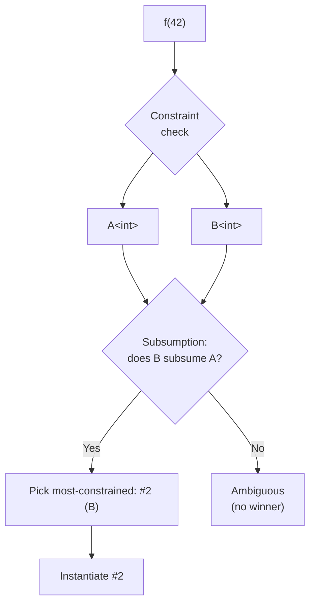

# Concepts (C++20)

## Why This Matters

Concepts are C++20's answer to the **three-decade-long pain of template error messages**. They let you express, in code, *what a template parameter must satisfy*, and they generate **human-readable diagnostics** when a caller violates the constraint.

Before concepts, every generic API was implicitly defined by the operations it performed — the so-called "implicit contracts" of templates. A `std::sort` call would compile if and only if `RandomIt` was actually random-access and `*it` was less-than-comparable, but the only way to discover that was to fail with a 200-line error pointing deep inside `std::sort`'s implementation. Concepts turn those implicit contracts into **first-class, named, reusable, composable** language constructs.

Concepts deliver:

1. **Documentation** — `template <std::random_access_iterator It>` reads as English.
2. **Better diagnostics** — `error: T does not satisfy concept Addable` instead of `error: no match for operator+`.
3. **Overload resolution that actually makes sense** — pick between overloads based on which concept is satisfied, instead of SFINAE acrobatics.
4. **Short-circuit evaluation** — combining constraints with `&&`, `||`, `!` works like logical operators, not like SFINAE conjunctions.
5. **A new design vocabulary** — generic code becomes a conversation about concepts, not about types.

This note covers the concept declaration syntax, `requires` clauses vs `requires` expressions, the standard library's `<concepts>` header, concept-based overloading, abbreviated function templates, and the migration path from SFINAE. It builds on [[1. Function Templates]], [[2. Class Templates]], [[3. Variadic Templates]], and especially [[4. SFINAE]].

## Background

### The path to concepts

The need for concepts was identified by Bjarne Stroustrup and Andrew Sutton around 2003; the first Concepts design (the so-called "Concepts Lite", based on predicates) was proposed around 2006 and almost made it into C++11. The full Concepts design was voted out of C++11 in 2009 because of complexity concerns. A second attempt (the "Concepts TS") shipped around 2015; a refined version finally landed in C++20 (the Sutton/Stroustrup design).

C++20's concepts are **purely syntactic** — they check that certain expressions are well-formed, not that they have particular semantics. A concept `Addable<T>` verifies that `a + b` compiles; it cannot verify that the result is the mathematical sum. This is a deliberate trade-off: semantic constraints would require runtime checks or formal specification, neither of which fits C++'s zero-overhead model. The naming convention is to give concepts names that imply their syntactic checks (e.g., `EqualityComparable`, not `Equal`).

### The problem with SFINAE (recap)

See [[4. SFINAE]] for the full critique. In short:

- Verbose (`enable_if<…>::type` everywhere).
- Catastrophic error messages (substitution failure dumps).
- No short-circuit evaluation.
- Hard to compose.
- Brittle: subtle differences between "substitution failure" and "hard error".

Concepts fix all of these.

## Main Content

### 1. Defining a concept

A **concept** is a named set of constraints. The simplest form is a **requires expression** wrapped in a concept declaration:

```cpp
template <typename T>
concept Addable = requires(T a, T b) {
    a + b;        // must compile; result type is not checked
};
```

The body of `requires(T a, T b) { … }` lists expressions that must be valid. The parameters `a` and `b` are *not* real variables — they are placeholders used only inside the requires expression, never evaluated.

A concept is a **compile-time predicate over types**: it evaluates to `true` or `false` for a given `T`. It can be used anywhere a constant boolean is needed:

```cpp
static_assert(Addable<int>);
static_assert(Addable<std::string>);
static_assert(!Addable<std::vector<int>>);     // no operator+ for vector
```

### 2. The four forms of `requires`

Concepts introduce **two distinct uses of the `requires` keyword** — easy to confuse, important to distinguish.

#### Form 1: requires expression (yields a bool)

```cpp
requires(T a, T b) { a + b; }    // this whole expression is bool
```

It can appear anywhere a boolean constant expression is expected — inside a concept definition, inside a `static_assert`, inside a constexpr if, even inside an `if constexpr` branch.

#### Form 2: requires clause (constrains a template)

```cpp
template <typename T>
requires Addable<T>
T sum(T a, T b) { return a + b; }
```

The `requires` clause here *constrains* the template — `sum` is only a candidate when `Addable<T>` is true.

#### Form 3: requires expression as a clause

```cpp
template <typename T>
requires requires(T a, T b) { a + b; }
T sum(T a, T b) { return a + b; }
```

Yes, you read that right: `requires requires`. The first `requires` introduces a constraint clause; the second is the requires-expression that yields the bool. This is valid but ugly; give the concept a name and write `requires Addable<T>` instead.

#### Form 4: trailing requires clause (for abbreviations and member functions)

```cpp
template <typename T>
void f(T x) requires Addable<T>;

// Member function:
template <typename T>
class Buffer {
public:
    void fill(int v) requires std::is_integral_v<T>;
};
```

### 3. Anatomy of a requires expression

Inside `requires(…) { … }`, four kinds of requirements are allowed:

#### (a) Simple requirements

An expression that must be valid:

```cpp
template <typename T>
concept Printable = requires(T x) {
    std::cout << x;
};
```

#### (b) Type requirements

`typename T::value_type` must name a valid type:

```cpp
template <typename T>
concept HasValueType = requires {
    typename T::value_type;
};
```

#### (c) Compound requirements

An expression must be valid AND its result must satisfy a constraint:

```cpp
template <typename T>
concept AddableNoThrow = requires(T a, T b) {
    { a + b } noexcept;                  // a + b must be noexcept
    { a + b } -> std::convertible_to<T>; // result must be convertible to T
};
```

#### (d) Nested requirements

`requires OtherConcept<T>` — imposes another concept as a sub-constraint:

```cpp
template <typename T>
concept Numeric = requires {
    requires std::integral<T> || std::floating_point<T>;
};
```

Combining these:

```cpp
template <typename T>
concept Iterator = requires(T it) {
    typename T::difference_type;
    typename T::value_type;
    { *it }  -> std::convertible_to<typename T::value_type>;
    { ++it } -> std::same_as<T&>;
    { it == it } -> std::convertible_to<bool>;
};
```

This reads almost like prose.

### 4. The standard `<concepts>` header

C++20 ships a library of pre-defined concepts in `<concepts>`. Highlights:

**Language-related:**

- `std::same_as<T, U>`
- `std::derived_from<D, B>`
- `std::convertible_to<From, To>`
- `std::common_reference_with<T, U>`
- `std::common_with<T, U>`
- `std::integral<T>`, `std::signed_integral<T>`, `std::unsigned_integral<T>`
- `std::floating_point<T>`
- `std::assignable_from<L, R>`
- `std::swappable<T>`, `std::swappable_with<T, U>`

**Lifetime:**

- `std::destructible<T>`
- `std::constructible_from<T, Args...>`
- `std::default_initializable<T>`
- `std::move_constructible<T>`, `std::copy_constructible<T>`

**Comparison:**

- `std::equality_comparable<T>`, `std::equality_comparable_with<T, U>`
- `std::totally_ordered<T>`, `std::totally_ordered_with<T, U>`

**Object semantics:**

- `std::movable<T>`, `std::copyable<T>`, `std::regular<T>`, `std::semiregular<T>`

**Callable:**

- `std::invocable<F, Args...>`, `std::regular_invocable<F, Args...>`
- `std::predicate<F, Args...>`

**Range-related (in `<ranges>`):**

- `std::ranges::range<R>`, `std::ranges::input_range<R>`, `std::ranges::forward_range<R>`, …, `std::ranges::contiguous_range<R>`
- `std::ranges::sized_range<R>`, `std::ranges::view<R>`

These cover the vast majority of common type-constraint needs. Prefer reusing them over writing your own.

### 5. Using concepts to constrain templates

#### As a template parameter "type"

```cpp
template <std::integral T>
T gcd(T a, T b) {
    while (b != 0) { T t = b; b = a % b; a = t; }
    return a;
}
```

This is the cleanest, most readable form. It reads like a function declaration. `T` is still a template parameter — there is no runtime polymorphism.

#### As a requires clause

```cpp
template <typename T>
requires std::integral<T>
T gcd(T a, T b) { /* … */ }
```

Equivalent to the previous form, but useful when you need to combine multiple constraints or apply them after the parameter list.

#### As an abbreviated function template

C++20 also lets you write:

```cpp
void print(const std::ranges::range auto& r) {
    for (const auto& x : r) std::cout << x << ' ';
    std::cout << '\n';
}
```

Every `auto` parameter is implicitly a template parameter, and any concept applied to `auto` constrains it. This is the closest C++ gets to "duck typing with type safety."

#### As a class template constraint

```cpp
template <std::totally_ordered T>
class SortedVector {
    std::vector<T> data_;
public:
    void insert(T x) {
        data_.push_back(std::move(x));
        std::sort(data_.begin(), data_.end());
    }
};
```

### 6. Combining concepts

Concepts compose with `&&`, `||`, and `!`:

```cpp
template <typename T>
concept Numeric = std::integral<T> || std::floating_point<T>;

template <typename T>
concept PrintableIntegral = std::integral<T> && requires(T x) {
    std::cout << x;
};
```

Short-circuit evaluation is guaranteed: if the left side of `||` is `true`, the right side is not checked (and any invalid types it would produce are not even instantiated). This is a major improvement over SFINAE's `conjunction`/`disjunction`, which sometimes evaluates both arms.

### 7. Subsumption and concept-based overloading

When multiple constrained templates are viable, the compiler picks the most-constrained one. The relationship between concepts is called **subsumption**: concept `A` subsumes concept `B` if every type satisfying `B` also satisfies `A`.

```cpp
template <typename T> concept A = std::integral<T>;
template <typename T> concept B = A<T> && std::signed_integral<T>;

template <typename T> void f(T) requires A<T> { std::cout << "A\n"; }   // #1
template <typename T> void f(T) requires B<T> { std::cout << "B\n"; }   // #2

f(42);    // int satisfies both A and B; B subsumes A, so #2 wins
f(true);  // bool satisfies A but not B; #1 wins
```

Subsumption is what makes concept-based overloading **predictable** — unlike SFINAE, where ordering between overloads depends on the partial-ordering rules of `enable_if` patterns, subsumption is a clean lattice over the constraint expressions.



### 8. Atomic constraints

Every constraint expression is decomposed into **atomic constraints** — the smallest indivisible bits (e.g., `std::integral<T>` is atomic; `A<T> && B<T>` is two atomic constraints). Two atomic constraints are considered *the same* if they come from the same source location. This is what allows subsumption to work: `B` is recognised as containing the atomic `std::integral<T>` and therefore subsuming `A`.

This means **spelling out the same condition twice doesn't count as subsumption**:

```cpp
template <typename T> concept C1 = std::integral<T>;
template <typename T> concept C2 = std::integral<T>;     // same condition, different concept
```

`C2` does not subsume `C1` — they're independent atomic constraints. This is the rule that prevents accidental ambiguity from refactoring.

### 9. Concept-based tag dispatch

A useful pattern: dispatch on a concept to choose a code path.

```cpp
template <typename T>
void serialize(const T& x) {
    if constexpr (std::is_trivially_copyable_v<T>) {
        std::memcpy(buf, &x, sizeof(x));
    } else if constexpr (requires { x.serialize_to(buf); }) {
        x.serialize_to(buf);
    } else {
        static_assert(sizeof(T) == 0, "No serialisation strategy for T");
    }
}
```

`if constexpr` with a `requires` expression on the condition is a powerful one-liner for dispatch. Note the third branch's `static_assert` uses a dependent false (`sizeof(T) == 0` is always false but is *dependent* on `T`, so it doesn't fire until that branch is taken — a common idiom before C++23 introduced `static_assert(false)` in dependent contexts).

### 10. Concepts for variadic templates

You can write variadic concepts:

```cpp
template <typename... Ts>
concept AllIntegral = (std::integral<Ts> && ...);

template <AllIntegral... Ts>
auto sum(Ts... args) { return (args + ... + 0); }
```

Variadic concepts combine naturally with fold expressions in the concept body.

### 11. Concepts and CTAD

Concepts integrate cleanly with class template argument deduction. Constrained constructors participate in CTAD; explicit deduction guides can be constrained:

```cpp
template <typename T>
class SortedVector {
public:
    SortedVector(std::vector<T> v) : data_(std::move(v)) {
        std::sort(data_.begin(), data_.end());
    }
    // …
};

template <std::ranges::range R>
SortedVector(R) -> SortedVector<std::ranges::range_value_t<R>>;

std::vector<int> v{3, 1, 4};
SortedVector sv{v};          // deduces SortedVector<int>
```

### 12. Real-world example: a `string_concat` that requires cheaply-convertible types

```cpp
#include <string>
#include <concepts>

template <typename T>
concept Stringable = std::convertible_to<T, std::string>;

template <Stringable... Ts>
std::string concat(const Ts&... parts) {
    std::string result;
    ((result += parts), ...);
    return result;
}

int main() {
    auto s = concat("Hello, ", std::string("world"), "!");
    // concat(42, "x");  // compile error: int is not Stringable
}
```

The error message reads:

```
error: no matching function for call to 'concat(int, const char [2])'
note: constraints not satisfied
note: 'Stringable<int>' was not satisfied because 'int' is not convertible to 'std::string'
```

Compare this with the SFINAE version's wall of substitution failures.

### 13. The `requires` expression vs `requires` clause (recap)

| Use case                                       | Form                                                  |
| ---------------------------------------------- | ----------------------------------------------------- |
| Define a named concept                         | `concept C = requires(T a) { … };`                    |
| Constrain a template                           | `template <C T> void f(T);`                           |
| Constrain a template with a clause             | `template <typename T> requires C<T> void f(T);`      |
| Constrain an abbreviated template              | `void f(C auto x);`                                   |
| Inline check inside a function body            | `if constexpr (requires { x.foo(); }) { … }`          |
| Combine inline check with named constraints    | `template <typename T> requires C<T> && requires(T x) { x.bar(); }` |

### 14. What concepts *don't* do

- **No semantic checking.** A concept `Addable<T>` checks that `a + b` compiles, not that it actually adds.
- **No runtime dispatch.** Concepts are entirely compile-time.
- **No concept reflection.** You can't iterate over the constraints of a concept, or ask "what concepts does T satisfy?" (proposed for C++26 via reflection).
- **No concept templates.** A concept can't be a template template parameter — it must be applied to a concrete type.
- **No overloading by concept alone for return types.** You can't have two functions `C1 T f()` and `C2 T f()` — overload resolution is by arguments, not return type.

## Code Examples

### Example A: a `Hashable` concept

```cpp
#include <concepts>

template <typename T>
concept Hashable = requires(T v) {
    { std::hash<T>{}(v) } -> std::convertible_to<std::size_t>;
};

template <Hashable T>
std::size_t hashed(const T& v) {
    return std::hash<T>{}(v);
}

static_assert(Hashable<int>);
static_assert(Hashable<std::string>);
// static_assert(Hashable<std::vector<int>>);   // fails: no std::hash<vector<int>>
```

### Example A2: a `Container` concept (composed)

```cpp
#include <concepts>
#include <iterator>

template <typename T>
concept Container = requires(T c) {
    typename T::value_type;
    typename T::iterator;
    typename T::const_iterator;
    { c.begin() } -> std::same_as<typename T::iterator>;
    { c.end()   } -> std::same_as<typename T::iterator>;
    { c.size()  } -> std::convertible_to<std::size_t>;
} && std::regular<T>;

static_assert(Container<std::vector<int>>);
static_assert(Container<std::string>);
```

### Example B: concept-based overloading

```cpp
#include <concepts>
#include <iostream>

template <std::integral T>
void describe(T x) { std::cout << "integer: " << x << '\n'; }

template <std::floating_point T>
void describe(T x) { std::cout << "float: " << x << '\n'; }

template <typename T>
requires std::convertible_to<T, std::string> && !std::integral<T> && !std::floating_point<T>
void describe(const T& x) { std::cout << "string-like: " << x << '\n'; }

int main() {
    describe(42);                 // integer
    describe(2.5);                // float
    describe("hello");            // string-like
}
```

### Example C: a more refined iterator concept

```cpp
template <typename I>
concept RandomAccessIterator = requires(I it, I other, typename std::iterator_traits<I>::difference_type n) {
    { it + n }  -> std::same_as<I>;
    { it - n }  -> std::same_as<I>;
    { it - other } -> std::same_as<typename std::iterator_traits<I>::difference_type>;
    { it[n] }   -> std::same_as<typename std::iterator_traits<I>::reference>;
    { it < other } -> std::convertible_to<bool>;
} && std::bidirectional_iterator<I>;
```

(In practice, prefer `std::random_access_iterator<I>` from `<iterator>`.)

### Example D: abbreviated templates

```cpp
#include <concepts>

auto add(std::integral auto a, std::integral auto b) {
    return a + b;
}

void print_all(const std::ranges::range auto& r) {
    for (const auto& x : r) std::cout << x << ' ';
}
```

### Example E: replacing SFINAE

```cpp
// Pre-C++20 SFINAE
template <typename T>
std::enable_if_t<std::is_integral_v<T>, T> square(T x) { return x * x; }

// C++20 concept
template <std::integral T>
T square(T x) { return x * x; }

// Or as an abbreviated template
auto square(std::integral auto x) { return x * x; }
```

## Common Pitfalls

- **`requires requires` confusion.** The first `requires` is the clause keyword; the second is the expression keyword. If you find yourself writing `requires requires`, you almost certainly want a named concept.
- **Forgetting the parameter list in a `requires` expression.** `requires { a + b; }` is wrong because `a` and `b` aren't in scope — write `requires(T a, T b) { a + b; }`.
- **Confusing `std::same_as<X, Y>` and `std::convertible_to<X, Y>`.** `same_as` requires exact type identity; `convertible_to` allows implicit conversions. They give very different overload sets.
- **Subsumption by accident.** Two concepts with *the same* atomic constraints subsume each other only if they refer to the same source location. If you accidentally refactor `concept C = std::integral<T>` into two separate definitions, subsumption between them silently breaks.
- **Trying to constrain return types for overload resolution.** C++ overload resolution is by argument types, not return types — you can't disambiguate overloads by return-type concept alone.
- **Concepts in `if constexpr` need parentheses.** `if constexpr (C<T>)` is fine; `if constexpr (requires { x.foo(); })` is fine; but `if constexpr requires { x.foo(); }` is a syntax error.
- **Concepts in member functions of unconstrained class templates** need a trailing `requires` clause, not a leading one. Use `void f() requires Concept<T>;`.
- **Concepts on `auto` parameters make the function a template.** `void f(C auto x);` *is* a template; `void f(int x);` is not. Mixing them in overload sets is the same as mixing template and non-template overloads — see [[1. Function Templates]].
- **Compound requirements' `-> Concept` syntax checks the result type, not the result value.** `{ a + b } -> std::same_as<int>` requires the result to be *exactly* `int`, not a type convertible to `int`.
- **Concepts cannot have state.** A concept is a pure compile-time predicate; you cannot give it data members or non-static functions.
- **Some standard concepts have subtle wording.** `std::regular<T>` requires default-constructible + copyable + equality-comparable; `std::semiregular<T>` drops equality. Misreading them leads to over-constrained code.

## Tips and Tricks

- **Name your concepts** in `PascalCase` and choose names that imply syntactic checks: `Addable`, `EqualityComparable`, `Iterable`, `Hashable`.
- **Reuse `<concepts>` and `<ranges>` predefined concepts** wherever possible. Standard names are familiar, well-tested, and consistent.
- **Compose concepts** with `&&`, `||`, `!` — far more readable than `conjunction`/`disjunction`.
- **Use `if constexpr (requires { … })`** for inline property checks; it's often cleaner than wrapping everything in a named concept.
- **Migrate SFINAE to concepts incrementally.** A `template <typename T, typename = enable_if_t<C<T>>>` becomes `template <C T>`. Do this in a sweep, file by file.
- **Document the *intent* of a concept** in a comment near its definition. The syntax says what's checked; the comment says why.
- **Combine concepts with ranges and views** for expressive dataflow code: `template <std::ranges::forward_range R> void process(R&& r)`.
- **Use `static_assert(Concept<T>)`** to give a clear early error if a type fails a constraint, before the rest of the code attempts to use it.
- **Constrain concept templates** themselves with other concepts to build hierarchies: `template <std::forward_iterator I> concept BidirIt = std::bidirectional_iterator<I>;` is redundant but illustrative.
- For member functions of a class template that should only exist for certain `T`, use a **trailing requires clause**: `void debug_dump() const requires Debuggable<T>;`.
- Prefer concepts over inheritance for **ad-hoc interfaces**. A free function `template <Drawable T> void render(T)` is more flexible than `void render(const Drawable&)`.
- Concepts and **`constexpr`/`consteval`** combine well — you can constrain a function template by a concept and require it be `constexpr`.
- Beware of **over-constraining**: don't ask for `std::movable<T>` when you only need `std::destructible<T>`. Excessive constraints defeat genericity.

## Active Recall

1. State the difference between a *requires expression* and a *requires clause*. Give an example of each.
2. What are the four kinds of requirements inside a requires expression? Show one example of each.
3. Define a concept `EquatableHashable<T>` that requires both `std::equality_comparable<T>` and a usable `std::hash<T>`.
4. Explain subsumption. Why does writing `concept C2 = std::integral<T>` separately from `concept C1 = std::integral<T>` *not* give subsumption between them?
5. Convert this SFINAE declaration to a C++20 concept: `template <typename T> std::enable_if_t<std::is_class_v<T> && std::is_default_constructible_v<T>, T> make();`
6. Why is short-circuit evaluation in concept composition important? Give a concrete example where SFINAE's lack of it causes a hard error.
7. Write an abbreviated function template that accepts any range of integers and sums them.
8. What does the compound requirement `{ a + b } -> std::same_as<int>` check? Is the result type checked, the value, or both?
9. Show how to use a concept inside an `if constexpr` to dispatch between two implementations.
10. Why can't you overload functions solely by return-type concept? What is the rule?
11. List five predefined concepts from `<concepts>` and one realistic use case for each.
12. Explain why concepts cannot enforce semantic properties (like "this `+` actually adds") and how this differs from e.g. Haskell type classes.
13. Convert this pre-C++20 member-detector SFINAE class into a C++20 concept: `template <typename T> struct has_foo : std::bool_constant<…> { … };`
14. What does `void f(C auto x);` declare? Is `f` a template? How does overload resolution interact with it?

## Next Steps

- [[4. SFINAE]] is the pre-C++20 technique that concepts replace; understanding both makes you bilingual.
- [[3. Variadic Templates]] combines with concepts for constrained variadic templates (`template <AllIntegral... Ts>`).
- [[6. CRTP]] and concepts can be combined to give static interfaces a named vocabulary.
- [[7. Compile-time Computation]] uses concepts to constrain compile-time functions and `if constexpr` branches.
- For real-world examples, browse `<ranges>` in [[11. STL Deep Dive]] — the entire ranges library is built on concepts.
- See [[8. Modern C++]] for the broader C++20 picture (ranges, modules, coroutines) that concepts were designed to enable.
