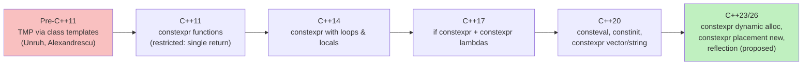

# Compile-time Computation

## Why This Matters

C++ is *Turing-complete at compile time*. The template system is a pure functional programming language embedded inside C++, capable of computing anything a Turing machine can — though usually at glacial compile speeds and with verbose, error-prone syntax. Over the last decade, the language has evolved a cleaner way to compute at compile time: `constexpr` functions, `consteval` (C++20), `if constexpr` (C++17), and the expanding set of types and operations allowed in constant expressions.

Compile-time computation matters because every computation moved from runtime to compile time is **free at runtime** — zero CPU cycles, zero memory access. Compilers can:

- Pre-compute lookup tables (sine tables, hash constants, CRC tables).
- Verify invariants with `static_assert` before the binary ever ships.
- Generate specialised code for known compile-time parameters (matrix sizes, policy flags).
- Replace `std::variant` dispatch tables with pre-computed jump tables.
- Build constexpr parsers (`std::format_string`, compile-time regex, C++26 reflection).

This note covers template metaprogramming (the original, painful approach), type lists, `constexpr` functions, `consteval`, `if constexpr`, and the modern recommendation: **prefer `constexpr` functions over template metaprogramming wherever possible**.

It builds on [[1. Function Templates]], [[2. Class Templates]], [[3. Variadic Templates]], [[4. SFINAE]], and [[5. Concepts (C++20)]].

## Background

### The accidental Turing machine

In 1994, Erwin Unruh published a C++ program that never compiled but whose *error messages* listed prime numbers — the templates were written such that the compiler attempted to instantiate `class IsPrime<N>` for many `N`, and only succeeded for primes. This demonstrated that C++ templates were, by accident, a Turing-complete pure functional language.

Each template instantiation is a "function call"; specialisations are pattern matches; partial specialisation provides recursion; `enum` values or `static constexpr` members are the "return values". The compilation phase is the "evaluation" of this language — and the compiler is allowed unlimited recursion up to an implementation-defined depth (typically 900 in GCC).

The original TMP idiom is famously ugly:

```cpp
template <int N>
struct Factorial {
    static constexpr int value = N * Factorial<N - 1>::value;
};
template <>
struct Factorial<0> {
    static constexpr int value = 1;
};

static_assert(Factorial<5>::value == 120);
```

`Factorial<5>` *is* 120 at compile time, but the cost is template recursion depth 5, a class instantiation per level, and unreadable syntax.

### The `constexpr` revolution

C++11 introduced `constexpr` functions — regular functions that the compiler *can* evaluate at compile time. C++14 relaxed the rules to allow loops, locals, and conditionals inside `constexpr` functions. C++17 added `if constexpr`. C++20 added `consteval` (must evaluate at compile time) and `constinit` (must initialise at compile time, but the object is not const). C++23 allowed `constexpr` to use `goto`, dynamic allocations (with restrictions), and more.

The same factorial becomes:

```cpp
constexpr int factorial(int n) {
    return n <= 1 ? 1 : n * factorial(n - 1);
}

static_assert(factorial(5) == 120);
```

A single, readable function. No template recursion. No class instantiations. The same function can be called at runtime too — `constexpr` means "compile-time *if possible*", not "compile-time *always*".



### The modern philosophy

> **Prefer `constexpr` functions over template metaprogramming.** Templates are for type-level computation; functions are for value-level computation. Use TMP only when you need to compute *types* (e.g., a type-list filter).

For values (factorial, Fibonacci, CRC tables, hashing), use `constexpr` functions. For types (type lists, conditional type selection, trait composition), use template specialisation. C++17's `if constexpr` and C++20's concepts further reduce the need for raw TMP.

## Main Content

### 1. Template metaprogramming basics

Template metaprogramming (TMP) treats template instantiations as function calls, partial specialisations as pattern matches, and `static constexpr` (or `enum`) members as return values.

```cpp
template <int N>
struct Pow {
    static constexpr int value = N * Pow<N - 1>::value;
};
template <int N>
requires (N == 0)
struct Pow<N> {                            // partial specialisation for N == 0
    static constexpr int value = 1;
};
// (more conventional: a full specialisation for Pow<0>)
```

Conventional base case:

```cpp
template <int N>
struct Pow {
    static constexpr int value = N * Pow<N - 1>::value;
};
template <>
struct Pow<0> {
    static constexpr int value = 1;
};
static_assert(Pow<2, 5>::value == 32);
```

Each instantiation of `Pow<N>` triggers `Pow<N-1>`, all the way down to `Pow<0>`. The compiler expands the chain at compile time. The result is a constant embedded directly in the binary.

The cost: linear in `N` template instantiations, which can be slow and memory-hungry. The `-ftemplate-depth=N` flag (default 900) limits recursion depth. A factorial of 1000 takes ~1000 instantiations and ~100ms; a factorial of 1000000 will hit the depth limit and fail.

### 2. Template recursion patterns

#### Pattern: Compile-time Fibonacci

```cpp
template <int N>
struct Fib {
    static constexpr long long value = Fib<N - 1>::value + Fib<N - 2>::value;
};
template <> struct Fib<0> { static constexpr long long value = 0; };
template <> struct Fib<1> { static constexpr long long value = 1; };

static_assert(Fib<10>::value == 55);
```

Naive Fibonacci: exponential template instantiations. The compiler memoises instantiations — `Fib<5>` is computed once, not `Fib(5)` runtime-style — but the code is still ugly.

#### Pattern: Type-level conditionals

`std::conditional` selects between two types at compile time:

```cpp
template <bool B, typename T, typename F>
struct conditional { using type = T; };
template <typename T, typename F>
struct conditional<false, T, F> { using type = F; };

template <bool B, typename T, typename F>
using conditional_t = typename conditional<B, T, F>::type;

using T = conditional_t<sizeof(int) == 4, int, long>;
```

### 3. Type lists

A type list is a compile-time list of types. The canonical implementation uses variadic templates (see [[3. Variadic Templates]]):

```cpp
template <typename... Ts> struct type_list {};

template <typename List> struct size;
template <typename... Ts>
struct size<type_list<Ts...>> {
    static constexpr std::size_t value = sizeof...(Ts);
};

template <typename List> struct head;
template <typename H, typename... R>
struct head<type_list<H, R...>> { using type = H; };

template <typename List> struct tail;
template <typename H, typename... R>
struct tail<type_list<H, R...>> { using type = type_list<R...>; };
```

Building on these primitives, you can implement higher-order operations: `push_front`, `push_back`, `concat`, `filter`, `transform`. These operations are the foundation of policy-based design and compile-time reflection libraries.

```cpp
// transform: apply a metafunction to each element
template <template <typename> class F, typename List> struct transform;
template <template <typename> class F, typename... Ts>
struct transform<F, type_list<Ts...>> {
    using type = type_list<typename F<Ts>::type...>;
};

// filter: keep elements where Pred<T>::value is true
template <template <typename> class Pred, typename List> struct filter;
template <template <typename> class Pred, typename H, typename... R>
struct filter<Pred, type_list<H, R...>> {
    using rest = typename filter<Pred, type_list<R...>>::type;
    using type = std::conditional_t<Pred<H>::value,
                                    typename push_front<H, rest>::type,
                                    rest>;
};
template <template <typename> class Pred>
struct filter<Pred, type_list<>> { using type = type_list<>; };
```

Type-list manipulation is exactly what `<ranges>` does under the hood — its view adaptors compose via type-level chains. Boost.MPL and Boost.Hana are libraries built around these patterns.

### 4. `constexpr` functions

A `constexpr` function is allowed to be evaluated at compile time. The compiler will evaluate it at compile time when:

- It appears in a constant-expression context (`static_assert`, array bounds, NTTP, `constexpr` variable initialiser).
- All its arguments are constant expressions and the implementation can be evaluated at compile time.

Otherwise, it's a normal runtime function.

```cpp
constexpr int factorial(int n) {
    int result = 1;
    for (int i = 2; i <= n; ++i) result *= i;
    return result;
}

static_assert(factorial(5) == 120);         // compile-time
int n;
std::cin >> n;
int x = factorial(n);                       // runtime — perfectly fine
```

What you can do in a `constexpr` function (C++14+):

- Loops (`for`, `while`, `do-while`).
- Local variables, including non-const ones.
- `if`/`else` statements.
- Multiple `return` statements.
- Lambda expressions (C++17+).

What you still can't do (in C++20):

- Throw exceptions (allowed by the standard but discarded during constant evaluation — a thrown exception causes the constant evaluation to fail).
- Use `goto` (allowed in C++23).
- Use `asm`.
- Call a non-`constexpr` function.
- Read a non-const global.
- Take the address of a non-`constexpr` global.

C++20 allows `constexpr` allocations (`new`/`delete`) inside `constexpr` functions, as long as the allocation is freed within the same evaluation. This enables `constexpr std::vector` and `constexpr std::string`:

```cpp
#include <vector>
constexpr int sum_of(int n) {
    std::vector<int> v;
    for (int i = 1; i <= n; ++i) v.push_back(i);
    int s = 0; for (int x : v) s += x;
    return s;
}
static_assert(sum_of(10) == 55);
```

### 5. `if constexpr` (C++17)

`if constexpr` discards the not-taken branch at compile time — no instantiation, no code generation, no syntax errors in the discarded branch.

```cpp
template <typename T>
auto get_value(T t) {
    if constexpr (std::is_pointer_v<T>) {
        return *t;
    } else {
        return t;
    }
}
```

Without `if constexpr`, the `*t` branch would fail to compile for non-pointer `T`. With it, the branch is discarded before the compiler checks its validity.

`if constexpr` replaces:

- Tag dispatch (a pre-C++17 idiom using overload resolution to pick an implementation).
- SFINAE-based dispatch (see [[4. SFINAE]]).
- Specialisation of function templates (you can't partially specialise a function template — `if constexpr` inside the function achieves the same effect).

Combined with `requires` expressions (C++20), `if constexpr` becomes a powerful inline dispatch tool:

```cpp
template <typename T>
void process(T& x) {
    if constexpr (requires { x.optimise(); }) {
        x.optimise();              // only if T has optimise()
    } else if constexpr (std::is_trivially_copyable_v<T>) {
        /* fast path */
    } else {
        /* generic path */
    }
}
```

### 6. `consteval` (C++20) — mandatory compile-time

`consteval` declares a function that **must** be evaluated at compile time. Calling it from a runtime context is a compile error.

```cpp
consteval int square(int x) { return x * x; }

constexpr int s5 = square(5);    // OK
int runtime = 5;
// int r = square(runtime);      // ERROR: not a constant expression
```

Use cases:

- Compile-time-only parsers (`std::format_string<Args...>` is a `consteval`-checked format string).
- Compile-time configuration: force callers to provide compile-time-known values.
- Security: prevent runtime-generated values from reaching sensitive code paths.

### 7. `constinit` (C++20) — compile-time initialisation

`constinit` enforces that a variable is initialised at compile time, but the variable itself is *not* `const` — it can be mutated at runtime.

```cpp
constinit int counter = factorial(5);   // initial value computed at compile time
void inc() { ++counter; }                // legal runtime mutation

// Without constinit:
int slow_counter = factorial(5);         // initialised at runtime (SIOF risk)
const int fast_counter = factorial(5);   // initialised at compile time, but const
```

`constinit` solves the **Static Initialisation Order Fiasco (SIOF)** — the problem where two translation-unit-scope `static` variables in different TUs initialise in an unspecified order, and one depends on the other. A `constinit` variable is initialised before any dynamic initialisation runs, so dependencies on it are safe.

### 8. `consteval` vs `constexpr` vs `constinit` — the mnemonic

| Keyword       | Evaluates at compile time? | Evaluates at runtime? | Variable mutable? |
| ------------- | -------------------------- | --------------------- | ----------------- |
| `constexpr`   | Yes, *if possible*         | Yes, when not in const context | (variable is `const`) |
| `consteval`   | Always (required)          | Never                 | N/A (function only) |
| `constinit`   | Initialiser only           | Variable usable at runtime | Yes               |
| `const`       | Maybe                      | Yes                   | No                |

### 9. Compile-time lookup tables

A canonical use: pre-compute a sine table at compile time.

```cpp
#include <array>
#include <cmath>

template <std::size_t N>
constexpr auto make_sine_table() {
    std::array<double, N> table{};
    for (std::size_t i = 0; i < N; ++i) {
        table[i] = std::sin(i * 6.28318530718 / N);     // C++23: std::sin is constexpr
    }
    return table;
}

// Note: pre-C++23, std::sin wasn't constexpr — implement a Taylor-series version.
constexpr auto sine_table = make_sine_table<360>();
// Embedded in .rodata, zero runtime cost.
```

### 10. Compile-time parsing

`std::format` uses `consteval` to parse the format string at compile time, producing a compile-time-verified, type-checked formatter. The same pattern can build compile-time regex matchers, compile-time JSON validators, and compile-time command-line parsers.

A toy example: parse a format string at compile time and verify its placeholders.

```cpp
#include <string_view>
#include <concepts>

template <std::size_t N>
struct FixedString {
    char data[N];
    consteval FixedString(const char (&s)[N]) {
        for (std::size_t i = 0; i < N; ++i) data[i] = s[i];
    }
};

template <FixedString fmt>
consteval std::size_t count_placeholders() {
    std::size_t count = 0;
    for (char c : fmt.data) if (c == '%') ++count;
    return count;
}

template <FixedString fmt, typename... Args>
void checked_print(Args... args) {
    static_assert(count_placeholders<fmt>() == sizeof...(Args),
                  "Number of % placeholders must match argument count");
    // …
}

checked_print<"Hello %, %!\n">("Alice", 42);   // OK
// checked_print<"Hi %\n">("Alice", 42);        // static_assert fails
```

This is the technique behind `std::format_string`. `FixedString` is a non-type template parameter of literal class type — a C++20 feature (see [[2. Class Templates]]).

### 11. Type traits as compile-time computation

The `<type_traits>` header is, at its core, a giant compile-time computation library over types. Each trait (`is_integral`, `is_pointer`, `remove_const`, `decay`, etc.) is a class template whose `::value` or `::type` is the "result" of a type-level computation.

```cpp
// Strip all cv-qualifiers and reference: std::decay
template <typename T>
struct decay {
    using type = std::remove_cv_t<std::remove_reference_t<T>>;
};
```

These traits compose: `decay_t<remove_reference_t<const int&>>` is `int`. They're the type-level equivalent of `constexpr` functions.

### 12. Compile-time hashing and cryptography

With `constexpr` functions covering more of the standard library, you can compute hashes at compile time:

```cpp
constexpr std::uint64_t fnv1a_64(std::string_view s) {
    std::uint64_t hash = 0xcbf29ce484222325ULL;
    for (char c : s) {
        hash ^= static_cast<std::uint64_t>(c);
        hash *= 0x100000001b3ULL;
    }
    return hash;
}

constexpr auto id_hash = fnv1a_64("user_authenticated");
// Embedded in the binary as a constant — the string is gone from .rodata.
```

This pattern is used in switch-on-string (compile-time string-to-enum), in shader parameter names, and in compile-time-obfuscated strings (a mild security-through-obscurity technique).

### 13. Limits and pitfalls of compile-time computation

- **Compile time grows linearly** with the size of the computation. Compiling a factorial of 10000 takes noticeable time.
- **Recursion depth is limited** by `-ftemplate-depth=N` (TMP) and the compiler's internal limits (constexpr).
- **Memory pressure**: each template instantiation consumes compiler memory. A 1000-element TMP computation can require hundreds of MB.
- **Some operations are not yet `constexpr`**: most file I/O, networking, threading. C++23 brought many stdlib algorithms to `constexpr`; C++26 will likely bring more.
- **`consteval` cannot be partially evaluated.** Either everything is compile-time or the call fails. `constexpr` is more flexible.
- **Debugging is harder.** You can't put a breakpoint in a `constexpr` evaluation; you can only inspect the result.
- **Error messages can be cryptic** when a `constexpr` evaluation fails — "constant evaluation failed" with a deep stack of internal notes.

### 14. The `consteval`-`constexpr` boundary

A `consteval` function may call a `constexpr` function (it's forced to evaluate at compile time anyway). A `constexpr` function may call a `consteval` function *only if* the constexpr function is currently being evaluated in a constant context. This can lead to confusing "immediate function" errors:

```cpp
consteval int square(int x) { return x * x; }
constexpr int twice_square(int x) { return 2 * square(x); }   // OK in const context
int runtime_x = 5;
int y = twice_square(runtime_x);    // ERROR: square() must be consteval,
                                    // but twice_square is being called at runtime
```

The fix is to either mark `twice_square` `consteval` too, or to provide a `constexpr` (non-`consteval`) version of `square`.

## Code Examples

### Example A: factorial — every era

```cpp
// C++98 TMP
template <int N> struct FactTMP { static constexpr int value = N * FactTMP<N - 1>::value; };
template <>      struct FactTMP<0> { static constexpr int value = 1; };
static_assert(FactTMP<5>::value == 120);

// C++11 constexpr (single return only)
constexpr int fact11(int n) { return n <= 1 ? 1 : n * fact11(n - 1); }
static_assert(fact11(5) == 120);

// C++14 constexpr (loops allowed)
constexpr int fact14(int n) {
    int r = 1; for (int i = 2; i <= n; ++i) r *= i; return r;
}
static_assert(fact14(5) == 120);

// C++20 consteval (must be compile-time)
consteval int fact20(int n) {
    int r = 1; for (int i = 2; i <= n; ++i) r *= i; return r;
}
static_assert(fact20(5) == 120);
```

### Example B: compile-time power

```cpp
constexpr double power(double base, int exp) {
    double result = 1.0;
    for (int i = 0; i < exp; ++i) result *= base;
    return result;
}

static_assert(power(2.0, 10) == 1024.0);

template <int Exp>
constexpr double power_of_2 = power(2.0, Exp);    // variable template (C++14)
```

### Example C: type-level list operations

```cpp
#include <type_traits>

template <typename... Ts> struct type_list {};

template <typename L> struct size;
template <typename... Ts> struct size<type_list<Ts...>> {
    static constexpr std::size_t value = sizeof...(Ts);
};

template <typename T, typename L> struct push_front;
template <typename T, typename... Ts>
struct push_front<T, type_list<Ts...>> { using type = type_list<T, Ts...>; };

template <typename L> struct head;
template <typename H, typename... R>
struct head<type_list<H, R...>> { using type = H; };

template <typename L> struct tail;
template <typename H, typename... R>
struct tail<type_list<H, R...>> { using type = type_list<R...>; };

static_assert(size<type_list<int, double, char>>::value == 3);
static_assert(std::is_same_v<head<type_list<int, double>>::type, int>);
static_assert(std::is_same_v<push_front<float, type_list<int, double>>::type,
                             type_list<float, int, double>>);
```

### Example D: `if constexpr` dispatch

```cpp
#include <type_traits>
#include <iostream>

template <typename T>
void inspect(T&& x) {
    if constexpr (std::is_integral_v<std::decay_t<T>>) {
        std::cout << "integer: " << x << '\n';
    } else if constexpr (std::is_floating_point_v<std::decay_t<T>>) {
        std::cout << "float: " << x << '\n';
    } else if constexpr (std::is_pointer_v<std::decay_t<T>>) {
        std::cout << "pointer to " << *x << '\n';
    } else {
        std::cout << "other\n";
    }
}
```

### Example E: compile-time CRC table

```cpp
#include <array>
#include <cstdint>

constexpr std::uint32_t crc32_poly = 0xEDB88320u;

constexpr std::array<std::uint32_t, 256> make_crc_table() {
    std::array<std::uint32_t, 256> t{};
    for (std::uint32_t i = 0; i < 256; ++i) {
        std::uint32_t c = i;
        for (int k = 0; k < 8; ++k)
            c = (c & 1) ? (crc32_poly ^ (c >> 1)) : (c >> 1);
        t[i] = c;
    }
    return t;
}

constexpr auto crc_table = make_crc_table();     // computed at compile time
```

### Example F: a `consteval` format-string checker

```cpp
#include <string_view>

consteval bool balanced_parens(std::string_view s) {
    int depth = 0;
    for (char c : s) {
        if (c == '(') ++depth;
        else if (c == ')') { if (--depth < 0) return false; }
    }
    return depth == 0;
}

template <std::size_t N>
struct Str {
    char data[N];
    consteval Str(const char (&s)[N]) {
        for (std::size_t i = 0; i < N; ++i) data[i] = s[i];
    }
};

template <Str s>
constexpr bool verified = balanced_parens(s.data);

static_assert(verified<"((()))">);
static_assert(!verified<"(()">);
// static_assert(verified<"(()">);    // FAILS
```

## Common Pitfalls

- **Naive recursive TMP is exponential** for things like Fibonacci. Memoise by ensuring each instantiation is computed once (the compiler does this automatically for templates, but only if you actually share the instantiations).
- **Hitting `-ftemplate-depth`** when computing large values with TMP. Either increase the limit (`-ftemplate-depth=5000`) or switch to a `constexpr` function.
- **`if constexpr` is not the same as `if`** in a non-template context — both branches are still type-checked in non-template code. `if constexpr` only suppresses the not-taken branch in *dependent* (template) contexts.
- **`consteval` called from a runtime context** is a hard error. Provide a `constexpr` overload if you need both worlds.
- **Compile-time allocations must be freed within the same evaluation.** A `constexpr std::vector` that returns its contents as a `std::vector` to a runtime caller would have to release its storage, which can't be done across the constant/runtime boundary. (C++20 lets you produce a non-owning view, though.)
- **UB in a `constexpr` evaluation fails** — most UB is detected at compile time when it occurs in a `constexpr` context. This is *good* (catches bugs early), but it surprises people who expect UB to "just work."
- **Floating-point `constexpr` may differ** between compilers because FP rounding is implementation-defined. Use integer-only computation where reproducibility matters.
- **`constinit` requires a constant initialiser.** A dynamic-initialiser function call (e.g., `constinit int x = some_runtime_func();`) is ill-formed.
- **Templates don't compose across translation units well.** A TMP-heavy header included in 1000 TUs is *1000 times* the work. Use precompiled headers or modules (C++20) to mitigate.
- **Compile-time computation is not free**, just free at runtime. It costs compile time and binary size. Don't pre-compute lookup tables of 100 million entries.

## Tips and Tricks

- **Prefer `constexpr` functions over TMP** for value-level computation. They're clearer, faster to compile, and produce smaller binaries.
- **Use `if constexpr` instead of tag dispatch or SFINAE** for compile-time branching inside a single function.
- **Use `consteval`** for security- or correctness-critical compile-time-only code (format strings, parsers, configuration validation).
- **Use `constinit`** for static-duration variables to avoid the SIOF.
- **Use `static_assert` aggressively** to verify invariants at compile time. It costs nothing at runtime and catches bugs early.
- **Pre-compute lookup tables** (CRC, sine, hash, gamma) as `constexpr std::array` variables — they end up in `.rodata` and never cost runtime cycles.
- **Use variable templates** (`template <int N> constexpr int fib = …;`) for compile-time constants that depend on a parameter.
- **Profile compile time.** Tools like `-ftime-report` (GCC/Clang) and Buildanalyzer show where template instantiation costs are concentrated.
- **Use modules (C++20)** to reduce template instantiation redundancy across TUs.
- For type-level computation, **prefer alias templates** (`template <typename T> using foo = …;`) over nested `::type` typedefs.
- **Combine concepts with `if constexpr`** for expressive compile-time dispatch: `if constexpr (Concept<T>) { … }`.
- For recursive computations in `constexpr` functions, prefer **iteration over recursion** — compilers optimise loops far better than recursion, and there's no template-depth limit.
- **`constexpr` lambdas** (C++17) let you pass compile-time callables to standard algorithms: `constexpr auto add = [](int a, int b) { return a + b; };`.
- Use **C++23's `if consteval`** when you need to detect constant-evaluation context without `if constexpr (std::is_constant_evaluated())`.

## Active Recall

1. Why is C++ considered Turing-complete at compile time? Name the language features that make this possible.
2. Implement factorial three ways: with TMP, with C++11 `constexpr`, and with C++14 `constexpr`. Compare readability and compile time.
3. What does `if constexpr` do that ordinary `if` does not? Give an example where ordinary `if` would fail to compile but `if constexpr` succeeds.
4. Explain the difference between `constexpr`, `consteval`, and `constinit`. Give a one-sentence use case for each.
5. Why must compile-time allocations be freed within the same constant evaluation? What pattern does this enable (and what does it forbid)?
6. Implement a type list with `size`, `head`, `tail`, and `push_front`. Show a `static_assert` exercising each.
7. Convert this TMP `conditional<B, T, F>` into the C++14 alias form using `std::conditional_t`.
8. Write a `consteval` function that verifies a string has balanced parentheses, and call it from a `static_assert`.
9. How does `std::format_string` use `consteval` to enforce type safety? Sketch the mechanism.
10. Why is naive TMP Fibonacci exponential in source size while `constexpr` Fibonacci is linear?
11. Show how `constinit` solves the Static Initialisation Order Fiasco. Why doesn't `constexpr` alone solve it?
12. List three standard-library components (e.g., `std::sin`, `std::vector`, `std::sort`) that became `constexpr` in C++20 or C++23. What does that unlock?
13. Convert this SFINAE-based dispatch to a C++17 `if constexpr` version:
    ```cpp
    template <typename T> auto f(T t) -> std::enable_if_t<std::is_pointer_v<T>, decltype(*t)> { return *t; }
    template <typename T> auto f(T t) -> std::enable_if_t<!std::is_pointer_v<T>, T> { return t; }
    ```
14. What is the C++20 `consteval` "immediate function" rule, and how can it cause surprises when a `constexpr` function calls a `consteval` one?

## Next Steps

- [[1. Function Templates]] and [[2. Class Templates]] provide the underlying mechanism.
- [[3. Variadic Templates]] is the foundation of type-list manipulation.
- [[4. SFINAE]] and [[5. Concepts (C++20)]] let you constrain which compile-time computations apply to which types.
- [[6. CRTP]] uses templates as a compile-time polymorphism tool — closely related to compile-time computation.
- For real-world examples, see `std::format`, `std::bitset`, `std::array` initialisation, and the `<ranges>` infrastructure — all rely heavily on compile-time computation. Browse [[11. STL Deep Dive]].
- For modern alternatives to TMP, see [[8. Modern C++]] for the full C++20/23 timeline.
